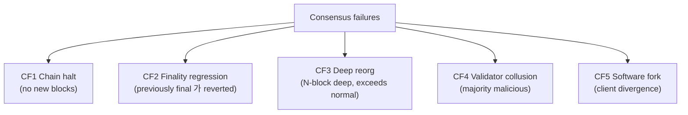
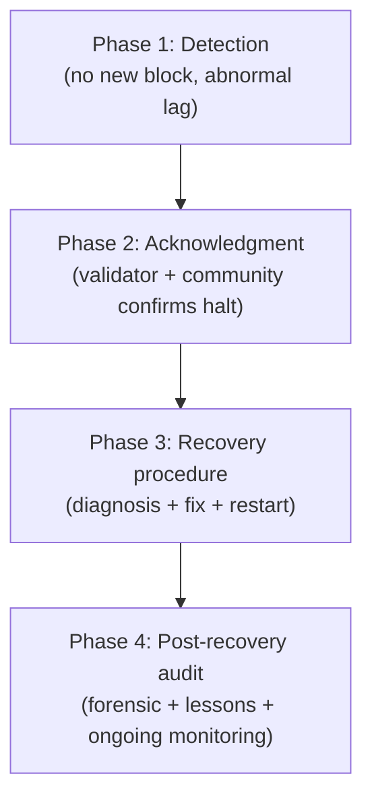
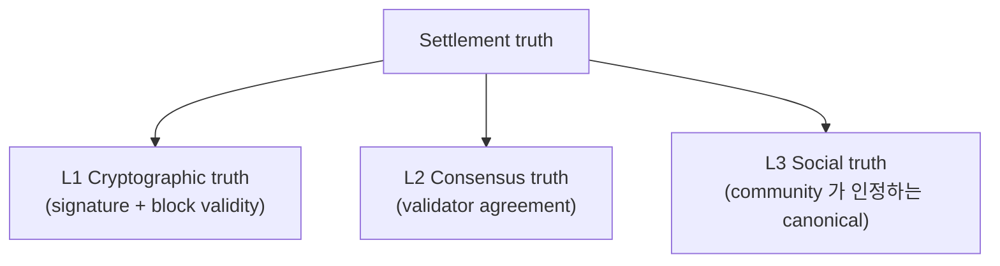
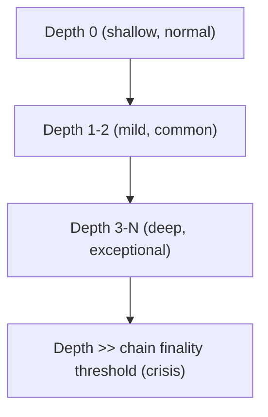
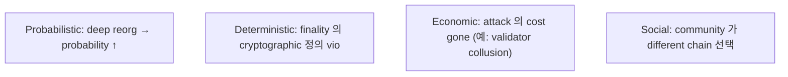
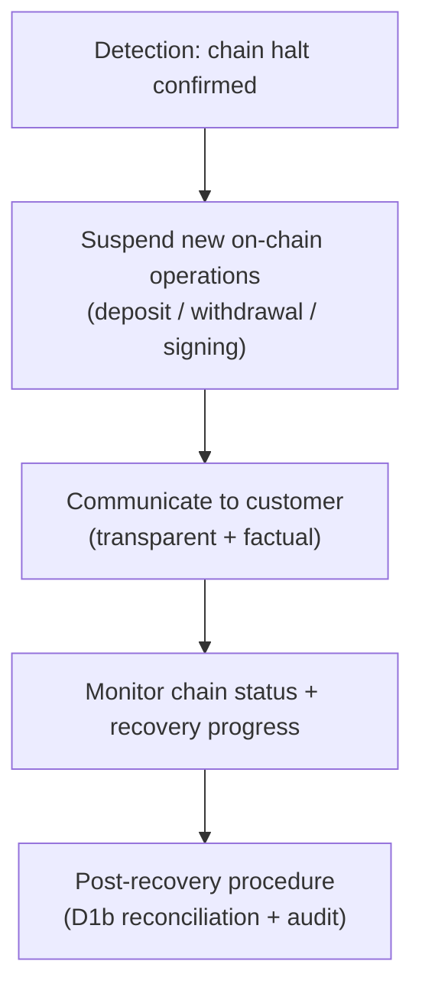
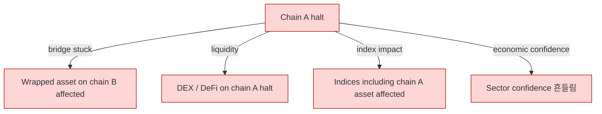

# Custody Wallet — Consensus Failure / Chain Halt Reasoning

> **본 문서의 위치 (Crisis Cluster D22)**: D9 multi-chain + D1b reconciliation + D5 evidence 위의 **chain-level catastrophic failure**. D21 의 trust collapse 의 chain-side equivalent. Settlement truth 의 chain 의 own 의 fragmentation event.

> **본 문서가 답하는 핵심 질문**: 왜 chain halt 가 settlement halt 와 다른가? 왜 finality ambiguity 가 double-spend certainty 가 아닌가? 왜 canonical chain 이 social consensus permanence 보장 아닌가? 왜 reorg recovery 가 state certainty 가 아닌가? 왜 technical recovery 가 institutional recovery 가 아닌가?

---

## 0. 핵심 명제 (10초 이해)

1. **Chain consensus failure = settlement truth fragmentation** (core thesis).
2. **Chain halt = hidden institutional dependency exposure** (secondary thesis).
3. **5-tier "≠" 명제 (D22 cluster invariant)**:
   - Chain halt ≠ Settlement halt
   - Finality ambiguity ≠ Double-spend certainty
   - Canonical chain ≠ Social consensus permanence
   - Reorg recovery ≠ State certainty
   - Technical recovery ≠ Institutional recovery
4. **5 consensus failure type** — Halt / Finality regression / Deep reorg / Validator collusion / Software fork.
5. **Settlement truth = social construct + cryptographic primitive** — chain 의 truth 도 community consensus 위에.
6. **Chain halt 의 4-phase** — Detection / Acknowledgment / Recovery procedure / Post-recovery audit.
7. **Hidden temporal dependency** — institutional systems assume chain 의 continuous progression.
8. **Validator coordination = inter-stakeholder governance** — technical 만의 영역 아님.
9. **Custody system 의 chain-agnostic 한계** — same chain 의 halt 가 모든 customer affect.
10. **Chain halt 의 customer burden ~95%** — vendor 의 chain failure 대응 기능 매우 제한.

---

## 1. Consensus Failure Taxonomy

### 1.1 5 consensus failure type



### 1.2 Type 별 특성

| Type | Detection | Recovery | Custody impact |
|---|---|---|---|
| CF1 Chain halt | Easy (no new blocks) | Validator coordination | Settlement paused |
| CF2 Finality regression | Medium (depth analysis) | Restart from canonical | Previously confirmed = uncertain |
| CF3 Deep reorg | Easy (after) | Compensating entries | Multi-tx affected |
| CF4 Validator collusion | Hard (game theory) | Hard fork / community decision | Trust crisis |
| CF5 Software fork | Easy (different chain head) | Client update + chain selection | Chain selection dilemma |

### 1.3 "Chain halt ≠ Settlement halt"

(§0 명제)

- Chain halt: chain 자체 의 progression 정지.
- Settlement halt: settlement 의 의도적 / 외부적 정지.
- 차이:
  - Chain halt = technical (validator coordination failure)
  - Settlement halt = operational decision (D21 §5.5)
  - Chain halt 시 custody 의 settlement 가 자동 정지 (chain 의 의존 때문)
- → Chain halt 가 settlement halt 의 cause 일 수 있지만 다른 phenomenon.

### 1.4 Chain halt 의 historical examples

(★ Hypothesis — operational pattern, 실제 industry event 참조)

- Solana 의 historical halt (multiple times, ~hours each)
- Polygon 의 brief halt
- Various L2 의 sequencer downtime
- → Probabilistic / hybrid finality chain 의 production halt 흔함.

### 1.5 "Canonical chain ≠ Social consensus permanence"

(§0 명제)

- Canonical chain = current longest valid chain (or rule-determined).
- Social consensus permanence = community 가 영구적으로 인정.
- 차이:
  - Hard fork 시 social consensus 가 canonical chain 변경 가능
  - Ethereum DAO fork (2016) = canonical change via social decision
  - Bitcoin Cash fork (2017) = canonical split
- → Chain truth 도 social construct.

---

## 2. Chain Halt Lifecycle

### 2.1 4-phase lifecycle



### 2.2 Detection의 challenge

- Block time variance (normal jitter) vs halt:
  - 평소 12s block time chain 의 30s gap 가 halt?
  - 1min gap 가 anomaly?
  - 10min gap 가 confirmed halt?
- → Detection 의 threshold 가 chain-specific operational decision.

### 2.3 Acknowledgment 의 social aspect

- Halt 가 confirmed 되려면:
  - Multiple node operator 가 인정
  - Validator community 의 communication
  - Public information 의 emergence (twitter, etc.)
- → Technical halt + social confirmation 의 결합.

### 2.4 Recovery procedure

- Validator coordination meeting
- Root cause analysis
- Patch / config 변경
- Coordinated restart (canonical genesis 결정 + 모두 동시 restart)
- → Hours to days 의 procedure.

### 2.5 Post-recovery audit

- Halt 의 root cause 공개.
- 영향받은 tx 의 status 명확화.
- Future prevention measure.
- → Community trust 회복.

---

## 3. Settlement Truth Fragmentation

### 3.1 Settlement truth 의 3-layer



### 3.2 Fragmentation 의 의미

- Normal: 3 layer 가 align (cryptographic + consensus + social 모두 same chain).
- Crisis: 3 layer 의 divergence:
  - Cryptographic valid but consensus disputed
  - Consensus chain 이 social rejection (hard fork 의 source)
  - Multiple chain head (chain split)

### 3.3 "Finality ambiguity ≠ Double-spend certainty"

(§0 명제)

- Finality ambiguity = 어느 chain head 가 canonical 인지 모름.
- Double-spend certainty = same fund 가 actually two place 에 spent.
- 차이:
  - Ambiguity 는 uncertainty (might not be double-spend)
  - Wait + canonical 결정 = ambiguity 해소 가능
  - Actual double-spend 는 chain split 의 specific outcome
- → Ambiguity ≠ failure, but suspended state.

### 3.4 Suspended settlement state

```
ChainStatusEnum:
  FINAL (cryptographic + consensus + social all agreed)
  AMBIGUOUS (uncertain canonical)
  HALTED (no progression)
  DOUBLE_SPEND_RISK (chain split with same tx)
  REORGED_OUT (was final, now not)
```

### 3.5 Custody system 의 response to ambiguity

- 모든 chain-side 의 final state 의 freeze (no withdrawals).
- Deposit 의 hold (accept but not credit).
- Communication 으로 customer 의 expectation set.
- Wait for resolution.
- → Custody 의 "wait state".

---

## 4. Reorg Crisis

### 4.1 Reorg severity scale



### 4.2 Deep reorg 의 impact

- Depth N 이 chain 의 finality threshold 초과 시:
  - Previously "Final" 이 reverted
  - Custody 의 confirmed transaction 의 status 변경
  - Compensating LedgerEntry (D1b §7.2) 의 mass invocation
  - Customer-facing impact (deposit 사라짐, withdrawal 다시)
- → Operational + reputational crisis.

### 4.3 "Reorg recovery ≠ State certainty"

(§0 명제)

- Reorg recovery = compensating entry + new chain head adoption.
- State certainty = 새 state 가 영구적이라는 확신.
- 차이:
  - Reorg 가 다시 reverse 가능 (extreme)
  - 새 chain head 도 future reorg risk
- → Recovery 후에도 cautious posture 유지 시간 필요.

### 4.4 Reorg 의 governance dimension (D1b §7.5 의 deep dive)

- Deep reorg 시:
  - Chain selection 의문 (follow new chain or stay original?)
  - 51% attack 의심 시 freeze
  - Customer protection 결정
- → Manual governance decision 필요.

### 4.5 Cross-chain reorg propagation

- Bridge 통해 cross-chain 으로 propagate:
  - Source chain reorg → destination chain wrapped 의 backing 의 의문
  - Bridge attestation 의 reset
- → Reorg 의 cross-chain compound risk.

---

## 5. Finality Collapse

### 5.1 "Finality" 의 multiple definition

| Definition | 의미 |
|---|---|
| **Probabilistic finality** | Reorg probability ≤ threshold |
| **Deterministic finality** | Cryptographic proof of finality |
| **Economic finality** | Reversal 의 economic cost too high |
| **Social finality** | Community 가 인정 |

### 5.2 Finality 의 multi-tier collapse



### 5.3 "Finality" 의 chain-specific 의미 (D9 §4.2 의 crisis 측면)

- Bitcoin: probabilistic (no deterministic)
- Ethereum: hybrid (probabilistic + 2-epoch deterministic)
- Cosmos / Tendermint: deterministic (instant)
- → Crisis 시 의 finality 의 의미가 chain 별 다름.

### 5.4 Custody 의 finality reliance

- Custody system 의 internal ledger 의 "Final" status 는 chain finality 에 의존.
- Chain finality 의 redefinition 시 custody 의 internal state 도 의문.
- → Chain-specific finality assumption 의 documentation 중요.

### 5.5 Post-collapse finality re-establishment

- Crisis 후:
  - Chain 의 new finality definition (예: deeper threshold)
  - Custody 의 internal policy adjust
  - Customer communication
- → Finality 도 evolving concept.

---

## 6. Validator Coordination Failure

### 6.1 Validator coordination 의 의존성

- Modern PoS chains: 33% / 50% / 67% 의 validator set 의 agreement 의존.
- Coordination failure scenarios:
  - 33%+ offline → chain halt (PoS finality 기준)
  - 50%+ offline → 일부 chain liveness 영향
  - 67%+ malicious → safety violation (double-spend possible)

### 6.2 Coordination failure 의 source

| Source | 의미 |
|---|---|
| Software bug | Same bug 가 multiple node affect (monoculture) |
| Network split | Geographic / ISP split → validator 격리 |
| Coordinated attack | Adversarial (state-sponsored, etc.) |
| Validator economic | MEV / fee 의 race condition |
| Regulatory action | Validator 의 jurisdiction action |

### 6.3 Validator client diversity

(★ Hypothesis — operational pattern)

- Single client implementation = monoculture risk.
- Multiple client diversity = robustness:
  - Ethereum: Geth / Nethermind / Besu / Erigon
  - Cosmos: 다양한 client
- → Client diversity 가 systemic resilience.

### 6.4 "Validator collusion" reasoning

- Theoretical: 67%+ validator 의 coordinated misbehavior.
- 가능한 motivation:
  - Financial gain (double-spend)
  - Regulatory pressure
  - Geographic concentration 의 single point of failure
- → Validator decentralization 의 importance.

### 6.5 Slashing 의 game theory

- Slashing = validator misbehavior 의 economic penalty.
- 효과:
  - Coordination 의 cost ↑ (slash 위험)
  - 그러나 if reward > slash → still rational
- → Game-theoretic equilibrium 의 maintenance.

---

## 7. Custody Response

### 7.1 Custody 의 chain halt response



### 7.2 Suspension 의 scope

| Operation | Suspend? |
|---|---|
| New deposit recognition | Hold (visible but not credited until chain recover) |
| New withdrawal signing | Suspend (no new tx during halt) |
| Pending tx (already broadcast) | Wait (status unknown) |
| Customer transfers (internal omnibus) | Continue (D18 internal) |
| Other-chain operations | Continue (chain-specific) |

### 7.3 "Technical recovery ≠ Institutional recovery"

(§0 명제)

- Technical: chain restart + new block production.
- Institutional: customer trust 회복 + audit completion + lessons applied.
- 차이:
  - Technical 은 hours-days
  - Institutional 은 weeks-months
- → Crisis 의 long shadow.

### 7.4 Post-recovery reconciliation

- 영향받은 tx 의 final status 결정:
  - Confirmed (in new canonical)
  - Lost (not in new canonical)
  - Replayed (need to redo)
- Compensating entries.
- Customer notification.
- → D1b reconciliation 의 crisis scale.

### 7.5 Customer protection during halt

- Customer 의 fund 는 safe (chain halted, no movement possible).
- 그러나 customer 의 expectations:
  - Withdrawals 의 delay
  - Pending deposit 의 uncertainty
  - Communication 의 transparency 요구
- → Customer protection = process + communication.

---

## 8. Cross-chain Halt Implications

### 8.1 Cross-chain impact of single chain halt



### 8.2 Wrapped asset 의 backing question

(D10 §5.5 의 crisis 측면)

- Source chain halt → wrapped (on destination chain) 의 backing 의 의문:
  - Source asset 의 movement 못함
  - 그러나 wrapped 는 destination chain 에서 still transferable
  - 만약 destination chain 가 separate halt 면 wrapped 도 stuck
- → Wrapped supply 의 multi-chain fragility.

### 8.3 Bridge state during halt

- Bridge 의 attestation = source chain 의 final state 기반.
- Source halt → bridge 의 새 attestation 어려움.
- Wrapped redemption 도 source recovery 까지 wait.

### 8.4 Cross-chain reconciliation 의 crisis scale

- D9 §10 의 cross-chain reconciliation 의 stress scale.
- Source chain halt + destination chain continuous → divergence 누적.
- Post-halt reconciliation 의 large workload.

---

## 9. Software Fork Scenarios

### 9.1 Software fork type

| Type | 의미 |
|---|---|
| **Coordinated hard fork** | Pre-agreed upgrade, all validators upgrade |
| **Contentious hard fork** | Community split → two chain |
| **Accidental fork** | Bug 로 인한 unintended divergence |
| **Soft fork** | Backward-compatible, no chain split |

### 9.2 Contentious fork 의 dynamics

(★ Hypothesis — historical pattern, e.g. Ethereum 2016 DAO fork, Bitcoin 2017 Cash fork)

- Community 가 different ideology / different rule.
- 두 chain 으로 split.
- Both chains 의 own continuation.
- → Custody 의 chain selection dilemma.

### 9.3 Custody 의 chain selection

- 어느 chain 을 customer 의 native asset 으로 인정?
- Both chains support?
- Selection criteria:
  - Community size
  - Economic activity
  - Regulatory recognition
  - Exchange listing
- → Custody 의 policy decision (no obvious right answer).

### 9.4 Replay attack

(★ Hypothesis — chain fork pattern)

- Hard fork 시 same tx 가 both chains 에서 valid 가능 (no replay protection).
- Attacker 가 single signed tx 를 both chains 에 broadcast → both 에서 effect.
- Mitigation:
  - Chain ID inclusion in tx
  - Different signing scheme
  - Wait until replay protection 확립
- → Fork 시점 의 hold + careful handling.

### 9.5 Forked asset 의 customer rights

- Pre-fork holder = both chain 의 holder (technically).
- Custody 가 both chains 의 asset 을 customer 에게 분배 의무?
- Policy + legal counsel decision.

---

## 10. Operational Fragility Map

```mermaid
graph TB
    F1["F1. Settlement ambiguity<br/>(canonical chain uncertain)"]
    F2["F2. Conflicting chain view<br/>(different node, different head)"]
    F3["F3. Delayed canonicality<br/>(extended ambiguity period)"]
    F4["F4. Bridge desynchronization<br/>(cross-chain stuck)"]
    F5["F5. Treasury suspension<br/>(on-chain ops 정지)"]
    F6["F6. Reconciliation uncertainty<br/>(post-halt cleanup)"]
    F7["F7. Customer expectation overflow<br/>(redemption queue)"]
    F8["F8. Forked asset handling complexity"]
    F9["F9. Replay attack risk<br/>(during fork)"]
    F10["F10. Trust collapse cascade<br/>(D21 propagation back)"]

    F1 -->|mitigation| M1["Multi-RPC + canonical determination + suspension protocol"]
    F2 -->|mitigation| M2["Multi-node consensus check + threshold"]
    F3 -->|mitigation| M3["Conservative wait period + customer communication"]
    F4 -->|mitigation| M4["Bridge state checkpoint + recovery procedure"]
    F5 -->|mitigation| M5["Customer notification + alternative chain operations"]
    F6 -->|mitigation| M6["Compensating LedgerEntry + audit + customer communication"]
    F7 -->|mitigation| M7["Surge support + transparency"]
    F8 -->|mitigation| M8["Chain selection policy + legal counsel + customer rights documentation"]
    F9 -->|mitigation| M9["Pause on-chain ops during fork + replay protection adoption"]
    F10 -->|mitigation| M10["Isolated communication + factual updates + peer coordination"]
```



### 10.1 분류

| 분류 | items | 성격 |
|---|---|---|
| **Chain-state ambiguity** | F1, F2, F3 | technical + governance |
| **Cross-chain** | F4, F8, F9 | technical + policy |
| **Operational** | F5, F6, F7 | custody response |
| **Cascading** | F10 | systemic |

---

## 11. Limitations

### 11.1 Chain halt ≠ Settlement halt

§1.3.

### 11.2 Finality ambiguity ≠ Double-spend certainty

§3.3.

### 11.3 Canonical chain ≠ Social permanence

§1.5.

### 11.4 Reorg recovery ≠ State certainty

§4.3.

### 11.5 Technical recovery ≠ Institutional recovery

§7.3.

### 11.6 Chain-specific reasoning required

- 각 chain 의 different consensus, different halt behavior.
- Generalized reasoning 의 한계.

### 11.7 Chain governance 외부성

- Validator + community 의 governance = custody 의 own 의 영향력 limited.
- Custody 는 chain governance 의 outcome 의 spectator + adopter.

---

## 12. 3-way Chain Halt Burden

### 12.1 Plane × Ownership

| 영역 | SaaS | Hosted MPC | Direct-build |
|---|---|---|---|
| Chain halt detection | Vendor + customer | Customer + vendor | Customer |
| Suspension orchestration | Vendor + customer policy | Customer | Customer |
| Customer communication | Customer | Customer | Customer |
| Post-recovery reconciliation | Customer + vendor data | Customer | Customer |
| Chain selection (fork) | Customer | Customer | Customer |
| Cross-chain coordination | Customer | Customer | Customer |
| Reputation management | Customer | Customer | Customer |

### 12.2 Customer chain halt burden (★ Hypothesis)

- SaaS: ~85%
- Hosted: ~95%
- Direct-build: ~100%

### 12.3 Recommendation

| Context | 권장 |
|---|---|
| Single chain only | Chain-specific monitoring + suspension protocol |
| Multi-chain | Multi-chain monitor + chain-specific runbook |
| Cross-chain bridge | Bridge state checkpoint + cross-chain recovery |
| Stablecoin issuer | Multi-chain wrapped policy + holder rights documentation |

---

## 13. Q1-Q10 Reasoning

### Q1. Chain halt ≠ Settlement halt

§1.3.

### Q2. Finality ambiguity ≠ Double-spend

§3.3.

### Q3. Canonical ≠ Permanent

§1.5.

### Q4. 5 consensus failure type

§1.

### Q5. Settlement truth 3-layer

§3.1.

### Q6. Validator coordination dimension

§6.

### Q7. Cross-chain halt propagation

§8.

### Q8. Software fork dilemma

§9.

### Q9. Replay attack risk

§9.4.

### Q10. Technical ≠ Institutional recovery

§7.3.

---

## 14. Open Questions / Org Policy

| 영역 | 질문 |
|---|---|
| Halt detection threshold (chain별) | block time deviation? |
| Suspension scope | which ops? |
| Communication SLA | immediate? after confirmation? |
| Multi-RPC redundancy | how many nodes? |
| Cross-chain coordination | when to pause? |
| Chain selection (fork) | criteria? |
| Forked asset distribution | yes / no? |
| Replay protection adoption | wait until N blocks? |
| Validator monitoring | own / vendor? |
| Bridge state checkpoint | cadence? |
| Recovery audit firm | engagement? |
| Customer notification template | format? |
| Pending tx handling during halt | wait / refund? |
| Deep reorg threshold | manual investigation? |
| Compensating entry policy | automatic / manual? |
| Cross-chain wrapped policy during halt | freeze / continue? |
| Public disclosure cadence during halt | hourly? |
| Multi-jurisdictional implication | regulator notification? |
| Insurance coverage | scope? |
| Stress test scenarios | which? |

---

## 15. References + Uncertainty Boundary + Bridge

### 관련 wiki

| 참조 |
|---|
| [[docs/architecture/multi-chain-adapter-pattern]] §4 (finality), §7 (bridge), §8 (rollup) |
| [[docs/architecture/reconciliation-settlement-consistency]] §7 (reorg) |
| [[docs/architecture/stablecoin-depeg-crisis-handling]] (D21) cluster predecessor |

### Uncertainty Boundary

- 5 consensus failure / 3-layer settlement truth / 4-phase halt lifecycle / 4 fork type / 10 fragility / 85% burden = **generalized chain crisis architecture pattern (Hypothesis ★)**.
- §1.4 historical examples = industry pattern.
- §12.2 burden 백분율 = estimate.
- §14 에 org policy 영역 명시.

### D23 Bridge Invariants (D21 + D22 → D23)

1. **Governance fragmentation** — D21 의 trust collapse + D22 의 chain governance issue → D23 의 jurisdictional governance.
2. **Jurisdictional divergence** — Same chain halt 시 different jurisdiction 의 different response → D23.
3. **Regulatory override** — Chain crisis 시 regulator 의 intervention attempt → D23.
4. **Settlement sovereignty conflict** — Whose authority over halted chain settlement? → D23.
5. **Institutional coordination fracture** — Crisis 시 institution 의 own jurisdictional alignment → D23.

### Cluster D21→D22→D23→D25→D26 progression

- D21: trust collapse (stablecoin)
- D22 (this): settlement truth fragmentation (chain)
- D23 (next): governance fragmentation (jurisdictional)
- D25: systemic liquidity freeze
- D26 (closing): generalized failure taxonomy

---

**Stage 32 D22 completion timestamp**: 2026-05-20.
