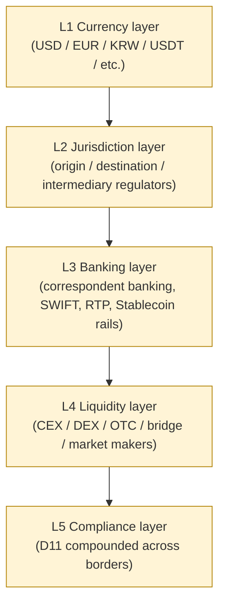
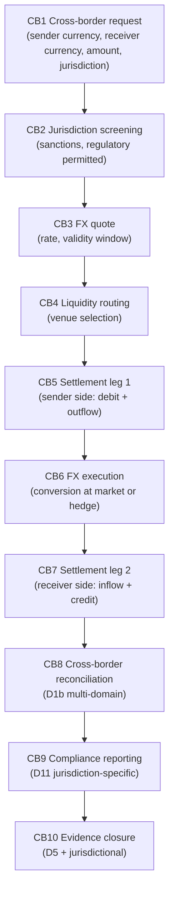
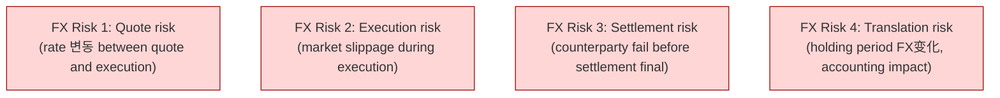
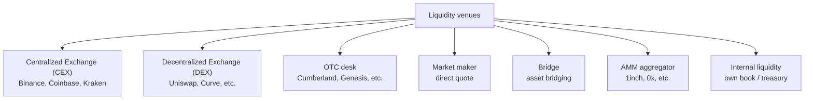
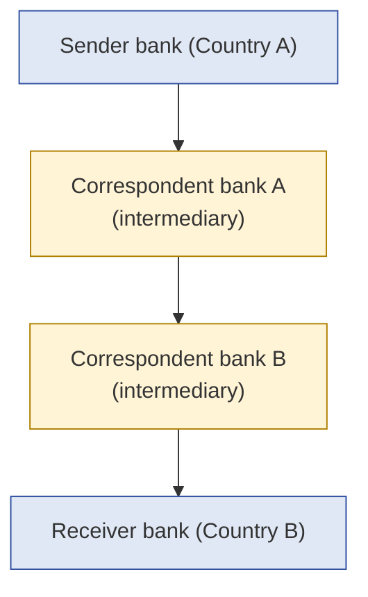
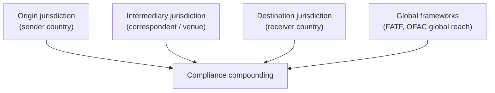

# Custody Wallet — Cross-border Settlement / FX / Liquidity Routing Reasoning

> **본 문서의 위치**: D1b (reconciliation) + D9 (multi-chain) + D10 (monetary) + D11 (compliance) 의 **cross-border specialization**. Crypto-rail cross-border settlement / FX exposure / liquidity routing / banking corridor 의 generalized reasoning.

> **본 문서가 답하는 핵심 질문**: 왜 cross-border crypto settlement 이 currency conversion 이 아닌가? 왜 stablecoin == USD 가 sovereign US asset 이 아닌가? 왜 liquidity 가 존재해도 routable 하지 않은가? 왜 FX hedged 가 FX exposure 0 이 아닌가?

---

## 0. 핵심 명제 (10초 이해)

1. **Cross-border crypto settlement = multi-jurisdiction monetary state coordination** (core thesis).
2. **10-tier "≠" 명제** — crypto transfer / FX hedge / same currency / stablecoin / liquidity / faster chain / banking corridor / multi-currency / cross-border execution / on-chain finality 모두가 의미 differing.
3. **5 cross-border layer** — Currency / Jurisdiction / Banking / Liquidity / Compliance.
4. **Settlement venue ≠ Currency** — 같은 USD 도 SWIFT / Fedwire / RTP / Stablecoin / CBDC 각각 다른 venue.
5. **FX exposure layers** — Quote risk / Execution risk / Settlement risk / Translation risk.
6. **Stablecoin ≠ Sovereign asset** — backing 의 quality + issuer risk + redeemability + jurisdictional acceptance.
7. **Liquidity routing = multi-venue optimization** — CEX + DEX + OTC + bridge + native + AMM 의 graph traversal.
8. **Banking corridor risk** — correspondent banking dependency + de-banking risk + regulatory freeze.
9. **Cross-border compliance = compounded jurisdiction** — origin + destination + intermediary 의 multi-regulator.
10. **Cross-border 의 customer burden ~85% in SaaS** — D11 compliance 보다도 높을 수 있음 (banking + FX + jurisdictional).

---

## 1. 5 Cross-border Layer

### 1.1 5 layer 의 책임

| Layer | 책임 |
|---|---|
| Currency | 화폐 단위 (fiat + crypto + stablecoin) |
| Jurisdiction | 어느 regulator 의 scope |
| Banking | 어떤 settlement rail |
| Liquidity | 어디서 conversion + execution |
| Compliance | 어떤 sanctions / KYC / reporting |

### 1.2 "Currency ≠ Settlement venue"

- Same USD 라도 다른 venue:
  - SWIFT (international wire)
  - Fedwire (US domestic real-time)
  - ACH (US batch)
  - RTP (US real-time)
  - USDT (Tether stablecoin)
  - USDC (Circle stablecoin)
  - CBDC (hypothetical Fed)
- 각각 다른 fee / latency / final / counterparty risk.

### 1.3 "Stablecoin ≠ Sovereign asset"

(§0 명제)

- USDT / USDC = "USD-pegged" 이지만 sovereign USD 아님.
- 차이:
  - Sovereign USD = Fed liability
  - Stablecoin = issuer (Tether / Circle) liability
- 따라서:
  - Sovereign USD 의 default = US gov default (effectively 0 risk)
  - Stablecoin default = issuer default (non-zero risk)
- → 같은 amount 라도 risk profile 다름.

---

## 2. Cross-border Settlement Lifecycle

### 2.1 10 phase domain mapping

| Phase | Layer (§1) | Sub-system |
|---|---|---|
| CB1 Request | (none) | D8 W1 의 cross-border variant |
| CB2 Screening | Compliance (L5) | D11 jurisdictional |
| CB3 FX quote | Currency (L1) | FX provider / oracle |
| CB4 Liquidity | Liquidity (L4) | Routing engine |
| CB5 Settlement leg 1 | Banking (L3) | D7/D8 lifecycle |
| CB6 FX execution | Liquidity (L4) | Conversion venue |
| CB7 Settlement leg 2 | Banking (L3) | D7/D8 lifecycle |
| CB8 Reconciliation | All | D1b cross-domain (multi-currency, multi-chain) |
| CB9 Reporting | Compliance | D11 jurisdiction-specific |
| CB10 Evidence | Evidence | D5 |

### 2.2 "Cross-border execution ≠ Cross-border settlement final"

- Execution = trade executed (quote locked).
- Settlement final = both legs 의 economic finality.
- 차이:
  - FX execution 후 settlement 까지 timing gap (counterparty risk)
  - Settlement venue 의 finality 다름 (banking T+2 vs stablecoin real-time)
- → Execution 후 settlement 까지의 **counterparty exposure** 가 cross-border 의 hidden risk.

---

## 3. FX Exposure (4-layer risk)

### 3.1 각 risk 의 mitigation

| Risk | Mitigation |
|---|---|
| Quote risk | Short quote validity (seconds) + automatic re-quote |
| Execution risk | Limit order / slippage tolerance / multi-venue routing |
| Settlement risk | PvP (Payment-vs-Payment) settlement / atomic swap / escrow |
| Translation risk | Hedging (forward / options) / natural hedge / 즉시 conversion |

### 3.2 "FX hedged ≠ FX exposure eliminated"

(§0 명제)

- Hedge 는 specific risk 의 mitigation.
- 잔여 위험:
  - Hedge counterparty risk (hedge 도 default 가능)
  - Basis risk (hedge instrument 의 imperfect correlation)
  - Hedge maintenance cost
  - 새로운 unhedged exposure (예: hedge unwind 시)
- → Hedge 는 reduction, not elimination.

### 3.3 Stablecoin 의 FX nature

(★ Hypothesis — emerging pattern)

- USDT 송금 = USD 송금? 아닌가?
- 분석:
  - Stablecoin holder 의 final 화폐:
    - Stablecoin 으로 hold + use (no FX)
    - Stablecoin → fiat off-ramp (FX moment)
  - 송금자 / 수신자가 모두 stablecoin user 면 FX 없음
  - 어느 한쪽이 fiat 면 FX 발생
- → Stablecoin = "deferred FX" 기능.

### 3.4 Multi-currency treasury

- Issuer 의 reserve 가 multi-currency 면:
  - Treasury 의 own FX exposure
  - Reserve composition 의 hedging policy
- → D10 treasury 의 FX dimension.

---

## 4. Liquidity Routing

### 4.1 Liquidity venue taxonomy

### 4.2 Routing decision factors

| Factor | 의미 |
|---|---|
| Price (best execution) | Slippage minimization |
| Size capacity | Large trade 의 venue suitability |
| Latency | Time-sensitive trade |
| Settlement finality | Venue 별 다름 |
| Counterparty risk | CEX 의 own risk |
| Compliance | Sanctioned venue 회피 |
| Liquidity depth | Real-time orderbook |

### 4.3 "Liquidity exists ≠ Routable liquidity"

(§0 명제)

- Orderbook 에 size 있음 ≠ executable.
- 가능한 friction:
  - KYC requirement (venue 가입 안 됨)
  - Geographic restriction
  - Settlement currency mismatch
  - Custody integration 부재
  - Minimum size requirement
- → Routable liquidity = accessible × compliant × integrated.

### 4.4 Smart order routing

- Multi-venue 의 best execution 자동 routing:
  - Real-time orderbook 추적
  - Size-aware execution split
  - Cross-venue arbitrage
- → 자체 구축 vs SaaS routing provider (Wintermute, etc.) trade-off.

### 4.5 Liquidity 의 sovereignty trade-off

- Internal liquidity (own book) 의 self-sufficiency
- External venue 의 access + diversity
- → Hybrid 가 일반적.

---

## 5. Banking Corridor

### 5.1 Correspondent banking model

### 5.2 Correspondent banking 의 5 issue

| Issue | 의미 |
|---|---|
| **Latency** | 보통 1-3 business days (timezone + batch) |
| **Cost** | 매 intermediary 의 fee |
| **De-risking** | Correspondent 가 high-risk corridor 단절 |
| **Settlement risk** | Intermediary 의 default risk |
| **Visibility** | End-to-end tracking 어려움 |

### 5.3 De-banking risk

(★ Hypothesis — operational risk)

- Bank 가 crypto-related customer 거절 / 차단:
  - Reputation risk
  - Regulatory risk
  - Compliance burden
- 영향:
  - Issuer 가 banking 잃으면 fiat 부분 막힘
  - Customer 의 own bank 가 crypto withdrawal 차단 가능
- Mitigation: multi-bank + diverse jurisdiction + redundancy.

### 5.4 "Banking corridor exists ≠ Corridor available"

(§0 명제)

- Theoretical corridor (정상적인 SWIFT route).
- Actual availability:
  - Correspondent banking 의 active relationship
  - Sanctions 차단 (예: Russia routes 차단)
  - De-banking
  - Operational hours (timezone)
- → Cross-border settlement 의 hidden infrastructure dependency.

### 5.5 Crypto rail as alternative

- Stablecoin / crypto 가 traditional banking 대안:
  - Faster (seconds vs days)
  - Cheaper (per tx fee vs % charge)
  - 24/7 (always-on)
  - Less de-risking (chain 은 censor-resistant)
- 그러나:
  - Off-ramp 시 banking 의존 다시
  - Regulatory acceptance variance
  - Volatility (non-stablecoin)

---

## 6. Cross-border Compliance (D11 의 cross-border)

### 6.1 Compounded jurisdiction

### 6.2 Cross-border travel rule

(D11 §6 의 cross-border)

- Travel rule 의 cross-jurisdiction:
  - Origin 의 threshold + format
  - Destination 의 threshold + format
  - 양쪽이 different protocol 사용
- → Travel rule interoperability 의 cross-border specific challenge.

### 6.3 OFAC global reach

- OFAC sanctions = US 의 law 이지만:
  - US person 가 involved 면 적용
  - USD 사용 (settlement venue) 시 적용
  - US-related infrastructure (e.g. correspondent bank) 사용 시 적용
- → Non-US issuer 도 OFAC compliance 필요한 경우 흔함.

### 6.4 Cross-border tax

- Crypto cross-border transfer 의 tax 영향:
  - Capital gains (price 변동)
  - Foreign asset reporting
  - Withholding tax (jurisdiction-specific)
- → Tax compliance = own legal counsel + accountant.

### 6.5 "Multi-currency support ≠ FX risk managed"

(§0 명제)

- Multi-currency capability = own system 의 currency support.
- FX risk 관리 = exposure 식별 + hedge / 즉시 conversion / policy.
- 차이: support 는 capability, risk 관리는 governance.

---

## 7. Settlement Venue Comparison

### 7.1 Venue 의 finality + cost matrix

| Venue | Finality | Cost | Latency | Availability |
|---|---|---|---|---|
| SWIFT | T+1 to T+3 | High (correspondent fees) | Hours-days | Business hours |
| Fedwire | Same-day | Medium | Minutes-hours | Banking hours |
| RTP | Real-time | Medium | Seconds | 24/7 (US) |
| ACH | T+1 to T+2 | Low | Hours | Business days |
| SEPA (EU) | Same-day (instant variant) | Low | Seconds-hours | Business + instant 24/7 |
| Stablecoin (USDT/USDC) | Chain-specific (seconds-minutes) | Low (gas only) | Seconds-minutes | 24/7 |
| CBDC (hypothetical) | Instant | Low | Seconds | 24/7 |
| Cash | Instant (physical) | High (logistics) | Hours (physical) | Variable |

### 7.2 Venue selection 의 factor

- Sender / receiver 의 banking access
- Currency conversion 필요?
- Regulatory acceptance
- Cost tolerance
- Latency requirement
- Counterparty risk tolerance

### 7.3 Hybrid settlement

(★ Hypothesis — emerging pattern)

- Cross-border 의 hybrid pattern:
  - First leg: fiat (sender bank → issuer)
  - Mid leg: stablecoin (issuer mint → receiver wallet)
  - Last leg: fiat (receiver wallet off-ramp → receiver bank)
- → 3 leg 각각 different rail + different risk.

---

## 8. Operational Fragility Map

```mermaid
graph TB
    F1["F1. FX rate volatility"]
    F2["F2. Banking corridor de-risking"]
    F3["F3. Liquidity depth fluctuation"]
    F4["F4. Jurisdictional conflict (D11 §10)"]
    F5["F5. Settlement venue outage<br/>(SWIFT outage, RPC outage)"]
    F6["F6. Correspondent bank default"]
    F7["F7. Travel rule interoperability gap"]
    F8["F8. Off-ramp friction<br/>(stablecoin → fiat 차단)"]
    F9["F9. Cross-border tax surprise"]
    F10["F10. Compliance compounding burden"]

    F1 -->|mitigation| M1["FX hedging + short quote validity"]
    F2 -->|mitigation| M2["Multi-bank + corridor monitoring + crypto rail fallback"]
    F3 -->|mitigation| M3["Multi-venue routing + size-aware execution"]
    F4 -->|mitigation| M4["Legal counsel + most-strict default + per-corridor policy"]
    F5 -->|mitigation| M5["Multi-rail redundancy + failover"]
    F6 -->|mitigation| M6["Correspondent monitoring + diversification"]
    F7 -->|mitigation| M7["Protocol gateway + manual fallback"]
    F8 -->|mitigation| M8["Multi-off-ramp + alternative venue"]
    F9 -->|mitigation| M9["Tax integration + per-jurisdiction analysis"]
    F10 -->|mitigation| M10["Compliance team per jurisdiction + automation"]
```

---

## 9. Limitations

### 9.1 Crypto rail ≠ Banking replacement (yet)

- Stablecoin 의 banking 대체는 emerging.
- Off-ramp (stablecoin → fiat) 은 결국 banking 의존.
- 따라서 banking 의 obsolescence 가 아닌 augmentation.

### 9.2 "Faster chain ≠ Faster settlement"

(§0 명제)

- Chain finality (seconds) 가 settlement (off-ramp + compliance + recipient banking) 의 bottleneck 아님.
- Total settlement = fastest leg + slowest leg.

### 9.3 "On-chain finality ≠ Off-ramp finality"

- Chain finality 후 off-ramp 의 banking dependency.
- True end-to-end finality = on-chain + off-ramp + recipient banking.

### 9.4 Regulatory unpredictability

- Cross-border regulatory landscape 매우 변화.
- Today's compliant corridor 가 미래에 막힐 수 있음.
- Mitigation: legal counsel + ongoing monitoring + diversification.

---

## 10. 3-way Cross-border Burden

### 10.1 Plane × Ownership

| 영역 | SaaS | Hosted MPC | Direct-build |
|---|---|---|---|
| FX quote | Vendor partial + customer | Customer | Customer (FX provider integration) |
| Liquidity routing | Vendor partial | Customer | Customer (own routing engine) |
| Banking corridor | Customer | Customer | Customer |
| Cross-border compliance | Customer | Customer | Customer |
| Travel rule cross-jurisdiction | Customer | Customer | Customer |
| Tax compliance | Customer | Customer | Customer |
| Settlement venue selection | Customer | Customer | Customer |
| FX hedging | Customer | Customer | Customer |

### 10.2 Customer burden (★ Hypothesis)

- SaaS: ~85% (vendor 가 일부 FX quote / liquidity routing; 나머지 customer)
- Hosted MPC: ~95% (+ banking corridor + own integration)
- Direct-build: ~100% (+ liquidity routing engine + FX provider integration)

→ Cross-border 는 SaaS 에서도 customer burden ~85% — D11 compliance 와 함께 vendor 흡수 가장 적은 영역.

### 10.3 Recommendation

| Context | 권장 |
|---|---|
| Single-currency, single-jurisdiction | (cross-border 불필요) |
| Some cross-border (limited corridor) | SaaS + customer FX desk |
| Major cross-border business | Hosted MPC + own FX + banking partnerships |
| Cross-border crypto rail (stablecoin issuer w/ global) | Direct-build + treasury + liquidity team |

---

## 11. Q1-Q10 Reasoning

### Q1. Cross-border ≠ Currency conversion

§0.1. 5-layer (Currency / Jurisdiction / Banking / Liquidity / Compliance) 의 coordination.

### Q2. Stablecoin ≠ Sovereign asset

§1.3. Issuer liability ≠ government liability; default risk profile 다름.

### Q3. FX hedged ≠ FX exposure eliminated

§3.2. Hedge counterparty + basis + maintenance + 새 exposure.

### Q4. Liquidity exists ≠ Routable

§4.3. Accessible × Compliant × Integrated.

### Q5. Faster chain ≠ Faster settlement

§9.2. Slowest leg 가 bottleneck (off-ramp + recipient banking).

### Q6. On-chain finality ≠ Off-ramp finality

§9.3. End-to-end finality = on-chain + off-ramp + banking.

### Q7. Banking corridor exists ≠ Available

§5.4. Theoretical route 와 active availability 분리 (de-risking, sanctions, hours).

### Q8. Multi-currency support ≠ FX risk managed

§6.5. Capability ≠ governance.

### Q9. Cross-border execution ≠ Settlement final

§2.2. Execution 후 settlement 까지 counterparty exposure.

### Q10. Cross-border SaaS customer 책임 큰 이유

§10.2. Banking + FX + jurisdictional + tax = vendor 흡수 못함.

---

## 12. Open Questions / Org Policy

| 영역 | 질문 |
|---|---|
| FX hedging policy | hedge / 즉시 conversion / unhedged? |
| Liquidity venue whitelist | which venues? |
| Banking partnership | which countries / corridors? |
| Crypto rail vs banking rail | per corridor preference? |
| Off-ramp provider | which? per country? |
| Travel rule protocol per corridor | mapping? |
| Tax compliance approach | per jurisdiction policy |
| Cross-border tx limits | velocity / size? |
| De-banking response plan | alternative rails? |
| Settlement venue SLA | per venue |

---

## 13. References + Uncertainty Boundary

### 관련 wiki

| 참조 |
|---|
| [[docs/architecture/reconciliation-settlement-consistency]] §11 (external domain) |
| [[docs/architecture/multi-chain-adapter-pattern]] §7 (bridge as cross-chain rail) |
| [[docs/architecture/treasury-reserve-mint-burn]] §3 (redemption banking) |
| [[docs/architecture/compliance-aml-sanctions-boundary]] §6 (travel rule), §10 (jurisdiction) |

### Uncertainty Boundary

- 5-layer / 4 FX risk / 7 liquidity venue / 5 corresponding banking issue / 10 fragility / 85% burden 분포 = **generalized cross-border architecture pattern (Hypothesis ★)**.
- §7.1 settlement venue 표 = current snapshot, 시간에 따라 변화.
- §10.2 burden 백분율 = operational reasoning estimate.
- §11 limitations = current state, technology 발전에 따라 변화.
- §12 에 org policy 영역 명시.

### 다음 단계

- **D14 — Security / Threat Model / Adversarial Resilience**

---

**Stage 32 D13 completion timestamp**: 2026-05-19.
