# Custody Wallet — Cross-institution Liquidity Coordination Reasoning

> **본 문서의 위치 (Liquidity Cluster D20 — closing)**: D17 treasury + D18 omnibus + D19 internal netting 의 **cross-institution 확장**. Independent operator 간 의 liquidity routing + coordinated settlement + systemic risk. Liquidity cluster 의 final layer — monetary federation 의 architecture.

> **본 문서가 답하는 핵심 질문**: 왜 interoperability 가 coordination 이 아닌가? 왜 shared liquidity 가 shared governance 가 아닌가? 왜 settlement routing 이 settlement certainty 아닌가? 왜 liquidity federation 이 systemic safety 가 아닌가? 왜 cross-institution visibility 가 cross-institution control 이 아닌가?

---

## 0. 핵심 명제 (10초 이해)

1. **Cross-institution liquidity coordination = synchronized survivability management across independently governed monetary systems** (core thesis).
2. **Cross-institution settlement = loosely coupled monetary federation under stress** (secondary thesis).
3. **5-tier "≠" 명제 (D20 cluster closing)**:
   - Interoperability ≠ Coordination
   - Shared liquidity ≠ Shared governance
   - Settlement routing ≠ Settlement certainty
   - Liquidity federation ≠ Systemic safety
   - Cross-institution visibility ≠ Cross-institution control
4. **Federation pattern** — independent governance + coordinated operations + emergent systemic behavior.
5. **Cross-institution settlement = inter-VASP / inter-bank / inter-CCP** 의 3 종류.
6. **Coordination 의 3-tier** — Bilateral agreement / Multi-lateral protocol / Shared infrastructure (CCP/CSD).
7. **Liquidity hoarding = stress 시 의 self-protective behavior** — system-level liquidity 감소.
8. **Synchronized freeze = simultaneous defensive action 의 systemic risk**.
9. **Trust failure cascade** — one institution 의 trust loss → counterparty 의 defensive action → systemic.
10. **Cross-institution customer burden ~100% in SaaS** — vendor 가 own institution boundary 만, cross-institution coordination 은 entirely customer.

---

## 1. Cross-institution Liquidity Topology

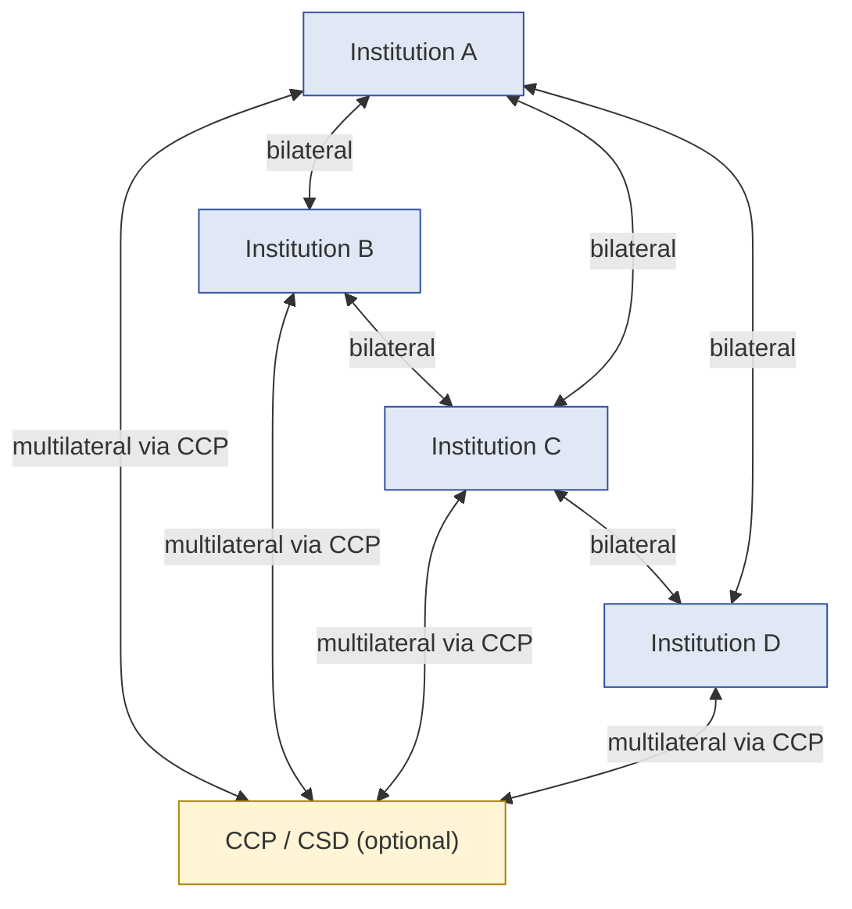

### 1.1 Cross-institution 의 3 settlement model

| Model | 의미 |
|---|---|
| **Bilateral** | Direct pairwise settlement |
| **Multilateral via CCP/CSD** | Central counterparty 통과 |
| **Hybrid** | Some pairs bilateral, others multilateral |

### 1.2 Federation 의 nature

- Independent governance: 각 institution 의 own decision authority.
- Coordinated operations: shared protocol / SLA / timing.
- Emergent behavior: collective dynamics 가 individual 의 sum 보다 큼.
- → "Loosely coupled monetary federation".

### 1.3 "Interoperability ≠ Coordination"

(§0 명제)

- Interoperability: 기술적 연결 가능 (API, protocol).
- Coordination: 동기화된 행동 (timing, decision, response).
- 차이:
  - Two institutions 가 interoperable 해도 coordinated 안 됨 가능
  - Coordination 는 governance + agreement + ongoing communication
- → 기술 표준 ≠ operational coordination.

### 1.4 Federation 의 trust topology

- 각 member 의 own trust (own governance).
- Federation 의 emergent trust (collective behavior).
- Single member 의 trust loss = federation-wide impact.
- → Federation trust = network effect.

---

## 2. Coordination Mechanisms

### 2.1 3-tier coordination

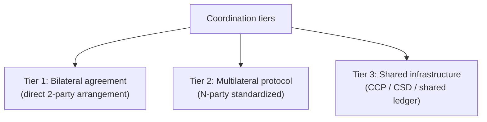

### 2.2 각 tier 의 trade-off

| Tier | Flexibility | Coordination strength | Governance complexity |
|---|---|---|---|
| Bilateral | High (per-pair) | Low | Simple |
| Multilateral | Medium | Medium | Standardized |
| Shared infrastructure | Low (per CCP rules) | High | Complex (CCP governance) |

### 2.3 Coordination 의 component

| Component | 의미 |
|---|---|
| **Communication protocol** | Standard message format |
| **Timing synchronization** | Shared cycle / cutoff |
| **Authentication** | Cross-institution identity |
| **Settlement rail** | Actual transfer infrastructure |
| **Dispute resolution** | Mechanism for disagreement |
| **Crisis coordination** | Emergency response protocol |

### 2.4 "Shared liquidity ≠ Shared governance"

(§0 명제)

- Shared liquidity: 같은 pool / 같은 rail 사용.
- Shared governance: 같은 decision authority.
- 차이:
  - Member 가 shared pool 사용 가능 + 각자 own governance
  - 또는 shared governance + 각자 own pool
  - 또는 both
- → Liquidity sharing 의 governance implication 명확화 필요.

### 2.5 Operational SLA between institutions

- Settlement window (e.g. by 5pm UTC daily)
- Message acknowledgment SLA
- Failure notification SLA
- Dispute escalation SLA
- → Federation 의 operational backbone.

---

## 3. Inter-institution Liquidity Routing

### 3.1 Routing decision

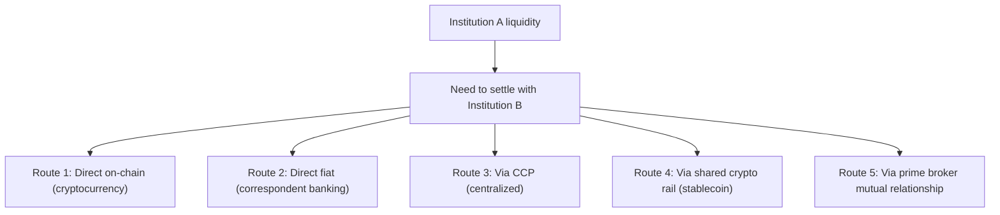

### 3.2 Routing decision factor

- Settlement finality (chain / banking / CCP 의 finality)
- Latency
- Cost
- Counterparty risk (vs CCP risk)
- Operational hours (chain 24/7, banking limited)
- Currency / asset compatibility
- Regulatory approval

### 3.3 "Settlement routing ≠ Settlement certainty"

(§0 명제)

- Routing decision = path selection.
- Certainty = path 의 successful completion.
- 차이:
  - Selected route 의 failure 가능 (banking outage, chain congestion, CCP issue)
  - → Multi-route + fallback 가 certainty 의 mechanism.

### 3.4 Multi-route redundancy

(D13 §10 의 cross-institution 측면)

- Primary route + fallback route + emergency route.
- Each route 의 SLA + health monitoring.
- Automatic failover (or manual depending on stakes).

### 3.5 Routing 의 systemic effect

- 많은 institution 가 same primary route 사용 시 single point of stress.
- Route 의 diversification 이 systemic safety 의 component.

---

## 4. Treasury Federation

### 4.1 Federation-like treasury behavior

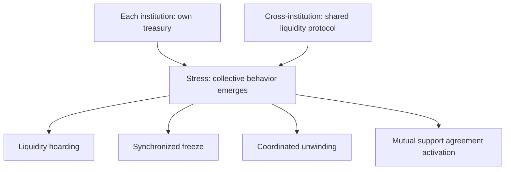

### 4.2 Liquidity hoarding under stress

(★ Hypothesis — financial industry pattern)

- Stress signal → each institution 의 defensive behavior:
  - Reduce lending to peers
  - Increase own liquidity buffer
  - Raise own credit standards
- Aggregate effect: system-wide liquidity 감소.
- → Individual rationality 의 collective irrationality.

### 4.3 Synchronized freeze risk

- Trigger event → multiple institutions 의 simultaneous defensive freeze.
- Customer experience: "All institutions simultaneously not accepting redemptions".
- Systemic confidence loss.

### 4.4 Mutual support agreement

(★ Hypothesis — emerging pattern)

- Pre-agreed:
  - Liquidity swap arrangement
  - Mutual lending facility
  - Shared default fund
- Activation under stress.
- → Federation 의 explicit cooperation.

### 4.5 Central bank backstop

- 일부 jurisdiction 의 central bank 가 lender-of-last-resort 역할.
- Crypto-native: 아직 명확한 backstop 없음.
- Stablecoin issuer 의 backstop relationship 의 emerging issue.

---

## 5. Settlement Synchronization

### 5.1 Synchronization 의 dimensions

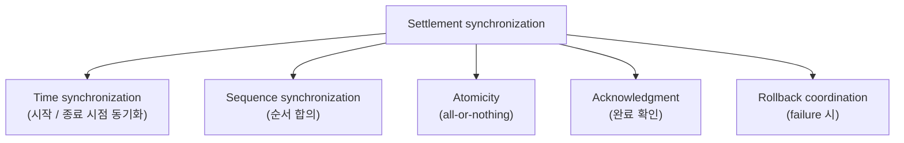

### 5.2 PvP (Payment-vs-Payment)

- Both legs of cross-currency / cross-asset 이 atomic.
- Mechanism: escrow / HTLC / atomic swap.
- → Settlement risk 의 mitigation.

### 5.3 DvP (Delivery-vs-Payment)

- Asset delivery + payment 이 atomic.
- Mechanism: similar to PvP.

### 5.4 Time-bracketed synchronization

(★ Hypothesis — operational pattern)

- Pre-agreed time window (예: 10:00-10:05 UTC).
- All institutions 의 settlement instructions 이 window 안에 처리.
- Window outside 의 settlement = next window.
- → Predictable + coordinated.

### 5.5 Cross-jurisdictional timing

(D13 §5 + §11.5 의 inter-institution 측면)

- Different jurisdiction 의 different time zone + holiday + market hours.
- 일부 institution 의 operational hours 가 다름.
- → Coordination 의 challenge.

---

## 6. Liquidity Coupling and Systemic Risk

### 6.1 Coupling intensity

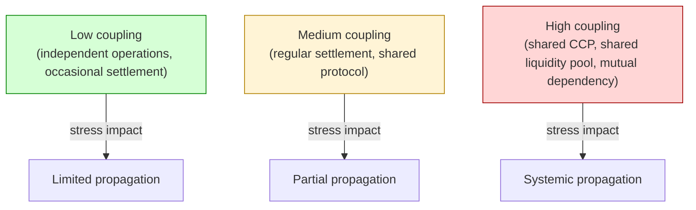

### 6.2 Coupling 의 trade-off

| Coupling | Benefit | Risk |
|---|---|---|
| Low | Independent survival | Inefficiency, isolation |
| Medium | Balanced | Moderate propagation |
| High | Operational efficiency | Systemic fragility |

### 6.3 "Liquidity federation ≠ Systemic safety"

(§0 명제)

- Federation 의 efficiency: capital reuse, coordinated operations.
- 그러나 systemic safety:
  - Coupling 증가 시 single failure 의 propagation
  - Federation 의 internal dynamic 의 stress 시 amplification
- → Federation 의 benefit 이 systemic risk 와 trade-off.

### 6.4 Contagion path (D19 §9 의 cross-institution scale)

- Institution-level contagion (D19 §9.1).
- Cross-institution contagion (이 문서):
  - Bilateral default → counterparty institution 의 stress
  - CCP failure → all member 영향
  - Shared pool 의 freeze → all participant 영향

### 6.5 Systemic risk monitoring

- Network topology 분석.
- Concentration metric (largest member 의 share).
- Stress test simulation across federation.
- → Regulator / central bank 의 oversight.

---

## 7. Synchronized Defensive Behavior

### 7.1 Defensive behavior 의 type

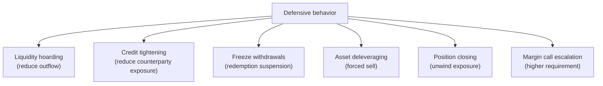

### 7.2 Coordinated vs uncoordinated defense

- Coordinated: federation 의 protocol-driven response (예: mutual moratorium).
- Uncoordinated: each institution 의 independent reaction.
- → Uncoordinated 가 systemic risk 의 source.

### 7.3 "Cross-institution visibility ≠ Cross-institution control"

(§0 명제)

- Visibility: 누가 어떤 상태인가 (signal).
- Control: 누구의 행동 결정.
- 차이:
  - Federation 의 member 가 서로 visible 해도 각자 own decision
  - Coordination 은 voluntary (no central authority)
- → Visibility + persuasion 이 coordination 의 mechanism.

### 7.4 Crisis communication

- Regular forum (member meeting).
- Crisis hotline (24/7).
- Information sharing protocol.
- → Federation 의 nervous system.

### 7.5 Tragedy of the commons risk

(★ Hypothesis — game-theoretic pattern)

- Individual rationality (defensive) + collective irrationality (systemic crash).
- Each member 의 optimal 행동이 federation 의 optimal 행동 아님.
- → Coordination 의 ongoing challenge.

---

## 8. Trust Failure Cascade

### 8.1 Trust loss propagation

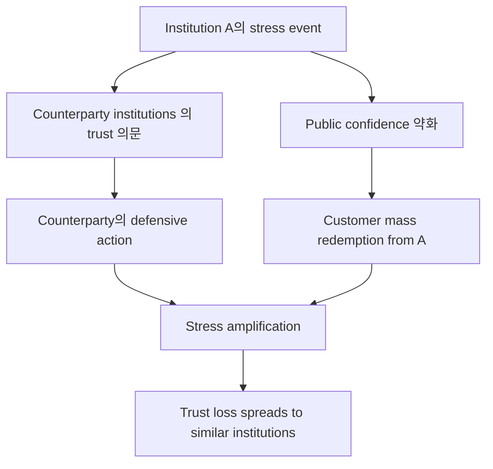

### 8.2 Trust contagion 의 mechanism

| Mechanism | 의미 |
|---|---|
| Direct exposure | Counterparty 의 actual loss |
| Perceived similarity | "Similar institutions are also at risk" |
| Information cascade | Each observation 가 next 의 decision 영향 |
| Liquidity withdrawal | Defensive redemption |
| Asset price impact | Stress asset 의 valuation drop |

### 8.3 Communication discipline 의 critical

- Stress 시 의 communication 의 importance:
  - Accurate (false rumor 방지)
  - Timely
  - Coordinated (federation members)
  - Transparent
- → Crisis communications 이 trust 의 preservation.

### 8.4 Recovery from trust loss

- Trust 손실 < trust 회복 의 asymmetry.
- Recovery period: months-years.
- Reputation 의 long-term value.

---

## 9. Cross-institution Evidence Chain

### 9.1 Federation 의 evidence chain (D5 의 federation 측면)

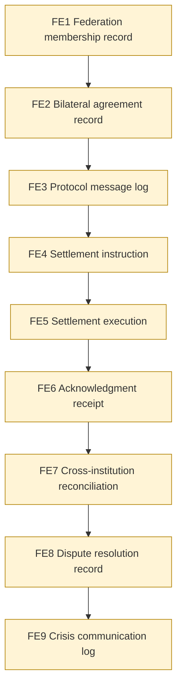

### 9.2 Evidence 의 multi-party verification

- Each institution 의 own copy.
- Cross-party signed evidence (counterparty's signature).
- Optional CCP 의 master record.
- → Multi-source corroboration.

### 9.3 Cross-institution reconciliation

- 각 institution 의 own ledger + counterparty 의 ledger 의 mutual reconciliation.
- Discrepancy detection + resolution.
- → Cross-domain consistency (D1b §10) 의 cross-institution scale.

---

## 10. Operational Fragility Map

```mermaid
graph TB
    F1["F1. Liquidity contagion<br/>(stress propagation)"]
    F2["F2. Synchronized freeze<br/>(simultaneous defensive action)"]
    F3["F3. Treasury coordination collapse<br/>(federation breakdown)"]
    F4["F4. Routing deadlock<br/>(circular dependency)"]
    F5["F5. Liquidity hoarding<br/>(collective irrationality)"]
    F6["F6. Institutional trust failure<br/>(cascade)"]
    F7["F7. Cross-jurisdictional timing conflict<br/>(synchronization failure)"]
    F8["F8. Bilateral agreement enforceability<br/>(legal cross-border)"]
    F9["F9. CCP failure<br/>(single point of systemic failure)"]
    F10["F10. Federation governance gridlock<br/>(consensus required, no clear authority)"]

    F1 -->|mitigation| M1["Stress test + capital buffer + multi-rail"]
    F2 -->|mitigation| M2["Crisis coordination protocol + central bank backstop"]
    F3 -->|mitigation| M3["Pre-agreed protocols + regular drills"]
    F4 -->|mitigation| M4["Priority routing + tie-breaker + arbitrator"]
    F5 -->|mitigation| M5["Information sharing + game-theoretic intervention"]
    F6 -->|mitigation| M6["Transparency + factual communication + reputation diversity"]
    F7 -->|mitigation| M7["Multi-timezone coordination + buffer windows"]
    F8 -->|mitigation| M8["Legal opinion + jurisdiction strategy + arbitration"]
    F9 -->|mitigation| M9["CCP의 own capital + member contribution + central bank backstop"]
    F10 -->|mitigation| M10["Federation governance structure + voting + emergency authority"]
```

### 10.1 분류

| 분류 | items | 성격 |
|---|---|---|
| **Systemic** | F1, F2, F9 | irreducible network effect |
| **Behavioral** | F5, F6 | game-theoretic |
| **Operational** | F3, F4, F7 | discipline + protocol |
| **Legal** | F8 | jurisdiction |
| **Governance** | F10 | federation structure |

---

## 11. Limitations

### 11.1 Interoperability ≠ Coordination

§1.3.

### 11.2 Shared liquidity ≠ Shared governance

§2.4.

### 11.3 Settlement routing ≠ Settlement certainty

§3.3.

### 11.4 Federation ≠ Systemic safety

§6.3.

### 11.5 Visibility ≠ Control

§7.3.

### 11.6 Network effects 의 unpredictability

- Complex network 의 dynamics 가 model 보다 복잡.
- Black swan events 의 federation impact 미예측.

### 11.7 Voluntary cooperation 의 fragility

- Federation 은 voluntary (central authority 없음).
- Member 의 exit 또는 non-cooperation 가능.

---

## 12. 3-way Cross-institution Liquidity Burden

### 12.1 Plane × Ownership

| 영역 | SaaS | Hosted MPC | Direct-build |
|---|---|---|---|
| Inter-institution agreement | Customer | Customer | Customer |
| Protocol implementation | Vendor partial + customer | Customer | Customer |
| Coordination operations | Customer | Customer | Customer |
| Crisis management | Customer | Customer | Customer |
| Federation governance | Customer | Customer | Customer |
| Regulator interaction | Customer | Customer | Customer |
| Customer protection | Customer | Customer | Customer |

### 12.2 Customer burden (★ Hypothesis)

- SaaS: ~100% (vendor 의 boundary 가 own institution; cross-institution 은 entirely customer)
- Hosted: ~100%
- Direct-build: ~100%

→ Cross-institution coordination 은 model 무관 100% customer — vendor 가 own institution 의 boundary 밖에서 흡수 못함.

### 12.3 Recommendation

| Context | 권장 |
|---|---|
| Standalone (no peer institution) | No cross-institution (own treasury) |
| Few partnerships | Bilateral agreements |
| Industry consortium | Multilateral protocol + shared governance |
| Systemically important | CCP / CSD + central bank relationship + regulator oversight |

---

## 13. Q1-Q10 Reasoning

### Q1. Interoperability ≠ Coordination

§1.3. Technical connectivity ≠ synchronized behavior.

### Q2. Shared liquidity ≠ Shared governance

§2.4. Liquidity sharing 의 governance independence.

### Q3. Routing ≠ Certainty

§3.3. Path selection ≠ successful completion.

### Q4. Federation ≠ Systemic safety

§6.3. Coupling efficiency vs systemic fragility.

### Q5. Visibility ≠ Control

§7.3. Observation ≠ decision authority.

### Q6. Liquidity hoarding under stress

§4.2. Individual rationality 의 collective irrationality.

### Q7. Synchronized freeze risk

§4.3. Multiple institution 의 simultaneous defensive action.

### Q8. Trust failure cascade

§8. Direct + perceived + information + liquidity + price.

### Q9. Tragedy of the commons

§7.5. Game-theoretic challenge.

### Q10. Cross-institution = 100% customer burden

§12.2. Vendor 의 institutional boundary 밖.

---

## 14. Cluster Closing Summary (D17-D18-D19-D20)

### 14.1 4-document cluster integration

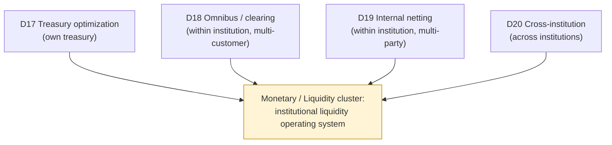

### 14.2 Cluster thesis 재확인

> **Liquidity is not stored money. It is operationally routable settlement capacity under governance and risk constraints.**

- D17: own treasury 의 routable capacity
- D18: institution 내부 multi-customer 의 routable abstraction
- D19: institution 내부 multi-party 의 compressed settlement
- D20: institutions 간 의 coordinated capacity

### 14.3 Cluster invariant 의 통합 (20 "≠")

| Document | ≠ propositions |
|---|---|
| **D17** | Capital efficiency ≠ Safety / Idle ≠ Inefficient / Yield ≠ Optimization / Available ≠ Deployable / Visibility ≠ Mobility |
| **D18** | Omnibus ≠ Pooled / Custody visibility ≠ Settlement authority / Internal ≠ Final / Clearing efficiency ≠ Risk reduction / Prime broker ≠ Neutral |
| **D19** | Net ≠ Eliminated / Internal ≠ Final / Deferred ≠ Reduced / Reuse ≠ Creation / Efficiency ≠ Survivability |
| **D20** | Interoperability ≠ Coordination / Shared liquidity ≠ Shared governance / Routing ≠ Certainty / Federation ≠ Safety / Visibility ≠ Control |

### 14.4 Cluster fragility integration

- D17: fragmentation / redemption delay / deadlock / mismatch / concentration / exhaustion
- D18: hidden exposure / reconciliation drift / delegated ambiguity / liquidity illusion / pooled insolvency / visibility fragmentation
- D19: hidden interconnectedness / cascade / deadlock / synchronization / compressed visibility / contagion
- D20: contagion / synchronized freeze / coordination collapse / routing deadlock / hoarding / trust failure

→ Cluster cumulative fragility: institutional liquidity 의 multi-scale risk.

### 14.5 Cluster customer burden

| Document | SaaS burden |
|---|---|
| D17 | ~70% |
| D18 | ~80% |
| D19 | ~85% |
| **D20** | **~100%** (highest) |

→ Liquidity cluster 의 burden 이 cross-institution 으로 갈수록 customer 100% — vendor 흡수 불가.

### 14.6 Liquidity as routable settlement capacity

- Liquidity 는 stored money 가 아닌 **operationally routable settlement capacity**.
- 따라서:
  - D17: own routing
  - D18: customer-level routing abstraction
  - D19: settlement minimization 의 routing
  - D20: cross-institution routing
- → Routing 의 multi-scale architecture.

### 14.7 Monetary federation 의 systemic property

- Federation = independent governance + emergent collective behavior.
- Individual rationality 의 collective irrationality possible (tragedy of commons).
- → Crypto-native monetary federation 의 emerging challenge.

---

## 15. References + Uncertainty Boundary + Cluster Next

### 관련 wiki

| 참조 |
|---|
| [[docs/architecture/treasury-optimization-capital-efficiency]] (D17) |
| [[docs/architecture/clearing-prime-brokerage-omnibus]] (D18) |
| [[docs/architecture/internal-netting-settlement]] (D19) |
| [[docs/architecture/treasury-reserve-mint-burn]] §9 (mass redemption cascade) |
| [[docs/architecture/cross-border-settlement-fx-liquidity]] §5 (correspondent banking 의 cross-institution) |
| [[docs/architecture/compliance-aml-sanctions-boundary]] §10 (jurisdictional) |
| [[docs/architecture/three-way-custody-decision-framework]] §10 (failure-state) |

### Uncertainty Boundary

- 3 settlement model / 3 coordination tier / 5 routing factor / 6 defensive behavior / 10 fragility / 100% burden 분포 = **generalized cross-institution liquidity architecture pattern (Hypothesis ★)**.
- §4.5 central bank backstop / §7.5 tragedy of commons = game-theoretic + financial industry pattern.
- §12.2 burden 백분율 = estimate.
- §14 에 cluster summary.

### Cluster Closing

D17-D18-D19-D20 Monetary / Liquidity cluster **완성**.

**Cluster 최종 정의 (sentence)**:
> Institutional liquidity systems are continuously coordinated monetary state synchronization systems — emerging from own treasury optimization (D17), through pooled abstraction (D18), through internal compression (D19), into loosely coupled federation under stress (D20) — where each layer of efficiency 가 새로운 layer of systemic risk 를 introduce.

### Next Cluster Recommendation

**Crisis / Survivability Cluster** (D21-D26):
- D21 Stablecoin Depeg / Crisis Handling
- D22 Consensus Failure / Chain Halt
- D23 Jurisdiction Split / Regulatory Attack
- D25 Systemic Liquidity Freeze
- D26 Custody Failure Generalization

→ Theme: catastrophic failure architecture

Boundary inherited:
- Liquidity boundary (D17-D20)
- Settlement boundary (D1b, D8, D13, D19, D20)
- Treasury boundary (D10, D17)
- Evidence boundary (D5, D15)
- Survivability boundary (D6, D12)

### Architecture reasoning corpus 누적

**22 documents** = generalized skeleton + chain / monetary / compliance / operational / cross-border / security specialization + trust cluster (3) + liquidity cluster (4).

| Cluster | Documents |
|---|---|
| Generalized skeleton | D1a, D1b, D2, D3, D4, D5, D6, D7, D8 |
| Single specialization | D9 (chain), D10 (monetary), D11 (compliance), D12 (operational), D13 (cross-border), D14 (security) |
| Trust cluster | D15, D16, D24 |
| **Liquidity cluster** | **D17, D18, D19, D20** |

---

**Stage 32 D20 completion timestamp**: 2026-05-20.
