# Custody Wallet — Custody Failure Generalization Reasoning

> **본 문서의 위치 (Crisis Cluster D26 — closing)**: D21 trust + D22 settlement + D23 governance + D25 liquidity 의 통합. Generalized failure taxonomy + cascading coordination failures + survivability boundaries + residual institutional capability + post-failure reconstruction. Crisis cluster 의 final synthesis.

> **본 문서가 답하는 핵심 질문**: 왜 custody failure 가 isolated incident 가 아닌가? 왜 technical failure 가 institutional failure 가 아닌가? 왜 system recovery 가 trust recovery 가 아닌가? 왜 surviving assets 가 surviving institution 보장 아닌가? 왜 partial continuity 가 survivability 보장 아닌가?

---

## 0. 핵심 명제 (10초 이해)

1. **Custody failures = cascading coordination failures across governance / liquidity / settlement / evidence / trust domains** (core thesis).
2. **Every architecture contains latent failure topologies, visible only under stress** (secondary thesis).
3. **5-tier "≠" 명제 (D26 cluster closing)**:
   - Technical failure ≠ Institutional failure
   - System recovery ≠ Trust recovery
   - Surviving assets ≠ Surviving institution
   - Evidence preservation ≠ Reputation preservation
   - Partial continuity ≠ Survivability
4. **6 failure domains** — Governance / Liquidity / Settlement / Evidence / Trust / Identity.
5. **Cascading failure logic** — single domain stress → cross-domain propagation → systemic failure.
6. **Hidden coupling = pre-crisis invisible interdependency**.
7. **Survivability = residual institutional capability after core assumption collapse**.
8. **Failure taxonomy** — Recoverable / Restructurable / Terminal.
9. **Post-failure reconstruction** — institution rebuild 의 architecture.
10. **모든 model 의 customer burden 100% in crisis** — vendor 의 own institutional boundary 의 한계.

---

## 1. Generalized Failure Taxonomy

### 1.1 6 failure domains (cluster integration)

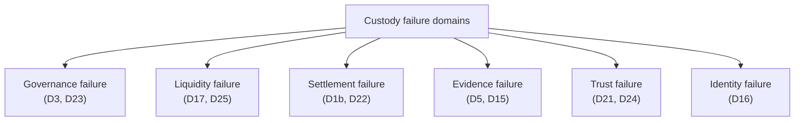

### 1.2 Domain 별 failure manifestation

| Domain | Failure form |
|---|---|
| Governance | Quorum breakdown, break-glass abuse, authority dispute |
| Liquidity | Hoarding, freeze, deadlock, exhaustion |
| Settlement | Chain halt, reorg, finality regression |
| Evidence | Tampering suspicion, retention loss, reconstruction inability |
| Trust | Public confidence collapse, peer institution distrust |
| Identity | Attribution failure, KYC fraud, cross-chain confusion |

### 1.3 Failure severity tier

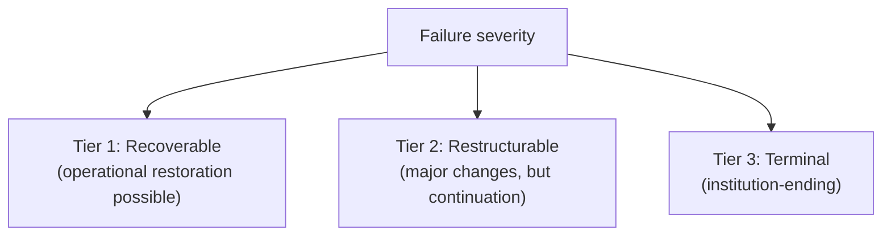

### 1.4 Failure 의 multi-domain manifestation

(★ Hypothesis — cluster-wide pattern)

- Real-world failure 는 single domain 아닌 multi-domain:
  - Trust failure (D21) → liquidity withdrawal (D25)
  - Governance failure (D23) → settlement freeze (D22 effects)
  - Identity failure (D16) → compliance trigger → regulatory action (D23)
- → Domain isolation 의 false simplicity.

### 1.5 "Technical failure ≠ Institutional failure"

(§0 명제)

- Technical: system component 의 malfunction.
- Institutional: organization 의 capability loss.
- 차이:
  - Technical 의 recovery 는 hours-days.
  - Institutional 의 recovery 는 months-years 또는 영구.
  - Technical failure 가 trigger 일 수 있지만 institutional failure 의 root 가 아님.
- → Failure analysis 의 multi-layer.

---

## 2. Cascading Coordination Failures

### 2.1 Cascade dynamics

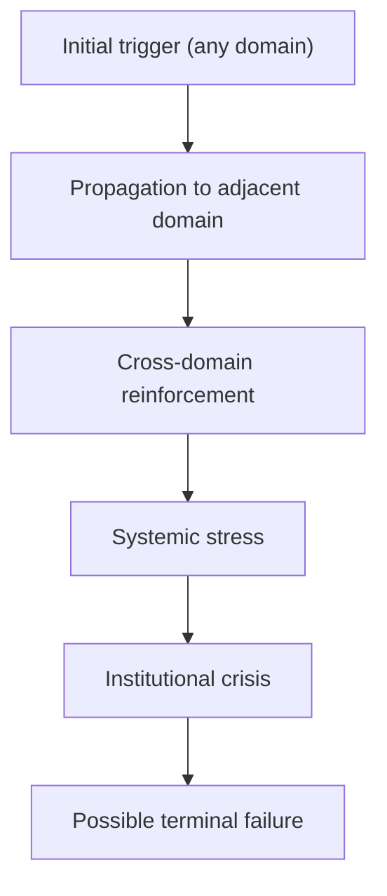

### 2.2 Cross-domain propagation paths

(★ Hypothesis — failure pattern observation)

| Source → Target | Mechanism |
|---|---|
| Trust → Liquidity | Mass redemption (D21 §5) |
| Settlement → Trust | Chain halt confidence loss (D22) |
| Governance → Trust | Public credibility damage (D23) |
| Liquidity → Trust | Inability to honor commitments (D25) |
| Identity → Compliance → Regulatory → Governance | Attribution failure → regulatory action |
| Evidence → Trust | Forensic uncertainty (D15) |

### 2.3 Reinforcement loops

- Trust loss → defensive action → operational stress → more trust loss.
- Liquidity stress → forced sale → asset price drop → more stress.
- Governance dispute → split-brain → operational inconsistency → more dispute.
- → Self-amplifying cycles.

### 2.4 Cascade 의 time scale

- Slow cascade (days-weeks): regulatory + reputational.
- Fast cascade (hours): liquidity + settlement.
- Instant cascade (minutes): trust panic + market.
- → Response time vs cascade speed.

### 2.5 Containment 의 difficulty

- 단일 domain 에 failure 격리 어려움.
- 그러나 isolation 시도 = institution-saving action.
- → Crisis management 의 art.

---

## 3. Hidden Coupling Topology

### 3.1 Hidden coupling sources

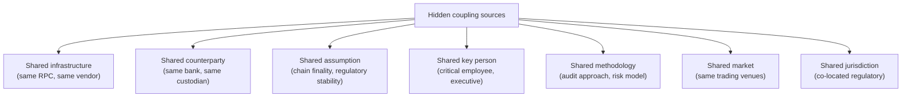

### 3.2 Coupling 의 invisibility

- Pre-crisis: 각 institution 의 own view 에서 의식 안 됨.
- Crisis: 갑작스럽게 visible:
  - "We didn't realize we shared the same custodian"
  - "Both depend on same RPC provider"
  - "Same auditor"
- → Crisis 의 retrospective revelation.

### 3.3 Coupling reduction (mitigation)

| Mitigation |
|---|
| Vendor diversification |
| Multi-bank, multi-custodian |
| Diverse audit firm |
| Independent infrastructure |
| Avoid concentration in single jurisdiction |
| Diverse methodology |
| Multi-venue trading |

### 3.4 "Surviving assets ≠ Surviving institution"

(§0 명제)

- Asset 의 preservation = technical / legal property.
- Institutional survival = ongoing organization 의 functioning.
- 차이:
  - Asset intact but institution 가 license loss → asset 가 stuck
  - Institution functional but asset 의 large loss → operational continuation 어려움
- → 둘 다 필요, 별개 dimension.

### 3.5 Latent failure topology

(§0.2)

- 모든 architecture 가 own latent failure topology.
- Topology 의 mapping = pre-crisis preparation:
  - Stress test (D17 §3.5)
  - Tabletop exercise (D12 §5.1)
  - Red team / threat model (D14)
  - Disaster recovery exercise (D4 §6)
- → Continuous discipline.

---

## 4. Survivability Boundary

### 4.1 Survivability 의 layered model

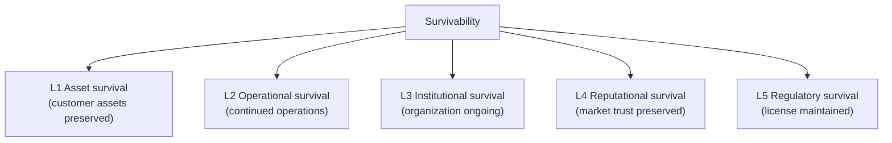

### 4.2 각 layer 의 partial vs full

| Layer | Partial | Full |
|---|---|---|
| L1 Asset | 일부 customer loss | All assets preserved |
| L2 Operational | Limited service | Full service |
| L3 Institutional | Restructured | Original form |
| L4 Reputational | Damaged but rebuilding | Full reputation |
| L5 Regulatory | Restricted license | Full license |

### 4.3 "Partial continuity ≠ Survivability"

(§0 명제)

- Partial: some layers preserved, others lost.
- Survivability: meaningful continuation.
- 차이:
  - Asset survival 만 있고 operational 없음 = de facto failure
  - Operational 만 있고 customer trust 없음 = walking dead
- → Multi-layer 의 minimum threshold.

### 4.4 Survivability 의 acceptable threshold

(★ Hypothesis — operational reasoning)

- 정의 어려움 — context-specific.
- Examples:
  - L1 minimum 95%
  - L2 minimum 80%
  - L3 minimum (institution 의 continuation)
  - L4 minimum (some trust 의 retention)
  - L5 minimum (regulator 의 forbearance)
- → Threshold 정의 가 strategic decision.

### 4.5 Residual institutional capability

- Failure 후 의 남는 것:
  - Knowledge (people, documentation)
  - Customer relationships (loyal customer)
  - Regulatory relationships
  - Infrastructure (technical)
  - Brand value
  - Asset (some)
  - Legal entities
- → 이것이 future reconstruction 의 foundation.

---

## 5. Failure Topology Patterns

### 5.1 Common failure pattern 의 taxonomy

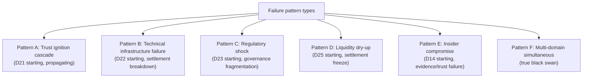

### 5.2 Pattern-specific response

| Pattern | Initial response | Long-term |
|---|---|---|
| A Trust ignition | Transparency + liquidity demonstration | Trust rebuilding |
| B Technical | Coordinate chain recovery + customer communication | Multi-chain redundancy |
| C Regulatory | Legal counsel + diplomatic + restructure | Multi-jurisdiction strategy |
| D Liquidity | Activate backstop + transparency | Liquidity diversification |
| E Insider | Containment + forensic + governance audit | Insider mitigation strengthening |
| F Multi-domain | Crisis command + triage + escalation | Architectural review |

### 5.3 Failure 의 unique vs general

- 각 incident 는 unique combinations.
- 그러나 underlying pattern 의 recurrence.
- → Pattern recognition 의 strategic value.

### 5.4 Failure narrative 의 long-term

(★ Hypothesis — institutional memory pattern)

- Each major failure 가 industry 의 collective memory:
  - Mt. Gox (2014) — exchange custody lessons
  - DAO (2016) — smart contract + hard fork
  - Bitfinex (2016) — exchange hack
  - Lehman (2008) — TBTF + counterparty
  - FTX (2022) — commingled custody + governance
- → Future architecture 가 past failure 의 lesson.

### 5.5 "Evidence preservation ≠ Reputation preservation"

(§0 명제)

- Evidence preserved = forensic / legal recovery 가능.
- Reputation preserved = market trust 의 retention.
- 차이:
  - Evidence 가 perfect 해도 reputation 가 damaged (storytelling problem)
  - Reputation 가 intact 해도 evidence gap (legal vulnerability)
- → Two different post-crisis trajectories.

---

## 6. Operational Entropy

### 6.1 Operational entropy 의 정의

(★ Hypothesis — operational reasoning)

- 시간 경과에 따른 organizational disorder 의 accumulation:
  - Documentation 의 staleness
  - Personnel turnover
  - System drift
  - Process erosion
  - Knowledge loss
- → 평소 visible 안 됨, crisis 시 critical impact.

### 6.2 Entropy 의 sources

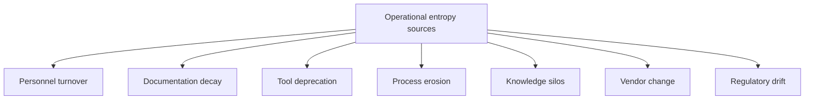

### 6.3 Anti-entropy mechanism

| Mechanism | 의미 |
|---|---|
| Continuous documentation | Knowledge codification |
| DR exercise (D12 §5) | Procedure freshness |
| Cross-training | Knowledge distribution |
| Postmortem culture | Learning systematization |
| Tool maintenance | System currency |
| Process review | Drift detection |
| Knowledge audit | Inventory + refresh |

### 6.4 Entropy 의 crisis 시 cost

- Crisis 시 stale documentation 이 useless.
- Senior 의 turnover 후 tribal knowledge 의 부재.
- Tool 의 outdated 사용법.
- → Entropy 가 crisis response capability 의 ceiling.

### 6.5 Continuous discipline 의 cost

- Anti-entropy 활동은 ongoing cost.
- Visible benefit 부재 시 budget 우선순위 ↓.
- 그러나 crisis 시 absence 의 dramatic cost.
- → Long-term investment 의 governance.

---

## 7. Post-Failure Reconstruction

### 7.1 Reconstruction phases

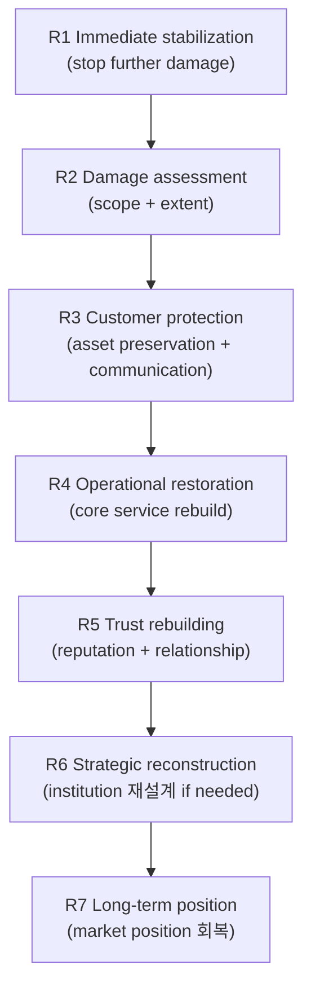

### 7.2 Reconstruction 의 priorities

| Phase | Priority |
|---|---|
| Immediate | Customer asset preservation + transparent communication |
| Short-term | Operational restoration + regulator engagement |
| Medium-term | Trust rebuilding + reputational recovery |
| Long-term | Strategic repositioning + architectural improvement |

### 7.3 "System recovery ≠ Trust recovery"

(§0 명제)

- System recovery: technical operational restoration.
- Trust recovery: market + customer + regulator 의 confidence 회복.
- Timeline:
  - System: hours-weeks
  - Trust: months-years (or permanent loss)
- → 두 different process.

### 7.4 Customer 의 fate

- Customer 의 outcomes:
  - Full recovery (asset return + service continuation)
  - Partial recovery (some loss + service continuation)
  - Compensation (asset loss + monetary compensation)
  - Loss (asset loss + no compensation)
- → Customer 의 trust 의 future 의 결정.

### 7.5 Wind-down 의 option

- Reconstruction 의 alternative: orderly wind-down.
- Wind-down 의 mechanism:
  - Customer asset return (or transfer to peer)
  - Operational closure
  - Regulatory cooperation
  - Personnel transition
- → 일부 failure 의 acceptable conclusion.

---

## 8. Failure Evidence Chain

### 8.1 Crisis evidence 의 unique properties

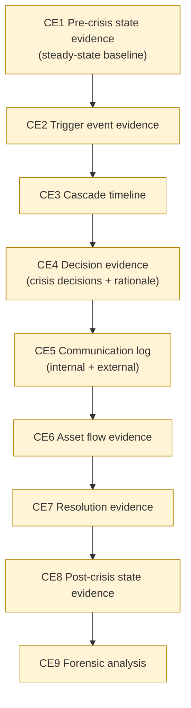

### 8.2 Evidence 의 multi-audience

- Internal: postmortem + learning.
- Customer: redress + transparency.
- Regulator: investigation + compliance.
- Public: information + narrative.
- Legal: litigation + criminal.
- → Same evidence 의 different presentation per audience.

### 8.3 Evidence preservation under chaos

- Crisis 중 evidence preservation 의 의식적 effort:
  - Scribe role (D12)
  - Auto-logging maximization
  - Time-stamping with cryptographic anchor
  - Multi-source preservation
- → 평소 의 evidence discipline 이 crisis 시 critical.

### 8.4 Evidence integrity 의 legal long-term value

- Years 후 의 legal proceeding 도 evidence 가 admissible 해야:
  - Chain of custody (D5)
  - Tamper detection (D14)
  - Signed envelope
  - Auditor cooperation
- → Evidence 의 future-proofing.

### 8.5 Anti-pattern: evidence suppression

- Crisis 중 의 information suppression 의 instinct.
- 그러나 long-term cost:
  - Cover-up 발견 시 reputation 의 incremental damage
  - Legal consequence (obstruction)
  - Internal moral hazard
- → Transparency 의 long-term wisdom.

---

## 9. Operational Fragility Map (Cluster Summary)

```mermaid
graph TB
    F1["F1. Institutional memory loss<br/>(personnel turnover + entropy)"]
    F2["F2. Coordination entropy<br/>(communication breakdown over time)"]
    F3["F3. Evidence fragmentation<br/>(multi-system, multi-vendor)"]
    F4["F4. Liquidity contagion<br/>(D25 systemic)"]
    F5["F5. Governance exhaustion<br/>(decision capacity decay)"]
    F6["F6. Operational survivability ceiling<br/>(maximum sustainable stress)"]
    F7["F7. Trust narrative fragmentation<br/>(multiple conflicting story)"]
    F8["F8. Customer abandonment<br/>(mass exit)"]
    F9["F9. Vendor/partner exit<br/>(supporting infrastructure withdrawal)"]
    F10["F10. Cumulative failure correlation<br/>(multiple stress simultaneous)"]

    F1 -->|mitigation| M1["Documentation discipline + knowledge management"]
    F2 -->|mitigation| M2["Communication infrastructure + protocol"]
    F3 -->|mitigation| M3["Unified evidence platform (D5)"]
    F4 -->|mitigation| M4["D25 §8 emergency coordination"]
    F5 -->|mitigation| M5["Pre-positioned decision authority + delegation"]
    F6 -->|mitigation| M6["Stress test + scenario planning + recovery capacity"]
    F7 -->|mitigation| M7["Single-source truth + communication discipline"]
    F8 -->|mitigation| M8["Customer protection + early stabilization"]
    F9 -->|mitigation| M9["Vendor diversity + relationship pre-position"]
    F10 -->|mitigation| M10["Multi-domain stress test + resilience design"]
```

### 9.1 분류

| 분류 | items | 성격 |
|---|---|---|
| **Entropy** | F1, F2, F5 | discipline |
| **Architectural** | F3, F6 | structural |
| **Systemic** | F4, F10 | network |
| **Trust** | F7, F8 | narrative |
| **External** | F9 | dependency |

---

## 10. Limitations

### 10.1 Technical ≠ Institutional failure

§1.5.

### 10.2 System ≠ Trust recovery

§7.3.

### 10.3 Surviving assets ≠ Surviving institution

§3.4.

### 10.4 Evidence ≠ Reputation preservation

§5.5.

### 10.5 Partial continuity ≠ Survivability

§4.3.

### 10.6 Crisis prediction 의 한계

- Tail risk modeling 어려움.
- Past failure 의 lessons 가 future failure 의 prediction 보장 아님.

### 10.7 Universal survivability 불가능

- 100% survival 은 logical impossibility.
- Acceptable survival 의 design 가 reality.

---

## 11. 3-way Crisis Survivability Burden

### 11.1 Plane × Ownership

| 영역 | SaaS | Hosted MPC | Direct-build |
|---|---|---|---|
| Vendor 의 own crisis (vendor disappearance) | **Customer fully exposed** | Less | None |
| Customer 의 own crisis | Customer | Customer | Customer |
| Cluster D21-D25 의 crisis | Customer | Customer | Customer |
| Inter-institution coordination | Customer | Customer | Customer |
| Recovery infrastructure | Customer (with vendor support) | Customer + vendor | Customer |
| Long-term reconstruction | Customer | Customer | Customer |

### 11.2 Customer crisis survivability burden (★ Hypothesis)

- SaaS: ~95-100% (depending on vendor 의 own survival)
- Hosted: ~98-100%
- Direct-build: ~100%

### 11.3 Recommendation

| Context | 권장 |
|---|---|
| Small institution | Survive via minimum exposure + peer relationships |
| Medium institution | Crisis playbook + transparency + peer coordination |
| Large institution | Federation leadership + central bank relationship + multi-domain stress test |
| Stablecoin issuer / systemic | Comprehensive resilience + backstop + regulator confidence |

---

## 12. Cluster Closing Summary (D21-D22-D23-D25-D26)

### 12.1 5-document cluster integration

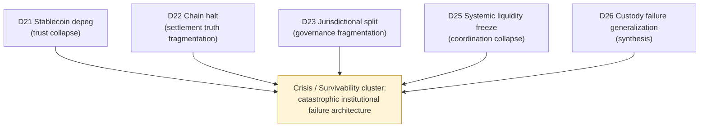

### 12.2 Cluster thesis 재확인

> **Survivability is the residual institutional capability that remains after core assumptions collapse.**

- D21: trust 의 collapse
- D22: settlement truth 의 fragmentation
- D23: governance 의 partition
- D25: liquidity 의 coordination collapse
- D26: synthesis + residual capability

### 12.3 Cluster invariant 의 통합 (25 "≠")

| Document | ≠ propositions |
|---|---|
| **D21** | Peg deviation ≠ Insolvency / Redemption pressure ≠ Failure / Reserve equality ≠ Confidence / Treasury freeze ≠ Settlement stop / Market recovery ≠ Trust recovery |
| **D22** | Chain halt ≠ Settlement halt / Finality ambiguity ≠ Double-spend / Canonical ≠ Permanent / Reorg recovery ≠ State certainty / Technical ≠ Institutional recovery |
| **D23** | Compliance divergence ≠ Illegality / Freeze ≠ Confiscation / Visibility ≠ Control / Cross-border ≠ Unified / Legal ≠ Operational recovery |
| **D25** | Asset ownership ≠ Settlement liquidity / Visibility ≠ Usability / Coordinated freeze ≠ Insolvency / Liquidity support ≠ Confidence / Emergency routing ≠ Continuity |
| **D26** | Technical ≠ Institutional failure / System ≠ Trust recovery / Surviving assets ≠ Surviving institution / Evidence ≠ Reputation preservation / Partial continuity ≠ Survivability |

### 12.4 Cluster fragility integration

- D21: bank-run / liquidity / bridge / treasury / disclosure / panic
- D22: ambiguity / conflict / canonical / bridge / suspension / reconciliation
- D23: freeze conflict / reporting / deadlock / partition / split-brain / paralysis
- D25: withdrawal halt / refusal / deadlock / hoarding / trust collapse / overload
- D26: memory loss / entropy / fragmentation / contagion / exhaustion / ceiling / narrative / abandonment / vendor exit / correlation

→ Cluster cumulative fragility: catastrophic institutional failure 의 multi-domain risk.

### 12.5 Cluster customer burden

| Document | Customer burden in crisis (★ Hypothesis) |
|---|---|
| D21 | ~95% |
| D22 | ~85% |
| D23 | ~100% |
| D25 | ~100% |
| D26 | ~100% |

→ Crisis cluster 의 customer burden 거의 항상 100% — vendor 의 own institutional boundary 의 fundamental limit.

### 12.6 Survivability boundary 의 definition

- Survivability = residual institutional capability after core assumption collapse.
- "Core assumption" examples:
  - Stablecoin peg holds
  - Chain produces blocks
  - Regulatory remains stable
  - Liquidity remains available
- 각 cluster doc 은 specific core assumption 의 collapse.
- → Survivability 의 architecture 가 crisis preparation 의 본질.

### 12.7 Residual institutional capability

(§4.5)

- 모든 failure 후 의 남는 것:
  - Knowledge / people
  - Customer relationships
  - Regulatory relationships
  - Infrastructure
  - Brand
  - Legal entities
- 이것이 reconstruction 의 foundation.

### 12.8 Latent failure topology recognition

(§3.5)

- 모든 architecture 가 own latent failure topology.
- Pre-crisis recognition + mitigation:
  - Stress test
  - Tabletop exercise
  - Red team
  - DR exercise
- → Continuous discipline.

---

## 13. Q1-Q10 Reasoning

### Q1. Technical ≠ Institutional failure

§1.5.

### Q2. System ≠ Trust recovery

§7.3.

### Q3. Surviving assets ≠ Surviving institution

§3.4.

### Q4. Evidence ≠ Reputation preservation

§5.5.

### Q5. Partial continuity ≠ Survivability

§4.3.

### Q6. 6 failure domains

§1.1.

### Q7. Cascading propagation

§2.

### Q8. Hidden coupling

§3.

### Q9. Operational entropy

§6.

### Q10. Residual institutional capability

§4.5.

---

## 14. Open Questions / Org Policy

| 영역 | 질문 |
|---|---|
| Failure scenarios catalog | which scenarios? |
| Cross-domain stress test | frequency? scope? |
| Latent failure topology mapping | annual review? |
| Survivability threshold | per layer minimum? |
| Reconstruction plan | predefined per failure type? |
| Wind-down option | when to invoke? |
| Customer compensation policy | scope? |
| Insurance | scope? |
| Reputational risk management | proactive plan? |
| Operational entropy management | continuous? |
| Knowledge codification | how systematic? |
| Crisis evidence preservation | maximum capture? |
| Multi-domain coordination | who orchestrates? |
| Federation participation | which forums? |
| Central bank relationship | exists? cultivate? |
| Backstop arrangement | with whom? |
| Post-failure rebuild architecture | predefined? |
| Customer trust rebuild strategy | proactive? |
| Long-term position recovery | strategy? |
| Lessons learned propagation | industry sharing? |

---

## 15. References + Uncertainty Boundary + Cluster Next

### 관련 wiki

| 참조 |
|---|
| [[docs/architecture/stablecoin-depeg-crisis-handling]] (D21) |
| [[docs/architecture/consensus-failure-chain-halt]] (D22) |
| [[docs/architecture/jurisdiction-split-regulatory-attack]] (D23) |
| [[docs/architecture/systemic-liquidity-freeze]] (D25) |
| [[docs/architecture/three-way-custody-decision-framework]] §10 (failure-state) |
| [[docs/architecture/operational-maturity-incident-command]] §10 (operational survivability) |
| [[docs/architecture/security-threat-model-adversarial-resilience]] §10 (adversarial fragility) |

### Uncertainty Boundary

- 6 failure domain / 3-tier severity / cascade dynamics / 7 hidden coupling / 5-layer survivability / 7-phase reconstruction / 10 cluster fragility / 95-100% burden = **generalized failure architecture pattern (Hypothesis ★)**.
- §5.4 institutional memory = historical pattern.
- §11.2 burden 백분율 = estimate.
- §14 에 org policy 영역 명시.

### Cluster Closing

D21-D22-D23-D25-D26 Crisis / Survivability cluster **완성**.

**Cluster 최종 정의 (sentence)**:
> Institutional custody systems are not ultimately tested during steady-state operation. They are tested when trust (D21), settlement (D22), governance (D23), and liquidity (D25) fail simultaneously — and the residual capability that remains (D26) is what defines survival.

### Post-cluster Optional Domains

다음 optional deep-dive 후보:

- CBDC / Sovereign Digital Money
- Intent-based Settlement / Solver Networks
- Autonomous Treasury Governance
- AI-assisted Operational Governance
- Cross-chain Shared Sequencer Systems
- Tokenized Real-world Asset Infrastructure
- Institutional Privacy / Confidential Settlement
- Post-quantum Custody Survivability

### Architecture reasoning corpus 누적 (27 documents)

| Cluster | Documents |
|---|---|
| Generalized skeleton | D1a, D1b, D2, D3, D4, D5, D6, D7, D8 |
| Single specialization | D9, D10, D11, D12, D13, D14 |
| Trust cluster | D15, D16, D24 |
| Liquidity cluster | D17, D18, D19, D20 |
| **Crisis cluster** | **D21, D22, D23, D25, D26** |

→ **27 documents = comprehensive generalized custody architecture reasoning corpus**.

| Cluster | Theme |
|---|---|
| Foundation (D1a-D8 + D6) | what custody is |
| Infrastructure (D9-D14) | how custody runs |
| Trust (D15-D16-D24) | how custody is verifiable |
| Liquidity (D17-D20) | how custody scales monetary |
| **Crisis (D21-D26)** | **how custody fails and survives** |

---

**Stage 32 D26 completion timestamp**: 2026-05-20.
