# Custody Wallet — Deposit Lifecycle Detailed Reasoning

> **본 문서의 위치**: D8 의 mirror — outbound 의 12-phase complexity 와 달리 deposit 은 **2-domain reconciliation** (Blockchain ↔ Ledger). Governance / Signing 미관여. 그러나 attribution / risk gating / spam filtering 등 deposit-specific complexity 존재. D1a (L3 Ledger / L9 chain cache) + D1b (reconciliation) + D5 (evidence chain) 의 inbound 측면 통합.

> **본 문서가 답하는 핵심 질문**: 왜 deposit 은 "들어온 transaction 발견" 이 아닌가? 왜 indexer 가 tx 를 봤는데도 deposit 으로 인정 안 되는 경우가 있는가? 왜 confirmed deposit 도 spendable 아닐 수 있는가? 왜 deposit 의 reversal (reorg) 이 단순 rollback 이 아닌가?

---

## 0. 핵심 명제 (10초 이해)

1. **Deposit is not transaction detection. Deposit is controlled ledger recognition of external settlement.** — 본 문서의 thesis.
2. **9 phase + 2 truth domain + 6 timestamp + 4 balance type** — withdrawal (D8) 의 simpler form 이지만 own complexity 존재.
3. **10-tier "≠" 명제** — observed / included / confirmed / recognized / credited 가 모두 다른 의미.
4. **Address ownership ≠ Economic ownership** — custody 가 보유 address 에 도착했다고 customer 의 의도된 deposit 인지 별도 attribution.
5. **Attribution = deposit-specific complexity** — address / memo / smart contract event / sender 의 multi-key matching.
6. **Reorg 시 deposit reversal 은 compensating credit (negative entry)** — append-only invariant 유지하면서 ledger truth 복귀.
7. **Double-credit prevention = tx_hash + log_index unique** — same chain tx 가 두 번 credit 안 되는 idempotency invariant.
8. **Spam / dust / adversarial deposit 의 처리는 정책 영역** — accept / quarantine / reject 의 결정.
9. **Confirmation ≠ Economic finality** (D1b 의 직접 적용) — 같은 4-balance state 모델.
10. **Deposit 의 governance 미관여 default — 단, large/suspicious deposit 은 policy gate 가 추가 검증 trigger 가능**.

---

## 1. Deposit Generalized Lifecycle (9 phase)

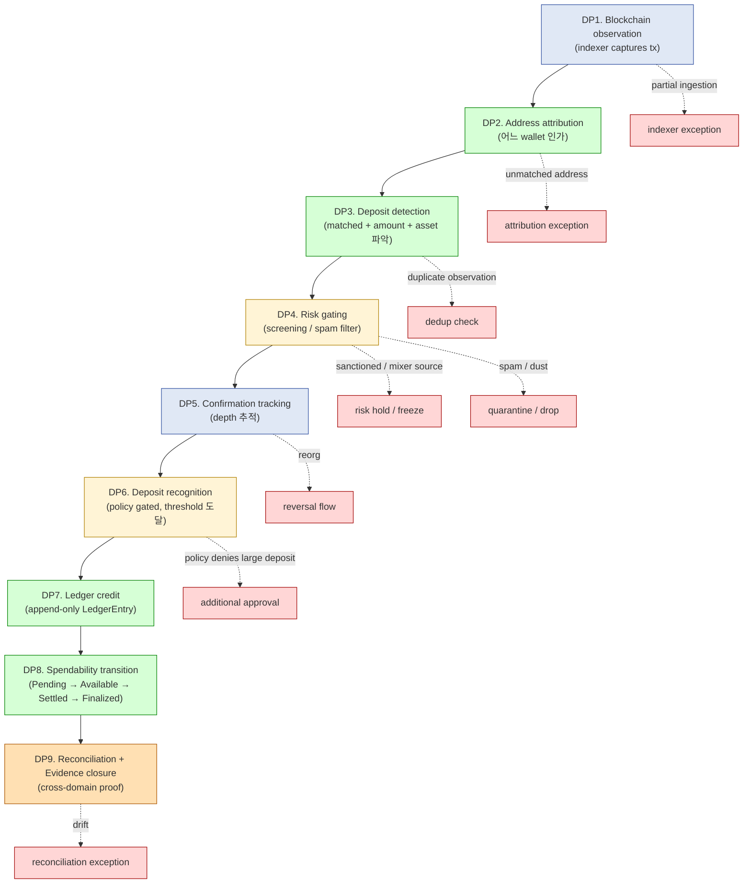

### 1.1 9 phase 의 domain mapping

| Phase | Primary domain | Authority | Aggregate (D1a) |
|---|---|---|---|
| DP1 Observation | Blockchain (L9) | Blockchain | Block / Tx cache |
| DP2 Attribution | Custody hierarchy (L2) | Custody | Address registry lookup |
| DP3 Detection | L2 + L9 | Cross | DepositDetection event |
| DP4 Risk gating | Policy (L5) | Risk engine | DepositRiskAssessment |
| DP5 Confirmation tracking | Blockchain (D1b) | Blockchain | (chain state) |
| DP6 Recognition | L2 + Policy | Confirmation policy | DepositRecognition |
| DP7 Ledger credit | Ledger (L3) | Ledger | LedgerEntry (positive, append) |
| DP8 Spendability | Ledger projection | Ledger | LedgerEntry state field |
| DP9 Reconciliation | Cross-domain (D1b) | Cross | ReconciliationProof |

### 1.2 Withdrawal (D8) 과의 비교

| 차원 | Withdrawal (D8) | Deposit (D7) |
|---|---|---|
| Phase 수 | 12 | 9 |
| Truth domain | 5 (Gov / Sig / Chain / Led / Recon) | **2** (Chain / Led) |
| User intent | explicit (user request) | implicit (external sender intent) |
| Governance | mandatory | default 미관여 (large/suspicious 만 trigger) |
| Signing | mandatory | 미관여 (custody 는 receive only) |
| Recovery | conditional | 미관여 |
| Direction | outflow (debit) | inflow (credit) |
| Failure during execution | retry-eligible | **N/A** — sender 가 owner |
| Cancellation | phase-specific | **불가능** — sender 의 chain action 만 |
| Latency control | own (system) | external (chain + sender) |

→ Deposit 의 complexity 는 attribution + risk + spam + reorg 에 집중.

### 1.3 핵심: "observation 이 곧 deposit 이 아니다"

- Indexer 가 chain tx 를 본 것 = chain truth 만의 fact.
- Custody 가 deposit 으로 인정하기까지는:
  - Address attribution (이 address 가 우리 wallet 인가)
  - Risk screening (sanctioned source 가 아닌가)
  - Confirmation policy (충분히 confirmed 됐는가)
  - Recognition policy (인정 가능한 deposit 인가 — spam / dust 아닌가)
- 위 4 gate 모두 통과해야 ledger credit.

---

## 2. Cross-Domain Authority (2-domain)

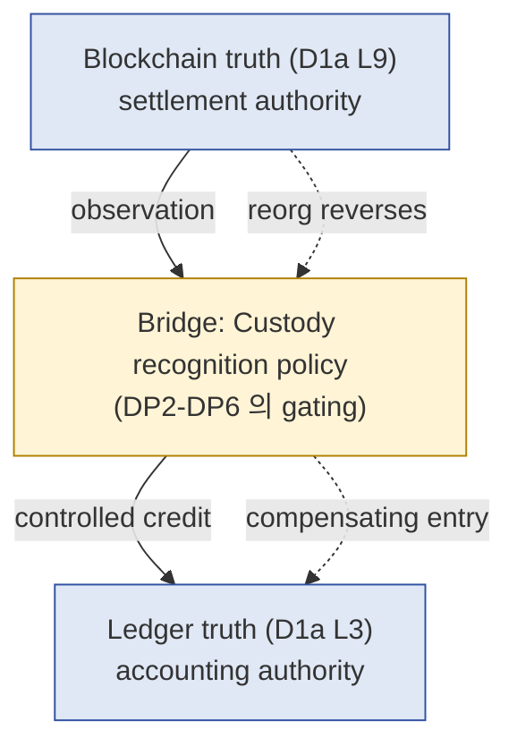

### 2.1 Authority transition

| Phase | Authority |
|---|---|
| DP1 Observation | Blockchain (sole source) |
| DP2-DP6 Recognition gating | **Custody policy plane** (Blockchain 의 observation 을 ledger truth 로 transform 하는 권한) |
| DP7-DP8 Ledger | Ledger (internal) |
| DP9 Reconciliation | Cross-domain (Chain ↔ Ledger consistency) |

### 2.2 "Indexed event ≠ Complete truth" reasoning

(§0 명제)

- Indexer 가 본 tx 가 chain 의 진실 — 그러나 system 의 deposit truth 는 별개.
- 가능한 gap:
  - Indexer 의 bug / partial ingestion
  - Smart contract 의 비표준 event encoding
  - Re-org 로 인한 chain state 변화
  - Indexer 의 retention 만료 (오래된 deposit)
- → DP1 의 indexer 출력은 **input**, ledger truth 는 별도 process.

### 2.3 Bridge authority 의 의미

(★ 본 문서의 핵심)

- Blockchain ↔ Ledger 사이의 **policy-driven gate**.
- Custody 가 "blockchain 의 어떤 event 를 ledger 의 어떤 entry 로 translate 하는가" 의 결정.
- 이 bridge 는 단순 mapping 이 아닌 **judgment** — attribution / risk / confirmation / recognition.
- → Deposit 의 본질은 이 bridge layer 의 정책 reasoning.

---

## 3. Address Attribution Reasoning

### 3.1 Attribution 의 4 model

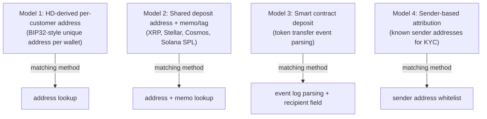

### 3.2 각 model 의 trade-off

| Model | Privacy | Complexity | Risk |
|---|---|---|---|
| M1 HD-derived | High (별도 address per customer) | Address generation + derivation tracking | Address loss → fund inaccessible |
| M2 Shared + memo | Medium (address 공유, memo unique) | Memo enforcement + memo collision 처리 | Memo 누락 = unattributable |
| M3 Smart contract | Variable | Event parsing + ABI 의존 | Contract upgrade 시 attribution 깨짐 |
| M4 Sender-based | Low (sender 식별 노출) | Sender whitelist 관리 | Sender spoofing (특정 chain) |

### 3.3 Multi-key attribution

(★ Hypothesis — operational pattern)

- 단일 key (address) 만으로 attribution 불충분한 경우 multi-key:
  - address + memo (XRP / Stellar)
  - address + sender pattern (KYC 강한 경우)
  - address + token contract (ERC20 vs native ETH)
  - address + amount range (deposit reference number 패턴)

### 3.4 Attribution ambiguity

(★ deposit-specific difficulty)

| 시나리오 | 처리 |
|---|---|
| Address 존재하지만 customer wallet 미 mapping | exception queue (manual attribution) |
| Memo 누락 (shared address) | unattributable hold (TTL 후 return 또는 manual) |
| Memo collision (다른 customer 의 memo 와 일치) | first-match + audit + manual review |
| Token 등록 안 됨 (unknown ERC20) | unknown asset queue (whitelisting required) |
| Smart contract 의 비표준 event | parser exception + manual |
| Sender mismatch (KYC 기대와 다름) | risk hold + investigation |

### 3.5 "Address ownership ≠ Economic ownership" reasoning

(§0 명제)

- Custody 가 보유 address 에 fund 도착 = custody 의 chain-side ownership.
- 그러나 그 fund 가 어느 customer 의 것인가는 별도 결정 (attribution).
- Attribution 실패 시: chain-side 는 custody 의 것이지만 internal 으로는 unallocated.
- → Address ownership (chain) ≠ Economic ownership (internal).

---

## 4. Confirmation / Finality Reasoning

(D1b §2 의 deposit 적용)

### 4.1 6 settlement state (deposit-specific)

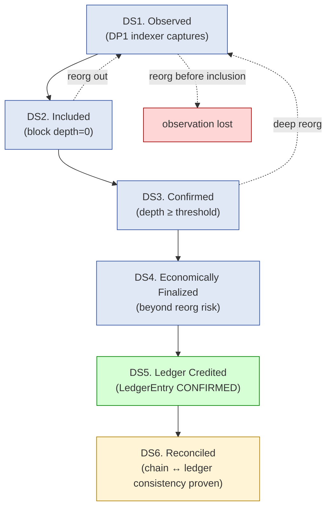

### 4.2 "Confirmation ≠ Economic finality" (deposit 측면)

- Confirmation = block 포함 + depth threshold (chain-side fact).
- Economic finality = reorg risk negligible (chain-specific 한 더 깊은 threshold).
- 차이 영역: shallow reorg 시 confirmed deposit 이 사라질 수 있음 → compensating credit 필요.

### 4.3 Confirmation policy 의 dimension

| Dimension | 결정 |
|---|---|
| Per chain threshold | BTC 6 / ETH 12 / Solana 32 등 (chain-specific) |
| Per asset 추가 buffer | high-value asset (BTC) > stablecoin > test net |
| Per amount threshold | 큰 deposit 은 더 많은 confirmation |
| Per customer tier | institutional vs retail 별 |

### 4.4 Recognition timing model (M-D1 to M-D4)

deposit-specific timing model — 어느 settlement state 에서 ledger credit?

| Model | Recognition state | Trade-off |
|---|---|---|
| **M-D1 Observed** | DS1 | Earliest UX, highest reversal risk |
| **M-D2 Included** | DS2 | Fast UX, reorg risk |
| **M-D3 Confirmed** | DS3 | Balanced |
| **M-D4 Finalized** | DS4 | Strict safety, latest UX |

→ 권장: M-D3 또는 M-D4 (asset 별 다름). Stablecoin M-D3, BTC M-D4.

---

## 5. Deposit Recognition Semantics

### 5.1 Recognition gate 의 5 조건

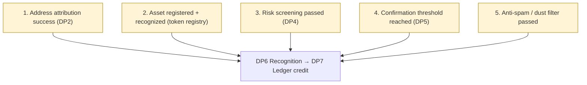

### 5.2 5 gate 의 책임 분리

| Gate | 결정 권한 |
|---|---|
| Attribution | L2 custody hierarchy + memo policy |
| Asset registry | Asset whitelist + token contract 등록 |
| Risk screening | Risk engine (sanctioned address list / mixer source detection) |
| Confirmation | Per-asset confirmation policy |
| Anti-spam | Dust threshold + spam token blacklist |

### 5.3 Spam / Dust 처리 정책

(★ deposit-specific operational reasoning)

| 종류 | 정의 | 처리 |
|---|---|---|
| Dust | minimum deposit threshold 미만 | quarantine 또는 drop |
| Spam token | blacklist 등록된 token | reject + audit |
| Airdrop (unwanted) | 등록 안 된 token | unknown asset queue |
| Mixer / coinjoin source | risk engine flag | hold + investigation |
| Sanctioned address | OFAC / similar list match | freeze + compliance escalation |

### 5.4 Large deposit + governance trigger

(★ Hypothesis — operational pattern, deposit 의 예외적 governance)

- 일반 deposit 은 governance 미관여.
- 그러나 큰 deposit (예: > $1M) 은 policy 가 추가 검증 trigger 가능:
  - Compliance review (AML)
  - Senior approval before crediting
  - Source-of-funds documentation 요청

→ 일반 deposit lifecycle 위에 governance overlay — 정책별.

### 5.5 "Deposit recognition ≠ Spendable balance"

(§0 명제)

- Recognition = ledger credit (DP7).
- Spendable = Available 이상의 balance type.
- Recognition 후에도:
  - Pending → Available transition 까지 시간 소요
  - Hold 정책 (deposit cooldown — withdrawal lock for N hours)
  - Risk-based hold (suspicious deposit 의 longer hold)

---

## 6. Pending vs Spendable Balance Model

(D1b §3 의 deposit 측면)

### 6.1 4 balance state (deposit context)

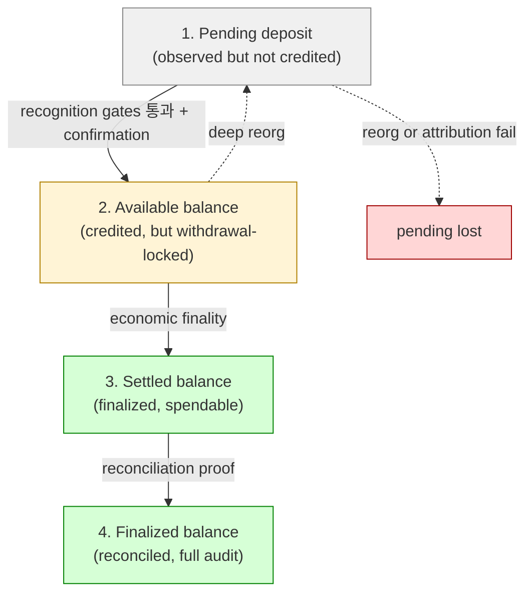

### 6.2 각 balance type 의 의미

| State | Spendable? | UX 표현 | Risk |
|---|---|---|---|
| Pending | No | "Pending" 또는 hidden | Reorg / attribution fail |
| Available | Yes (with hold lift) | "Available" | Deep reorg |
| Settled | Yes | "Settled" | None |
| Finalized | Yes (full confidence) | (보통 hidden) | None |

### 6.3 Deposit hold 정책

(★ Hypothesis — operational pattern)

- Recognition 후에도 즉시 withdrawal 불가 정책 가능:
  - Time-based hold (N hours / days)
  - Confirmation-based hold (deeper threshold for withdrawal)
  - Risk-based hold (suspicious deposit 의 extended hold)
- 이유: fraud / chargeback / forensic 의 시간 확보.

### 6.4 Reorg 시 balance 변동

```
Time t: deposit Confirmed → Available (1000 amount)
Time t+x: deep reorg detected
Action: compensating LedgerEntry (-1000) → balance back to original
Internal state: Pending (만약 다른 chain branch 에 같은 tx 있다면) 또는 Lost
```

→ Compensating entry 가 append-only invariant 유지. History 는 "credited and then reverted" 의 evidence.

---

## 7. Reorg / Reversal Handling

(D1b §7 의 deposit 측면)

### 7.1 Reorg severity 별 deposit 영향

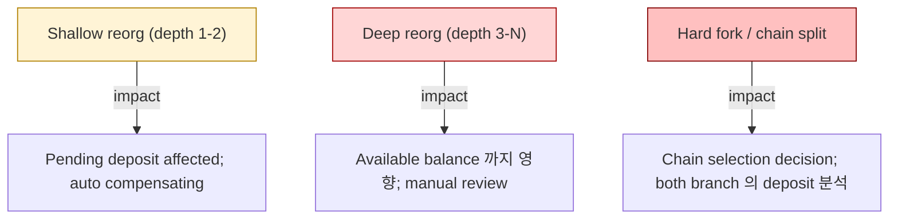

### 7.2 Compensating credit pattern

(D1a §6.4 의 deposit 측면)

- 원본 LedgerEntry (deposit credit) 은 그대로 (append-only).
- Reorg 시 chain tx 가 drop 되면 **compensating debit entry** 를 append.
- Net balance 는 0 으로 복귀 (또는 다른 branch 에 같은 tx 있으면 re-credit).
- History 는 "deposit recognized → reversed" 의 evidence.

### 7.3 "Deposit reversal ≠ Simple rollback" reasoning

(§0 명제)

- Reversal = compensating debit entry (append-only invariant 유지).
- Rollback = original entry 제거 (forbidden).
- 차이의 의미:
  - User 에게 "deposit 이 있었다 → 사라졌다" 의 forensic 가능
  - Audit trail 완전성
  - Reorg 가 다시 reverse 되면 (rare) 다시 re-credit
- Customer-facing UX 는 "Pending lost" 또는 "Reorged" 명시 — silent disappear 금지.

### 7.4 Customer notification policy

(★ Hypothesis — operational reasoning)

- Reorg 로 deposit reversal 시 customer notification 의 trade-off:
  - 즉시 notify: 투명성 ↑, customer anxiety ↑
  - Delayed notify: 만약 다시 re-credit 되면 customer 알 필요 없음
  - 권장: shallow reorg 는 silent (자동 복구); deep reorg 는 즉시 notify + 별도 audit.

### 7.5 Deep reorg 의 manual review

(D1b §7.5 의 deposit 적용)

- Deep reorg (N>10) 시 자동화 불가 — manual governance event.
- 영향받은 모든 deposit 의 status 검토.
- 51% attack 의심 시 freeze + 외부 검증.

---

## 8. Double-Credit Prevention

### 8.1 Idempotency invariant

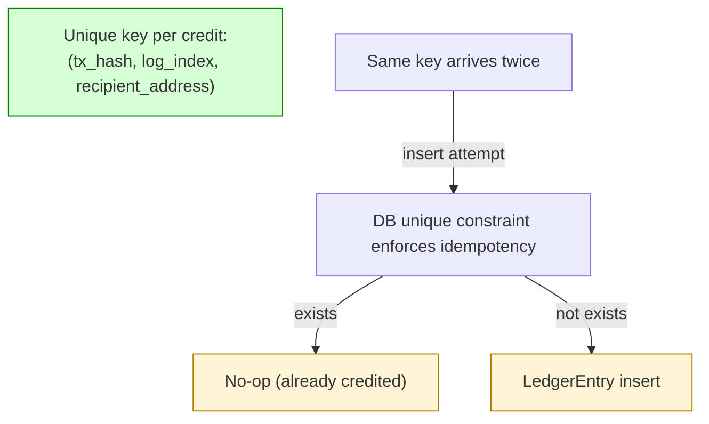

### 8.2 Unique key composition

| Key field | 이유 |
|---|---|
| **tx_hash** | chain-side unique tx identifier |
| **log_index** | smart contract 의 multiple transfer event 구분 (ERC20 한 tx 에 multi-recipient) |
| **recipient_address** | multi-output tx (UTXO chain) 의 구분 |
| (optional) **memo / tag** | shared address chains |

→ 위 composite key 가 unique constraint → re-indexing 시 자연스러운 dedup.

### 8.3 "Duplicate observation ≠ Duplicate deposit"

(§0 명제)

- Indexer 가 reorg / re-index 후 같은 tx 를 다시 emit 가능.
- 또는 multiple indexer (redundancy) 가 같은 tx 를 동시 emit.
- 모두 같은 unique key → idempotent insert (no-op).
- → Duplicate observation 은 detected by 시스템 → ledger 에는 1 entry 만.

### 8.4 Multi-RPC redundancy 시 dedup

(★ operational pattern)

- 신뢰성을 위해 multiple chain provider (Infura + Alchemy + own node) 사용.
- 동일 tx 를 다른 provider 가 동시 보고 가능.
- DB unique constraint 가 dedup — application logic 의 race 안전.

### 8.5 Cross-chain bridge double-credit 위험

(★ Hypothesis — bridge-specific)

- Bridge deposit (예: BTC → wrapped BTC 또는 USDC cross-chain) 시:
  - Source chain 의 lock event
  - Destination chain 의 mint event
- 두 chain 의 event 가 모두 credit 으로 인식되면 double-credit.
- 해결: bridge 의 deposit 은 destination chain 의 mint 만 credit (source chain 의 lock 은 무시 또는 별도 audit).
- Bridge 의 fail (source lock but no destination mint) 은 별도 reconciliation.

---

## 9. Deposit Reconciliation Reasoning

### 9.1 2-domain reconciliation 의 5-question

(D1b §4.2 의 deposit version, simpler)

| Question | Source |
|---|---|
| 이 chain tx 가 어느 LedgerEntry 와 matched 됐나? | tx_hash → LedgerEntry FK |
| 이 LedgerEntry 의 backing chain tx 는? | LedgerEntry → tx_hash |
| Address attribution 이 어느 wallet 에 됐나? | tx → attribution result |
| Asset 의 token registry 항목은? | tx → asset_id |
| Confirmation policy 가 만족됐는가? | LedgerEntry 의 confirmation_depth |

→ 5 question 모두 cleanly resolve = deposit reconciliation success.

### 9.2 Deposit-specific drift detection

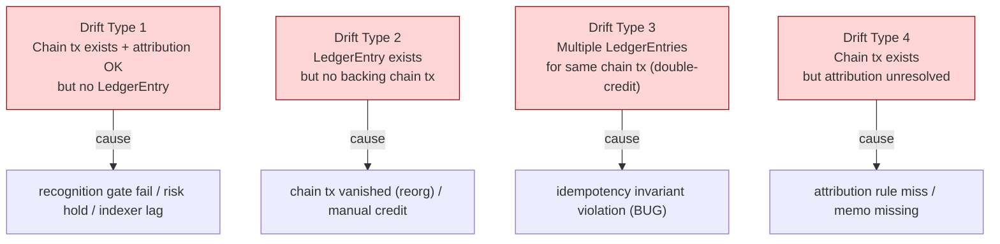

### 9.3 Periodic deposit reconciliation

- 매 N 시간 (또는 daily) chain block 의 모든 incoming tx 와 LedgerEntry match 검증.
- Unmatched chain tx → exception queue.
- Unmatched LedgerEntry (manual entry 등) → governance review.

### 9.4 External deposit reconciliation

(D1b §11.4 의 deposit 측면)

| Source | Trust |
|---|---|
| Centralized Exchange (CEX) withdrawal → our deposit | Exchange evidence + our chain observation 둘 다 필요 |
| Bridge mint → our deposit | Bridge attestation + destination chain |
| Sub-custodian → main custody | Sub-custodian audit |
| OTC desk settlement | Counterparty attestation + chain |

→ External evidence 와 chain evidence 의 cross-check — 가장 forensic 중요한 영역.

---

## 10. Exception Workflow

### 10.1 Deposit-specific exception 유형

```mermaid
graph TB
    EX1["Unmatched address<br/>(DP2 fail)"]
    EX2["Missing memo<br/>(shared address)"]
    EX3["Unknown asset<br/>(token registry miss)"]
    EX4["Sanctioned source<br/>(DP4 risk)"]
    EX5["Spam / dust<br/>(below threshold)"]
    EX6["Indexer gap<br/>(missing observation)"]
    EX7["Reorg reversal<br/>(deep)"]
    EX8["Attribution collision<br/>(memo conflict)"]
    EX9["Bridge fail<br/>(source lock but no dest mint)"]

    EX1 -->|action| A1["Manual attribution + customer contact"]
    EX2 -->|action| A2["Hold + customer notification (memo 요청)"]
    EX3 -->|action| A3["Token whitelist review"]
    EX4 -->|action| A4["Compliance escalation + freeze"]
    EX5 -->|action| A5["Quarantine policy / drop"]
    EX6 -->|action| A6["Re-index trigger + alternative indexer"]
    EX7 -->|action| A7["Compensating entry + customer notify"]
    EX8 -->|action| A8["First-match + audit + customer review"]
    EX9 -->|action| A9["Bridge investigation + counterparty"]

    classDef chain fill:#e0e8f5,stroke:#3050a0
    classDef compliance fill:#ffd6d6,stroke:#a00000
    classDef external fill:#fff4d6,stroke:#b08000
    class EX1,EX2,EX6,EX7 chain
    class EX4 compliance
    class EX8,EX9 external
```

### 10.2 Manual deposit credit

- 일부 exception 의 resolution = manual LedgerEntry 생성 (예: bridge fail 후 customer 가 source-side evidence 제공).
- 일반 LedgerEntry 와 같은 schema, 단:
  - actor = investigator + governance approval
  - reason field 의 structured capture
  - exception_id linkage
  - 별도 audit class (manual credit pattern monitoring)
- Manual credit abuse 는 fraud vector — frequency SLO.

### 10.3 Customer-side investigation dependency

(★ deposit-specific)

- 일부 exception 은 customer 의 cooperation 필요:
  - Memo 누락 → customer 에게 deposit 의 출처 / 의도 문의
  - Attribution collision → 어느 customer 의 deposit 인지 확인
  - Source documentation → AML compliance
- 이는 system-side 가 자동 resolve 불가능 — **customer-side human evidence**.

---

## 11. Temporal Semantics (6-clock)

(D5 §5 + D8 §11 의 deposit version)

### 11.1 6 clock for deposit

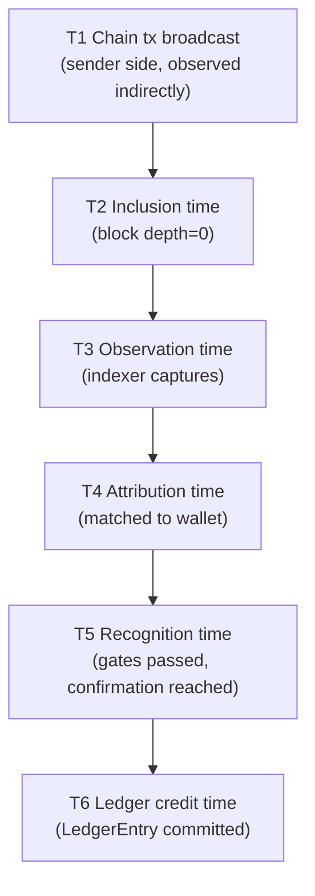

### 11.2 T1 의 의미 (sender side, indirectly observed)

- Custody 는 T1 (sender 의 broadcast 시각) 을 직접 알 수 없음.
- Chain 에서 추론 가능 (mempool timestamp 또는 first observation 시각).
- T1 은 "정확한 값 모름, 추정만 가능" — uncertain temporal data.

### 11.3 Latency 분포

| Segment | 일반 latency |
|---|---|
| T1 → T2 | seconds-minutes (chain block time) |
| T2 → T3 | seconds (indexer lag) |
| T3 → T4 | milliseconds (DB lookup) |
| T4 → T5 | minutes (confirmation depth) |
| T5 → T6 | seconds (ledger commit) |

### 11.4 "Missing deposit ≠ Missing funds" (temporal reasoning)

(§0 명제)

- T3 시점에 observation 없음 = indexer 누락 또는 chain 에 아직 없음.
- T2 시점에 chain 에 있지만 T3 안 됐을 수 있음 (indexer lag).
- "Funds 가 잘못 됐다" 결론은 chain 직접 확인 후 — system observation 만으로 결론 X.
- → Customer 의 "내 deposit 안 보임" 문의 시 chain explorer 직접 확인 절차 필요.

---

## 12. Deposit Evidence Chain

### 12.1 Full evidence chain

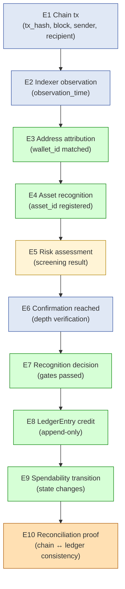

### 12.2 10-question framework

| Question | Source |
|---|---|
| Which chain tx? | E1 tx_hash |
| When observed? | E2 observation_time |
| Which wallet matched? | E3 wallet_id |
| Which asset? | E4 asset_id |
| Risk assessment outcome? | E5 result |
| Confirmation depth at credit? | E6 depth |
| Recognition policy gates? | E7 gates_passed |
| Ledger entry hash? | E8 entry_id |
| Spendability state transitions? | E9 sequence |
| Cross-domain consistency? | E10 proof_id |

### 12.3 Evidence chain integrity

- Hash linkage between phases (D5 §10.1 의 적용).
- 모든 phase event 의 envelope_signature.
- Tampering detection: 임의 phase 의 evidence 변조 시 다음 phase 의 hash 불일치.

---

## 13. Limitations

### 13.1 Indexed event ≠ Complete truth

§2.2. Indexer 가 본 것은 chain truth 의 subset — bug / partial ingestion / 비표준 event encoding 으로 gap 가능.

### 13.2 Confirmation ≠ Economic finality

§4.2. Chain-specific. Shallow reorg 가 confirmed deposit 도 revert 가능.

### 13.3 Address ownership ≠ Economic ownership

§3.5. Chain-side ownership 과 internal attribution 의 분리.

### 13.4 Recognition ≠ Spendability

§5.5. Ledger credit 후에도 hold / cooldown 정책 가능.

### 13.5 Reconciliation success ≠ No hidden inconsistency

(D1b §11.2 의 deposit 적용)

- 2-domain reconciliation 도 limitation 동일.
- External (bridge / CEX / OTC) 의 evidence gap.

### 13.6 Customer-side dependency limitation

- 일부 attribution / verification 은 customer cooperation 필요 — system 자체로 resolve 불가.

---

## 14. Operational Fragility Map

```mermaid
graph TB
    F1["F1. Chain reorg<br/>(deposit reversal)"]
    F2["F2. Delayed indexing<br/>(observation lag)"]
    F3["F3. Duplicate observation<br/>(idempotency 필요)"]
    F4["F4. Attribution ambiguity<br/>(memo / sender / contract)"]
    F5["F5. Partial ingestion<br/>(indexer bug / outage)"]
    F6["F6. Confirmation race<br/>(threshold edge)"]
    F7["F7. External transfer uncertainty<br/>(bridge / CEX evidence)"]
    F8["F8. Deposit spam<br/>(dust / unwanted token)"]
    F9["F9. Replay ambiguity<br/>(re-indexing after reorg)"]
    F10["F10. Human investigation dependency<br/>(customer-side cooperation)"]

    F1 -->|mitigation| M1["Compensating entry + chain-specific reorg policy"]
    F2 -->|mitigation| M2["Multi-indexer + lag SLO + alert"]
    F3 -->|mitigation| M3["DB unique constraint (tx_hash, log_index, recipient)"]
    F4 -->|mitigation| M4["Multi-key attribution + memo enforcement + manual review"]
    F5 -->|mitigation| M5["Redundant indexers + checkpoint + replay"]
    F6 -->|mitigation| M6["Depth-buffered threshold + per-asset config"]
    F7 -->|mitigation| M7["External attestation + cross-evidence verification"]
    F8 -->|mitigation| M8["Spam filter (dust threshold + blacklist) + quarantine"]
    F9 -->|mitigation| M9["Idempotent insert + lineage check"]
    F10 -->|mitigation| M10["Customer contact workflow + KYC integration (★ irreducible)"]
```

### 14.1 Fragility 분류

| 분류 | items | 성격 |
|---|---|---|
| **Chain side** | F1, F2, F6 | chain-specific, mitigatable |
| **Pipeline** | F3, F5, F9 | engineering discipline |
| **Attribution** | F4, F8 | deposit-specific complexity |
| **External / Human** | F7, F10 | **irreducible** |

---

## 15. SaaS vs Self-hosted vs Direct-build Deposit Burden

### 15.1 Plane × Ownership 매트릭스

| Phase | Fireblocks SaaS | 설치형 WaaS / Hosted MPC | 직접 구축 |
|---|---|---|---|
| DP1 Indexing | Vendor | Vendor | Customer (multi-RPC + own node) |
| DP2 Attribution (HD-derived) | Vendor | Vendor | Customer |
| DP2 Attribution (memo/event/sender) | Vendor + customer rule | Customer rule | Customer |
| DP3 Detection | Vendor | Vendor | Customer |
| DP4 Risk screening | Vendor partial + customer integration | Customer | Customer (own risk engine) |
| DP5 Confirmation tracking | Vendor | Vendor | Customer |
| DP6 Recognition policy | Vendor + customer config | Customer | Customer |
| DP7 Ledger credit | Vendor | Vendor (or customer) | Customer |
| DP8 Spendability + hold | Vendor + customer policy | Customer | Customer |
| DP9 Reconciliation | Customer | Customer | Customer |
| Spam / dust handling | Vendor partial | Customer | Customer |
| Token registry | Vendor (with customer requests) | Customer | Customer |
| Bridge / CEX integration | Vendor partial | Customer | Customer |

→ Deposit 는 withdrawal 보다 SaaS 의 흡수 비중 ↑ (indexing + attribution + confirmation 의 burden 이 큼). 단, reconciliation + risk + spam + external evidence 는 customer 책임.

### 15.2 Customer burden 비교 (★ Hypothesis)

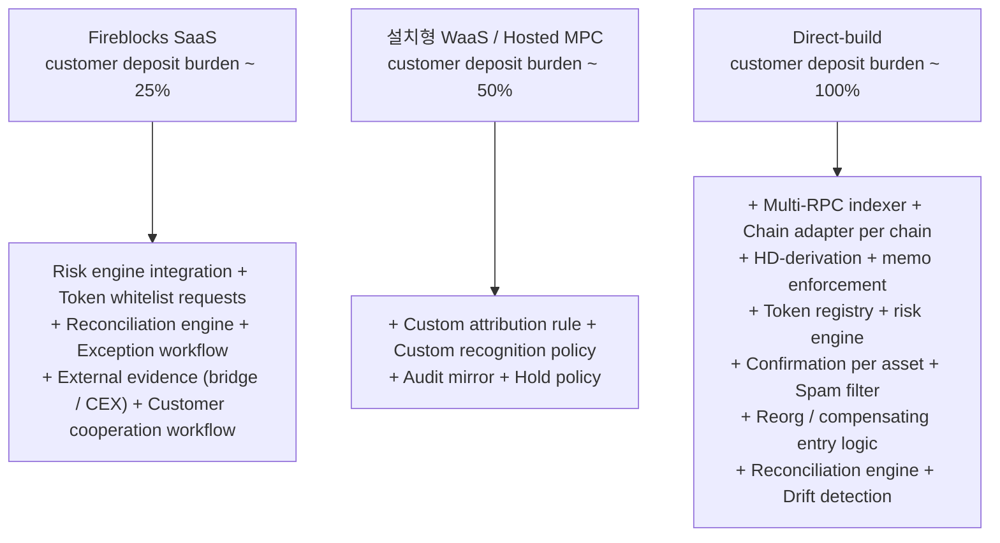

### 15.3 Deposit lock-in pivot

가장 큰 customer burden (direct-build 시):
1. **Multi-chain indexer + adapter pattern** — 각 chain 의 event encoding, attribution method, finality.
2. **Token registry + spam filter** — token universe 의 무한 — whitelist 정책 + spam blacklist 유지.
3. **Reorg + compensating entry** — chain-specific reversal handling.
4. **Risk engine integration** — sanctioned address / mixer / KYC integration.

이 4 가 burden 의 ~80% (★ Hypothesis).

### 15.4 Recommendation (운영 관점)

| Context | 권장 |
|---|---|
| Single-chain, simple asset (예: BTC only) | SaaS — vendor 의 indexing + attribution 흡수 |
| Multi-chain, multi-asset, regulated | SaaS or Hosted MPC + customer risk integration |
| High-volume + custom token (DeFi protocol) | Hosted MPC or Direct-build (token universe complexity) |
| Crypto exchange | Direct-build + own chain support + 24/7 ops |
| Bridge / cross-chain protocol | Direct-build + special bridge reconciliation |

→ 추천 ≠ fact. Asset diversity / chain diversity / token registry 가 핵심 결정.

---

## 16. 핵심 Reasoning Question (Q1-Q10)

### Q1. Deposit 이 transaction detection 이 아닌 이유

§0.1. 9 phase + 2 truth domain + 5 recognition gate. "본 것" 과 "credit 한 것" 의 분리. Bridge layer (custody policy plane) 가 chain observation 을 ledger truth 로 translate 하는 judgment.

### Q2. Observed tx ≠ Valid deposit

§2.2, §5. Indexer observation 후 5 recognition gate (attribution + asset + risk + confirmation + spam) 통과해야 deposit. 어느 gate 도 fail 가능 → exception.

### Q3. Address ownership ≠ Economic ownership

§3.5. Custody 가 보유 address 에 도착 = chain-side ownership. Internal attribution (어느 customer 의 것인가) 은 별도. Attribution 실패 시 unallocated.

### Q4. Confirmation ≠ Economic finality (deposit 측면)

§4.2 (D1b §2.3 의 deposit 적용). Confirmation 은 chain-side fact; economic finality 는 reorg risk negligible. Shallow reorg 시 confirmed deposit 도 reversal 가능.

### Q5. Deposit recognition ≠ Spendable balance

§5.5. Recognition (ledger credit) 후에도:
- Pending → Available → Settled → Finalized 의 4-state transition
- Hold 정책 (time/confirmation/risk-based)
- High-risk deposit 의 extended hold

### Q6. Double-credit prevention 의 invariant

§8. Composite unique key (tx_hash, log_index, recipient_address) 의 DB unique constraint. Re-indexing / multi-RPC redundancy 시 자연스러운 dedup.

### Q7. Reorg reversal ≠ Simple rollback

§7.3. Compensating debit entry (append-only). Original credit entry 는 retain. History 는 "credited and then reverted" 의 evidence. Customer notification + audit trail 완전성.

### Q8. Attribution complexity 의 본질

§3. 4 attribution model (HD-derived / shared+memo / smart contract / sender-based). Multi-key attribution 가능. Attribution ambiguity = deposit-specific exception 의 주요 source.

### Q9. Spam / dust 의 정책 영역

§5.3. Dust (threshold 미만) / spam token (blacklist) / mixer source / sanctioned. 정책별: accept / quarantine / reject / freeze. Risk engine + compliance escalation.

### Q10. Customer-side cooperation 의 irreducibility

§10.3, §14 F10. Memo 누락 / attribution collision / source-of-funds 등은 customer cooperation 필요. System 자체로 resolve 불가능 — KYC + customer contact workflow 의 irreducible operational component.

---

## 17. Open Questions / Org Policy 영역

| 영역 | 질문 | 본 문서 범위 밖 이유 |
|---|---|---|
| Recognition timing (M-D1 to M-D4) | per asset class? | accounting policy + UX |
| Confirmation threshold per asset | BTC 6 / 3? ETH 12 / 32? | risk appetite + value |
| Per-amount confirmation buffer | additional N depth for amount > X? | risk |
| Attribution model | HD-derived / memo / both? | privacy vs simplicity |
| Memo enforcement | strict / lenient? | customer UX vs operational risk |
| Asset whitelist policy | strict / permissive? | spam vs UX |
| Token registry curation | who + how often? | operations |
| Dust threshold | per asset? | spam tolerance |
| Spam token blacklist | who maintains? | operations |
| Risk screening provider | which? own? hybrid? | compliance |
| Sanctioned address list | OFAC / regional / both? | regulatory |
| Mixer detection threshold | risk score? | risk |
| Deposit hold policy | time / depth / risk-based? | UX vs fraud |
| Large deposit governance | threshold? quorum? | governance + AML |
| Reorg shallow auto / deep manual threshold | depth N? | chain risk |
| Customer notification policy (reorg) | immediate / delayed? | UX vs reality |
| Manual credit authority | who can? approval? | governance |
| External integration (bridge / CEX) | which supported? | partnership |
| Reconciliation cadence | hourly / daily? | forensic + cost |
| Source-of-funds documentation | when required? | AML |
| Audit retention (deposit) | 7y / forever? | regulatory |
| Customer-side investigation SLA | 24h / 7d? | UX |

---

## 18. 관련 wiki / entity reference + Uncertainty Boundary

### 관련 wiki

| 참조 | 어디서 사용 |
|---|---|
| [[entities/fireblocks/transaction]] | §1, §12 (chain tx + LedgerEntry FK) |
| [[entities/fireblocks/vault-account]] | §1, §3 (wallet attribution) |
| [[entities/fireblocks/blockchains]] | §4.3 (chain-specific confirmation) |
| [[entities/fireblocks/policy]] | §5 (recognition policy + large deposit governance) |
| [[vendors/fireblocks/architecture]] | §15 (vendor reference) |
| [[vendors/fireblocks/risks]] | §13 (limitation reasoning) |
| [[docs/architecture/vault-wallet-ledger-db-schema]] | §1 (L3 Ledger, L9 chain cache, L2 attribution) |
| [[docs/architecture/audit-event-sourcing-evidence-chain]] | §11, §12 (temporal + evidence chain) |
| [[docs/architecture/reconciliation-settlement-consistency]] | §4, §9 (settlement progression + reconciliation, §5 deposit lifecycle reference) |
| [[docs/architecture/withdrawal-lifecycle]] | §1.2 (deposit vs withdrawal asymmetry) |

### Uncertainty Boundary (★ 절대 유지)

- 본 문서의 **9 phase decomposition / 4 attribution model / 4 recognition timing model (M-D1 to M-D4) / 4 deposit balance state / compensating entry pattern / 80% burden 분포** 는 모두 **generalized custody deposit architecture pattern** (Hypothesis ★).
- Fireblocks 의 deposit 구현은 reference model — vendor-specific 구현 detail 은 다를 수 있음.
- §4.4 timing model trade-off matrix 는 operational reasoning estimate.
- §15.2 burden 백분율 (~25% / ~50% / ~100%) 는 operational reasoning estimate.
- §15.4 추천 architecture 는 운영 권장 — fact 아님.
- §13 limitation 은 D1b + D5 의 직접 적용.
- §17 에 명시된 영역은 본 문서가 결정하지 않음.

### 다음 단계 (D7 이후)

본 문서는 D7 — **Deposit Lifecycle Detailed**. 이후:

- **D6 — 3-way Custody Decision Framework**: 전체 architecture reasoning 의 의사결정 framework. SaaS vs Hosted MPC vs Direct-build 의 sovereignty / governance / recovery / evidence / reconciliation / operational survivability ownership 결정.
- (Optional D9) — Multi-chain adapter pattern detail.

### Architecture reasoning layer 누적 결과 (D1a + D2 + D3 + D4 + D5 + D1b + D8 + D7)

| 문서 | 핵심 명제 |
|---|---|
| D1a | 9-plane DB / secrets DB 저장 금지 |
| D2 | 4 state machine 분리 / MPC retry non-idempotent |
| D3 | 11-state governance SM / two-clock freshness |
| D4 | Recovery = governance ceremony under cryptographic risk |
| D5 | Custody = evidence system / Unified Evidence Spine |
| D1b | Reconciliation = cross-truth-domain consistency proof |
| D8 | Withdrawal = multi-domain state transition from user intent to economic finality |
| **D7** | **Deposit = controlled ledger recognition of external settlement (2-domain, attribution-heavy)** |

→ 8 문서 = 5 trust domain + 1 evidence backbone + cross-domain reconciliation + outbound + inbound lifecycle 의 완성된 generalized custody architecture reasoning skeleton.

---

**Stage 32 D7 completion timestamp**: 2026-05-19.
