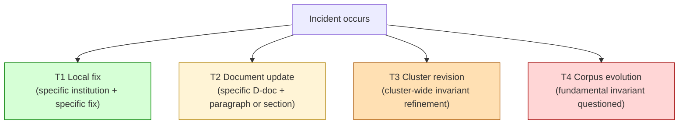
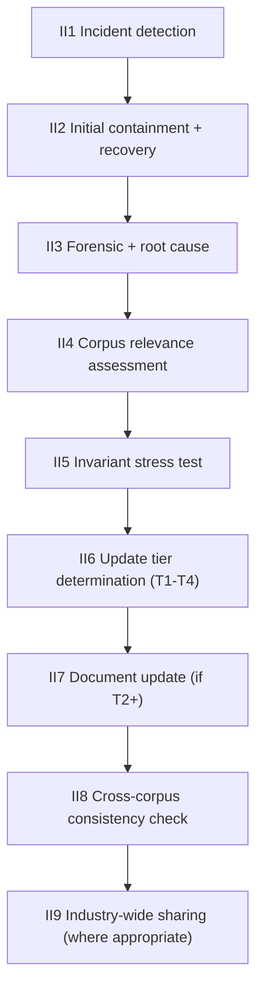
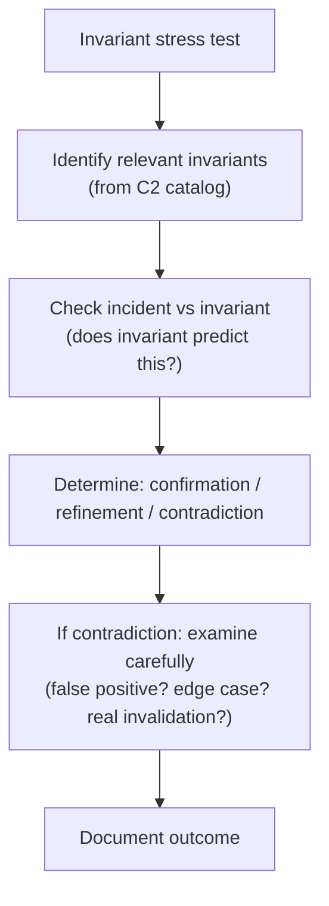
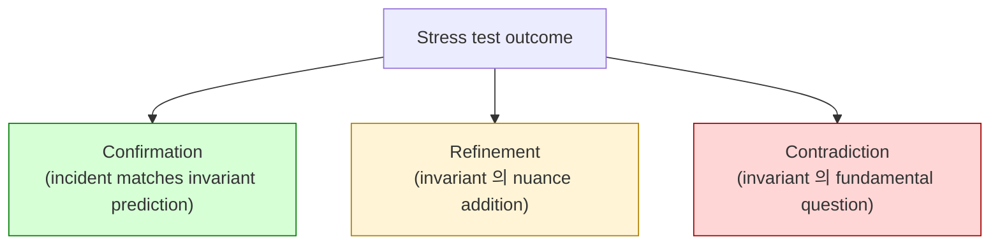
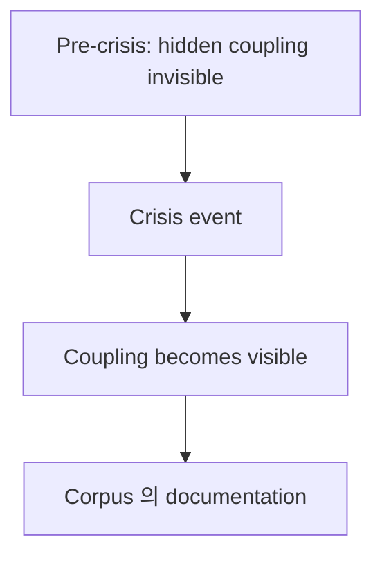
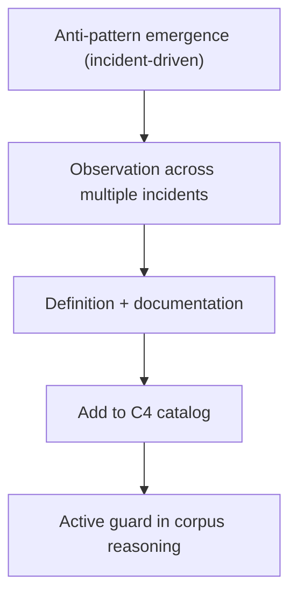
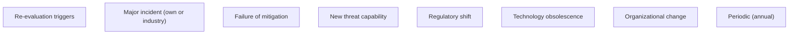
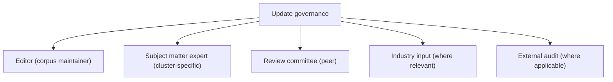
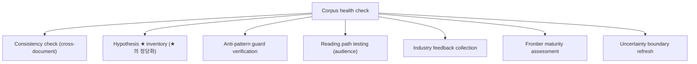

# E1 — Incident-driven Corpus Evolution

> **본 문서의 위치 (Evolution E1)**: 39-document corpus 의 **incident-driven update discipline**. Failure exposure 가 corpus evolution 의 primary driver. Steady-state optimization 가 아닌 stress-tested refinement.

> **본 문서가 답하는 핵심 질문**: 어떤 incident 가 corpus update 의 trigger? 어떤 incident 가 invariant 의 invalidation? 어떤 failure 가 새 anti-pattern 의 source? Post-incident reasoning 의 institutional discipline?

---

## 0. 핵심 명제 (10초 이해)

1. **Architecture theories evolve through failure exposure** (core thesis).
2. **5 "≠" 명제**:
   - Incident ≠ Invariant invalidation
   - Failure ≠ Theory collapse
   - New exploit ≠ Architectural obsolescence
   - Patch ≠ Survivability improvement
   - Operational surprise ≠ Theoretical failure
3. **Incident = corpus stress test** — corpus 의 robustness test event.
4. **4-tier incident integration** — Local fix / Document update / Cluster revision / Invariant evolution.
5. **Most incidents = confirm corpus** — invariant 의 robustness 입증.
6. **Some incidents = refine corpus** — new edge case, nuance addition.
7. **Rare incidents = restructure corpus** — fundamental invariant questioned.
8. **Failure taxonomy 의 extension** — D26 의 ongoing update.
9. **Hidden coupling discovery** — D26 §3 의 ongoing reveal.
10. **Anti-fossilization discipline** — corpus 의 ongoing learning.

---

## 1. Incident Severity 의 Corpus Impact

### 1.1 4-tier corpus impact

### 1.2 Tier 별 frequency

| Tier | Frequency (★ Hypothesis) | Example |
|---|---|---|
| T1 Local | Daily (institution-specific) | Stuck tx, vendor outage |
| T2 Document | Monthly (industry-wide) | New compliance regulation |
| T3 Cluster | Yearly (significant pattern) | Major chain halt, depeg event |
| T4 Corpus | Decade+ (paradigm shift) | Quantum computing breakthrough |

### 1.3 Most incidents = T1-T2

- 대부분 incident 가 local 또는 document-level update.
- Corpus 의 robustness 의 사인.
- → Steady-state corpus 가 majority.

### 1.4 "Incident ≠ Invariant invalidation"

(§0 명제)

- Incident: specific event 의 발생.
- Invariant invalidation: theoretical principle 의 failure.
- 차이:
  - Most incident = invariant 의 manifestation (corpus 의 prediction 의 확인)
  - 일부 incident = edge case (refinement 필요)
  - 매우 드문 incident = invariant 의 reconsideration
- → Default reaction = corpus 의 reinforcement, not collapse.

### 1.5 "Failure ≠ Theory collapse"

(§0 명제)

- Specific failure 가 theory 의 entire collapse 의미 아님.
- Failure 는 theory 의 robustness test.
- Robustness 통과 시 corpus 의 confirmation.

---

## 2. Incident Integration Lifecycle

### 2.1 9-phase integration

### 2.2 Each phase 의 discipline

| Phase | Discipline |
|---|---|
| II1-II2 | Operational (D12 ICS) |
| II3 | Forensic (D5 evidence) |
| II4 | Corpus mapping |
| II5 | Invariant verification |
| II6 | Conservative tier choice |
| II7 | Documented update with rationale |
| II8 | Cross-cluster impact |
| II9 | Community benefit |

### 2.3 Invariant stress test process

### 2.4 Conservative tier choice principle

(★ discipline)

- Default tier = lowest 가능 (T1 if possible).
- T2+ requires multi-incident pattern.
- T3+ requires significant systemic event.
- T4 requires decade-scale paradigm shift.
- → Anti-overclaim discipline.

### 2.5 Update rationale documentation

- Each update 의 explicit rationale.
- "Why this change?" + "Why now?"
- Reversibility consideration.
- → Append-only conceptual history (D5 의 application to corpus).

---

## 3. Confirmation vs Refinement vs Contradiction

### 3.1 3-outcome of invariant stress test

### 3.2 Confirmation 의 example

- Stablecoin depeg 시 D21 의 reflexive dynamics, redemption cascade pattern 의 confirmation.
- Chain halt 시 D22 의 settlement truth fragmentation pattern.
- Insider compromise 시 D14 의 insider threat irreducibility.
- → Corpus 의 robustness 입증.

### 3.3 Refinement 의 example

- 새 chain 의 specific halt mechanism → D22 의 chain-specific category 추가.
- 새 attack vector 의 식별 → D14 의 threat catalog 추가.
- 새 regulatory action 의 pattern → D11 의 mechanism 추가.
- → Corpus 의 detail enrichment.

### 3.4 Contradiction 의 example

(★ rare, but possible)

- 새 cryptographic primitive 의 emergence 가 D14 의 mitigation taxonomy 의 fundamental restructure 요구.
- 새 governance model 이 D3 의 11-state SM 의 limit 의문.
- → Careful examination + 보통 deeper investigation 의 result 가 confirmation or refinement.

### 3.5 "New exploit ≠ Architectural obsolescence"

(§0 명제)

- New exploit: specific technical vulnerability.
- Architectural obsolescence: corpus 의 framework 의 superseded.
- 차이:
  - Exploit 의 patch 가 architectural change 아님.
  - 그러나 specific 의 systemic exploit (e.g. quantum break) = architectural.
- → Distinguish per case.

---

## 4. Hidden Coupling Discovery

### 4.1 Crisis 시 emerging hidden coupling

(D26 §3 의 ongoing)

### 4.2 Discovery 의 trigger

- Single incident 가 multiple institution affect → shared coupling.
- Single technology failure 가 cascade → infrastructure coupling.
- Single regulatory action 의 broad reach → jurisdictional coupling.
- → 각 incident 의 ripple analysis.

### 4.3 Coupling 의 documentation

- Discovered coupling 의 D26 §3.5 의 hidden coupling list 추가.
- 영향받는 cluster 의 update.
- Mitigation suggestion 의 update.

### 4.4 Historical coupling examples

(★ Hypothesis — based on industry history)

- Lehman 2008: counterparty + correspondent banking + repo dependency 의 visibility.
- Mt. Gox 2014: exchange custody + commingled deposit 의 visibility.
- Tornado Cash sanctions 2022: compliance + privacy chain coupling 의 visibility.
- FTX 2022: prime brokerage + commingled treasury + governance coupling.
- → Each event 의 industry-wide learning.

### 4.5 Industry vs institution learning

- Industry-wide event = corpus-level lesson.
- Institution-specific event = local learning.
- Discipline: 양쪽 모두 의 awareness.

---

## 5. Anti-pattern Discovery + Catalog Update

### 5.1 New anti-pattern emergence

- Each incident 가 새 anti-pattern 의 source 가능.
- C4 catalog 의 ongoing update.
- → Living anti-pattern catalog.

### 5.2 Anti-pattern lifecycle

### 5.3 Anti-pattern 의 multi-incident requirement

- Single incident = potential anti-pattern signal.
- Multiple independent incidents = confirmed anti-pattern.
- → Anti-pattern 의 statistical-like confirmation.

### 5.4 Outdated anti-pattern 의 deprecation

- 일부 anti-pattern 의 obsolete:
  - Technology evolved (e.g. "always use SHA-1" was once correct)
  - Regulatory changed
  - Pattern context-dependent
- Deprecation 의 careful (D5 append-only — mark deprecated, not delete).

### 5.5 Anti-pattern reasoning 의 corpus discipline

- 매 update 의 anti-pattern check.
- 새 anti-pattern 의 emergence 의 active monitoring.
- → Defensive corpus posture.

---

## 6. Post-incident Survivability Re-evaluation

### 6.1 Re-evaluation triggers

### 6.2 Survivability metric update

- 10 survivability principles (C2 §4) 의 reassessment.
- Specific metric (D6, D26) 의 recalibration.
- → Continuous discipline.

### 6.3 "Patch ≠ Survivability improvement"

(§0 명제)

- Patch: specific fix.
- Survivability improvement: broader resilience.
- 차이:
  - Patch 가 same vector 만 mitigate
  - Survivability 는 broader threat model
- → Patch 후에도 survivability gap 가능.

### 6.4 Stress test refresh

- 정기 stress test (D12 §5).
- 새 scenario 의 incorporation.
- 결과의 corpus update.

### 6.5 Industry stress test coordination

(★ Hypothesis — emerging practice)

- Cross-institution stress test:
  - Regulator-coordinated (e.g. central bank)
  - Industry consortium
  - Bilateral peer exercise
- → Shared learning.

---

## 7. Theory Update Governance

### 7.1 Update authority

### 7.2 Update governance discipline

- Single-author update = lowest authority.
- Peer-reviewed = higher.
- Industry-input = highest (where relevant).
- → Authority gradient.

### 7.3 Versioning discipline

- Corpus 의 own version (e.g. v1.0, v1.1, v2.0).
- Major version change = T4 (rare).
- Minor version = T2-T3.
- Patch version = T2 (textual).
- → Semantic versioning analog.

### 7.4 Change log

- Each update 의 changelog entry.
- Rationale, affected docs, invariant impact.
- → Audit trail.

### 7.5 Backward compatibility

- Old version 의 reasoning 유지.
- Specific 의 update mark.
- Deprecation 의 explicit.
- → Reader 의 trust.

---

## 8. Corpus Stress Test (meta-evaluation)

### 8.1 Periodic corpus health check

### 8.2 Corpus stress event

(★ Hypothesis — corpus 의 own incident)

- Industry-wide failure 가 corpus framework 의 invalidation 시 corpus crisis.
- 가능한 source:
  - 새 technology paradigm
  - 새 regulatory regime
  - 새 institutional form
- → Corpus 의 own survivability test.

### 8.3 Corpus 의 antifragility

- Each stress event 가 corpus 의 strengthening.
- Incident-driven evolution 가 ongoing improvement.
- → Antifragility property.

### 8.4 Corpus 의 obsolescence 의 honest acknowledgment

- 일부 cluster 의 future obsolescence 가능.
- E.g. PQ-mature 후 D32 의 historical reference 가 됨.
- → Cluster lifecycle 의 acknowledgment.

### 8.5 Corpus 의 long-term life cycle

- Creation (initial corpus, 2026)
- Maturation (production-grade reasoning)
- Evolution (incident-driven)
- Refinement (consolidation)
- Eventual obsolescence (decade-scale)
- → Honest lifecycle.

---

## 9. Q1-Q10 Reasoning

### Q1. Why incident-driven

§0.1. Failure exposure 의 evolution driver.

### Q2. 4-tier impact

§1.1. Local / Document / Cluster / Corpus.

### Q3. Conservative tier choice

§2.4.

### Q4. Most incidents = confirmation

§3.2. Corpus robustness.

### Q5. Hidden coupling discovery

§4.

### Q6. Anti-pattern lifecycle

§5.2.

### Q7. Survivability re-evaluation

§6.

### Q8. Update governance

§7.

### Q9. Corpus 의 own stress test

§8.

### Q10. Corpus lifecycle

§8.5.

---

## 10. Open Questions

| 영역 | 질문 |
|---|---|
| Incident reporting standardization | industry? |
| Cross-corpus learning | inter-corpus collaboration? |
| Update governance composition | who decides? |
| Versioning discipline | semantic? date-based? |
| Backward compatibility scope | how long? |
| Corpus stress test | who triggers? |
| Anti-pattern deprecation criteria | when obsolete? |
| Industry consortium | corpus-level coordination? |
| Public vs private corpus | open source? |
| Multi-author corpus | governance? |

---

## 11. References + Uncertainty Boundary + Bridge

### 관련 wiki

- All 39 documents (D + C series)
- D26 (Custody Failure Generalization)
- D12 (Operational Maturity)
- C4 (Anti-pattern Catalog)
- C6 (Open Questions)

### Uncertainty Boundary

- 본 문서는 **evolution discipline** — corpus 의 ongoing maintenance.
- §1.2 frequency = ★ Hypothesis estimate.
- §8.2 corpus stress = future possibility.
- §8.5 lifecycle = honest acknowledgment.

### E2 Bridge Invariants (E1 → E2)

1. **Incident → Regulatory mutation** — incident 의 regulatory response 가 E2 의 input.
2. **Failure response 의 jurisdictional dimension** — E1 의 incident 가 E2 의 regulatory action 의 trigger.
3. **Industry coordination 의 governance** — E1 의 cross-institution learning 이 E2 의 sovereign coordination.
4. **Survivability across regulatory shift** — E1 의 survivability + E2 의 regulatory shift = institutional continuity.
5. **Theory mutation 의 sovereign dimension** — E1 의 corpus update 이 E2 의 regulatory acknowledgment 와 결합.

### E-series progression

- E1 (this): incident-driven
- E2 (next): regulatory / sovereign
- E3: AI / automation
- E4: frontier integration
- E5 (closing): knowledge survivability

---

**Stage 32 E1 completion timestamp**: 2026-05-20.
