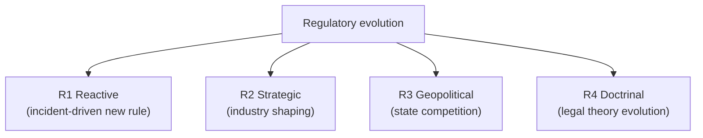
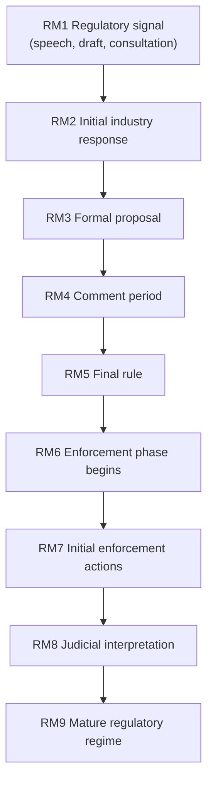
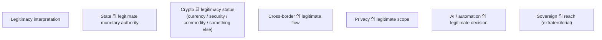
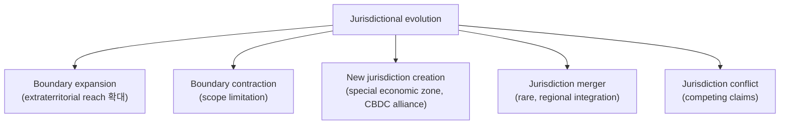
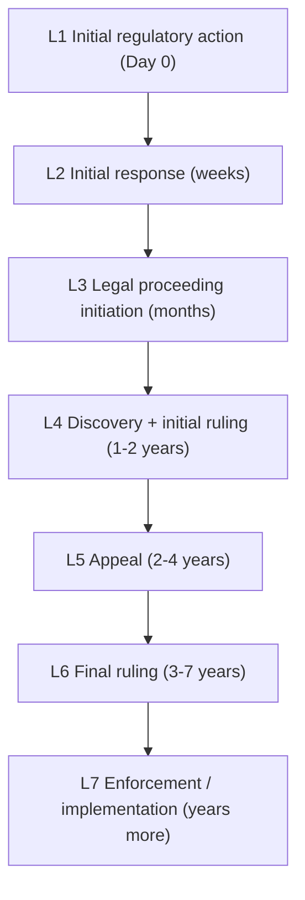
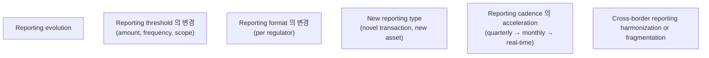
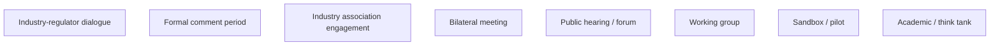
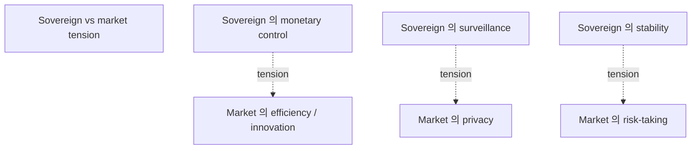
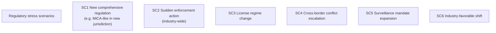

# E2 — Regulatory / Sovereign Evolution

> **본 문서의 위치 (Evolution E2)**: E1 의 incident-driven 의 **regulatory / sovereign dimension**. Regulatory drift / sovereign reinterpretation / jurisdictional mutation 의 corpus 의 impact. D11 + D23 + D27 의 evolution perspective.

> **본 문서가 답하는 핵심 질문**: 어떤 regulatory shift 가 corpus update 의 trigger? 어떤 sovereign reinterpretation 이 invariant 의 affect? 어떻게 legal mutation 이 architectural reasoning 의 input?

---

## 0. 핵심 명제 (10초 이해)

1. **Architecture evolves via sovereign + regulatory reinterpretation of legitimacy** (core thesis).
2. **5 "≠" 명제**:
   - Regulation update ≠ Architectural replacement
   - Legal clarity ≠ Operational certainty
   - Sovereign coordination ≠ Governance convergence
   - Compliance adaptation ≠ Institutional survivability
   - Regulatory alignment ≠ Strategic safety
3. **Regulatory mutation = ongoing** — not single discrete event.
4. **4-source of regulatory evolution** — Reactive (incident-driven) / Strategic (industry shaping) / Geopolitical (state competition) / Doctrinal (legal theory evolution).
5. **Sovereign reinterpretation = legitimacy shift** — what is legal can become illegal (or vice versa).
6. **Jurisdiction 의 evolving boundary** — D23 의 ongoing pattern.
7. **Compliance evolution = corpus pressure** — D11 의 ongoing refinement.
8. **Legal recovery timescale** = years (D23 §6.2 의 인식).
9. **Industry-regulator dialogue** — corpus 의 input source.
10. **Sovereign vs market 의 tension** — D27 의 ongoing dynamic.

---

## 1. Regulatory Evolution Source

### 1.1 4 evolution source

### 1.2 각 source 의 corpus impact

| Source | Corpus impact |
|---|---|
| R1 Reactive | D11 (compliance) + cluster-specific |
| R2 Strategic | D23 (jurisdictional) + market context |
| R3 Geopolitical | D27 (sovereign) + D23 |
| R4 Doctrinal | Cross-cluster (interpretation shift) |

### 1.3 R1 Reactive example

- Major incident (예: stablecoin depeg) → new stablecoin regulation.
- Cyber incident → new security requirement.
- AML failure → enhanced KYT requirement.
- → Corpus 의 D11 / D14 / D10 update.

### 1.4 R2 Strategic example

- Industry advocacy for clarity.
- Regulator's strategic framework (e.g. EU MiCA).
- Investor protection initiative.
- → Corpus 의 D11 / D24 의 ongoing refinement.

### 1.5 R3 Geopolitical example

- Sanctions expansion / restriction.
- Trade war 의 financial dimension.
- CBDC 의 strategic deployment.
- → Corpus 의 D23 / D13 / D27 의 evolution.

### 1.6 R4 Doctrinal example

(★ Hypothesis — slowly evolving)

- Legal interpretation 의 evolution (e.g. crypto as security/commodity/currency).
- Property right of digital assets.
- Liability framework 의 court ruling.
- → Corpus 의 cross-cluster impact.

---

## 2. Regulatory Mutation Lifecycle

### 2.1 9-phase lifecycle

### 2.2 Phase 별 corpus reasoning

| Phase | Corpus action |
|---|---|
| RM1 Signal | Monitor, no update |
| RM2-RM4 Initial / Comment | Watch, prepare hypothesis |
| RM5 Final rule | Document update (T2-T3) |
| RM6-RM7 Enforcement | Adapt operational reasoning |
| RM8 Judicial | Refine based on case law |
| RM9 Mature | Stable corpus state |

### 2.3 "Regulation update ≠ Architectural replacement"

(§0 명제)

- New regulation: specific rule.
- Architectural replacement: framework 의 fundamental redesign.
- 차이:
  - 대부분 regulation 가 specific scope.
  - Corpus 의 framework 는 stable.
  - Update 는 textual, not structural.
- → Conservative corpus stance.

### 2.4 "Legal clarity ≠ Operational certainty"

(§0 명제)

- Legal clarity: specific rule defined.
- Operational certainty: predictable enforcement.
- 차이:
  - Clear rule 의 ambiguous enforcement.
  - Enforcement 의 jurisdiction-specific variation.
  - Court interpretation 의 future shift.
- → Operational discipline 의 conservative.

### 2.5 Regulatory regime maturity

- Initial: ambiguous, low predictability.
- Maturing: case law accumulation.
- Mature: stable enforcement pattern.
- → Custody 의 each regime 의 maturity awareness.

---

## 3. Sovereign Reinterpretation

### 3.1 Legitimacy 의 shift

### 3.2 Legitimacy 의 ongoing shift

- 시간에 따라 legitimacy 의 definition 의 change.
- 새 technology 의 legitimacy 의 establishment time.
- → Corpus 의 each domain 의 legitimacy 의 evolving.

### 3.3 Sovereign reinterpretation 의 example

(★ Hypothesis — historical pattern)

- Crypto: 2008 의 emergence → 2026 의 various regulatory regimes.
- DeFi: emergent → some jurisdictions 의 prohibition / approval.
- Stablecoin: market-driven → emerging sovereign acknowledgment.
- Privacy chain: privacy-first → sanctioned in some.
- → Each crypto domain 의 sovereign journey.

### 3.4 "Sovereign coordination ≠ Governance convergence"

(§0 명제)

- Sovereign coordination: state 간 의 dialog + agreement.
- Governance convergence: shared rules + enforcement.
- 차이:
  - Coordination 는 still per-sovereign authority
  - Convergence 는 rare (e.g. EU monetary union)
- → Multi-sovereign system 의 reality.

### 3.5 Legitimacy 의 multi-source

- 동일 activity 가 different sovereign 의 different legitimacy 가능.
- Cross-jurisdictional 의 legitimacy fragmentation.
- → D23 의 ongoing reasoning.

---

## 4. Jurisdiction 의 Evolving Boundary

### 4.1 Jurisdictional evolution patterns

### 4.2 Extraterritorial reach 의 expansion

- OFAC 의 example (D11 §3, D23).
- EU MiCA 의 cross-border effect.
- GDPR 의 international application.
- → 일부 sovereign 의 expanding influence.

### 4.3 New jurisdiction 의 emergence

- Crypto-friendly jurisdiction (e.g. specific small states).
- CBDC alliance (potential).
- Digital free zones.
- → Architecture 의 new option.

### 4.4 Jurisdiction conflict 의 normalization

- D23 의 conflict 가 ongoing reality.
- Resolution mechanism 의 development.
- → Architecture 의 conflict-aware design.

### 4.5 Sovereign 의 own evolution

- 일부 state 의 internal regulatory evolution.
- Crypto-positive → crypto-restrictive (or vice versa).
- → Custody architecture 의 jurisdiction 의 dynamic risk.

---

## 5. Legal Recovery Timescale

### 5.1 Multi-year legal proceeding

(D23 §6.2 의 ongoing)

### 5.2 Operational continuation during legal

(D23 §6.3 의 reasoning)

- Operational restoration ≠ Legal resolution.
- Customer service continuation 의 strategic decision.
- → Multi-year operational discipline.

### 5.3 "Legal recovery ≠ Operational recovery"

(§0 명제 / D23 §6.2 의 재확인)

- Multi-year legal proceeding 동안 operational 의 own timeline.
- Operational 의 hours-weeks vs legal 의 years.
- → Decoupled timelines.

### 5.4 Capital reserves for legal

- Multi-year legal cost 의 reserve.
- Insurance (D&O, professional liability).
- Cash flow management.
- → Long-horizon financial preparation.

### 5.5 Long-term reputational impact

- Even after legal resolution, reputational shadow.
- D21 §4.5 의 trust hysteresis.
- → Architecture 의 long-term reputation 의 awareness.

---

## 6. Reporting Requirement Evolution

### 6.1 Reporting 의 ongoing change

(D24 의 ongoing)

### 6.2 Reporting infrastructure 의 adaptation

- 각 reporting change 의 infrastructure update.
- Multi-regulator 의 reporting matrix.
- Automation + verification.
- → Reporting 의 ongoing engineering.

### 6.3 "Compliance adaptation ≠ Institutional survivability"

(§0 명제)

- Compliance adaptation: requirement 의 follow.
- Institutional survivability: ongoing operation.
- 차이:
  - 일부 compliance change 가 cost prohibitive (small institution 의 exit)
  - 또는 strategic shift (large institution 의 advantage)
- → Compliance 의 strategic dimension.

### 6.4 Industry consolidation under regulation

(★ Hypothesis — financial industry pattern)

- Heavy regulation 의 small-medium institution 의 exit.
- Industry concentration 의 acceleration.
- Systemic risk concentration.
- → Regulator-aware policy 의 architecture.

### 6.5 Reporting 의 future automation

- AI-assisted reporting (D30 의 application).
- Privacy-preserving reporting (D31 §5 의 application).
- Real-time supervisory technology (SupTech).
- → Reporting infrastructure 의 evolution.

---

## 7. Industry-Regulator Dialogue

### 7.1 Dialogue 의 channel

### 7.2 Corpus 의 contribution

- Corpus reasoning 의 industry input 의 source 가능.
- Architecture 의 trade-off framework 가 regulatory understanding 의 input.
- → Two-way value.

### 7.3 Sandbox / pilot 의 architecture insight

- Sandbox 의 controlled experiment.
- Architecture 의 stress-test 의 controlled environment.
- → Real-world validation.

### 7.4 Academic engagement

- Academic research 의 corpus input.
- Theoretical framework 의 development.
- → Cross-disciplinary value.

### 7.5 "Regulatory alignment ≠ Strategic safety"

(§0 명제)

- Alignment: regulatory expectation 의 meet.
- Strategic safety: long-term institutional position.
- 차이:
  - Aligned 의 specific regulator + specific moment
  - Strategic 의 multi-regulator + multi-year
- → Alignment 는 necessary, not sufficient.

---

## 8. Sovereign vs Market Tension

### 8.1 Ongoing tension

(D27 의 ongoing)

### 8.2 Tension 의 architecture impact

- Each tension 의 corpus 의 affected docs:
  - S1 vs S2: D10 (stablecoin), D27 (CBDC)
  - S3 vs S4: D11, D31
  - S5 vs S6: D17 (treasury), D25 (liquidity)
- → Cross-cluster impact.

### 8.3 Resolution patterns

- Negotiated equilibrium (regulator + industry).
- Imposed (sovereign override).
- Bypass (innovation 의 jurisdictional shift).
- Stalemate (status quo).

### 8.4 CBDC 의 의의

- CBDC = sovereign 의 active market entry.
- Private stablecoin 과의 competition or coexistence.
- → D10, D27 의 ongoing dynamic.

### 8.5 Custody architecture 의 dual-role

- Custody 의 자체:
  - Market participant (commercial)
  - Regulatory subject (compliance)
  - Sometimes sovereign extension (CBDC distribution)
- → Tension의 navigation.

---

## 9. Corpus Stress Test (regulatory dimension)

### 9.1 Regulatory stress test scenarios

### 9.2 Corpus 의 resilience under scenario

- 각 scenario 의 corpus 의 framework 의 robustness:
  - Most scenarios = D11, D23, D24 update
  - 일부 scenarios = cluster-level
  - 매우 드문 = corpus-level question
- → Corpus 의 regulatory resilience.

### 9.3 Reasoning continuity under regulatory shift

- Underlying invariants (C2) 의 stability:
  - Evidence-first reasoning (regulatory shift 에도 stable)
  - Survivability > efficiency (universally relevant)
  - Trust boundary 의 importance (consistent)
- → Surface change vs deep stability.

### 9.4 Update vs restructure decision

- Most regulatory event = update (T2-T3 of E1 §1).
- Rare = restructure (T4).
- → E1 의 tier discipline 의 application.

### 9.5 Anti-corpus-erosion discipline

- Regulatory shift 의 corpus erosion risk:
  - "Just follow what regulator says"
  - "Architecture 가 regulator 의 mirror"
- 그러나 corpus 의 own discipline:
  - Survivability 의 retention
  - Cross-jurisdiction perspective
  - Long-term reasoning
- → Architecture 의 independence (within compliance).

---

## 10. Q1-Q10 Reasoning

### Q1. Regulation update ≠ Architectural replacement

§2.3.

### Q2. Legal clarity ≠ Operational certainty

§2.4.

### Q3. Sovereign coordination ≠ Convergence

§3.4.

### Q4. Compliance ≠ Survivability

§6.3.

### Q5. Regulatory alignment ≠ Strategic safety

§7.5.

### Q6. 4 evolution source

§1.

### Q7. Multi-year legal recovery

§5.

### Q8. Industry consolidation under regulation

§6.4.

### Q9. Sovereign vs market tension

§8.

### Q10. Reasoning continuity

§9.3.

---

## 11. Open Questions

| 영역 | 질문 |
|---|---|
| Industry consortium engagement | scope? |
| Multi-jurisdiction strategy | per institution |
| Regulatory sandbox participation | when? |
| Public commentary | strategy |
| Long-horizon legal reserve | amount? |
| CBDC integration | when / how? |
| Privacy regulation evolution | follow / lead? |
| Reporting automation | strategy |
| Industry advocacy | scope |
| Academic engagement | scope |

---

## 12. References + Uncertainty Boundary + Bridge

### 관련 wiki

- D11 (Compliance), D23 (Jurisdictional Crisis), D24 (Reporting), D27 (CBDC), D13 (Cross-border)
- E1 (Incident-driven evolution)

### Uncertainty Boundary

- 본 문서는 **regulatory evolution discipline** — ongoing dynamic.
- §3.3 historical examples = pattern observation.
- §5 timescale = jurisdiction-dependent.
- §8 tension = ongoing dynamic, no resolution prediction.

### E3 Bridge Invariants (E1 + E2 → E3)

1. **Regulatory pressure on AI** — E2 의 regulatory mutation 이 E3 의 AI governance requirement.
2. **Accountability framework evolution** — E2 의 legal interpretation 이 E3 의 AI accountability.
3. **Surveillance / privacy tension** — E2 의 §8.3 이 E3 의 AI-mediated surveillance.
4. **Automation 의 regulatory boundary** — E2 의 regulator stance 가 E3 의 automation limit.
5. **Cross-corpus pressure** — E1 incident + E2 regulatory + E3 AI = compound evolution.

### E-series progression

- E1: incident-driven
- E2 (this): regulatory / sovereign
- E3 (next): AI / automation pressure
- E4: frontier integration discipline
- E5 (closing): knowledge survivability

---

**Stage 32 E2 completion timestamp**: 2026-05-20.
