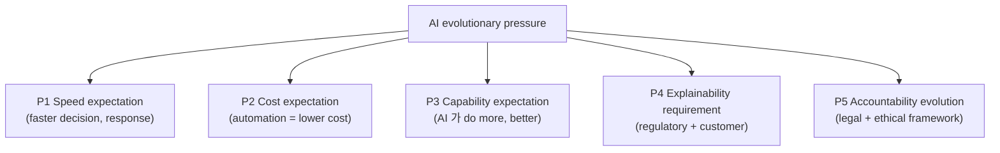
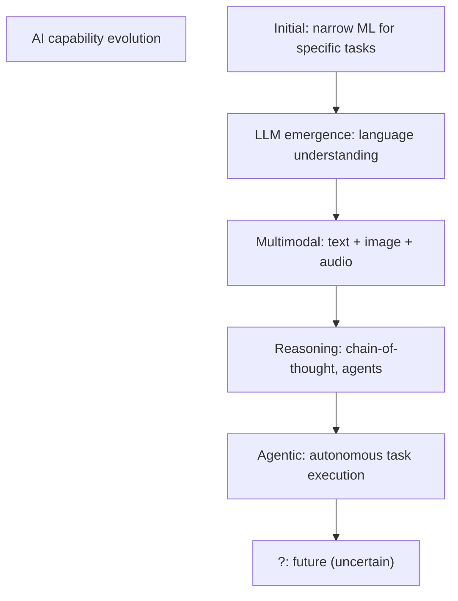
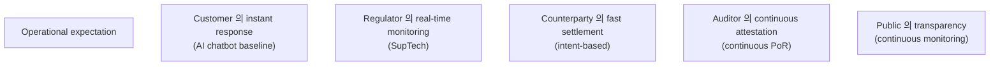
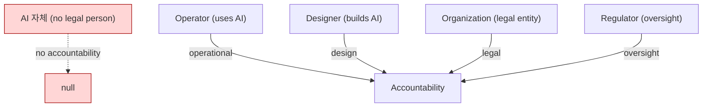
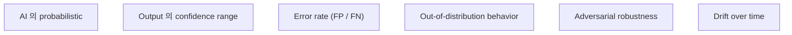
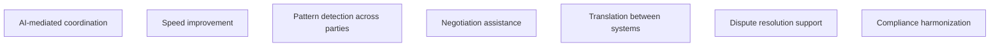
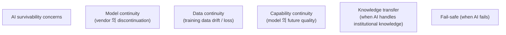

# E3 — AI / Automation Evolution Pressure

> **본 문서의 위치 (Evolution E3)**: E1 + E2 위의 **AI / automation 의 evolutionary pressure**. D29 + D30 의 evolution perspective. AI 가 humans 의 replacement 가 아닌 institutional shape 의 ongoing 변형.

> **본 문서가 답하는 핵심 질문**: 어떤 AI evolution 이 corpus 의 stress? 어떤 automation pressure 가 institutional invariants 의 test? Accountability 의 retention 의 ongoing discipline?

---

## 0. 핵심 명제 (10초 이해)

1. **AI pressure reshapes coordination / accountability / expectations, not replaces humans** (core thesis).
2. **5 "≠" 명제**:
   - AI augmentation ≠ Governance automation
   - Model capability ≠ Institutional trustworthiness
   - Automation pressure ≠ Operational maturity
   - Probabilistic recommendation ≠ Operational truth
   - AI explainability ≠ Accountability preservation
3. **AI capability evolves rapidly** — corpus 의 ongoing reassessment.
4. **Pressure 의 5 direction** — Speed expectation / Cost expectation / Capability expectation / Explainability requirement / Accountability evolution.
5. **Institutional drift risk** — AI 의 invisible shift 가 architecture 의 erosion.
6. **Operational expectation drift** — 사용자 / regulator 의 expectations 변화.
7. **Accountability persistence** — automation 도 accountability 의 transfer 안 함.
8. **Probabilistic institutional reasoning** — AI 의 fundamental nature 의 corpus 영향.
9. **AI survivability boundary** — D30 의 ongoing reasoning.
10. **Conservative discipline > hype** — corpus 의 ongoing position.

---

## 1. AI Pressure 의 5 Direction

### 1.1 5 evolutionary pressure

### 1.2 각 pressure 의 corpus impact

| Pressure | Affected docs |
|---|---|
| P1 Speed | D12 (incident response), D17 (treasury), D29 (autonomous) |
| P2 Cost | D6 (decision framework), D11 (compliance), D12 (operations) |
| P3 Capability | D29, D30, every operational domain |
| P4 Explainability | D24 (reporting), D30, D11 |
| P5 Accountability | D3 (governance), D29, D30 |

### 1.3 Pressure 의 source

- Vendor marketing.
- Customer / counterparty expectation.
- Regulator (mostly explainability + accountability).
- Cost pressure (internal / shareholder).
- Competitive pressure (industry).

### 1.4 Pressure 의 architecture 의 erosion risk

- "Automate everything" pressure.
- "AI handles edge case" assumption.
- "Cost reduction trumps oversight".
- → Architectural discipline 의 conscious defense.

### 1.5 "AI augmentation ≠ Governance automation"

(§0 명제)

- AI augmentation: human capability 의 amplification.
- Governance automation: human decision 의 replacement.
- 차이:
  - Augmentation = human still decides
  - Automation = AI decides (D29 의 L4 fully autonomous)
- → Discipline 의 boundary maintenance.

---

## 2. AI Capability Evolution

### 2.1 Capability evolution trajectory

### 2.2 Capability vs trustworthiness

- Capability ↑ 도 ≠ trustworthiness ↑.
- 일부 capability 는 reliability 의 question.
- 일부 capability 는 novel risk.
- → "Model capability ≠ Institutional trustworthiness".

### 2.3 "Model capability ≠ Institutional trustworthiness"

(§0 명제)

- Capability: AI 의 task performance.
- Trustworthiness: institutional context 의 reliability.
- 차이:
  - Benchmark performance 와 production behavior 의 gap
  - Hallucination 의 persistent
  - Adversarial vulnerability
  - Drift over time
- → Capability 의 ≠ deployment readiness.

### 2.4 New capability 의 institutional adoption

(D30 §1.4 의 application)

- Cautious adoption discipline.
- Sandbox + gradual expansion.
- Specific scope first.
- → New capability 의 careful integration.

### 2.5 Capability obsolescence

- 일부 capability 의 quick obsolescence (better model 의 emergence).
- Vendor switching cost.
- → Long-term commitment 의 careful.

---

## 3. Operational Expectation Drift

### 3.1 Expectation 의 evolving baseline

### 3.2 Expectation drift 의 institutional pressure

- Past acceptable 가 future unacceptable.
- 새 baseline 의 establishment.
- Institution 의 keep up pressure.
- → 보통 unilateral (ratchet effect).

### 3.3 "Automation pressure ≠ Operational maturity"

(§0 명제)

- Automation pressure: faster, cheaper 의 expectation.
- Operational maturity: 5-dimension (C2 §4).
- 차이:
  - Pressure 가 maturity 의 erosion 가능
  - Cost reduction 의 skill atrophy
  - → Pressure 의 careful navigation
- Conservative discipline 의 retention.

### 3.4 Drift 의 architectural sign

- Documentation decay.
- Manual capability atrophy.
- Tribal knowledge loss.
- → D12 §6 의 entropy 의 application to AI.

### 3.5 Resistance vs adoption balance

- Pure resistance = uncompetitive.
- Pure adoption = institutional risk.
- Balance:
  - Adopt at calibrated speed
  - Maintain core human capability
  - Continuous reassessment
- → Discipline + adaptation.

---

## 4. Accountability Persistence

### 4.1 Accountability 의 transfer 불가

(D30 §5 의 ongoing)

### 4.2 Persistence 의 ongoing discipline

- AI capability ↑ 도 accountability 의 persistence.
- Designer / operator / organization 의 responsibility.
- → Anti-"AI is at fault" framing.

### 4.3 Accountability framework 의 evolution

- Regulatory framework 의 development.
- 일부 jurisdiction 의 algorithmic accountability law.
- Industry standard 의 emergence.
- → 이 framework 의 corpus 의 input.

### 4.4 "AI explainability ≠ Accountability preservation"

(§0 명제 / D30 §5.3 의 재확인)

- Explainability: AI 의 reasoning 의 articulation.
- Accountability preservation: 누가 responsibility.
- 차이:
  - Explanation 가 perfect 해도 accountability 의 transfer 안 됨
  - 그러나 explanation 부재 시 accountability 더 어려움
- → 둘 다 필요, 다른 dimension.

### 4.5 Multi-decade accountability

- 일부 incident 의 accountability 의 multi-decade reach.
- Designer / operator 의 long-term shadow.
- → Long-horizon thinking.

---

## 5. Probabilistic Institutional Reasoning

### 5.1 AI 의 fundamental probabilistic nature

### 5.2 Institutional reasoning 의 traditional certainty

- Pre-AI: deterministic rule + human judgment.
- AI-augmented: probabilistic input + human judgment.
- → Reasoning 의 nature 의 shift.

### 5.3 "Probabilistic recommendation ≠ Operational truth"

(§0 명제 / D30 §2.3 의 재확인)

- Probabilistic recommendation: AI 의 confidence-weighted output.
- Operational truth: institutional fact (audit-grade).
- 차이:
  - Recommendation 의 confidence 가 high 해도 still probabilistic
  - Operational truth 의 evidence-backed (D5)
- → AI output 의 status 의 careful framing.

### 5.4 Decision-making framework 의 evolution

- Pre-AI: rule → action.
- AI-augmented: rule + recommendation → human decision → action.
- → Decision framework 의 layered.

### 5.5 Institutional risk of over-trust

- Recommendation 의 rubber-stamp.
- "AI said so" 의 reasoning shortcut.
- Skill atrophy.
- → Discipline 의 ongoing.

---

## 6. AI 의 New Risk Surfaces

### 6.1 AI-specific institutional risk

```mermaid
graph TB
    RISK["AI new risks"]

    R1["Hallucination on decision"]
    R2["Prompt injection / adversarial"]
    R3["Data leakage through AI"]
    R4["Bias amplification"]
    R5["Vendor lock-in (AI provider)"]
    R6["Decision drift over time"]
    R7["Accountability gap"]
    R8["Skill atrophy"]
    R9["Surveillance amplification"]
    R10["Concentration (few AI providers)"]
```

### 6.2 Risk evolution 의 ongoing

- 새 capability 가 새 risk surface.
- 일부 risk 의 mitigation 가능.
- 일부 risk 의 fundamental (e.g. hallucination 의 stochastic nature).
- → Ongoing risk catalog 의 update.

### 6.3 Adversarial AI 의 emerging threat

(D14 의 AI extension)

- Adversarial example.
- Model poisoning.
- Prompt injection.
- Model extraction.
- → AI threat model 의 ongoing.

### 6.4 AI 의 systemic risk

- Multiple institution 의 same AI provider 의존.
- Provider 의 incident = systemic impact.
- → D20 의 cross-institution risk 의 AI 측면.

### 6.5 AI vs cryptographic risk

- AI risk: probabilistic, behavioral.
- Cryptographic risk: deterministic, mathematical.
- 다른 nature, 다른 mitigation.
- → 두 risk type 의 coexistence.

---

## 7. Coordination 의 AI-mediated Evolution

### 7.1 AI 의 coordination role

### 7.2 Coordination evolution

- Human-only coordination → AI-assisted → AI-mediated.
- 각 stage 의 governance + accountability framework.
- → Gradual evolution.

### 7.3 Cross-institutional AI

(★ Hypothesis — emerging)

- 같은 AI provider 의 multiple institution 사용.
- AI-driven inter-institution coordination.
- Privacy / IP / accountability concern.
- → New coordination architecture.

### 7.4 AI 의 federation

- AI-mediated federation (D20 의 evolution).
- Cross-institution intelligence sharing.
- Threat intelligence federation.
- → Industry-wide AI coordination.

### 7.5 Sovereign AI dimension

- 국가 level 의 AI capability + policy.
- Cross-border AI coordination.
- → D27 의 CBDC 와 connection.

---

## 8. AI Survivability Boundary

### 8.1 AI 의 own survivability

### 8.2 AI 의 institutional dependency

- Institution 의 AI 의존 정도.
- AI failure 시 의 institutional continuation.
- → Dependency awareness.

### 8.3 Fail-safe design

- AI 의 fail 시 manual fallback.
- Critical path 의 human-redundant.
- → D12 §9 의 application.

### 8.4 AI 의 multi-provider

- Single AI provider 의존 = single point of failure.
- Multi-provider 의 cost + complexity.
- → D14 의 supply chain principle.

### 8.5 Custody architecture 의 AI dependency 의 explicit declaration

- 어디서 AI 가 critical?
- 어디서 AI 가 augment only?
- 어디서 AI 가 not used?
- → Transparency.

---

## 9. Conservative Discipline > Hype

### 9.1 Hype cycle 의 institutional risk

- Each AI advance 의 hype + disillusionment.
- Adoption based on hype = subsequent reversal.
- Architectural cost of hype-driven adoption.
- → Anti-hype discipline.

### 9.2 Marketing language의 anti-pattern (C4 의 AI 측면)

- "AI-powered" without specifics.
- "Autonomous" without scope.
- "Intelligent" as buzzword.
- → Skeptical reading.

### 9.3 "Just enough automation" principle

(★ Hypothesis — operational reasoning)

- Maximum automation 의 risk.
- Optimal automation 의 context-specific.
- → Calibrated automation.

### 9.4 Industry maturity 의 awaiting

- 일부 AI 의 production readiness 가 wait 의 value.
- Early adopter 의 risk + learning value.
- Late adopter 의 catch-up 가능.
- → Strategic timing.

### 9.5 Reasoning corpus 의 anti-hype role

- Corpus 의 institutional skepticism.
- 신중한 reasoning.
- Hype 의 explicit identification.
- → Corpus 의 ongoing value.

---

## 10. Q1-Q10 Reasoning

### Q1. AI augmentation ≠ Automation

§1.5.

### Q2. Capability ≠ Trustworthiness

§2.3.

### Q3. Pressure ≠ Maturity

§3.3.

### Q4. Recommendation ≠ Truth

§5.3.

### Q5. Explainability ≠ Accountability

§4.4.

### Q6. AI new risks

§6.

### Q7. Coordination evolution

§7.

### Q8. AI survivability

§8.

### Q9. Hype discipline

§9.

### Q10. Probabilistic reasoning

§5.

---

## 11. Open Questions

| 영역 | 질문 |
|---|---|
| AI use cases | which approved? |
| AI vendor selection | strategy |
| Multi-vendor AI | scope? |
| AI accountability framework | per regulator |
| AI training data | own / vendor? |
| AI sensitive data | classification |
| AI cost budget | per operation |
| AI failure recovery | playbook |
| AI ethics board | role |
| AI external audit | scope |

---

## 12. References + Uncertainty Boundary + Bridge

### 관련 wiki

- D29 (Autonomous Treasury), D30 (AI-assisted Governance)
- D14 (Security including AI threats)
- E1 (Incident), E2 (Regulatory)

### Uncertainty Boundary

- 본 문서는 **AI evolutionary pressure discipline** — rapidly evolving.
- §2.1 capability trajectory = current snapshot.
- §6 risk catalog = ongoing.
- §9 hype discipline = corpus 의 ongoing position.

### E4 Bridge Invariants (E1 + E2 + E3 → E4)

1. **Frontier 의 conservative adoption** — E3 의 AI lessons 이 E4 의 frontier discipline.
2. **Hype filtering** — E3 의 anti-hype 이 E4 의 frontier filtering.
3. **Survivability-first** — E1 + E2 + E3 의 cumulative discipline 이 E4 의 base.
4. **Speculative boundary** — E3 의 emerging boundary 가 E4 의 speculative 의 limit.
5. **Conservative institutional discipline** — E-series 의 consistent thread.

### E-series progression

- E1: incident-driven
- E2: regulatory / sovereign
- E3 (this): AI / automation pressure
- E4 (next): frontier integration discipline
- E5 (closing): knowledge survivability

---

**Stage 32 E3 completion timestamp**: 2026-05-20.
