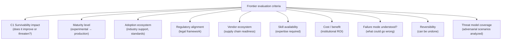
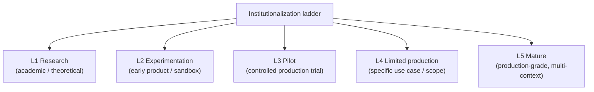
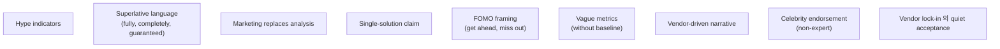
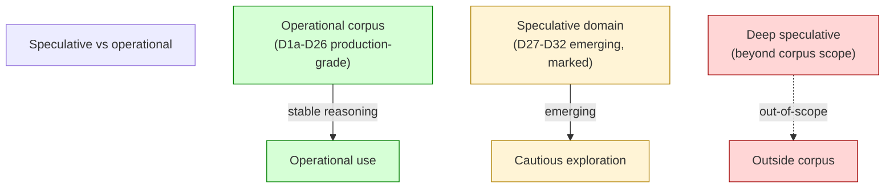
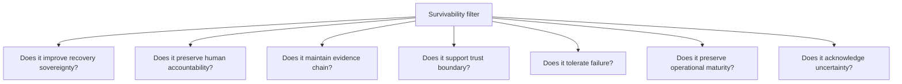
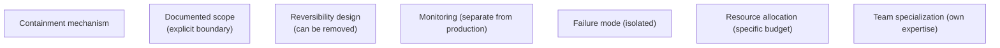

# E4 — Frontier Integration Discipline

> **본 문서의 위치 (Evolution E4)**: D27-D32 frontier cluster 의 **integration discipline**. New emerging primitive 의 institutional adoption 의 framework. Innovation ≠ institutional viability 의 ongoing reinforcement.

> **본 문서가 답하는 핵심 질문**: 어떤 frontier 가 institutional readiness 의 standard 를 통과? 어떤 hype 가 filter 되어야? 어떤 speculative 가 corpus 의 boundary 의 outside?

---

## 0. 핵심 명제 (10초 이해)

1. **Frontier 는 conservative survivability scrutiny 통과해야 institutional 진입** (core thesis).
2. **5 "≠" 명제**:
   - Innovation ≠ Institutional viability
   - Frontier adoption ≠ Survivability gain
   - Decentralization ≠ Governance reduction
   - Novel primitive ≠ New invariant
   - Experimental success ≠ Institutional readiness
3. **Frontier evaluation = staged framework** — not automatic acceptance.
4. **5-stage institutionalization ladder** — Research / Experimentation / Pilot / Limited production / Mature.
5. **Hype filter 의 active discipline** — corpus 의 anti-pattern protection.
6. **Speculative isolation** — non-actionable 의 explicit boundary.
7. **Survivability filter** = primary adoption criterion.
8. **Trust boundary preservation** = frontier 도 적용.
9. **Frontier containment 의 discipline** — corpus 의 main reasoning 의 contamination prevention.
10. **Patience > Speed** — frontier adoption 의 long-horizon.

---

## 1. Frontier Evaluation Framework

### 1.1 Multi-criteria evaluation

### 1.2 각 criterion 의 weighting

(★ Hypothesis — institutional design)

- C1 Survivability: highest weight (corpus 의 core).
- C8 Failure mode: high (unknown 의 risk).
- C9 Reversibility: high (mistake recovery).
- 다른: moderate to context-dependent.
- → Survivability-first.

### 1.3 "Innovation ≠ Institutional viability"

(§0 명제)

- Innovation: new capability / approach.
- Institutional viability: institutional adoption readiness.
- 차이:
  - Innovation 의 promise 가 viability 보장 아님.
  - 일부 innovation 의 unsuitable for institution (experimental, immature).
- → Filtering 의 architectural discipline.

### 1.4 Evaluation 의 anti-pattern

- "If it works for retail, it works for institutional"
- "Successful demo = production ready"
- "Vendor says it's enterprise-grade"
- "Industry adoption = our adoption"
- → Skeptical evaluation discipline.

### 1.5 Evaluation 의 ongoing

- One-time evaluation 의 insufficient.
- Continuous reassessment.
- Maturity 의 monitor.
- → Living evaluation framework.

---

## 2. 5-Stage Institutionalization Ladder

### 2.1 Ladder definition

### 2.2 Stage-specific institutional posture

| Stage | Institutional posture |
|---|---|
| L1 Research | Observe (no commitment) |
| L2 Experimentation | Engage selectively (specific trials) |
| L3 Pilot | Limited adoption (low-risk scope) |
| L4 Limited production | Operational use (specific scope) |
| L5 Mature | Standard adoption (broader use) |

### 2.3 Stage transition criteria

| Transition | Criteria |
|---|---|
| L1 → L2 | Working prototype + research validation |
| L2 → L3 | Multi-implementation + initial standards |
| L3 → L4 | Successful production trial + audit framework |
| L4 → L5 | Multi-year track record + comprehensive failure understanding |

### 2.4 "Experimental success ≠ Institutional readiness"

(§0 명제)

- Experimental success: controlled scope 의 working.
- Institutional readiness: production-scale + failure-mode-understood + audit-aligned.
- 차이:
  - Experimental 의 controlled environment 가 production 의 reality 와 다름.
  - Edge case + adversarial + scale 의 future learning.
- → L3-L4 transition 의 cautious.

### 2.5 Stage 의 specific frontier 의 example

(★ Hypothesis — current state)

| Frontier (D27-D32) | Current stage |
|---|---|
| D27 CBDC | L2-L3 (varies per country) |
| D28 Intent-based | L2-L3 |
| D29 Autonomous treasury | L1-L2 |
| D30 AI-assisted governance | L2-L3 |
| D31 Confidential settlement | L2-L3 |
| D32 Post-quantum | L1-L2 (NIST PQC 도 standardization 중) |

→ Current frontier 의 대부분 L1-L3. Conservative institutional 의 wait.

---

## 3. Hype Filter Discipline

### 3.1 Hype indicator

### 3.2 Hype filter mechanism

| Filter | 의미 |
|---|---|
| Independent verification | Vendor-independent analysis |
| Peer-reviewed | Academic / industry standards |
| Track record | Multi-year track record |
| Failure analysis | What could go wrong, documented |
| Cost-benefit honest | Including hidden cost |
| Reversibility analysis | Can it be undone |

### 3.3 Hype cycle pattern recognition

(★ Hypothesis — industry pattern)

- Each new tech 의 hype cycle:
  - Trigger (initial breakthrough)
  - Peak (over-promise)
  - Disillusionment (limitation 의 visible)
  - Productivity (mature use case)
- Institutional discipline = wait for productivity phase.

### 3.4 Anti-hype discipline

- Corpus 의 anti-hype framing (built-in).
- Reasoning 의 conservative.
- Marketing material 의 skeptical reading.
- → Active discipline.

### 3.5 Hype 의 institutional cost

- Adopted on hype = subsequent reversal.
- Architectural debt 의 cost.
- Reputational impact (failed initiative).
- → Hype cost 의 long shadow.

---

## 4. Speculative Domain Isolation

### 4.1 Speculative vs operational separation

### 4.2 Speculative boundary 의 명확

- Frontier cluster 의 "emerging" marking.
- Hypothesis ★ marking.
- "Out-of-scope" 의 explicit list (C6 §3.2).
- → Reader 의 awareness.

### 4.3 Deep speculative 의 example

- Interplanetary settlement (extreme speculative).
- Post-human institutional accountability.
- Civilization-scale survivability (long-horizon).
- → Corpus 의 deliberate non-coverage.

### 4.4 Speculative reasoning 의 risk

- Speculation 의 operational use:
  - Architectural decision 의 inappropriate basis
  - Investment decision 의 inappropriate basis
- → Speculative 의 isolation.

### 4.5 Future operational status

- 일부 speculative 의 future operational 가능.
- D32 의 PQ migration = currently emerging, future operational.
- 일부 speculative 의 ongoing speculative.
- → Continuous reassessment.

---

## 5. Survivability Filter

### 5.1 Survivability 의 primary criterion

(C2 §4 의 10 survivability principles 의 application)

### 5.2 Filter failure 의 action

- 어느 criterion 의 fail = adoption block (or condition).
- 모든 criterion 의 pass = adoption candidate.
- → Strict filter.

### 5.3 "Frontier adoption ≠ Survivability gain"

(§0 명제)

- Frontier adoption: new capability.
- Survivability gain: institutional resilience.
- 차이:
  - 일부 frontier 의 survivability 의 erosion 가능
  - Adoption 의 conscious survivability impact analysis
- → Filter 의 primary 역할.

### 5.4 Net survivability analysis

- 각 adoption 의 net effect:
  - + Benefits (specific capability)
  - - Costs (new risk, complexity)
- Net ≥ 0 only if explicit survivability improvement.
- → Conservative adoption discipline.

### 5.5 Filter 의 anti-pattern

- "It's new so it's better"
- "Industry adopts, we should too"
- "Behind the curve" framing
- → Survivability-first refuses these.

---

## 6. Trust Boundary Preservation

### 6.1 Frontier 의 trust boundary 측면

- D1a-D26 의 14+ trust boundary (C2 §3).
- 각 frontier 의 boundary 의 impact:
  - 새 boundary 추가?
  - 기존 boundary 의 erosion?
  - Boundary 의 shift?

### 6.2 Frontier 별 boundary impact

| Frontier | Boundary impact |
|---|---|
| D27 CBDC | 새 sovereign boundary (B12) |
| D28 Intent | 새 solver trust boundary |
| D29 Autonomous | Override boundary 의 새 layer |
| D30 AI-assisted | Recommendation vs decision boundary |
| D31 Confidential | Confidentiality vs audit boundary (B13) |
| D32 PQ | Classical vs PQ boundary (B14) |

### 6.3 "Novel primitive ≠ New invariant"

(§0 명제)

- Novel primitive: new technology / mechanism.
- New invariant: fundamental architectural law.
- 차이:
  - 대부분 primitive 의 existing invariant 의 specialization.
  - 새 invariant 는 매우 rare (paradigm shift).
- → 새 primitive 의 invariant analysis.

### 6.4 Boundary erosion 의 detection

- Frontier adoption 시 boundary 의 review.
- 새 boundary 의 explicit identification.
- Erosion 의 prevention.

### 6.5 Boundary preservation 의 ongoing

- Adoption 후에도 boundary 의 monitoring.
- 시간에 따른 erosion 가능.
- → Continuous boundary discipline.

---

## 7. Frontier Containment

### 7.1 Containment 의 의미

- Frontier 의 specific scope 의 isolation.
- Main reasoning 의 contamination 방지.
- → Architectural discipline.

### 7.2 Containment 의 mechanism

### 7.3 Containment failure 의 risk

- Scope creep (frontier 의 expansion).
- Production reliance.
- Failure 의 production impact.
- → Containment discipline 의 active.

### 7.4 Containment vs adoption 의 progression

- Pilot stage 의 containment.
- Production stage 의 integration.
- Mature stage 의 standard.
- → Gradual de-containment.

### 7.5 "Decentralization ≠ Governance reduction"

(§0 명제)

- Decentralization: technical / structural decentralization.
- Governance reduction: governance overhead 의 감소.
- 차이:
  - Decentralized system 의 own governance complexity
  - Coordination 의 different form (D20)
- → Frontier 의 governance 의 explicit.

---

## 8. Patience > Speed

### 8.1 Long-horizon adoption

- Institutional adoption 의 timeline:
  - Years (typical for new primitive)
  - Decade+ (for major paradigm)
- → Fast-mover advantage 의 limit.

### 8.2 Wait 의 value

- Other institution 의 lesson.
- Maturity 의 emergence.
- Standard 의 settlement.
- → Strategic patience.

### 8.3 Early adopter 의 cost

- Pioneer 의 risk:
  - Standards 변경
  - Failure mode 의 first discovery
  - Reputational 의 exposure
- 그러나 일부 benefit:
  - Capability development
  - Vendor leverage
  - Strategic positioning
- → Calibrated early adoption.

### 8.4 Patience 의 active discipline

- "Wait and watch" 의 active monitoring.
- 정기 reassessment.
- 준비 (when condition ready, move).
- → Patience ≠ passivity.

### 8.5 Catch-up strategy

- Late adopter 의 strategy.
- Mature primitive 의 standard integration.
- Lower risk, lower opportunity.
- → Acceptable for many institution.

---

## 9. Frontier 의 Corpus Update

### 9.1 Frontier maturation 시 cluster reorganization

- D27-D32 의 "emerging" status.
- 일부 가 mature 시 → Specialization cluster 로 이동.
- 일부 가 obsolete 시 → deprecation.

### 9.2 Cluster maturation 의 example (★ Hypothesis)

- 5-10년 후:
  - D27 CBDC: 일부 country 의 mature production
  - D32 PQ: standards mature, migration ongoing
  - D28 intent: emerging production
  - D31 confidential: niche production
- → Cluster의 dynamic.

### 9.3 New frontier 의 emergence

- 5-10년 후 의 새 frontier:
  - 현재 의 unknown
  - 새 paradigm
- → Corpus 의 ongoing extension.

### 9.4 Frontier obsolescence

- 일부 frontier 의 abandonment:
  - Failed primitive
  - Replaced by alternative
- → Deprecation discipline.

### 9.5 Long-term corpus evolution

- 10-20년 후 의 corpus:
  - 일부 cluster maturation
  - 새 cluster 추가
  - 일부 deprecation
- → Living document 의 multi-decade.

---

## 10. Q1-Q10 Reasoning

### Q1. Innovation ≠ Viability

§1.3.

### Q2. 5-stage ladder

§2.

### Q3. Experimental ≠ Ready

§2.4.

### Q4. Hype filter

§3.

### Q5. Speculative isolation

§4.

### Q6. Survivability filter

§5.

### Q7. Trust boundary preservation

§6.

### Q8. Containment discipline

§7.

### Q9. Patience strategy

§8.

### Q10. Long-term corpus evolution

§9.

---

## 11. Open Questions

| 영역 | 질문 |
|---|---|
| Adoption decision authority | per institution |
| Pilot program structure | scope |
| Vendor evaluation framework | rigor |
| Industry monitoring | who? |
| Sandbox participation | when? |
| Failure tolerance | per stage |
| Reversibility threshold | required level |
| Skill development pace | per frontier |
| Cost / budget allocation | per stage |
| Multi-vendor strategy | scope |

---

## 12. References + Uncertainty Boundary + Bridge

### 관련 wiki

- D27-D32 (Frontier cluster)
- D6 (Decision framework), D14 (Security threats)
- E1, E2, E3

### Uncertainty Boundary

- 본 문서는 **frontier integration discipline** — ongoing.
- §2.5 current stage estimates = ★ Hypothesis snapshot.
- §9.2 cluster maturation = future projection.
- §3.3 hype cycle = pattern observation.

### E5 Bridge Invariants (E1 + E2 + E3 + E4 → E5)

1. **Knowledge survivability** — E4 의 adoption 의 long-horizon 이 E5 의 knowledge survivability.
2. **Conservative discipline 의 transmission** — E1-E4 의 discipline 의 E5 의 generational transfer.
3. **Living document** — E1-E4 의 evolution 이 E5 의 corpus longevity.
4. **Institutional memory** — E2-E3 의 evolution 이 E5 의 memory continuity.
5. **Corpus 의 own survivability** — E1-E4 의 evolution discipline 이 E5 의 corpus 자체 의 survivability.

### E-series progression

- E1: incident-driven
- E2: regulatory / sovereign
- E3: AI / automation pressure
- E4 (this): frontier integration discipline
- E5 (next, closing): knowledge survivability

---

**Stage 32 E4 completion timestamp**: 2026-05-20.
