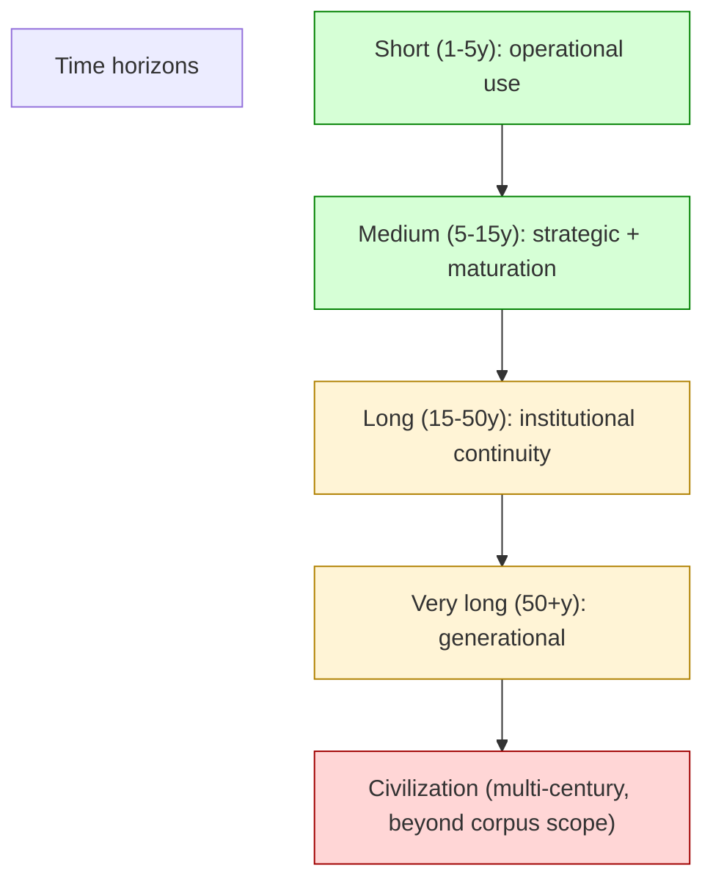
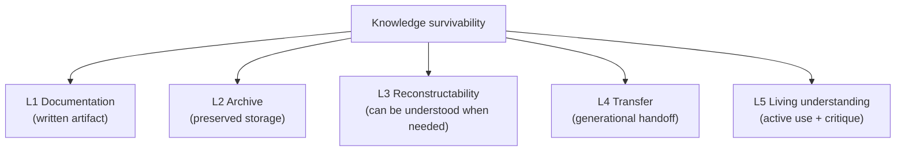
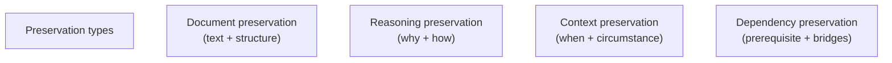
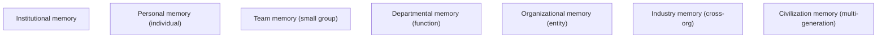
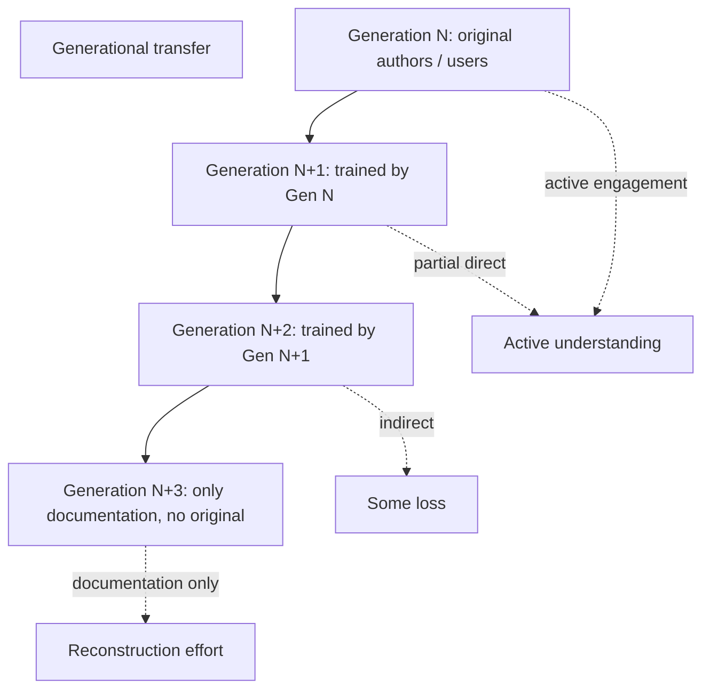
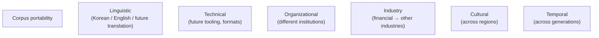
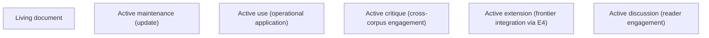
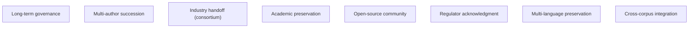
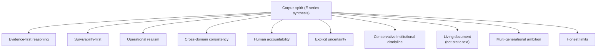
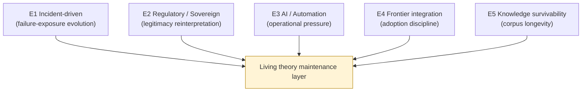

# E5 — Corpus Longevity / Knowledge Survivability

> **본 문서의 위치 (Evolution E5 — closing)**: E1 + E2 + E3 + E4 의 final synthesis. **Corpus 의 own survivability** 의 architectural reasoning. Knowledge 의 long-term continuity 가 theory corpus 의 ultimate test.

> **본 문서가 답하는 핵심 질문**: 어떻게 corpus 가 multi-decade survive? 어떻게 reasoning 의 generational transfer? 어떻게 institutional memory 의 preservation? Corpus 의 own architecture (meta-architecture)?

---

## 0. 핵심 명제 (10초 이해)

1. **Knowledge survivability = architectural problem** (core thesis).
2. **Corpus survives only via reconstructable reasoning across change** (secondary thesis).
3. **5 "≠" 명제**:
   - Documentation ≠ Knowledge survivability
   - Archive ≠ Reconstructability
   - Stored corpus ≠ Operational continuity
   - Knowledge transfer ≠ Institutional understanding
   - Corpus stability ≠ Corpus survivability
4. **Multi-decade horizon** — corpus 의 long-term life cycle.
5. **5-layer survivability** — Documentation / Archive / Reconstructability / Transfer / Living understanding.
6. **Reasoning preservation** — invariant 의 transmission 의 challenge.
7. **Institutional memory** — organization 의 memory continuity 의 dependency.
8. **Generational transfer** — multi-generation reader / contributor.
9. **Corpus 의 own meta-architecture** — corpus 의 self-application.
10. **Living document spirit** — closing 이 publication 의 의미.

---

## 1. Multi-decade Horizon

### 1.1 Time horizon definition



### 1.2 Corpus 의 practical horizon

- Operational use: 1-5y (current relevance).
- Strategic: 5-15y (maturation of frontier).
- Long-term: 15-50y (multi-generational).
- Beyond: explicitly out-of-scope.

### 1.3 Horizon 의 reasoning shift

- Short-term: operational application.
- Medium: strategic planning.
- Long-term: institutional memory + reasoning transmission.
- Beyond: speculative + civilization-scale (not corpus 의 task).

### 1.4 Multi-decade challenge

- Technology change.
- Regulatory change.
- Organizational change.
- Generational change (people).
- Language / terminology evolution.
- → 모든 dimension 의 long-term challenge.

### 1.5 Corpus 의 ambition

- 본 corpus 의 ambition: 15-30 year continuity.
- 그 이상은 honest limitation.
- → Realistic scope.

---

## 2. 5-layer Knowledge Survivability

### 2.1 5 layer of survivability



### 2.2 Layer dependency

- L1 prerequisite for L2.
- L2 prerequisite for L3.
- L3 prerequisite for L4.
- L4 prerequisite for L5.
- → Cumulative + layered.

### 2.3 "Documentation ≠ Knowledge survivability"

(§0 명제)

- Documentation = L1 only.
- Knowledge survivability = 모든 5 layer.
- 차이:
  - Documentation 가 archive (L2) 안 되면 시간에 따라 lost
  - Archive 가 reconstructable (L3) 안 되면 future reader 가 못 사용
  - Reconstructable 가 transferred (L4) 안 되면 generation 끝남
  - Transferred 가 living (L5) 안 되면 static / obsolete
- → 5 layer 모두 필요.

### 2.4 "Archive ≠ Reconstructability"

(§0 명제)

- Archive: stored material.
- Reconstructability: future reader 의 understanding 가능.
- 차이:
  - Stored doc 의 future reader 가 context 부재 시 incomplete understanding
  - Specialized terminology 의 future obsolescence
  - Cross-reference 의 broken link
- → Reconstructability 의 active maintenance.

### 2.5 "Stored corpus ≠ Operational continuity"

(§0 명제)

- Stored corpus: archive existence.
- Operational continuity: institution 의 ongoing use.
- 차이:
  - Archive 가 있어도 institution 의 active use 부재 시 dead document
- → Active use 가 living document 의 condition.

---

## 3. Reasoning Preservation

### 3.1 Reasoning vs document preservation



### 3.2 Each preservation 의 challenge

| Preservation | Challenge |
|---|---|
| Document | Storage + format + readable |
| Reasoning | Why this reasoning, future understanding |
| Context | Historical situation 의 awareness |
| Dependency | Network 의 reconstruction |

### 3.3 Reasoning 의 deep transmission

- Not just "what" but "why".
- Anti-patterns 의 historical reason.
- Hypothesis 의 boundary 의 explicit.
- → Deep transmission 의 explicit effort.

### 3.4 Context loss 의 risk

- Future reader 의 different context.
- "Why was this important?" 의 obscurity.
- Historical incident 의 context.
- → Context note 의 active inclusion.

### 3.5 Reasoning 의 antifragility

- Each stress test (E1) 의 reasoning 의 strengthening.
- Documentation 의 ongoing refinement.
- → Antifragile knowledge structure.

---

## 4. Institutional Memory

### 4.1 Memory 의 multi-layer



### 4.2 Memory loss 의 timescale

- Personal: hours-decades (typical 1-5 year retention)
- Team: years (turnover dependent)
- Departmental: 5-10 years (institutional stability)
- Organizational: 10-30 years (charter, culture)
- Industry: decades (collective)
- Civilization: centuries (long arc)

### 4.3 Corpus 의 institutional memory role

- Codification of reasoning.
- Reduces personal memory dependency.
- Cross-team accessibility.
- Generational handoff aid.
- → Corpus = institutional memory aid.

### 4.4 "Knowledge transfer ≠ Institutional understanding"

(§0 명제)

- Knowledge transfer: passing of information.
- Institutional understanding: organization 의 active comprehension + application.
- 차이:
  - Document handoff 가 understanding 보장 아님
  - Active engagement 필요
- → Transfer 의 active discipline.

### 4.5 Memory degradation 의 mitigation

- Documentation freshness (E1 의 ongoing update).
- Cross-training (D12 §8).
- Mentorship.
- Discussion + reflection.
- → Multi-mechanism preservation.

---

## 5. Generational Transfer

### 5.1 Generational challenge



### 5.2 Each generation 의 transfer 의 fidelity

- Direct transfer (G1 → G2): highest fidelity.
- Indirect (G1 → G3 via G2): some loss.
- Document-only (G1 → G4): lowest fidelity, requires reconstruction.
- → Cross-generational discipline.

### 5.3 Transfer mechanism

- Mentorship.
- Apprenticeship.
- Documentation.
- Recorded discussion.
- Case study.
- Practical application.
- → Multi-mechanism.

### 5.4 "Corpus stability ≠ Corpus survivability"

(§0 명제 / E5 unique)

- Corpus stability: text 의 stability.
- Corpus survivability: ongoing relevance + understanding.
- 차이:
  - Stable text 의 obsolescence (no longer relevant)
  - Stable but unused = effective death
- → Survivability = ongoing engagement.

### 5.5 Generational compatibility

- Future generation 의 different:
  - Technology familiarity
  - Cultural reference
  - Vocabulary
  - Operational context
- Corpus 의 adaptation 또는 compatibility 의 future work.

---

## 6. Corpus Portability

### 6.1 Portability 의 dimension



### 6.2 Linguistic portability

- 본 corpus 의 currently Korean + English mix.
- Future translation 의 value.
- Terminology 의 explicit definition.
- → Multi-lingual future.

### 6.3 Industry portability

- Financial custody 의 reasoning 의 transfer:
  - Other regulated domains (healthcare, energy)
  - Government / public sector
  - Critical infrastructure
- → Generalized reasoning 의 broader application.

### 6.4 Temporal portability

- Across-generational compatibility (§5).
- Vocabulary 의 explicit definition.
- Context 의 documentation.

### 6.5 Portability vs specificity 의 trade-off

- Specific reasoning 의 institutional value.
- 그러나 specificity 의 portability 의 reduce.
- Balance: generalized + specific examples.

---

## 7. Living Document Discipline

### 7.1 Living document 의 components



### 7.2 Living document 의 antithesis (dead document)

- Stored but unused.
- Out-of-date.
- Disconnected from current operations.
- → Fossilization.

### 7.3 Active maintenance discipline

(E1 의 integration)

- Incident-driven update.
- Periodic refresh.
- Anti-pattern catalog update.
- → Ongoing discipline.

### 7.4 Active use discipline

- Institutional application.
- Architecture decision 의 input.
- Onboarding 의 use.
- → Operational integration.

### 7.5 Active critique discipline

- Internal peer review.
- External community engagement.
- Academic dialogue.
- Industry consortium.
- → Cross-corpus dialogue.

---

## 8. Corpus 의 Own Meta-architecture

### 8.1 Corpus 가 corpus 의 reasoning 의 apply

- Evidence-first: corpus 의 evidence chain (versioning, audit, citation).
- Survivability > efficiency: corpus 의 own survival > document elegance.
- Trust boundary: editor / reviewer / contributor boundary.
- Human accountability: author / maintainer accountability.
- Append-only: corpus 의 changelog (deprecate, don't delete).
- → Corpus 의 self-application.

### 8.2 Corpus 의 own crisis

(E1 §8.2 의 deep)

- Major industry event 의 corpus framework 의 question.
- Hypothetical 의 example:
  - 새 paradigm 의 emergence
  - Corpus 의 fundamental incorrect 의 discovery
- → Corpus 의 own survivability test.

### 8.3 Corpus 의 own governance

- Editor authority.
- Contribution discipline.
- Versioning policy.
- Deprecation framework.
- → Living governance.

### 8.4 Corpus 의 own evidence chain

- Document version history.
- Change rationale.
- Cross-reference integrity.
- → Self-reflexive evidence.

### 8.5 Corpus 의 own failure-state planning

- What if corpus 의 maintainer disappears?
- What if industry context changes fundamentally?
- What if corpus 의 reasoning 의 invalidated?
- → Corpus 의 own survivability planning.

---

## 9. Long-term Evolution Governance

### 9.1 Governance 의 multi-decade discipline



### 9.2 Succession planning

- Original author 의 succession.
- Maintainer 의 succession.
- → Multi-generation continuity.

### 9.3 Open-source consideration

(★ Hypothesis — future possibility)

- Corpus 의 open-source 의 benefits:
  - Industry contribution
  - Multi-author improvement
  - Cross-institution adoption
- 그러나 challenge:
  - Coherence maintenance
  - Vandalism
  - Direction confusion
- → Open-source 의 carefully designed.

### 9.4 Academic preservation

- Academic institutions 의 archive role.
- Cross-citation 의 corpus mention.
- Curriculum integration.
- → Multi-source preservation.

### 9.5 Industry consortium

- Industry-level corpus stewardship.
- Cross-institutional contribution.
- Standardization 의 role.
- → Collective ownership.

---

## 10. Honest Limits

### 10.1 Corpus 의 limits 의 explicit

(C6 §8 의 final affirmation)


### 10.2 Limit 의 acknowledgment 의 maturity

- Limit 의 honest 의 institutional value.
- "Final theory" 의 claim 의 anti-pattern.
- Ongoing learning 의 humility.
- → Mature discipline.

### 10.3 What corpus does NOT promise

- Final architectural truth.
- Universal applicability.
- Prediction of all future scenarios.
- Industry-wide standardization.
- → Honest scope.

### 10.4 What corpus does promise

- Honest reasoning at this point in time.
- Conservative survivability discipline.
- Explicit uncertainty acknowledgment.
- Open question identification.
- Anti-pattern protection.
- → Honest contribution.

### 10.5 Reader 의 responsibility

- Critical reading.
- Institutional application.
- Continuous learning.
- Industry engagement.
- → Reader 가 corpus 의 partner.

---

## 11. Corpus 의 Final Spirit (E-series closing)

### 11.1 5-cluster final spirit



### 11.2 Spirit 의 ongoing

- 본 spirit 의 corpus 의 publication 시 의 declaration.
- Reader / contributor 의 ongoing embodiment.
- → Spirit 의 transmission 의 active.

### 11.3 Corpus 의 ultimate test

- Multi-decade operation 시 reasoning 의 preservation.
- Crisis 시 의 corpus 의 institutional value.
- Generational handoff 의 success.
- → Future 의 corpus 의 own judgment.

### 11.4 Anti-fossilization 의 commitment

- Living document 의 ongoing.
- Stale 의 ongoing renewal.
- Critique welcome.
- → Anti-final-truth.

### 11.5 Anti-hype 의 commitment

- Hype 의 active refusal.
- Conservative reasoning 의 ongoing.
- Fundamentals 의 maintenance.
- → Long-term institutional value.

---

## 12. Cluster Closing Summary (E1-E5)

### 12.1 5-document evolution integration



### 12.2 Evolution thesis 재확인

> **A mature institutional architecture corpus is not static knowledge. It is a continuously stress-tested reasoning system evolving through new incidents, technologies, regulations, and operational realities.**

또는:

> **The final form of institutional architecture work is not completion. It is disciplined evolution under uncertainty.**

### 12.3 E-series 의 cumulative contribution

- E1: incident-driven discipline
- E2: regulatory adaptation discipline
- E3: AI pressure discipline
- E4: frontier integration discipline
- E5: knowledge survivability discipline

→ Corpus 의 living maintenance framework.

### 12.4 E-series 의 25 "≠" propositions

| Document | ≠ propositions |
|---|---|
| **E1** | Incident ≠ Invariant invalidation / Failure ≠ Theory collapse / New exploit ≠ Architectural obsolescence / Patch ≠ Survivability improvement / Operational surprise ≠ Theoretical failure |
| **E2** | Regulation update ≠ Architectural replacement / Legal clarity ≠ Operational certainty / Sovereign coordination ≠ Governance convergence / Compliance adaptation ≠ Institutional survivability / Regulatory alignment ≠ Strategic safety |
| **E3** | AI augmentation ≠ Governance automation / Model capability ≠ Institutional trustworthiness / Automation pressure ≠ Operational maturity / Probabilistic recommendation ≠ Operational truth / AI explainability ≠ Accountability preservation |
| **E4** | Innovation ≠ Institutional viability / Frontier adoption ≠ Survivability gain / Decentralization ≠ Governance reduction / Novel primitive ≠ New invariant / Experimental success ≠ Institutional readiness |
| **E5** | Documentation ≠ Knowledge survivability / Archive ≠ Reconstructability / Stored corpus ≠ Operational continuity / Knowledge transfer ≠ Institutional understanding / Corpus stability ≠ Corpus survivability |

---

## 13. Architecture Corpus 최종 완성 (44 documents)

### 13.1 Final corpus structure

```
Architecture corpus 최종 구성:

D-series (Reasoning corpus):
  Foundation     D1a, D1b, D2-D8, D6        9 docs
  Specialization D9-D14                     6 docs
  Trust          D15, D16, D24              3 docs
  Liquidity      D17-D20                    4 docs
  Crisis         D21-D23, D25, D26          5 docs
  Frontier       D27-D32                    6 docs
                                          ────────
  D-series subtotal                        33 docs

C-series (Consolidation corpus):
  C1-C6                                     6 docs
                                          ────────
  C-series subtotal                         6 docs

E-series (Evolution / maintenance corpus):
  E1-E5                                     5 docs
                                          ────────
  E-series subtotal                         5 docs

  ═════════════════════════════════════════════════
  Total                                    44 docs
  ═════════════════════════════════════════════════
```

### 13.2 Corpus 의 3-layer architecture

- D-series: reasoning content (what + why).
- C-series: consolidation + navigation.
- E-series: evolution + maintenance.
- → 3-layer corpus.

### 13.3 Corpus 의 final definition

> The architecture corpus is a multi-layer living reasoning system — comprising 33 D-documents of generalized institutional custody reasoning, 6 C-documents of consolidation/meta-architecture navigation, and 5 E-documents of evolution/maintenance discipline — designed for multi-decade institutional knowledge survivability under conservative discipline that retains human accountability, acknowledges deep uncertainty, refuses hype, and welcomes ongoing critique + extension.

---

## 14. Q1-Q10 Reasoning

### Q1. Documentation ≠ Knowledge survivability

§2.3.

### Q2. Archive ≠ Reconstructability

§2.4.

### Q3. Stored ≠ Operational continuity

§2.5.

### Q4. Knowledge transfer ≠ Understanding

§4.4.

### Q5. Stability ≠ Survivability

§5.4.

### Q6. 5-layer survivability

§2.

### Q7. Generational transfer

§5.

### Q8. Living document discipline

§7.

### Q9. Self-application (meta-architecture)

§8.

### Q10. Honest limits

§10.

---

## 15. Open Questions (final)

| 영역 | 질문 |
|---|---|
| Corpus succession | author transition? |
| Industry consortium | when / how? |
| Open-source release | timing? terms? |
| Multi-language | priority languages? |
| Academic integration | curriculum? |
| Regulator engagement | proactive? |
| Cross-corpus integration | with peer corpora? |
| Long-term governance | charter? |
| Corpus 의 own audit | external review? |
| Reader feedback | mechanism? |

---

## 16. References + Final Spirit

### 관련 wiki

- All 44 documents (D + C + E series)

### Final Spirit (corpus closing)

> 본 corpus 는 institutional digital asset custody 의 generalized reasoning 의 시도.
> 33 D + 6 C + 5 E = 44 documents 의 multi-layer living system.
> Conservative survivability discipline 의 retention.
> Human accountability 의 retention.
> Explicit uncertainty 의 retention.
> Hype refusal 의 retention.
> Living document 의 ongoing.

> Reader 의 critical reading + institutional application + industry engagement = corpus 의 evolution.
> Corpus 의 closing 은 publication, not completion.
> Living theory 의 ongoing.

### Final discipline declaration

- **No final theory claim**
- **No inevitability framing**
- **No automation utopianism**
- **No ideology-first reasoning**
- **No survivability compromise for elegance**
- **No vendor recapture**
- **No hype**

### Corpus spirit (final)

**Evidence-first / Survivability-first / Operational realism / Cross-domain consistency / Human accountability / Explicit uncertainty / Conservative institutional discipline / Living document / Multi-generational ambition / Honest limits**

---

**Stage 32 E5 completion timestamp**: 2026-05-20.
**Stage 32 E-series evolution layer 완성 timestamp**: 2026-05-20.
**Stage 32 architecture corpus (D + C + E = 44 documents) 최종 완성 timestamp**: 2026-05-20.
