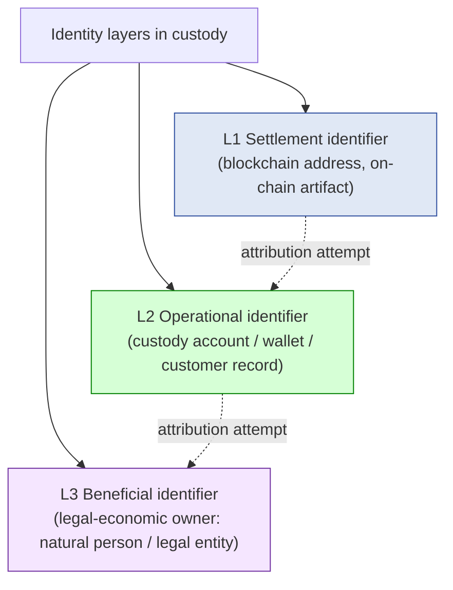
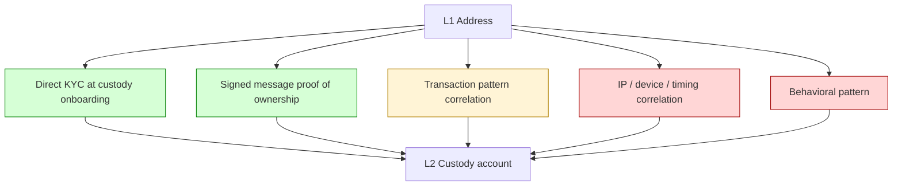
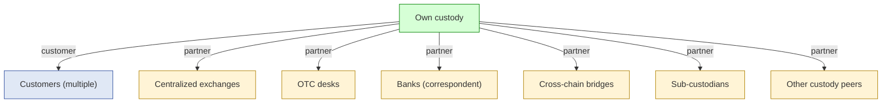
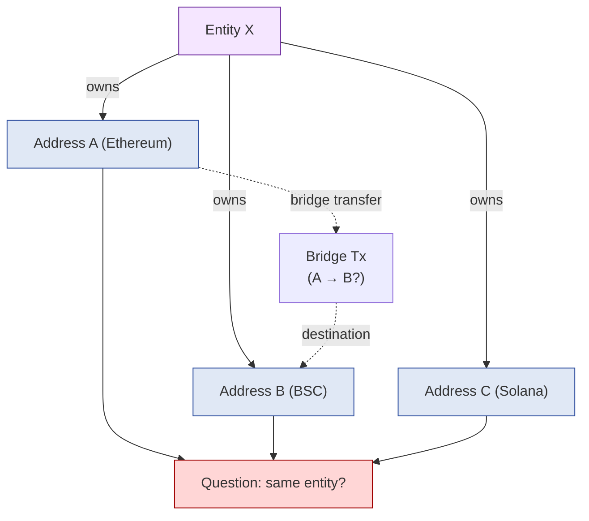
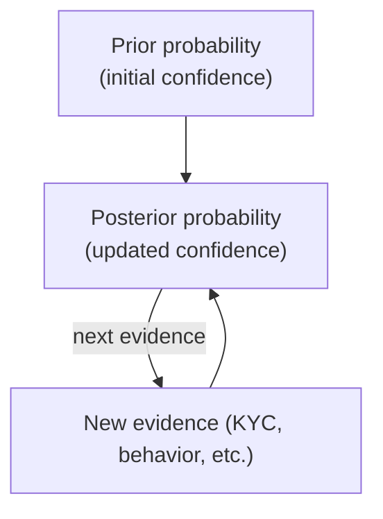
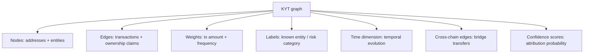
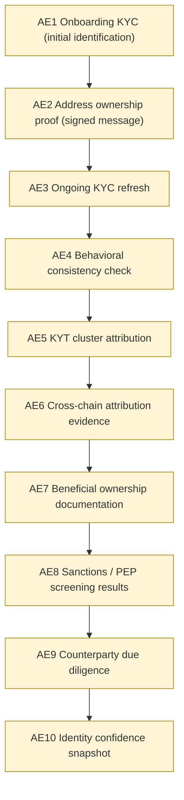

# Custody Wallet — Identity / KYT / Counterparty Graph Reasoning

> **본 문서의 위치 (Trust Cluster D16)**: D15 의 "identity ambiguity = trust ceiling" 의 직접적 해결 단계. D11 compliance (KYT) + D15 transparency (verifiability) 위에서 **identity attribution + counterparty graph** 의 generalized reasoning. Address ≠ Identity 의 deep reasoning.

> **본 문서가 답하는 핵심 질문**: 왜 blockchain address 가 institutional identity 가 아닌가? 왜 KYT cluster 가 beneficial ownership 가 아닌가? 왜 attribution 이 probabilistic 일 수밖에 없는가? 왜 cross-chain linkage 가 entity continuity 보장 아닌가? 왜 graph confidence 가 legal proof 가 아닌가?

---

## 0. 핵심 명제 (10초 이해)

1. **Address = settlement identifier, not institutional identity** (core thesis).
2. **Identity = reconstructed, inferred, continuously revised** (secondary thesis) — static ownership 아닌 dynamic attribution.
3. **5-tier "≠" 명제 (D16 cluster invariant)**:
   - Address ≠ Identity
   - KYT cluster ≠ Beneficial ownership
   - Monitoring visibility ≠ Attribution certainty
   - Cross-chain linkage ≠ Entity continuity
   - Graph confidence ≠ Legal proof
4. **Identity 의 3-layer model** — Settlement identifier (chain-side) / Operational identifier (custody-side) / Beneficial identifier (legal-economic-side).
5. **Probabilistic attribution = Bayesian update** — evidence 누적에 따라 confidence 변동.
6. **Counterparty graph = directed multi-hop trust network** — institutional 의 trust topology.
7. **D15 의 verifiability ceiling 의 해결 = D16 attribution + multi-source evidence**.
8. **Identity uncertainty 은 irreducible** — perfect attribution 불가, acceptable confidence threshold 의 management.
9. **Cross-chain identity = transitive attribution challenge** — bridge / wrapping 후 identity preservation 의 한계.
10. **Identity SaaS customer burden ~75%** — vendor 의 KYT tool 위에서 customer 가 own KYC + entity resolution + legal evidence.

---

## 1. 3-Layer Identity Model



### 1.1 각 layer 의 nature

| Layer | Nature | Verification method |
|---|---|---|
| **L1 Settlement** | Cryptographic public key derived | Mathematical / on-chain observable |
| **L2 Operational** | Internal record mapping address → customer | Own KYC database |
| **L3 Beneficial** | Legal economic ownership | KYC + legal documents + ongoing verification |

### 1.2 Layer 간 gap

```
L1 (address) -> who controls private key? (could be multiple parties, multi-sig, smart contract)
L2 (operational record) -> customer of our system, but customer 가 nominee 일 수 있음
L3 (beneficial) -> 실제 자금의 economic owner, 가장 어려운 attribution
```

→ Layer 간 jumping 은 attribution gap.

### 1.3 "Address ≠ Identity" reasoning

(§0 명제)

- Address = control proof (cryptographic).
- Identity = "누구가" 의 legal-social property.
- Address 가 multiple identity layer 의 어느 것도 직접 establish 못함:
  - Address 가 user A 의 own wallet 인가?
  - User A 가 자신의 own behalf 인가, 다른 자의 nominee 인가?
  - 실제 자금의 owner 가 누구인가?

---

## 2. Settlement Identifier (L1) → Operational Identifier (L2) Attribution

### 2.1 Attribution evidence types



### 2.2 Attribution method 의 confidence

| Method | Confidence (★ Hypothesis) | 한계 |
|---|---|---|
| Direct KYC + onboarding | High | KYC document 의 own integrity |
| Signed message ownership proof | Very high (cryptographic) | Private key 의 actual holder 와 owner 의 불일치 가능 |
| Transaction pattern | Medium-High | Heuristic, false positive |
| IP / device | Medium | Spoofable |
| Behavioral pattern | Low-Medium | Easily mimicable |

### 2.3 Multi-sig + Smart contract address 의 complication

(★ Hypothesis — operational pattern)

- Multi-sig: multiple parties control single address.
- Smart contract: code controls address, but contract deployer 도 separately exists.
- → "Address controller" 의 single mapping 자체가 false simplification.

### 2.4 Onboarding 의 KYC 의 한계 (L2 → L3 의 bridge)

- KYC = identity 시점에 verify.
- 그 후 변화:
  - Identity sale (legitimate KYC 위 다른 사람이 사용)
  - Coercion
  - Nominee relationship (KYC'd person ≠ beneficial owner)
- → KYC = snapshot, not continuous.

### 2.5 Continuous identity verification

(★ Hypothesis — emerging pattern)

- Periodic identity refresh:
  - Behavioral consistency check
  - Re-verification trigger (high-value tx, jurisdictional change)
  - Liveness check (recent activity proof)
- → KYC 의 ongoing maintenance.

---

## 3. Operational Identifier (L2) → Beneficial Identifier (L3) Attribution

### 3.1 Beneficial ownership 의 nature

- 법적 정의 (FATF / regulatory): "ultimate natural person who owns or controls".
- 그러나 도달까지의 layer:
  - 직접 customer = beneficial?
  - Corporate customer = beneficial = ultimate parent's natural person?
  - Trust structure = beneficial = trust 의 settlor / beneficiary / trustee 중 누구?
  - Nominee = legal customer ≠ beneficial

### 3.2 "KYT cluster ≠ Beneficial ownership"

(§0 명제)

- KYT cluster = on-chain behavioral attribution (heuristic).
- Beneficial ownership = legal economic property.
- 차이:
  - Cluster 가 정확해도 economic owner 의 nominee 관계 모름
  - Cluster 가 부정확하면 wrong attribution
- → Cluster 는 starting point, beneficial 은 legal investigation.

### 3.3 Beneficial ownership 의 evidence type

| Evidence | 의미 |
|---|---|
| KYC declaration | Customer 의 self-declaration |
| Corporate registry | Government-issued ownership records |
| Source-of-funds documentation | Bank statements, tax records |
| Cross-jurisdictional check | Multiple jurisdiction 의 record |
| Investigative analysis | Forensic accounting + legal |

### 3.4 Layered ownership structures

(★ Hypothesis — financial industry pattern)

- 의도적 obfuscation:
  - Shell companies
  - Trust within trust
  - Cross-jurisdictional layering
  - Bearer instruments (deprecated but historical)
- Mitigation:
  - Ultimate beneficial ownership (UBO) declaration 의무
  - Threshold (e.g. 25%+ ownership 요건)
  - Penetration tests (legal investigation depth)

### 3.5 Continuous beneficial verification

- Sanctions list match against beneficial owner.
- Periodic re-verification.
- Trigger-based deep check (high-value, jurisdictional change, PEP status change).

---

## 4. Counterparty Graph

### 4.1 Institutional counterparty graph



### 4.2 Counterparty graph 의 multi-hop nature

- Direct counterparty: own's immediate partner.
- 2-hop: partner 의 partner.
- N-hop: transitive trust chain.

→ Counterparty risk = own + 모든 N-hop 의 transitive risk.

### 4.3 Counterparty knowledge boundary

| Hop | Knowledge depth |
|---|---|
| Direct (1-hop) | High (own due diligence) |
| 2-hop | Medium (partner's disclosure) |
| 3-hop+ | Low (limited visibility) |
| ∞-hop | Aggregate market signal only |

### 4.4 Counterparty 의 risk dimensions

| Dimension | 의미 |
|---|---|
| Solvency | Counterparty 의 financial health |
| Operational | Counterparty 의 ops capability |
| Security | Counterparty 의 own security posture |
| Compliance | Counterparty 의 regulatory standing |
| Reputation | Public trust signal |
| Concentration | Counterparty 에 dependency 정도 |

### 4.5 Institutional counterparty due diligence

- Onboarding: KYB (Know Your Business).
- Ongoing: monitoring + periodic review.
- Triggered: incident + regulatory action.

→ Counterparty graph 은 maintained, not static.

---

## 5. Cross-chain Identity Attribution

### 5.1 Cross-chain attribution 의 challenge

(D9 의 identity dimension)



### 5.2 "Cross-chain linkage ≠ Entity continuity"

(§0 명제)

- Bridge transfer 가 same entity 의 transfer 보장 아님:
  - Mixer 통과 (intentional break)
  - Bridge 가 batched (different entity 의 fund 가 same bridge tx)
  - Wrapper의 different ownership
- → Cross-chain 연결 = chain-side artifact, entity continuity 는 추가 evidence.

### 5.3 Cross-chain attribution evidence

| Evidence | 의미 |
|---|---|
| Same KYC'd identity (custody-side) | Strongest (direct mapping) |
| Bridge attestation with sender info | Medium (bridge integrity) |
| Behavioral pattern matching | Medium (heuristic) |
| Timing correlation | Weak (could be coincidence) |
| Volume correlation | Weak |

### 5.4 Privacy chain / mixer 의 attribution break

(D11 §8.4 의 재확인)

- Monero / Zcash z-pool: cryptographic attribution break.
- Tornado Cash class: pool-based break.
- → Pre-mixer + post-mixer 의 entity continuity 거의 unverifiable.

### 5.5 Cross-chain identity 의 institutional implication

(★ Hypothesis — operational pattern)

- Custody system 의 multi-chain support 시:
  - Same customer 가 multiple chain 에 wallet
  - Customer's wallet on chain X = customer 의 own?
  - 또는 customer 의 partner 의 wallet (cross-VASP context)
- → Cross-chain identity 의 attribution 가 multi-chain custody 의 hidden complexity.

---

## 6. Probabilistic Identity Model

### 6.1 Bayesian attribution update



### 6.2 Confidence threshold tiers

| Confidence | 의미 | Use case |
|---|---|---|
| **High (≥95%)** | Strong attribution | Production decision (freeze, hold, etc.) |
| **Medium (70-95%)** | Probable attribution | Investigation queue |
| **Low (<70%)** | Possible attribution | Monitor only |
| **Conflicting** | Multiple incompatible attribution | Manual investigation |

### 6.3 Evidence weight + integration

- Each evidence type 의 weight 결정:
  - Direct cryptographic proof = highest weight
  - Auditor attestation = high
  - Heuristic cluster = medium
  - Behavioral = low
- Combined evidence → final confidence.

### 6.4 "Graph confidence ≠ Legal proof"

(§0 명제)

- High graph confidence (예: 99%) ≠ court-admissible proof.
- Legal proof 의 추가 요건:
  - Chain of custody
  - Methodology 의 expert witness verification
  - Evidence preservation 의 forensic integrity
- → Operational decision 과 legal decision 의 boundary.

### 6.5 Probabilistic identity drift

(★ Hypothesis — operational pattern)

- 시간 경과에 따라 confidence 변화:
  - New evidence 가 strengthen
  - Contradicting evidence 가 weaken
  - Decay (old KYC 의 staleness)
- → Identity 는 dynamic property, not static fact.

---

## 7. KYT Graph (D11 §2 의 deep dive)

### 7.1 KYT graph 의 component



### 7.2 KYT graph traversal

- N-hop distance to flagged address.
- Cluster expansion (heuristic).
- Pattern detection (specific transaction patterns).
- Anomaly detection (unusual flow).

### 7.3 Graph poisoning attack

(★ Hypothesis — adversarial pattern)

- Adversary 가 graph 의 weak spot 활용:
  - Dust attack: small transactions 를 target address 에 전송 → cluster contamination
  - Exchange-mediated mixing: 같은 exchange 의 multiple address 통과 → cluster confusion
- Mitigation:
  - Heuristic refinement
  - Multi-source corroboration
  - Manual review for graph-derived attribution

### 7.4 "Monitoring visibility ≠ Attribution certainty"

(§0 명제)

- KYT tool 의 visibility ↑ ≠ attribution accuracy ↑.
- Tool 의 false positive / false negative rate.
- → KYT 는 signal, not truth.

### 7.5 Multi-vendor KYT

(★ Hypothesis — operational pattern)

- Different vendor (Chainalysis / TRM / Elliptic) 의 cluster heuristic 다름.
- Multi-vendor 의 corroboration:
  - 일치 시 confidence ↑
  - 불일치 시 manual investigation
- → Single vendor reliance 의 risk.

---

## 8. Attribution Evidence Chain

### 8.1 Identity evidence chain (D5 의 identity 측면)



### 8.2 Identity evidence chain 의 utility

| Use case | Evidence subset |
|---|---|
| Compliance reporting (D11) | AE1, AE7, AE8 |
| Fraud investigation | AE2, AE4, AE5 |
| Cross-chain attribution | AE5, AE6 |
| Counterparty risk | AE9 |
| Legal proceeding | AE1, AE7, AE10 + chain of custody |

### 8.3 Evidence chain 의 immutability + freshness

- D5 §10 의 append-only invariant.
- 그러나 identity 는 dynamic — old evidence 가 deprecated 가능.
- → Append-only + supersede pattern (old 그대로, new 가 추가).

---

## 9. Operational Fragility Map

```mermaid
graph TB
    F1["F1. False attribution<br/>(cluster heuristic wrong)"]
    F2["F2. Graph poisoning<br/>(dust attack contamination)"]
    F3["F3. Bridge attribution ambiguity<br/>(D9 cross-chain identity)"]
    F4["F4. Mixer uncertainty<br/>(privacy break)"]
    F5["F5. Probabilistic identity drift<br/>(confidence change over time)"]
    F6["F6. Jurisdiction identity mismatch<br/>(KYC 의 jurisdiction-specific record)"]
    F7["F7. KYC document fraud<br/>(forged ID, identity sale)"]
    F8["F8. Counterparty graph staleness<br/>(partner 의 change unmonitored)"]
    F9["F9. Multi-sig / smart contract attribution<br/>(single address 의 multiple controller)"]
    F10["F10. Behavioral anomaly false positive<br/>(legitimate variation flagged)"]

    F1 -->|mitigation| M1["Multi-source corroboration + manual review for low confidence"]
    F2 -->|mitigation| M2["Dust filter + heuristic refinement"]
    F3 -->|mitigation| M3["Bridge attestation + cross-chain evidence chain"]
    F4 -->|mitigation| M4["Policy: avoid mixer-output + manual investigation"]
    F5 -->|mitigation| M5["Confidence snapshot timestamping + decay model"]
    F6 -->|mitigation| M6["Multi-jurisdiction KYC + jurisdictional registry check"]
    F7 -->|mitigation| M7["Document verification vendor + liveness check + periodic re-verify"]
    F8 -->|mitigation| M8["Periodic counterparty review + monitoring SLA"]
    F9 -->|mitigation| M9["Smart contract address registry + explicit annotation"]
    F10 -->|mitigation| M10["Threshold tuning + tiered alerting + analyst training"]
```



### 9.1 분류

| 분류 | items | 성격 |
|---|---|---|
| **Attribution heuristic** | F1, F2, F10 | tuning + corroboration |
| **Cryptographic break** | F4 | irreducible |
| **Cross-chain** | F3, F9 | semantic + technical |
| **Temporal** | F5, F8 | maintenance discipline |
| **External evidence** | F6, F7 | vendor + procedure |

---

## 10. Limitations

### 10.1 Address ≠ Identity

§0 명제 / §1.3.

### 10.2 KYT cluster ≠ Beneficial ownership

§3.2.

### 10.3 Monitoring visibility ≠ Attribution certainty

§7.4.

### 10.4 Cross-chain linkage ≠ Entity continuity

§5.2.

### 10.5 Graph confidence ≠ Legal proof

§6.4.

### 10.6 Identity uncertainty is irreducible

- Perfect attribution 불가능 — practical 정답은 acceptable confidence threshold.
- Theoretical limit: address-to-person mapping 의 zero-knowledge.

### 10.7 KYC point-in-time validity

- KYC 의 시점 snapshot.
- Time 경과로 identity reality 변화 가능.

---

## 11. 3-way Identity Burden

### 11.1 Plane × Ownership

| 영역 | SaaS | Hosted MPC | Direct-build |
|---|---|---|---|
| L1-L2 attribution | Customer (own KYC) | Customer | Customer |
| L2-L3 beneficial ownership | Customer (legal counsel) | Customer | Customer |
| KYT graph | Vendor monitoring + customer | Vendor + customer | Customer (multi-vendor) |
| Cross-chain attribution | Vendor partial | Customer | Customer |
| Counterparty due diligence | Customer | Customer | Customer |
| Probabilistic model | Vendor + customer | Customer | Customer |
| Identity evidence chain | Vendor data + customer | Customer | Customer |
| Legal proof preparation | Customer + legal counsel | Customer | Customer |

### 11.2 Customer identity burden (★ Hypothesis)

- SaaS: ~75% (vendor 가 KYT tool; customer 가 own KYC + beneficial + counterparty + legal evidence)
- Hosted: ~85%
- Direct-build: ~100%

→ Identity 는 SaaS 에서도 customer 책임 큰 영역. Vendor 가 monitoring tool 제공해도 attribution decision + legal preparation 은 customer.

### 11.3 Recommendation

| Context | 권장 |
|---|---|
| Limited customer base | Manual KYC + simple counterparty |
| Medium scale | KYT vendor + dedicated compliance + counterparty review |
| High-volume institutional | Multi-vendor KYT + automated graph + dedicated legal team |
| Cross-chain heavy | Specialist cross-chain attribution + bridge attestation infrastructure |

---

## 12. Q1-Q10 Reasoning

### Q1. Address ≠ Identity

§1.3, §2. Cryptographic control proof ≠ legal-social identity.

### Q2. KYT cluster ≠ Beneficial ownership

§3.2. Heuristic on-chain pattern ≠ legal economic ownership.

### Q3. Monitoring visibility ≠ Attribution certainty

§7.4. Tool visibility ≠ attribution accuracy.

### Q4. Cross-chain linkage ≠ Entity continuity

§5.2. Bridge tx 가 same entity 보장 아님.

### Q5. Graph confidence ≠ Legal proof

§6.4. Operational confidence ≠ court-admissible.

### Q6. Identity 의 3-layer model

§1. Settlement / Operational / Beneficial — 다른 nature + 다른 verification.

### Q7. Probabilistic attribution

§6. Bayesian update + confidence threshold + evidence weight.

### Q8. Counterparty graph multi-hop

§4.2. Transitive trust chain — knowledge depth decay.

### Q9. KYC point-in-time vs continuous

§10.7. Snapshot ≠ continuous identity reality.

### Q10. Identity uncertainty irreducible

§10.6. Acceptable confidence threshold management.

---

## 13. Open Questions / Org Policy

| 영역 | 질문 |
|---|---|
| KYC depth | basic / enhanced / full UBO? |
| KYC refresh cadence | annual / risk-triggered? |
| Ownership proof requirement | signed message / passive cluster? |
| KYT vendor diversity | single / multi? |
| Confidence threshold for action | per action type? |
| Beneficial ownership penetration | how many layers? |
| Cross-chain attribution effort | scope? |
| Counterparty review cadence | quarterly / annual? |
| Counterparty risk scoring | own model? |
| Mixer policy | block / accept / case-by-case? |
| Privacy chain policy | support / not? |
| Multi-sig attribution | register all controllers? |
| Smart contract identity | beneficial of deployer? |
| Identity dispute resolution | process? |
| KYC data retention | regulatory + custody operational |
| Counterparty disclosure | what we share? |
| Identity audit trail | retention duration |
| KYC document verification vendor | vendor selection? |
| PEP / sanctions screening source | OFAC / UN / EU / 모두? |
| Identity model improvement | ML / heuristic / hybrid? |

---

## 14. References + Uncertainty Boundary + Bridge

### 관련 wiki

| 참조 |
|---|
| [[docs/architecture/deposit-lifecycle]] §3 (D7 attribution model) |
| [[docs/architecture/withdrawal-lifecycle]] §3.1 (4-tier authorization) |
| [[docs/architecture/multi-chain-adapter-pattern]] §3.3 (cross-chain attribution) |
| [[docs/architecture/compliance-aml-sanctions-boundary]] §2 (KYT lifecycle), §3 (sanctions), §5 (denylist) |
| [[docs/architecture/transparency-attestation-proof-systems]] (D15) — identity ceiling bridge |
| [[docs/architecture/security-threat-model-adversarial-resilience]] §3 (insider threat = identity abuse) |
| [[docs/architecture/audit-event-sourcing-evidence-chain]] §3 (evidence chain - identity application) |

### Uncertainty Boundary

- 3-layer identity model / 7 attribution evidence types / counterparty graph / probabilistic attribution / Bayesian update / 10 fragility / 75% burden 분포 = **generalized identity architecture pattern (Hypothesis ★)**.
- §2.5 continuous identity / §6.5 drift / §7.5 multi-vendor = emerging operational practice.
- §11.2 burden 백분율 = operational reasoning estimate.
- §13 에 org policy 영역 명시.

### D24 Bridge Invariants (D15 + D16 → D24)

D15 + D16 의 cluster invariant 의 D24 로의 bridge:

1. **Regulator evidence dependency** — D15 의 public evidence + D16 의 identity attribution 의 combination 이 regulator-facing reconstruction 의 foundation.
2. **Attribution confidence boundary** — D16 의 probabilistic identity 가 regulator 의 specific certainty 요구와 mismatch 가능.
3. **Reporting ambiguity** — Identity ambiguity (D16) + Evidence gap (D15) 가 reporting accuracy 영향.
4. **Institutional disclosure requirement** — Counterparty graph (D16) + verifiable evidence (D15) 의 regulator-facing format.
5. **Regulatory evidence reconstruction** — D24 의 핵심 — D5 + D11 + D15 + D16 의 integrated reconstruction for external scrutiny.

### Cluster D15→D16→D24 progression

- D15: externally verifiable evidence (transparency)
- D16 (this): identity attribution + counterparty graph (D15 의 ceiling 해결)
- D24 (next): regulatory reporting + audit interface (D15+D16 integrated external evidence reconstruction)

---

**Stage 32 D16 completion timestamp**: 2026-05-19.
