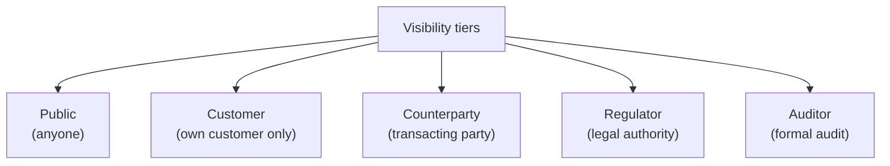
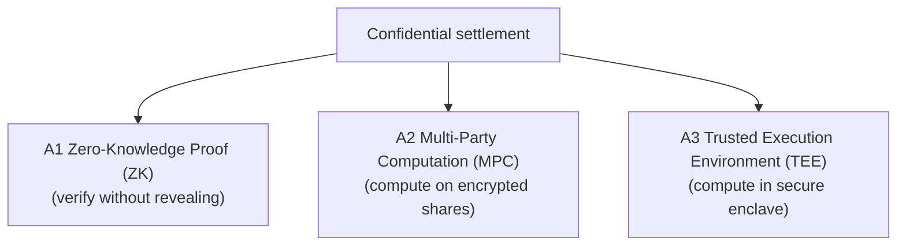
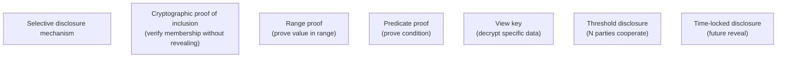
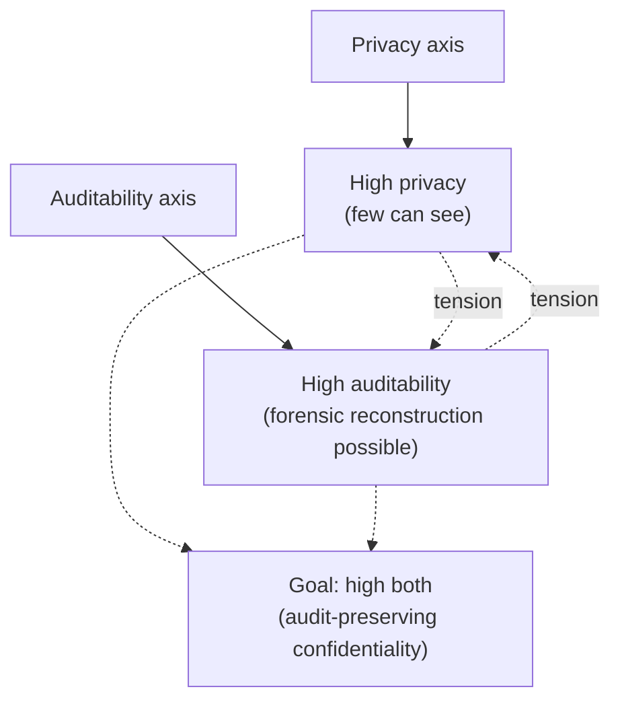
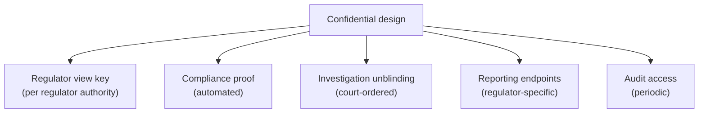
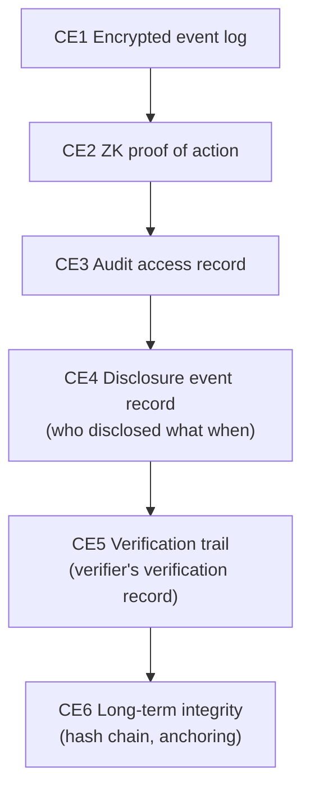
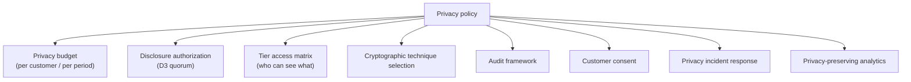

# Custody Wallet — Institutional Privacy / Confidential Settlement Reasoning

> **본 문서의 위치 (Frontier Cluster D31)**: D5 evidence + D15 transparency + D11 compliance 위의 **confidential settlement specialization**. Public transparency 와 institutional privacy 의 balance. "Privacy = secrecy" 가 아닌 **selective visibility coordination**.

> **본 문서가 답하는 핵심 질문**: 왜 privacy 가 opacity 와 다른가? 왜 confidentiality 가 non-auditability 가 아닌가? 왜 hidden state 가 hidden liability 와 다른가? 왜 selective disclosure 가 trust elimination 가 아닌가? 왜 encrypted settlement 가 survivable settlement 보장 아닌가?

---

## 0. 핵심 명제 (10초 이해)

1. **Institutional privacy = selective visibility coordination balancing confidentiality / auditability / survivability** (core thesis).
2. **5-tier "≠" 명제 (D31 cluster invariant)**:
   - Privacy ≠ Opacity
   - Confidentiality ≠ Non-auditability
   - Hidden state ≠ Hidden liability
   - Selective disclosure ≠ Trust elimination
   - Encrypted settlement ≠ Survivable settlement
3. **5 visibility tier** — Public / Customer-visible / Counterparty-visible / Regulator-visible / Auditor-visible.
4. **Confidential settlement 의 3 technical approach** — ZK proofs / MPC / TEE-based.
5. **Selective disclosure mechanism** — controlled, auditable, time-bounded.
6. **Compliance under confidentiality** — regulator visibility 를 confidential design 에 통합.
7. **Trust trade-off** — confidentiality 의 강화 = certain trust 의 trade-off (e.g. crypto primitive integrity).
8. **Audit-preserving confidentiality** — privacy 와 auditability 의 co-existence.
9. **Survivability dimension** — confidential system 의 recovery 의 unique challenge.
10. **Customer 책임 ~85% in privacy** — vendor 의 privacy infrastructure + customer 의 own policy.

---

## 1. Privacy 의 Generalized Definition

### 1.1 5 visibility tier

### 1.2 Tier 별 information access

| Tier | Information |
|---|---|
| Public | Aggregate metric, attestation hash |
| Customer | Own balance, own transaction |
| Counterparty | Transaction with counterparty |
| Regulator | Per legal authority scope |
| Auditor | Per audit engagement scope |

### 1.3 "Privacy ≠ Opacity"

(§0 명제)

- Privacy: selective visibility (some can see, others cannot).
- Opacity: nothing visible.
- 차이:
  - Privacy 는 controlled (rule-based, mechanism-enforced)
  - Opacity 는 absolute hidden (no visibility for anyone)
- → Institutional privacy 는 sophisticated, not blanket hiding.

### 1.4 Privacy 의 5 dimension

| Dimension | 의미 |
|---|---|
| **Identity** | Who is involved |
| **Amount** | How much |
| **Counterparty** | With whom |
| **Timing** | When |
| **Purpose** | Why |

### 1.5 Privacy budget (★ Hypothesis — emerging concept)

- Each interaction 의 privacy "cost".
- Cumulative cost (over time).
- Privacy budget 의 management = strategic + tactical.

---

## 2. Confidential Settlement Architecture

### 2.1 3 technical approach

### 2.2 Approach 별 trade-off

| Approach | Privacy | Auditability | Performance | Trust assumption |
|---|---|---|---|---|
| ZK | Strong | Public proof | Slow (improving) | Cryptographic |
| MPC | Strong (with N) | Multi-party log | Network-bound | Threshold trust |
| TEE | Strong | Vendor-attested | Fast | Hardware vendor trust |

### 2.3 Hybrid approach

(★ Hypothesis — emerging design)

- Multiple approach 의 combination:
  - ZK for proof generation
  - MPC for joint computation
  - TEE for fast execution
- → Each approach 의 strength 활용.

### 2.4 "Encrypted settlement ≠ Survivable settlement"

(§0 명제)

- Encrypted: data 가 encrypted at rest / in transit.
- Survivable: long-term operational viability.
- 차이:
  - Encryption 의 key management (D4 recovery)
  - Cryptographic algorithm 의 future obsolescence (D32 PQ)
  - Operational complexity 증가
- → Encryption 만으로 survivability 보장 안 됨.

### 2.5 Confidential settlement 의 operational complexity

- Standard custody 의 + complexity:
  - Cryptographic infrastructure
  - Key management (more careful)
  - Performance overhead
  - Debug + forensic 어려움
- → Operational cost 의 ↑.

---

## 3. Selective Disclosure

### 3.1 Disclosure 의 controlled mechanism

### 3.2 Selective disclosure 의 use case

| Use case | Mechanism |
|---|---|
| KYC verification (regulator) | Predicate proof |
| Compliance check (sanctions) | Inclusion proof |
| Tax reporting (specific period) | Time-locked |
| Audit | View key |
| Customer balance proof | Range / inclusion |

### 3.3 "Selective disclosure ≠ Trust elimination"

(§0 명제)

- Selective disclosure: chosen audience 에 visibility.
- Trust elimination: no trust required.
- 차이:
  - Disclosure 의 recipient 의 own integrity 의 trust 필요
  - Disclosure 의 cryptographic proof 의 trust 필요 (crypto primitive)
- → Trust 의 reduction, not elimination.

### 3.4 Disclosure governance

- Each disclosure 의 governance:
  - Authorization (D3 quorum)
  - Reason documentation
  - Audit trail (immutable record of disclosure)
- → Disclosure 도 evidence-producing.

### 3.5 Compromise scenarios

- Recipient compromise → leaked data.
- Mechanism compromise → broken proof.
- Authorization compromise → unauthorized disclosure.
- → Multi-layer defense.

---

## 4. Audit-preserving Confidentiality

### 4.1 Audit + privacy 의 tension

### 4.2 "Confidentiality ≠ Non-auditability"

(§0 명제)

- Confidentiality: most parties cannot see.
- Non-auditability: forensic reconstruction impossible.
- 차이:
  - Confidentiality 는 visibility control
  - Audit 는 trusted party 만 가능 (via mechanism)
  - 두 가지 모두 동시에 가능 (audit-preserving)
- → Cryptographic techniques 이 둘 다 deliver 가능.

### 4.3 "Hidden state ≠ Hidden liability"

(§0 명제)

- Hidden state: encrypted data.
- Hidden liability: actual obligation 의 hidden.
- 차이:
  - Encrypted state 도 accountable (with proper audit mechanism)
  - Liability 의 hiding 은 fraud (intentional concealment)
- → Encryption 의 honest use vs adversarial concealment.

### 4.4 Audit mechanism in confidential setting

| Mechanism | 의미 |
|---|---|
| Audit view key | Auditor 만의 decryption key |
| ZK proof of compliance | Compliance proven without revealing data |
| MPC audit | Multi-party verify joint state |
| Selective unblind | Specific period / scope unblinding |
| Threshold audit | M-of-N approval for audit access |

### 4.5 Continuous monitoring under confidentiality

- Real-time anomaly detection 의 challenge under privacy.
- Possible approach:
  - Privacy-preserving ML
  - Aggregate metric monitoring
  - Differential privacy
- → Technique 의 emerging.

---

## 5. Regulator Visibility Design

### 5.1 Regulator-aware confidential design

### 5.2 Lawful intercept design

(★ Hypothesis — regulatory requirement)

- Regulator access via:
  - Pre-arranged view key (under court order)
  - Mechanism-based (e.g. specific public key)
  - Time-windowed access
- 그러나 trust:
  - Regulator 의 own integrity
  - Lawful access 의 boundary
- → Lawful intercept design 의 careful balance.

### 5.3 Privacy 의 regulatory pushback

(★ Hypothesis — regulatory landscape)

- 일부 regulator: strong privacy 의 concern (AML / sanctions enforcement).
- 일부 jurisdiction: privacy 의 fundamental right.
- → Cross-jurisdictional design 의 tension.

### 5.4 Travel rule under confidentiality

(D11 §6 의 confidential extension)

- Counterparty identification 의 confidential transmission.
- 가능한 design:
  - Encrypted payload
  - Mutual decryption (counterparty + own)
  - Audit-preserving structure
- → Confidential travel rule 의 emerging design.

### 5.5 Sanctions screening under confidentiality

- Screening 의 challenge: cannot see entity, but must check against sanctions list.
- 가능한 mechanism:
  - Private set intersection (PSI)
  - ZK proof of non-membership
  - Trusted oracle
- → Active research.

---

## 6. Confidential Evidence Chain

### 6.1 Evidence chain under confidentiality

### 6.2 Append-only encrypted log

- D5 의 append-only invariant + confidentiality.
- Log entry 의 encrypted, decryption via authorized key.
- Hash chain integrity (visible without decryption).
- → Forensic 의 시간 정렬 + 추후 unblinding 가능.

### 6.3 Confidential audit trail

(D5 의 confidential extension)

- Audit trail 의 own confidentiality:
  - Auditor access 만의 decryption
  - Inclusion proof (audit happened)
  - Audit result 의 cryptographic signed
- → 의 mechanism.

### 6.4 Long-term archival

- Encrypted long-term archive.
- Key management 의 long-term challenge (key rotation, escrow).
- Algorithm agility (D32).
- → Confidentiality 의 long-term durability.

### 6.5 Forensic under confidentiality

- Crisis 시 의 forensic:
  - Authorized investigator 의 selective unblinding
  - Cryptographic proof 의 verification
  - Reconstructed event sequence
- → Forensic 의 mechanism-mediated.

---

## 7. Privacy Governance

### 7.1 Privacy policy framework

### 7.2 Customer consent + transparency

- Customer 의 informed consent:
  - What is collected
  - Who sees it (tier)
  - For what purpose
  - How long retained
- → Right to know + control.

### 7.3 Privacy incident

- Breach of confidentiality:
  - Detection (anomaly, leak)
  - Containment
  - Notification (customer, regulator)
  - Forensic + remediation
- → D12 incident framework 의 privacy application.

### 7.4 Differential privacy

(★ Hypothesis — emerging technique)

- Add statistical noise to released data.
- Privacy-preserving aggregate statistics.
- 그러나 individual-level accuracy 의 trade-off.
- → Use case-specific.

### 7.5 Right to erasure under append-only

(D5 §8.4 의 deep)

- GDPR 의 right to erasure vs append-only invariant.
- Mitigation: cryptographic erasure (key destruction).
- Limitation: encrypted log 의 future decryptability (PQ threat).

---

## 8. Operational Implications

### 8.1 Confidential custody 의 operational changes

- Standard custody (D1a) 의 changes:
  - Encryption layer 의 추가
  - Key management 의 enhancement
  - Reduced visibility (operational)
  - Different debug / forensic
- → Complete stack 의 evolution.

### 8.2 Performance impact

| Operation | Standard | Confidential |
|---|---|---|
| Transaction | Fast | Slower (proof generation, encryption) |
| Audit | Direct | Mechanism-mediated |
| Search | Direct | Limited (cryptographic search) |
| Backup | Direct | + key backup |
| Recovery | D4 | + cryptographic considerations |

### 8.3 Skilled talent requirement

- Cryptographic expertise.
- Privacy engineering.
- Privacy law / regulation.
- → Specialized team.

### 8.4 Tooling ecosystem

- Confidential tooling 의 limited (compared to mainstream).
- Cost + maturity 의 consideration.
- → Vendor / open-source ecosystem 의 evaluation.

### 8.5 Crypto-agility (D32 의 미리보기)

- Confidential 의 algorithm 의 future migration.
- Long-term durability.

---

## 9. Operational Fragility Map

```mermaid
graph TB
    F1["F1. Crypto primitive break<br/>(ZK / MPC / TEE 의 vulnerability)"]
    F2["F2. Key management failure"]
    F3["F3. Privacy budget exhaustion<br/>(cumulative leakage)"]
    F4["F4. Lawful access controversy"]
    F5["F5. Audit access compromise<br/>(auditor의 compromise)"]
    F6["F6. Performance degradation<br/>(scale limit)"]
    F7["F7. Confidential debug 어려움"]
    F8["F8. Cross-jurisdictional privacy conflict"]
    F9["F9. Algorithm obsolescence<br/>(future PQ threat)"]
    F10["F10. Skill gap<br/>(privacy engineering 인재)"]

    F1 -->|mitigation| M1["Multi-algorithm diversity + agility + monitoring"]
    F2 -->|mitigation| M2["D4 enhanced + multi-party + escrow"]
    F3 -->|mitigation| M3["Differential privacy + budget management"]
    F4 -->|mitigation| M4["Lawful intercept design + legal counsel"]
    F5 -->|mitigation| M5["Auditor due diligence + multiple auditor"]
    F6 -->|mitigation| M6["Optimization + selective application + tier"]
    F7 -->|mitigation| M7["Specialized tooling + privacy-aware monitoring"]
    F8 -->|mitigation| M8["Per-jurisdiction privacy design + legal counsel"]
    F9 -->|mitigation| M9["Crypto-agility + PQ readiness (D32)"]
    F10 -->|mitigation| M10["Recruitment + training + consulting"]
```

---

## 10. Limitations

### 10.1 Privacy ≠ Opacity

§1.3.

### 10.2 Confidentiality ≠ Non-auditability

§4.2.

### 10.3 Hidden state ≠ Hidden liability

§4.3.

### 10.4 Selective disclosure ≠ Trust elimination

§3.3.

### 10.5 Encrypted ≠ Survivable

§2.4.

### 10.6 Confidential 의 emerging maturity

- Production-grade confidential settlement 의 limited deployment.
- Long-term operational experience 미축적.

### 10.7 Privacy 의 social trade-off

- Strong privacy = AML/criminal enforcement 의 challenge.
- Social acceptable balance 의 정의.

---

## 11. 3-way Frontier Burden (D31)

### 11.1 Plane × Ownership

| 영역 | SaaS | Federated | Sovereign |
|---|---|---|---|
| Confidential infrastructure | Vendor + customer | Customer | Customer |
| Privacy policy | Customer | Customer | Customer |
| Customer consent | Customer | Customer | Customer |
| Regulator interface | Customer | Customer | Customer |
| Crypto agility | Vendor + customer | Customer | Customer |
| Skill / talent | Customer | Customer | Customer |

### 11.2 Customer privacy burden (★ Hypothesis)

- SaaS: ~75%
- Federated: ~90%
- Sovereign: ~100%

### 11.3 Recommendation

| Context | 권장 |
|---|---|
| Standard | Standard custody + opt-in privacy (limited scope) |
| Privacy-conscious customer | Confidential settlement integration |
| Regulated privacy | Audit-preserving design + lawful intercept |
| Frontier | Cutting-edge mechanism + active research engagement |

---

## 12. Q1-Q10 Reasoning

### Q1. Privacy ≠ Opacity

§1.3.

### Q2. Confidentiality ≠ Non-auditability

§4.2.

### Q3. Hidden state ≠ Hidden liability

§4.3.

### Q4. Selective disclosure ≠ Trust elimination

§3.3.

### Q5. Encrypted ≠ Survivable

§2.4.

### Q6. 3 approach (ZK/MPC/TEE)

§2.

### Q7. Audit-preserving design

§4.

### Q8. Lawful intercept

§5.2.

### Q9. Confidential evidence chain

§6.

### Q10. Privacy governance

§7.

---

## 13. Open Questions

| 영역 | 질문 |
|---|---|
| Privacy approach | ZK / MPC / TEE / hybrid? |
| Tier access matrix | per data type |
| Customer consent UX | format? |
| Lawful intercept design | per jurisdiction |
| Audit access mechanism | per audit type |
| Privacy budget | per customer? aggregate? |
| Differential privacy | apply? scope? |
| Right to erasure | implementation |
| Skill / talent acquisition | strategy |
| Vendor selection | confidential capability |
| Tooling investment | scope |
| Long-term durability | algorithm agility |
| Regulatory engagement | proactive? |
| Customer education | privacy awareness |
| Privacy incident response | playbook |
| Privacy SLA | per tier |
| Crypto-agility | strategy |
| Insurance | scope |
| Cross-jurisdiction privacy | strategy |
| Open vs closed source | privacy code |

---

## 14. References + Uncertainty Boundary + Bridge

### 관련 wiki

| 참조 |
|---|
| [[docs/architecture/audit-event-sourcing-evidence-chain]] (D5) |
| [[docs/architecture/transparency-attestation-proof-systems]] (D15) |
| [[docs/architecture/compliance-aml-sanctions-boundary]] (D11) |
| [[docs/architecture/identity-kyt-counterparty-graph]] (D16) |

### Uncertainty Boundary

- 본 문서는 **emerging** — confidential custody 의 production deployment 의 early stage.
- 5 tier / 3 approach / 6 disclosure mechanism / 8 privacy policy / 10 fragility / 75% burden = **generalized confidential architecture pattern (Hypothesis ★)**.
- §2.1 / §3.1 emerging cryptographic techniques 의 active research.
- §11.2 burden 백분율 = estimate.
- §13 에 frontier policy 영역 명시.

### D32 Bridge Invariants (D27 + D28 + D29 + D30 + D31 → D32)

1. **Cryptographic dependency** — D31 의 encryption + ZK + MPC 모두 의 future cryptographic 의 dependency → D32.
2. **Long-term durability** — D31 의 confidential 의 multi-decade integrity → D32.
3. **Algorithm agility** — D31 의 multi-approach 가 D32 의 migration framework.
4. **Trust primitive continuity** — D31 의 trust assumption 의 D32 의 PQ threat 아래 evolution.
5. **Survivability under transition** — D31 의 confidential settlement 의 cryptographic transition 의 institutional continuity.

### Cluster progression

- D27: sovereign digital money
- D28: intent-based settlement
- D29: autonomous treasury
- D30: AI-assisted governance
- D31 (this): confidential settlement
- D32 (next, closing): post-quantum survivability

---

**Stage 32 D31 completion timestamp**: 2026-05-20.
