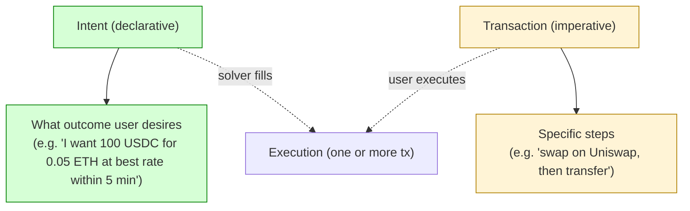
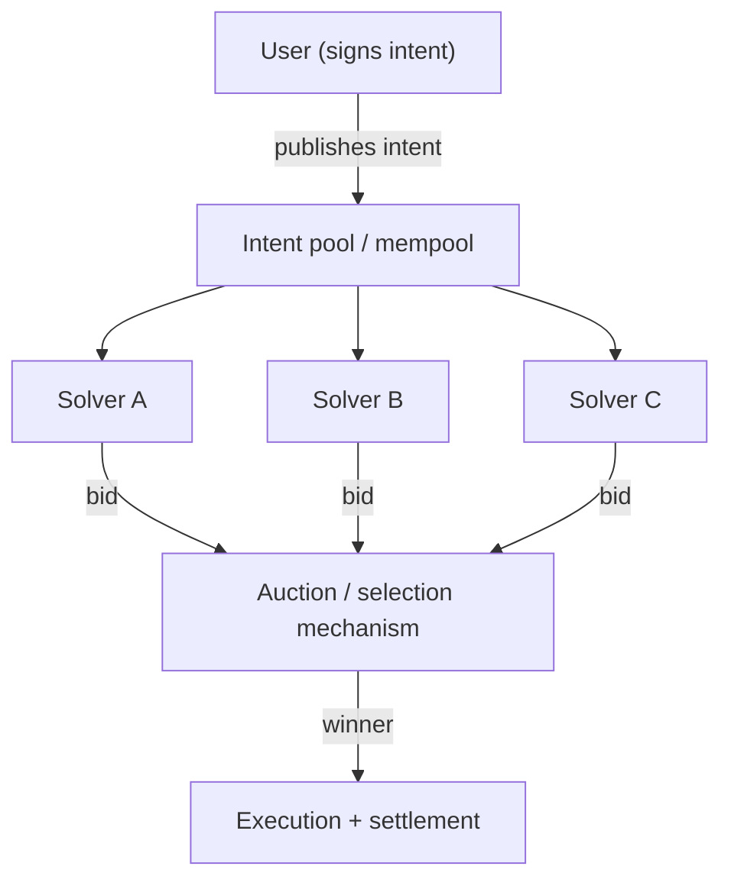
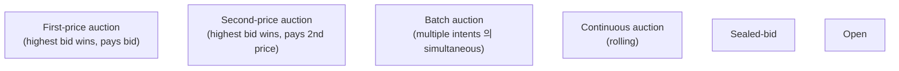
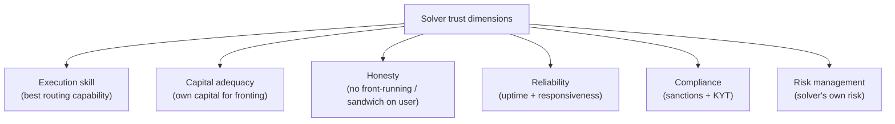
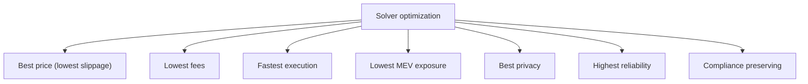
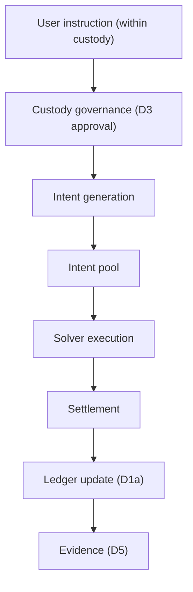

# Custody Wallet — Intent-based Settlement / Solver Networks Reasoning

> **본 문서의 위치 (Frontier Cluster D28)**: D8 withdrawal + D20 cross-institution + D27 sovereign + Liquidity cluster 위의 **delegated execution market specialization**. User intent + solver competition + settlement routing 의 generalized architecture.

> **본 문서가 답하는 핵심 질문**: 왜 intent 가 guaranteed settlement 가 아닌가? 왜 solver optimization 이 user sovereignty 와 다른가? 왜 delegated execution 이 delegated risk 와 다른가? 왜 routing efficiency 가 settlement certainty 보장 아닌가? 왜 intent abstraction 이 coordination elimination 가 아닌가?

---

## 0. 핵심 명제 (10초 이해)

1. **Intent-based system = delegated coordination market for settlement execution** (core thesis).
2. **5-tier "≠" 명제 (D28 cluster invariant)**:
   - Intent ≠ Guaranteed settlement
   - Solver optimization ≠ User sovereignty
   - Delegated execution ≠ Delegated risk
   - Routing efficiency ≠ Settlement certainty
   - Intent abstraction ≠ Coordination elimination
3. **Intent = declarative outcome desired by user** (vs transaction = imperative steps).
4. **Solver = competitive third-party** that fulfills intent for fee.
5. **3-layer intent architecture** — Intent expression / Solver auction / Execution + settlement.
6. **Coordination outsourcing** — user 가 specific execution path 결정 안 함.
7. **Solver trust boundary** — solver 의 own infrastructure + counterparty + execution skill 에 trust.
8. **Auction mechanism** — first-price / second-price / batch / continuous.
9. **MEV (Maximum Extractable Value)** = solver 의 own profit opportunity + user 의 cost.
10. **Intent-based 의 custody implication** — D8 withdrawal flow 의 abstraction layer.

---

## 1. Intent 의 Generalized Definition

### 1.1 Intent vs Transaction

### 1.2 Intent 의 expression

| Component | 의미 |
|---|---|
| **Outcome** | Desired end state |
| **Constraint** | Acceptable bounds (price, time, slippage) |
| **Authorization** | User signature + permission |
| **Validity period** | Time window |
| **Refund condition** | If unfulfilled |

### 1.3 Solver 의 role

- Solver = third-party that finds path + executes for user.
- Compensation = fee (success-based, often).
- Competition = multiple solver 의 better offer.
- → Market-driven optimization.

### 1.4 "Intent abstraction ≠ Coordination elimination"

(§0 명제)

- Intent abstraction: user 가 specific steps 모름.
- Coordination elimination: coordination 자체 가 사라짐.
- 차이:
  - Abstraction 는 user 의 view; coordination 은 solver 측에서 still 필요
  - 오히려 더 복잡한 coordination (multiple paths, solvers, settlements)
- → User 의 simplicity = solver 의 complexity transfer.

### 1.5 Why intent-based emerging

(★ Hypothesis — emerging pattern)

- Multi-chain / multi-protocol 의 complexity → user 가 navigate 어려움.
- Best execution 의 expertise 필요.
- Wallet UX 개선의 demand.
- → Intent 는 UX + competition + specialization 의 결합.

---

## 2. Solver Network Architecture

### 2.1 Solver network topology

### 2.2 Solver 의 capabilities

| Capability | 의미 |
|---|---|
| Multi-venue routing | DEX / CEX / OTC 등 routing |
| Multi-chain execution | Cross-chain coordination |
| MEV management | Sandwich / front-running 회피 또는 capture |
| Capital provision | Solver 의 own capital 사용 (private order flow) |
| Compliance | Solver 의 own KYC / sanctions check |
| Execution skill | Optimal timing / sizing |

### 2.3 Auction mechanism

### 2.4 Solver 의 economic incentive

- Profit = settlement output - cost (capital + gas + risk).
- Loss possibility: bad routing, MEV exposure, capital lock.
- → Solver 의 own risk management.

### 2.5 Network value 의 source

(★ Hypothesis — emerging pattern)

- Multi-solver competition → price improvement for user.
- Specialization → execution skill 의 division of labor.
- 그러나 sufficient solver participation 필수 (network effect).

---

## 3. Intent Settlement Lifecycle

```mermaid
graph TB
    IS1["IS1 Intent signed by user"]
    IS2["IS2 Intent published to pool"]
    IS3["IS3 Solver discovery + analysis"]
    IS4["IS4 Auction (if multi-solver)"]
    IS5["IS5 Solver selection"]
    IS6["IS6 Execution<br/>(solver's chosen path)"]
    IS7["IS7 Settlement verification<br/>(intent constraints honored?)"]
    IS8["IS8 User receives outcome"]
    IS9["IS9 Solver receives fee"]
    IS10["IS10 Evidence preservation"]
```

### 3.1 Each phase 의 critical aspects

| Phase | Critical aspect |
|---|---|
| IS1 Signing | Intent integrity, signature validity |
| IS2 Pool | Privacy of intent (front-running risk) |
| IS3 Discovery | Solver의 own observability |
| IS4 Auction | Auction fairness + manipulation resistance |
| IS5 Selection | Selection criteria transparency |
| IS6 Execution | Solver 의 actual ability |
| IS7 Verification | Intent constraint check before paying solver |
| IS8 Outcome | User 의 receipt + confirmation |
| IS9 Fee | Solver 의 compensation |
| IS10 Evidence | Forensic + audit trail |

### 3.2 "Intent ≠ Guaranteed settlement"

(§0 명제)

- Intent: user 의 desired outcome.
- Settlement: actual execution + finality.
- 차이:
  - Intent 가 unfulfilled 가능 (no solver, expired, constraint not met)
  - Solver 의 partial execution
  - Solver 의 default
- → Intent 는 request, settlement 는 outcome.

### 3.3 Intent verification

- Intent constraint:
  - Price ≤ X (acceptable price)
  - Time ≤ Y (deadline)
  - Slippage ≤ Z%
  - Recipient = specific address
- Verification = on-chain or off-chain check.
- Verification failure = solver pays 안 받음 또는 intent expired.

### 3.4 Refund / fallback mechanism

- Intent unfulfilled 시:
  - User 의 fund return
  - Or fallback path (default solver, default route)
  - Or expiry 후 자동 cancel
- → Refund certainty 가 trust 의 핵심.

### 3.5 Multi-leg intent

- Single intent 가 multi-step execution 가능:
  - Bridge + swap + deposit
  - 모든 leg 의 atomic vs sequential trade-off
- Solver 의 multi-leg coordination complexity.

---

## 4. Solver Trust Boundary

### 4.1 Solver trust 의 dimension

### 4.2 "Delegated execution ≠ Delegated risk"

(§0 명제)

- Delegated execution: solver 가 execute 함.
- Delegated risk: risk 의 transfer to solver.
- 차이:
  - User 의 risk: settlement failure, partial fulfillment, slippage
  - Solver 의 risk: execution loss, MEV exposure, capital lock
  - Risk transfer 는 protocol design 에 의존 — automatic delegation 안 됨
- → User 의 risk 는 still 존재 (solver 의 risk 와 별개).

### 4.3 MEV (Maximum Extractable Value)

- MEV = block 안의 tx ordering / inclusion / front-running 으로 extractable value.
- Solver 의 MEV:
  - Capture: solver 가 user 의 favorable ordering 으로 extract
  - Avoid: solver 가 user 보호 (private mempool)
  - Share: solver 의 일부 MEV return to user
- → Solver 의 MEV stance 가 user 의 outcome 결정.

### 4.4 Solver competition 의 limits

- 이론: more solver = better price.
- 현실:
  - Top solver 가 specialization 으로 dominate
  - Long-tail solver 의 limited capability
  - Solver 의 collusion possibility
- → Competition effectiveness 의 monitoring.

### 4.5 "Solver optimization ≠ User sovereignty"

(§0 명제)

- Solver 의 optimization: solver 의 own profit maximization.
- User sovereignty: user 의 own decision authority.
- 차이:
  - Solver 가 optimize 한 path = solver 의 own metrics
  - User 의 implicit decisions (path, venue, timing) 의 solver 위임
  - User 가 control 잃은 영역
- → Intent 의 trade-off (convenience for sovereignty).

---

## 5. Settlement Path Optimization

### 5.1 Optimization dimensions

### 5.2 Multi-objective optimization

- Solver 가 single dimension 만 optimize 못함.
- User 의 intent 의 constraints + solver 의 own incentive 결합.
- → Pareto frontier 의 navigation.

### 5.3 "Routing efficiency ≠ Settlement certainty"

(§0 명제)

- Routing efficiency: optimal path selection.
- Settlement certainty: actual completion.
- 차이:
  - Efficient route 의 mid-execution failure (chain congestion, slippage)
  - Inefficient but reliable route 의 success
- → Efficiency 와 reliability 의 trade-off.

### 5.4 Pre-trade vs post-trade visibility

- Pre-trade: user 가 intent 의 submitted price (acceptable range)
- Post-trade: actual price (within range or refunded)
- → Pre/post 의 transparency 가 trust 의 mechanism.

### 5.5 Solver 의 information asymmetry

- Solver 가 market 정보 (orderbook, mempool, DEX state) 의 더 많은 visibility.
- User 의 visibility 의 limitation.
- → Information asymmetry 의 solver advantage.

---

## 6. Intent Pool 의 Public vs Private

### 6.1 Intent visibility model

| Model | 의미 |
|---|---|
| **Public mempool** | All solvers can see |
| **Private mempool** | Only specific solver (or set) |
| **Threshold encryption** | Decrypted after winner |
| **Commit-reveal** | Hash first, reveal later |

### 6.2 Public mempool 의 front-running risk

- Public intent → other actors (not just solvers) 가 front-run 가능.
- 특히 large intent 의 case.
- → Public mempool 의 user cost.

### 6.3 Private mempool 의 trust trade-off

- Private = specific solver only.
- Trust:
  - Solver 가 intent 을 own profit 위해 사용 안 한다는 trust
  - 또는 solver 가 user 와 align (cryptographic commitment)
- → Private 은 front-running 방지 but solver-trust 의 증가.

### 6.4 Batch auction 의 protection

(★ Hypothesis — emerging design, e.g. CoW Swap)

- 다수의 intent 의 simultaneous matching.
- Single price for batch (uniform).
- Solver 는 batch 의 net 만 보고 solving.
- → Front-running mitigation.

### 6.5 Custody 의 intent integration

- Custody system 이 user 의 intent 의 supports:
  - Intent signing (D2)
  - Intent submission (to pool)
  - Result verification
  - Settlement integration (D8 withdrawal flow)
- → Custody 의 new operation type.

---

## 7. Custody Implications

### 7.1 Intent-based custody flow

### 7.2 Governance over intent

- Intent 는 D8 withdrawal 의 일종 — same governance:
  - Policy evaluation
  - Approval workflow
  - Authority check
- Intent-specific governance:
  - Acceptable solver set
  - Maximum slippage tolerance
  - Counterparty restriction

### 7.3 Solver whitelist (compliance + risk)

- Custody system 의 own approved solver list:
  - KYB 통과한 solver
  - Track record 있는 solver
  - Compliance-friendly (sanctions screening)
- → Solver trust 의 institutional vetting.

### 7.4 Intent evidence chain

- Intent signing event
- Submission to pool
- Auction result
- Selected solver
- Execution detail
- Settlement outcome
- → D5 evidence 의 intent extension.

### 7.5 D11 compliance under intent

- Intent 의 compliance:
  - Recipient screening
  - Asset compliance
  - Solver compliance (whitelist)
- Cross-jurisdiction intent 의 complexity.

---

## 8. Operational Fragility Map

```mermaid
graph TB
    F1["F1. Intent front-running (public mempool)"]
    F2["F2. Solver collusion<br/>(price manipulation)"]
    F3["F3. Intent unfulfilled<br/>(no qualified solver)"]
    F4["F4. Solver default<br/>(mid-execution failure)"]
    F5["F5. MEV extraction<br/>(user disadvantage)"]
    F6["F6. Cross-chain coordination failure"]
    F7["F7. Intent expression ambiguity<br/>(constraint interpretation)"]
    F8["F8. Solver compliance failure"]
    F9["F9. Refund mechanism failure"]
    F10["F10. Intent network effect collapse<br/>(insufficient solver participation)"]

    F1 -->|mitigation| M1["Private mempool / batch auction / threshold encryption"]
    F2 -->|mitigation| M2["Solver diversity + monitoring + auction design"]
    F3 -->|mitigation| M3["Fallback solver + permissive constraints + expiry"]
    F4 -->|mitigation| M4["Solver capital adequacy + bond/staking"]
    F5 -->|mitigation| M5["MEV-protected design + transparent fee"]
    F6 -->|mitigation| M6["Atomic execution + escrow + bridge attestation"]
    F7 -->|mitigation| M7["Strict intent schema + validation"]
    F8 -->|mitigation| M8["Solver whitelist + KYB + monitoring"]
    F9 -->|mitigation| M9["On-chain escrow + automatic refund + dispute mechanism"]
    F10 -->|mitigation| M10["Bootstrap incentive + multi-protocol"]
```

### 8.1 분류

| 분류 | items | 성격 |
|---|---|---|
| **Adversarial** | F1, F2, F5 | game-theoretic |
| **Operational** | F3, F4, F6 | reliability |
| **Compliance** | F8, F9 | regulatory |
| **Design** | F7 | engineering |
| **Network** | F10 | emergent |

---

## 9. Limitations

### 9.1 Intent ≠ Guaranteed settlement

§3.2.

### 9.2 Solver optimization ≠ User sovereignty

§4.5.

### 9.3 Delegated execution ≠ Delegated risk

§4.2.

### 9.4 Routing efficiency ≠ Settlement certainty

§5.3.

### 9.5 Intent abstraction ≠ Coordination elimination

§1.4.

### 9.6 Intent network 의 emerging nature

- Production-scale solver network 의 initial stage.
- 실제 behavior 의 long-term 미관찰.

### 9.7 Regulatory uncertainty

- Solver 의 legal status (broker? market maker?).
- Multi-jurisdictional regulatory.

---

## 10. 3-way Frontier Burden (D28)

### 10.1 Plane × Ownership

| 영역 | SaaS | Federated | Sovereign |
|---|---|---|---|
| Intent signing infrastructure | Vendor + customer | Customer | Customer |
| Solver discovery | Vendor + customer | Customer | Customer |
| Solver whitelist | Customer | Customer | Customer |
| Intent verification | Vendor partial | Customer | Customer |
| Compliance integration | Customer | Customer | Customer |
| Solver due diligence | Customer | Customer | Customer |

### 10.2 Customer intent burden (★ Hypothesis)

- SaaS: ~70%
- Federated: ~85%
- Sovereign: ~100%

### 10.3 Recommendation

| Context | 권장 |
|---|---|
| Light intent use | Vendor 의 standard integration |
| Heavy intent use | Customer 의 solver whitelist + own auction integration |
| Cross-chain intent | Specialized infrastructure + dedicated team |

---

## 11. Q1-Q10 Reasoning

### Q1. Intent ≠ Guaranteed

§3.2.

### Q2. Solver opt ≠ User sovereignty

§4.5.

### Q3. Delegated exec ≠ Delegated risk

§4.2.

### Q4. Routing ≠ Certainty

§5.3.

### Q5. Abstraction ≠ Coordination elimination

§1.4.

### Q6. Intent vs transaction

§1.1.

### Q7. Solver competition limits

§4.4.

### Q8. MEV management

§4.3.

### Q9. Private vs public mempool

§6.

### Q10. Custody integration

§7.

---

## 12. Open Questions

| 영역 | 질문 |
|---|---|
| Solver whitelist policy | scope? |
| Slippage default | constraint? |
| Front-running protection | which mechanism? |
| MEV stance | capture / share / avoid? |
| Auction mechanism | first-price / second-price / batch? |
| Solver compliance | KYB requirement? |
| Cross-chain intent | scope? |
| Settlement verification | on-chain? off-chain? |
| Refund SLA | timeout? |
| Solver bond | required? amount? |
| Customer education | intent risks? |
| Audit firm engagement | solver verification? |
| Regulator classification | solver as broker? |
| Privacy of intent | public / private? |
| Multi-leg intent | scope? |
| Solver diversity target | minimum? |
| Default solver | for fallback? |
| Intent versioning | schema evolution? |
| Intent expiry default | duration? |
| Failure compensation | for unfulfilled? |

---

## 13. References + Uncertainty Boundary + Bridge

### 관련 wiki

| 참조 |
|---|
| [[docs/architecture/withdrawal-lifecycle]] (D8) — intent 는 D8 의 abstraction |
| [[docs/architecture/cross-institution-liquidity-coordination]] (D20) — coordination |
| [[docs/architecture/multi-chain-adapter-pattern]] (D9) — cross-chain |
| [[docs/architecture/cbdc-sovereign-digital-money]] (D27) — sovereign coordination |
| [[docs/architecture/compliance-aml-sanctions-boundary]] (D11) |

### Uncertainty Boundary

- 본 문서는 **emerging** — production intent system 의 early stage.
- 3-layer intent / 4 auction mechanism / 6 solver trust dimension / 10 fragility / 70% burden = **generalized intent architecture pattern (Hypothesis ★)**.
- §4.5 MEV / §6.4 batch auction = active research area.
- §10.2 burden 백분율 = estimate.
- §12 에 frontier policy 영역 명시.

### D29 Bridge Invariants (D27 + D28 → D29)

1. **Delegated coordination** — D28 의 solver delegation 이 D29 의 autonomous treasury 의 base.
2. **Policy execution automation** — D27 의 programmable money + D28 의 solver = D29 의 automated treasury.
3. **Outcome-based authorization** — D28 의 intent 의 outcome-based authorization 이 D29 의 treasury policy.
4. **Coordination market** — D28 의 market-driven solver 가 D29 의 autonomous agent dynamics.
5. **Accountability boundary** — D28 의 solver accountability 가 D29 의 autonomous treasury accountability.

### Cluster D27→D28→D29→D30→D31→D32 progression

- D27: sovereign digital money
- D28 (this): intent-based settlement + solver networks
- D29 (next): autonomous treasury governance
- D30: AI-assisted operational governance
- D31: confidential settlement
- D32: post-quantum survivability

---

**Stage 32 D28 completion timestamp**: 2026-05-20.
