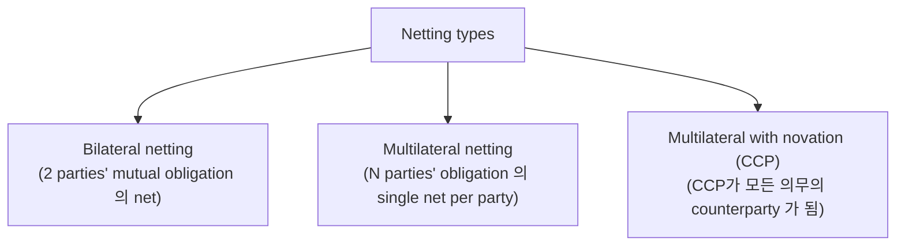
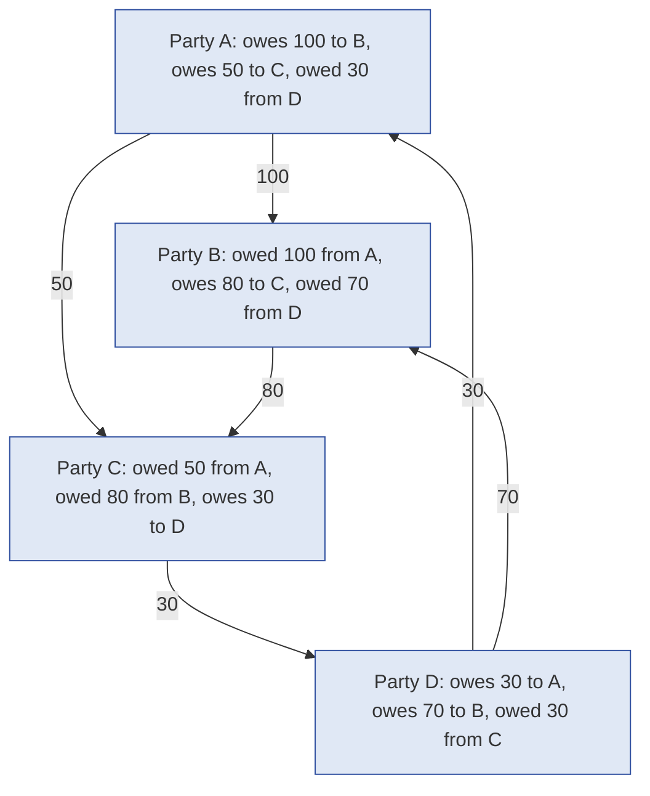
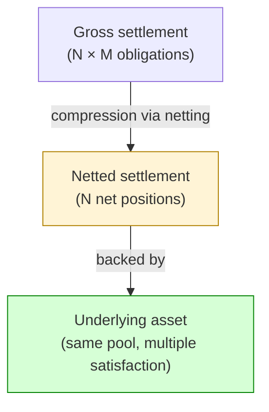
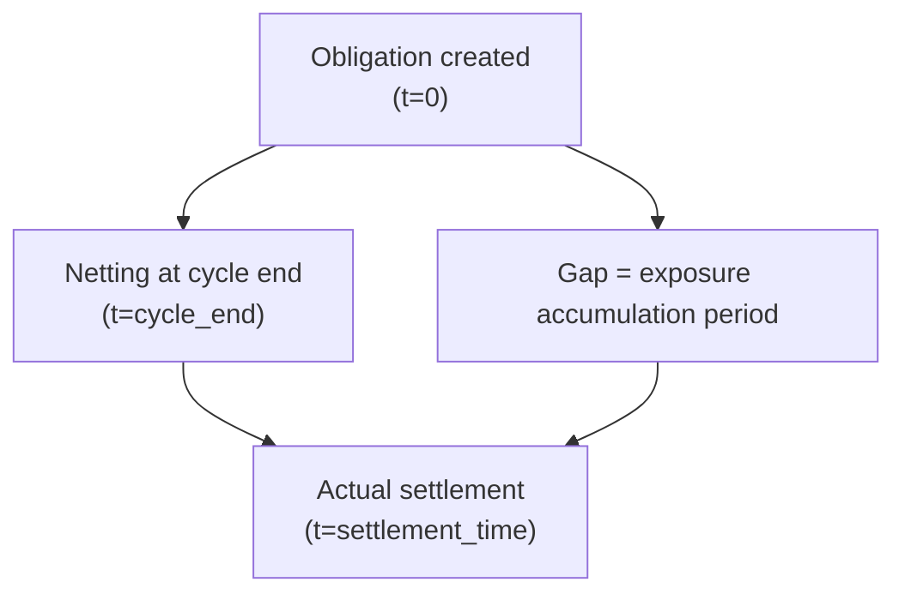
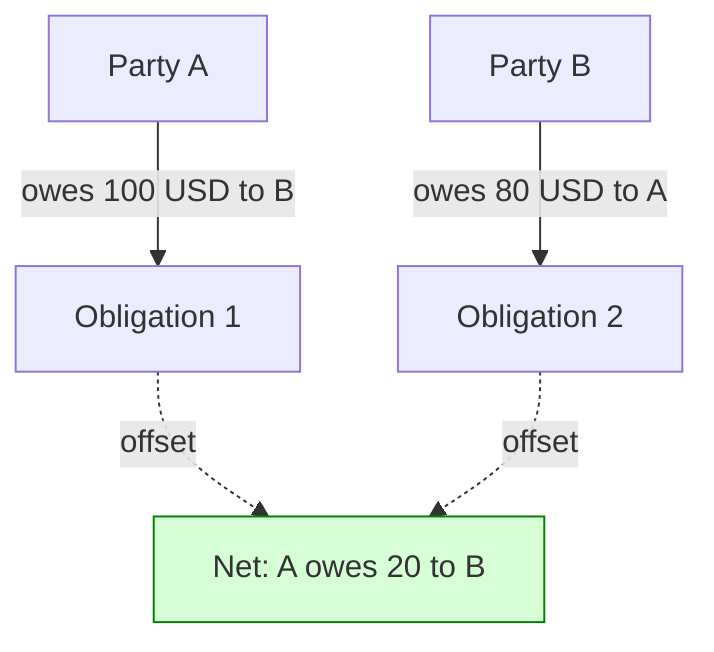
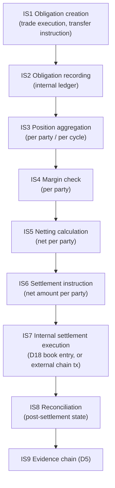
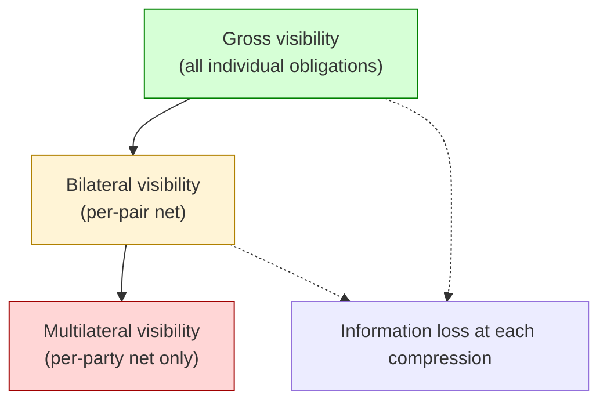
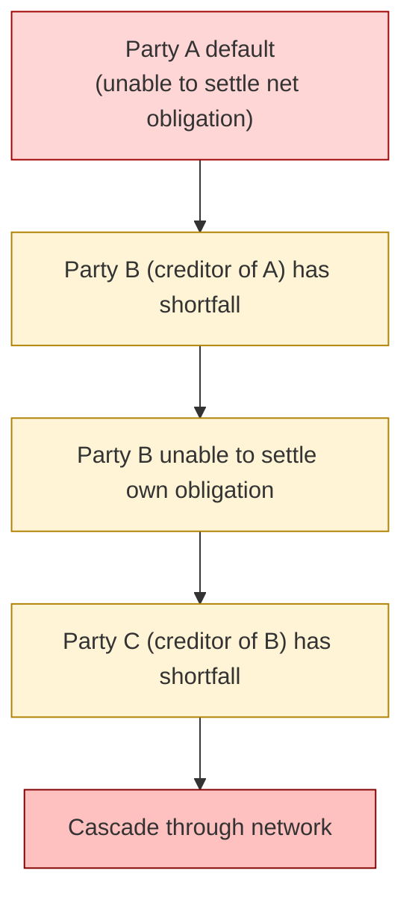

# Custody Wallet — Internal Netting / Internal Settlement Reasoning

> **본 문서의 위치 (Liquidity Cluster D19)**: D18 의 internalized settlement 의 multi-party 확장. D17 treasury optimization 의 efficiency mechanism. Netting = liquidity compression, not accounting simplification — deferred external settlement 의 risk 도 함께 incur.

> **본 문서가 답하는 핵심 질문**: 왜 internal netting 이 accounting simplification 가 아닌가? 왜 net exposure 가 eliminated exposure 가 아닌가? 왜 deferred settlement 가 reduced risk 가 아닌가? 왜 liquidity reuse 가 liquidity creation 가 아닌가? 왜 netting efficiency 가 crisis survivability 와 다른가?

---

## 0. 핵심 명제 (10초 이해)

1. **Internal netting = liquidity compression through deferred external settlement dependency** (core thesis).
2. **5-tier "≠" 명제 (D19 cluster invariant)**:
   - Net exposure ≠ Eliminated exposure
   - Internal settlement ≠ Final settlement
   - Deferred settlement ≠ Reduced risk
   - Liquidity reuse ≠ Liquidity creation
   - Netting efficiency ≠ Crisis survivability
3. **Netting 의 3 type** — Bilateral / Multilateral / Multilateral with novation (CCP).
4. **Liquidity compression = same underlying 가 multiple settlement obligation 을 동시 cover** — 수치적 efficiency.
5. **Compression 의 cost = deferred settlement risk** — settlement 가 deferred = exposure 가 누적 + 단번에 settle 필요.
6. **Settlement minimization = chain TPS 의 amplification** — 같은 throughput 으로 더 많은 economic activity.
7. **Netting deadlock = participants 간 mutual dependency 의 circular 미해소**.
8. **Compressed visibility** — netted position 만 보임, gross exposure 안 보임.
9. **Contagion propagation** — netted 환경에서 single default 의 multi-party cascade.
10. **Netting SaaS customer burden ~85%** — vendor 가 netting engine 일부; nearly all governance + crisis management 는 customer.

---

## 1. Netting Type

### 1.1 3 type netting



### 1.2 각 type 의 efficiency

| Type | Settlement count | Counterparty risk |
|---|---|---|
| Gross (no netting) | N × M (N parties, M obligations each) | Bilateral (per obligation) |
| Bilateral netting | N obligations (one net per pair) | Bilateral |
| Multilateral netting | One net per party | Bilateral (still) |
| Multilateral with novation | One settlement to CCP per party | CCP-centric (all to CCP) |

### 1.3 Example efficiency (★ Hypothesis — financial industry pattern)

```
Scenario: 4 parties (A, B, C, D), each trades with each
Gross settlements: 4 × 3 = 12 obligations
Bilateral netting: 6 bilateral nets (one per pair)
Multilateral netting: 4 net positions (one per party)
With novation: 4 settlements (each to CCP)
```

→ Efficiency 의 quadratic improvement.

### 1.4 Netting 의 chain settlement implication

- Pre-netting: N tx on chain.
- Post-netting: ~1 tx per party on chain.
- → Chain throughput 의 amplification (efficient use).

### 1.5 Multilateral vs bilateral 의 risk shift

- Bilateral: bilateral counterparty risk (specific counterparty).
- Multilateral: 모든 party 가 mutual dependent (one default → many affected).
- Multilateral with novation: CCP 가 mutualized risk holder.
- → Risk 의 distribution + concentration 의 design choice.

---

## 2. Internal Settlement Graph



### 2.1 Netted positions calculation

```
A: -100 (to B) -50 (to C) +30 (from D) = -120 net (owes 120)
B: +100 (from A) -80 (to C) +70 (from D) = +90 net (owed 90)
C: +50 (from A) +80 (from B) -30 (to D) = +100 net (owed 100)
D: -30 (to A) -70 (to B) +30 (from C) = -70 net (owes 70)
```

→ 4 net positions instead of 6 gross obligations.

### 2.2 Settlement after netting

- A pays 120 (to B + C + D's collective).
- D pays 70 (to B + C's collective).
- B receives 90, C receives 100.
- Total flow: 190 instead of gross sum 360.

### 2.3 Settlement timing coordination

(★ 핵심 — D20 bridge)

- Netting 의 settlement = synchronized:
  - 모든 party 가 동시에 settle 해야 (otherwise mismatch)
  - Window 안에 모든 party 의 movement
  - → Coordinated timing 의 의무

### 2.4 Internal vs external settlement boundary

- Internal: same operator 안의 multi-customer (D18 §4).
- External: cross-operator + CCP 또는 multi-institution.
- → Boundary 가 netting 의 scope 결정.

---

## 3. Liquidity Compression

### 3.1 Compression mechanism



### 3.2 "Liquidity reuse ≠ Liquidity creation"

(§0 명제)

- Compression 의 의미: 같은 underlying 이 multiple obligation 을 satisfy.
- Reuse: 같은 unit 의 multiple use within settlement cycle.
- 그러나 NOT creation:
  - Underlying 의 actual amount 는 동일
  - Compression 은 settlement count 의 감소, asset 의 multiplication 아님
- → 시점 별 obligation 의 sequential satisfaction.

### 3.3 Multiplier effect (★ Hypothesis — financial reasoning)

- Daily gross flow / total reserve = multiplier.
- 예: $1B reserve 가 $10B daily settlement support = 10x multiplier.
- Multiplier 가 클수록 capital efficiency ↑.

### 3.4 Compression 의 limit

- Multiplier 의 ceiling = peak intraday demand (D17 §5).
- Peak 시점 의 actual deployment 가 필요 — gross settlement.
- → Compression 의 efficiency 는 demand smoothing 에 의존.

### 3.5 Compression risk

- 시간 의 다른 부분에서 same underlying 의 reuse.
- If timing mis-coordinated → over-commitment → default.
- → Settlement timing 의 precise coordination 필요.

---

## 4. Deferred Settlement

### 4.1 Deferred settlement 의 dynamics



### 4.2 "Deferred settlement ≠ Reduced risk"

(§0 명제)

- Deferred = settlement timing 이 later.
- Reduced risk = exposure 의 actual 감소.
- 차이:
  - Settlement 가 deferred = exposure 가 누적 (each party 의 unsettled position 이 increase)
  - Risk 의 timing 만 shift, magnitude 감소 아님
  - 다음 settlement window 까지 default risk 증가
- → Deferral = trade-off (efficiency vs risk accumulation).

### 4.3 Settlement cycle 의 design

(★ Hypothesis — financial industry pattern)

| Cycle | 의미 |
|---|---|
| Real-time (RTGS-like) | 즉시 settle, no deferral |
| Hourly | 1시간 batch |
| End-of-day | 1 day batch |
| End-of-week | 1 week batch |
| Continuous batch | Rolling window |

→ Cycle length × exposure risk 의 trade-off.

### 4.4 Margin posting (deferred settlement 의 mitigation)

- Each party 가 net position 의 collateral posting (margin).
- Default risk 의 reduction (margin 의 absorb).
- Margin requirements 의 dynamic update.

### 4.5 Variation margin vs initial margin

| Type | 의미 |
|---|---|
| Initial margin | Position open 시 posted collateral |
| Variation margin | Position 의 mark-to-market 변동 의 collateral update |

→ Both 가 deferred settlement risk 의 mitigation.

---

## 5. Exposure Offsetting

### 5.1 Offset 의 mechanism



### 5.2 "Net exposure ≠ Eliminated exposure"

(§0 명제)

- Net exposure = bilateral / multilateral 의 sum.
- Eliminated exposure = actual disappearance.
- 차이:
  - Net 은 still positive (or negative) — non-zero exposure
  - Eliminated 는 zero
  - Net 도 default risk + counterparty risk
- → Netting 은 reduction (often significant), not elimination.

### 5.3 Offset 의 enforceability

- Legal: bilateral netting agreement (ISDA, etc.).
- Bankruptcy: close-out netting (default 시 net 가 enforceable).
- Cross-jurisdictional: enforceability variation.
- → Netting 의 legal certainty 가 economic effectiveness 결정.

### 5.4 Close-out netting

- Default 발생 시:
  - All obligations 의 immediate acceleration
  - Mark-to-market 의 net 계산
  - Single net amount 의 settlement (winner side)
- → Legal mechanism 의 critical importance.

### 5.5 Cross-product netting

(★ Hypothesis — financial industry pattern)

- Same counterparty 의 multiple product types 의 netting (e.g. crypto + fiat + derivatives).
- Operational complexity ↑ but capital efficiency ↑.
- 규제: jurisdiction-specific allowance.

---

## 6. Settlement Minimization

### 6.1 Settlement minimization 의 goal

- 최소한 의 chain / banking tx 로 maximum economic activity 처리.
- 효과:
  - Cost reduction (gas / fee)
  - Latency reduction
  - Throughput 의 effective amplification
  - Privacy improvement (on-chain visibility 감소)

### 6.2 Minimization techniques

| Technique | 의미 |
|---|---|
| **Multilateral netting** | N × M → N obligations |
| **Internalized settlement (D18)** | Same-operator transfer = book entry |
| **Batching** | Multiple tx 의 single chain tx |
| **Layer-2 / Rollup** | Many txs on L2 → single L1 batch |
| **State channel** | Off-chain micro-transactions |
| **Cross-product netting** | Multi-asset 의 netting |

### 6.3 Settlement minimization 의 cost

- Reduced visibility (compression)
- Deferred settlement risk (§4)
- Operational complexity (engine, coordination)
- Synchronization requirement (§2.3)

### 6.4 "Netting efficiency ≠ Crisis survivability"

(§0 명제)

- Efficiency = normal operation 의 cost 감소.
- Crisis survivability = stress 시 의 system 의 행동.
- 차이:
  - Highly efficient netting = participants 의 interdependency ↑
  - Interdependency = contagion path
  - Single default 가 entire netting network 에 propagate (§9)
- → Efficiency 의 cost 가 crisis 시 의 fragility.

### 6.5 Stress test 의 mandatory

- 정기 stress test:
  - Single member default scenario
  - Multiple member default
  - Liquidity squeeze
  - Operational failure
- → Netting system 의 survival proof.

---

## 7. Internal Settlement Lifecycle



### 7.1 Lifecycle 의 unique aspects

| Aspect | 의미 |
|---|---|
| Cycle timing | Pre-defined (intraday / EOD / etc.) |
| Cutoff window | Late obligations 의 처리 |
| Net calculation | Algorithmic |
| Settlement timing | Synchronized across parties |
| Reconciliation | Post-settlement consistency |

### 7.2 Cutoff handling

- Cycle 시작 후 의 new obligation 처리:
  - Include in this cycle (cutoff before)
  - Defer to next cycle (cutoff after)
- → Cutoff 의 fairness + transparency.

### 7.3 Failure during settlement

- Single party 의 settlement fail:
  - 전체 cycle rollback?
  - 해당 party only fail?
  - Substitution settlement?
- → Failure handling 의 design choice.

---

## 8. Compressed Visibility

### 8.1 Visibility 의 layer



### 8.2 "Compressed visibility" reasoning

(§0.8)

- Gross visibility = full transaction history.
- Multilateral visibility = only net positions.
- 차이:
  - Gross: counterparty-specific exposure 확인 가능
  - Multilateral: 누구 와 trade 했는지 불명
- → Visibility loss = oversight gap.

### 8.3 Compression 의 information cost

| Stakeholder | Gross visibility 의 value |
|---|---|
| Regulator | Counterparty risk assessment |
| Auditor | Transaction trail |
| Risk management | Exposure detail |
| Customer | Own transaction history |

→ 위 각각 의 compression 시 information 의 loss 가 trade-off.

### 8.4 Hybrid visibility

- Public: net positions only.
- Privileged (regulator, auditor): gross access.
- → Selective transparency.

### 8.5 "Hidden interconnectedness"

(★ §0.7 의 expansion)

- Multilateral netting 의 graph 가 complex interconnection.
- Network 의 single node default 가 entire network 영향.
- → Graph topology 의 monitoring 필요 (systemic risk).

---

## 9. Contagion Propagation

### 9.1 Contagion 의 dynamics



### 9.2 Network topology 의 contagion impact

| Topology | Contagion |
|---|---|
| Star (CCP-centric) | Single failure point but bounded |
| Mesh | Multi-hop propagation |
| Hub-and-spoke | Hub failure = systemic |
| Random | Variable |

### 9.3 Mutualized loss

- CCP failure 시 mutualized:
  - Default fund (member contribution)
  - Loss allocation by formula
  - 모든 member 의 contribution
- → 각 member 의 hidden exposure.

### 9.4 Cascade prevention

| Mechanism | 의미 |
|---|---|
| Margin posting | Pre-positioned collateral |
| Default fund | Mutualized backstop |
| Liquidity facility | Central bank lending |
| Member capital | Member의 own capital |
| Operational rules | Default management procedure |

### 9.5 Systemic risk monitoring

- Network topology 분석.
- Concentration metric (CCP 의 risk concentration).
- Stress test simulation.
- → Regulator 의 oversight.

---

## 10. Operational Fragility Map

```mermaid
graph TB
    F1["F1. Hidden interconnectedness<br/>(network complexity)"]
    F2["F2. Delayed settlement cascade<br/>(single default propagation)"]
    F3["F3. Netting deadlock<br/>(circular mutual dependency)"]
    F4["F4. Settlement synchronization failure<br/>(timing mismatch)"]
    F5["F5. Compressed visibility<br/>(oversight gap)"]
    F6["F6. Contagion propagation<br/>(systemic failure)"]
    F7["F7. Close-out netting enforceability<br/>(jurisdiction-specific)"]
    F8["F8. Margin call failure<br/>(member의 margin posting 실패)"]
    F9["F9. Cycle cutoff dispute<br/>(late obligation 의 timing)"]
    F10["F10. Cross-product netting complexity<br/>(multi-asset reconciliation)"]

    F1 -->|mitigation| M1["Network monitoring + topology analysis + concentration limit"]
    F2 -->|mitigation| M2["Margin + default fund + liquidity facility"]
    F3 -->|mitigation| M3["Priority-based settlement + tie-breaker rule"]
    F4 -->|mitigation| M4["Cutoff discipline + synchronization protocol"]
    F5 -->|mitigation| M5["Tiered visibility (regulator full, public net)"]
    F6 -->|mitigation| M6["Multi-layer defense + stress test + cascade simulation"]
    F7 -->|mitigation| M7["Legal opinion + jurisdiction strategy"]
    F8 -->|mitigation| M8["Pre-positioning + collateral substitution + grace period"]
    F9 -->|mitigation| M9["Clear cutoff policy + adjudication mechanism"]
    F10 -->|mitigation| M10["Asset-specific netting cycle + reconciliation engine"]
```



### 10.1 분류

| 분류 | items | 성격 |
|---|---|---|
| **Network** | F1, F6 | systemic |
| **Timing** | F2, F4, F9 | operational |
| **Visibility** | F5 | structural |
| **Legal** | F7 | jurisdictional |
| **Operational** | F3, F8, F10 | engineering + discipline |

---

## 11. Limitations

### 11.1 Net exposure ≠ Eliminated exposure

§5.2.

### 11.2 Internal settlement ≠ Final settlement

§2.4 (D18 §4.3 확인).

### 11.3 Deferred ≠ Reduced risk

§4.2.

### 11.4 Liquidity reuse ≠ Creation

§3.2.

### 11.5 Netting efficiency ≠ Crisis survivability

§6.4.

### 11.6 Network complexity 의 model assumption

- Network behavior 의 modeling = simplifying assumption.
- Reality 의 다양성 (heterogeneous member, irregular activity) 미반영.
- → Model risk.

### 11.7 Cross-jurisdictional enforceability gap

- Netting 의 legal certainty = jurisdiction 별 다름.
- Default 의 legal mechanism 다양.
- → Cross-border netting 의 추가 risk.

---

## 12. 3-way Netting Burden

### 12.1 Plane × Ownership

| 영역 | SaaS | Hosted MPC | Direct-build |
|---|---|---|---|
| Netting engine | Vendor partial | Customer | Customer |
| Position aggregation | Vendor + customer | Customer | Customer |
| Margin management | Customer | Customer | Customer |
| Default management | Customer (legal counsel) | Customer | Customer |
| Network monitoring | Customer | Customer | Customer |
| Cross-jurisdictional | Customer (legal) | Customer | Customer |
| Customer dispute | Customer | Customer | Customer |
| Regulator reporting | Customer | Customer | Customer |

### 12.2 Customer netting burden (★ Hypothesis)

- SaaS: ~85% (vendor 가 일부 engine; nearly all governance + crisis + legal 은 customer)
- Hosted: ~95%
- Direct-build: ~100%

### 12.3 Recommendation

| Context | 권장 |
|---|---|
| Small operator, few customers | No netting (gross settlement) |
| Exchange / clearing | Multilateral netting + dedicated risk function |
| CCP-like role | Full clearinghouse + member capital + default fund |
| Multi-jurisdictional | Per-jurisdiction netting + legal counsel |

---

## 13. Q1-Q10 Reasoning

### Q1. Internal netting ≠ Accounting simplification

§0.1. Liquidity compression + deferred settlement dependency.

### Q2. Net ≠ Eliminated

§5.2. Reduction ≠ elimination.

### Q3. Internal ≠ Final

§2.4. Claim transfer ≠ asset transfer.

### Q4. Deferred ≠ Reduced risk

§4.2. Timing shift, magnitude same or higher.

### Q5. Reuse ≠ Creation

§3.2. Sequential satisfaction, not multiplication.

### Q6. Efficiency ≠ Crisis survivability

§6.4. Interdependency = contagion path.

### Q7. 3 netting type 비교

§1. Bilateral / Multilateral / Multilateral with novation.

### Q8. Margin 의 role

§4.4. Deferred settlement risk 의 mitigation.

### Q9. Close-out netting 의 legal mechanism

§5.4. Default 시 net enforceability.

### Q10. Compressed visibility 의 oversight gap

§8.2. Information loss = monitoring challenge.

---

## 14. Open Questions / Org Policy

| 영역 | 질문 |
|---|---|
| Netting cycle length | real-time / hourly / EOD? |
| Cutoff timing | strict / grace period? |
| Margin model | initial / variation / both? |
| Margin currency | per asset / pool? |
| Cross-product netting | scope? |
| Default fund | size? contribution formula? |
| Default management procedure | sequence? |
| Member capital requirement | tier? |
| Concentration limit | per member / per asset? |
| Network monitoring | metrics? frequency? |
| Stress test scenarios | which? quarterly / annual? |
| Visibility tier | regulator / public / member? |
| Settlement failure handling | rollback / substitution? |
| Cross-jurisdictional netting | legal opinion requirement? |
| Close-out timing | default + N hours? |
| Liquidity facility | with whom? amount? |
| Regulator approval | required? |
| Customer disclosure | netting impact? |
| Insurance | scope? |
| Recovery + resolution plan | mandatory? |

---

## 15. References + Uncertainty Boundary + Bridge

### 관련 wiki

| 참조 |
|---|
| [[docs/architecture/clearing-prime-brokerage-omnibus]] §3 (clearing lifecycle), §4 (internalized) |
| [[docs/architecture/treasury-optimization-capital-efficiency]] §3 (efficiency vs safety) |
| [[docs/architecture/compliance-aml-sanctions-boundary]] §10 (jurisdictional) |
| [[docs/architecture/security-threat-model-adversarial-resilience]] §10 (systemic contagion analogy) |

### Uncertainty Boundary

- 3 netting type / 5 settlement cycle / 4 visibility layer / 5 cascade prevention / 10 fragility / 85% burden = **generalized netting architecture pattern (Hypothesis ★)**.
- §3.3 multiplier effect / §9.2 topology = financial industry pattern (varies).
- §12.2 burden 백분율 = estimate.
- §14 에 org policy 영역 명시.

### D20 Bridge Invariants (D17 + D18 + D19 → D20)

1. **Inter-institution liquidity dependency** — D19 의 multilateral netting 이 cross-institution 으로 확장 시 D20.
2. **Coordinated treasury movement** — D17 의 own treasury 가 D19 의 netting 결과 따라 movement 의 coordination.
3. **Shared settlement timing** — D19 의 cycle timing 이 inter-institution 의 shared schedule.
4. **Systemic liquidity coupling** — D19 의 network contagion 이 inter-institution scale 에서 systemic.
5. **Federation-like liquidity behavior** — Independent operator 의 coordinated movement = loose federation → D20.

### Cluster D17→D18→D19→D20 progression

- D17: treasury
- D18: omnibus + clearing
- D19 (this): internal netting + internal settlement
- D20 (closing): cross-institution liquidity coordination

---

**Stage 32 D19 completion timestamp**: 2026-05-20.
