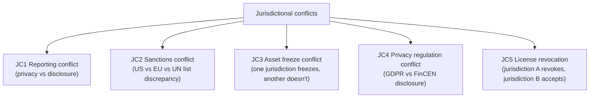
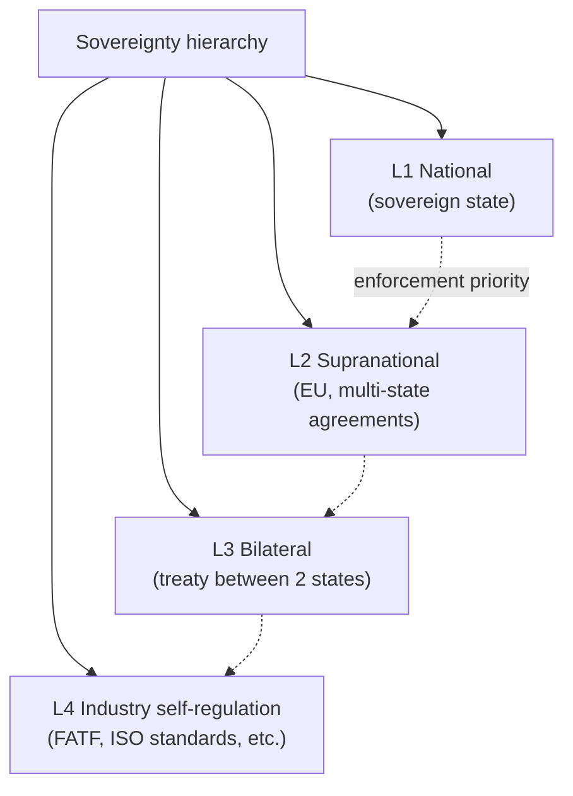
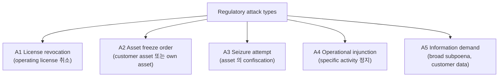
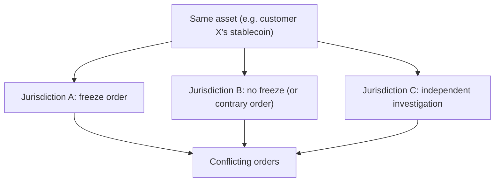
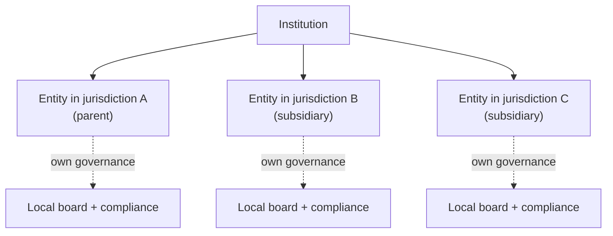
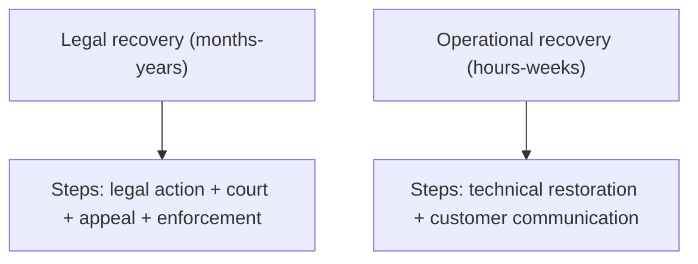
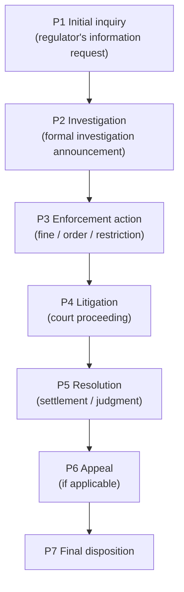
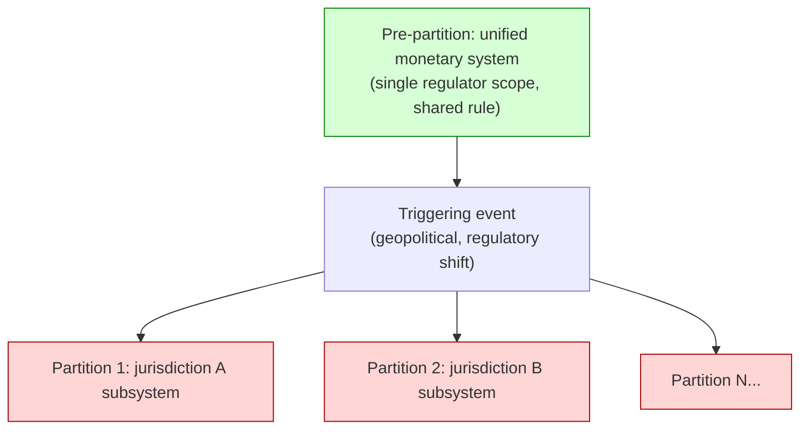

# Custody Wallet — Jurisdiction Split / Regulatory Attack Reasoning

> **본 문서의 위치 (Crisis Cluster D23)**: D11 compliance + D13 cross-border + D24 reporting 위의 **regulatory crisis specialization**. D21 trust + D22 settlement 의 governance-side equivalent. Jurisdictional fragmentation = institutional governance 의 partitioning.

> **본 문서가 답하는 핵심 질문**: 왜 jurisdictional conflict 가 단순 compliance divergence 가 아닌가? 왜 regulatory freeze 가 asset confiscation 가 아닌가? 왜 jurisdiction visibility 가 jurisdiction control 가 아닌가? 왜 cross-border operation 이 unified governance 보장 아닌가? 왜 legal recovery 가 operational recovery 보다 길고 어려운가?

---

## 0. 핵심 명제 (10초 이해)

1. **Regulatory fragmentation = institutional governance partitioning across legal sovereignty domains** (core thesis).
2. **Jurisdictional conflict = unified monetary system → fragmented governance islands** (secondary thesis).
3. **5-tier "≠" 명제 (D23 cluster invariant)**:
   - Compliance divergence ≠ Institutional illegality
   - Regulatory freeze ≠ Asset confiscation
   - Jurisdiction visibility ≠ Jurisdiction control
   - Cross-border operation ≠ Unified governance
   - Legal recovery ≠ Operational recovery
4. **5 jurisdictional conflict type** — Reporting conflict / Sanctions conflict / Asset freeze conflict / Privacy vs disclosure / License revocation.
5. **Sovereignty hierarchy** — National > Supranational > Bilateral > Industry self-regulation.
6. **Legal recovery 의 timescale** — months-years (vs operational hours-weeks).
7. **Split-brain governance** — institution 의 different operations 가 different jurisdiction 안에서 different rule.
8. **Regulatory attack vector** — adversarial regulatory action (license revocation, freeze, seizure attempt).
9. **Jurisdiction shopping vs jurisdiction arbitrage** — different defensive responses.
10. **Crisis-time customer burden ~100%** — vendor 가 jurisdictional matter 의 customer's own legal entity 의 영역.

---

## 1. Jurisdictional Conflict Taxonomy

### 1.1 5 conflict type



### 1.2 Type 별 institutional impact

| Type | Operational impact | Legal impact |
|---|---|---|
| JC1 Reporting | Per-regulator format + content | Compliance officer 의 책임 |
| JC2 Sanctions | Different actionable list | Cross-border activity 의 illegality |
| JC3 Asset freeze | Same asset 의 conflicting status | Litigation 의 multi-jurisdiction |
| JC4 Privacy | Conflict on data sharing | Fines + reputation |
| JC5 License | Service availability per jurisdiction | Operational restructuring |

### 1.3 "Compliance divergence ≠ Institutional illegality"

(§0 명제)

- Compliance divergence = different jurisdiction 의 different rule.
- Institutional illegality = institution 의 actually illegal behavior.
- 차이:
  - Divergence 만 있고 institution 의 own compliance 가 sufficient → not illegal
  - Divergence 가 institution 의 deliberate violation → illegal in specific jurisdiction
- → Multi-jurisdiction operation 의 "in compliance somewhere, not elsewhere" 의 grey area.

### 1.4 Conflict 의 emergent property

(★ Hypothesis — regulatory landscape pattern)

- Jurisdiction 들 의 historical 독립.
- Crypto / digital asset 의 cross-border nature → 새로운 conflict surface.
- → Industry-wide 의 ongoing legal/regulatory uncertainty.

---

## 2. Sovereignty Hierarchy



### 2.1 Sovereignty conflict scenarios

| Scenario | Conflict |
|---|---|
| National vs Supranational | EU member 의 national law vs EU directive |
| Two nationals | Same activity, different countries 의 different rule |
| National vs treaty | International obligation vs domestic |
| Self-regulation vs national | Industry standard vs hard law |

### 2.2 OFAC 의 extraterritorial reach (D11 §3 의 jurisdictional)

- OFAC sanctions = US 의 law.
- 그러나 USD 사용 / US person involvement / US infrastructure 시 적용.
- → Non-US entity 도 OFAC compliance 필수 in many cases.

### 2.3 Sovereign immunity vs commercial activity

- Sovereign state 의 own asset 의 immunity (historically).
- 그러나 commercial activity 시 immunity 약화.
- Crypto context: state-issued CBDC vs commercial stablecoin 의 different status.

### 2.4 "Jurisdiction visibility ≠ Jurisdiction control"

(§0 명제)

- Visibility: 다른 jurisdiction 의 활동 모니터.
- Control: 다른 jurisdiction 안의 활동 enforcement.
- 차이:
  - Cross-border blockchain visibility 가 직접 enforcement 不可
  - 각 jurisdiction 의 own enforcement boundary
- → 시각화 가능 ≠ 통제 가능.

---

## 3. Regulatory Attack Vectors

### 3.1 5 regulatory attack type



### 3.2 Attack 의 typology

| Attack | 의미 | Defense |
|---|---|---|
| License revocation | Operating ability 상실 | Multi-jurisdiction 등록 |
| Asset freeze | Specific asset 의 transfer 정지 | Legal challenge |
| Seizure | Asset 의 ownership transfer to state | Legal challenge + diplomatic |
| Operational injunction | Specific activity 정지 | Legal challenge + restructuring |
| Information demand | Broad data disclosure | Privacy law + legal process |

### 3.3 "Regulatory freeze ≠ Asset confiscation"

(§0 명제 / D11 §4.4 의 재확인)

- Freeze = movement 의 정지 (ownership intact).
- Confiscation = ownership transfer to state.
- 차이 of timing + legal procedure + reversibility.

### 3.4 Adversarial regulator behavior

(★ Hypothesis — operational pattern)

- 대부분 regulator = constructive (compliance enforcement).
- 일부 scenario:
  - Politicized regulation (e.g. specific country 의 specific entity targeting)
  - Adversarial state action
  - Overreach (jurisdictional dispute)
- → Multi-jurisdiction operation 의 risk dispersion.

### 3.5 "Regulatory attack" 의 framing 주의

- 본 문서 의 "attack" 은 adversarial framing 임.
- 대부분 의 regulatory action = legitimate enforcement.
- 그러나 institutional perspective 에서 unexpected enforcement = "attack-like" experience.
- → Neutral analysis 의 framework.

---

## 4. Asset Freeze Conflict

### 4.1 Conflict scenarios



### 4.2 Resolution path

| Path | 의미 |
|---|---|
| Comply with most strict | Default safe choice (often) |
| Comply with home jurisdiction | Native law primary |
| Legal challenge | Court decision |
| Diplomatic resolution | State-to-state |
| Customer protection | Customer-side legal |

### 4.3 Smart contract freeze (D11 §4 의 jurisdictional 측면)

- Stablecoin contract 의 freeze function = single action affects globally.
- 그러나 trigger 는 specific jurisdiction (issuer's home).
- → Single jurisdiction 의 freeze action 의 global reach.

### 4.4 Cross-jurisdictional asset recovery

- Asset frozen in jurisdiction A, owner in jurisdiction B.
- B 의 legal action 으로 A 의 freeze release attempt.
- Treaty-based mutual legal assistance.
- → Recovery 의 multi-year timeline.

### 4.5 Customer protection scheme

- Each jurisdiction 의 customer protection 의 different scope:
  - Deposit insurance (banking)
  - Investor protection (securities)
  - Custody protection (specialized)
- Crypto-specific protection scheme 의 emerging.

---

## 5. Governance Fragmentation

### 5.1 Institution 의 jurisdictional 구조



### 5.2 "Cross-border operation ≠ Unified governance"

(§0 명제)

- Cross-border operation: 다른 jurisdiction 의 activity.
- Unified governance: 단일 governance body.
- 차이:
  - Each subsidiary 가 own local governance
  - Group-level governance 의 limitation (local autonomy)
  - Conflict 시 local governance 의 own action
- → Multi-jurisdictional governance 의 federated nature.

### 5.3 Split-brain governance

```
Scenario:
  Jurisdiction A 의 subsidiary = freeze customer X
  Jurisdiction B 의 subsidiary = release customer X (different order)

Result:
  Same customer 의 different status in different subsidiaries
  Split-brain
```

### 5.4 Mitigation: governance coordination

- Group-level coordination mechanism:
  - Shared policy
  - Conflict escalation
  - Joint board oversight
- 그러나 local sovereignty 의 limit.

### 5.5 Operational partitioning

(★ Hypothesis — operational pattern)

- Each subsidiary 가 own operational stack:
  - Local team
  - Local infrastructure
  - Local regulator relationship
- Group 의 shared infrastructure 의 reduced (legal isolation).
- → Operational cost ↑, but governance independence.

---

## 6. Legal vs Operational Recovery

### 6.1 Recovery timescale comparison



### 6.2 "Legal recovery ≠ Operational recovery"

(§0 명제)

- Operational recovery: technical restoration, customer service resumption.
- Legal recovery: court decision, asset 의 official release.
- 차이:
  - Operational 은 weeks 가능
  - Legal 은 years 가능
  - Operational 정상화 후에도 legal 미해결 가능
- → Two different timescales.

### 6.3 Operational continuation during legal proceeding

- Legal proceeding ongoing 동안의 operational decision:
  - Partial operation continuation
  - Customer asset 의 management
  - New customer onboarding (suspend or continue?)
- → Strategic decision.

### 6.4 Asset preservation during legal proceeding

- Court-ordered preservation:
  - Specific asset 의 freeze (preservation order)
  - 매각 금지
  - Status quo 유지
- Custody 의 obligation: technical preservation + reporting.

### 6.5 Legal costs

- Multi-jurisdictional legal proceeding = significant cost.
- Pre-arranged legal counsel (per jurisdiction).
- Insurance coverage (D&O, etc.).
- → Crisis 의 economic dimension.

---

## 7. Regulatory Escalation Lifecycle

### 7.1 Escalation phases



### 7.2 Each phase 의 institutional response

| Phase | Response |
|---|---|
| P1 Inquiry | Cooperation + legal counsel consultation |
| P2 Investigation | Full cooperation + internal review + privilege management |
| P3 Enforcement | Legal challenge or compliance |
| P4 Litigation | Active defense + settlement negotiation |
| P5 Resolution | Implementation + reputation management |
| P6 Appeal | Strategic decision |
| P7 Final | Lessons + policy update |

### 7.3 Regulator-institution communication discipline

- Information privilege.
- Document preservation.
- Officer testimony.
- Consistent message.
- → Crisis communication 의 specialized form.

### 7.4 Politicization risk

(★ Hypothesis — operational pattern)

- Regulatory action 의 political timing.
- Election cycle 의 impact.
- Public 의 perception 의 매개체로 regulator action.
- → Apolitical defense.

### 7.5 Settlement negotiation

- Regulatory enforcement 의 settlement 가능:
  - Fine + admission + remediation
  - Operational restriction
  - 관계 유지
- → Each settlement 의 long-term implication 평가.

---

## 8. Sovereignty Partition Model

### 8.1 Partition 의 dynamics



### 8.2 Partition 의 trigger

- Geopolitical (사 sanctions, war)
- Regulatory shift (specific country 의 outright ban)
- Trade war (tariff, restriction)
- Capital control (cross-border restrict)
- → Sudden partition possibility.

### 8.3 Partition 후 의 operational reality

- 각 partition 의 own:
  - Customer base (geographic)
  - Regulator (local)
  - Liquidity (local)
  - Asset (locally accessible)
- Cross-partition transfer 의 friction or impossibility.

### 8.4 Federation-like behavior under partition

(D20 §1.2 의 partition 측면)

- Partitions = independent governance.
- 그러나 coordinated history (pre-partition unity).
- Recovery: gradual re-integration (or permanent partition).

### 8.5 Customer impact

- Geographic 의 customer:
  - Cannot transfer cross-partition
  - Asset stuck in specific partition
  - Different terms of service per partition
- → Customer protection 의 partition-specific.

---

## 9. Operational Fragility Map

```mermaid
graph TB
    F1["F1. Conflicting freeze order"]
    F2["F2. Reporting inconsistency<br/>(cross-jurisdiction)"]
    F3["F3. Legal deadlock<br/>(cannot proceed both ways)"]
    F4["F4. Treasury partition<br/>(local pool, no cross-flow)"]
    F5["F5. Governance split-brain<br/>(different subsidiaries different action)"]
    F6["F6. Institutional paralysis<br/>(operational suspension during legal)"]
    F7["F7. License revocation cascade<br/>(one jurisdiction → others scrutinize)"]
    F8["F8. Information demand overflow<br/>(multiple regulator simultaneous)"]
    F9["F9. Politicization risk<br/>(non-compliance-driven action)"]
    F10["F10. Customer geographic stranding<br/>(asset accessible only in specific partition)"]

    F1 -->|mitigation| M1["Most-strict default + legal counsel + diplomatic"]
    F2 -->|mitigation| M2["Unified data model + per-jurisdiction translation"]
    F3 -->|mitigation| M3["Court adjudication + arbitration"]
    F4 -->|mitigation| M4["Per-jurisdiction treasury + regulatory pre-position"]
    F5 -->|mitigation| M5["Group-level coordination + subsidiary autonomy balance"]
    F6 -->|mitigation| M6["Continuation plan + customer protection"]
    F7 -->|mitigation| M7["Multi-jurisdiction licensing + redundancy"]
    F8 -->|mitigation| M8["Dedicated compliance team per jurisdiction"]
    F9 -->|mitigation| M9["Apolitical operations + transparency + relationship"]
    F10 -->|mitigation| M10["Customer education + protection scheme + cross-border preparation"]
```



### 9.1 분류

| 분류 | items | 성격 |
|---|---|---|
| **Operational** | F4, F6, F10 | architectural |
| **Governance** | F5, F7 | structural |
| **Legal** | F1, F3, F8 | external |
| **Process** | F2 | engineering |
| **Strategic** | F9 | political |

---

## 10. Limitations

### 10.1 Compliance divergence ≠ Illegality

§1.3.

### 10.2 Freeze ≠ Confiscation

§3.3 / D11 §4.4.

### 10.3 Visibility ≠ Control

§2.4.

### 10.4 Cross-border ≠ Unified

§5.2.

### 10.5 Legal ≠ Operational recovery

§6.2.

### 10.6 Regulatory landscape 의 unpredictability

- Regulatory 의 evolving nature.
- Sudden policy shift 의 possibility.
- → Long-term planning 의 한계.

### 10.7 Jurisdiction shopping 의 reputation cost

- 가장 lax jurisdiction 선택 = reputational signal.
- Long-term: regulatory tightening 가 industry-wide.
- → Short-term shopping 의 long-term cost.

---

## 11. 3-way Jurisdictional Crisis Burden

### 11.1 Plane × Ownership

| 영역 | SaaS | Hosted MPC | Direct-build |
|---|---|---|---|
| License management | Customer | Customer | Customer |
| Regulator relationship | Customer | Customer | Customer |
| Legal counsel | Customer | Customer | Customer |
| Subsidiary structure | Customer | Customer | Customer |
| Sanctions monitoring | Vendor + customer | Vendor + customer | Customer |
| Conflict resolution | Customer | Customer | Customer |

### 11.2 Customer jurisdictional burden (★ Hypothesis)

- SaaS: ~100%
- Hosted: ~100%
- Direct-build: ~100%

→ Jurisdictional crisis 는 customer 의 own legal entity 의 영역. Vendor 흡수 불가.

### 11.3 Recommendation

| Context | 권장 |
|---|---|
| Single jurisdiction | Local license + compliance |
| Multi-jurisdiction | Subsidiary per jurisdiction + group coordination |
| Globally operating | Comprehensive multi-licensing + legal infrastructure + diplomatic |
| Politically exposed | Apolitical operations + multi-jurisdictional redundancy |

---

## 12. Q1-Q10 Reasoning

### Q1. Compliance divergence ≠ Illegality

§1.3.

### Q2. Freeze ≠ Confiscation

§3.3.

### Q3. Visibility ≠ Control

§2.4.

### Q4. Cross-border ≠ Unified

§5.2.

### Q5. Legal ≠ Operational recovery

§6.2.

### Q6. Sovereignty hierarchy

§2.

### Q7. 5 regulatory attack type

§3.

### Q8. Split-brain governance

§5.3.

### Q9. Partition dynamics

§8.

### Q10. Politicization

§7.4.

---

## 13. Open Questions / Org Policy

| 영역 | 질문 |
|---|---|
| Subsidiary structure | per jurisdiction? |
| Licensing strategy | multi-licensing scope? |
| Legal counsel | per jurisdiction? |
| Pre-existing regulator relationship | which? cadence? |
| Conflict default | most-strict? home jurisdiction? |
| Customer education | cross-border rights? |
| Insurance | scope per jurisdiction? |
| Diplomatic preparation | embassy relations? |
| Political risk monitoring | per jurisdiction? |
| Customer protection scheme | participation? |
| Privilege management | document retention? |
| Communication discipline | per jurisdiction template? |
| Subsidiary autonomy | how much? |
| Group coordination mechanism | board structure? |
| Partition response plan | per scenario? |
| Cross-border data | sharing policy? |
| Sanctions compliance | per jurisdiction list? |
| License revocation response | continuation plan? |
| Asset preservation | per court order? |
| Settlement strategy | negotiation principles? |

---

## 14. References + Uncertainty Boundary + Bridge

### 관련 wiki

| 참조 |
|---|
| [[docs/architecture/compliance-aml-sanctions-boundary]] §10 (jurisdictional variance) |
| [[docs/architecture/cross-border-settlement-fx-liquidity]] §6 (cross-border compliance) |
| [[docs/architecture/regulatory-reporting-audit-interface]] §7 (cross-jurisdictional reporting conflict) |
| [[docs/architecture/stablecoin-depeg-crisis-handling]] (D21) cluster predecessor |
| [[docs/architecture/consensus-failure-chain-halt]] (D22) cluster predecessor |

### Uncertainty Boundary

- 5 conflict type / 4-tier sovereignty / 5 attack type / 7-phase escalation / 10 fragility / 100% burden = **generalized jurisdictional crisis architecture pattern (Hypothesis ★)**.
- §3.4 adversarial regulator framing = neutral analytical framework.
- §11.2 burden 백분율 = estimate.
- §13 에 org policy 영역 명시.

### D25 Bridge Invariants (D21 + D22 + D23 → D25)

1. **Liquidity coordination collapse** — D23 의 governance fragmentation → D25 의 liquidity coordination collapse.
2. **Synchronized freeze propagation** — D21 의 trust crisis + D23 의 jurisdictional freeze = synchronized freeze → D25.
3. **Institutional trust evaporation** — D21 + D23 의 cumulative trust loss → D25.
4. **Treasury hoarding** — D17 의 stress + D23 의 partition → defensive hoarding → D25.
5. **Systemic coordination breakdown** — D20 의 federation 의 D23 stress 아래 breakdown → D25.

### Cluster D21→D22→D23→D25→D26 progression

- D21: trust collapse
- D22: settlement truth fragmentation
- D23 (this): governance fragmentation
- D25 (next): systemic liquidity freeze
- D26 (closing): generalized failure taxonomy

---

**Stage 32 D23 completion timestamp**: 2026-05-20.
