# Custody Wallet — Multi-chain Adapter Pattern Reasoning

> **본 문서의 위치**: D1a-D8 + D6 의 generalized custody skeleton 을 **chain semantic variance** 관점에서 specialize. Multi-chain support 의 핵심은 RPC adapter 가 아닌 **공통 custody invariant 위에서 chain-specific semantic 을 normalize 하는 layer**. EVM / UTXO / Solana-style / Rollup / Bridge / Account abstraction 의 6 model 의 variance 가 governance / signing / reconciliation / evidence / settlement / recovery 에 미치는 영향 reasoning.

> **본 문서가 답하는 핵심 질문**: 왜 "여러 chain 지원" 은 "여러 RPC client" 가 아닌가? 왜 same confirmation count 가 same economic risk 가 아닌가? 왜 wrapped asset 이 native asset 의 equivalent 가 아닌가? 왜 rollup inclusion 이 final settlement 가 아닌가? 왜 adapter layer 가 semantic normalization 의 location 인가?

---

## 0. 핵심 명제 (10초 이해)

1. **Multi-chain custody is not multi-RPC support. It is semantic normalization across heterogeneous settlement systems.** — 본 문서의 thesis.
2. **6 chain model + 10 variance dimension** — chain variance 는 RPC API 차이가 아닌 settlement / finality / mempool / replacement / ordering 의 fundamental difference.
3. **10-tier "≠" 명제** — same tx model 이 same semantics 아님, confirmation 이 finality 아님, finality 가 irreversibility 아님, 등.
4. **UTXO vs Account model = fundamental reconciliation / signing / evidence 차이** — superficial 한 API 차이 아닌 deep semantic.
5. **Bridge ≠ Native settlement** — bridge 는 additional trust domain, wrapped asset 은 underlying 의 derivative.
6. **Rollup state ≠ L1 settlement** — sequencer 의존, challenge window, forced inclusion 의 chain-specific complexity.
7. **Adapter boundary = semantic normalization plane** — RPC translation 이 아닌 finality / confirmation / replacement / evidence 의 normalize.
8. **Cross-chain reconciliation complexity 폭증** — chain 마다 settlement / confirmation / reorg / indexing / ordering 다름.
9. **Same economic intent ≠ Same blockchain artifact** — "BTC 전송" 의 의도가 native BTC / wrapped BTC / Lightning / sidechain 에서 다른 artifact 생성.
10. **Chain upgrade = silent semantic drift** — chain 의 hard fork / soft fork / consensus upgrade 가 기존 adapter assumption 을 invalidate.

---

## 1. 6 Chain Model Generalized

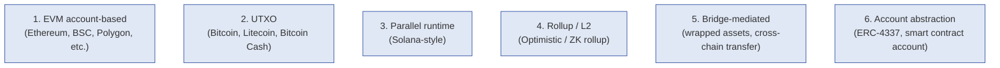

### 1.1 6 모델의 generalized definition

| 모델 | Core property |
|---|---|
| **EVM account-based** | Global mutable state + nonce ordering + sequential execution per account |
| **UTXO** | Unspent output set + no global state + parallel-ready transactions |
| **Parallel runtime** | Account model + parallelism via dependency declaration |
| **Rollup / L2** | L1 안의 nested settlement; finality 가 L1 와 다름 |
| **Bridge-mediated** | Source chain lock + destination chain mint; additional trust domain |
| **Account abstraction** | Smart contract = account; signature / nonce / fee 의 customization |

### 1.2 모델 간 fundamental difference

- 위 6 모델은 **API 차이가 아닌 settlement semantic 차이**.
- 단순 "RPC adapter 만 다르게" 는 false abstraction.
- 각 모델의 invariant 가 custody system 의 reconciliation / signing / evidence 에 propagate.

### 1.3 Same chain 안의 variance 도 존재

- 같은 EVM family 안에서도:
  - Ethereum (post-merge: 2-epoch finality)
  - BSC (DPoS, 다른 finality)
  - Polygon (sidechain + checkpoint to L1)
  - Arbitrum / Optimism (rollup)
  - Avalanche C-chain (different consensus)
- → "EVM 지원" 으로 묶기 어려움 — 각 chain 의 finality / reorg / mempool 다름.

---

## 2. 10-dimension Chain Variance Map

```mermaid
graph TB
    V["Chain Variance Dimensions"]

    D1["D1. Finality model<br/>(probabilistic / deterministic / hybrid)"]
    D2["D2. Reorg depth<br/>(common shallow / rare deep / never)"]
    D3["D3. Mempool visibility<br/>(public / private / sequencer-only)"]
    D4["D4. Transaction replacement<br/>(RBF / CPFP / nonce-replace / forbidden)"]
    D5["D5. Fee market<br/>(EIP-1559 / legacy / oracle-based / fixed)"]
    D6["D6. Ordering guarantee<br/>(strict per-account / partial / parallel)"]
    D7["D7. State mutation model<br/>(global mutable / UTXO / parallel)"]
    D8["D8. Address model<br/>(public key hash / contract / derived)"]
    D9["D9. Event indexing model<br/>(log emit / receipt / state diff / explicit)"]
    D10["D10. Confirmation reliability<br/>(block time variance / re-orderable)"]

    V --> D1
    V --> D2
    V --> D3
    V --> D4
    V --> D5
    V --> D6
    V --> D7
    V --> D8
    V --> D9
    V --> D10
```

### 2.1 각 dimension 의 chain-specific 예 (★ Hypothesis level)

| Dimension | EVM (ETH) | UTXO (BTC) | Solana | Optimistic L2 | ZK L2 |
|---|---|---|---|---|---|
| Finality | Hybrid (probabilistic + 2-epoch deterministic) | Probabilistic | Probabilistic + fast slot | L1 finality + 7d challenge | Proof-based |
| Reorg depth | Rare (post-merge) | Common shallow | Common shallow | L1-bound | L1-bound |
| Mempool | Public | Public | Limited | Sequencer-only | Sequencer-only |
| Replacement | Nonce-replace + EIP-1559 RBF | RBF + CPFP | (limited) | Sequencer-mediated | Sequencer-mediated |
| Fee market | EIP-1559 base + priority | Fee market (BTC) | priority fee | L2 fee + L1 amortized | L2 fee + proof cost |
| Ordering | Per-account nonce strict | Per-input UTXO | Parallel via access list | Sequencer order | Sequencer order |
| State | Global mutable + slot | UTXO set | Account + parallel | Account (inherits L1) | Account (inherits L1) |
| Address | EOA + smart contract | P2PKH / P2WPKH / P2TR | Account pubkey | EVM-compatible | EVM-compatible |
| Indexing | Logs (Transfer event) | Tx outputs | Account changes | L2 logs | L2 logs |
| Confirmation reliability | Block time ~12s post-merge | ~10min stochastic | ~400ms slot | L2 fast + L1 slow | L2 fast + L1 slow |

→ 위 표는 **starting point** — 각 chain 의 detail 은 더 복잡, 시간에 따라 변화.

### 2.2 10 dimension 의 custody impact

| Dimension | Custody impact |
|---|---|
| Finality | Confirmation policy + balance state transition timing |
| Reorg depth | Compensating entry frequency |
| Mempool visibility | Stuck tx detection + RBF capability |
| Replacement | SigningRequest retry semantic + nonce/UTXO handling |
| Fee market | Gas estimation + fee oracle infrastructure |
| Ordering | Transaction queueing + nonce mgmt |
| State model | Address attribution + token detection |
| Address | Address generation / derivation / registry |
| Indexing | Deposit detection + event parsing |
| Confirmation reliability | UX expectations + SLA |

### 2.3 변화의 cumulative effect

- 단일 dimension 차이는 mitigatable.
- 그러나 10 dimension × 6 chain model × N chain instance = multiplicative complexity.
- → Multi-chain custody 의 complexity 가 chain 수의 선형이 아닌 **multi-dimensional product**.

---

## 3. UTXO vs Account Model Reasoning

### 3.1 Fundamental difference

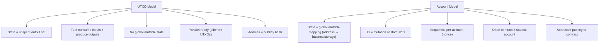

### 3.2 Custody impact 의 5 영역

| 영역 | UTXO | Account |
|---|---|---|
| **Reconciliation** | UTXO set 의 변화 추적 | Balance 의 변화 추적 |
| **Signing** | Per-input signature (multiple sig per tx) | Per-tx signature |
| **Pending balance** | UTXO 의 spent/unspent state | Account 의 nonce + balance lock |
| **Replay protection** | UTXO 자체가 nonce (한 번 spent 면 끝) | Account nonce sequential |
| **Evidence lineage** | UTXO → 다음 UTXO 의 chain | State diff → diff chain |

### 3.3 Signing 차이 (D2 의 chain-specific)

| 영역 | UTXO | Account |
|---|---|---|
| Inputs per tx | N (multiple UTXOs to consume) | 1 (single sender account) |
| Signatures required | N (one per input) | 1 (sender's signature) |
| MPC complexity | N parallel MPC sessions or batched | 1 MPC session |
| Fee | Input sum - output sum (explicit fee output) | gas × gas_price |

→ UTXO 의 signing 은 multi-signature aggregation — MPC orchestrator 의 추가 round.

### 3.4 Reconciliation 차이 (D1b 의 chain-specific)

| 영역 | UTXO | Account |
|---|---|---|
| Balance calculation | sum(unspent outputs) | account balance state |
| Deposit detection | new UTXO with our address as output | Transfer event or balance increase |
| Withdrawal detection | UTXO with our address as input | Outgoing tx + nonce increment |
| Reorg compensation | UTXO unspent again | balance state revert |

### 3.5 "UTXO ≠ Account-based" 가 의미하는 것

(§0 명제)

- 같은 amount 의 BTC vs ETH 라도 reconciliation 의 complexity 다름.
- UTXO 의 **change output** (잔액의 새 UTXO) 은 deposit 이 아닌 internal — 별도 처리.
- Account model 의 **smart contract interaction** (DEX swap result) 은 단순 transfer 가 아닌 state diff.
- → 같은 custody system 이 두 model 모두 지원하려면 attribution / detection / signing / reconciliation 모두 dual-path.

---

## 4. Finality Variance

### 4.1 Finality model 의 3 종류

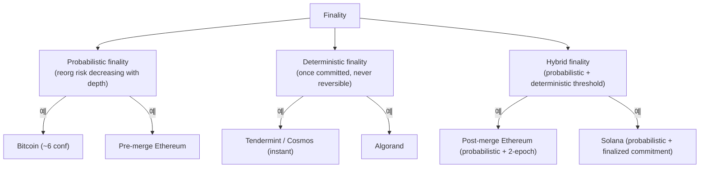

### 4.2 "Confirmation ≠ Finality" reasoning

- Confirmation = block 포함 + depth threshold.
- Finality = irreversibility 보장.
- Probabilistic chain: depth ↑ = reorg 확률 ↓, 그러나 0 아님.
- Deterministic chain: 단일 commit 시점에 finality.
- Hybrid: probabilistic phase + deterministic threshold (예: Ethereum 의 2-epoch).

### 4.3 "Finality ≠ Irreversibility" reasoning

(★ 가장 중요한 명제)

- "Finality" 라고 chain 이 부르는 것이 절대 irreversibility 아님.
- 가능한 reversal 경로:
  - Consensus 의 majority attack (51%+ attack)
  - Hard fork (community split, chain history rewrite)
  - Bug 로 인한 chain rollback (rare but happened — 예: Ethereum DAO fork)
  - Sequencer compromise (rollup)
- → "Final" 은 economic + game-theoretic finality — pure mathematical irreversibility 아님.
- Custody system 의 "finalized" balance 도 chain 의 social consensus 위에 있음.

### 4.4 Custody-side finality policy

| Chain | 권장 confirmation depth (★ Hypothesis) |
|---|---|
| Bitcoin | 6 confirmations (~60min) for high value; deeper for very high value |
| Ethereum (post-merge) | 2 epochs (~13min) for deterministic finality |
| Solana | ~32 slots typical, more for high value |
| Cosmos / Tendermint | 1 block (instant deterministic) |
| Optimistic L2 | 7 days (challenge period) for trustless |
| ZK L2 | proof submission to L1 + L1 finality |

→ 위 값은 industry common practice — 시간에 따라 변화, asset value 에 따라 조정.

### 4.5 Finality 의 customer-facing semantic

- Custody system 의 "Confirmed" UX 와 "Final" UX 의 분리.
- 너무 빨리 "Final" 표시 → reorg 시 confusion.
- 너무 늦게 → UX bad.
- 권장: chain-specific finality 표시 + asset-specific threshold + transparency on probabilistic 성격.

---

## 5. Mempool Semantic Difference

### 5.1 Mempool 의 5 model

| Model | 의미 | 예 |
|---|---|---|
| **Public mempool** | 모든 RPC node 가 같은 mempool 보유 (eventual) | Bitcoin, Ethereum (legacy) |
| **Private mempool** | RPC node 별 다른 mempool / private propagation | Flashbots, MEV-protected |
| **Sequencer-only** | mempool 이 sequencer 만 접근 | Optimistic / ZK rollups |
| **No mempool** | 즉시 inclusion / sequencer order | Cosmos (typical), Solana (no traditional mempool) |
| **Hybrid** | public + private 동시 | Modern Ethereum (legacy + MEV) |

### 5.2 "Broadcast success ≠ Mempool visibility"

(§0 명제)

- Broadcast = RPC accepted.
- Mempool visibility = tx 가 다른 node 에 propagate.
- Private mempool / sequencer-only 일 때 broadcast 후에도 다른 observer 에게 invisible 가능.
- → Custody 의 multi-RPC redundancy 가 mempool visibility 보장 못 함 (sequencer-only chain).

### 5.3 Stuck tx detection 의 chain-dependence

- Public mempool: stuck tx 감지 가능 (다른 RPC 에서 보이는데 mining 안 됨).
- Private / sequencer-only: stuck tx 감지 어려움 (sequencer 가 응답 안 하면 모름).
- → Mempool model 이 custody 의 stuck tx workflow 결정.

### 5.4 RBF / replacement 의 mempool dependency

- RBF (Replace-by-Fee) 는 mempool 의 replacement semantic 의존.
- Public mempool: 같은 nonce / UTXO 의 더 높은 fee tx 가 기존 tx 대체.
- Sequencer-only: sequencer 가 replacement 처리; customer 의 replacement request 가 sequencer 에 의존.
- → Replacement workflow 가 chain semantic 의존.

---

## 6. Replacement Transaction Semantics

### 6.1 4 replacement mechanism

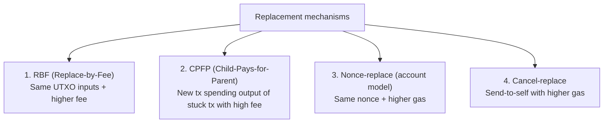

### 6.2 "Replacement ≠ Same economic event"

(§0 명제)

- Replacement = mempool 의 새 tx 가 기존 tx 를 대체.
- 그러나 economic event 관점:
  - **RBF**: 같은 UTXO / 같은 recipient / 같은 amount, 다른 fee — same economic event with higher cost
  - **CPFP**: 원본 tx 는 그대로, 추가 tx 가 보조 — same economic event with side payment
  - **Nonce-replace**: 같은 nonce, 다른 tx 내용 가능 — **different economic event** (recipient 도 변경 가능)
  - **Cancel-replace**: 원본 tx 자체 무효화 — economic event cancellation

→ Replacement 의 4 종류는 economic 의미가 다름. Custody system 이 어느 replacement 인지 명시적 구분 필요.

### 6.3 Replacement 의 evidence chain 영향

- Replacement 시 원본 BroadcastAttempt 의 SigningArtifact 와 새 BroadcastAttempt 의 SigningArtifact 는 **다른 tx**.
- 즉 새 SigningRequest 가 보통 필요 (new fee = new tx body = new signature).
- Approval reuse 정책:
  - 정책 A: 같은 economic event (RBF) 는 approval 재사용
  - 정책 B: 매 replacement 마다 새 approval (보수적)

→ Org policy 영역 (§15).

### 6.4 Duplicate broadcast 방지

- Multi-RPC 로 같은 tx 동시 broadcast → 모두 mempool 진입 가능.
- 그러나 chain 자체의 dedup (nonce / UTXO) 가 final inclusion 시 1 개만 허용.
- 위험: race condition 의 fee 차이 → 의도 안 한 fee 지불.
- 해결: single-broadcast pattern (one RPC primary, others fallback) 또는 chain-native dedup 신뢰.

---

## 7. Bridge Trust Boundary

### 7.1 Bridge 가 native settlement 아닌 이유

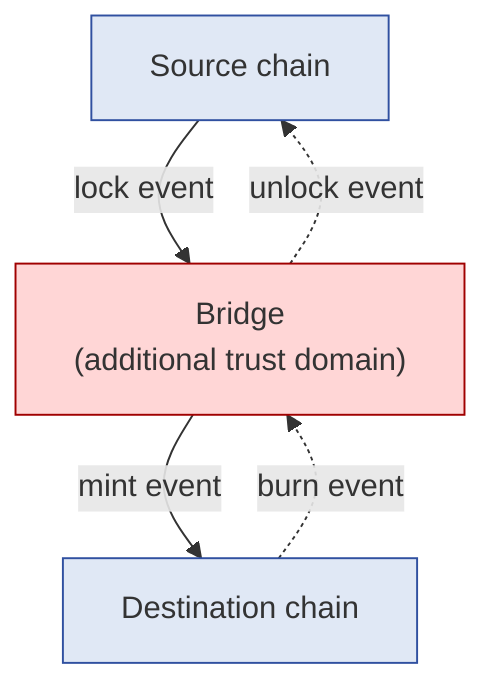

### 7.2 Bridge trust 의 5 risk

| Risk | 의미 |
|---|---|
| **Bridge insolvency** | Source chain lock 만큼 destination 의 wrapped supply 가 backed 됐는가? |
| **Bridge halt** | Bridge operator 가 freeze / down → fund stuck |
| **Bridge exploit** | Bridge contract bug → unauthorized mint/withdraw |
| **Bridge governance attack** | Bridge multisig compromise → arbitrary withdraw |
| **Oracle / validator manipulation** | Bridge 의 validator set 의 truth 가 변조 |

→ 각 bridge 는 trust assumption 다름. 단일 bridge 에 의존 = single point of failure.

### 7.3 "Wrapped asset ≠ Underlying asset"

(§0 명제)

- Wrapped BTC (WBTC) ≠ Bitcoin.
- Same amount, same name 이지만:
  - WBTC: Ethereum 의 ERC20, BitGo (custodian) 가 BTC backing
  - BTC: Bitcoin chain 의 native
- Risk profile 다름:
  - WBTC 는 BitGo trust + Ethereum smart contract risk
  - BTC 는 Bitcoin consensus only
- → Custody accounting 에서 둘은 다른 asset (다른 ledger account).

### 7.4 Bridge transfer 의 deposit 처리 (D7 §8.5 의 확장)

- Source chain lock event → destination chain mint event 의 2-step.
- 두 chain 모두 capture 후 reconciliation:
  - Source lock + destination mint 모두 OK → bridge transfer success
  - Source lock + no destination mint → bridge fail (fund stuck)
  - No source lock + destination mint → bridge anomaly (security incident)
- → Bridge deposit 의 reconciliation 은 cross-chain.

### 7.5 Bridge withdrawal 의 추가 risk

- Withdrawal: destination chain burn → source chain unlock.
- Same 2-step but reversed.
- Failure modes:
  - Burn success + no unlock → fund stuck (worst case)
  - Burn success + delayed unlock → liquidity timing risk
  - Burn fail → not really withdrawal (transient)
- → Bridge withdrawal 은 native withdrawal 보다 longer settlement + higher risk.

---

## 8. Rollup / L2 Settlement Dependency

### 8.1 Rollup 의 2 종류

| Type | 의미 |
|---|---|
| **Optimistic Rollup** | L2 tx 가 fast included, challenge period 후 L1 finality |
| **ZK Rollup** | L2 tx + ZK proof, proof verify 후 L1 finality |

### 8.2 "Rollup state ≠ L1 settlement"

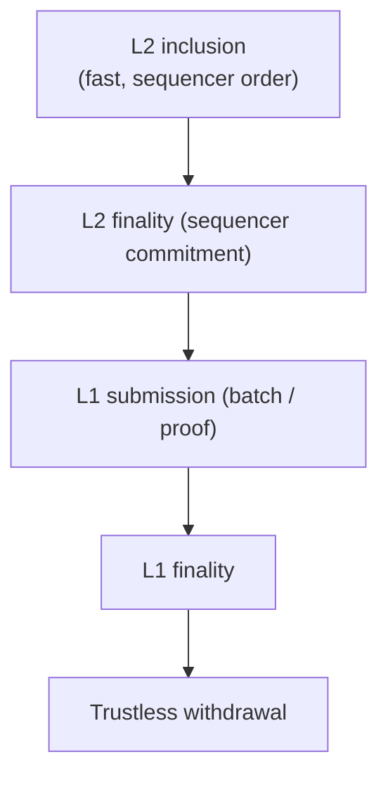

| State | 의미 | Custody implication |
|---|---|---|
| L2 inclusion | Sequencer 의 commitment | Pending balance (sequencer trust) |
| L2 finality | Sequencer 의 epoch commitment | Confirmed (sequencer 의 social consensus) |
| L1 submission | Batch/proof 가 L1 에 submitted | Settled (L1 inclusion) |
| L1 finality | L1 의 deterministic finality | Final (trustless) |
| Trustless withdrawal | Challenge period 통과 (optimistic) or proof verified (ZK) | Withdrawable from L2 to L1 |

### 8.3 Sequencer 의존 risk

- Sequencer 가 L2 의 tx ordering 결정.
- Sequencer compromise → arbitrary ordering, censorship.
- Sequencer 가 down → L2 inclusion 중단.
- → L2 의 fast UX 는 sequencer trust 위에 있음.

### 8.4 Challenge period (Optimistic) reasoning

- 7-day challenge period typical.
- Custody 의 implication:
  - L2 withdrawal 의 trustless settlement = 7 days
  - L2 deposit 는 보통 fast (1-way deposit 은 challenge 와 무관)
  - Cross-rollup transfer 의 latency
- → High-value withdrawal 의 SLA 가 chain semantic 결정.

### 8.5 Forced inclusion

- Sequencer 가 censoring 시 user 가 L1 에 직접 submit (forced inclusion).
- 일반적으로 24h-72h latency.
- Custody 의 "sequencer 가 down 시" 의 fall-back path.

### 8.6 Rollup 의 evidence chain 확장

- L2 tx hash + L2 block + L2 batch + L1 batch tx hash + L1 block 의 multi-layer.
- Evidence chain 이 L2 + L1 의 cross-layer lineage.
- → Reconciliation 의 complexity ↑.

---

## 9. Adapter Boundary

### 9.1 Adapter layer 의 역할

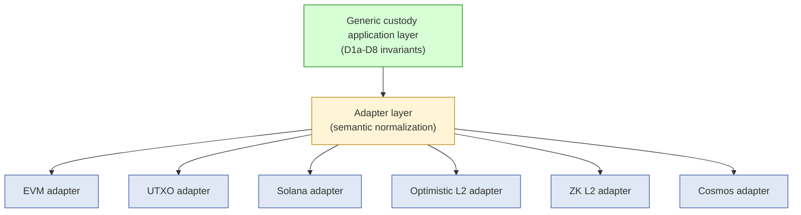

### 9.2 Adapter 의 책임 — "RPC translation" 아님

| 역할 | 의미 |
|---|---|
| **Normalize finality** | Chain-specific finality threshold → 공통 "Settled" / "Final" state |
| **Normalize confirmation** | Chain-specific depth → 공통 confirmation policy |
| **Normalize replacement** | RBF / CPFP / nonce-replace → 공통 replacement event |
| **Normalize event lineage** | Chain-specific event format → 공통 evidence envelope |
| **Normalize fee model** | EIP-1559 / legacy / fixed → 공통 fee abstraction |
| **Normalize address model** | UTXO addresses / EVM addresses / contract addresses → 공통 wallet/address registry |
| **Normalize tx model** | UTXO tx / account tx → 공통 SigningRequest aggregate |
| **Normalize indexing** | Logs / receipts / state diff → 공통 event capture |
| **Normalize evidence** | Chain-specific evidence → 공통 D5 evidence chain |
| **Normalize reconciliation** | Chain-specific reorg → 공통 D1b compensating entry |

### 9.3 "Unified API ≠ Unified semantics"

(§0 명제 / §12 limitation 의 미리보기)

- Adapter 가 unified API 제공 가능 (`signTransaction()` 등).
- 그러나 그 뒤의 semantics 는 chain 별 다름.
- 예: `confirmTransaction()` 의 의미:
  - BTC: 6 confirmations (60min)
  - ETH: 2 epochs (13min)
  - Cosmos: 1 block (instant)
  - Optimistic L2: 7 days for trustless
- → API 통일 ≠ behavior 통일. Custody application layer 가 adapter 의 chain-specific behavior 인지.

### 9.4 Adapter 의 internal layers

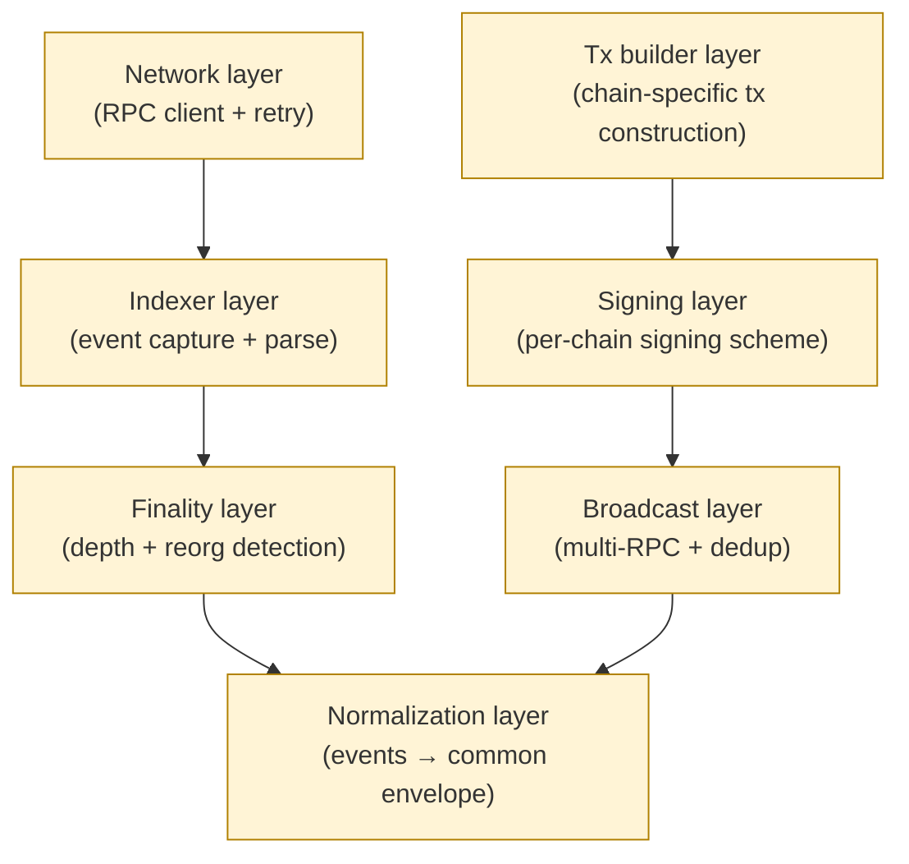

**Indexer layer 의 상세 설계** (4 implementation pattern · 데이터 모델 · 비기능 요구사항 · 비용 모델) 은 [[docs/architecture/blockchain-indexer-architecture-reference]] 참조 (Stage 41 vendor-neutral reference). 본 adapter 의 indexer layer 는 그 reference 의 P1 (풀노드 pull) 또는 P2 (이벤트 스트리밍) 또는 둘의 조합으로 구현 — chain semantic 에 따라 다름.

### 9.5 Adapter version + chain upgrade 대응

(★ Hypothesis — operational reasoning)

- Chain 의 hard fork / soft fork / consensus upgrade 시 adapter 가 영향.
- 예: Ethereum 의 EIP-1559 도입 (legacy fee → base+priority).
- 예: Solana 의 versioned tx (legacy → v0).
- 예: Bitcoin Taproot (P2WPKH → P2TR).
- → Adapter version 관리 + upgrade rollout policy 필요. **Silent semantic drift** 의 가장 큰 source.

---

## 10. Cross-chain Reconciliation Reasoning

### 10.1 Cross-chain reconciliation complexity

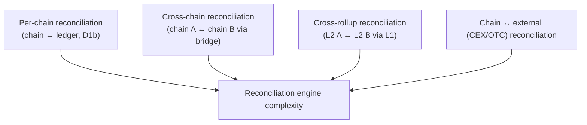

### 10.2 Cross-chain reconciliation 의 difficulty

| Difficulty | 이유 |
|---|---|
| Different finality | Chain A 의 confirmed 가 Chain B 보다 빠르거나 느림 → reconciliation window 의 chain pair-specific |
| Bridge integrity | Bridge 의 own trust assumption 추가 |
| Wrapped asset accounting | Native asset 과 wrapped 의 회계 분리 |
| Cross-chain ordering | Chain A 의 timestamp vs Chain B 의 timestamp 의 cross-comparison 어려움 |
| Reorg cascade | Chain A 의 reorg 가 bridge mint 영향 → Chain B 의 wrapped 도 영향 |

### 10.3 Cross-chain evidence lineage

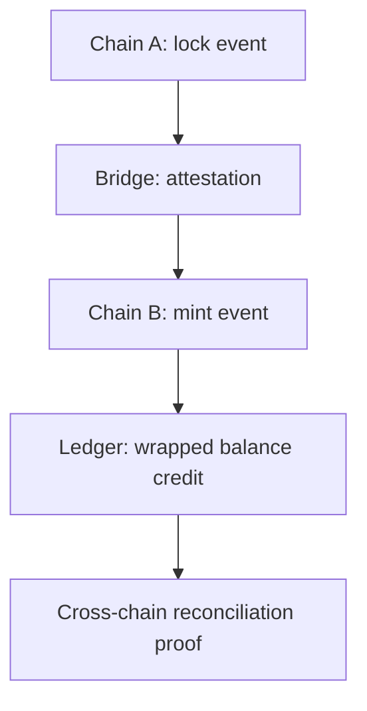

### 10.4 "Same economic intent ≠ Same blockchain artifact"

(§0 명제)

- "BTC 송금" 의 customer intent:
  - Native BTC tx
  - WBTC ERC20 transfer (Ethereum)
  - Lightning Network channel update
  - Sidechain transfer
  - Wrapped on other L2
- 모두 "BTC 송금" 이지만 chain artifact / evidence / settlement / risk 다름.
- → Custody system 의 intent ↔ artifact mapping 이 chain-specific.

---

## 11. Multi-chain Evidence Normalization

### 11.1 Evidence envelope 의 chain-specific extension

(D5 §3.4 의 multi-chain version)

| Field | Generic | Chain-specific |
|---|---|---|
| event_id (UUID) | yes | — |
| correlation_id | yes | — |
| causation_id | yes | — |
| chain_id | — | yes (chain identifier) |
| chain_artifact | yes (hash + height) | chain-specific format |
| finality_at_event | yes (Pending/Confirmed/Final) | chain-specific threshold |
| reorg_depth_observed | yes | chain-specific |

### 11.2 Cross-chain causality

- Bridge transfer 의 causation:
  - Chain A 의 lock event 가 causation_id 로 Chain B 의 mint event 에 link.
  - 그러나 chain 의 다른 system 의 timestamp / observer 이므로 cross-chain causation 은 evidence 필요.
- → Bridge attestation 이 cross-chain causation 의 evidence.

### 11.3 Multi-chain replay

(D5 §7 의 multi-chain version)

- Single chain replay: chain 의 event stream 만 필요.
- Multi-chain replay: 여러 chain 의 events + cross-chain bridges 의 attestations.
- Deterministic replay 더 어려움 — cross-chain causation 의 ordering.

### 11.4 Multi-chain forensic

- Incident 가 cross-chain 시 forensic 의 scope:
  - 여러 chain 의 evidence
  - Bridge attestation
  - Multi-chain timestamp reconciliation
  - Cross-domain reconciliation proofs
- → Multi-chain forensic 의 complexity 가 single chain 의 polynomial 이상.

---

## 12. Limitations

### 12.1 Unified API ≠ Unified semantics

§9.3. Adapter 가 unified API 제공해도 chain-specific behavior 잔존.

### 12.2 Same confirmation count ≠ Same economic risk

- 6 confirmations 의 의미가 chain 별 다름.
- BTC 6 conf ~ 60min strong probabilistic; ETH 6 block ~ 72s probabilistic (얇음).
- → Confirmation count 의 generic threshold 위험.

### 12.3 Wrapped asset ≠ Native asset

§7.3. Risk profile + trust assumption 다름. Custody accounting 분리.

### 12.4 Rollup inclusion ≠ Final settlement

§8.2. Sequencer trust + challenge period / proof submission.

### 12.5 Chain support ≠ Semantic equivalence

(§0 명제)

- "We support chain X" 의 의미:
  - RPC client 있음 ✓
  - Address generation 가능 ✓
  - Tx broadcast 가능 ✓
  - 그러나 finality / reorg / mempool / replacement / indexing 의 chain-specific behavior 가 generic abstraction 의 안전 한계 안에 있는가?
- → "Support" 는 spectrum — basic support 와 production-grade support 의 차이 큼.

### 12.6 Chain upgrade = silent semantic drift

(§0 명제, §9.5)

- Chain 의 fork / upgrade 시 adapter 의 assumption 이 silent 깨질 수 있음.
- 위험: 충분한 testing 없이 deployment 시 fund loss.
- Mitigation: chain upgrade monitoring + adapter version 관리 + canary deployment.

---

## 13. SaaS vs Hosted vs Direct-build Multi-chain Burden

### 13.1 Multi-chain plane × Ownership 매트릭스

| 영역 | SaaS | Hosted MPC | Direct-build |
|---|---|---|---|
| Chain adapter (per chain) | Vendor | Vendor (대부분) | Customer (each chain) |
| Semantic normalization | Vendor | Vendor + customer | Customer 자체 |
| Reorg variance handling | Vendor | Vendor | Customer (per chain) |
| Bridge integration | Vendor partial + customer | Customer | Customer (per bridge) |
| Cross-chain reconciliation | Customer (vendor data + own) | Customer | Customer |
| Chain upgrade response | Vendor | Vendor + customer | Customer (own monitoring + adapter upgrade) |
| Indexing consistency | Vendor multi-RPC | Vendor / customer | Customer multi-RPC |
| New chain addition | Vendor product roadmap | Customer can add (engineering) | Customer (full burden) |

### 13.2 Multi-chain customer burden (★ Hypothesis)

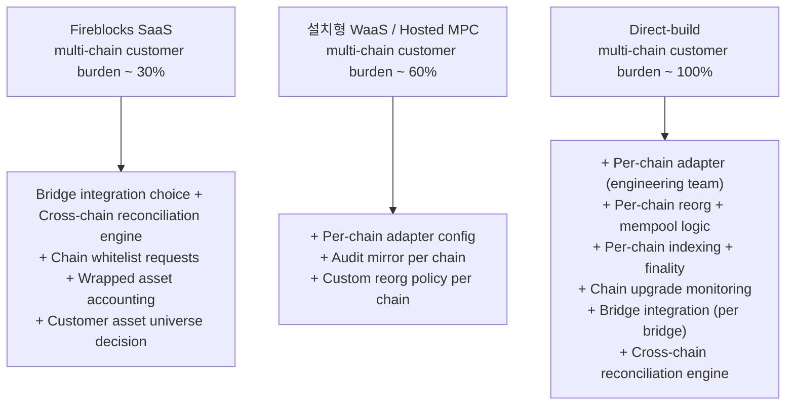

### 13.3 Multi-chain lock-in pivot

가장 큰 customer burden (direct-build 시):
1. **Per-chain adapter engineering** — 각 chain 의 finality / reorg / mempool / replacement / indexing 의 chain-specific logic.
2. **Chain upgrade monitoring** — fork / consensus upgrade / EIP / SIP 의 추적 + adapter upgrade.
3. **Bridge integration + reconciliation** — 각 bridge 의 own trust model + cross-chain reconciliation.
4. **Multi-chain evidence + forensic** — cross-chain lineage + replay.

이 4 가 burden 의 ~80% (★ Hypothesis).

### 13.4 New chain 추가의 cost

- SaaS: vendor 의 roadmap 기다림 — fast 또는 slow 의존.
- Hosted: customer engineering 가능, vendor 의 base layer 활용.
- Direct-build: full engineering — N person-months per new chain.

→ Asset / chain diversity strategy 가 model 선택의 큰 factor.

### 13.5 Recommendation (운영 관점)

| Context | 권장 |
|---|---|
| Single-chain, no bridge | SaaS — vendor 의 chain support 충분 |
| Multi-chain (5-10 major), some bridge | SaaS or Hosted MPC + cross-chain reconciliation engine (customer) |
| Multi-chain (10+) + DeFi protocol coverage + many bridges | Hosted MPC + heavy customer engineering, or Direct-build |
| Custom chain support (proprietary / niche) | Direct-build (vendor 가 support 안 함) |
| Bridge / cross-chain protocol 자체 | Direct-build (vendor 의 bridge abstraction 불충분) |

→ 추천 ≠ fact. Asset universe 의 evolving 성격 — re-evaluation 정기.

---

## 14. 핵심 Reasoning Question (Q1-Q10)

### Q1. Multi-chain = multi-RPC 가 아닌 이유

§0.1, §9. RPC 는 chain 의 network layer. Semantic normalization 은 finality / reorg / mempool / replacement / indexing / fee / address 등 10 dimension. Multi-chain custody 는 10 dimension × N chain × evolving complexity.

### Q2. UTXO vs Account 의 fundamental difference

§3. State model (set vs global) → tx model (consume+produce vs mutation) → signing (multi-sig per tx vs single) → reconciliation (UTXO tracking vs balance state) → replay (UTXO once-spent vs nonce).

### Q3. Confirmation ≠ Finality

§4.2. Confirmation = depth threshold (chain fact). Finality = irreversibility 보장 (chain semantic). Probabilistic vs deterministic vs hybrid.

### Q4. Finality ≠ Irreversibility

§4.3. Final 도 social consensus 위에 있음. 51% attack / hard fork / chain bug 로 인한 reversal 가능. "Final" 은 economic + game-theoretic, mathematical irreversibility 아님.

### Q5. Bridge ≠ Native settlement

§7. Bridge 는 additional trust domain (insolvency / halt / exploit / governance / oracle risk). Wrapped asset 은 native 의 derivative — 다른 risk profile.

### Q6. Rollup state ≠ L1 settlement

§8.2. L2 inclusion = sequencer trust. L1 finality = trustless. 4-state progression: L2 inclusion → L2 finality → L1 submission → L1 finality. Challenge period (optimistic) or proof submission (ZK).

### Q7. Same confirmation count ≠ Same economic risk

§12.2. BTC 6 conf ~60min strong; ETH 6 block ~72s weak. Generic threshold 위험. Chain-specific + asset-value 별 적용.

### Q8. Adapter = semantic normalization, not RPC translation

§9. 10 normalize 역할 (finality / confirmation / replacement / event / fee / address / tx / indexing / evidence / reconciliation). RPC translation 은 network layer 만.

### Q9. Cross-chain reconciliation complexity

§10. Different finality + bridge integrity + wrapped accounting + cross-chain ordering + reorg cascade. Single-chain reconciliation 의 polynomial 이상.

### Q10. Chain upgrade = silent semantic drift

§9.5, §12.6. Fork / consensus / EIP / SIP 가 adapter assumption invalidate. 위험: testing 부족 시 fund loss. Mitigation: monitoring + version + canary.

---

## 15. Open Questions / Org Policy 영역

| 영역 | 질문 | 본 문서 범위 밖 이유 |
|---|---|---|
| Per-chain confirmation threshold | 각 chain 의 권장 depth? | risk + value + 시간 |
| Per-asset finality buffer | high-value asset 의 추가 depth? | risk |
| Bridge whitelist | 어느 bridge 신뢰? | partnership + risk |
| Wrapped asset accounting | native + wrapped 분리? 통합? | accounting policy |
| Rollup withdrawal SLA | trustless 7d 또는 trusted fast? | UX vs trust |
| Cross-chain reconciliation cadence | hourly / daily? | forensic + cost |
| New chain addition criteria | 어떤 chain 을 add? | strategy + ops |
| Chain upgrade response SLA | 며칠 안에 adapter upgrade? | engineering capacity |
| Adapter version policy | strict / backward compatible? | engineering discipline |
| RPC provider diversity | 몇 provider? primary / fallback? | reliability budget |
| Indexer 자체 운영 vs vendor | own infra? | sovereignty trade-off |
| MEV protection | Flashbots / private mempool 사용? | trade-off |
| Chain selection (hard fork) | 어느 chain follow? | governance + economic |
| Token registry per chain | each chain 의 token whitelist? | ops |
| Smart contract interaction support | DEX / lending / staking 처리? | DeFi policy |
| Account abstraction support | ERC-4337 / smart account? | strategy |
| Stuck tx replacement policy per chain | aggressive RBF? conservative? | UX + cost |
| Reorg tolerance per chain | shallow auto / deep manual threshold? | chain-specific risk |
| Multi-chain evidence retention | unified or chain-specific? | regulatory |
| Bridge insolvency detection | monitoring? alerting? | risk |

---

## 16. 관련 wiki / entity reference + Uncertainty Boundary

### 관련 wiki

| 참조 | 어디서 사용 |
|---|---|
| [[entities/fireblocks/blockchains]] | §2 (chain variance reference) |
| [[entities/fireblocks/transaction]] | §3, §6 (tx model + replacement) |
| [[entities/fireblocks/vault-account]] | §3.4 (address model) |
| [[vendors/fireblocks/architecture]] | §13 (vendor reference) |
| [[vendors/fireblocks/risks]] | §12 (limitation reasoning) |
| [[docs/architecture/vault-wallet-ledger-db-schema]] | §3, §11 (L3 LedgerEntry + L9 chain cache) |
| [[docs/architecture/signing-workflow-orchestration]] | §3.3, §6 (signing + replacement) |
| [[docs/architecture/audit-event-sourcing-evidence-chain]] | §11 (multi-chain evidence) |
| [[docs/architecture/reconciliation-settlement-consistency]] | §10 (cross-chain reconciliation) |
| [[docs/architecture/deposit-lifecycle]] | §7.4 (bridge deposit), §3 (chain variance) |
| [[docs/architecture/withdrawal-lifecycle]] | §7.5 (bridge withdrawal), §8.4 (chain finality) |
| [[docs/architecture/three-way-custody-decision-framework]] | §13 (3-way burden for multi-chain) |
| [[docs/architecture/nonce-management-reference]] | §3, §6 (EVM nonce-replace / L2 sequencer 상세) |

### Uncertainty Boundary (★ 절대 유지)

- 본 문서의 **6 chain model / 10 variance dimension / 5 mempool model / 4 replacement mechanism / 5 bridge risk / 2-type rollup / 10 adapter normalization role / 80% burden 분포** 는 모두 **generalized multi-chain custody architecture pattern** (Hypothesis ★).
- §2.1 chain-specific variance 표는 starting point — 각 chain 의 detail 은 더 복잡, 시간에 따라 변화.
- §4.4 confirmation depth 권장값은 industry common practice — 시간 / asset value 별 변동.
- §13.2 burden 백분율 = operational reasoning estimate.
- §13.5 추천 = 운영 권장.
- §12 limitation = chain semantics 의 standard 입장.
- §15 에 명시된 영역은 본 문서가 결정하지 않음.

### 다음 단계 (D9 이후)

본 문서는 D9 — **Multi-chain Adapter Pattern**. 이후 specialized domain:

- **D10 — Treasury / Reserve / Mint-Burn Architecture**: stablecoin / wrapped asset 의 issuance + reserve reconciliation + accounting semantics. D7/D8 + D9 의 응용.
- **D11 — Compliance / AML / Sanctions Boundary**: policy enforcement / monitoring / freeze / travel rule. D3 + D7/D8 의 compliance side.
- **D12 — Operational Maturity / Incident Command**: incident response / forensic / postmortem / red team / threat model. D6 의 organizational maturity 의 detail.

### Architecture reasoning layer 누적 결과 (D1a + D2 + D3 + D4 + D5 + D1b + D7 + D8 + D6 + D9)

**10 문서 = generalized custody + specialized chain architecture reasoning skeleton**.

| 문서 | 핵심 명제 |
|---|---|
| D1a | 9-plane DB / secrets DB 저장 금지 |
| D2 | 4 state machine 분리 / MPC retry non-idempotent |
| D3 | 11-state governance SM / two-clock freshness |
| D4 | Recovery = governance ceremony under cryptographic risk |
| D5 | Custody = evidence system / Unified Evidence Spine |
| D1b | Reconciliation = cross-truth-domain consistency proof |
| D7 | Deposit = controlled ledger recognition of external settlement |
| D8 | Withdrawal = multi-domain state transition |
| D6 | Custody architecture = sovereignty vs operational burden allocation |
| **D9** | **Multi-chain custody = semantic normalization across heterogeneous settlement systems** |

→ D9 는 D1a-D8 + D6 의 generalized skeleton 위의 **first specialized domain**. Chain semantic 의 변화가 모든 prior reasoning 에 어떻게 propagate 되는가의 reasoning.

---

**Stage 32 D9 completion timestamp**: 2026-05-19.
