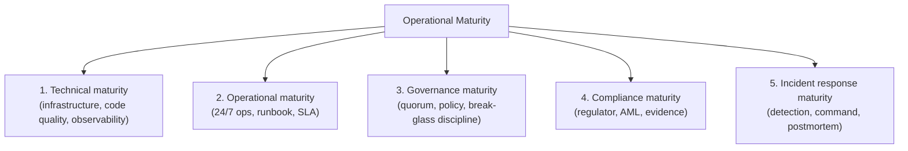
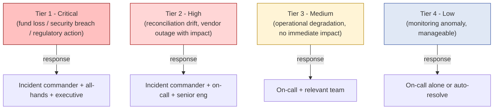
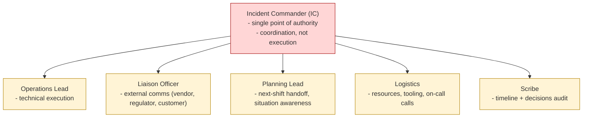
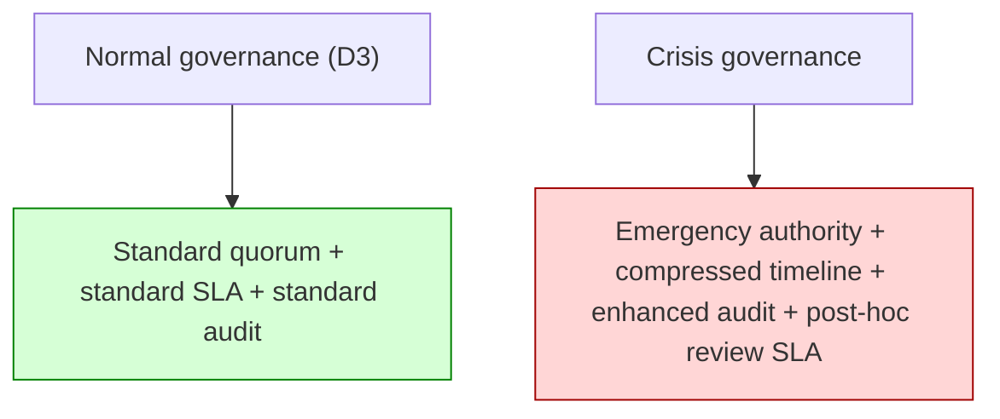
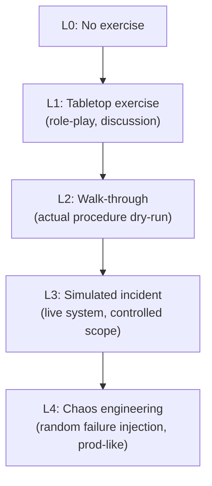
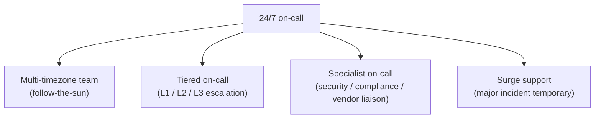
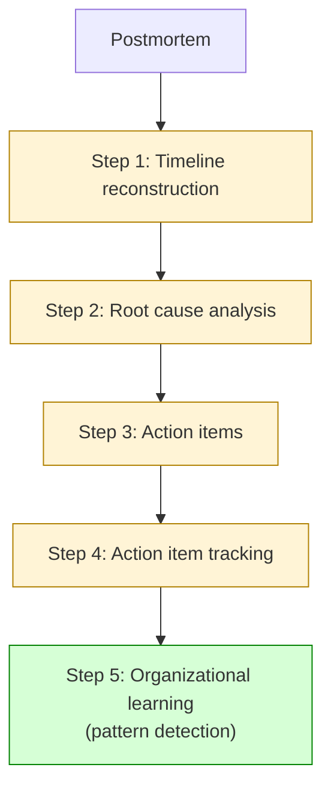

# Custody Wallet — Operational Maturity / Incident Command Reasoning

> **본 문서의 위치**: D6 의 organizational maturity 5-dimension 을 deep dive. Incident command / crisis governance / DR exercise / postmortem / on-call / escalation 의 generalized framework. D3 의 normal governance 와 별도의 **crisis governance** layer. D5 evidence + D11 compliance 의 incident-side application.

> **본 문서가 답하는 핵심 질문**: 왜 engineering uptime 이 operational survivability 가 아닌가? 왜 incident 의 "closed" 가 "resolved" 가 아닌가? 왜 crisis governance 가 accelerated normal governance 가 아닌가? 왜 runbook 이 stress 환경에서는 작동 안 할 수 있는가? 왜 operational maturity 가 organizational capacity 의 함수인가?

---

## 0. 핵심 명제 (10초 이해)

1. **Operational survivability is human-coordinated incident command under uncertainty, time pressure, and irreversible consequences.** — 본 문서의 thesis.
2. **10-tier "≠" 명제** — uptime / runbook / postmortem / on-call / incident closed / recovery exercised / 모두가 survivability 보장 아님.
3. **5-dimension maturity** (D6 §11.1 의 detail) — Technical / Operational / Governance / Compliance / Incident response 각각 distinct 의 capability.
4. **Crisis governance ≠ Accelerated normal governance** — 다른 authority + 다른 SLA + 다른 evidence requirement.
5. **Incident Command System (ICS)** — single-incident commander + clear role + 공식 transition.
6. **Tier-1/2/3 incident classification** — severity 별 다른 response + escalation.
7. **DR exercise = procedure muscle memory** — 정기 실행 없으면 procedure exists on paper, doesn't work in practice.
8. **Postmortem culture > postmortem document** — learning 의 organizational habit.
9. **Human fatigue = irreducible operational risk** — on-call rotation / surge support / cognitive load 의 design.
10. **Operational maturity = capability × consistency × institutional memory** — single dimension 아닌 composite.

---

## 1. 5-dimension Maturity Deep Dive

### 1.1 각 maturity 의 sub-indicator

| Maturity | Sub-indicators |
|---|---|
| **Technical** | code review depth / test coverage / observability stack / chaos engineering / architecture review |
| **Operational** | on-call rotation / SLA monitoring / runbook quality / runbook freshness / DR exercise cadence / change management |
| **Governance** | quorum coverage / approver training / policy review cadence / break-glass discipline / authority composition |
| **Compliance** | regulator relationship / KYC integration / AML provider / audit history / SAR pipeline |
| **Incident response** | mean time to detect (MTTD) / mean time to respond (MTTR) / postmortem culture / red team frequency / threat model freshness |

### 1.2 Maturity 의 4-level scale (★ Hypothesis — operational pattern)

| Level | 의미 |
|---|---|
| **L0 Ad-hoc** | No structured process; firefighting only |
| **L1 Defined** | Procedure exists, documented |
| **L2 Practiced** | Procedure regularly exercised |
| **L3 Optimized** | Procedure 가 measured + improved continuously |

→ "Documented" 와 "Practiced" 의 큰 gap — 실제 stress 환경에서 procedure 가 작동하려면 L2 이상.

### 1.3 "Technical capability ≠ Organizational readiness" (D6 §0.10 재확인)

- Engineering team 의 기술적 능력은 maturity 의 단일 dimension.
- Operational + governance + compliance + incident response 의 다른 dimension 부재 시 catastrophic failure.

---

## 2. Incident Classification

### 2.1 Tier 별 severity

### 2.2 10 incident category

| Category | Tier likely |
|---|---|
| Custody breach (key compromise) | T1 |
| Reconciliation drift incident | T2-T3 |
| Governance bypass attempt | T1-T2 |
| Reorg / chain incident | T2-T3 |
| Vendor outage | T2-T3 |
| Regulatory action / freeze order | T1-T2 |
| Insider compromise suspicion | T1 |
| Recovery incident (custodian unavailable) | T1-T2 |
| Compliance failure (sanctions miss) | T1-T2 |
| Public communications crisis | T2 |

### 2.3 "Incident closed ≠ Incident resolved"

(§0 명제)

- Closed = ticket marked closed.
- Resolved = root cause fixed + preventive action in place + postmortem completed.
- 차이가 organizational learning 의 gap.

---

## 3. Incident Command System (ICS)

### 3.1 ICS role structure

### 3.2 Single-IC principle

- 하나의 incident 에 single IC — 분산된 authority = chaos.
- IC 는 execution 안 함 — coordination + decision authority only.
- IC 의 succession plan (장시간 incident 의 shift handoff).

### 3.3 Scribe = evidence preservation

(D5 의 incident application)

- Scribe role 의 의무:
  - 시간순 event log
  - Decision + rationale 기록
  - Communications log
- → Postmortem + regulatory evidence 의 input.

### 3.4 Communications discipline

| Communication | 누구 |
|---|---|
| Internal updates | IC → team (via dedicated channel) |
| Customer updates | Liaison → customer support |
| Vendor updates | Liaison → vendor account manager |
| Regulator updates | Compliance officer + Liaison |
| Public updates | PR team (Liaison coordinates) |

→ **Communications discipline** = chaos 방지의 핵심.

---

## 4. Crisis Governance

### 4.1 "Crisis governance ≠ Accelerated normal governance"

(§0 명제)

### 4.2 Crisis governance 의 4 distinct

| Aspect | Normal | Crisis |
|---|---|---|
| Authority | Standard quorum | Emergency authority composition |
| SLA | hours-days | minutes-hours |
| Audit | Standard | **Enhanced** (more evidence, more witnesses) |
| Post-hoc review | Optional | **Mandatory within SLA** (e.g. 7 days) |

### 4.3 Pre-authorized crisis decisions

(★ Hypothesis — operational pattern)

- Normal authorization 의 SLA 가 crisis 에 너무 길 수 있음.
- 해결: pre-authorized crisis playbook
  - "If X happens, do Y" 의 pre-decided action
  - Quorum 이 미리 approve (책임 분담)
  - Crisis 시 IC 가 invoke
- → Reaction time 단축, governance 유지.

### 4.4 Communications under crisis

- Stakeholder별 communications template + escalation tree.
- Anti-pattern: silent crisis (customer 가 외부 channel 로 first 발견).
- Best practice: proactive customer notification + 정기 update + 명시적 closure.

---

## 5. DR Exercise

### 5.1 DR exercise 의 5 maturity level

### 5.2 "Documented procedure ≠ Practiced procedure" + "Recovery exercised ≠ Recovery proven"

(§0 명제)

- Documented procedure 가 paper 에 있음 ≠ team 이 사용 가능.
- DR exercise 의 발견:
  - Procedure step 의 ambiguity
  - Tool dependency 의 outdated (key rotation 안 됨)
  - Personnel turnover (담당자 떠남)
  - Environment drift (production 의 변화)
- → 정기 exercise 가 procedure 의 유지보수.

### 5.3 DR exercise frequency

(★ Hypothesis — operational pattern)

| Procedure | Frequency |
|---|---|
| Recovery ceremony (D4) | Annual + on-incident |
| Incident command rehearsal | Quarterly |
| Vendor failure simulation | Quarterly |
| Custodian quorum drill | Semi-annual |
| Compliance failure rehearsal | Annual |
| Chaos engineering | Continuous (production-safe) |

### 5.4 Exercise 의 evidence

- Each exercise 가 evidence chain (D5):
  - When / who / what scenario
  - Time taken / step success
  - Lessons identified
  - Action items + tracking
- → Exercise 자체가 audit evidence + maturity proof.

---

## 6. On-call Structure

### 6.1 24/7 coverage model

### 6.2 "On-call rotation ≠ 24/7 capability"

(§0 명제)

- Rotation 있음 ≠ effective coverage.
- 가능한 gap:
  - Single timezone 의 rotation (밤 시간 fatigue)
  - L1 만 있고 L2/L3 없음 (escalation gap)
  - Specialist coverage 부재 (security incident 처리 인력 없음)
- → Rotation 의 quality 가 maturity 결정.

### 6.3 On-call fatigue management

- Fatigue 의 source:
  - Frequent alerts (FP fatigue)
  - Long incident
  - 비논리적 schedule (back-to-back)
- Mitigation:
  - Alert tuning (reduce FP)
  - Adequate rest after major incident
  - Mandatory recovery time
  - Mental health support

### 6.4 Knowledge handoff

- Shift change 의 handoff 의 quality:
  - Active incident 의 context transfer
  - Pending issue 의 status
  - Recent decision + rationale
- → Documented handoff format + tools.

---

## 7. Postmortem Culture

### 7.1 "Postmortem written ≠ Learning happened"

(§0 명제)

### 7.2 Blameless postmortem principle

- "Who caused" 가 아닌 "what system allowed":
  - System / process gap 발견
  - Human error 는 system gap 의 indicator
  - Punishment 없으면 honest reporting
- → Blameless culture 가 learning 의 prerequisite.

### 7.3 Postmortem 의 anti-pattern

| Anti-pattern | 결과 |
|---|---|
| Single-person blame | Honest reporting 차단 |
| Action item without owner | 실행 안 됨 |
| Action item without deadline | 무기한 지연 |
| Documentation only learning | Pattern 인식 못함 |
| No follow-up review | Same incident 반복 |

### 7.4 Action item tracking

- Postmortem action item 의 status tracking:
  - Open / In-progress / Done / Cancelled (with reason)
  - 정기 review (monthly?)
  - Closure 의 verification (실제 fix 됐는가)

### 7.5 Pattern detection

- 여러 postmortem 의 cross-analysis:
  - 같은 root cause family 의 repeat?
  - 같은 system 의 frequent failure?
  - 같은 team 의 cognitive load?
- → Pattern detection 이 systematic improvement 의 입력.

---

## 8. Knowledge Management

### 8.1 Knowledge 의 form

| Form | 예 |
|---|---|
| Runbook | "Stuck withdrawal 처리 procedure" |
| Architecture documentation | D1a-D14 시리즈 |
| Postmortem archive | 과거 incident learning |
| Decision log | "Why we chose X over Y" |
| Threat model | "What can go wrong" |
| Tribal knowledge | (★ 가장 fragile) — 개인 의 mental model |

### 8.2 Tribal knowledge 의 위험

(★ Hypothesis — operational fragility)

- Senior 의 head 안에만 있는 knowledge.
- Person leaves → knowledge lost.
- Mitigation:
  - Forced documentation (예: incident 후 runbook update)
  - Pair programming / pair operations
  - Cross-training rotation

### 8.3 Runbook freshness

- Runbook 의 lifecycle:
  - Created at incident or design time
  - Decay over time (system changes, runbook stale)
  - 정기 review + update
- "Runbook exists ≠ Runbook works" — freshness 의 매년 check.

### 8.4 Documentation as code

(★ Hypothesis — emerging pattern)

- Documentation 을 code repository 에 — version control + review process.
- Architecture docs (D1a-D14) 도 living document.
- Stale documentation 의 detection (예: code change 가 doc update 강제).

---

## 9. Operational Fragility Map

```mermaid
graph TB
    F1["F1. Alert fatigue<br/>(false positive 폭증)"]
    F2["F2. On-call burnout<br/>(insufficient rest)"]
    F3["F3. Knowledge loss<br/>(senior turnover)"]
    F4["F4. Runbook decay<br/>(outdated procedures)"]
    F5["F5. Communication breakdown<br/>(crisis 시 information silo)"]
    F6["F6. Authority confusion<br/>(IC 의 not clear)"]
    F7["F7. Action item neglect<br/>(postmortem 후 follow-up 없음)"]
    F8["F8. DR exercise neglect<br/>(procedure 가 stale)"]
    F9["F9. Vendor dependency outage<br/>(critical vendor down)"]
    F10["F10. Human fatigue<br/>(prolonged incident)"]

    F1 -->|mitigation| M1["Alert tuning + tiered alerting + auto-resolve"]
    F2 -->|mitigation| M2["Adequate rotation + mandatory rest + surge support"]
    F3 -->|mitigation| M3["Forced documentation + pair operations + cross-training"]
    F4 -->|mitigation| M4["정기 review + docs-as-code + 'docs touch on change'"]
    F5 -->|mitigation| M5["Communications discipline + dedicated channels + IC authority"]
    F6 -->|mitigation| M6["Single IC + role clarity + succession plan"]
    F7 -->|mitigation| M7["Action item tracking + ownership + monthly review"]
    F8 -->|mitigation| M8["정기 exercise schedule + procedure version control"]
    F9 -->|mitigation| M9["Vendor diversity + fallback + SLA monitoring"]
    F10 -->|mitigation| M10["**Irreducible** — surge support + outside relief + IC succession"]
```

### 9.1 분류

| 분류 | items | 성격 |
|---|---|---|
| **Cognitive** | F1, F2, F10 | irreducible |
| **Knowledge** | F3, F4 | process discipline |
| **Coordination** | F5, F6 | structural |
| **Process** | F7, F8 | discipline + culture |
| **External** | F9 | irreducible |

---

## 10. Limitations

### 10.1 Engineering uptime ≠ Operational survivability

(§0 명제)

- Uptime = system 가 작동 시간.
- Survivability = incident / failure / crisis 에서 organization 의 행동.
- Uptime high 한 system 의 organization 이 crisis 에서 collapse 가능.

### 10.2 Best practice ≠ Maturity

- Adopt best practice (예: SRE / blameless postmortem / ICS) ≠ maturity 달성.
- 실제 muscle memory 가 maturity.

### 10.3 Tool exists ≠ Operator can use under stress

- Monitoring dashboard 정교해도 stress 시 사용 불가 가능.
- 정기 exercise 가 operator readiness 의 verification.

### 10.4 Compliance audit pass ≠ Operational maturity

- Compliance audit 은 specific dimension 의 check.
- Maturity 는 5-dimension composite.

---

## 11. 3-way Operational Maturity Burden

### 11.1 모델별 ownership

| 영역 | SaaS | Hosted MPC | Direct-build |
|---|---|---|---|
| Vendor uptime SLA | Vendor 책임 | Vendor 책임 | Customer 책임 |
| Customer on-call | Customer | Customer | Customer |
| Vendor incident coordination | Vendor + customer liaison | Customer + vendor | N/A |
| Customer-side incident | Customer | Customer | Customer |
| Recovery exercise | Customer + vendor cooperation | Customer | Customer |
| Postmortem culture | Customer | Customer | Customer |
| Knowledge management | Customer | Customer | Customer |

### 11.2 Customer burden (★ Hypothesis)

- SaaS: ~50% (vendor 가 infra incident; customer 가 own incident + compliance + governance + customer-side ops)
- Hosted MPC: ~75% (+ cosigner ops + integration incident)
- Direct-build: ~100% (+ infrastructure + chain incident + vendor liaison N/A)

→ Operational maturity 는 model 무관 customer 책임이 큰 영역. Vendor 가 자체 maturity 제공해도 customer 의 own maturity 가 필요.

### 11.3 Recommendation

| Context | 권장 |
|---|---|
| Small org, low complexity | SaaS + small ops team + outsourced on-call (보수적) |
| Medium org, regulated | Hosted MPC + dedicated ops + incident response team |
| Large org, high stakes | Direct-build + 24/7 SRE + dedicated security ops + chaos engineering |

---

## 12. Q1-Q10 Reasoning

### Q1. Engineering uptime ≠ Operational survivability

§10.1. Uptime 은 dimension 하나; survivability 는 crisis 시 행동.

### Q2. Crisis governance ≠ Accelerated normal governance

§4. 다른 authority + 다른 SLA + 다른 audit + mandatory post-hoc review.

### Q3. Documented ≠ Practiced

§5.2. Documentation 의 paper existence ≠ team 의 muscle memory.

### Q4. Recovery exercised ≠ Recovery proven

§5.2 (D4 §11.5 의 재확인). Exercise 가 capability 확인; survivability 는 capability + maintenance.

### Q5. Postmortem written ≠ Learning happened

§7.1. 5-step pipeline (timeline → root cause → action → tracking → pattern); document writing 은 step 1-3 만.

### Q6. On-call rotation ≠ 24/7 capability

§6.2. Rotation 의 quality (timezone, escalation tier, specialist) 가 effective coverage 결정.

### Q7. Incident closed ≠ Incident resolved

§2.3. Closed = ticket; Resolved = root cause + preventive action + postmortem.

### Q8. Tool exists ≠ Operator can use under stress

§10.3. Stress 환경에서 tool 사용은 정기 exercise 가 prerequisite.

### Q9. Single-IC principle 의 이유

§3.2. Multiple authority = chaos. Single IC = clear command. IC 는 coordination only, execution 안 함.

### Q10. Operational maturity 가 다른 maturity 의 prerequisite 인 이유

§1. 5-dimension 중 incident response 가 fail 하면 다른 maturity 의 work 가 무효 (incident 시 collapse).

---

## 13. Open Questions / Org Policy 영역

| 영역 | 질문 |
|---|---|
| On-call rotation length | 1-week / 2-week? |
| Tier 1 incident response SLA | 5min / 15min? |
| DR exercise frequency | quarterly / annual? |
| Postmortem action item closure SLA | 30d / 60d? |
| Crisis governance composition | who? quorum? |
| Pre-authorized crisis decisions | which? scope? |
| External communications template | who? format? |
| Customer notification SLA (during incident) | 30min / 60min? |
| Regulator notification SLA | per regulator |
| Vendor liaison | per vendor? |
| Tabletop exercise scenarios | which? frequency? |
| Chaos engineering scope | which systems? safe blast radius? |
| Postmortem publication policy | internal / customer / public? |
| Incident severity classification | tiering criteria? |
| Outside relief / surge support | how organized? |
| Mental health support | how integrated? |
| Documentation freshness review | annually? |
| Knowledge handoff format | template? |
| Cross-training requirements | per role? |
| Vendor uptime SLA | required floor? |

---

## 14. References + Uncertainty Boundary

### 관련 wiki

| 참조 |
|---|
| [[entities/fireblocks/admin-quorum]] §3 |
| [[vendors/fireblocks/risks]] §10 |
| [[docs/architecture/approval-state-machine-governance]] §4 (crisis vs normal governance) |
| [[docs/architecture/recovery-ceremony-generalization]] §5 (DR exercise) |
| [[docs/architecture/audit-event-sourcing-evidence-chain]] §3 (incident scribe = evidence) |
| [[docs/architecture/three-way-custody-decision-framework]] §11 (maturity dimensions) |
| [[docs/architecture/compliance-aml-sanctions-boundary]] §11 (human escalation irreducibility) |

### Uncertainty Boundary

- 5-dimension maturity / 4-level scale / 10 incident category / ICS structure / 5 DR exercise level / postmortem 5-step / 10 fragility / 80% burden 분포 = **generalized operational architecture pattern (Hypothesis ★)**.
- §1.2 4-level scale = operational reasoning, not industry standard.
- §11.2 burden 백분율 = operational reasoning estimate.
- §11.3 추천 = 운영 권장.
- §13 에 org policy 영역 명시.

### 다음 단계

- **D13 — Cross-border Settlement / FX / Liquidity Routing**
- D14 — Security / Threat Model / Adversarial Resilience

---

**Stage 32 D12 completion timestamp**: 2026-05-19.
