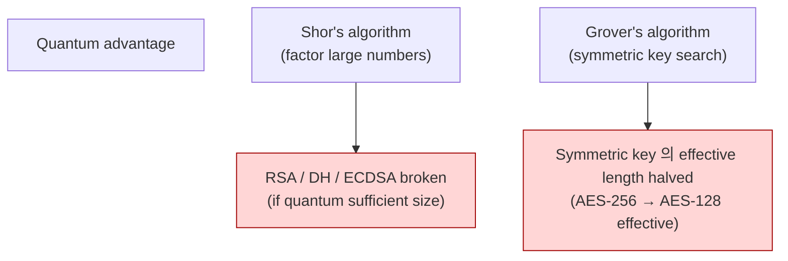
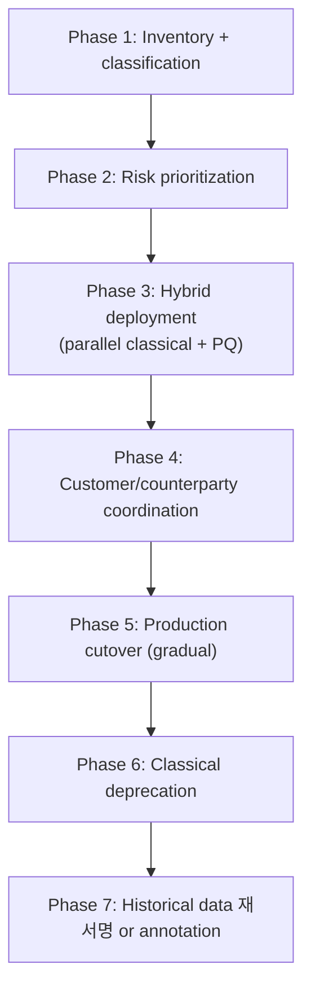
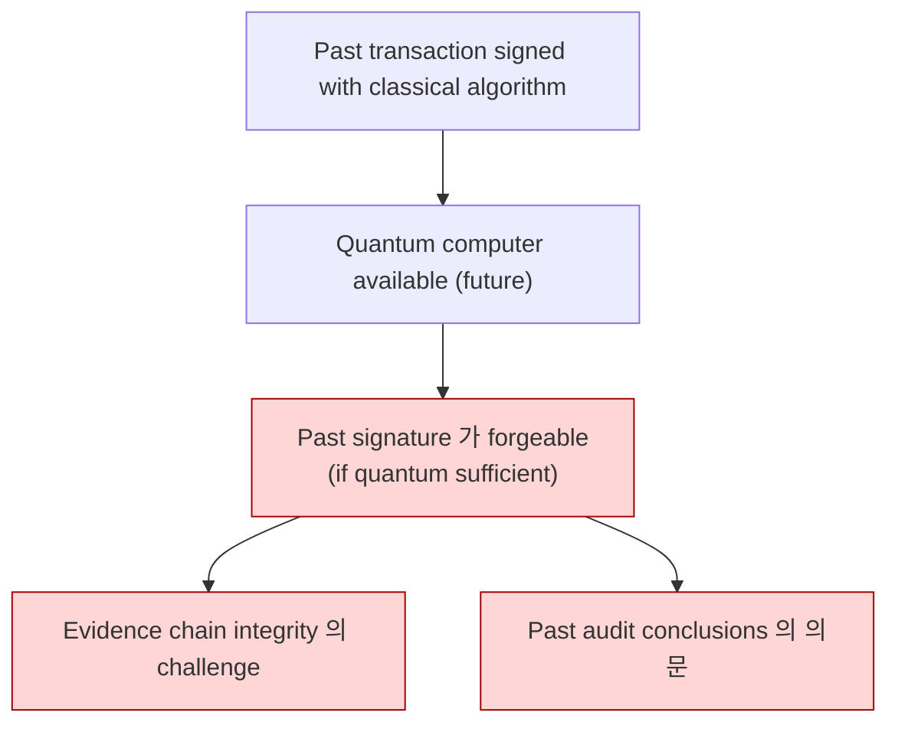
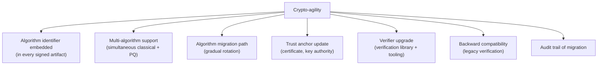
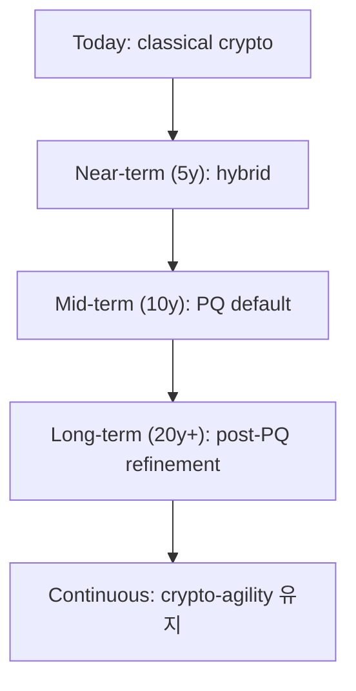
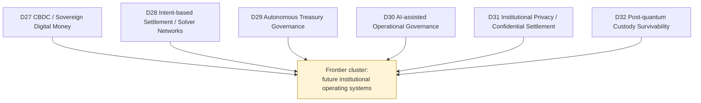

# Custody Wallet — Post-quantum Custody Survivability Reasoning

> **본 문서의 위치 (Frontier Cluster D32 — closing)**: D14 security + D4 recovery + D5 evidence + D31 confidentiality 위의 **post-quantum (PQ) survivability specialization**. Cryptographic migration 만의 문제 아닌 **institutional continuity under trust primitive disruption**. Frontier cluster 의 final layer.

> **본 문서가 답하는 핵심 질문**: 왜 algorithm upgrade 가 survivability 가 아닌가? 왜 PQ migration 이 institutional readiness 와 다른가? 왜 cryptographic strength 가 operational continuity 보장 아닌가? 왜 signature validity 가 historical trust continuity 가 아닌가? 왜 quantum resistance 가 governance survivability 보장 아닌가?

---

## 0. 핵심 명제 (10초 이해)

1. **Post-quantum survivability = institutional continuity under foundational trust primitive disruption** (core thesis).
2. **5-tier "≠" 명제 (D32 cluster closing)**:
   - Algorithm upgrade ≠ Survivability
   - PQ migration ≠ Institutional readiness
   - Cryptographic strength ≠ Operational continuity
   - Signature validity ≠ Historical trust continuity
   - Quantum resistance ≠ Governance survivability
3. **Quantum threat = foundational primitive disruption** — ECDSA / RSA / Diffie-Hellman 등 의 vulnerability.
4. **Migration timeline 의 uncertainty** — quantum advantage 의 timeline 가 unclear.
5. **Hybrid signature 의 transition pattern** — classical + PQ 결합 의 period.
6. **Historical signature 의 future verifiability** — past tx 의 PQ 검증 어려움.
7. **Multi-decade horizon** — custody 의 long-term commitment.
8. **Crypto-agility = mandatory** — algorithm migration 의 architectural readiness.
9. **Migration risk** = improper migration 의 catastrophic loss.
10. **Cluster closing** — frontier cluster 의 final aspect = survivability.

---

## 1. Quantum Threat Model

### 1.1 Quantum advantage 의 cryptographic impact



### 1.2 Custody 의 quantum-vulnerable primitives

| Primitive | Use in custody | Vulnerability |
|---|---|---|
| ECDSA (secp256k1, etc.) | Blockchain signatures | Shor's algorithm |
| RSA | Some legacy systems | Shor's |
| Diffie-Hellman | Key exchange | Shor's |
| AES-256 | Symmetric encryption | Grover (halved) |
| SHA-256 | Hashing | Grover (limited impact) |
| ECDH | Key agreement | Shor's |

### 1.3 Timeline uncertainty

(★ Hypothesis — emerging threat assessment)

- Current quantum computer: insufficient (qubit count, error rate).
- Threshold for practical attack: estimates 5-30+ years.
- "Harvest now, decrypt later" 의 위험: now-collected ciphertext 의 future decryption.
- → Migration urgency 의 unclear but non-zero.

### 1.4 "Quantum resistance ≠ Governance survivability"

(§0 명제)

- Quantum resistance: cryptographic property.
- Governance survivability: institutional continuity.
- 차이:
  - 가장 strong cryptographic system 도 institution 의 governance failure 시 fail
  - Crypto 의 perfect 이도 human / org failure 의 vulnerability
- → Crypto + Governance 의 결합.

### 1.5 "Cryptographic strength ≠ Operational continuity"

(§0 명제)

- Cryptographic strength: algorithm 의 mathematical security.
- Operational continuity: ongoing operation.
- 차이:
  - Strong algorithm 의 implementation bug
  - Strong algorithm 의 operational misuse
  - Algorithm 의 deployment 의 inability to migrate
- → Crypto 의 mathematical vs operational dimension.

---

## 2. Post-Quantum Cryptography Landscape

### 2.1 NIST PQC standardization

(★ Hypothesis — current state, evolving)

- NIST PQC competition 진행 중 (2016 시작, multiple rounds).
- 2022-2024 시기 standardization:
  - Kyber (ML-KEM): key encapsulation
  - Dilithium (ML-DSA): signature
  - SPHINCS+ (SLH-DSA): signature (hash-based)
  - Falcon (FN-DSA): signature
- → Multiple algorithm 의 simultaneous standardization.

### 2.2 PQC algorithm families

| Family | Examples | Properties |
|---|---|---|
| Lattice-based | Kyber, Dilithium, Falcon | Most efficient, structured |
| Hash-based | SPHINCS+ | Conservative, large signature |
| Code-based | Classic McEliece | Long history, large keys |
| Multivariate | (various, less standardized) | Niche |
| Isogeny-based | (SIKE broken) | Recent vulnerability |

### 2.3 Algorithm 의 trade-off

| Aspect | Classical (e.g. ECDSA) | PQ (e.g. Dilithium) |
|---|---|---|
| Signature size | Small (64-65 bytes) | Larger (2-4 KB) |
| Verification speed | Fast | Comparable |
| Key size | Small | Larger |
| Cryptographic confidence | Long history | Newer scrutiny |
| Storage cost | Low | Higher |
| Bandwidth cost | Low | Higher |

### 2.4 "Algorithm upgrade ≠ Survivability"

(§0 명제)

- Algorithm upgrade: 새 algorithm 의 적용.
- Survivability: institution 의 continuation.
- 차이:
  - Upgrade 의 process 자체 의 risk (migration period 의 vulnerability)
  - 새 algorithm 의 own bug / vulnerability
  - Operational disruption
- → Upgrade 는 step toward survivability, not equivalent.

### 2.5 Hybrid signature

- Classical + PQ 의 결합:
  - Both algorithms must pass = safe
  - PQ 의 vulnerability 시 classical 의 safety
  - Classical 의 quantum break 시 PQ 의 safety
- Trade-off: signature size + verification cost ↑↑.
- → Transition period 의 conservative approach.

---

## 3. Custody System 의 PQ Migration

### 3.1 Migration scope

```mermaid
graph TB
    SCOPE["PQ migration scope"]

    S1["Signing keys (MPC, HSM)"]
    S2["Encryption keys (data at rest)"]
    S3["TLS / network encryption"]
    S4["Audit signing (D5)"]
    S5["Treasury wallet (D17)"]
    S6["Customer authentication"]
    S7["Recovery utility (D4)"]
    S8["Cryptographic primitives in code"]
    S9["Vendor / third-party"]
    S10["Historical evidence (D5)"]
```



### 3.2 Migration 의 phased approach



### 3.3 "PQ migration ≠ Institutional readiness"

(§0 명제)

- PQ migration: technical algorithm replacement.
- Institutional readiness: org 의 capability to operate post-migration.
- 차이:
  - Technical 만 migrate, but governance / training / vendor 미준비
  - 또는 governance ready but technical 미준비
  - Both layers 필요
- → Holistic readiness.

### 3.4 Chain 의 PQ readiness

- Bitcoin: ECDSA-based, no native PQ.
- Ethereum: ECDSA-based, PQ 논의 진행.
- Newer chains: PQ-aware design possibility.
- → Chain-level PQ readiness 의 chain 의존 (custody 의 의 own control 밖).

### 3.5 Vendor / partner coordination

- Custody 의 own migration ≠ ecosystem migration.
- Vendor (chain, wallet, exchange) 의 own timeline.
- Coordination 의 challenge.
- → Multi-party migration 의 long process.

---

## 4. Historical Signature Survivability

### 4.1 Historical signature 의 challenge



### 4.2 "Signature validity ≠ Historical trust continuity"

(§0 명제)

- Current validity: signature 가 verifiable at time T.
- Historical trust continuity: 모든 시점에 the verification 가능.
- 차이:
  - Past signature 의 future verifiability 의 quantum threat
  - 새로 quantum-resistant signature 로 re-signing 어려움 (past intent 의 reconstruction)
- → Historical evidence 의 long-term value 의 challenge.

### 4.3 Mitigation strategy

| Strategy | 의미 |
|---|---|
| Re-signing | Past evidence 의 new PQ signature 추가 (whose signature?) |
| Hash anchoring | On-chain 의 anchor (chain 의 PQ readiness 필요) |
| Timestamp services | Trusted timestamp (D24 §3) |
| Multi-signature | Hybrid signature with PQ component |
| Evidence chain witness | Multi-witness 의 attestation |

### 4.4 "Harvest now, decrypt later"

- Adversary 가 current ciphertext 의 collection.
- Future quantum computer 의 decryption.
- 이미 valuable data 의 confidentiality loss possible.
- → Confidential data 의 PQ-readiness 의 urgency.

### 4.5 Legal evidence implications

- Historical contract 의 legal evidence:
  - Past digital signature 의 court admissibility
  - Quantum threat 시 의 re-verification challenge
- → Legal framework 의 evolving.

---

## 5. Crypto-Agility Architecture

### 5.1 Crypto-agility 의 component



### 5.2 Custody system 의 crypto-agility

- Each signature 의 algorithm identifier (e.g. "ECDSA-secp256k1", "Dilithium-2").
- Library 의 multi-algorithm support.
- Configuration-driven algorithm selection.
- Migration tooling.

### 5.3 Crypto-agility 의 limit

- Chain 의 algorithm 의 own constraint (chain 가 chosen).
- Vendor 의 algorithm 의존.
- → Crypto-agility 는 own scope + influence area.

### 5.4 Migration testing

- Each migration 의 testing:
  - Compatibility (old + new system)
  - Performance (signature size, verification time)
  - Security (audit of new implementation)
- → Migration risk 의 mitigation.

### 5.5 Reversibility

- Migration 후 issues 발견 시 rollback 가능?
- Hybrid signature 는 reversible (어느 쪽 사용해도 valid).
- Pure new algorithm 만 사용 시 reversal 어려움.
- → Reversibility 의 design.

---

## 6. Institutional Continuity Plan

### 6.1 Continuity 의 multi-decade horizon



### 6.2 Continuity 의 institutional element

| Element | 의미 |
|---|---|
| Cryptographic expertise | Long-term retention |
| Documentation | Algorithm choice rationale |
| Vendor management | PQ-capable vendor maintenance |
| Customer communication | PQ migration impact |
| Audit firm | PQ expertise |
| Regulator engagement | PQ requirement |

### 6.3 Skill / talent retention

- Cryptographic team 의 long-term continuity.
- Documentation + training.
- Cross-training to prevent single-person dependency.
- → Multi-decade continuity 의 human dimension.

### 6.4 Regulatory readiness

(★ Hypothesis — emerging regulation)

- 일부 regulator: PQ-readiness mandate (특히 financial sector).
- Audit + reporting requirement.
- Standardization adoption.
- → Regulatory alignment 의 strategy.

### 6.5 Industry coordination

- Cross-institution PQ migration coordination:
  - Standards adoption
  - Interoperability
  - Mutual support
- → Industry forum 의 participation.

---

## 7. Recovery System 의 PQ Considerations (D4 의 PQ 확장)

### 7.1 Recovery utility 의 PQ readiness

- Recovery utility (D4 §3.3 의 4-5 secret model) 의 cryptographic primitive.
- PQ-readiness 의 필요:
  - Long-term recovery (years-decade later 의 readiness)
  - Algorithm 의 backward compatibility
- → Recovery 의 multi-decade durability.

### 7.2 Backup encryption 의 PQ

- Encrypted backup 의 long-term decryption:
  - Today: AES-256 + classical KEM
  - Future: quantum threat 의 KEM
- Mitigation:
  - PQ KEM (e.g. Kyber)
  - Hybrid KEM (classical + PQ)
  - Key wrapping 의 PQ-readiness
- → Backup 의 PQ migration.

### 7.3 Custodian distribution 의 PQ

- Custodian 의 own cryptographic credentials.
- Custodian decision 의 signed (need PQ-compatible signature).
- → Custodian system 의 PQ migration.

### 7.4 Recovery utility 의 self-update

- Recovery utility 의 update capability:
  - 새 algorithm 의 support
  - 기존 backup 의 backward compatibility
- → Self-update 의 own integrity (signed updates).

### 7.5 Long-term archival

- Audit archive (D5 §8 의 multi-decade):
  - Encrypted with PQ-resistant.
  - Periodic re-encryption (algorithm refresh).
  - Tamper detection 의 PQ-based.
- → Long-term archive 의 PQ-aware design.

---

## 8. Operational Implications

### 8.1 PQ migration 의 operational cost

| Cost | 의미 |
|---|---|
| Storage | Larger key + signature size |
| Bandwidth | Larger data transfer |
| Compute | Verification 비교 |
| Migration effort | Multi-year project |
| Skill | PQ expertise hiring |
| Tooling | PQ-aware library + utility |
| Vendor | PQ-capable vendor cost |

### 8.2 Phased rollout 의 best practice

- Internal first (non-customer-facing)
- Sandbox + testing
- Limited customer (opt-in)
- Gradual scope expansion
- Full rollout
- Deprecation of classical

### 8.3 Customer impact

- Customer 의 own key (if PQ migration affects).
- Customer 의 verification capability.
- UX changes (key size 등).
- → Customer communication + support.

### 8.4 Performance optimization

- PQ algorithm 의 newer implementation:
  - Hardware acceleration
  - Batch verification
  - Caching
- → Performance gap 의 narrowing.

### 8.5 Audit firm 의 PQ readiness

- Auditor 의 PQ expertise.
- Audit methodology 의 PQ-aware update.
- → Auditor partnership 의 evolution.

---

## 9. Operational Fragility Map

```mermaid
graph TB
    F1["F1. Implementation bug in new PQ algorithm"]
    F2["F2. Migration interrupts customer service"]
    F3["F3. Historical signature 의 future invalidation"]
    F4["F4. Hybrid signature 의 complexity"]
    F5["F5. Vendor 의 PQ readiness gap"]
    F6["F6. Chain 의 PQ readiness 미진"]
    F7["F7. Skill / talent shortage"]
    F8["F8. Standard 의 unsettled"]
    F9["F9. Cost / performance overhead"]
    F10["F10. Reversibility 의 limit (post-migration)"]

    F1 -->|mitigation| M1["Multi-algorithm + extensive testing + audit"]
    F2 -->|mitigation| M2["Phased rollout + parallel period + rollback"]
    F3 -->|mitigation| M3["Re-signing + hash anchoring + multi-witness"]
    F4 -->|mitigation| M4["Standardization + tooling + automation"]
    F5 -->|mitigation| M5["Vendor diversity + early engagement"]
    F6 -->|mitigation| M6["Chain selection + advocacy + custody-layer mitigation"]
    F7 -->|mitigation| M7["Training + consulting + early hiring"]
    F8 -->|mitigation| M8["Conservative + monitoring standards + flexibility"]
    F9 -->|mitigation| M9["Optimization + selective application"]
    F10 -->|mitigation| M10["Backward compatibility + hybrid period"]
```



---

## 10. Limitations

### 10.1 Algorithm upgrade ≠ Survivability

§2.4.

### 10.2 PQ migration ≠ Institutional readiness

§3.3.

### 10.3 Cryptographic strength ≠ Operational continuity

§1.5.

### 10.4 Signature validity ≠ Historical trust continuity

§4.2.

### 10.5 Quantum resistance ≠ Governance survivability

§1.4.

### 10.6 Timeline uncertainty

§1.3. Practical quantum threat 의 timeline 의 unknown.

### 10.7 Migration 자체 의 risk

- Improper migration 의 catastrophic loss possibility.
- Cautious approach 의 importance.

---

## 11. 3-way Frontier Burden (D32)

### 11.1 Plane × Ownership

| 영역 | SaaS | Federated | Sovereign |
|---|---|---|---|
| Algorithm selection | Vendor + customer | Customer | Customer |
| Migration execution | Vendor partial + customer | Customer | Customer |
| Crypto-agility infrastructure | Vendor + customer | Customer | Customer |
| Historical data | Customer | Customer | Customer |
| Skill / talent | Customer | Customer | Customer |
| Regulator engagement | Customer | Customer | Customer |

### 11.2 Customer PQ burden (★ Hypothesis)

- SaaS: ~75%
- Federated: ~90%
- Sovereign: ~100%

### 11.3 Recommendation

| Context | 권장 |
|---|---|
| Conservative | Monitor + plan + delay |
| Standard | Hybrid signature preparation |
| Mature institutional | Active migration + crypto-agility |
| Frontier / high-value | Aggressive PQ adoption + research engagement |

---

## 12. Cluster Closing Summary (D27-D32)

### 12.1 6-document cluster integration



### 12.2 Cluster thesis 재확인

> **The next generation of institutional systems emerges where custody, liquidity, governance, computation, and sovereignty converge.**

- D27: sovereign monetary 의 redesign
- D28: coordination 의 market-driven delegation
- D29: governance 의 programmable
- D30: operations 의 AI-assisted
- D31: privacy 의 selective visibility
- D32: cryptographic trust 의 future-proofing

### 12.3 Cluster invariant 의 통합 (30 "≠")

| Document | ≠ propositions |
|---|---|
| **D27** | Digital fiat ≠ CBDC / Programmable ≠ Efficient / Sovereign control ≠ Survivability / Visibility ≠ Certainty / Interoperability ≠ Unification |
| **D28** | Intent ≠ Guaranteed / Solver opt ≠ User sovereignty / Delegated exec ≠ Delegated risk / Routing ≠ Certainty / Abstraction ≠ Coordination elim |
| **D29** | Automation ≠ Governance elim / Autonomous exec ≠ Autonomous accountability / Optimization ≠ Safety / Policy automation ≠ Correctness / Machine governance ≠ Survivability |
| **D30** | Recommendation ≠ Authority / Prediction ≠ Truth / Visibility ≠ Understanding / Assistance ≠ Delegation / Explainability ≠ Accountability |
| **D31** | Privacy ≠ Opacity / Confidentiality ≠ Non-auditability / Hidden state ≠ Hidden liability / Selective disclosure ≠ Trust elim / Encrypted ≠ Survivable |
| **D32** | Algorithm upgrade ≠ Survivability / PQ migration ≠ Institutional readiness / Crypto strength ≠ Operational continuity / Sig validity ≠ Historical trust / Quantum resistance ≠ Governance survivability |

### 12.4 Cluster fragility integration

- D27: sovereign abuse / centralized infra / cross-CBDC / surveillance / capital flight / programmability complexity / etc.
- D28: front-running / collusion / unfulfilled / default / MEV / cross-chain / etc.
- D29: policy bug / sensor manipulation / runaway / skill atrophy / cascade / etc.
- D30: hallucination / vendor failure / prompt injection / over-reliance / leakage / bias / etc.
- D31: crypto break / key mgmt / privacy budget / lawful access / audit access / etc.
- D32: implementation bug / migration interrupt / historical sig / hybrid complexity / etc.

→ Cluster cumulative fragility: frontier-domain 의 multi-layer risk.

### 12.5 Cluster customer burden

| Document | Customer burden (★ Hypothesis) |
|---|---|
| D27 | ~60-100% |
| D28 | ~70-100% |
| D29 | ~80-100% |
| D30 | ~85-100% |
| D31 | ~75-100% |
| D32 | ~75-100% |

→ Frontier cluster 의 burden 의 model 에 따라 variable, but 의 high in all.

### 12.6 Frontier 의 common pattern

| Pattern | 의미 |
|---|---|
| **Emerging maturity** | Early-stage technology + adoption |
| **Trust evolution** | Trust primitive 의 redesign |
| **Coordination challenge** | Multi-party / multi-jurisdiction |
| **Cautious adoption** | Gradual + reversible |
| **Skill / talent** | Specialized expertise |
| **Regulatory uncertainty** | Evolving framework |

### 12.7 Frontier 의 critical principle

- 모든 frontier domain 의 reasoning 의 underlying invariant:
  - Conservative 의 institutional approach
  - Human accountability 의 retention
  - Survivability > efficiency
  - Evidence > convenience
  - Uncertainty acknowledgment
- → Hype 회피, fundamentals 유지.

---

## 13. Architecture reasoning corpus 완성

### 13.1 33 documents 의 final structure

| Cluster | Documents | Theme |
|---|---|---|
| Foundation skeleton | D1a, D1b, D2, D3, D4, D5, D6, D7, D8 | what custody is |
| Single specialization | D9-D14 | how custody runs |
| Trust cluster | D15, D16, D24 | how custody is verifiable |
| Liquidity cluster | D17-D20 | how custody scales monetary |
| Crisis cluster | D21-D23, D25, D26 | how custody fails and survives |
| **Frontier cluster** | **D27-D32** | **how custody evolves into future** |

→ **33 documents = comprehensive generalized custody architecture corpus**.

### 13.2 Cluster integration final thesis

| Cluster | Final statement |
|---|---|
| Foundation | Custody = evidence-producing settlement governance system |
| Infrastructure | Custody runs across chain/monetary/compliance/operational/cross-border/security domains |
| Trust | Trust = operationally reconstructed property across evidence, identity, reporting |
| Liquidity | Liquidity = operationally routable settlement capacity under governance + risk |
| Crisis | Survivability = residual institutional capability after core assumption collapse |
| **Frontier** | **The next institutional generation emerges where custody, liquidity, governance, computation, and sovereignty converge — under conservative survivability discipline** |

### 13.3 Common reasoning invariant across all 33

- Evidence-first reasoning
- Append-only invariant
- Trust-boundary separation
- Cross-domain consistency
- Human operational irreducibility
- Sovereignty / governance separation
- Uncertainty boundary
- Survivability > efficiency

### 13.4 Common anti-pattern across all 33

- Single-vendor / single-system reliance
- Technical optimization over institutional discipline
- Hype framing
- Static vs dynamic perspective
- Steady-state over failure-state focus

---

## 14. Limitations

### 14.1 Frontier 의 emerging status

- 모든 frontier domain 은 actively evolving.
- 본 문서들의 reasoning 은 current understanding.

### 14.2 Speculative 의 nature

- Future-oriented reasoning 의 inherent speculation.
- Hypothesis ★ marking 의 importance.

### 14.3 Adoption uncertainty

- 어떤 frontier 가 mainstream 이 될지 unknown.
- 어떤 frontier 가 obsolete 가 될지 unknown.

---

## 15. References + Uncertainty Boundary + Final

### 관련 wiki

| 참조 |
|---|
| [[docs/architecture/security-threat-model-adversarial-resilience]] (D14) |
| [[docs/architecture/recovery-ceremony-generalization]] (D4) |
| [[docs/architecture/audit-event-sourcing-evidence-chain]] (D5) |
| [[docs/architecture/institutional-privacy-confidential-settlement]] (D31) |
| [[docs/architecture/cbdc-sovereign-digital-money]] (D27) cluster predecessor |
| Plus all D27-D31 in frontier cluster |

### Uncertainty Boundary

- 본 문서는 **emerging + speculative** — PQ threat timeline 의 uncertainty.
- Quantum vulnerable primitives / 5 PQ family / 7-phase migration / 7 crypto-agility component / 10 fragility / 75% burden = **generalized PQ architecture pattern (Hypothesis ★)**.
- §1.3 timeline = active research area.
- §2.1 NIST standardization = current state, evolving.
- §11.2 burden 백분율 = estimate.
- §13 에 frontier policy 영역 명시.

### Cluster Closing — Frontier Cluster Final

D27-D32 Frontier / Emerging Institutional Systems cluster **완성**.

**Cluster 최종 정의 (sentence)**:
> The next generation of institutional systems emerges across sovereign monetary redesign (D27), market-driven coordination delegation (D28), programmable governance (D29), AI-assisted operations (D30), selective visibility privacy (D31), and quantum-survivable cryptographic trust (D32) — all under conservative survivability discipline that retains human accountability, evidence-first reasoning, and acknowledges deep uncertainty.

### Architecture reasoning corpus 최종 완성 (33 documents)

```
D-series corpus:
  Foundation     [D1a, D1b, D2, D3, D4, D5, D6, D7, D8]       9 docs
  Specialization [D9, D10, D11, D12, D13, D14]                6 docs
  Trust          [D15, D16, D24]                              3 docs
  Liquidity      [D17, D18, D19, D20]                         4 docs
  Crisis         [D21, D22, D23, D25, D26]                    5 docs
  Frontier       [D27, D28, D29, D30, D31, D32]               6 docs
  ───────────────────────────────────────────────────────────────
  Total                                                      33 docs
```

---

**Stage 32 D32 completion timestamp**: 2026-05-20.
**Stage 32 D-series corpus 완성 timestamp**: 2026-05-20.
