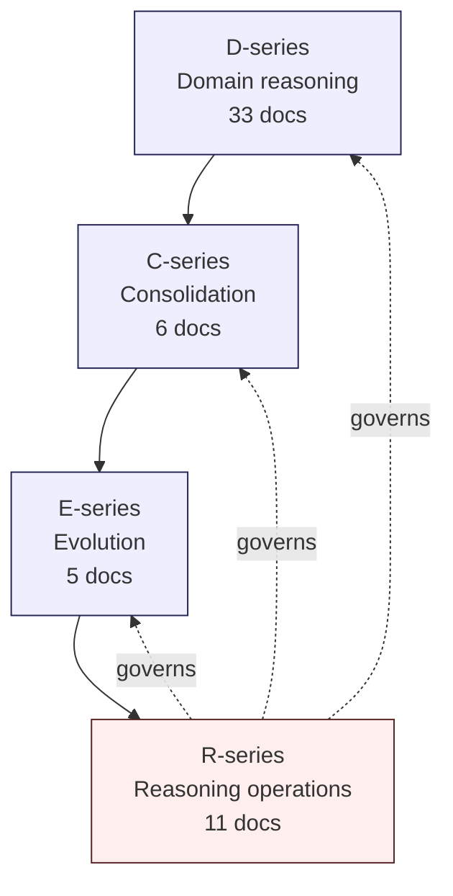

# R0 — Reasoning Operations Charter

> Generalized — institutional WaaS architecture corpus, reasoning operations layer.
> All generalized reasoning is ★ Hypothesis.
> No vendor claim. No ideology framing. No "final truth" claim. No reduction of uncertainty.

---

## 0. Position in the corpus

The corpus has grown from a vendor-deepening artifact (Fireblocks) into a 44-document
generalized architecture reasoning corpus organized into three layers:

- **D-series (33 docs)** — Domain reasoning (Foundation / Specialization / Trust / Liquidity / Crisis / Frontier clusters)
- **C-series (6 docs)** — Consolidation / meta-architecture (index / invariants / dependencies / anti-patterns / reading paths / open questions)
- **E-series (5 docs)** — Evolution (incident-driven / regulatory / AI pressure / frontier discipline / knowledge survivability)

The D/C/E corpus is **publication state**, not **completion state**.

What was missing until Stage 33 was the layer that governs **how the corpus is used, retrieved, reasoned over, contested, evolved, and preserved across decades**.

This is the **R-series — Reasoning Operations Layer**.

---

## 1. Core thesis

> More documents ≠ better reasoning.
> Corpus scale introduces retrieval noise, ontology drift, contradiction risk, stale assumptions, and reasoning fragmentation.

A 44-document corpus that grows to 100+ over a decade is **a different kind of artifact** from a single architecture deck or a short architecture playbook. At scale, the dominant risk is no longer **missing knowledge** — it is **misuse of present knowledge**.

The R-series operationalizes the corpus as a **governed institutional reasoning system**, not a static publication artifact.

---

## 2. ≠ propositions (charter level)

- Static corpus ≠ governed corpus
- Publication ≠ operationalization
- Retrieval ≠ reasoning
- Citation ≠ proof
- Coherent corpus ≠ correct corpus
- Multi-decade survival ≠ multi-decade integrity
- AI-assisted reasoning ≠ AI-delegated reasoning
- Living document ≠ continuously rewritten document
- Reader trust ≠ corpus authority
- Corpus update ≠ corpus improvement

The R-series exists because each of these distinctions is **non-obvious to a corpus reader, a corpus contributor, or an AI assistant**, and each conflation is **a known failure mode** in long-lived institutional knowledge systems.

---

## 3. R-series structure

| R# | Document | Concern |
|----|----------|---------|
| R0 | Reasoning Operations Charter (this doc) | Position, scope, governance entry-point |
| R1 | Retrieval Discipline Architecture | How knowledge is surfaced — conservatively |
| R2 | Corpus Reasoning Flow | How a question becomes an answer |
| R3 | Contradiction Management Discipline | How disagreement is classified, preserved, resolved |
| R4 | Ontology Stability Discipline | How vocabulary/concepts survive concept drift |
| R5 | Evolution Governance Model | Who can change the corpus, when, with what authority |
| R6 | Knowledge Decay / Staleness Taxonomy | What ages fast, what ages slow, how decay is signaled |
| R7 | Historical Worldview Preservation Strategy | How old assumptions remain inspectable |
| R8 | Human Review Boundary / Escalation Criteria | Where AI-assistance stops and humans take over |
| R9 | AI-assisted Reasoning Constraints | What AI must not do on this corpus |
| R10 | Failure Modes of Long-lived Architecture Corpora | Corpus-level anti-patterns |

R-series is **operations**, not **architecture**.
D/C/E describe the institutional architecture.
R describes how the corpus itself is operated.

---

## 4. Folder topology (suggested)

Current state: flat `/docs/architecture/`.

Recommended evolution (★ Hypothesis — adopt only if maintainers prefer; flat is also defensible):

```
docs/
  architecture/
    d-series/                  # Domain reasoning
      foundation/              # D1a, D1b, D2, D3, D4, D5, D6
      specialization/          # D7, D8, D9, D10, D11, D12, D13, D14
      trust/                   # D15, D16, D24
      liquidity/               # D17, D18, D19, D20
      crisis/                  # D21, D22, D23, D25, D26
      frontier/                # D27, D28, D29, D30, D31, D32
    c-series/                  # Consolidation
    e-series/                  # Evolution
    r-series/                  # Reasoning operations
    _history/                  # Snapshots (R7)
    _ontology/                 # Term / concept registry (R4)
    _contradictions/           # Open contradiction registry (R3)
    _stewardship/              # Review cadence + reviewer log (R5)
```

Why the underscored prefixes:
- Operational artifacts (not reading material).
- Visually segregated from reasoning content.
- File-system listing order keeps reading content first.

Migration ★ Hypothesis: file moves require redirect notes (e.g., `vault-wallet-ledger-db-schema.md` → `d-series/foundation/d1a-vault-wallet-ledger-db-schema.md`). Migration itself is a Type-2 change (R5) and requires human review.

---

## 5. Corpus lifecycle model

```
PROPOSED  →  ACTIVE  →  STABLE  →  SUPERSEDED  →  HISTORICAL
                ↘   AMENDED   ↗            ↓
                                       ARCHIVED (not deleted)
```

Lifecycle states (★ Hypothesis — institutional adoption requires steward agreement):

- **PROPOSED** — draft, in review, not yet retrievable as authoritative.
- **ACTIVE** — published, retrievable, citable.
- **AMENDED** — updated; prior version preserved (R7).
- **STABLE** — reviewed N consecutive cycles without amendment; preferred citation source.
- **SUPERSEDED** — replaced by a newer doc; remains retrievable with a "see also" pointer.
- **HISTORICAL** — preserved for worldview inspection; explicitly marked as not current.
- **ARCHIVED** — moved out of active retrieval index; never deleted.

**Hard rule:** Documents are never deleted. Worldview preservation (R7) requires that even retracted reasoning remains inspectable. The only justified deletion is for legal/compliance redaction, and even then a redaction notice replaces the document.

---

## 6. Operational invariants

The R-series commits the corpus to ten operational invariants. These are stronger than principles — they are conditions for the corpus to remain a corpus (rather than degrading into a wiki, a marketing doc, or a vendor catalog).

1. **Conservative retrieval.** Top-k embedding hit is never authoritative without re-ranking and citation review.
2. **Hypothesis preservation.** ★ marks survive document amendments. Promotion to fact requires R5 governance.
3. **Contradiction preservation.** Apparent and real contradictions are catalogued, not silently resolved.
4. **Ontology stability.** Core terms (Vault, Wallet, Ledger, Policy, Signing, Approval) are versioned, not renamed.
5. **Worldview preservation.** Every reasoning assertion is `as-of` dated; historical worldviews remain retrievable.
6. **Human accountability.** Charter, ontology change, contradiction Type-3 resolution, and sunset declarations are human-only.
7. **AI bounded reasoning.** AI may retrieve, summarize, draft, and detect — never decide, rewrite, or close.
8. **Survivability priority.** Survivability > elegance; institutional continuity > novelty.
9. **No closure-by-claim.** "Corpus complete" is itself a failure mode (R10).
10. **No vendor recapture.** Reasoning never collapses back to a single vendor's terminology, capability surface, or marketing frame.

---

## 7. Relationship to D / C / E



- D produces the **content**.
- C produces the **meta-structure** of the content.
- E produces the **evolution thesis** for the content.
- R produces the **discipline of operating** on the content, including how D/C/E themselves evolve.

R does **not** reason about wallets, custody, signing, or settlement. R reasons about **how the corpus is queried, contested, preserved, and stewarded**.

---

## 8. What R-series is NOT

★ Hypothesis (charter clarifications, not constraints on future maintainers):

- R-series is **not a retrieval engine implementation**. It is a discipline specification. Implementation is left to the steward institution.
- R-series is **not a content-management system**. It is a governance model. Tools come and go; the discipline persists.
- R-series is **not an AI agent specification**. R9 constrains AI behavior on the corpus; it does not prescribe how AI agents are built or selected.
- R-series is **not a publishing system**. C5 defines reading paths; R defines how those paths are governed against drift.
- R-series is **not a final answer**. R itself evolves under the same governance it specifies (R5).

---

## 9. Reading order (for first-time R-series readers)

1. **R0** (this doc) — orientation.
2. **R10** — read failure modes early; they motivate everything else.
3. **R1** — retrieval discipline (what most operators will touch first).
4. **R2** — reasoning flow (how questions become answers).
5. **R8 + R9** — human / AI boundary (operators integrating LLM assistants must read this pair together).
6. **R3 + R4** — contradiction + ontology (slow-burn risks).
7. **R6 + R7** — decay + history (multi-year horizon).
8. **R5** — governance (read last, but enforced first).

This is intentionally **not** alphabetical. Failure modes (R10) come early because reading R1-R9 without them produces optimism bias — readers underestimate why the discipline is needed.

---

## 10. Anti-pattern: charter inflation

★ Hypothesis: charters that grow over time degrade. The charter must remain short enough to be re-read in a single sitting (under ~600 lines). When the charter exceeds that length, the response is to **move detail into R1-R10**, not to expand R0.

This charter is the **stable** layer of R-series. R1-R10 are the **operational** layer. R0 is allowed to evolve at the speed of decades; R1-R10 may evolve at the speed of years.

---

## 11. Closing invariant

> The corpus is not a publication. It is an institution.
> Publication is what makes it readable. Operations are what make it survive.

R-series is the layer that converts "we wrote 44 documents" into "we run a multi-decade institutional reasoning system". The conversion is not automatic — it must be governed.

R0 declares the governance. R1-R10 define it. The corpus carries it.

★ Hypothesis: Without an R-series, every long-lived architecture corpus eventually collapses into one of the failure modes catalogued in R10. The R-series does not prevent collapse — it makes collapse **visible**, **slow**, and **recoverable**.

That is the most honest claim the charter can make.
