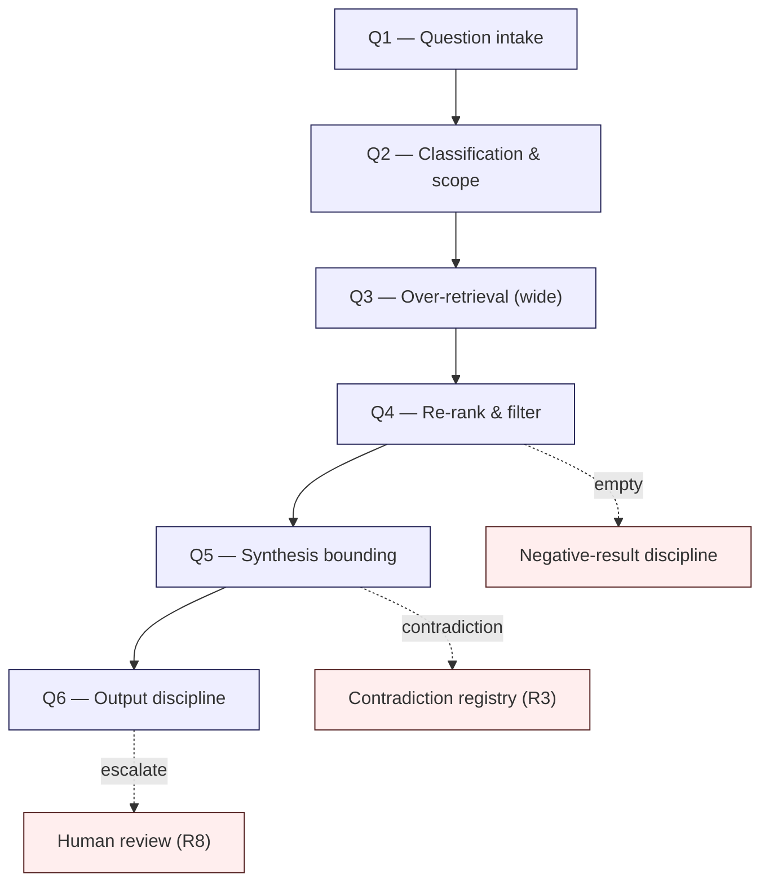

# R1 — Retrieval Discipline Architecture

> Generalized — institutional WaaS architecture corpus, retrieval discipline layer.
> All generalized reasoning is ★ Hypothesis.
> No vendor claim. No "perfect embedding" assumption. No "single source of truth" absolutism.

---

## 0. Why retrieval needs discipline

The corpus has 44+ documents averaging 500-2000 lines each. By Stage 33, the corpus contains:

- ~200+ ≠ propositions
- ~50+ overlapping concepts (Vault appears in D1a, D4, D5, D6, D14, D32; Approval appears in D3, D5, D6, D11, D29, D30)
- ~30+ cluster bridge invariants
- Multiple hypothesis-marked claims that **resemble** confirmed claims in retrieval-time semantics

Naïve retrieval (top-k cosine similarity over embedded chunks) over this corpus produces three predictable failures:

1. **Plausible irrelevance** — retrieves a chunk that is semantically close but contextually wrong (e.g., a Frontier doc retrieved for a Foundation question).
2. **Authoritative-looking hypothesis** — retrieves a ★ chunk whose ★ marker is in a different chunk, producing a fact-shaped output.
3. **Cluster collapse** — retrieves chunks from a single cluster when the question requires bridging.

R1 specifies the **discipline** that prevents these failures. It does **not** specify the retrieval engine. ★ Hypothesis: any retrieval implementation that does not meet these disciplines is unsuitable for this corpus, regardless of benchmark performance.

---

## 1. Core thesis

> Retrieval over an architecture corpus is a **judgment problem**, not a similarity problem.
> Conservative retrieval over-fetches and filters; never trusts top-1; always shows uncertainty; preserves negative results loudly.

---

## 2. ≠ propositions

- Retrieval ≠ search
- Semantic similarity ≠ semantic relevance
- Top-k embedding hit ≠ canonical reference
- Retrieved chunk ≠ corpus context
- Retrieval confidence ≠ answer confidence
- High-similarity match ≠ authoritative match
- Fluent answer ≠ retrieval-grounded answer
- "Not retrieved" ≠ "not in corpus"
- "Not in corpus" ≠ "does not exist"
- Cited excerpt ≠ verified claim

---

## 3. Retrieval pipeline discipline

Six stages. Each stage has a **disciplined behavior** and a **named failure mode**.



### Stage Q1 — Question intake

- Capture the question **verbatim**.
- Capture the asker's **role context** (operator, auditor, regulator, engineer, researcher, executive) when known.
- Do **not** rewrite the question for retrieval. Reformulate **alongside** the original, not in place of it.

Failure mode: silent rephrasing introduces retrieval bias. The asker no longer recognizes the question being answered.

### Stage Q2 — Classification & scope

Classify the question (★ Hypothesis — minimum viable taxonomy):

- **Factual** — "What is the definition of X in the corpus?"
- **Architectural** — "How does X relate to Y across clusters?"
- **Decision-support** — "Should we adopt X?" / "Is X safe?"
- **Speculation** — "What if X happened?"
- **Meta** — "Where does the corpus say X?" / "Is X in the corpus?"

Each class triggers different retrieval scope:

| Class | Retrieval scope | Default layer priority |
|-------|-----------------|------------------------|
| Factual | Narrow, definition-anchored | D > C |
| Architectural | Cross-cluster, bridge-aware | D + C |
| Decision-support | Wide, includes anti-patterns | D + C4 + E + R |
| Speculation | Frontier + open questions | D-frontier + C6 + E4 |
| Meta | Index + reading paths | C1 + C5 |

Failure mode: applying factual-class retrieval to a decision-support question retrieves accurate but insufficient context.

### Stage Q3 — Over-retrieval

**Over-fetch by design.** Retrieve at least 2-3× the chunks the answer will use. Reason: it is cheaper to filter out irrelevant chunks than to recover a missed chunk.

★ Hypothesis: practical minimum is k=20-30 chunks for an architecture question over a 44-doc corpus. Less invites recall failure.

Constraints:
- Retrieval must cover all relevant clusters, not just the highest-similarity cluster.
- Retrieval must include **at least one** chunk from C2 (invariants) and C4 (anti-patterns) for any decision-support question.
- Retrieval must include at least one ★ Hypothesis chunk for any speculation question.

Failure mode: cluster collapse — all retrieved chunks come from the same cluster, hiding the bridge invariants the question requires.

### Stage Q4 — Re-rank & filter

Re-ranking is **mandatory**. Embedding similarity alone is insufficient. Re-rank signals (★ Hypothesis — institution-specific weights):

- **Layer authority** — D > C > E > R for factual; C > D > E > R for architectural meta-questions.
- **Recency** with **decay-class awareness** (R6). Class-A invariants ignore recency; Class-D specifics weight recency heavily.
- **Citation density** — chunks cited by C2 / C3 are more authoritative than uncited document body.
- **Hypothesis penalty** — ★-marked chunks are demoted for factual questions, promoted for speculation questions.
- **Anti-pattern proximity** — chunks adjacent to a C4 anti-pattern are flagged for caution.

Failure mode: re-ranking that optimizes for fluency-of-answer instead of evidential-strength produces confident-sounding wrong answers.

### Stage Q5 — Synthesis bounding

Synthesis must respect three bounds:

1. **No claim without retrieval-grounding.** Every assertion in the answer must trace to retrieved chunks. Anything that does not is either (a) a stated extrapolation, (b) a stated ★ Hypothesis, or (c) deleted.
2. **No hypothesis promotion.** A ★ Hypothesis in retrieved content cannot become a fact in the answer. The ★ marker must survive.
3. **Contradiction surfaced, not hidden.** If retrieved chunks disagree, the synthesis must explicitly name the disagreement and refer to R3.

Failure mode: synthesis "smoothing" — the model averages contradicting chunks into a fluent-but-false consensus.

### Stage Q6 — Output discipline

Output must include (★ Hypothesis — 6-section answer template, mirroring `feedback_answer_template`):

1. **Concise core answer** — what the corpus says, in plain language.
2. **Operational detail** — how it works, where applicable.
3. **Confirmed vs hypothesis separation** — explicit ★ markers preserved.
4. **Bounds of the answer** — what the corpus does not address.
5. **Promotion targets** — where the user might need to promote a hypothesis to a fact (and why).
6. **Recommendation / next read** — pointer to C5 reading paths.

Every output must carry **citations** (document name + section). Citations are not decorations — they are the proof that retrieval discipline was followed.

---

## 4. Layered retrieval

Different corpus layers require different retrieval discipline:

| Layer | Retrieval behavior |
|-------|-------------------|
| **D-series** | Default retrieval surface. Cluster-aware. |
| **C-series** | Retrieve as **filter / bridge / anti-pattern reference**, not as primary content. |
| **E-series** | Retrieve when the question is **about evolution, change, or pressure**, not state. |
| **R-series** | Retrieve only when the question is about **the corpus itself** (meta). |

Most operator-facing questions are D + C retrievals. E and R are minority retrievals and should be marked as such in the answer.

★ Hypothesis: R-series retrieval should be rare in normal operations. High R-series retrieval frequency is a **signal** — either the corpus is being misused (meta-questions instead of architecture questions) or the discipline itself is being contested.

---

## 5. Re-ranking discipline

Re-ranking is where retrieval becomes conservative.

**Re-ranking signals (★ Hypothesis composite score):**

```
score = α * embedding_similarity
      + β * layer_authority
      + γ * citation_density
      + δ * recency * decay_class_weight
      - ε * hypothesis_penalty
      - ζ * anti_pattern_proximity_for_unsafe_actions
```

Weights must be **institution-specific** and **periodically reviewed** (R5). No universal weighting exists. ★ Hypothesis: the act of choosing weights is itself a governance act, not an engineering optimization.

**Reranker integrity:**

- A reranker that uses an LLM as judge must **not** see the user's question phrased as "find the best chunk." It must see **"score each chunk's evidential strength for this claim,"** because the former optimizes for plausibility, the latter for evidence.
- Reranker outputs must be **inspectable** — operators must be able to ask "why was this chunk ranked first?" and get a reasoned answer, not a similarity score.

---

## 6. Citation discipline

Every retrieved answer must:

- Cite **document + section** (e.g., `D3 §4`, `C2 inv-12`, not just `D3`).
- Cite **layer** when retrieval crosses layers.
- Mark **citation type**: `[fact]`, `[★ hypothesis]`, `[anti-pattern]`, `[open question]`, `[evolution observation]`.
- Distinguish **direct quote** from **synthesis paraphrase**.

★ Hypothesis: citation discipline is the single most operationally enforceable retrieval discipline. Without it, all other R1 disciplines are unverifiable.

---

## 7. Negative-result discipline ("not in corpus")

When retrieval finds nothing relevant, the answer must say so **loudly**:

```
The corpus does not address X.
Searched: D1a, D2, D6, C1, C5.
Reason for searching there: [rationale].
This is a corpus gap, not an architectural verdict.
Promotion candidate: see R5 governance for new-doc proposal.
```

Failure modes prevented:
- **Silent fabrication** — model invents an answer to compensate for retrieval failure.
- **Confident absence** — model says "X is not relevant" when it actually means "X was not retrieved."
- **Quiet downgrade** — model treats absence as a verdict instead of a corpus gap.

A negative result is **information**, not failure.

---

## 8. Empty retrieval ≠ definitive absence

★ Hypothesis: there are at least four reasons retrieval may be empty:

1. **Genuine corpus gap** — corpus does not address this.
2. **Retrieval miss** — corpus addresses this but retrieval failed (embedding mismatch, query phrasing, scope filter).
3. **Stale removal** — corpus did address this but R6 sunset moved it to historical (R7).
4. **Topical exclusion** — corpus deliberately does not address this (e.g., vendor-specific implementation).

The answer must distinguish these four. Treating all empty retrievals as case (1) is a serious failure mode.

---

## 9. Retrieval over historical worldviews

When the question is about **"what did the corpus say in 2027?"** retrieval must:

- Retrieve from **historical snapshots** (R7), not current docs.
- Mark all results as **historical, not current**.
- Refuse to synthesize historical + current chunks into a single answer.

The two reasoning modes — **current state** and **historical worldview** — are different retrieval contexts. Mixing them is silent rewrite (R10 failure mode).

---

## 10. Retrieval failure budget

★ Hypothesis: every retrieval implementation has a failure rate. Stewards should adopt an explicit **retrieval failure budget**:

- Recall failures (missed relevant chunk) — accepted at low rate; mitigated by over-retrieval.
- Precision failures (irrelevant chunk surfaced) — accepted at higher rate; mitigated by re-ranking and citation discipline.
- **Confidence failures** (low-evidence answer presented as high-confidence) — **zero tolerance**. These are R9 violations.

A retrieval system that achieves 95% recall and 80% precision is **acceptable** for operations as long as confidence calibration is honest. A retrieval system that achieves 99% recall and 99% precision but **collapses ★ markers** is **unacceptable** for this corpus.

The acceptability test is not benchmark score. It is **whether the answer's confidence matches its evidence**.

---

## 11. Anti-patterns (retrieval-specific)

These belong in C4 (anti-pattern catalog) and are summarized here:

- **Top-1 reliance.** Answer based on single highest-similarity chunk without re-ranking or cross-cluster fetch.
- **Embedding monoculture.** Single embedding model used without periodic re-evaluation against ground-truth queries.
- **Citation-free synthesis.** Answer with no document references.
- **★-stripping synthesis.** Hypothesis marker dropped during paraphrase.
- **Contradiction smoothing.** Disagreement between chunks resolved silently by averaging.
- **Layer collapse.** All retrieval from one layer, missing cross-layer bridge invariants.
- **Recency bias.** Newest chunk preferred regardless of decay class.
- **Hypothetical promotion.** ★ Hypothesis upgraded to fact in synthesis output.
- **Fluency-over-fidelity.** Reranker tuned for answer quality instead of evidential support.
- **Silent fallback.** When retrieval is empty, model fills from general knowledge instead of disclosing the gap.

---

## 12. Operational signals to monitor

★ Hypothesis: stewards should track these continuously:

- Average chunks-retrieved per query (target: high; warn if low).
- Citation density per answer (target: high; warn if low).
- ★ Hypothesis preservation rate (target: 100%; warn if any drop).
- Negative-result rate (informational — sudden spike may signal corpus drift or query drift).
- Cross-cluster retrieval ratio (target: question-dependent; warn if cluster collapse trend).
- Reranker disagreement-with-embedding rate (informational — too low = reranker not adding value).
- Human-escalation rate (target: non-zero; zero is a signal R8 is being bypassed).

---

## 13. Relationship to other R docs

- **R2** — uses R1 retrieval discipline as input to the reasoning flow.
- **R3** — R1 detects contradictions during over-retrieval and surfaces them; R3 governs handling.
- **R4** — R1 retrieval relies on ontology stability; ontology drift breaks retrieval recall.
- **R6** — R1 re-ranking respects decay classes; R6 defines them.
- **R7** — R1 distinguishes current vs historical retrieval; R7 defines historical snapshots.
- **R8** — R1 escalation triggers feed into R8 human-review criteria.
- **R9** — R1 disciplines constrain AI behavior; R9 enforces them.
- **R10** — R1 violations are listed as failure modes in R10.

---

## 14. Closing invariant

> Retrieval is the surface where the corpus meets the user.
> Every other R-series discipline assumes retrieval is conservative, cited, and honest about absence.
> A corpus with weak retrieval discipline is a corpus that **cannot be trusted at scale, even if every document is correct**.

★ Hypothesis: the dominant failure mode of long-lived architecture corpora is not bad content — it is good content surfaced badly. R1 exists to prevent that.
