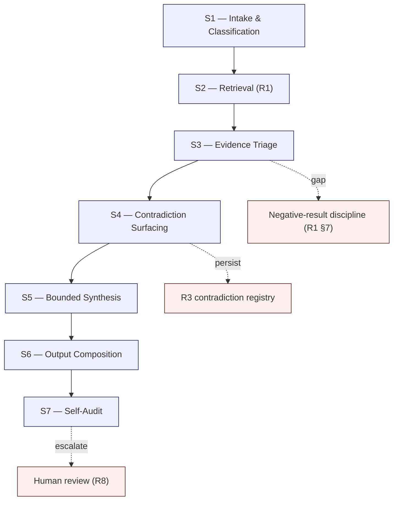

# R2 — Corpus Reasoning Flow

> Generalized — institutional WaaS architecture corpus, reasoning flow layer.
> All generalized reasoning is ★ Hypothesis.
> No "fully autonomous reasoning" claim. No "single-shot answer" claim. No "AI as oracle" framing.

---

## 0. Why reasoning needs a flow

R1 governs **how knowledge is surfaced**.
R2 governs **how surfaced knowledge becomes an answer**.

The distinction matters because retrieval-grounded systems frequently fail **after** retrieval, not during it. The retrieved chunks may be correct; the synthesis may still be wrong. Wrong synthesis modes include:

- **Smoothing** — averaging contradictions into a fluent middle.
- **Confident extrapolation** — extending a ★ Hypothesis into a fact.
- **Cross-cluster collapse** — losing bridge invariants in paraphrase.
- **Premature closure** — answering before the question class is determined.
- **Decision-support drift** — answering a factual question with a decision recommendation.

R2 specifies the **reasoning flow** that turns a retrieval result into an answer that the corpus can stand behind.

---

## 1. Core thesis

> Reasoning over an architecture corpus is a **multi-stage discipline**, not a generative act.
> Each stage has a named output, a named failure mode, and a named escalation path.
> Reasoning that skips stages produces fluent answers that the corpus cannot defend.

---

## 2. ≠ propositions

- Question intake ≠ user input
- Retrieval result ≠ answer material
- Synthesis ≠ paraphrasing
- Answer ≠ summary
- Confidence ≠ certainty
- Decision recommendation ≠ corpus position
- Fluent answer ≠ defensible answer
- Citation ≠ proof
- Closure ≠ resolution
- "Done answering" ≠ "answered well"

---

## 3. The 7-stage reasoning flow

Each stage has a **named output**. Skipping a stage means an output is missing — and that absence is detectable.

---

## 4. Stage S1 — Intake & classification

**Input:** raw user question + role context (when known).
**Output:** classified question + retrieval scope envelope.

Classification taxonomy (★ Hypothesis — minimum viable; institutions may extend):

| Class | Signal | Default flow modifier |
|-------|--------|----------------------|
| Factual | "What is...", "How is X defined..." | Narrow scope; D > C |
| Architectural | "How does X relate to Y...", "What happens when..." | Cross-cluster; D + C |
| Decision-support | "Should we...", "Is X safe...", "Which of..." | Wide scope; D + C2 + C4 + E |
| Speculation | "What if...", "Could..." | Frontier + open-question; D-frontier + C6 + E4 |
| Meta | "Does the corpus...", "Where is X in..." | C1 + C5 + R |
| Historical | "What did the corpus say in YEAR...", "How has X evolved..." | R7 historical snapshots only |

**Failure modes:**
- **Misclassification** — factual question routed as decision-support produces unsolicited recommendations.
- **No classification** — flow proceeds without scope envelope; retrieval becomes generic.
- **Silent class promotion** — meta question silently promoted to architectural question, retrieving content instead of corpus structure.

**Escalation trigger:** if the question cannot be classified, escalate to R8 before retrieval. Never default-classify.

---

## 5. Stage S2 — Retrieval

**Input:** classified question + retrieval scope envelope.
**Output:** over-retrieved chunk set with re-rank ordering, citations, and ★/anti-pattern flags.

Governed by R1. R2 does not redefine retrieval; it consumes R1 output.

**Required R2 checks on R1 output:**
- Retrieval count ≥ R1 minimum (★ Hypothesis: k=20 typical for architectural questions).
- At least one C2 chunk if question is architectural or decision-support.
- At least one C4 anti-pattern chunk if question is decision-support.
- Empty retrieval routed to R1 §7 negative-result discipline, not S3.

**Failure modes:**
- **Insufficient breadth** — under-retrieval not detected at S2 propagates to fluent-but-thin answers.
- **Anti-pattern omission** — decision-support flow proceeds without surfacing known anti-patterns.

---

## 6. Stage S3 — Evidence triage

**Input:** re-ranked chunk set.
**Output:** evidence dossier with labeled chunks.

Each chunk is labeled:

- `[fact]` — confirmed corpus claim (no ★ in source).
- `[★ hypothesis]` — generalized reasoning marker preserved.
- `[anti-pattern]` — chunk warns against an action.
- `[open question]` — chunk explicitly marks unresolved territory (C6).
- `[evolution observation]` — chunk describes corpus change (E-series).
- `[bridge invariant]` — chunk crosses clusters.
- `[historical]` — chunk from a past worldview (R7).
- `[meta]` — chunk about the corpus itself (C / R).

**Failure modes:**
- **Label collapse** — synthesis treats all chunks as fact-class.
- **★ stripping** — hypothesis marker not propagated to the evidence dossier.
- **Historical contamination** — historical chunks mixed with current chunks without label.

S3 produces the **labeled dossier**. S5 synthesis is **forbidden** from operating on unlabeled chunks.

---

## 7. Stage S4 — Contradiction surfacing

**Input:** labeled evidence dossier.
**Output:** contradiction inventory (possibly empty) + classification per R3.

S4 does **not** resolve contradictions. It **detects** and **classifies** them. Resolution is governed by R3 (Type-1 apparent → resolvable; Type-2 evolved → preserve history; Type-3 real → escalate; Type-4 definitional → ontology check via R4; Type-5 inter-cluster → architecture review).

**Required:**
- If any contradiction is Type-3 or Type-5, S5 synthesis **must** present both positions explicitly. Silent resolution is forbidden.
- If contradiction is Type-2 (evolved), S5 synthesis must mark the historical position as superseded but not erased (R7).
- All contradictions, regardless of type, are appended to the open contradiction registry (R3 §6).

**Failure modes:**
- **Contradiction smoothing** (R1 §11) — disagreement averaged into a fluent middle.
- **Silent resolution** — model picks one side without disclosure.
- **Re-ranking masking** — reranker demotes the contradicting chunk so it never reaches S4.

★ Hypothesis: contradiction surfacing is the most important quality signal in long-lived corpus reasoning. A reasoning system that never produces contradictions is either too small to disagree with itself or actively hiding disagreement.

---

## 8. Stage S5 — Bounded synthesis

**Input:** labeled dossier + contradiction inventory.
**Output:** draft answer skeleton + uncertainty boundary statement.

**Bounds (★ Hypothesis — operational constraints):**

1. **Citation rule** — every assertion must trace to ≥1 labeled chunk.
2. **★ preservation rule** — ★ Hypothesis cannot be promoted in synthesis.
3. **Layer rule** — D claims dominate; C/E/R claims are framed as meta-position, not subject content.
4. **Contradiction rule** — Type-3 / Type-5 contradictions must be named.
5. **Uncertainty rule** — synthesis must declare what the corpus does **not** address relevant to the question.
6. **Recommendation rule** — if class is decision-support, synthesis offers options + trade-offs, never single-best-action absolutes.
7. **Speculation rule** — if class is speculation, synthesis marks **every** sentence with ★ unless it directly cites a confirmed corpus fact.

**Failure modes:**
- **Smoothing** (already named in S4 — recurs at S5 if S4 was thorough but S5 ignored).
- **Promotion** (★ → fact).
- **Layer drift** (E observation presented as D claim).
- **Recommendation drift** (factual or architectural class answered with unsolicited decision recommendation).
- **Closure overreach** (synthesis declares the answer "complete" instead of bounded).

---

## 9. Stage S6 — Output composition

**Input:** draft skeleton + uncertainty boundary.
**Output:** final answer in 6-section template.

The 6-section template (mirroring `feedback_answer_template`):

1. **Concise core answer** — 2-5 sentences. Plain language. Survives at 10-second read.
2. **Operational detail** — how it works in the corpus model. Cite documents inline.
3. **Confirmed vs hypothesis** — explicit split. ★ markers preserved.
4. **Answer bounds** — what the corpus does not address, relevant to this question.
5. **Promotion candidates** — where the user might need to upgrade a hypothesis to a verified fact (and why this corpus can't).
6. **Recommendation / next read** — C5 path pointer + adjacent documents.

★ Hypothesis: the 6-section template is the minimum that lets an operator read the answer in 10 seconds (Section 1) **and** an auditor reconstruct the reasoning trace (Sections 2-6). Removing any section collapses one of those audiences.

**Citation discipline at S6:**
- Document + section level (e.g., `D6 §4.2`, not `D6`).
- Label-class marked (`[fact]` / `[★ hypothesis]` / etc.).
- Layer indicated when crossing layers.

---

## 10. Stage S7 — Self-audit

**Input:** completed 6-section output.
**Output:** audit verdict — `READY`, `REVISE`, or `ESCALATE`.

Self-audit checks (★ Hypothesis — minimum viable):

| Check | Threshold |
|-------|-----------|
| Every assertion cited? | 100% |
| ★ markers preserved? | 100% |
| Question class respected (no recommendation drift)? | Pass/fail |
| Contradictions surfaced (if any in dossier)? | Pass/fail |
| Uncertainty boundary declared? | Pass/fail |
| Recommendation only if class is decision-support? | Pass/fail |
| All retrieved layers traceable in output? | Informational |
| Layer attribution honest (E not presented as D)? | Pass/fail |

**Verdicts:**
- **READY** — all checks pass; output emitted to user.
- **REVISE** — at least one check fails on a fixable axis; return to S5 with diagnostic.
- **ESCALATE** — check failure is not safely fixable by the reasoning system (e.g., Type-3 contradiction encountered, charter question raised, corpus gap detected on safety-critical decision); route to R8.

S7 is the gate. An answer that skips S7 is an undisciplined answer.

---

## 11. Escalation triggers (when reasoning must stop)

Reasoning must stop and route to R8 (human review) when:

1. Question class is **decision-support** and retrieval surfaces **anti-patterns** for the proposed action.
2. **Type-3** or **Type-5** contradiction is detected and the question requires choosing between sides.
3. Corpus has a **gap** on a safety-critical axis (loss-of-funds risk, regulatory exposure, ceremony integrity).
4. Question requests a **charter** or **ontology** change (R0, R4).
5. Question requests **hypothesis promotion** ("Is X actually true?" where X is ★).
6. Question is **historical** and historical snapshot is incomplete or missing (R7).
7. Question asks for **vendor recommendation** (R10 failure mode: vendor recapture).
8. Answer self-audit (S7) fails on **pass/fail** axes after one revise cycle.

Escalation is not failure. Escalation is **discipline**. ★ Hypothesis: a reasoning system that never escalates is a reasoning system that has silently absorbed all the failures it should have surfaced.

---

## 12. Reasoning trace (audit-friendly)

Every executed reasoning flow must produce a **trace**:

- Question class (S1 verdict)
- Retrieval parameters (R1 query, scope envelope, k)
- Retrieved chunk IDs + scores + labels (S2 output → S3 dossier)
- Contradiction inventory (S4 verdict)
- Synthesis bounds applied (S5 verdict)
- Output (S6 final)
- Self-audit verdict (S7)
- Escalation status

Traces are stored — not for retrieval but for **post-hoc audit**. Auditing a corpus reasoning system requires being able to reconstruct **why** an answer was given. Without traces, the reasoning is unauditable, and an unauditable reasoning system is not institutionally usable.

★ Hypothesis: trace storage cost is modest (text), but trace **availability** is the only honest defense against "the model made it up" criticism. Stewards should treat traces as a first-class output.

---

## 13. Reasoning over speculation

Speculation-class questions ("What if X?") are reasoning's most failure-prone mode. The corpus addresses this with strict rules at S5:

- **Every** synthesis sentence is ★ unless directly cited from confirmed fact.
- The answer must begin with: "The following is speculative; the corpus does not commit to this position."
- Decision-support extensions of speculation answers are **forbidden** unless the user explicitly converts the question.
- C6 (open questions) is the primary retrieval source.

Failure modes:
- **Confidence inflation** — speculative answer presented in operational voice.
- **Bootstrapping** — speculative answer cited later as if it were established corpus position (R10 failure mode).

★ Hypothesis: speculation answers should carry a **non-retrievable marker** — speculation answers must not be indexed back into the corpus as retrievable content. They are session artifacts, not corpus artifacts.

---

## 14. Reasoning under uncertainty

The reasoning flow must produce **calibrated uncertainty**, not maximum confidence.

Calibration discipline:

- If retrieval breadth is wide but agreement is high → high confidence answer permitted.
- If retrieval breadth is wide and agreement is low → contradiction-surfaced answer, medium confidence.
- If retrieval breadth is narrow and chunks are ★-heavy → low-confidence answer marked as such.
- If retrieval is empty → negative-result discipline (R1 §7); not an answer.

The system must **say "I don't know with confidence"** when that is true. ★ Hypothesis: this is the single hardest behavior to enforce in LLM-backed reasoning, and the single most important.

---

## 15. Reasoning flow vs prompt engineering

R2 is **not** a prompt template. It is a **discipline specification**.

Implementations may realize R2 via:
- Sequential LLM calls per stage.
- Tool-augmented reasoning (retrieval tool + reranker tool + audit tool).
- Human-in-the-loop at S4 / S7 only.
- Multi-agent orchestration.

★ Hypothesis: implementation freedom is essential. Stewards must not lock the corpus to one reasoning architecture, because that architecture will be obsolete in 5-10 years while the corpus persists for decades.

---

## 16. Anti-patterns (reasoning-flow specific)

- **Single-shot answering.** Generative response to user query without S1-S7 stages.
- **Hidden retrieval.** Answer drawn from model training rather than corpus retrieval, with retrieval as cosmetic.
- **Closure-by-fluency.** Answer "feels complete" therefore S7 audit is skipped.
- **Citation theater.** Citations attached after the fact, not driving synthesis.
- **Trace skipping.** Reasoning trace not stored or not inspectable.
- **Escalation suppression.** Threshold for R8 escalation set too high to avoid friction.
- **Confidence inflation.** Speculation answered in operational voice.
- **Recommendation creep.** Factual question answered with decision recommendation.
- **Layer impersonation.** E observation rendered as D claim.
- **Ontology drift.** Synthesis uses terms in senses not consistent with R4 ontology.

---

## 17. Relationship to other R docs

- **R1** — provides retrieved evidence; R2 consumes.
- **R3** — receives contradictions from S4; defines classification used by S4 and S5.
- **R4** — provides ontology used in S5/S6 synthesis term-checking.
- **R6** — feeds decay-class awareness into S5 confidence calibration.
- **R7** — gates S3 historical-chunk handling.
- **R8** — receives S7 ESCALATE verdicts.
- **R9** — constrains S5/S6/S7 AI behavior.
- **R10** — catalogs reasoning-flow failure modes.

---

## 18. Closing invariant

> An answer is not a generative artifact. It is a disciplined output of a multi-stage process.
> Every stage produces a named output. Skipping a stage means an output is missing.
> An undisciplined answer that happens to be correct is still undisciplined — the corpus cannot defend it.

★ Hypothesis: reasoning flow discipline is the difference between a corpus that informs decisions and a corpus that decorates them.
