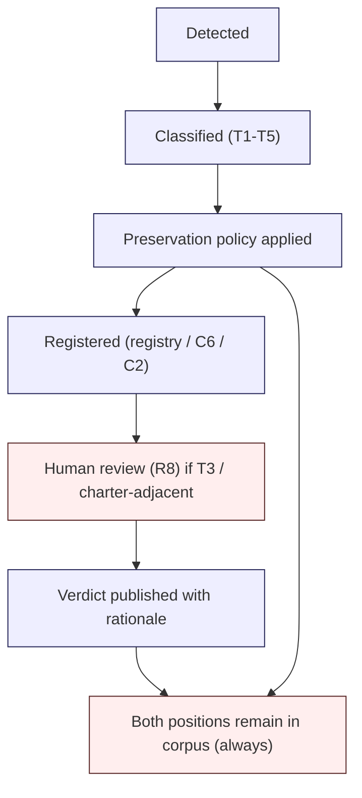

# R3 — Contradiction Management Discipline

> Generalized — institutional WaaS architecture corpus, contradiction management layer.
> All generalized reasoning is ★ Hypothesis.
> No "consensus = correctness" assumption. No "newer = truer" assumption. No silent resolution.

---

## 0. Why contradictions are inevitable

A 44-document corpus written across 30+ stages **will** accumulate contradictions. They arise from:

- **Concept evolution** — what "Vault" meant in early Foundation docs may differ from what it means after Frontier docs.
- **Different abstraction layers** — D1a operational view and D32 post-quantum view may use the same term differently.
- **Different time horizons** — E-series evolution docs describe **changes** that visibly contradict static D-series claims.
- **Cluster-local optima** — Liquidity cluster trade-offs differ from Crisis cluster trade-offs.
- **Genuine open questions** (C6) — contradictions that have not been resolved and may not be resolvable.

A corpus that **claims** to have no contradictions is either (a) too small to disagree with itself, (b) actively hiding contradictions, or (c) collapsing nuance into false consensus. None of those is healthy.

R3 governs how contradictions are detected, classified, surfaced, preserved, and — sometimes — resolved.

---

## 1. Core thesis

> A contradiction is information, not failure.
> Apparent contradictions reveal terminology drift.
> Evolved contradictions reveal worldview shift.
> Real contradictions reveal architectural disagreement that must be preserved.
> Silent resolution is the most dangerous corpus action.

---

## 2. ≠ propositions

- Contradiction ≠ error
- Apparent contradiction ≠ real contradiction
- Resolution ≠ deletion
- Newer ≠ truer
- Consensus ≠ correctness
- Hidden contradiction ≠ resolved contradiction
- Contradiction detection ≠ contradiction adjudication
- Position A vs Position B ≠ winner vs loser
- Open contradiction ≠ failed corpus
- Resolved contradiction ≠ forgotten contradiction

---

## 3. The 5-type contradiction classification

| Type | Name | Cause | Handling |
|------|------|-------|----------|
| **T1** | Apparent | Terminology / phrasing collision; underlying claims agree | Annotate, link, optionally clarify |
| **T2** | Evolved | Earlier doc + later doc reflect worldview shift | Preserve both; mark superseded; R7 |
| **T3** | Real / Unresolved | Two corpus positions genuinely disagree | Preserve both; escalate R8; register in C6 |
| **T4** | Definitional | Same term used in two senses across documents | Ontology fix via R4 |
| **T5** | Inter-cluster | Different clusters optimize for different goals; positions diverge | Preserve; document the trade-off explicitly |

Each type has a **different resolution discipline**. Misclassifying type is itself a failure mode.

---

## 4. Type T1 — Apparent contradiction

**Signal:** Two chunks **seem** to disagree but, on inspection, address different scopes, different objects, or different operational contexts.

**Examples (★ hypothetical):**
- D2 says "signing is multi-round MPC"; D32 says "signing reduces to single-shot post-quantum primitives." Apparent — D2 describes pre-quantum; D32 describes post-quantum era.
- D3 says "approval state machine is monotone"; D29 says "autonomous treasury approval is reversible." Apparent — D29 defines a different state machine for a different class of decision.

**Handling:**
- Annotate both chunks with a **disambiguation note** (`[T1 — see also <doc§>]`).
- No content deletion.
- No "winner."
- Optional: add a C2 invariant clarifying the scope distinction if the apparent contradiction is likely to recur in retrieval.

**Failure modes:**
- **Premature escalation** — T1 misclassified as T3 and routed to human review, generating false governance load.
- **Silent merge** — both chunks rewritten into a single "unified" sentence, losing the scope distinction.

---

## 5. Type T2 — Evolved contradiction

**Signal:** Doc A (older) and Doc B (newer) describe **the same object** with **different positions**, and the newer reflects a deliberate corpus evolution (incident-driven via E1, regulatory via E2, AI pressure via E3).

**Examples (★ hypothetical):**
- D14 v1 (2026) describes threat model assuming honest-but-curious co-signers; D14 v2 (post-incident, 2029) describes threat model assuming actively malicious co-signers under coercion.
- D11 v1 describes sanctions screening as point-in-time; D11 v2 (post-2030 regulatory update) describes it as continuous obligation.

**Handling:**
- Doc A is moved to **historical** lifecycle state (R7).
- Doc B is published as current.
- Doc A is **not deleted**. It remains retrievable via historical retrieval path.
- Doc B carries a **supersession header**: "Supersedes Doc A as of <date>. Reason: <evolution source>. See R7 for historical retrieval."
- Doc A carries a **superseded footer**: "This document represents the corpus position as of <date>. See Doc B for current position. Preserved for worldview inspection (R7)."

**Failure modes:**
- **Silent rewrite** — Doc A is edited in place; readers no longer have access to the prior worldview. This is the **single most destructive corpus failure** (R10).
- **Aggressive deprecation** — Doc A is removed from index; effectively deleted.
- **Confusion at retrieval** — historical and current chunks retrieved without distinction (R1 §9 / R7 violation).

★ Hypothesis: T2 contradictions are the **most frequent** at scale. The discipline cost of preserving them is small; the cost of not preserving them is catastrophic (worldview history lost).

---

## 6. Type T3 — Real / unresolved contradiction

**Signal:** Two chunks reflect **genuine architectural disagreement** within the current corpus. Neither is superseded; neither is scope-different; neither is terminology drift. The corpus holds **both positions** because resolution requires evidence the corpus does not (yet) have.

**Examples (★ hypothetical):**
- D6 vs D26: D6 frames custody decision as 3-way (SaaS / Hosted MPC / Direct-build); D26 generalizes custody failure such that the 3-way framing may be insufficient under certain crisis scenarios. The corpus has not resolved whether to extend D6 or maintain the framing.
- D27 vs D31: D27 (CBDC) and D31 (confidential settlement) may impose conflicting transparency vs privacy invariants. The corpus may not yet hold a unified position.

**Handling:**
- **Both positions preserved** in their respective documents.
- A **contradiction registry entry** is created (see §11).
- Registered as an **open question** in C6.
- Synthesis (R2 S5) **must** present both positions explicitly when retrieval surfaces them.
- Resolution requires **R5 governance** — typically charter-adjacent decision, requiring human review (R8).

**Failure modes:**
- **Silent winner** — synthesis quietly picks one side and presents it as corpus position.
- **Coin-flip stability** — retrieval returns one side or the other depending on phrasing, with no contradiction notice.
- **Premature resolution** — a steward closes the contradiction without R5 governance.

T3 contradictions are **healthy**. A corpus with zero T3 contradictions over multiple years is either too narrow, too young, or actively suppressing disagreement.

---

## 7. Type T4 — Definitional contradiction

**Signal:** Same term used in two different senses across documents. Not an apparent contradiction (T1) and not a worldview shift (T2). The term itself has drifted.

**Examples (★ hypothetical):**
- "Vault" — D1a Foundation usage may differ from D17 Liquidity usage may differ from D32 Frontier usage.
- "Approval" — D3 governance approval ≠ D29 autonomous-treasury approval ≠ D30 AI-assisted approval.
- "Settlement" — D8 withdrawal settlement ≠ D19 internal netting settlement ≠ D28 intent-based settlement.

**Handling:**
- Route to **R4 (ontology stability)**.
- Term-sense disambiguation in the ontology registry (`_ontology/`).
- Documents updated to use **disambiguated forms** (e.g., "Vault (Foundation sense)" vs "Vault (Liquidity sense)") where retrieval ambiguity is likely.
- ★ Hypothesis: do **not** rename. Renaming creates new contradictions (T1) and breaks historical retrieval. Instead, **annotate sense**.

**Failure modes:**
- **Rename-and-forget** — term renamed in some docs but not others, creating new contradictions.
- **Sense collapse** — all uses normalized to one sense, losing the distinction that was load-bearing.

---

## 8. Type T5 — Inter-cluster contradiction

**Signal:** Two clusters reach different positions because they optimize for different goals.

**Examples (★ hypothetical):**
- **Liquidity cluster** (D17-D20) optimizes for capital efficiency; **Crisis cluster** (D21-D26) optimizes for survivability. They prescribe different inventory policies, different netting frequencies, different counterparty exposure limits.
- **Frontier cluster** (D27-D32) explores AI-assisted governance (D30); **Foundation cluster** (D3) enforces human-final-approval. The corpus holds both.

**Handling:**
- **Preserve both positions.**
- Add a **trade-off invariant** to C2 explicitly naming the divergence and the conditions under which each position applies.
- C3 (dependency graph) annotates the trade-off as a cross-cluster tension.
- Decision-support questions touching the contradiction must surface **both clusters' positions** with their respective optimization goals.

**Failure modes:**
- **Cluster victory** — one cluster's position becomes default; the trade-off is silenced.
- **Cluster collapse** — answer drawn from only one cluster, missing the inter-cluster tension.
- **Synthesis averaging** — middle position offered that satisfies neither cluster's invariants.

★ Hypothesis: T5 contradictions are not bugs. They are the corpus **doing its job** — preserving the genuine trade-offs that institutional architecture must navigate.

---

## 9. Contradiction detection

Detection sources (★ Hypothesis — institution choice):

| Source | Frequency | Cost | Coverage |
|--------|-----------|------|----------|
| Retrieval-time (R1 S4) | Continuous | Low | Whatever retrieval surfaces |
| Periodic corpus lint | Cycle (annual ★) | Medium | Term/concept collisions |
| Cross-doc cross-reference review | Cycle (annual ★) | High | Structural |
| Reader-reported | Continuous | Variable | User-driven |
| Post-incident review (E1) | Event-driven | High | Worldview shifts |
| AI-assisted detection | Continuous (advisory only) | Low | Broad, error-prone |

**AI-assisted detection is permitted; AI-driven resolution is not** (R9). AI agents may surface candidates; classification and resolution require human judgment.

---

## 10. Resolution discipline

The resolution flow:



**Hard invariants:**

1. **No deletion.** A contradicting position is never removed from the corpus.
2. **No silent resolution.** Every resolution carries a published rationale.
3. **No newer = truer default.** Recency is one signal, not the deciding one.
4. **No consensus = correctness default.** Synthesis averaging is forbidden.
5. **Open status is acceptable.** Some contradictions remain T3 indefinitely.
6. **Resolution is reversible.** A resolved contradiction can be re-opened if new evidence arises.

---

## 11. Contradiction registry

Stored under `_contradictions/` (★ Hypothesis topology — see R0 §4).

Each entry:

```yaml
id: contradiction-<short-id>
type: T1 | T2 | T3 | T4 | T5
status: open | resolved | superseded | reopened
positions:
  - doc: D6 §4.2
    summary: "<one sentence>"
  - doc: D26 §6.1
    summary: "<one sentence>"
first_detected: <date>
last_reviewed: <date>
related_C6_open_question: <ref or null>
related_C2_invariant: <ref or null>
related_R4_ontology_note: <ref or null>
resolution_rationale: <text or null>
escalation_history:
  - reviewer: <id>
    date: <date>
    verdict: <text>
notes: <text>
```

★ Hypothesis: machine-readable registry is operationally preferable to prose. It lets retrieval (R1) and reasoning (R2) explicitly surface "is this contradiction known?" without scanning documents.

---

## 12. Open contradiction is a feature, not a bug

A registry full of `status: open` entries is **healthy**. It indicates:

- The corpus is honest about disagreement.
- T3 contradictions are visible rather than smoothed.
- The corpus is engaging with the limits of its own reasoning.

★ Hypothesis: stewards should track **open contradiction count** as a **positive** signal. Sudden drops in open count may indicate suppression, not resolution. Sudden rises may indicate genuine corpus growth (more clusters surfaced more divergences) or quality regression (more T1/T4 entering the corpus due to slipping ontology discipline).

---

## 13. Contradiction visibility in reasoning output

When R2 synthesis encounters a registered contradiction:

- **T1** — disambiguation note inline.
- **T2** — current position dominates; "(superseded position: see Doc A)" footnote.
- **T3** — **both positions presented**, with the open-question pointer.
- **T4** — disambiguated term used; ontology note linked.
- **T5** — trade-off explicit; both cluster goals named.

A reasoning system that **fails to surface** a registered T3 / T5 contradiction is in violation of R2 S4 and R3 §10. This is detectable in S7 self-audit and is an R8 escalation trigger.

---

## 14. Contradiction-driven corpus evolution

Some contradictions resolve **into corpus changes**:

- T1 → optional C2 disambiguation invariant.
- T2 → R7 historical snapshot + supersession header.
- T3 → C6 open question entry; may eventually drive a new D-series doc or amend an existing one (R5 governance).
- T4 → R4 ontology registry update.
- T5 → C2 trade-off invariant + C3 dependency-graph annotation.

★ Hypothesis: most long-term corpus evolution flows through contradiction surfacing, not through proactive expansion. The corpus learns what it doesn't know by surfacing where it disagrees with itself.

---

## 15. Anti-patterns (contradiction-specific)

- **Smoothing.** Average two positions into a fluent middle.
- **Silent winner.** Synthesis quietly picks a side without disclosure.
- **Recency-default.** Newer position assumed correct by default.
- **Author-deference.** Most-senior author's position defaults to correct.
- **Cluster-loyalty.** Steward favors their own cluster's position.
- **Premature closure.** T3 closed without R5 governance.
- **Stale registry.** Registry not reviewed for years; resolved contradictions still appear open.
- **Contradiction theater.** Registered but never surfaced in retrieval-time synthesis.
- **Resolution irreversibility.** Resolution policy that cannot be reopened with new evidence.
- **Deletion as resolution.** Contradicting doc archived or removed instead of registered.

---

## 16. Relationship to other R docs

- **R1** — over-retrieval surfaces contradictions; R3 classifies.
- **R2 S4** — contradiction surfacing stage; uses R3 classification.
- **R4** — T4 contradictions route to R4 ontology.
- **R5** — T3 resolution requires R5 governance.
- **R6** — T2 contradictions interact with decay class (older position may be Class-A invariant that should not have been superseded).
- **R7** — T2 supersession requires R7 historical snapshot.
- **R8** — T3 / charter-adjacent contradictions escalate to R8.
- **R10** — silent resolution and smoothing are listed corpus failure modes.

---

## 17. Closing invariant

> A corpus that never contradicts itself is a corpus that has stopped reasoning.
> A corpus that hides its contradictions is a corpus that has stopped being honest.
> The discipline is not to avoid contradiction. The discipline is to surface, classify, preserve, and — only when justified — resolve.

★ Hypothesis: contradiction management is the **adult competence** of an institutional reasoning system. Without it, the corpus is a wiki. With it, the corpus is an institution.
