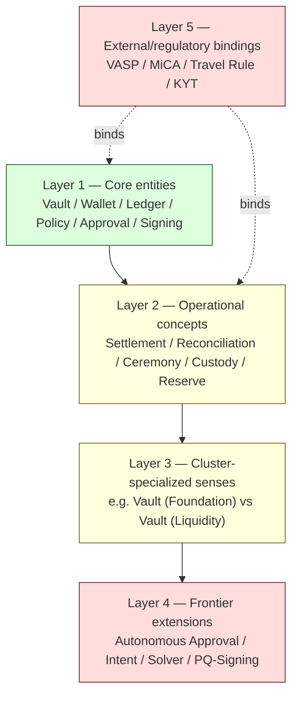

# R4 — Ontology Stability Discipline

> Generalized — institutional WaaS architecture corpus, ontology stability layer.
> All generalized reasoning is ★ Hypothesis.
> No "frozen ontology" claim. No "perfect vocabulary" claim. No silent rename.

---

## 0. Why ontology drifts

A multi-decade corpus uses terms like **Vault, Wallet, Ledger, Policy, Approval, Signing, Settlement, Custody, Reserve, Reconciliation**. These terms appear in 2026 documents and will appear in 2046 documents. The terms will **survive**; what they **mean** will not.

Sources of drift:

- **Industry redefinition** — vendors and standards bodies redefine terms (e.g., what "wallet" meant in 2014 vs 2026).
- **Cluster-local specialization** — Liquidity cluster uses "Vault" differently from Foundation cluster.
- **Frontier extension** — Frontier docs adopt terms in extended senses (autonomous treasury "Approval" ≠ governance "Approval").
- **Regulatory redefinition** — regulators may legally define previously ambiguous terms.
- **Implementation drift** — implementations bind terms to specific technologies that later become obsolete.

A corpus that does not govern its ontology will, at scale, produce silent disagreement that **looks** like consensus.

R4 specifies the discipline that lets the corpus's vocabulary remain interpretable across decades.

---

## 1. Core thesis

> Term stability ≠ meaning stability.
> A stable vocabulary requires explicit sense management, conservative refactor policy, and worldview-anchored term versioning.
> Renaming is not refactoring. It is destruction of historical retrieval.

---

## 2. ≠ propositions

- Term ≠ concept
- Stable term ≠ stable meaning
- Glossary ≠ ontology
- Concept evolution ≠ concept drift
- Renaming ≠ refactoring
- Frozen ontology ≠ correct ontology
- Sense unification ≠ ontology improvement
- Industry-standard term ≠ corpus-stable term
- Term version ≠ term replacement
- Disambiguation ≠ pollution

---

## 3. Layers of corpus ontology



★ Hypothesis — stability classes:

- **Layer 1 (Core entities)** — **decade-stable**. Renaming forbidden except via R5 charter-class change.
- **Layer 2 (Operational concepts)** — **multi-year stable**. Sense extension permitted with R4 versioning.
- **Layer 3 (Cluster-specialized)** — **year-stable**. New cluster-local senses permitted with disambiguation.
- **Layer 4 (Frontier extensions)** — **fluid**. Definitions evolve as Frontier domains stabilize.
- **Layer 5 (External bindings)** — **externally-determined**. The corpus tracks; it does not set.

The stability class **determines the change policy** (R5).

---

## 4. Sense management

The core idea: a term can carry multiple **senses** simultaneously, distinguished by **scope qualifiers**.

Example (★ hypothetical):
- **Vault (Foundation sense)** — D1a database-schema entity holding wallets; operational primitive.
- **Vault (Liquidity sense)** — D17 capital-bucket abstraction over multiple wallets; treasury primitive.
- **Vault (PQ sense)** — D32 key-material container with post-quantum-aware rotation policy.

The unqualified term **Vault** is reserved for the **Foundation sense** as the corpus default. Other senses must be **explicitly qualified** in any context where ambiguity is possible.

**Rules:**
1. **The unqualified term has exactly one sense.** Multi-sense terms with no default are forbidden — they produce silent retrieval ambiguity.
2. **Cluster-specialized senses must be qualified.** Foundation-cluster usage may drop the qualifier within the cluster; cross-cluster references must qualify.
3. **Bridge invariants always qualify.** Bridge invariants (cross-cluster) always carry full sense qualifiers because they are the most retrieval-sensitive.

---

## 5. Ontology registry

Stored under `_ontology/` (★ Hypothesis topology — R0 §4).

Each term entry:

```yaml
term: Vault
layer: 1
default_sense: foundation
senses:
  - id: foundation
    definition: "Operational entity in the wallet/ledger schema; container for wallets and policies; primary auditable object."
    introduced: <date>
    canonical_docs:
      - D1a §2
      - D5 §3
    status: stable
  - id: liquidity
    definition: "Capital-bucket abstraction over multiple wallets; used for treasury optimization."
    introduced: <date>
    canonical_docs:
      - D17 §4
      - D19 §2
    status: stable
  - id: pq
    definition: "Key-material container with post-quantum-aware rotation policy; supersedes foundation sense in PQ-era reasoning."
    introduced: <date>
    canonical_docs:
      - D32 §5
    status: evolving
related_terms:
  - Wallet
  - Reserve
  - Custody
sense_conflicts_resolved:
  - 2027-Q3: split foundation sense and liquidity sense (was previously ambiguous)
  - 2031-Q1: added pq sense
notes: "Layer-1 term. Renaming forbidden except via charter."
```

The registry is **machine-readable** by design — it lets R1 retrieval and R2 reasoning verify that synthesis is using the correct sense.

---

## 6. Concept versioning

When a sense **evolves substantially** but the term remains:

- The sense entry gains a `version` field (e.g., `liquidity.v2`).
- The prior sense version is **preserved** with status `superseded`.
- Documents using the prior version are **annotated** with the version reference.
- Historical retrieval (R7) routes to the prior version when querying historical worldviews.

★ Hypothesis: version proliferation is acceptable. A term with 5 sense-versions across 20 years is **healthy**. A term silently rewritten 5 times across 20 years is **destructive**.

---

## 7. Drift detection

Sources of drift detection:

| Source | Frequency | Cost |
|--------|-----------|------|
| Periodic ontology audit | Annual (★) | Medium |
| Cross-doc term co-occurrence analysis | Continuous (advisory) | Low |
| Contradiction registry T4 entries (R3) | Event-driven | Low |
| Reader-reported ambiguity | Continuous | Variable |
| Retrieval ambiguity rate (R1 monitor) | Continuous | Low |
| Post-incident ontology review | Event-driven | High |

**Drift signals (★ Hypothesis):**

- Increasing T4 contradictions involving the same term.
- High retrieval ambiguity rate for queries containing the term.
- New documents using the term without qualifier in contexts where prior docs would have qualified.
- Vendor / industry literature using the term in a sense that diverges from corpus default.
- Reader feedback citing confusion.

---

## 8. Term aliasing

Some terms acquire **industry aliases** over time (e.g., "Wallet" ↔ "Account" in some institutional contexts; "Reserve" ↔ "Treasury Float" in some treasury contexts).

**Aliasing policy:**

- Aliases are recorded in the registry as `related_terms` with relation type `alias`.
- The corpus retains **one canonical term**; aliases are **search-time expansions**, not corpus-replacement.
- New documents **must** use the canonical term. Alias usage is a documentation defect.
- Historical documents using the alias remain unchanged (R7 preservation).

★ Hypothesis: aliasing is the most under-disciplined ontology operation in long-lived corpora. Stewards tend to "tidy" by replacing aliases with canonical terms in old docs — this is silent rewrite and is forbidden (R7).

---

## 9. Conservative refactor policy

When the ontology must change, the refactor policy is **conservative by default**:

| Refactor type | Authority | Discipline |
|---------------|-----------|------------|
| Add new sense to existing term | R4 steward + R5 review | Registry update; affected docs annotated |
| Add new term | R4 steward | Registry entry; doc cross-references |
| Mark sense as `superseded` | R4 steward + R5 review | New sense version published; historical sense retained |
| Rename term | **Charter-class** (R0 / R5 charter review) | Multi-cycle review; redirect notes in old docs; **no silent rename** |
| Remove term | **Forbidden** | Terms are never removed; only marked `obsolete` with retention of historical references |
| Merge two terms | **Forbidden** | Merging destroys sense distinction; aliasing instead |
| Split one term into two | R4 steward + R5 review | New term + sense disambiguation in existing term |

**Hard invariant:** No renaming, no removal, no merging without charter-class review.

---

## 10. Ontology change request process

★ Hypothesis — minimum viable process:

1. **Proposal** — stewardship submits a written change request including: term, current sense(s), proposed change, motivation, affected documents, historical preservation plan.
2. **Cooling-off period** — ★ Hypothesis: 30 days for sense addition; 90 days for sense supersession; 1 year for rename proposal.
3. **Review** — R5 governance review with mandatory C-series (C2, C3, C4) impact assessment.
4. **Publication** — registry update + supersession headers + cross-reference updates.
5. **Audit trail** — change recorded with rationale, reviewer, date.
6. **Reversibility** — change can be reverted by the same process if drift was detected too late.

Charter-class changes (rename, layer-1 modification) require **R0 charter review**, which is a higher bar than R5.

---

## 11. Disambiguation in retrieval and synthesis

R4 binds into R1 and R2:

- **R1 retrieval** must surface the sense qualifier when retrieving chunks where ambiguity is possible.
- **R2 S5 synthesis** must use the qualified form in answers when retrieval crosses senses.
- **R2 S6 output** must include term sense in citation labels for multi-sense terms.
- **R2 S7 audit** checks for unqualified usage of multi-sense terms.

A reasoning system that uses **Vault** without qualifier when the retrieval surfaced both **Vault (Foundation)** and **Vault (Liquidity)** chunks is in **R4 violation**.

---

## 12. External term tracking

Layer-5 terms (regulatory / external) are tracked but **not owned** by the corpus.

Policy:

- The corpus mirrors the **canonical external definition** when one exists.
- The corpus annotates **as of** the regulatory date.
- When external definitions change, the corpus version is updated **with R5 process** — not retroactively rewritten.
- The corpus **does not adopt** external term aliases that conflict with corpus core terms.

★ Hypothesis: Layer-5 terms are the most volatile and most operationally consequential. Stewards should track regulatory definition changes as a continuous obligation, not a periodic audit.

---

## 13. Anti-patterns (ontology-specific)

- **Silent rename.** Term renamed in some docs; aliases unwound; historical retrieval broken.
- **Sense collapse.** Multiple senses normalized to one; cluster-local distinctions destroyed.
- **Glossary substitution.** Single-page glossary used instead of versioned ontology registry.
- **Vendor terminology adoption.** Vendor-specific term imported as corpus default, displacing canonical term.
- **Industry-fashion adoption.** New industry buzzword adopted before sense stability is established.
- **Frozen ontology.** No mechanism for adding senses or versions; corpus drifts away from current reality.
- **Disambiguation pollution.** Every term qualified in every context; readability collapses.
- **Cross-cluster sense leakage.** Cluster-specialized sense used as default in another cluster.
- **Alias creep.** Aliases adopted without registry entry; aliases proliferate uncontrollably.
- **Term-as-identity.** Steward attaches identity to "their" term; refactor blocked by ego rather than discipline.

---

## 14. Reader-facing ontology surface

Readers should not need to consult the full registry to read a single document. The ontology surface presented to readers (★ Hypothesis):

- **In-document term-sense headers** — when a doc uses a multi-sense term, declare the sense at the top: "This document uses 'Vault' in the Foundation sense (R4)."
- **First-occurrence sense annotation** — first use of a multi-sense term in a doc carries the sense qualifier.
- **Registry link** — every multi-sense term hyperlinks to its registry entry.
- **Search-time disambiguation** — UI surfaces sense when retrieval is ambiguous.

The registry is the **authority**; the documents are the **reading surface**.

---

## 15. Ontology survivability over decades

★ Hypothesis: the multi-decade survival of ontology depends on **three** disciplines:

1. **Append-only sense registry.** Senses are added, marked superseded, never removed.
2. **Conservative renaming.** Renames are charter-class operations; default policy is no rename.
3. **Worldview-anchored sense versions.** Each sense is dated; readers can ask "what did this term mean in 2027?" and get an answer via R7.

A corpus that maintains all three over 20 years will have an ontology that is **legible to a reader in 2046** who is reading a doc written in 2026.

A corpus that violates any of the three will have an ontology that is **only legible to its current stewards** — and when stewardship rotates, legibility is lost.

---

## 16. Relationship to other R docs

- **R0** — charter governs layer-1 changes.
- **R1** — retrieval discipline relies on sense qualifiers.
- **R2 S5/S7** — synthesis and self-audit enforce sense discipline.
- **R3 T4** — definitional contradictions route here.
- **R5** — ontology changes governed by R5.
- **R6** — decay classes apply to terms; volatile terms have shorter decay cycles.
- **R7** — historical sense retrieval depends on snapshot integrity.
- **R8** — rename proposals are human-only reviews.
- **R9** — AI assistants forbidden from autonomous ontology modification.
- **R10** — silent rename and sense collapse listed as failure modes.

---

## 17. Closing invariant

> The terms will outlive the people who wrote them.
> The meanings will not — unless the corpus governs them.
> Ontology stability is not the absence of change. It is the **preservation of legibility under change**.

★ Hypothesis: a 20-year-old document in a corpus with good ontology discipline is **still readable**. A 20-year-old document in a corpus without ontology discipline reads like a foreign language using familiar words. The difference is R4.
