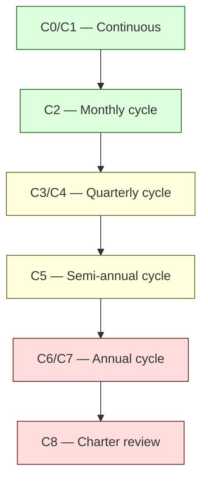
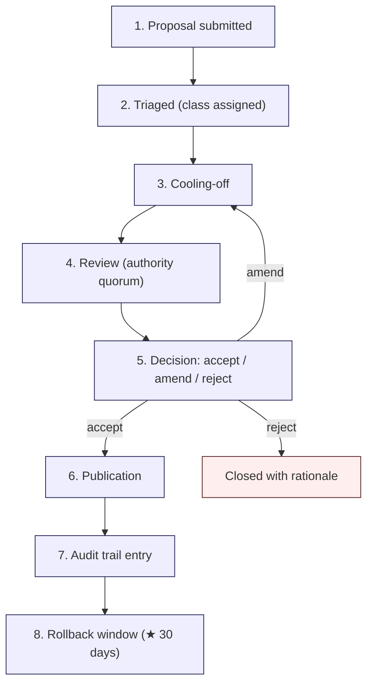

# R5 — Evolution Governance Model

> Generalized — institutional WaaS architecture corpus, evolution governance layer.
> All generalized reasoning is ★ Hypothesis.
> No "fully autonomous governance" claim. No "single owner" model. No "release velocity" objective.

---

## 0. Why the corpus needs explicit governance

A corpus that **anyone can edit any time** drifts into entropy.
A corpus that **only one person can edit** dies when that person leaves.
A corpus with **no change cadence** silently solidifies, then becomes obsolete.
A corpus with **AI-driven autonomous updates** loses the property that makes it institutional knowledge — accountability.

R5 specifies the governance model: **who** can change **what**, **when**, with **what authority**, and **under what review discipline**.

The model is **conservative by default**. The reason is that the corpus is **institutional knowledge** — its value comes from being trusted to be stable, defensible, and inspectable. A corpus that changes daily is not institutional; it is a working document.

---

## 1. Core thesis

> Corpus evolution is a governance act, not an editorial act.
> Different change classes require different authority, different cadence, different review depth.
> Every change is auditable. No change is silent.

---

## 2. ≠ propositions

- Author ≠ owner
- Editor ≠ governance authority
- Maintainer ≠ steward
- Speed ≠ quality
- Frequent change ≠ healthy corpus
- Approval ≠ correctness
- Automation ≠ delegation
- Update ≠ improvement
- Velocity ≠ progress
- Single-owner ≠ accountable

---

## 3. Change classification

★ Hypothesis — minimum viable taxonomy:

| Class | Examples | Authority | Cadence | Cooling-off |
|-------|----------|-----------|---------|-------------|
| **C0 — Typo / formatting** | Spelling, formatting, link fixes | Steward solo | Continuous | None |
| **C1 — Clarification** | Reword for clarity; add example; add cross-reference | Steward solo | Continuous | None |
| **C2 — Amendment** | Add new ≠ proposition; extend section; add Mermaid diagram | Steward + peer review | Cycle (monthly ★) | 7 days |
| **C3 — Position revision** | Change a stated invariant; update an analysis; refine a recommendation | Steward council (≥2 reviewers) | Cycle (quarterly ★) | 30 days |
| **C4 — Supersession** | Mark a doc as superseded; publish successor | Steward council + R7 historical compliance | Cycle (quarterly ★) | 90 days |
| **C5 — New document** | Add a new doc to D / C / E / R | Steward council + cluster review | Cycle (semi-annual ★) | 90 days |
| **C6 — Restructure** | Folder topology change; cluster reassignment; cross-cluster invariant addition | Charter review | Annual (★) | 1 year |
| **C7 — Ontology change** | R4 sense addition / rename / version | Charter review + R4 process | Cycle (annual ★) | Per R4 |
| **C8 — Charter change** | R0 modification; R-series modification | **Full charter review** | Multi-year | Multi-year |

Each class has a **named authority**, a **named cadence**, and a **named cooling-off period**. The cooling-off period is the **minimum** time between proposal and publication.

---

## 4. Authority roles

★ Hypothesis — minimum viable roles:

| Role | Scope | Term |
|------|-------|------|
| **Reader** | Submit reports, propose changes (no authority) | N/A |
| **Steward** | Execute C0-C2 within their cluster | 1-2 years rotating |
| **Steward council** | Quorum for C3-C5 | Multiple stewards; quorum rule |
| **Cluster lead** | C5 within a cluster | 1-2 years rotating |
| **R-series steward** | R-series changes | Distinct from D/C/E stewardship; ≥1 person |
| **Charter council** | C6-C8 | Multi-person, multi-year terms, with reviewer rotation |

**Hard rules:**

- **No single owner.** No one role can execute C3+ alone.
- **Rotating stewardship.** Stewards rotate to prevent capture and to ensure fresh review.
- **Distinct R-series authority.** R-series governs how the rest of the corpus is operated; conflating R-series authority with content authority creates self-dealing risk.
- **Charter council is small but multi-person.** Charter changes require multiple humans with multi-year horizon.

---

## 5. Cadence model

The corpus operates on **review cycles**, not on continuous merge.



★ Hypothesis: cycle-based cadence is **superior** to continuous-merge cadence for institutional knowledge for three reasons:

1. **Predictable review load** — reviewers can plan attention.
2. **Coherence reviews** — multiple changes within a cycle can be reviewed for consistency.
3. **Reader stability** — readers can trust that the corpus they reference today is the same tomorrow.

The trade-off: changes that "should" be fast (C2) wait up to a month. ★ Hypothesis: this is acceptable; institutional reasoning is **not** an emergency surface.

---

## 6. Proposal lifecycle



Every change passes through this lifecycle. Even C0 typo fixes carry an audit-trail entry (lightweight). Higher classes carry full lifecycle records.

---

## 7. Audit trail

The audit trail records, per change:

```yaml
id: change-<id>
class: C0..C8
proposer: <id>
proposed: <date>
triaged_by: <id>
cooling_off_start: <date>
cooling_off_end: <date>
reviewers:
  - id: <id>
    verdict: accept | amend | reject
    rationale: <text>
quorum_satisfied: true | false
decision: accept | amend | reject
decision_rationale: <text>
published: <date>
affected_docs:
  - <doc§>
affected_invariants:
  - <C2 ref>
affected_ontology:
  - <R4 ref>
historical_snapshot:
  - <R7 ref>
rollback_window_expires: <date>
rolled_back: false
notes: <text>
```

Audit trails are stored under `_stewardship/` (★ Hypothesis — R0 §4 topology). They are **append-only** and **never edited after publication**.

---

## 8. Rollback discipline

★ Hypothesis: every change carries a **rollback window** (default 30 days). During this window:

- Any reviewer with C3+ authority may **flag** the change for rollback review.
- A rollback is itself a change (C2-C4 typically); it follows the same lifecycle.
- After the rollback window expires, the change is **stable** — rollback requires a new proposal cycle.

Rollback is **not failure**. Rollback is the corpus learning that a change had unintended downstream effects. Stewards should treat rollback frequency as a quality signal (high rollback rate may indicate insufficient review depth).

---

## 9. Cluster review for C5 (new docs)

A new document requires:

1. **Cluster placement justification** — which cluster, why, what bridge invariants.
2. **C2 impact** — which invariants does this doc imply?
3. **C3 impact** — what dependency edges does this doc add?
4. **C4 impact** — does this doc introduce new anti-patterns?
5. **R4 impact** — does this doc introduce new terms or sense extensions?
6. **R7 impact** — does this doc supersede or augment any historical worldview?

The new-doc proposal is reviewed by the cluster lead + steward council. Documents are not added on author judgment alone.

★ Hypothesis: most failing corpora fail at **C5 governance**. They accept new docs too easily, creating coverage debt and dilution. The discipline is to make new-doc addition **mildly painful** so that only genuinely needed docs are added.

---

## 10. Charter review for C8

Charter changes affect R0 and the R-series structure itself.

Charter review requires:

- **Charter council quorum** (≥3 reviewers, rotating).
- **Multi-year proposal horizon** — a charter change proposed today may not publish for 1+ years.
- **Public proposal** — charter changes are visible to all readers during cooling-off.
- **Reader feedback period** — readers may submit objections.
- **Failure-mode assessment** — every charter change must include an R10 impact assessment.
- **Reversibility plan** — every charter change must have a documented reversibility path.

Charter changes are **rare by design**. The R0 charter declares itself stable; it does **not** declare itself permanent. ★ Hypothesis: charter changes will occur, but at a cadence measured in years, not months.

---

## 11. Stewardship rotation

Stewards rotate to prevent three failure modes:

- **Capture** — single steward shapes a cluster to personal preference.
- **Fatigue** — long-tenure steward becomes risk-averse and blocks healthy evolution.
- **Knowledge concentration** — institutional knowledge held by one person creates single point of failure.

★ Hypothesis — rotation policy:

- Steward term: 1-2 years, with overlap.
- No more than 50% of stewardship may rotate simultaneously.
- Outgoing stewards write a **handoff document** capturing in-flight contradictions, open questions, and pending proposals.
- Stewardship logs are stored under `_stewardship/handoffs/`.

**Stewardship is a service role, not a curator role.** Stewards are accountable for **discipline maintenance**, not for content authorship.

---

## 12. Forking allowance

An institution may **fork** the corpus to adapt it to its own context (regulatory regime, business model, technology stack).

Forking policy (★ Hypothesis):

- Forks are **explicitly permitted**.
- Forks **must** carry a "Forked from <upstream>, as of <date>" notice.
- Forks **may diverge** in any direction.
- Upstream is **not obligated** to merge fork changes back.
- Forks **may not** claim upstream's name unmodified.

Forks are healthy for institutional knowledge. They surface **what was generic** vs **what was context-specific**. ★ Hypothesis: a corpus with **zero forks** over decades is either too narrowly applicable or unknown.

---

## 13. Charter immutability is itself a failure mode

The charter (R0) must be modifiable. A charter that cannot change becomes a museum exhibit.

But:

- Changes must be **slow** (multi-year cadence).
- Changes must be **public** (reader-visible cooling-off).
- Changes must be **reversible** (rollback plan documented).
- Changes must **not** invalidate the core 10 operational invariants without **explicit** discussion of which invariant is being modified and why.

A charter that has changed **frequently** is a signal of stewardship instability. A charter that has **never** changed over 20 years is a signal of stewardship rigidity. Both are concerning; the healthy middle is **rare but executable** charter evolution.

---

## 14. Governance under AI assistance

AI assistants may participate in governance, but **with explicit constraints** (R9):

- AI may **draft** proposals (C0-C2 typically).
- AI may **detect** candidate changes (drift, contradiction, staleness).
- AI may **summarize** reviewer discussions.
- AI **may not** be a reviewer of record.
- AI **may not** trigger publication.
- AI **may not** count toward quorum.
- AI-generated proposals carry an explicit `proposer: ai-<id>` marker.

★ Hypothesis: an AI agent that submits 100 proposals per cycle is **not** providing 100× the value of a human steward who submits 1 — it is generating 100× the review load. AI proposal volume should be **rate-limited** by stewardship policy.

---

## 15. Anti-patterns (governance-specific)

- **Single-owner concentration.** One person holds C3+ authority indefinitely.
- **Continuous merge.** No cycle discipline; changes published as authored.
- **Cooling-off bypass.** Changes published before cooling-off completes "because urgent."
- **Audit trail decay.** Audit entries stop being recorded; changes become invisible.
- **Rollback fear.** Rollback treated as failure; stewards avoid flagging.
- **Charter avoidance.** C8-level changes routed as C2 to avoid charter review.
- **Stewardship stagnation.** No rotation; same people for 10+ years.
- **AI quorum.** AI agent counted toward review quorum.
- **Velocity metric.** "Documents published per quarter" tracked as success; quality unmeasured.
- **Capture by vendor.** Vendor employee becomes steward; vendor-specific framing creeps in.
- **Fork rejection.** Upstream actively suppresses forks; institutional adaptation prevented.
- **Public proposal evasion.** Charter changes done in private review only.

---

## 16. Governance health signals

★ Hypothesis — stewards should track:

- Change-class distribution per cycle (should not be all C0/C1).
- Rollback frequency (informational; both extremes concerning).
- Steward turnover rate (target: 30-50% per multi-year window).
- Reviewer diversity per change (target: no single reviewer dominant).
- Charter change frequency (target: rare but non-zero across decades).
- Fork count (informational; non-zero is healthy).
- Audit trail completeness (target: 100%).
- AI-proposed change ratio (target: ≤ some institution-set threshold).

---

## 17. Relationship to other R docs

- **R0** — charter is governed by C8; the highest review class.
- **R1** — retrieval implementation choices are operations; major changes are C2-C3.
- **R2** — reasoning flow changes are typically C2; flow re-architecture is C6.
- **R3** — T3 contradiction resolution requires R5 review.
- **R4** — ontology changes are C7; charter-class for renames.
- **R6** — decay class assignment is C2-C3.
- **R7** — historical snapshot lifecycle is C3.
- **R8** — human review boundaries are C7-C8.
- **R9** — AI constraints are C7-C8.
- **R10** — governance failure modes catalogued here.

---

## 18. Closing invariant

> Governance is the discipline that makes a corpus an institution rather than a wiki.
> Authority must be distributed. Cadence must be slow. Audit must be complete. Rollback must be possible. Charter must be modifiable, but rarely.

★ Hypothesis: no governance model is perfect; every model has failure modes. The discipline is to **name them, monitor them, and rotate against them** — not to claim a model has solved them.

The corpus survives not because the governance is correct, but because the governance is **explicit, auditable, and inspectable**.
