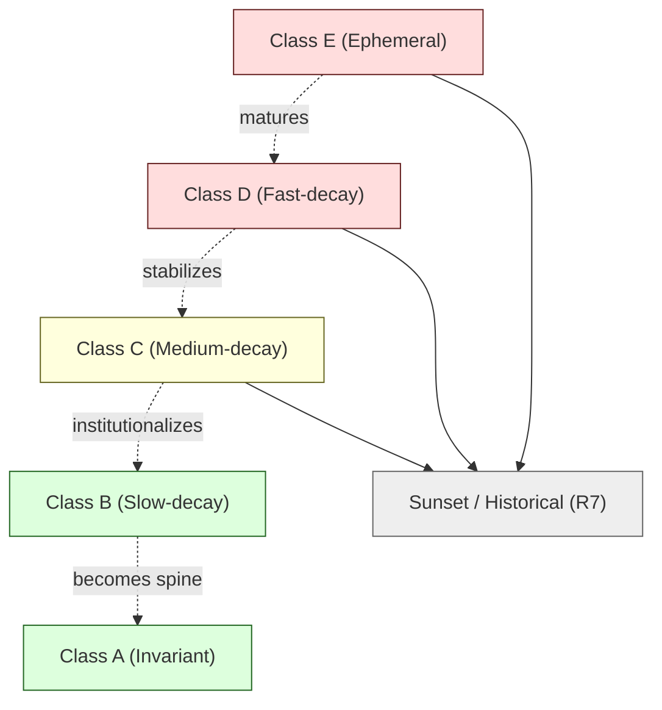

# R6 — Knowledge Decay / Staleness Taxonomy

> Generalized — institutional WaaS architecture corpus, knowledge decay layer.
> All generalized reasoning is ★ Hypothesis.
> No "evergreen content" claim. No "uniform staleness" model. No silent obsolescence.

---

## 0. Why decay needs a taxonomy

Knowledge ages, but **not uniformly**. The reasoning in D1a (Vault/Wallet/Ledger schema, foundational) ages on a different curve from the reasoning in D32 (post-quantum custody, frontier). A corpus that treats all content as having the **same staleness profile** will either:

- Continuously revisit invariants that don't need revisiting (waste).
- Leave volatile content stale until it actively misleads (harm).
- Use a single "last updated" timestamp as the only signal (misleading).

R6 specifies a **decay-class taxonomy** that lets the corpus signal, manage, and refresh content at the appropriate rate per class.

---

## 1. Core thesis

> Knowledge has decay rates. Decay rates are class-bounded, not document-bounded.
> Staleness is not "old" — it is "no longer matched to current reality."
> Removal is the wrong response to staleness. Re-classification, re-dating, and supersession (R7) are the right responses.

---

## 2. ≠ propositions

- Old ≠ stale
- Stale ≠ wrong
- Removal ≠ correction
- Decay rate ≠ uniform
- Recency ≠ relevance
- Archive ≠ deletion
- Refresh ≠ rewrite
- Time-since-update ≠ staleness signal
- Confirmed fact ≠ permanent fact
- Hypothesis ≠ short-lived

---

## 3. The 5-class decay taxonomy

★ Hypothesis — minimum viable taxonomy:

| Class | Decay rate | Examples | Refresh cadence | Sunset behavior |
|-------|-----------|----------|-----------------|-----------------|
| **Class A — Invariant** | Decade-scale | Core architectural invariants; ≠ propositions about identity, accountability, custody trust boundaries | 5-10 year review | Almost never |
| **Class B — Slow-decay** | Multi-year | Operational patterns; ceremony structures; reconciliation discipline | 2-3 year review | Rare, with supersession |
| **Class C — Medium-decay** | Yearly | Threat models; regulatory mappings; cluster bridge invariants under active extension | Annual review | Sometimes |
| **Class D — Fast-decay** | Sub-year | Specific protocol references; technology benchmarks; vendor capability surfaces | 6-month review | Frequent |
| **Class E — Ephemeral** | Months | Incident details; live operational metrics; volatile market structure observations | Continuous review | Rapid sunset; archive to R7 |

Each piece of corpus content is **classified at authoring time** and **re-classified during review cycles** (R5).

---

## 4. Class A — Invariant content

**Characteristics:**

- ≠ propositions that capture **structural** architectural truths (e.g., "Audit ≠ Logging").
- C2 invariants that are **independent of technology stack**.
- Charter-level claims in R0.
- Definitions of **Layer-1 ontology** (R4) entities.

**Refresh discipline:**
- Reviewed every 5-10 years.
- Refresh ≠ rewrite. The discipline is to ask: **is this still true?** not **does this still feel current?**
- Stylistic refresh (clarity edits) does not affect class.

**Examples in this corpus:** D1a vault/wallet/ledger structural invariants; D5 evidence chain append-only invariant; C2 cross-cluster invariants; R0 charter operational invariants.

★ Hypothesis: Class A content is the **corpus spine**. It must remain stable; if Class A churns, downstream content has no reliable anchor.

---

## 5. Class B — Slow-decay content

**Characteristics:**

- Operational patterns that **work across multiple technology generations**.
- Ceremony structures (recovery, key rotation) that survive specific implementations.
- Reconciliation discipline (D1b) operating on the level of **invariant** truth-domains rather than specific systems.
- Multi-domain reconciliation rules.
- Approval state machine transitions (D3).

**Refresh discipline:**
- Reviewed every 2-3 years.
- May acquire **extensions** without supersession.
- Cluster-level review preferred — Class B content often spans multiple docs in a cluster.

★ Hypothesis: most of the D-series Foundation cluster is Class B. The Specialization cluster mixes Class B (lifecycle structure) and Class C (specific compliance / cross-border mechanics).

---

## 6. Class C — Medium-decay content

**Characteristics:**

- Threat models — adversary capability assumptions evolve.
- Regulatory mappings — regulation evolves yearly in many jurisdictions.
- Cluster bridge invariants where one side is under active extension.
- Frontier cluster content that is **stabilizing** (no longer purely speculative but not yet invariant).

**Refresh discipline:**
- Annual review.
- More likely to acquire **supersession** than Class A/B.
- Tracking signals: regulatory bulletins, incident reports, threat intelligence.

★ Hypothesis: D14 (security threat model), D11 (compliance), D23 (jurisdictional split) are Class C. The Frontier cluster (D27-D32) starts as Class D / Ephemeral and migrates to Class C as Frontier domains institutionalize (per E4).

---

## 7. Class D — Fast-decay content

**Characteristics:**

- References to **specific protocols** (signing schemes, MPC variants, chain consensus specifics).
- Technology benchmark numbers.
- Vendor capability surfaces (★ relevant when the corpus discusses 3-way decision framing in D6).
- Specific cross-chain bridge architectures.
- Specific tooling (e.g., "as of 2026, X is the standard transaction simulation library").

**Refresh discipline:**
- 6-month review.
- Often replaced rather than amended.
- May be **isolated** to specific sections of a doc (rest of doc may be Class B/C).
- ★ Hypothesis: stewards should consider **separating** fast-decay content into its own document/section so the rest of the doc is more stable.

---

## 8. Class E — Ephemeral content

**Characteristics:**

- Incident details (specific incident X happened on Y date with consequence Z).
- Live operational metrics.
- Volatile market structure observations (e.g., "as of 2026, stablecoin issuer concentration is N").
- Vendor product version specifics.

**Refresh discipline:**
- Continuous review.
- Sunset rapidly when no longer current.
- Archived to R7 historical snapshots.

★ Hypothesis: Class E content should be **rare in the corpus body**. Most ephemeral content belongs in **referenced** external sources (incident reports, dashboards) rather than embedded corpus content. When ephemeral content is in the corpus, it is typically **illustrative** rather than load-bearing.

---

## 9. Decay class assignment

Every piece of content (document section, ≠ proposition, invariant, diagram) is assigned a decay class at authoring time.

**Assignment policy:**

- **Default class is C** unless the author/steward justifies otherwise.
- **Class A assignment requires steward council review** (C3 per R5) because Class A claims are corpus-spine claims.
- **Class E content requires sunset planning** at authoring time — "this will be obsolete by <approx date>; archive policy: <X>."
- **Mixed-class docs are permitted** — a single doc may carry Class B body content and Class D appendix content. The doc declares its **dominant class** + section-level class overrides.

---

## 10. Staleness signals

★ Hypothesis — multi-signal staleness detection:

| Signal | Class sensitivity | Cost |
|--------|------------------|------|
| **Time since last review** | All classes; weighted by class cadence | Low |
| **External event triggers** | C/D/E especially (regulatory change, incident, protocol upgrade) | Variable |
| **Retrieval ambiguity rate** (R1 monitor) | All classes | Low |
| **Reader-reported obsolescence** | All classes | Variable |
| **Contradiction registry growth** (R3 T2 entries against the doc) | All classes | Low |
| **Vendor / industry literature divergence** | Especially D | Medium |
| **Cluster steward judgment** | All classes | Variable |
| **AI-assisted drift detection** (advisory) | C/D/E especially | Low |

No single signal triggers reclassification or sunset alone. The signal mix triggers a **review** under R5.

---

## 11. Staleness markers (visible to readers)

Every doc (and section, when section-class differs) carries:

- **Last reviewed** date.
- **Decay class** (A/B/C/D/E).
- **Next scheduled review** date (per class cadence).
- **Status** (current / under-review / superseded / archived).

★ Hypothesis: reader-visible markers are **mandatory**. A doc that does not display its decay class and last-review date allows reader-side assumptions to drift. The corpus must not enable unmarked staleness.

Example header (★ illustrative):

```
> Decay class: B  |  Last reviewed: 2026-05  |  Next review: 2028-Q2  |  Status: current
```

---

## 12. Refresh cadence per class

★ Hypothesis — minimum viable cadence:

| Class | Scheduled review | Triggered review |
|-------|------------------|------------------|
| A | 5-10 years | On charter event or fundamental shift |
| B | 2-3 years | On cluster review or T2 contradiction |
| C | Annual | On regulatory / incident event |
| D | 6-month | On protocol / vendor / standard event |
| E | Continuous | Continuous |

Scheduled reviews happen even when no triggered review has occurred. The discipline is to **re-affirm** content, not just to **react** to events.

★ Hypothesis: a Class A invariant that has not been re-affirmed in 10 years is **not** necessarily wrong — but it should be reviewed, because the reader's expectation that a corpus actively maintains its content has decayed too.

---

## 13. Sunset / archive process

When content is no longer current:

1. **Decay class re-assessment** — has the content moved class (e.g., from current Class C to obsolete)?
2. **Supersession check** — does newer content replace it (R3 T2; R7 historical)?
3. **Sunset proposal** (R5 C4 typically) — formal proposal to mark content as superseded or archived.
4. **Historical snapshot** (R7) — preserve the content with a frozen worldview marker.
5. **In-doc supersession header** — visible to readers; preserves citation continuity.
6. **Index update** (C1) — content marked as historical in master index.
7. **Audit trail entry** (R5) — sunset is itself a tracked change.

**Hard invariant:** Content is **never deleted**. Sunset moves content to historical lifecycle state; it does not erase.

---

## 14. Recency ≠ relevance

A common failure mode: assuming **newer = more relevant**. Counter-examples:

- **Class A invariants** — a Class A doc reviewed 8 years ago is still authoritative if the invariant still holds.
- **Historical worldview retrieval** — when answering "what did the corpus say in 2027?", **older content is more relevant** than newer (R7).
- **Cluster context** — a 5-year-old Foundation doc may be more relevant to a Foundation question than a 6-month-old Frontier doc.

R1 retrieval re-ranking must respect decay-class-aware recency weighting. Universal recency bias is a documented anti-pattern (R1 §11).

---

## 15. The "still relevant?" review question

Every scheduled review asks:

1. **Is the content still true?** (correctness check)
2. **Is the content still useful?** (utility check)
3. **Is the content still in the right class?** (taxonomy check)
4. **Are the assumptions still valid?** (worldview check)
5. **Are the cited examples still meaningful?** (illustration check)

If 1-4 hold, the review verdict is **re-affirm**. If 5 fails, the review verdict is **refresh examples** (minor change, C1). If 1 or 4 fail, the review may trigger **supersession** (C4).

★ Hypothesis: the most common review outcome is **re-affirm**. This is **healthy** — it indicates the content is doing its job. Treating re-affirmation as "no value" is a metrics failure (R5 §16).

---

## 16. Decay class migration

Content may migrate decay classes over its lifecycle:



★ Hypothesis: Frontier cluster docs (D27-D32) typically start at Class D (with Class C aspirations). E4 (frontier integration discipline) governs migration toward Class C/B as the underlying domain institutionalizes. Migration **toward Class A is rare and slow** — and should be.

---

## 17. Anti-patterns (decay-specific)

- **Uniform staleness.** All content treated as having the same decay profile.
- **Time-only metrics.** Last-updated date used as sole staleness signal.
- **Recency monoculture.** Newest content always preferred regardless of decay class.
- **Aggressive sunset.** Class B/C content moved to historical prematurely; corpus loses spine.
- **Lazy review.** Scheduled review reduced to "looks fine" without applying the 5 review questions.
- **Class drift.** Content moves from Class A to Class C without explicit reclassification.
- **Ephemeral leakage.** Class E content embedded in load-bearing Class B docs; doc ages faster than necessary.
- **Refresh-as-rewrite.** Refresh review used as an excuse for ground-up rewrite, losing prior reasoning trace.
- **Silent obsolescence.** Content remains visible without sunset markers despite being known-stale.
- **Decay class as authority.** "Class A" used as a status symbol; over-assignment.
- **No reader markers.** Decay class invisible to readers; trust calibration breaks.

---

## 18. Relationship to other R docs

- **R0** — charter invariants are Class A.
- **R1** — re-ranking respects decay class; recency is class-weighted.
- **R2** — confidence calibration in synthesis respects decay class.
- **R3** — T2 (evolved) contradictions often signal class C/D/E content needing sunset.
- **R4** — Layer-1 ontology is Class A; Layer-5 external bindings are Class C/D.
- **R5** — class assignment and reclassification governed by R5.
- **R7** — sunset content routed to R7 historical snapshots.
- **R8** — Class A reclassification is human-only review.
- **R9** — AI may flag staleness candidates; humans assign class.
- **R10** — silent obsolescence and uniform staleness listed as failure modes.

---

## 19. Closing invariant

> Knowledge ages at multiple speeds. A corpus that pretends otherwise either burns review effort on stable content or leaves volatile content actively misleading.
> Decay is not failure. Decay is **the natural lifecycle of knowledge in contact with reality**.
> The discipline is to **mark, monitor, and migrate** — not to deny.

★ Hypothesis: in a multi-decade corpus, **most** content will reach sunset eventually. The corpus is not a monument; it is a working memory. R6 lets that memory operate gracefully across decades.
