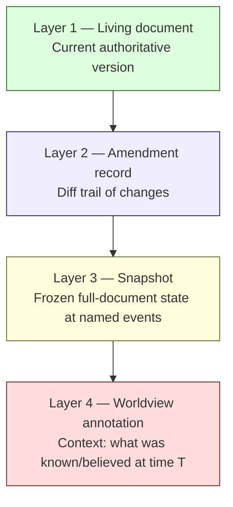
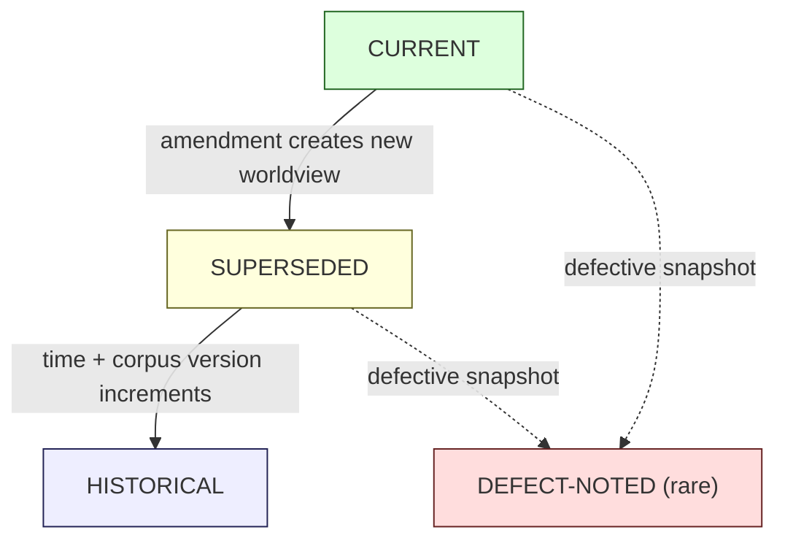

# R7 — Historical Worldview Preservation Strategy

> Generalized — institutional WaaS architecture corpus, historical worldview preservation layer.
> All generalized reasoning is ★ Hypothesis.
> No "single current truth" claim. No silent rewrite. No retroactive correction.

---

## 0. Why historical worldviews must be preserved

A corpus that **continuously rewrites itself** loses an essential property: the ability to answer the question **"what did we think at the time?"**

That question is not nostalgic. It is **operationally and forensically critical**:

- **Audit reconstruction** — when a 2027 decision is reviewed in 2031, the reviewer needs to know what knowledge the decision-makers had access to.
- **Incident learning** — understanding why a control failed requires understanding the threat model **as it was**, not as it is.
- **Regulatory defense** — defending an institutional action requires citing the policy / position **as it was published at the time**.
- **Concept genealogy** — understanding why a current invariant exists requires reading the worldview that produced it.
- **Trust calibration** — readers calibrate trust by observing how often the corpus's claimed certainties were later revised.
- **Forking and adaptation** — institutions adapting the corpus need access to the trajectory, not just the current state.

A corpus that erases its own history is a corpus that **silently rewrites institutional memory**. R7 specifies the discipline that prevents this.

---

## 1. Core thesis

> Documents change. Worldviews must remain inspectable.
> Preservation is not endorsement. Preservation is the requirement that **what the corpus said at time T can be retrieved at time T+N**.
> Rewriting in place is the single most destructive corpus action.

---

## 2. ≠ propositions

- Revision ≠ replacement
- Historical view ≠ outdated view
- Preservation ≠ endorsement
- Annotation ≠ alteration
- Re-read ≠ re-derive
- Frozen snapshot ≠ active doc
- Archive ≠ deletion
- Current corpus ≠ complete corpus
- "As of date" ≠ permanent stamp
- Worldview ≠ opinion

---

## 3. The 4-layer preservation model



- **Layer 1** is what readers see by default.
- **Layer 2** captures **change diffs** with rationale (auditable but not necessarily reader-facing).
- **Layer 3** captures **full-document snapshots** at named events (annual review, major amendment, charter change).
- **Layer 4** captures **the context** — what knowledge, regulations, threats, and assumptions were in force at the snapshot date.

All four layers are needed. Diffs alone don't preserve worldview (Layer 4); snapshots alone don't preserve change rationale (Layer 2).

---

## 4. Snapshot triggers

★ Hypothesis — when to take a Layer-3 snapshot:

| Trigger | Cadence | Scope |
|---------|---------|-------|
| **Scheduled annual** | Annual | All current-status docs |
| **Document supersession** (R3 T2) | Event | Document being superseded |
| **Ontology version change** (R4) | Event | All docs using the affected sense |
| **Charter change** (R0 / R5 C8) | Event | R-series + affected docs |
| **Major incident-driven amendment** (E1) | Event | Affected docs + cluster |
| **Regulatory regime change** (E2) | Event | Affected docs |
| **Cluster restructure** (R5 C6) | Event | Cluster |
| **Corpus version anchor** | Event (★ semi-annual) | All docs — a "version" of the corpus as a whole |

Snapshots are **append-only**: a snapshot is never edited after publication. If a snapshot itself is found to be defective (e.g., it captures content during an unfinished edit), a **second** snapshot is taken; the first is retained with a defect notice.

---

## 5. Snapshot storage

★ Hypothesis topology (R0 §4): `_history/<year>/<event-id>/<doc-name>.md`.

Each snapshot file contains:

```
---
snapshot_of: <original doc path>
snapshot_event: <event id>
snapshot_date: <YYYY-MM-DD>
trigger: scheduled | supersession | ontology | charter | incident | regulatory | restructure | corpus-version
corpus_version: <if applicable>
worldview_annotation: <ref to L4 annotation file>
notes: <text>
---

<frozen content>
```

The snapshot is **content-frozen**. Header metadata above the frontmatter line may be amended to add cross-references (e.g., "see also superseded-by D6-v2 §3") but the content body is immutable.

---

## 6. Worldview annotation (Layer 4)

A Layer-4 annotation is a **separate document** that captures the **context** in which the snapshot was authored. It is not a content edit — it is a **paratext**.

★ Hypothesis minimum content:

```
---
worldview_annotation_for: <snapshot ref>
annotation_date: <date>
authored_by: <id>
---

# Worldview at <snapshot date>

## Regulatory context
<what regulations were in force or proposed>

## Technology context
<what technology stack assumptions were standard>

## Threat model context
<what adversary capabilities were assumed>

## Industry context
<what industry / vendor landscape existed>

## Open questions at the time
<C6 entries that were active>

## Known limitations explicitly acknowledged
<what the corpus knew it did not know>

## Subsequent corrections (back-pointer, populated over time)
<list of later snapshots / amendments that updated this worldview>
```

★ Hypothesis: Layer-4 annotations are **the single most valuable preservation artifact** for long-horizon readers. A snapshot without context is a fossil; a snapshot with worldview annotation is **history**.

---

## 7. "As of" framing in every assertion

Every assertion in the current corpus carries an implicit **"as of <date>"** qualifier, anchored to the document's last-review date (R6).

For load-bearing assertions, this qualifier may be **explicit**:

> "As of 2026-Q2, the corpus position is that signing should employ MPC-based 3-endpoint orchestration. See snapshot 2026-Q2 for the worldview supporting this position."

★ Hypothesis: explicit "as of" framing should be **used selectively** for high-impact claims, not universally. Universal use produces noise; selective use focuses reader attention on time-sensitive claims.

Required explicit "as of" markers:
- Threat model assumptions (D14)
- Regulatory mappings (D11, D24)
- Vendor / industry-specific assertions
- Frontier-cluster speculative claims (D27-D32)
- Hypothesis claims marked ★ in safety-critical reasoning

---

## 8. Worldview lifecycle

Worldviews follow a 4-state lifecycle:



- **CURRENT** — the worldview that the present corpus represents.
- **SUPERSEDED** — a worldview that has been replaced but remains directly relevant (recent past).
- **HISTORICAL** — a worldview from a distant past corpus version; retrievable for forensic and educational purposes.
- **DEFECT-NOTED** — a snapshot known to be incomplete or defective; preserved but flagged.

★ Hypothesis: SUPERSEDED → HISTORICAL transition happens automatically after **N corpus versions** (★ N=3) have passed. The transition does not change content; it changes **retrieval default behavior** (HISTORICAL only retrieved on explicit historical queries; SUPERSEDED still surfaces in standard retrieval as "prior position").

---

## 9. Retrieval against historical worldviews

R1 §9 governs historical retrieval discipline. R7 supplies the underlying snapshots.

**Retrieval rules:**

| Query mode | Retrieval target |
|------------|------------------|
| Default (current) | Layer-1 only |
| "What did corpus say as of <date>?" | Layer-3 snapshot at or just-before <date> |
| "What did corpus believe at <event>?" | Layer-3 + Layer-4 annotation |
| "How did position X evolve?" | Multiple Layer-3 snapshots in time order |
| Audit / forensic | Layer-1 + Layer-2 + Layer-3 + Layer-4 with full attribution |

**Hard rule:** Layer-1 (current) and Layer-3 (historical) chunks are **never synthesized into a single answer** without explicit framing. Mixing them is silent rewrite, which is the failure mode R7 exists to prevent.

---

## 10. Annotation, not alteration

When historical content is **found to contain factual errors** (e.g., a 2026 doc cited a regulation that turned out to be different), the discipline is:

- **Annotate** the snapshot with a "subsequent correction" note pointing to the correcting snapshot.
- **Never edit** the snapshot itself.
- The Layer-4 annotation captures both the original belief and the subsequent correction.

Why: editing the snapshot loses the worldview signal. Readers in 2030 should be able to see what the 2026 corpus **actually claimed**, including its errors, because the errors are themselves part of the institutional history.

★ Hypothesis: refusing to retroactively correct snapshots is **uncomfortable** for stewards (it preserves the corpus's own mistakes), but it is the only discipline that gives the corpus credibility about its present claims. A corpus that quietly fixes its past has no defense when current claims are challenged.

---

## 11. Lifecycle of a worldview annotation

Annotations themselves may be **updated** — but with restrictions:

- **Adding back-pointers** (subsequent corrections, related amendments) — permitted; this is the annotation's purpose.
- **Adding context** that was not initially documented — permitted with a clear "Added: <date> by <id>" marker.
- **Correcting factual errors in the annotation itself** — permitted but discouraged; preferred to add a correction note rather than edit.
- **Rewriting interpretive content** — **forbidden**. The annotation's interpretation of the worldview at the time is itself historical.

★ Hypothesis: annotations are **append-only with strict discipline**. The annotation grows over time as more later context becomes available, but its original interpretive content is fixed.

---

## 12. Inspectability requirements

For the preservation discipline to be operationally meaningful:

- **All snapshots must be retrievable** by date, event, doc, or corpus version.
- **All snapshots must be readable** by readers (not just stewards).
- **All snapshots must be linkable** via stable URLs / paths.
- **All snapshots must be auditable** — readers can compute diffs between snapshots without special tooling.
- **All snapshots must be discoverable** via C1 (master index) historical section.

Inspectability is not optional. A snapshot that exists but is not inspectable is **functionally absent**. ★ Hypothesis: stewards must periodically test inspectability (e.g., annual exercise: pick a random snapshot from 5 years ago; can a steward retrieve it, read it, diff it, and explain its worldview?).

---

## 13. The "silent rewrite" failure mode

The single most destructive R7 violation is **silent rewrite**: a doc is edited in place such that readers can no longer access the prior content.

Patterns that produce silent rewrite:

- Editing a doc and committing only the new version, without creating a Layer-3 snapshot of the prior state.
- "Tidying" old documents to use current terminology (R4 violation; R7 violation).
- Reorganizing a doc's structure such that line-level diff loses meaning.
- Removing a section deemed "no longer relevant" without supersession process (R5 C4).
- Replacing a hypothetical example with a current example, erasing the original reasoning anchor.

Each of these is a **named failure mode** (R10). Stewardship review (R5) is responsible for catching these patterns; AI-assisted detection may flag them but cannot resolve them (R9).

---

## 14. The "retroactive correction" temptation

A subtler failure mode is **retroactive correction**: a steward, having discovered that an old claim was wrong, edits the old doc to make it "right."

This is wrong for three reasons:

1. **It erases the worldview.** Future readers see the corrected claim and assume the corpus was always right.
2. **It destroys learning.** The story of the correction — when, by whom, why — is lost.
3. **It undermines audit defense.** If the corpus is shown to retroactively correct, no past version can be trusted.

The correct discipline:
- Take a snapshot of the old (incorrect) doc.
- Publish a new version with the correction.
- Annotate both with the relationship.
- Optionally: write an E1 (incident-driven evolution) entry capturing the lesson.

★ Hypothesis: the impulse to retroactively correct is **strong** — it feels professionally responsible. The discipline is to **resist it**. The corpus's credibility comes from preserving its mistakes, not from appearing to have made none.

---

## 15. Anti-patterns (preservation-specific)

- **Silent rewrite.** Doc edited in place; no snapshot taken.
- **Retroactive correction.** Old doc edited to fix discovered errors instead of snapshot + new version.
- **Snapshot-without-annotation.** Layer-3 captured but no Layer-4 worldview annotation.
- **Annotation drift.** Layer-4 annotations themselves rewritten over time, losing original interpretive voice.
- **Inaccessible history.** Snapshots stored but not discoverable / linkable / readable.
- **Aggressive archival.** Recently superseded docs moved to HISTORICAL too quickly; default retrieval no longer surfaces "prior position" context.
- **Quiet deletion.** Defective snapshot removed instead of flagged.
- **Snapshot churn.** Snapshots taken too frequently (every minor edit) producing inspection noise.
- **Cross-snapshot rewrite.** Steward "harmonizes" multiple snapshots after the fact for consistency, losing worldview signal.
- **Forgotten history.** Snapshots exist but no scheduled exercise verifies they remain inspectable.

---

## 16. Multi-decade preservation

★ Hypothesis: for a 30-year corpus horizon:

- **Storage format** must be plain text (markdown) — no proprietary binary format survives multiple decades reliably.
- **Path stability** matters more than naming aesthetics — moving snapshot files breaks audit trails.
- **Diff tooling** must remain available — line-based markdown supports diff with any future tool.
- **Migration discipline** — if storage is migrated (e.g., from one repo to another), the migration must preserve full history and produce a migration snapshot.
- **External backup** — snapshots must exist outside the active corpus location. Single-location storage is a single point of failure.

Multi-decade preservation is more an **operational discipline** than a technical problem. The technology to preserve text exists; the discipline to **not lose track of it** is the hard part.

---

## 17. Relationship to other R docs

- **R0** — charter changes trigger snapshots.
- **R1** — historical retrieval relies on R7 snapshots.
- **R2** — synthesis is forbidden from mixing current + historical chunks.
- **R3** — T2 (evolved) contradictions require R7 supersession + snapshot.
- **R4** — ontology version changes trigger snapshots of affected docs.
- **R5** — supersession (C4) and restructure (C6) trigger snapshots.
- **R6** — sunset content moves to R7 historical state.
- **R8** — silent rewrite detection is a human-review responsibility.
- **R9** — AI assistants forbidden from editing without snapshot trigger.
- **R10** — silent rewrite is listed as a top corpus failure mode.

---

## 18. Closing invariant

> A corpus that rewrites itself silently is a corpus that cannot be trusted at any moment.
> A corpus that preserves its mistakes is a corpus that can defend its present claims.
> Preservation is not nostalgia. It is the discipline that makes institutional knowledge **institutional**.

★ Hypothesis: in 30 years, the most valuable artifact of this corpus may not be the current state — it may be the **history of how the current state was arrived at**. R7 is the discipline that ensures the history survives.
