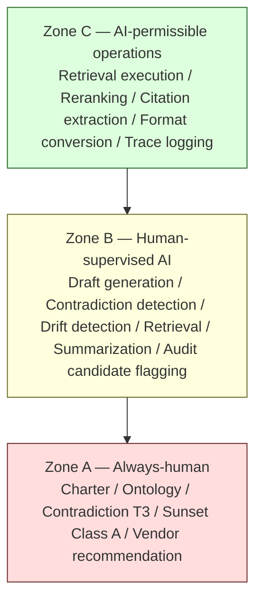

# R8 — Human Review Boundary / Escalation Criteria

> Generalized — institutional WaaS architecture corpus, human review boundary layer.
> All generalized reasoning is ★ Hypothesis.
> No "AI as final authority" claim. No "human review for everything" claim. No undelegated accountability.

---

## 0. Why a boundary must be drawn explicitly

A corpus operated jointly by humans and AI assistants has three viable modes:

1. **All-human** — every retrieval / reasoning / change goes through human reviewers. Safe but unscalable.
2. **All-AI** — AI handles retrieval / reasoning / change autonomously. Scalable but unaccountable.
3. **Bounded AI assistance** — AI handles bounded operations; humans retain bounded accountabilities. The boundary is explicit, named, and reviewable.

The corpus commits to Mode 3. R8 specifies **where the boundary is drawn**.

The boundary is not a default — it is a **discipline**. If the boundary is not explicit, AI assistance silently absorbs human-only operations over time, producing the **silent autonomy** failure mode (R10).

---

## 1. Core thesis

> Some operations are AI-permissible because the cost of failure is bounded and reversible.
> Some operations are human-only because the cost of failure is unbounded, irreversible, or load-bearing on institutional trust.
> The boundary is **named, not negotiable**.

---

## 2. ≠ propositions

- AI suggestion ≠ corpus change
- Retrieval answer ≠ commitment
- Synthesis ≠ approval
- Confidence ≠ authority
- Speed ≠ accountability
- Automation ≠ delegation
- AI-detected ≠ AI-decided
- Draft ≠ publication
- Plausible ≠ permitted
- Always-human zone ≠ blocker zone

---

## 3. The 3-zone model

- **Zone A (Always-human)** — AI may inform but never decide.
- **Zone B (Supervised)** — AI may draft, propose, or detect; humans review and decide.
- **Zone C (Permissible)** — AI executes operations directly; humans audit periodically.

The zone of an operation is determined by **the cost-of-failure profile**, not by **the difficulty of the operation**.

---

## 4. Zone A — Always-human operations

★ Hypothesis — minimum viable list:

| Operation | Why always-human |
|-----------|------------------|
| **Charter change** (R5 C8) | Foundational; institutional trust load-bearing |
| **Ontology rename / layer-1 change** (R4) | Affects retrieval across decades of content |
| **Contradiction T3 resolution** (R3) | Real disagreement; resolution is institutional position |
| **Sunset of Class A invariant** (R6) | Removes corpus spine |
| **Vendor recommendation** | High recapture risk; AI cannot judge vendor neutrality |
| **Forensic / audit defense** | Legal and regulatory accountability |
| **Stewardship rotation decisions** (R5) | Governance of governance |
| **Forking acceptance / origin claim arbitration** | Identity-level institutional decisions |
| **Quorum participation** (R5) | AI may not be counted toward quorum |
| **Charter immutability decisions** | Whether to allow a charter change at all |
| **R-series modification** | R-series governs AI itself; AI cannot self-modify R |
| **Adjudication of R9 violations** | AI cannot judge its own violations |

These operations are **bright-line**. AI may draft, summarize, flag, or analyze in support — but the decision of record is human, the name of the deciding reviewer is recorded, and the rationale is human-authored.

---

## 5. Zone B — Human-supervised AI operations

★ Hypothesis — common operations:

| Operation | AI role | Human role |
|-----------|---------|------------|
| **Proposal drafting** (R5 C1-C2) | Draft text | Reviewer decides accept/amend/reject |
| **Contradiction detection** (R3) | Surface candidates | Classify type; decide preservation policy |
| **Drift detection** (R4 / R6) | Flag terminology / decay candidates | Decide reclassification |
| **Retrieval design review** | Suggest re-ranking weight changes | Approve change |
| **Reasoning trace audit** | Generate audit summary | Verify integrity |
| **Sunset candidate flagging** (R6) | Identify Class C/D/E content past review window | Decide sunset / re-affirm |
| **Cross-doc inconsistency flagging** | Surface candidates | Classify and route |
| **Snapshot integrity check** (R7) | Compute checksums; detect missing snapshots | Verify and remediate |
| **Worldview annotation drafting** (R7 Layer 4) | Draft context | Review and edit |
| **Question classification** (R2 S1) | Classify candidates | Reviewer may override |

The discipline: **AI surfaces; humans decide.** AI never closes a Zone B operation alone.

---

## 6. Zone C — AI-permissible operations

★ Hypothesis — operations where AI direct execution is acceptable:

| Operation | Audit cadence |
|-----------|---------------|
| **Retrieval execution** (R1 pipeline) | Periodic sample audit |
| **Re-ranking** (R1) | Periodic weight review |
| **Citation extraction** | Periodic accuracy audit |
| **Format conversion** (markdown / rendering / table generation) | Spot check |
| **Trace logging** (R2 S7) | Continuous self-audit |
| **Index regeneration** (C1) | Periodic verification |
| **Sense disambiguation surface in retrieval output** (R4) | Periodic verification |
| **Decay class display** (R6 markers) | Verify against registry |
| **Snapshot retrieval** (R7) | Periodic inspection exercise |

Even Zone C is **audited**, not unmonitored. AI execution does not absolve stewardship of responsibility — it shifts the responsibility from per-operation review to per-period audit.

★ Hypothesis: a sign that the Zone C/B boundary is misplaced is a sudden spike in operational anomalies in periodic audits. The remedy is to **move the operation up to Zone B**, not to broaden Zone C.

---

## 7. Boundary signals (when AI must stop and escalate)

R2 S7 self-audit triggers escalation. R8 codifies the **boundary signals** that trigger Zone A or Zone B escalation:

| Signal | Escalation target |
|--------|-------------------|
| Decision-support question + retrieved C4 anti-pattern | Zone B reviewer |
| T3 / T5 contradiction encountered | Zone A (T3 resolution) or Zone B (presentation choice) |
| Corpus gap on safety-critical axis | Zone B reviewer |
| Question requests vendor recommendation | Zone A (always-human) |
| Question requests charter / ontology change | Zone A |
| Question requests hypothesis promotion | Zone A |
| Historical query with incomplete R7 snapshot | Zone B (snapshot remediation) |
| Self-audit (R2 S7) failed on pass/fail axis after revise | Zone B reviewer |
| Drift signal exceeds threshold | Zone B reviewer (drift analysis) |
| AI proposal volume exceeds rate limit | Zone B reviewer (rate review) |
| Reader-reported error | Zone B reviewer |
| Reader-reported worldview erasure | Zone A (silent rewrite suspicion) |
| Snapshot integrity failure | Zone A (R7 integrity is non-negotiable) |
| Quorum-related decision | Zone A (governance of governance) |

Escalation is **not failure**. Escalation is **discipline**. A reasoning system with zero escalations is suppressing them.

---

## 8. Reviewer accountability

Reviewers in Zone A and Zone B carry **named accountability**:

- Reviewer ID is recorded in audit trails (R5).
- Reviewer rationale is recorded in machine-readable form.
- Reviewer verdicts are auditable post-hoc.
- Reviewers may be challenged via R5 governance.

★ Hypothesis: anonymous review is **not acceptable** for Zone A. Anonymity removes the accountability that makes the boundary load-bearing. Zone B may use pseudonymous review (institution-internal IDs) when external attribution is undesirable, but pseudonym → reviewer identity must be traceable internally.

---

## 9. Reviewer rotation

Reviewers rotate to prevent:

- **Capture** — single reviewer's preferences shape outcomes.
- **Fatigue** — long-tenure reviewers become rubber-stamps.
- **Conflicts of interest** — reviewer authors content they then review.

★ Hypothesis — rotation policy:

- Active reviewer term: 1-2 years for Zone B; 2-3 years for Zone A.
- Reviewer cooldown: 6 months between consecutive terms.
- No reviewer may approve their own proposal.
- No reviewer may approve a proposal authored by a peer in the same institution unit when conflict-of-interest is plausible.
- Reviewer overlap: ≤ 50% turnover per cycle to maintain continuity.

---

## 10. Reviewer competence baselines

Not every reviewer may review every proposal. ★ Hypothesis competence baselines:

| Review type | Minimum competence |
|-------------|--------------------|
| C0-C1 (typo / clarification) | Familiarity with affected doc |
| C2-C3 (amendment / position revision) | Cluster familiarity + ≠ proposition fluency |
| C4 (supersession) | Cluster lead + R7 familiarity |
| C5 (new doc) | Cluster lead + C-series familiarity + R4/R6 familiarity |
| C6 (restructure) | Charter council member |
| C7 (ontology) | R4 steward + R5 governance familiarity |
| C8 (charter) | Charter council + multi-year tenure |

Competence is **named, not assumed**. A reviewer assigned outside their competence is itself a governance failure (R5).

---

## 11. Reader escalation path

Readers must have a path to escalate concerns:

- **Reader-reports** are accepted continuously.
- Reports are triaged by a steward within ★ a defined SLA (e.g., 7 days).
- Triage categorizes: factual error / clarity issue / contradiction discovery / silent rewrite suspicion / ontology drift / decay candidate / charter concern.
- Each category routes to the appropriate Zone (A / B / C).

★ Hypothesis: reader escalation is **the most important signal source** for a long-lived corpus. Readers using the corpus operationally encounter failures that stewards reviewing internally will miss.

A corpus with **zero reader reports** is likely **invisible**, not **perfect**.

---

## 12. AI escalation as a first-class operation

The reasoning system itself must **escalate** as a first-class operation, not as an error condition:

- AI escalations are **logged** with reason.
- Escalation **does not produce a fallback answer** — the AI does not "try its best" after escalating. It says "this requires human review" and stops.
- Suppressed escalation (AI ignores escalation signals to provide an answer) is an R9 violation.

★ Hypothesis: a reasoning system tuned to "minimize escalation friction" is a reasoning system tuned to **bypass the boundary**. Escalation is the boundary; minimizing it is dismantling it.

---

## 13. Boundary review

The boundary itself is reviewed periodically:

- **Annual zone review** — are the right operations in the right zones?
- **Post-incident review** — did a Zone B/C operation contribute to an incident? Should it move up?
- **Capability review** — has AI capability changed such that a Zone B operation could move to Zone C? (Default: no, unless evidence is strong.)
- **Trust review** — has any boundary violation occurred? What is the remediation?

Boundary changes are **R5 C7-C8** governance — they affect R-series, requiring high-bar review.

★ Hypothesis: the **default direction** of boundary movement should be **conservative** — operations move from C to B more often than B to C. Capability gains do not automatically warrant authority expansion.

---

## 14. AI assistance under stewardship transition

When stewardship rotates, AI assistants persist across rotations. This creates a continuity risk: **AI may become the de facto institutional memory**, since AI retains all prior context and incoming stewards do not.

Mitigation:

- AI assistance is **explicit about institutional history** — it cites stewardship logs (R5) and worldview annotations (R7) rather than acting on "internal" memory.
- Stewardship handoff documents (R5) include AI-assistance context: what AI has been used for, what boundary signals have fired, what escalations were ignored or accepted.
- **AI memory does not become institutional decision authority.** Even if AI has "remembered" how prior stewards reasoned, incoming stewards make their own decisions.

★ Hypothesis: this is a subtle but important failure mode. AI continuity is operationally useful but institutionally dangerous if it absorbs decisions that should be made afresh by new stewards.

---

## 15. Anti-patterns (boundary-specific)

- **Silent zone creep.** Zone B operations slowly absorb Zone A operations without explicit charter change.
- **Escalation suppression.** Thresholds raised to reduce escalation volume; boundary violated.
- **Anonymous review.** Zone A reviews recorded without reviewer identity.
- **Rotation evasion.** Same reviewer reviews same content category for years; capture risk realized.
- **Quorum padding by AI.** AI counted toward review quorum; quorum effectively reduced.
- **Reader report ignoring.** Reader escalations dropped without triage.
- **Boundary review skipping.** Annual zone review not performed; boundary drift undetected.
- **AI memory as authority.** AI assistant cited as "the corpus said this" instead of human-authored content.
- **Capability inflation.** AI capability gains used to argue for Zone C expansion without compensating audit increase.
- **Conflict of interest tolerance.** Reviewer approves their own work; "small institution, can't avoid it" rationalization.
- **Fast-track exceptions.** Cooling-off periods waived "this once"; precedent accumulates.

---

## 16. Boundary signals to monitor

★ Hypothesis — stewards should track:

- Escalation rate (target: non-zero per Zone B operation type).
- Reader-report rate (informational; sudden drop concerning).
- Zone A operation count (target: low and stable; sudden rises may signal boundary contestation).
- Zone B accept-rate (informational; very high = rubber stamping; very low = mis-routed).
- Average review time per class (target: cooling-off periods respected).
- Reviewer rotation completion (target: per policy).
- Boundary review schedule adherence (target: per policy).
- Conflict-of-interest declinations (target: non-zero; zero = denial).

---

## 17. Relationship to other R docs

- **R0** — charter is Zone A.
- **R1** — retrieval execution is Zone C; reranker weight changes are Zone B.
- **R2** — S7 escalation triggers feed into R8.
- **R3** — T3 / T5 contradiction resolution is Zone A / B.
- **R4** — ontology changes are Zone A / B per change type.
- **R5** — governance authority and review classes feed into R8 zone assignments.
- **R6** — Class A reclassification is Zone A.
- **R7** — snapshot integrity is Zone A; snapshot inspection is Zone B/C.
- **R9** — constrains AI behavior within zones.
- **R10** — silent zone creep, escalation suppression listed as failure modes.

---

## 18. Closing invariant

> The boundary is not a default. It is a discipline.
> AI can do many things; the question is what it **should** do under named institutional accountability.
> The boundary stays load-bearing only if it is **named, audited, and conservatively maintained**.

★ Hypothesis: in 10 years, the corpus's institutional value will depend less on **how good the AI is** and more on **how well the boundary held**. R8 exists to ensure the latter.
