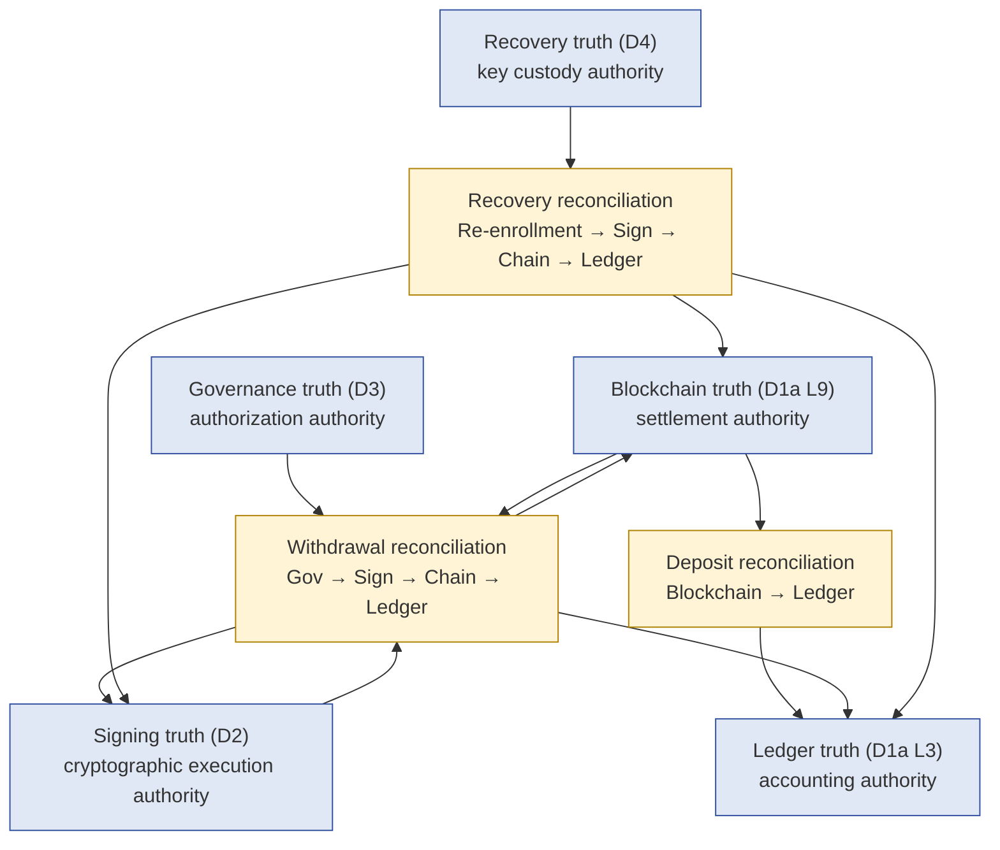
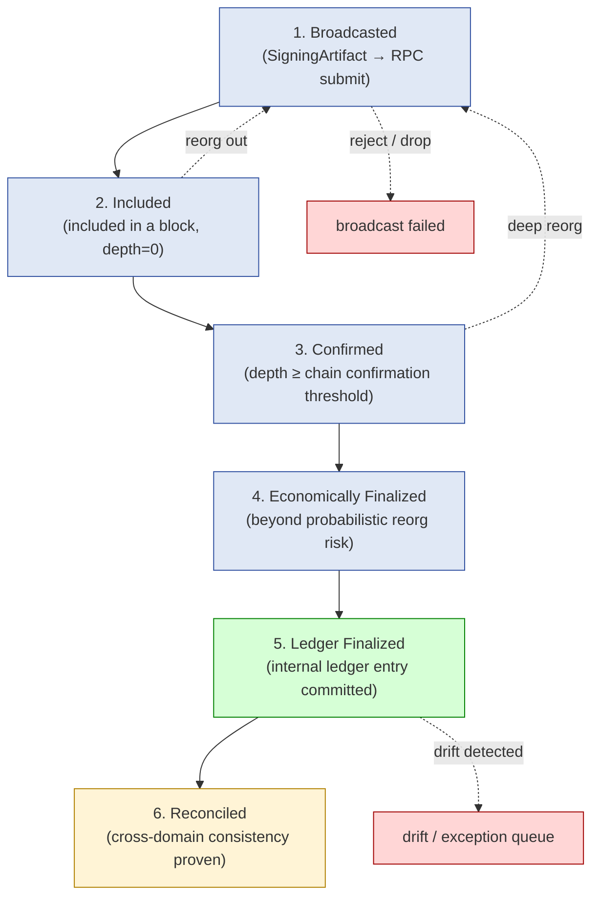
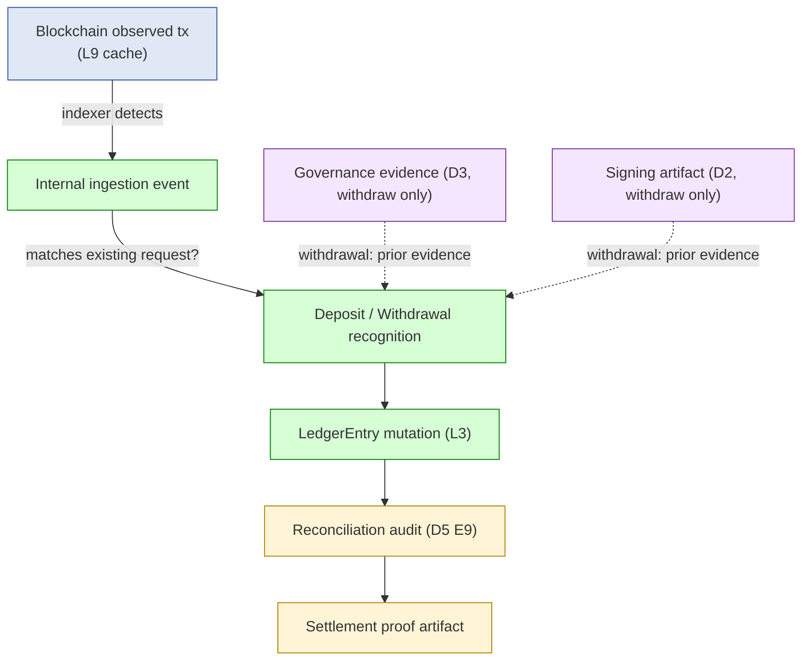
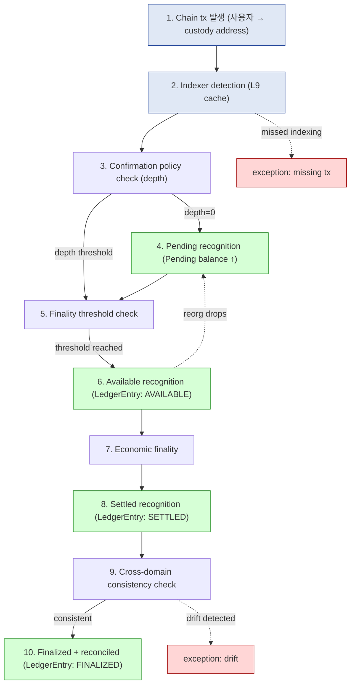
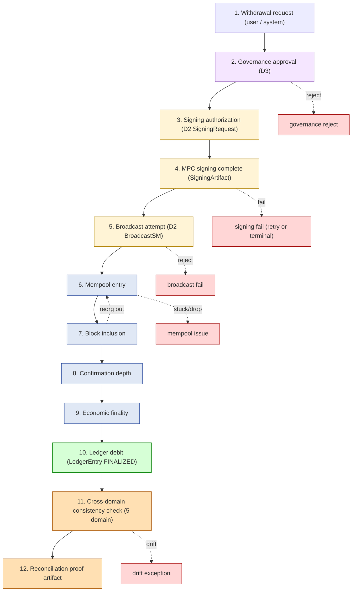
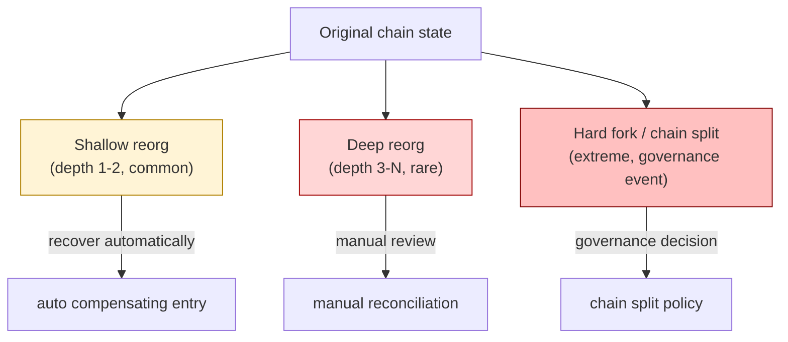
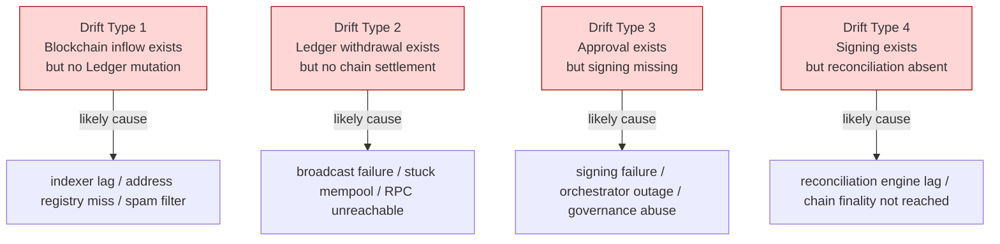
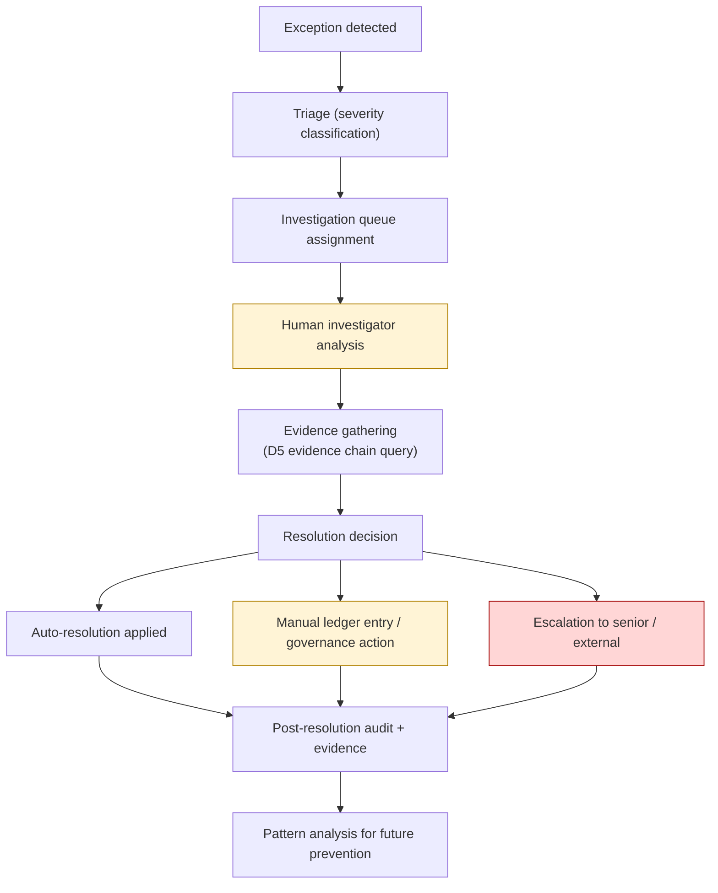
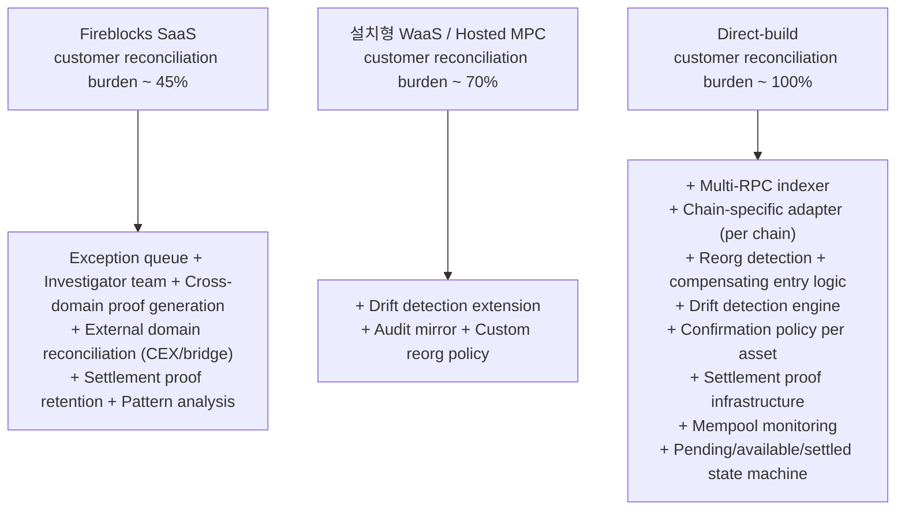

# Custody Wallet — Reconciliation / Settlement / Consistency Reasoning

> **본 문서의 위치**: D5 의 Unified Evidence Spine 위에서 **5 truth domain (Blockchain / Ledger / Governance / Signing / Recovery) 의 cross-domain consistency** 를 어떻게 검증하는가의 reasoning. D2 의 BroadcastStateMachine 의 INCLUDED_IN_BLOCK 이후를 본 문서가 owner — depth tracking / reorg compensation / finality 결정 / drift detection / exception workflow.

> **본 문서가 답하는 핵심 질문**: 왜 "balance 가 맞는가" 가 reconciliation 의 본질 아닌가? 왜 single-domain truth 만으로는 deposit / withdrawal 완료 보장 못 하는가? 왜 reorg recovery 가 단순 rollback 이 아닌가? 왜 reconciliation 의 자동화에는 limit 이 있는가?

---

## 0. 핵심 명제 (10초 이해)

1. **Reconciliation is not balance comparison. Reconciliation is cross-truth-domain consistency proof.** — 본 문서의 thesis.
2. **5 truth domain 의 authority 가 phase 별로 다름** — Blockchain = settlement authority / Ledger = accounting authority / Governance = authorization / Signing = cryptographic execution / Recovery = key custody.
3. **Settlement ≠ Confirmation** — confirmation 은 block 포함 + depth 도달; settlement 은 economic finality + ledger commit + cross-domain agreement.
4. **6 settlement state 분리**: Broadcasted / Included / Confirmed / Economically Finalized / Ledger Finalized / Reconciled.
5. **4 balance type 분리**: Pending / Available / Settled / Finalized — 각각 다른 economic risk 와 다른 운영 의미.
6. **Reorg recovery ≠ Simple rollback** — append-only invariant 유지하면서 chain truth 변화에 대응 (compensating LedgerEntry pattern).
7. **Drift detection = reconciliation 의 핵심 기능** — balance 일치가 아니라 inter-domain event 의 missing/excess 발견.
8. **Reconciliation 의 자동화 한계** — exception workflow / human investigation 은 irreducible (D5 F9-F10 의 직접 결과).
9. **Snapshot consistency ≠ Temporal consistency** — 특정 시점 balance equality 가 lineage 무결성 보장 못함.
10. **External-domain reconciliation 은 추가 trust assumption 필요** — exchange / bridge / custodian 의 evidence 는 third-party trust 영역.

---

## 1. 5 Truth Domain + Authority Mapping



### 1.1 Authority 의 phase 의존성

같은 truth domain 도 phase 마다 authority 가 다름:

| Phase | Authoritative truth | 이유 |
|---|---|---|
| Authorization | Governance | 누가 허가했는가 = governance 가 결정 |
| Signing | Signing (cryptographic) | 누가 cryptographically sign 했는가 = signing artifact 가 결정 |
| Broadcasting | Signing → Blockchain | signed tx 가 mempool 진입; chain 이 받아들이는가는 chain 결정 |
| Mempool | Blockchain (limited) | mempool 은 chain 의 unconfirmed view |
| Confirmed | Blockchain | 어느 block 에 포함됐는가 = chain 결정 |
| Economically final | Blockchain | finality threshold 도달 = chain 결정 |
| Ledger entry | Ledger | internal accounting 의 reflection = ledger 결정 |
| Reconciled | Cross-domain consistency | 모든 domain 이 agree |

→ Reconciliation 은 phase 별 authority 의 hand-off 가 모두 완료됐는가의 검증.

### 1.2 Authority 충돌 시 resolution

| 충돌 | Resolution rule |
|---|---|
| Blockchain vs Ledger balance | Blockchain authoritative → Ledger 가 compensating entry |
| Governance evidence absent but signing happened | **Governance incident** — 둘은 ⊥ truth domain, 충돌 자체가 anomaly |
| Signing artifact valid but no on-chain inclusion | Broadcast 미완료 또는 chain rejection → SigningArtifact retain, BroadcastAttempt 새로 |
| Chain finality 후 ledger entry 미생성 | Ledger projection lag — auto-mutation 또는 drift alert |
| Recovery happened but signing 안 됨 | Re-enrollment 미완료 — Recovery aggregate 의 책임 |

### 1.3 Cross-domain consistency 의 의미

(★ 핵심 명제 §0.1)

- "Reconciliation OK" 의 의미는 **각 truth domain 이 같은 economic reality 를 가리킨다**.
- 단순 balance 일치는 **necessary but not sufficient**.
- Sufficient condition: balance 일치 + lineage 무결성 + event 완전성 + 충돌 0 + drift 0.
- → Reconciliation engine 의 output 은 "balance OK / NOT OK" 가 아닌 **consistency proof artifact** (signed evidence).

---

## 2. Settlement State Progression

### 2.1 6 settlement state



### 2.2 각 state 의 의미

| State | 의미 | Authority |
|---|---|---|
| **Broadcasted** | RPC 에 submit, mempool 진입 대기 | Signing |
| **Included** | block 포함 (depth=0) | Blockchain |
| **Confirmed** | depth ≥ chain-specific threshold (BTC 6 / ETH 64 etc.) | Blockchain |
| **Economically Finalized** | reorg 위험이 negligible — chain 의 finality property 별 (BTC: probabilistic ~6+ / ETH post-merge: 2-epoch / Cosmos: instant) | Blockchain |
| **Ledger Finalized** | internal LedgerEntry CONFIRMED commit | Ledger |
| **Reconciled** | 5 truth domain 의 consistency proof 생성 | Cross-domain |

### 2.3 Why "Confirmation ≠ Settlement"

- Confirmation = "block 에 포함됐다 + depth 도달" (chain-side fact).
- Settlement = "더 이상 변하지 않는다 + accounting 반영 + cross-domain agree" (multi-domain fact).
- 차이가 발생하는 영역:
  - **Reorg risk** (post-confirmation 도 reorg 가능, chain 별 differing finality)
  - **Indexer lag** (chain → custody system 의 ingestion delay)
  - **Ledger projection delay** (chain event → ledger entry 의 비동기 처리)
  - **Drift** (다른 domain 의 evidence 와의 불일치)

### 2.4 Chain-specific finality

(★ Hypothesis — chain-specific knowledge)

| Chain | Probabilistic / Deterministic | 권장 Economic Finality threshold |
|---|---|---|
| Bitcoin | Probabilistic | 6 confirmations (~60min) for high value, 1 for low |
| Ethereum (post-merge) | Hybrid (probabilistic + 2-epoch deterministic) | 2 epochs (~13min) for deterministic, depth varies |
| Solana | Probabilistic + fast | ~32 slots typical |
| Cosmos / Tendermint | Instant deterministic | Instant (1 block) |
| L2 (Optimistic Rollup) | Challenge period 의존 | 7 days for trustless withdrawal |
| L2 (ZK Rollup) | Proof-dependent | Proof submission time |

→ 각 chain 의 finality property 가 다름 → settlement threshold 가 chain 별 다름. Reconciliation engine 은 chain-adapter pattern.

### 2.5 State 간 transition 의 SLA

(★ Hypothesis — operational reasoning)

- Broadcasted → Included: seconds-minutes (chain-specific)
- Included → Confirmed: minutes (chain-specific threshold)
- Confirmed → Economically Finalized: minutes-hours (chain-specific)
- Economically Finalized → Ledger Finalized: seconds-minutes (system internal)
- Ledger Finalized → Reconciled: minutes-hours (batch reconciliation cycle)

→ "Total settlement latency" 는 위 합 — high-value withdrawal 의 UX SLA 결정.

---

## 3. Pending vs Finalized Balance Model

### 3.1 4 balance type

```mermaid
graph TB
    P["Pending balance<br/>(observed but not confirmed)"]
    A["Available balance<br/>(confirmed but reorg-risky)"]
    S["Settled balance<br/>(economically finalized)"]
    F["Finalized balance<br/>(ledger-reconciled + cross-domain consistent)"]

    P -->|confirmation threshold reached| A
    A -->|finality threshold reached| S
    S -->|ledger reconciled + consistency proof| F

    P -.->|reorg drops| P_LOST["balance loss"]
    A -.->|deep reorg| P
    S -.->|extreme reorg (rare)| A
    F -.->|drift detected| EX["exception queue"]

    classDef pending fill:#f0f0f0,stroke:#888
    classDef risky fill:#fff4d6,stroke:#b08000
    classDef final fill:#d6ffd6,stroke:#008000
    classDef fail fill:#ffd6d6,stroke:#a00000
    class P pending
    class A risky
    class S,F final
    class P_LOST,EX fail
```

### 3.2 Balance type 별 economic risk

| Balance | Spendable? | Risk |
|---|---|---|
| **Pending** | 보통 No (또는 매우 제한) | Full reorg / drop risk |
| **Available** | Yes (conservative chain) / No (strict policy) | Reorg risk (depth-dependent) |
| **Settled** | Yes | Negligible reorg risk; 단 ledger drift 가능 |
| **Finalized** | Yes (full confidence) | None (operational only) |

### 3.3 Why 4 balance type 필요

(★ 분리 reasoning)

- **Pending**: deposit detection 즉시 user 에게 visibility 제공 (UX), 단 economic 권한 없음.
- **Available**: 일반적 사용 — 보통 confirmation threshold 통과 시점.
- **Settled**: high-value operation 의 prerequisite — irreversibility 보장.
- **Finalized**: accounting / 회계 / 규제 submission 의 ledger-side truth.

→ 단일 "balance" 만 노출하면 4 종류의 economic 의미가 collapse 됨. Risk-aware UX 와 risk-aware 운영의 핵심.

### 3.4 Balance computation 의 source

| Balance | 계산 source |
|---|---|
| Pending | L9 cache + mempool observation |
| Available | L3 LedgerEntry (state=AVAILABLE) |
| Settled | L3 LedgerEntry (state=SETTLED) |
| Finalized | L3 LedgerEntry (state=FINALIZED) + cross-domain consistency proof |

→ L3 의 single source 이지만, **state field 가 4 단계 transition** — append-only entries 위의 projection.

### 3.5 Liquidity / capital efficiency 영향

(★ Hypothesis — operational reasoning)

- "Settled balance 만 사용 가능" 정책: 안전 ↑, 자본 효율 ↓ (오래 lock-up).
- "Available balance 사용 허용" 정책: 자본 효율 ↑, 안전 ↓ (reorg 시 reversal 위험).
- Reconciliation engine 의 finality threshold 결정 = liquidity vs safety 의 trade-off.

---

## 4. Cross-Domain Consistency Graph

### 4.1 Cross-domain event lineage (D5 §3 의 reconciliation side)



### 4.2 Consistency check 의 5 question

(D5 §6.3 의 reconciliation 확장)

| Question | Answer source |
|---|---|
| 이 chain tx 가 어느 internal request 와 matched 됐나? | RECOG event + correlation_id |
| 이 LedgerEntry 의 backing chain tx 는 무엇인가? | LedgerEntry → tx_hash FK |
| 이 withdrawal 의 governance evidence 는 누구인가? | causation chain → ApprovalRequest |
| 이 withdrawal 이 cryptographically authorized 됐나? | causation chain → SigningArtifact |
| 모든 domain 의 timestamp 가 plausible ordering 인가? | 5-clock cross-domain check |

→ 위 5 question 의 답이 **모두 cleanly resolve** 되면 reconciliation success. 하나라도 unresolved 면 drift / exception.

### 4.3 Consistency proof artifact

(★ §0.1 의 핵심 산출)

Reconciliation engine 의 output:
- **Per-event proof**: 특정 chain tx 의 cross-domain consistency 입증
- **Per-period proof**: 기간 (예: 일간) 의 모든 reconciliation 결과 종합
- **Snapshot proof**: 특정 시점 balance snapshot 의 lineage 무결성

→ Proof 는 signed envelope + correlation_id list + 5-domain attestation. 규제 / audit / 법적 절차의 evidence.

---

## 5. Deposit Reconciliation Lifecycle

### 5.1 Generalized deposit flow



### 5.2 Deposit reconciliation 의 special property

- **Governance domain 미관여** — deposit 는 user-initiated, custody 의 governance 가 결정 안 함.
- **Signing domain 미관여** — custody 는 deposit 를 sign 안 함, 수신만.
- **Recovery domain 미관여** (정상 flow).
- → Deposit 는 **2-domain reconciliation** (Blockchain ↔ Ledger).

### 5.3 Deposit 의 핵심 difficulty

| Difficulty | 이유 |
|---|---|
| **Address matching** | 어느 address 가 어느 customer / vault 인가 — custody address registry |
| **Memo / tag matching** | 일부 chain (XRP, Stellar, Cosmos) 은 memo 가 user 식별 |
| **Confirmation policy per asset** | BTC 6 / ETH 64 / Cosmos 1 — chain-specific |
| **Duplicate detection** | indexer reorg 시 같은 tx 가 다시 보일 수 있음 |
| **Dust / spam tx** | very small tx 가 정상 deposit 인가 anti-spam filter 의 대상인가 |
| **Smart contract interaction** | ERC20 transfer / DEX swap result / NFT transfer 등 abstraction 별 |

### 5.4 "Observed tx ≠ Credited deposit" reasoning

(§0 의 명제)

- Indexer 가 tx 를 observed = blockchain truth 에 존재.
- 그러나 credited deposit 이 되려면:
  - Custody address 와 match (address registry)
  - Confirmation threshold 도달
  - Anti-spam filter 통과
  - Memo / tag 매칭 성공
  - Asset type 인식 (token contract 등록 여부)
- 위 단계 중 하나라도 실패 → exception queue / manual investigation.

---

## 6. Withdrawal Reconciliation Lifecycle

### 6.1 Generalized withdrawal flow



### 6.2 Withdrawal reconciliation 은 5-domain

- Governance (W2)
- Signing (W3-W4)
- Blockchain (W5-W9)
- Ledger (W10)
- Reconciliation (W11-W12)

→ Deposit (2-domain) 보다 reconciliation 복잡도 ↑↑. 모든 5 domain 의 evidence 가 cleanly chain 으로 link.

### 6.3 "Broadcast success ≠ Withdraw completed" reasoning

- Broadcast = RPC accepted, mempool entry.
- Withdraw completed = 5 settlement state 모두 통과 + 5-domain reconciled.
- Broadcast 와 withdrawal completion 사이의 모든 phase 가 fail point.

### 6.4 Re-enrollment / Recovery 경유 withdrawal

(D4 의 연결)

- Recovery 이후 새 key 로 첫 withdrawal 은 verification test (D4 §6.3).
- 일반 withdrawal flow + recovery audit cross-reference.
- → 6-domain reconciliation (위 5 + Recovery).

---

## 7. Reorg Handling

### 7.1 Reorg 의 3 종류



### 7.2 Compensating LedgerEntry pattern (D1a §6.4 의 확장)

- 원본 LedgerEntry 는 그대로 (append-only invariant).
- Reorg 로 chain tx 가 drop 되면 **compensating entry** 를 append (반대 direction, 같은 amount).
- Net balance 는 0 으로 복귀, 그러나 history 는 "발생했고 reverted 됐다" 의 evidence.

→ "Reorg recovery ≠ Simple rollback" — rollback 은 history mutation, custody 에서 금지.

### 7.3 Reorg detection mechanism

- Watcher process 가 chain 의 best-block 을 추적.
- 새 block 이 기존 chain 의 ancestor 와 different parent 를 가리키면 reorg detected.
- 영향받은 tx 의 set 계산 → 각 tx 의 LedgerEntry 에 compensating entry trigger.

### 7.4 Reorg 의 cross-domain 영향

| Domain | 영향 |
|---|---|
| Blockchain | 새로운 truth (reorged chain) |
| Ledger | compensating entry append |
| Governance | 영향 없음 (decision evidence 는 변경 안 됨) |
| Signing | 영향 없음 (SigningArtifact 는 변경 안 됨); 단, 같은 tx 가 다시 broadcast 필요할 수 있음 |
| Recovery | 영향 없음 |

→ Reorg 는 본질적으로 **chain ↔ ledger 의 reconciliation 문제**. Governance / Signing / Recovery 의 truth 는 immutable, reorg 영향 없음.

### 7.5 Deep reorg 의 governance dimension

(★ Hypothesis — extreme case)

- Depth N (e.g. N>10) 이상의 reorg 는 chain 자체의 governance event.
- Custody system 의 정책 결정 필요:
  - 새 chain 을 따라갈 것인가?
  - 기존 chain 을 유지할 것인가? (51% attack 의심 시)
  - Withdrawal / deposit 의 freeze?
- 자동화 불가 — **manual governance decision** 필요.
- → Deep reorg 는 exception workflow 의 가장 위험한 case.

---

## 8. Drift Detection Framework

### 8.1 Drift 의 4 종류



### 8.2 Detection mechanism

| Type | Detection |
|---|---|
| Drift 1 | 매 chain block 의 incoming tx 와 LedgerEntry 의 match — unmatched chain tx 가 drift |
| Drift 2 | 매 LedgerEntry (PENDING/SETTLING) 의 chain status check — broadcasted but not confirmed 가 N 시간 이상이면 drift |
| Drift 3 | 매 ApprovalRequest (APPROVED) 의 child SigningRequest check — APPROVED but no SigningRequest 가 N 시간 이상이면 drift |
| Drift 4 | 매 SigningArtifact 의 BroadcastAttempt + ReconciliationProof check — signed but no proof 가 N 시간 이상이면 drift |

→ 4 종류 모두 **time-window check** + **cross-domain query**.

### 8.3 Drift severity 분류

| Severity | 의미 | Action |
|---|---|---|
| **Low** | 자연스러운 lag (예: indexer 1-2 block 지연) | metric 만 emit |
| **Medium** | threshold 도과 (예: 10 block 지연) | alert + auto-retry |
| **High** | persistent (예: 30 min 미해소) | exception queue + on-call page |
| **Critical** | drift 가 fund loss 가능성 시사 | incident response + governance freeze |

### 8.4 Drift 의 root cause analysis

(★ Hypothesis — operational reasoning)

- Drift 는 보통 **시스템적 원인** (lag / outage / config) 이 대부분.
- 그러나 일부는 **adversarial signal** (전체 시스템 침해 시도, 내부자 abuse).
- Drift root cause 분석 자체가 forensic 의 한 form — D5 의 evidence chain 활용.

---

## 9. Exception Workflow

### 9.1 Reconciliation 자동화의 한계

(★ §0.8)

- Drift 의 일부는 자동으로 resolve 가능 (auto-retry, indexer catch-up).
- 그러나 **잔여 drift** 는 항상 존재 — manual investigation 필요.
- Reason:
  - Address registry 누락 (custodian 측 작업 필요)
  - Smart contract 의 비표준 동작
  - 외부 시스템 (exchange, bridge) 의 evidence 부족
  - Adversarial scenario
- → **Exception queue + Human investigator** 는 irreducible operational component.

### 9.2 Exception workflow



### 9.3 Manual ledger entry 의 governance

- Reconciliation 의 manual entry 는 **append-only invariant 유지** + **governance evidence** 필요.
- 일반 LedgerEntry 와 같은 schema, 단 actor = investigator + reason = exception_id.
- 모든 manual entry 는 governance review SLA (예: 24h within senior review).
- → Manual entry abuse 는 fraud vector — frequency monitoring + 별도 audit class.

### 9.4 Pattern analysis

- 반복 발생하는 exception pattern 은 systematic issue 의 signal.
- Pattern 의 예: 특정 chain 의 reorg 빈도 ↑, 특정 token 의 metadata 누락, 특정 customer 의 abnormal tx pattern.
- → Reconciliation engine 의 입력은 정적 rule 만이 아니라 **pattern detection ML / heuristic** 도 포함.

---

## 10. Temporal Consistency Reasoning

### 10.1 Snapshot consistency vs Temporal consistency

(§0.9)

| 개념 | 의미 |
|---|---|
| **Snapshot consistency** | 특정 시점 t 에 모든 domain 의 balance 가 일치 |
| **Temporal consistency** | event sequence + lineage + ordering 이 무결 |

→ Snapshot consistency 는 temporal consistency 의 **necessary but not sufficient**.

### 10.2 Snapshot 만 보면 놓치는 것

- Event ordering 의 정합성 (event A 가 event B 보다 먼저 발생?)
- Missing event 의 detection
- Concurrent transaction race condition
- Pending rollback (이후 reorg / drift 로 변할 가능성)
- Lineage 의 끊김

### 10.3 Temporal consistency 의 검증

- D5 의 5-clock model + causation_id chain.
- 각 event 의 causation_id 가 valid parent 를 가리키는가?
- Event 시퀀스가 chain-side ordering 과 plausible 한가?
- 모든 correlation_id 의 lineage 가 완전한가?

### 10.4 Snapshot consistency vs Temporal — operational implication

| Use case | Snapshot 충분? | Temporal 필요? |
|---|---|---|
| Daily balance sheet | 보통 충분 | 깊은 audit 시 필요 |
| Audit report (감사) | 부족 | 필요 |
| Forensic investigation | 부족 | 필수 |
| Regulatory submission | 보통 충분 | 의문 발생 시 필수 |
| Internal accounting | 충분 | drift 발견 시 필요 |

### 10.5 Periodic temporal consistency proof

(★ Hypothesis — operational pattern)

- 권장: 매일 / 매 (chain 별) periodic temporal consistency proof 생성.
- Proof artifact = 해당 기간의 correlation_id 별 lineage 무결성 검증 결과 + signed envelope.
- 이 proof artifact 자체가 reconciliation audit evidence (D5 E10).

---

## 11. Reconciliation Limitations

### 11.1 Balance equality ≠ Consistency proof

(§0.7 의 reasoning 확장)

- 두 domain 의 balance 가 같음 = 1 dimension 의 일치.
- Consistency proof = 모든 domain 의 evidence + lineage + ordering 의 일치.
- Balance equality 가 우연 또는 잘못된 reconciliation 으로 일치할 가능성 — proof artifact 가 추가 검증.

### 11.2 Reconciliation success ≠ No hidden inconsistency

- Reconciliation engine 이 결과 "OK" 를 산출했다고 inconsistency 0 보장 아님.
- 가능한 hidden inconsistency:
  - Evidence gap (system 이 capture 못 한 영역)
  - Out-of-scope domain (external bridge, custodian, exchange)
  - Adversarial false evidence (compromised system 의 forged events)
  - Time-skewed event ordering 의 false positive

### 11.3 Full replay ≠ Perfect reconstruction (D5 §7 의 재확인)

- External 의존성, wall-clock, non-determinism 으로 replay 가 100% deterministic 안 됨.
- 따라서 reconciliation 의 replay-based 검증도 approximation.

### 11.4 External-domain reconciliation 의 한계

| External domain | Trust assumption |
|---|---|
| **Centralized Exchange (CEX)** | exchange API 의 evidence — exchange 가 truth 제공 의무 |
| **Bridge / cross-chain** | bridge 의 attestation — bridge 의 trust property 의존 |
| **Custodian (sub-custodian)** | sub-custodian 의 audit report — third-party trust |
| **Oracle / price feed** | oracle data 의 freshness + accuracy |

→ External domain 의 evidence 는 system 의 own evidence 와 다른 trust class. Cross-domain reconciliation 의 가장 어려운 영역.

### 11.5 Human evidence dependency

(D5 F9 의 reconciliation side)

- 일부 exception 의 resolution 은 phone call / email / 대면 confirmation 이 필요.
- 이 evidence 는 system 외부 — capture 가 explicit procedure 필요.
- 따라서 reconciliation 의 일부는 항상 **human-in-the-loop**.

---

## 12. Operational Fragility Map

```mermaid
graph TB
    F1["F1. Chain reorg<br/>(short/deep 모두 가능)"]
    F2["F2. Partial ingestion<br/>(indexer down, missed block)"]
    F3["F3. Duplicate observation<br/>(re-indexing after reorg)"]
    F4["F4. Delayed indexing<br/>(chain ingestion lag)"]
    F5["F5. Out-of-order event<br/>(parallel processing)"]
    F6["F6. Ledger drift<br/>(projection lag / bug)"]
    F7["F7. Broadcast ambiguity<br/>(stuck mempool, replaced tx)"]
    F8["F8. Confirmation race<br/>(threshold edge condition)"]
    F9["F9. External dependency mismatch<br/>(exchange / bridge evidence)"]
    F10["F10. Human exception workflow<br/>(irreducible manual investigation)"]

    F1 -->|mitigation| M1["compensating LedgerEntry pattern + chain-specific reorg policy"]
    F2 -->|mitigation| M2["redundant indexers + checkpoint + alert on lag"]
    F3 -->|mitigation| M3["idempotency via tx_hash + lineage check"]
    F4 -->|mitigation| M4["multi-provider redundancy + lag SLO"]
    F5 -->|mitigation| M5["correlation_id-based ordering + atomic projection"]
    F6 -->|mitigation| M6["drift detection + alert + reconciliation proof"]
    F7 -->|mitigation| M7["chain-specific stuck handling + RBF/cancel policy"]
    F8 -->|mitigation| M8["depth-buffered threshold + finality policy per asset"]
    F9 -->|mitigation| M9["external evidence mirror + signed attestation + manual review"]
    F10 -->|mitigation| M10["irreducible — exception queue + investigator team + SLA"]
```



### 12.1 Fragility 분류

| 분류 | items | 성격 |
|---|---|---|
| **Chain-side** | F1, F4, F7, F8 | chain semantic, mitigatable via policy |
| **Pipeline** | F2, F3, F5, F6 | engineering discipline |
| **External / Human** | F9, F10 | **irreducible** |

### 12.2 Reconciliation engine 의 SLA

(★ Hypothesis — operational target)

| Metric | 권장 target |
|---|---|
| Drift detection latency | < 5 minutes |
| Exception triage SLA | < 1 hour for high severity |
| Manual investigation SLA | < 24h for high severity |
| Cross-domain consistency proof cadence | hourly or daily |
| Reorg recovery automation | < 1 minute for shallow, manual for deep |

---

## 13. SaaS vs Self-hosted vs Direct-build Reconciliation Burden

### 13.1 Plane × Ownership 매트릭스

| Sub-plane | Fireblocks SaaS | 설치형 WaaS / Hosted MPC | 직접 구축 |
|---|---|---|---|
| **Indexer / chain ingestion** | Vendor | Vendor (보통) | Customer (multi-RPC redundancy) |
| **Confirmation policy** | Vendor + customer config | Vendor + customer config | Customer 자체 chain adapter |
| **Pending balance projection** | Vendor | Vendor | Customer |
| **Reorg handling** | Vendor (automatic shallow + manual deep) | Vendor | Customer (compensating entry logic) |
| **Drift detection** | Vendor partial + customer extended | Vendor + customer integration | Customer 자체 engine |
| **Exception queue** | Customer (with vendor support) | Customer | Customer |
| **Manual investigation** | **Customer operations team** | Customer | Customer |
| **Reconciliation proof generation** | Customer (vendor data export) | Customer | Customer |
| **Cross-domain consistency** | Customer (vendor data + customer system) | Customer | Customer |
| **Settlement proof retention** | Customer SIEM | Customer | Customer |

→ **Reconciliation 은 SaaS 사용해도 customer 책임이 상당히 큰 영역**. Vendor 가 chain-side ingestion 과 shallow reorg 까지는 흡수하지만, exception workflow / cross-domain proof / 외부 domain reconciliation 은 customer 책임.

### 13.2 Customer reconciliation burden 비교 (★ Hypothesis)



### 13.3 Reconciliation lock-in pivot

가장 큰 burden 영역 (direct-build 시):
1. **Multi-chain adapter pattern** — 각 chain 별 finality / reorg / mempool / fee market 의 chain-specific logic.
2. **Indexer redundancy + multi-RPC** — single RPC 실패 시 multi-provider failover.
3. **Compensating entry logic** — reorg-aware ledger mutation.
4. **Exception workflow + investigator team** — human operations.

이 4 가 burden 의 ~80% (★ Hypothesis).

### 13.4 Recommendation (운영 관점)

| Context | 권장 |
|---|---|
| 자산 < threshold, 단일 chain, 단순 deposit/withdraw | SaaS — vendor 의 reconciliation backbone 활용 |
| Multi-chain, multi-asset, 중견 자산 | Hosted MPC + customer-side cross-domain proof |
| Multi-chain + multi-region + 규제 + CEX/bridge 통합 | Direct-build reconciliation + 자체 investigator team |
| Crypto exchange / 매우 큰 자산 / 자체 chain support | Direct-build + 외부 audit firm 정기 검증 + external blockchain anchoring |

→ 추천 ≠ fact. External domain (CEX / bridge / sub-custodian) 노출 정도가 reconciliation complexity 의 핵심 결정.

---

## 14. 핵심 Reasoning Question (Q1-Q10)

### Q1. Reconciliation = consistency proof 의 이유

§0.1, §1.3. Balance 일치는 1 dimension 의 일치일 뿐. 5 truth domain 의 evidence + lineage + ordering 의 cross-consistency 가 진짜 reconciliation. Proof artifact 가 산출.

### Q2. Settlement ≠ Confirmation

§2.3. Confirmation 은 chain-side fact (block 포함 + depth). Settlement 는 multi-domain fact (chain final + ledger commit + cross-domain agree). 차이 영역: reorg risk / indexer lag / ledger projection delay / drift.

### Q3. Why 4 balance type 필요

§3.3. Pending / Available / Settled / Finalized 가 각각 다른 economic risk / spendability / 운영 의미. 단일 balance 만 노출하면 4 종류 의미 collapse → risk-aware UX 와 운영 불가.

### Q4. Reorg recovery ≠ Simple rollback

§7.2. Append-only invariant 유지하면서 chain truth 변화 반영 = compensating LedgerEntry pattern. Rollback (history mutation) 은 custody 에서 금지. History 는 "발생 + reverted" 로 유지.

### Q5. Drift detection 이 reconciliation 의 핵심인 이유

§8. Balance 일치만 보면 missing event 가 안 보임. Drift detection = inter-domain event 의 missing/excess 발견 → reconciliation 의 가장 가치 있는 output. 4 종류 drift 별 detection mechanism + severity.

### Q6. Reconciliation 의 자동화 한계

§9.1, §11.5. Indexer lag / spam filter / address registry 누락 / smart contract 비표준 동작 / external domain evidence / adversarial scenario 등은 manual investigation 필요. Exception queue + investigator team 은 irreducible operational component.

### Q7. Snapshot consistency ≠ Temporal consistency

§10. Snapshot 은 특정 시점 dimension equality; temporal 은 event sequence + lineage + ordering 의 무결성. Audit / forensic / regulatory 시 temporal 필요. Periodic temporal proof 권장.

### Q8. External domain reconciliation 의 한계

§11.4. CEX / bridge / sub-custodian / oracle 의 evidence 는 third-party trust class. Own evidence 와 다른 trust property. Cross-domain reconciliation 의 가장 어려운 영역.

### Q9. Deep reorg 의 governance dimension

§7.5. Depth N>10 reorg 는 chain 자체의 governance event. 새 chain 따라갈지 / freeze 할지 / 51% attack 의심하는지 = manual decision 필요. 자동화 불가.

### Q10. Reconciliation 은 SaaS 에서도 customer 책임이 큰 이유

§13.1, §13.4. Vendor 가 indexing + shallow reorg 까지 흡수하지만 exception workflow / cross-domain proof / 외부 domain reconciliation / regulatory submission 은 customer scope. Vendor 의 reconciliation 은 customer 의 reconciliation 의 input 일 뿐.

---

## 15. Open Questions / Org Policy 영역

| 영역 | 질문 | 본 문서 범위 밖 이유 |
|---|---|---|
| Confirmation threshold per asset | BTC 6 / 3? ETH 64 / 32? L2 별? | risk appetite + asset value |
| Finality threshold per asset | economic threshold 산정 기준? | risk model + 자산 종류 |
| Pending balance UX | 즉시 표시 vs N conf 후? | UX vs risk |
| Available balance 사용 정책 | spendable / restricted? | liquidity vs safety |
| Reorg policy per chain | shallow auto / deep manual / 의 threshold | chain 별 risk |
| Stuck tx replacement (RBF / cancel) | which chain? when? | chain capability + 운영 정책 |
| Drift severity threshold | severity level 별 SLA | 운영 maturity |
| Exception queue routing | 어느 team / 어느 role? | org structure |
| Manual ledger entry authority | who / which role? | governance |
| External domain integration | CEX / bridge / sub-custodian 의 evidence 수집 방법? | partnership + integration cost |
| Reconciliation proof cadence | hourly / daily / on-demand? | forensic 요구 + cost |
| Settlement proof signing key | rotation 주기 + governance? | crypto policy |
| Chain split policy | hard fork 시 어느 chain 따라갈지? | governance + 법적 |
| Sub-custodian audit cadence | quarterly / annually / 정기? | trust framework |

---

## 16. 관련 wiki / entity reference + Uncertainty Boundary

### 관련 wiki

| 참조 | 어디서 사용 |
|---|---|
| [[entities/fireblocks/transaction]] | §5, §6 (deposit / withdrawal lifecycle) |
| [[entities/fireblocks/vault-account]] | §5.3 (address matching) |
| [[entities/fireblocks/blockchains]] | §2.4 (chain-specific finality) |
| [[entities/fireblocks/api-co-signer]] | §6 (withdrawal signing) |
| [[vendors/fireblocks/architecture]] | §13 (vendor reconciliation reference) |
| [[vendors/fireblocks/risks]] | §11 (limitation reasoning) |
| [[docs/architecture/vault-wallet-ledger-db-schema]] | §3, §7 (L3 LedgerEntry + L9 cache + Q4 reconciliation reasoning) |
| [[docs/architecture/signing-workflow-orchestration]] | §6, §7 (D2 BroadcastStateMachine handoff + §7 reorg) |
| [[docs/architecture/approval-state-machine-governance]] | §6 (withdrawal governance), §8 (drift type 3) |
| [[docs/architecture/recovery-ceremony-generalization]] | §6.4 (recovery 경유 withdrawal) |
| [[docs/architecture/audit-event-sourcing-evidence-chain]] | §1, §4, §10 (Unified Evidence Spine + 5-clock + temporal consistency) |

### Uncertainty Boundary (★ 절대 유지)

- 본 문서의 **5 truth domain authority mapping / 6 settlement state / 4 balance type / 4 drift type / compensating entry pattern / chain-specific finality threshold / 80% burden 분포 / external-domain irreducible trust** 는 모두 **generalized custody reconciliation architecture pattern** (Hypothesis ★).
- Fireblocks 의 reconciliation 구현은 reference model 로 인용 — vendor-specific 구현 detail 은 다를 수 있음.
- §2.4 chain-specific finality 는 일반 blockchain knowledge — 정확한 threshold 는 시간에 따라 변화.
- §13.2 burden 백분율 (~45% / ~70% / ~100%) 는 operational reasoning estimate.
- §13.4 추천 architecture 는 운영 권장 — fact 아님.
- §15 에 명시된 영역은 본 문서가 결정하지 않음.
- "확정 fact" 영역 (Fireblocks vendor docs 직접 인용 가능): wikilink + 출처 명시. 그 외는 generalized reasoning.

### 다음 단계 (D1b 이후)

본 문서는 D1b — **Reconciliation / Settlement / Consistency**. 이후:

- **D6 — 3-way Custody Decision Framework**: §13.4 의 의사결정 framework formalize, reconciliation 의 ownership 결정 포함.
- **D7 — Deposit Lifecycle**: §5 의 deposit reconciliation 의 detailed phase decomposition.
- **D8 — Withdrawal Lifecycle**: §6 의 withdrawal reconciliation 의 detailed phase decomposition + D2/D3/D4 통합.
- (Optional D9) — Multi-chain adapter pattern detail.

→ Reconciliation boundary (D1b) 는 D6 / D7 / D8 모두의 baseline. 5 truth domain 의 inter-consistency 정의가 향후 reasoning 의 input.

### Architecture reasoning layer 누적 결과 (D1a + D2 + D3 + D4 + D5 + D1b)

| 문서 | 핵심 명제 |
|---|---|
| D1a | 9-plane DB / secrets DB 저장 금지 / selective ES |
| D2 | 4 state machine 분리 / MPC retry non-idempotent / B5 fail-closed |
| D3 | 11-state governance SM / two-clock freshness / human coordination irreducible |
| D4 | Recovery = governance ceremony under cryptographic risk |
| D5 | Custody = evidence system / Unified Evidence Spine |
| **D1b** | **Reconciliation = cross-truth-domain consistency proof / 5 truth × 6 settlement state × 4 balance type** |

---

**Stage 32 D1b completion timestamp**: 2026-05-19.
