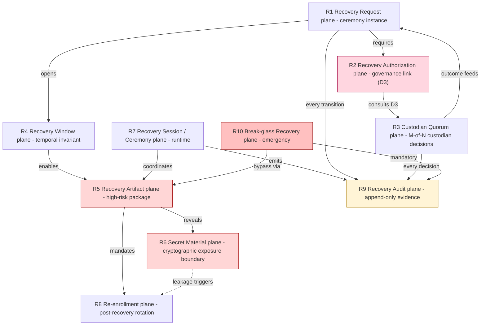
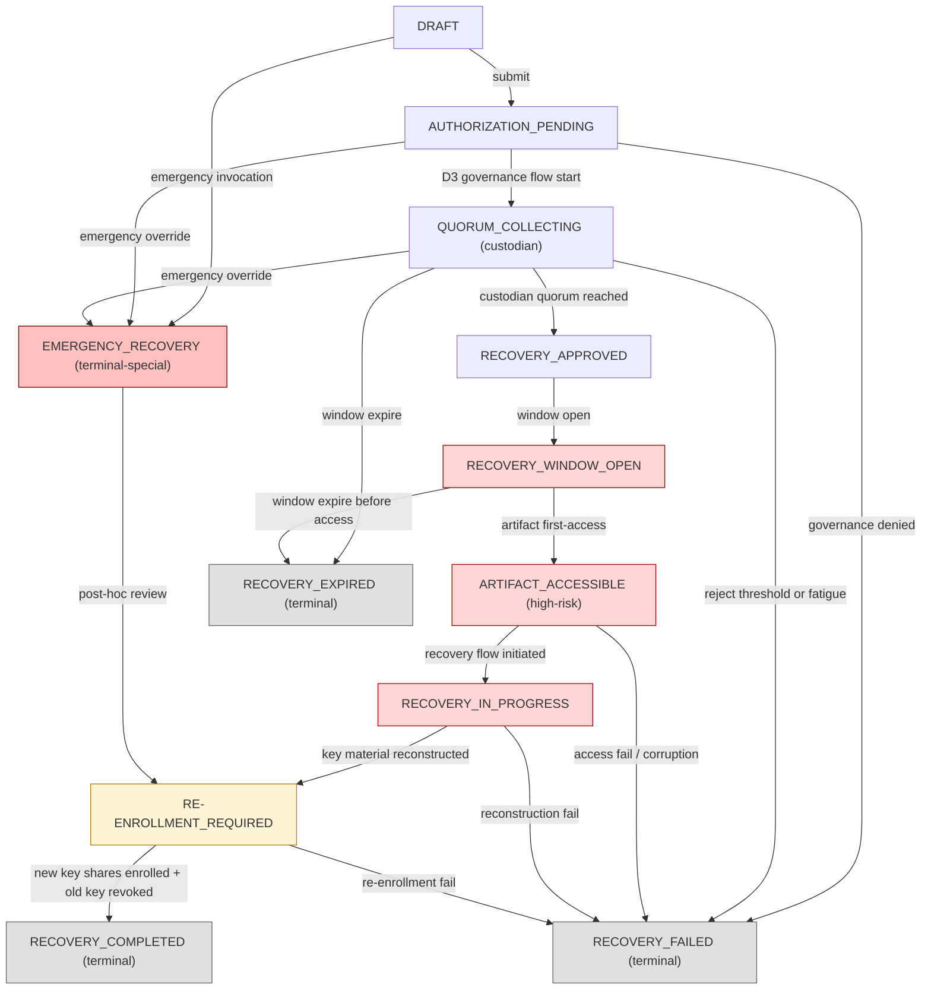
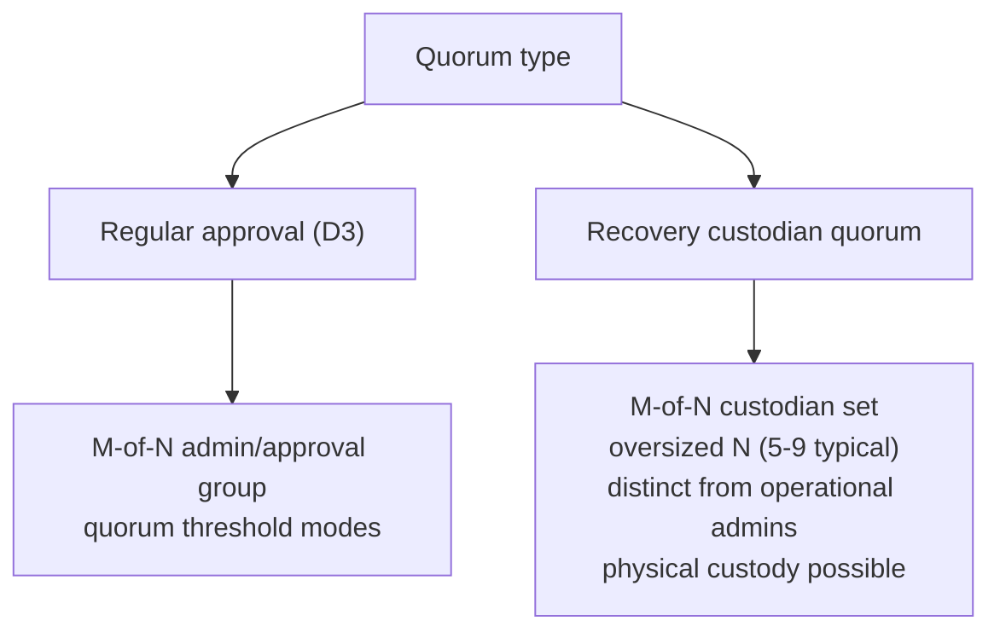
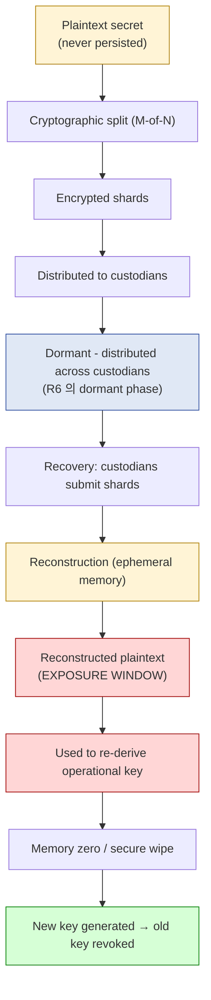
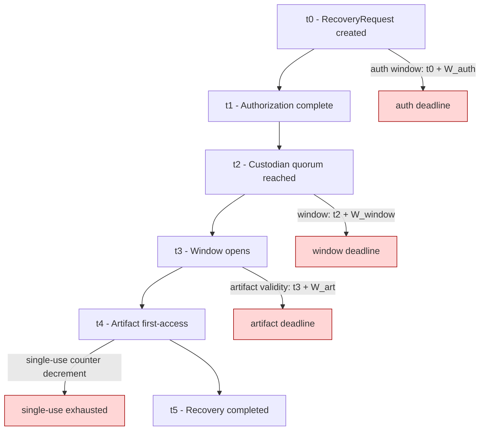
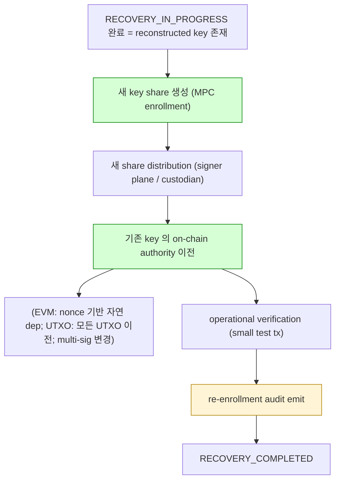
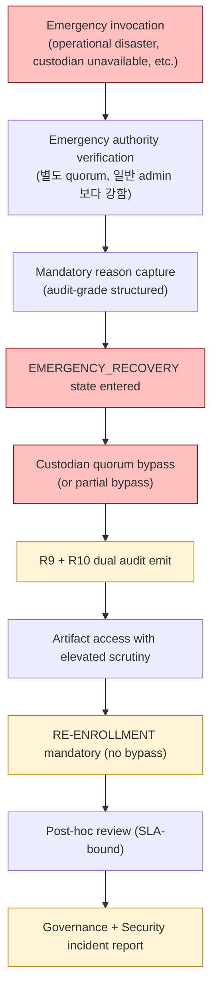
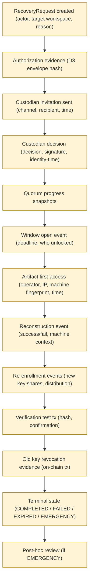
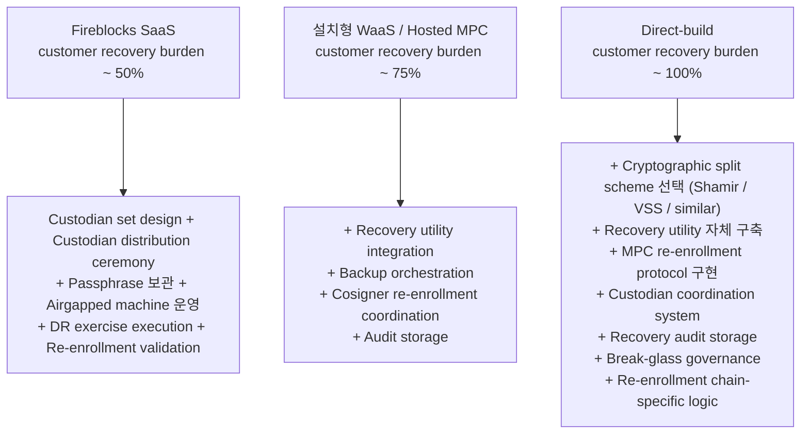

# Custody Wallet — Recovery Ceremony Generalization Reasoning

> **본 문서의 위치**: D3 의 governance reasoning + D2 의 signing trust boundary + D1a 의 L7 cold plane (recovery metadata) 를 통합하여, recovery 를 **governance-heavy cryptographic ceremony** 로 reasoning. Fireblocks 의 Workspace Keys Backup / Recovery Utility / 4-5 secret reconstruction model (Stage 29-31) 을 **reference implementation** 으로 활용하되, 본문은 generalized custody recovery architecture.

> **본 문서가 답하는 핵심 질문**: 왜 institutional custody 의 recovery 는 단순 "backup 복구" 가 아닌가? 왜 recovery 의 authorization 이 성공해도 secret material 의 안전이 보장되지 않는가? 왜 recovery 가 break-glass governance 의 가장 위험한 form 인가?

---

## 0. 핵심 명제 (10초 이해)

1. **Recovery is not a backup procedure. Recovery is a governance ceremony under cryptographic risk.** — 본 문서의 thesis.
2. **Recovery authorization ≠ Recovery safety** — governance 가 OK 해도 secret material 의 exposure window 가 열림.
3. **One-time download ≠ Secure custody** — single-use download property 는 leakage 를 막지 않음, 단지 replay 를 막음.
4. **Recovery completion ≠ Operational recovery success** — secret material 복원 ≠ 시스템이 실제로 다시 안전하게 작동.
5. **Approval success ≠ Recovery success** — D3 의 governance 완료가 recovery flow 의 시작점일 뿐.
6. **ARTIFACT_ACCESSIBLE 은 high-risk temporal state** — recovery state machine 의 가장 짧고 가장 위험한 state.
7. **Re-enrollment 은 mandatory post-recovery step** — recovery 사용 자체가 "기존 key material 이 노출됐을 수 있다" 의 신호 → rotation 필수.
8. **Recovery break-glass = governance 의 최상위 위험 surface** — abuse 시 fund 직접 손실 가능, frequency 자체가 incident.

---

## 1. Recovery Layered Architecture (R1-R10 sub-plane)



| Sub-plane | 책임 | D1a / D2 / D3 매핑 | 저장 / 실행 모델 |
|---|---|---|---|
| **R1 Recovery Request** | RecoveryRequest aggregate root | D1a L7 + L4 | state machine + append-only transition log |
| **R2 Recovery Authorization** | D3 governance flow 로의 link (별도 governance domain) | D3 G2-G10 | signed envelope (D3 §8 와 동형) |
| **R3 Custodian Quorum** | M-of-N custodian decision collection | D1a L7 + D3 G3 | append-only CustodianDecision events |
| **R4 Recovery Window** | window open/close 의 temporal invariant | runtime invariant | computed; deadline persisted |
| **R5 Recovery Artifact** | high-risk recovery package access mediation | D1a L7 (cold) | encrypted artifact + single-use access counter |
| **R6 Secret Material** | actual key share / passphrase / reconstructed key | **DB 절대 저장 금지** | HSM / sealed envelope / paper / ephemeral memory |
| **R7 Recovery Session** | ceremony runtime coordination | runtime only | in-memory + heartbeat |
| **R8 Re-enrollment** | post-recovery key rotation workflow | new SigningRequest cycle (D2) | new MPC enrollment → new key shares |
| **R9 Recovery Audit** | append-only evidence chain | D1a L7 별도 audit class | event store (별도 retention + access policy) |
| **R10 Break-glass Recovery** | emergency authorization path | D3 G8 의 specialized form | append-only + mandatory post-hoc review |

**핵심 invariant**:
- **R5 / R6 = 가장 위험한 plane**. R6 secret material 은 DB / API / log 어디에도 영속 저장 금지.
- **R3 / R9 = append-only** — recovery evidence chain.
- **R4 = runtime invariant** — 매 access 시 재계산.
- **R8 = mandatory post-condition** — R5 access 발생 시 자동 R8 trigger (★ 권장 invariant).
- **R10 = governance 의 최상위 위험 surface** — frequency 자체가 incident signal.

---

## 2. Recovery Ceremony State Machine



### 2.1 High-risk temporal states

| State | 왜 high-risk |
|---|---|
| **RECOVERY_WINDOW_OPEN** | governance 가 access 권한 부여 — 누구든 권한 가진 사람이 access 시 leak vector |
| **ARTIFACT_ACCESSIBLE** | secret material 이 actually accessible — 가장 짧지만 가장 위험 |
| **RECOVERY_IN_PROGRESS** | key reconstruction in memory — process memory dump / coredump 위험 |

→ 위 3 state 는 **monitoring + alerting + auto-expiry** 의 primary target. SLA 단위가 분 / 초.

### 2.2 RE-ENROLLMENT_REQUIRED 의 mandatory 성격 (★ 핵심 invariant)

- Recovery 가 성공적으로 secret 을 reconstruct 했다는 것은 **"기존 key material 이 노출된 적이 있다"** 의 신호.
- 따라서 reconstructed key 를 그대로 운영에 복귀시키지 않음 — **새 key 발급 + 기존 key 폐기**.
- RE-ENROLLMENT 단계가 skip 되면 recovery 의 보안 가정이 깨짐.
- → State machine 에 강제 reachable path 로 model. RE-ENROLLMENT 없이 RECOVERY_COMPLETED 도달 불가.

(★ Hypothesis level — vendor 별로 구현 다를 수 있음; 일부 vendor 는 re-enrollment optional 일 수 있으나 보안 best practice 로는 mandatory.)

### 2.3 EMERGENCY_RECOVERY 의 격리

- Normal flow (DRAFT → AUTH → QUOR → APPR → OPEN → ART → PROG → REEN → DONE) 를 우회.
- 모든 EMERGENCY_RECOVERY 는 **post-hoc review 의무** + **RE-ENROLLMENT 통과 필수** (DONE 직행 금지).
- Frequency monitoring: 분기당 N 회 이상 = governance incident.

---

## 3. Recovery Quorum & Custodian Model

### 3.1 Custodian quorum vs 일반 approval quorum



**차이**:

| 차원 | Regular Approval Quorum (D3) | Recovery Custodian Quorum |
|---|---|---|
| 빈도 | 일상적 (tx 마다) | 드문 (months/years 단위) |
| 인원 N | 보통 5-10 | oversized (보통 5-9, 일부 더 큼) |
| 인원 identity | 운영팀 / executive | **별도 custodian** (운영팀과 분리 권장) |
| Custody form | digital identity | 물리 보유 (sealed envelope, hardware token) 도 흔함 |
| Decision channel | mobile app / push | out-of-band, 종종 physical ceremony |
| SLA | minutes/hours | hours/days (custodian gather 시간) |
| Decision validity | revocable until threshold | once committed, immutable evidence |

**왜 별도 custodian set 인가**:
- 운영팀과 분리 → 운영팀 전체 compromise 시에도 recovery authority 보존.
- Geographic / organizational diversification → single point of failure 회피.
- Custodian 의 책임 무게 ↑ → 적절한 인센티브 / 법적 framework 필요.

### 3.2 Custodian distribution model

```mermaid
graph TB
    RK["RecoveryKit (one)"]
    Shard["Shard 1 .. M"]
    C1["Custodian 1<br/>(sealed envelope / HSM token)"]
    C2["Custodian 2"]
    Cn["Custodian N"]
    Channel["Distribution Log<br/>(append-only, who got what when)"]

    RK -->|cryptographic split (Shamir / similar)| Shard
    Shard -->|distinct shard per custodian| C1
    Shard -->|distinct shard per custodian| C2
    Shard -->|distinct shard per custodian| Cn
    C1 -.->|recorded in| Channel
    C2 -.->|recorded in| Channel
    Cn -.->|recorded in| Channel

    classDef append fill:#fff4d6,stroke:#b08000
    classDef cold fill:#e0e8f5,stroke:#3050a0
    class Channel append
    class C1,C2,Cn cold
```

**핵심**:
- M-of-N **threshold split** — secret 자체는 어디에도 plaintext 로 존재하지 않음.
- 각 custodian 의 shard 는 단독으로 의미 없음 (threshold 안 도달 시 reconstructable 불가).
- Distribution log = append-only — 누가 어느 shard 를 언제 받았는가의 immutable evidence.

→ Reference: [[entities/fireblocks/workspace-keys-backup]] §"Hosted MPC variant" (Stage 29), §"Reconstruction Procedure" (Stage 31).

### 3.3 4-5 secret reconstruction model (Stage 29-31 generalized)

(★ Hypothesis level — Fireblocks-specific 구현은 reference, 다른 vendor 는 다른 split 가능)

Generalized 형태:
- 4-5 distinct secret components:
  1. Workspace recovery passphrase
  2. Encrypted backup package
  3. Custodian shard set (M-of-N)
  4. Recovery utility tool / private key
  5. (optional) Vendor-side participation key

- 각 component 가 다른 custodian / 다른 storage / 다른 access policy.
- 모두 모여야 reconstruction 가능 — single component compromise 시 recovery 불가.

→ Reference: [[sources/fireblocks/markdown/2026-05-19__support-fireblocks-io__recovering-private-key-material]] (Stage 31).

### 3.4 Custodian fatigue / unavailability

(★ Hypothesis — operational pattern)

- Custodian 이 quorum threshold 미달로 unavailable 시 recovery 불가능.
- 운영 risk: 시간 경과에 따라 custodian 의 attrition (퇴직, 사망, 연락 불가) → effective threshold 감소.
- Mitigation:
  - 정기적 custodian roster review (annual)
  - DR exercise (live drill) — 실제로 quorum 모일 수 있는지 검증
  - Oversized N 으로 attrition tolerance 확보

---

## 4. Secret Material Lifecycle (R6 exposure boundary)



### 4.1 Exposure window (R6 의 가장 위험한 phase)

- SM_EXPOSED → SM_USE → SM_DESTROY 의 짧은 구간.
- 이 구간 안에 plaintext secret 이 RAM 안에 존재.
- Risk surface:
  - Process memory dump
  - Swap to disk
  - Core dump on crash
  - Debugger attach
  - Side-channel timing attack
  - Operator screen capture / over-shoulder

### 4.2 Exposure window mitigation patterns

| Pattern | 목적 |
|---|---|
| Memory locking (mlock / VirtualLock) | swap 방지 |
| Core dump disable | 충돌 시 leak 방지 |
| Memory zeroing after use | post-use cleanup |
| HSM / TEE 안에서만 reconstruction | host RAM 접근 불가 |
| Constant-time operation | timing side-channel 방지 |
| Air-gapped machine | network exfiltration 차단 |
| Witness-required ceremony | operator alone 금지 |

→ 위 mitigation 의 stack 이 정교할수록 R6 의 safety ↑. 단 어느 하나도 leakage 를 0 으로 만들지 못함 — **항상 잔여 위험 존재** (★ Hypothesis level — cryptographic literature 의 표준 입장).

### 4.3 왜 DB 저장 금지인가 (재확인)

D1a §7.2 의 directive 의 직접 결과:
- DB persistence = backup persistence = leak vector multiplication.
- DB row 가 backup 에 들어가면 backup 별 access policy 가 secret 의 access policy 가 됨 — 의도된 access policy 보다 wide.
- 한 번 written 된 DB row 는 effectively forever (deleted row 도 storage media 에 잔존).

---

## 5. Recovery Window / Freshness Semantics



### 5.1 Three-clock model (D3 의 two-clock 의 확장)

| Clock | 측정 | 의미 |
|---|---|---|
| **Auth window (W_auth)** | from RecoveryRequest creation | 인가 결정 시간 한도 |
| **Recovery window (W_window)** | from quorum reached | recovery 절차 수행 가능 시간 |
| **Artifact validity (W_art)** | from artifact first-access | 단일 access 의 짧은 validity |

→ 일반 approval (D3) 의 two-clock 보다 1 clock 추가. Recovery 의 high-risk 성격 반영.

### 5.2 Single-use property (Stage 30 reference)

- Recovery package 가 download 가능한 횟수: **1** (boot-strap principle).
- 첫 access 후 artifact deadline (W_art) 짧음 (예: 분 단위).
- W_art 안에 처리 못하면 RECOVERY_EXPIRED — 처음부터 재시작.

**왜 single-use 인가**:
- Multi-access 허용 시 leak vector ↑ (operator 가 여러 번 access 시도 = 매 access 마다 exposure window).
- Operator error / observability bug 가 ambient leak 으로 escalate 됨.
- → fail-hard semantics: 실수 시 governance flow 재진입 강제.

### 5.3 Single-use ≠ Safe

(★ 핵심 명제 §0.3 의 reasoning)

- Single-use 는 **replay protection** 일 뿐.
- 한 번의 access 안에서도 secret material 은 R6 의 exposure window 를 통과.
- 그 한 번의 access 가 operator 의 device 에서 일어났는지 / air-gapped machine 에서 일어났는지 등은 operational discipline 영역.
- Single-use 는 governance evidence 의 single-evidence property 보장; safety 는 R6 mitigation 의 책임.

---

## 6. Re-enrollment / Rotation

### 6.1 Why mandatory after recovery

Recovery 가 발생했다는 사실 자체가 신호:
- 누군가 (custodian quorum 의 M 명 이상) 가 reconstructed key 에 접근 가능했다.
- 따라서 그 key 는 **future-secure 가 아님** — rotation 필수.



### 6.2 Chain-specific re-enrollment burden

| Chain model | Re-enrollment 어려움 |
|---|---|
| **EVM (account-model)** | 새 address 로 fund move (또는 smart-contract account migration) — 모든 active position / approval / DeFi position 이전 필요 |
| **UTXO (BTC-like)** | 모든 UTXO 를 새 address 로 sweep — fee 비용 + privacy chain analysis 영향 |
| **Multi-sig native** | n-of-m 의 set 변경 — chain-specific transaction |
| **Custom (Substrate, Cosmos)** | governance 의 sudo / multisig 변경 |

→ Re-enrollment 의 operational complexity 가 recovery 의 전체 비용에 큰 부분 (★ Hypothesis — chain operations 에 의존).

### 6.3 Verification phase 의 의미

- Re-enrollment 후 small test tx (예: minimal value transfer) 로 새 key 작동 확인.
- Verification 실패 시 → 새 key 자체에 문제 (잘못된 derivation, 잘못된 distribution) → RECOVERY_FAILED.
- 이 phase 가 없으면 "recovery 성공 가정" 이후 실제 운영 시 fund lock-out 가능.

### 6.4 Old key revocation 의 의미

- 기존 key 의 authority 가 새 address / 새 multi-sig set 으로 이전된 후, 기존 key 자체는 **여전히 cryptographically valid** (cryptographic level 에서 invalidate 불가능).
- "Revocation" 은 on-chain authority transfer 의 의미 — chain level 에서 기존 key 가 더 이상 valid signer 가 아니게 만듦.
- → "old key destroyed" 가 아니라 "old key 가 더 이상 authoritative 가 아님".

---

## 7. Break-glass Recovery (R10)

### 7.1 D3 break-glass 의 specialized form

D3 §6 의 break-glass governance 가 recovery context 에 적용.



### 7.2 Recovery break-glass 의 특별 위험

| 위험 | 이유 |
|---|---|
| **Direct fund loss vector** | recovery success = key reconstruction = fund 통제 — abuse 시 즉시 손실 |
| **Custodian quorum bypass** | quorum 의 safety property 자체 무력화 |
| **Audit gap potential** | emergency 의 unstructured 성격이 audit completeness 손상 |
| **Recurrence pattern** | break-glass 한 번 = 미래 정상 path 신뢰 ↓ — 재발 likelihood ↑ |

### 7.3 Compensating control

- Emergency authority 자체도 quorum (≥ 2 명) — single-person break-glass 절대 금지.
- Frequency SLO: **분기당 0 회 권장** (recovery break-glass 는 일반 break-glass 보다 더 strict).
- Mandatory post-hoc review SLA (예: 24h).
- 모든 break-glass 후 mandatory RE-ENROLLMENT — bypass 시도 시 governance integrity 위반.

### 7.4 Break-glass abuse pattern (★ Hypothesis)

Anti-pattern 으로 식별되는 운영 form:
- "Test recovery" 의 이름으로 break-glass 발동
- 정기 quorum drill 을 break-glass 로 대체
- Custodian unavailability 를 임시 회피 수단으로 사용
- Emergency authority 의 single-person 행사

→ 이러한 pattern 은 governance design 문제 또는 fraud 의 signal. Frequency monitoring + pattern detection 필수.

---

## 8. Recovery Audit Immutability

### 8.1 R9 evidence chain



### 8.2 무엇이 audit 에 포함되어야 하는가

(D3 §7.2 의 recovery-specific 확장)

| 필수 항목 | 이유 |
|---|---|
| Actor identity + role at time | accountability |
| Authorization envelope hash | D3 governance link |
| Custodian roster snapshot (at request time) | who was eligible |
| Each custodian decision (signed) | quorum forensic |
| Window open timestamp + deadline | temporal forensic |
| Artifact access — operator + machine fingerprint + IP | physical forensic |
| Reconstruction success/fail + error class | runtime forensic |
| New key share recipients (re-enrollment) | post-recovery identity |
| On-chain revocation tx hashes | chain-side evidence |
| Total ceremony duration + phase timings | SLA forensic |
| Reason (especially break-glass) | governance forensic |

### 8.3 Recovery audit 의 retention

- D1a L7 cold plane 의 별도 storage class.
- Retention 권장: **forever** (recovery 는 매우 드물지만 forensic 중요도 최상).
- Access policy: 일반 audit 보다 더 strict — break-glass-only access 자체에 audit.

### 8.4 Audit vs Operational state

- "현재 RecoveryRequest 가 COMPLETED" 는 mutable status (D1a L4).
- "어떻게 COMPLETED 가 됐는가" 는 append-only chain (R9, D1a L7 별도).
- Forensic 의 주체는 chain — status field 는 query convenience 만.

---

## 9. Recovery ↔ Approval ↔ Signing ↔ Ledger 의 boundary 정리

### 9.1 4 boundary 의 분리

```mermaid
graph TB
    Gov["Governance domain<br/>(D3 Approval)"]
    Sign["Signing domain<br/>(D2 SigningRequest)"]
    Rec["Recovery domain<br/>(D4 RecoveryRequest)"]
    Led["Ledger domain<br/>(D1a L3)"]

    GovS["governance signed envelope"]
    SignS["signed tx artifact"]
    RecS["reconstructed key (R6 exposure)"]
    LedS["confirmed ledger entry"]

    Gov -->|outputs| GovS
    Sign -->|outputs| SignS
    Rec -->|outputs (transient)| RecS
    Led -->|outputs| LedS

    GovS -.->|gates| Sign
    GovS -.->|gates| Rec
    SignS -.->|writes to| Led
    RecS -.->|drives re-enrollment| Sign

    classDef boundary fill:#ffd6e0,stroke:#a00040
    classDef exposure fill:#ffd6d6,stroke:#a00000
    class GovS,SignS,LedS boundary
    class RecS exposure
```

### 9.2 각 boundary 의 trust property

| Boundary 출력 | Trust property | Persistence |
|---|---|---|
| Governance signed envelope | non-repudiation + freshness | persisted (audit) |
| Signed tx artifact | cryptographic finality | persisted (event store) |
| **Reconstructed key (R6)** | **ephemeral high-risk** | **never persisted** |
| Confirmed ledger entry | accounting integrity | persisted (append-only L3) |

→ R6 가 다른 셋과 근본적으로 다른 invariant — **persistence 가 violation**.

### 9.3 Inter-domain dependency

- Governance gates Recovery (R2)
- Governance gates Signing (D2)
- Recovery drives Re-enrollment (which triggers new Signing flow for key rotation)
- Signing writes Ledger
- Ledger never gates Recovery (one-way) — Ledger 의 state 가 recovery 의사결정에 영향 없음 (★ design invariant, 회계상 분리)

---

## 10. Operational Fragility Map

```mermaid
graph TB
    F1["F1. Custodian unavailability<br/>(attrition / 연락 불가)"]
    F2["F2. Human timing dependency<br/>(custodian gather time)"]
    F3["F3. Secret material exposure<br/>(exposure window)"]
    F4["F4. Artifact duplication<br/>(operator screenshot, observability)"]
    F5["F5. One-time access operational failure<br/>(network blip during download)"]
    F6["F6. Recovery timing expiration<br/>(W_window or W_art exceeded)"]
    F7["F7. Emergency recovery abuse<br/>(break-glass weaponized)"]
    F8["F8. Re-enrollment failure<br/>(new key broken, fund lock-out)"]
    F9["F9. Recovery proof insufficiency<br/>(audit gap, custodian denial)"]
    F10["F10. Recovery coordination fatigue<br/>(infrequent → forgotten procedure)"]

    F1 -->|mitigation| M1["Oversized N + annual roster review + DR drill"]
    F2 -->|mitigation| M2["pre-scheduled custodian SLA + multi-timezone"]
    F3 -->|mitigation| M3["HSM/TEE reconstruction + air-gap + memory hygiene"]
    F4 -->|mitigation| M4["witness-required ceremony + no screen capture"]
    F5 -->|mitigation| M5["pre-flight check + retry as new full flow"]
    F6 -->|mitigation| M6["explicit deadline + extend procedure (new request)"]
    F7 -->|mitigation| M7["emergency quorum + post-hoc review SLA + frequency monitoring"]
    F8 -->|mitigation| M8["verification test tx + rollback plan"]
    F9 -->|mitigation| M9["append-only chain + signed custodian decisions"]
    F10 -->|mitigation| M10["mandatory DR exercise quarterly/annual + runbook freshness"]
```



### 10.1 F10 의 의미 — Coordination fatigue

(★ Hypothesis — operational pattern, governance literature)

- Recovery 는 매우 드물게 발생 (months/years).
- 따라서 operator / custodian 의 procedure 숙련도 ↓ over time.
- 실제 emergency 시 "이거 어떻게 하는 거였지?" 의 fragility surface.
- Mitigation: **mandatory DR exercise** (annual or quarterly) — 실제 procedure 를 정기적으로 drill.
- Without drill, recovery procedure 는 *exists on paper, doesn't work in practice*.

### 10.2 Fragility 의 분류

| 분류 | items | 성격 |
|---|---|---|
| **Cryptographic exposure** | F3, F4 | technical, partially mitigatable |
| **Human availability** | F1, F2, F10 | irreducible / cultural |
| **Operational mistake** | F5, F8, F9 | mitigatable via discipline + verification |
| **Temporal** | F6 | hybrid |
| **Governance abuse** | F7 | requires structural compensating control |

---

## 11. SaaS vs Self-hosted vs Direct-build Recovery Burden

### 11.1 Plane × Ownership 매트릭스

| Sub-plane | Fireblocks SaaS | 설치형 WaaS / Hosted MPC | 직접 구축 |
|---|---|---|---|
| **R1 Recovery Request** | Vendor | Vendor control plane | Customer |
| **R2 Recovery Authorization** | Vendor governance + customer policy | Vendor + customer policy | Customer 자체 D3 |
| **R3 Custodian Quorum** | **Customer custodian + Vendor coordination** | Customer custodian | Customer 전적 |
| **R4 Recovery Window** | Vendor runtime | Vendor | Customer |
| **R5 Recovery Artifact** | **Vendor encrypted package + Customer passphrase 보유** | Customer 가 더 많이 소유 | 전적 Customer |
| **R6 Secret Material** | **Customer (paper + HSM)** + Vendor-share | Customer 가 더 많이 소유 | 전적 Customer |
| **R7 Recovery Session** | Vendor utility + customer airgap machine | Customer airgap machine | Customer |
| **R8 Re-enrollment** | Vendor MPC re-enrollment + customer mobile | Customer cosigner side participation | Customer 전적 (자체 MPC lib) |
| **R9 Recovery Audit** | Vendor + customer export | Vendor + customer mirror | Customer SIEM |
| **R10 Break-glass** | Vendor support flow + customer authority | Customer authority + vendor channel | Customer 자체 emergency system |

→ Recovery 는 **SaaS 에서도 customer 책임이 가장 큰 영역**. SaaS 는 R1-R4-R7-R8 의 orchestration burden 을 흡수하지만 R3 (custodian) + R5 (passphrase) + R6 (secret material) 는 본질적으로 customer 영역 (sovereignty 의 핵심).

### 11.2 Customer burden 비교 (★ Hypothesis)



### 11.3 Recovery burden 의 lock-in pivot

가장 큰 burden 영역 (direct-build 시):
1. **R6 secret material handling** — air-gapped operation + memory hygiene + custodian ceremony framework.
2. **R8 chain-specific re-enrollment** — 각 chain 별 key rotation tx 패턴.
3. **R3 custodian coordination** — out-of-band signed-decision channel + identity verification.
4. **R9 recovery audit storage** — long-retention immutable evidence store.

이 4 가 burden 의 ~70% (★ Hypothesis).

### 11.4 Why recovery 는 SaaS 에서도 customer 의 핵심 책임인가

(★ sovereignty 의 핵심 명제)

- Recovery = "vendor 가 모두 사라져도 customer 가 fund 를 control 할 수 있는가" 의 test.
- 만약 vendor 가 R3 / R5 / R6 를 모두 소유하면 → vendor outage = fund loss = sovereignty 0.
- 따라서 SaaS 의 vendor 도 R3 / R5 / R6 의 일부를 **의도적으로** customer 에게 위임 — 이는 SaaS 의 design limit 이 아니라 sovereignty design.
- Customer 가 이 영역을 받아들이지 않으면 vendor lock-in 의 가장 위험한 form.

### 11.5 Recommendation (운영 관점)

| Context | 권장 |
|---|---|
| 자산 < threshold, 인력 적음, custodian 구성 어려움 | SaaS — R1/R2/R4/R7/R8 outsource + 소규모 custodian (3-of-5) |
| 중견, custodian framework 구축 가능 | Hosted MPC + 자체 custodian governance |
| 대형 / 자체 cryptographic team | Direct-build — 단 recovery 의 cryptographic + operational complexity 인식 필요 |
| 거래소 / 규제 sovereignty 절대적 | Direct-build + 정기 DR exercise + 외부 audit |

→ 추천 ≠ fact. Recovery 의 sovereignty trade-off 가 가장 selective 한 영역.

---

## 12. 핵심 Reasoning Question (Q1-Q10)

### Q1. Recovery 가 backup procedure 가 아닌 이유 (core thesis)

- Backup = data restoration, idempotent, frequent, automation-friendly.
- Recovery = governance ceremony, non-idempotent, rare, human-coordination-heavy.
- Backup 은 disk failure 의 대응; Recovery 는 key compromise / custodian disaster / re-enrollment 의 대응.
- Recovery 의 모든 phase (authorization → quorum → artifact access → reconstruction → re-enrollment) 가 governance + cryptographic risk 의 누적.

### Q2. Recovery authorization ≠ Recovery safety

- D3 governance 통과 = "recovery 를 진행해도 좋다" 의 결정.
- Recovery 진행 중 R6 exposure window 의 leak 위험은 governance 가 막을 수 없음.
- Safety 의 책임 분리:
  - Governance: "누가 언제 authorize 했는가" (R2 / R9)
  - Cryptographic: "exposure window 안에서 secret 이 leak 되지 않는가" (R6 mitigation)
  - Operational: "ceremony 가 procedure 대로 수행됐는가" (R7 + witness)

### Q3. One-time download ≠ Secure custody

- §5.3. Single-use 는 **replay protection** 의 mechanism.
- Single-use 의 한 번 access 안에서도 R6 exposure 가 발생.
- "한 번만 download 가능 = 안전" 은 false equivalence.

### Q4. Recovery completion ≠ Operational recovery success

- RECOVERY_COMPLETED 도달 = re-enrollment 완료 + verification tx 성공.
- 그러나 "operational recovery success" = downstream system (운영팀, monitoring, downstream consumer) 이 모두 새 key 로 정상 작동.
- 후자는 broader scope — recovery 의 state machine 만으로 보장 불가.
- → recovery completion 이후의 **operational verification phase** 추가 권장 (broader scope).

### Q5. Why custodian set ≠ operational admin set

- §3.1. 운영팀 compromise 시 recovery authority 보존.
- Geographic + organizational diversification.
- Custodian 책임 무게가 일반 admin 보다 큼 — 별도 인센티브 / 법적 framework.

### Q6. Why re-enrollment is mandatory

- §2.2. Recovery 사용 자체가 "기존 key material 이 노출됐을 수 있다" 의 신호.
- Reconstructed key 를 그대로 운영 복귀 = 노출 가능성 ignore.
- Re-enrollment 없이 RECOVERY_COMPLETED = 보안 가정 위반.

### Q7. Why recovery break-glass 는 가장 위험한 break-glass form

- §7.2. Direct fund loss vector — recovery success = fund control.
- Custodian quorum bypass 가 safety property 자체를 무력화.
- → break-glass 일반보다 strict 한 compensating control 필요 (emergency quorum + frequency 0 권장 + mandatory re-enrollment).

### Q8. Why recovery 는 SaaS 에서도 customer 책임이 큰가

- §11.4. Sovereignty 의 핵심 = "vendor 가 사라져도 fund control 가능한가".
- SaaS 의 design limit 가 아닌 design intent — R3 / R5 / R6 는 의도적으로 customer 위임.
- Customer 가 받아들이지 않으면 vendor lock-in 의 worst form (single point of failure).

### Q9. Why exposure window mitigation 의 한계

- §4.2. Memory locking / core dump disable / zeroing / HSM / air-gap / witness — 각 mitigation 이 leak vector 의 일부 차단.
- 그러나 **항상 잔여 위험 존재** — cryptographic literature 의 표준 입장.
- "Secure recovery" 는 zero-risk 가 아닌 acceptable residual risk.
- 따라서 recovery 빈도 자체를 최소화 (= 일상 운영에서 recovery 가 필요한 상황을 피함) 가 더 중요.

### Q10. Why human coordination 은 irreducible

- D3 §9 의 F10 의 recovery-specific 확장.
- Recovery 는 일반 approval 보다 더 human-heavy:
  - Out-of-band custodian gather
  - Witness-required ceremony
  - Physical artifact handling (sealed envelope, HSM token)
  - Operator + recorder + witness 등 multiple role
- Automation 으로 줄일 수 없는 자연 limit — operator 의 가용성 + custodian 의 가용성 + witness 의 가용성의 곱.

---

## 13. Open Questions / Org Policy 영역

| 영역 | 질문 | 본 문서 범위 밖 이유 |
|---|---|---|
| Custodian set N | 3 / 5 / 7 / 9? | governance + attrition tolerance |
| Quorum threshold M | 2-of-3 / 3-of-5 / 4-of-7? | risk appetite + custodian 가용성 |
| Custodian identity criteria | executive / 외부 trustee / 법인 분산? | governance design + legal |
| Cryptographic split scheme | Shamir / VSS / threshold encryption / custom MPC? | crypto choice + library |
| W_auth (authorization window) | 24h / 7d / 30d? | crisis urgency vs UX |
| W_window (recovery window) | 1h / 24h / 7d? | operational complexity |
| W_art (artifact validity) | 5m / 30m / 1h? | high-risk window tolerance |
| Re-enrollment policy | mandatory always / context-dependent? | 보안 strictness |
| Single-use enforcement | strict / configurable retries? | safety vs operability |
| Break-glass authority composition | quorum of N? composition? | crisis governance maturity |
| Break-glass frequency SLO | 0 / 분기 1회 / 연 1회? | abuse threshold |
| DR exercise frequency | quarterly / annually / on-change? | drill discipline |
| Recovery audit retention | 7y / 10y / forever? | 규제 + forensic |
| Verification test tx size | minimal / proportional? | post-recovery validation |
| Witness requirement | optional / mandatory / recorded? | ceremony formality |
| Air-gapped machine policy | own / certified / shared? | physical security |
| Recovery utility update cadence | how often signed updates? | utility integrity |

---

## 14. 관련 wiki / entity reference + Uncertainty Boundary + 다음 단계

### 관련 wiki

| 참조 | 어디서 사용 |
|---|---|
| [[entities/fireblocks/workspace-keys-backup]] | §3.2 (custodian distribution), §3.3 (4-5 secret model), Stage 29-31 baseline |
| [[entities/fireblocks/recovery-passphrase]] | §3.3 (passphrase component), §4.3 (DB 저장 금지) |
| [[entities/fireblocks/mpc-key-share]] | §6 (re-enrollment), §3.3 (share components) |
| [[entities/fireblocks/admin-quorum]] | §3.1 (recovery quorum vs admin quorum 비교) |
| [[entities/fireblocks/approval-group]] | §3.1 |
| [[entities/fireblocks/api-co-signer]] | §6 (cosigner re-enrollment) |
| [[vendors/fireblocks/architecture]] | §3.3 (Hosted MPC variant, Stage 22) |
| [[vendors/fireblocks/risks]] | §10 (Risk-S09 governance implications) |
| [[sources/fireblocks/markdown/2026-05-19__support-fireblocks-io__hosted-mpc-backup-and-recovery]] | §3.3 (Stage 29 reference) |
| [[sources/fireblocks/markdown/2026-05-19__support-fireblocks-io__generating-a-workspace-key-backup-package-fireblocks-recovery-utility]] | §3.3 (Stage 30) |
| [[sources/fireblocks/markdown/2026-05-19__support-fireblocks-io__recovering-private-key-material]] | §3.3 (Stage 31) |
| [[docs/architecture/vault-wallet-ledger-db-schema]] | §1 (L7 cold plane), §4.3 (R6 DB 저장 금지) |
| [[docs/architecture/signing-workflow-orchestration]] | §6 (re-enrollment → new MPC signing), §9 (boundary) |
| [[docs/architecture/approval-state-machine-governance]] | §1 R2 (governance link), §7 (break-glass), §9 (boundary) |

### Uncertainty Boundary (★ 절대 유지)

- 본 문서의 **R1-R10 sub-plane / 12-state recovery SM / 3-clock model / 4-5 secret reconstruction generalized form / exposure window invariant / break-glass abuse pattern / 70% burden 분포** 는 모두 **generalized custody recovery architecture pattern** (Hypothesis ★).
- Fireblocks 의 Workspace Keys Backup / Recovery Utility / 4-5 secret reconstruction (Stage 29-31) 은 reference implementation 으로 인용 — generalized form 으로 매핑.
- §11.2 의 burden 백분율 (~50% / ~75% / ~100%) 는 operational reasoning estimate — 측정값 아님.
- §11.5 의 추천 architecture 는 운영 관점 권장 — fact 아님.
- §4.2 의 exposure window mitigation 의 한계는 cryptographic literature 의 일반 reasoning (★ Hypothesis level; 특정 mitigation 의 효과는 scheme/구현 의존).
- §13 에 명시된 영역은 본 문서가 결정하지 않음.
- "확정 fact" 영역 (Fireblocks vendor docs 직접 인용 가능): wikilink + 출처 명시. 그 외는 generalized reasoning.

### 다음 단계 (D4 이후)

본 문서는 D4 — **Recovery Ceremony Generalization**. 이후:

- **D1b — Blockchain Reconciliation**: D2 §7 watermark / depth / reorg 처리.
- **D5 — Audit / Event Sourcing**: G9 (D3) + R9 (본 문서) + L6 audit 의 통합 outbox + projection pattern.
- **D6 — 3-way Decision Framework**: §11.5 의 의사결정 framework formalize.
- **D7 — Deposit Lifecycle**: 자산 inbound 의 reconciliation + ledger entry + custody assignment.
- **D8 — Withdrawal Lifecycle**: D2 + D3 + D4 의 통합 outbound flow + recovery edge case.

→ Recovery boundary (D4) 는 governance (D3) + signing (D2) + ledger (D1a) 와 별도 trust domain. D5 / D6 / D7 / D8 에서 이 분리를 baseline 으로 사용.

---

**Stage 32 D4 completion timestamp**: 2026-05-19.
