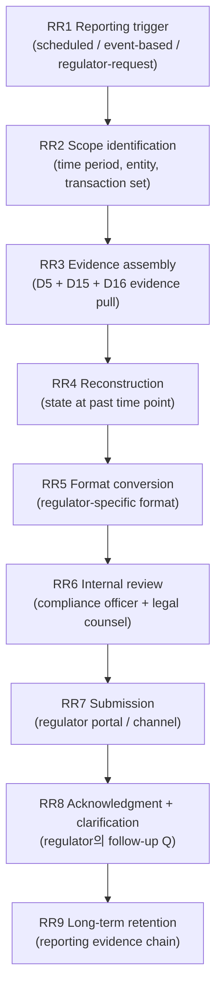
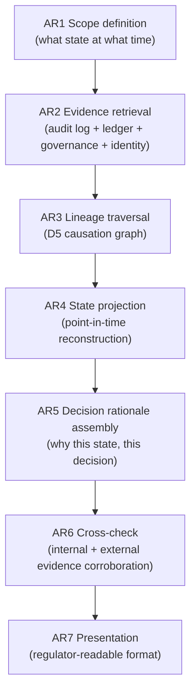
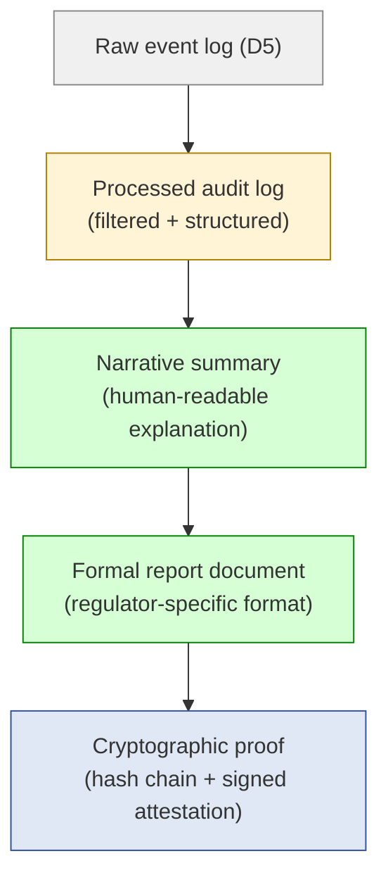
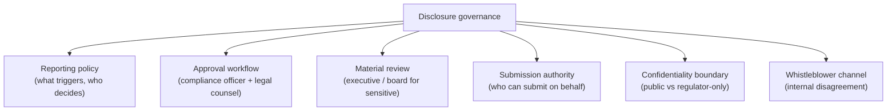
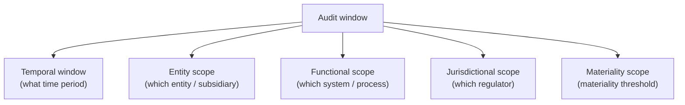
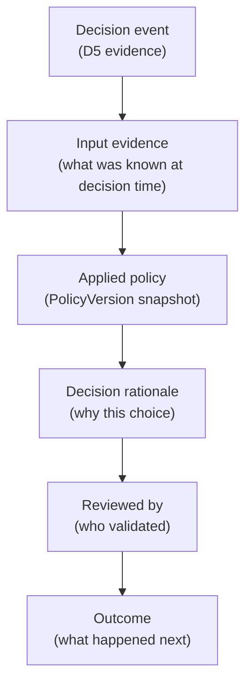
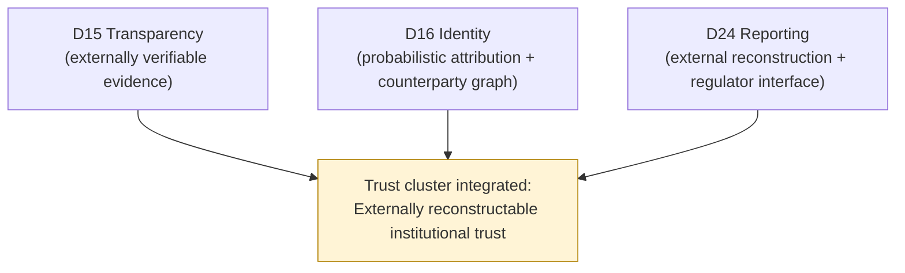

# Custody Wallet — Regulatory Reporting / Audit Interface Reasoning

> **본 문서의 위치 (Trust Cluster D24 — closing)**: D15 (externally verifiable transparency) + D16 (identity attribution + counterparty graph) 의 **integrated regulator-facing application**. D5 internal evidence + D11 compliance reporting 위의 **external reconstructability**. Trust cluster 의 final layer.

> **본 문서가 답하는 핵심 질문**: 왜 regulatory reporting 이 document generation 이 아닌가? 왜 auditability 가 evidence availability 와 다른가? 왜 disclosure completeness 가 truth completeness 가 아닌가? 왜 audit readiness 가 operational readiness 와 다른가? 왜 compliance reporting 이 regulatory safety 보장 아닌가?

---

## 0. 핵심 명제 (10초 이해)

1. **Regulatory reporting = externally consumable reconstruction of institutional evidence state** (core thesis).
2. **Auditability = ability to reconstruct institutional truth under external scrutiny** (secondary thesis).
3. **5-tier "≠" 명제 (D24 cluster closing)**:
   - Report generation ≠ Auditability
   - Evidence availability ≠ Regulator understanding
   - Disclosure completeness ≠ Truth completeness
   - Audit readiness ≠ Operational readiness
   - Compliance reporting ≠ Regulatory safety
4. **Cluster 3-tier integration**:
   - D15: evidence verifiability (mathematical)
   - D16: identity attribution (probabilistic)
   - D24: external reconstruction (institutional)
5. **Reconstruction ≠ Re-creation** — historical state 의 re-presentation, not regeneration.
6. **Regulator 도 verifier** — D15 의 verifier 의 special case (regulatory authority).
7. **Audit window = bounded reconstruction scope** — time + system + scope 의 explicit boundary.
8. **Institutional explainability = mandatory** — system decision 의 rationale 가 regulator 에게 reconstructable.
9. **Cross-jurisdictional reporting conflict = irreducible** — D11 §10 의 reporting 측면.
10. **Reporting SaaS customer burden ~95%** — D11 ~80% 보다 더 높음 (regulator relationship + jurisdictional + format + interpretation 모두 customer).

---

## 1. Regulatory Reporting Lifecycle

### 1.1 9 phase 의 domain mapping

| Phase | Source domain | Owner |
|---|---|---|
| RR1 Trigger | External (regulator / schedule) | Compliance officer |
| RR2 Scope | Own (interpret request) | Compliance + legal |
| RR3 Assembly | D5 + D15 + D16 | Own systems |
| RR4 Reconstruction | Own (replay / projection) | Own engineering |
| RR5 Format | Regulatory standard | Own + format vendor |
| RR6 Review | Own (compliance + legal) | Compliance officer |
| RR7 Submission | Regulator interface | Own |
| RR8 Clarification | Bilateral | Compliance officer |
| RR9 Retention | Own | Own systems |

### 1.2 Reporting trigger types

| Trigger | 의미 |
|---|---|
| **Scheduled periodic** | Quarterly / annual mandatory reports |
| **Threshold-based** | $10k+ transaction (CTR), suspicious (SAR) |
| **Event-based** | Incident / breach / freeze action |
| **Regulator request** | Ad-hoc demand letter |
| **Investigation cooperation** | Law enforcement subpoena |

### 1.3 "Report generation ≠ Auditability"

(§0 명제)

- Report generation = produce document.
- Auditability = ability to **reconstruct** state + **defend** rationale + **withstand** scrutiny.
- 차이:
  - Generated document 가 reviewable in isolation 만 가능
  - Auditability 는 source evidence + methodology + decision rationale 전체

---

## 2. Audit Reconstruction Lifecycle

### 2.1 Reconstruction = historical state replay

### 2.2 "Reconstruction ≠ Re-creation"

(§0.5)

- Reconstruction = retrieve + present existing evidence.
- Re-creation = create new evidence (often suspicious).
- 차이가 audit integrity 의 핵심.

### 2.3 Reconstruction 의 5 question (D5 §6.3 의 regulator 적용)

| Question | Answer source |
|---|---|
| What happened? | Event chain (D5) |
| Who authorized? | Governance evidence (D3) |
| Under which policy? | PolicyVersion snapshot (D5) |
| Affecting which state? | Ledger entry (D1a) |
| With what identity? | Attribution evidence (D16) |

### 2.4 Reconstruction confidence

(★ Hypothesis — operational reasoning)

- 완벽한 reconstruction 불가능:
  - Evidence gap (D5 §10.3)
  - Missing capture (human-side, external system)
  - Identity ambiguity (D16)
- Reconstruction = **best-available historical representation** with explicit gap acknowledgment.

### 2.5 Replay vs Reconstruction

| Aspect | Replay (D5 §7) | Reconstruction |
|---|---|---|
| Audience | Internal forensic | External (regulator) |
| Detail | Full technical | Regulator-readable |
| Methodology | System replay | Evidence presentation |
| Verification | Internal cross-check | External challenge |
| Confidence | Approximation | Approximation + explicit gap |

---

## 3. Regulator-facing Evidence Chain

### 3.1 Evidence presentation hierarchy

### 3.2 "Evidence availability ≠ Regulator understanding"

(§0 명제)

- 모든 raw evidence 가 available 해도:
  - Regulator 가 technical interpretation 어려움
  - Volume overwhelming
  - Context missing (system-specific terminology)
- → Presentation layer (E_NARR / E_DOC) 의 필수성.

### 3.3 Regulator-readable format

| Format type | 의미 |
|---|---|
| **Narrative summary** | Human-readable explanation |
| **Tabular data** | Structured table (CSV / Excel) |
| **Cryptographic proof** | Hash + signature for verifiability |
| **Visualizations** | Diagrams / charts |
| **Sample evidence** | Representative examples |

### 3.4 Translation layer (technical → regulatory)

(★ Hypothesis — operational reasoning)

- System-internal terminology → regulator-recognized terms.
- 예:
  - "MPC SigningArtifact" → "transaction authorization record"
  - "ApprovalRequest" → "internal approval"
  - "LedgerEntry" → "accounting entry"
- → Translation 의 own integrity (오역 위험).

### 3.5 Multi-regulator format variance

- Each regulator (FinCEN / SEC / FSA / FCA / MAS / etc.) 의 own format.
- Cross-jurisdictional report = format multiplicity.
- Mitigation: standardized internal representation + per-regulator transform.

---

## 4. Reporting Consistency

### 4.1 Consistency across reports

- Multiple reports (different time, different regulator) 의 cross-consistency:
  - Same transaction 의 same value
  - Same period 의 same total
  - Same entity 의 same identity
- → Reporting consistency = own integrity proof.

### 4.2 "Disclosure completeness ≠ Truth completeness"

(§0 명제)

- Disclosed = reported in document.
- Truth = actual reality.
- Gap:
  - Materiality threshold (small items 미보고)
  - Scope limitation (specific report scope 밖)
  - Methodology limitation (specific methodology 의 inherent gap)
  - Unknown unknowns (system 이 capture 못한 영역)
- → Disclosure 는 partial truth, not complete truth.

### 4.3 Materiality threshold

(★ Hypothesis — financial reporting standard)

- Material item = report 의무.
- Immaterial = optional inclusion.
- Threshold:
  - Absolute (e.g. $X 이상)
  - Relative (e.g. % of total)
  - Qualitative (e.g. specific type)
- → Materiality 자체가 reporting accuracy 의 limitation.

### 4.4 Restatement risk

- Past report 의 error 발견 시 restatement 필요.
- Restatement 는 negative signal (regulator + market).
- Mitigation: review SLA + multi-eye + reproducibility.

### 4.5 Audit trail of reporting

- Reporting 자체의 audit trail:
  - Who prepared
  - Who reviewed
  - Who approved
  - Who submitted
  - Acknowledgment received
- → Reporting 도 evidence-producing activity (D5 의 self-application).

---

## 5. Disclosure Governance

### 5.1 Disclosure 의 governance layer

### 5.2 "Disclosure ≠ Public statement"

- 보고 audience:
  - Regulator (formal report)
  - Auditor (audit firm)
  - Public (10-K / annual report)
  - Specific stakeholder (board, customer notification)
- Each audience 의 different content + sensitivity.

### 5.3 Selective disclosure 의 ethics

(★ Hypothesis — financial ethics)

- 일부 정보 만 disclose (혼란 방지 / 경쟁 보호) — 정당화 가능 영역.
- 그러나 material 한 부정적 정보 의 selective omission = ethics violation.
- Best practice: full + timely + factual.

### 5.4 Disclosure timing

- Reactive (incident 후 disclosure)
- Proactive (potential issue 의 early disclosure)
- Mandated (regulatory schedule)
- 차이의 reputation impact.

### 5.5 Whistleblower considerations

- Internal disagreement 에 대한 channel.
- Anonymous + protected + investigated.
- → Disclosure governance 의 final safety valve.

---

## 6. Audit Window Semantics

### 6.1 Audit window 의 dimension

### 6.2 Audit window 의 explicit boundary

- "Audit covers period X to Y, entity Z, process W, jurisdiction A, materiality $B."
- 명시적 boundary 가 audit limitation 의 declaration.

### 6.3 Audit window drift

(★ Hypothesis — operational pattern)

- Audit window 사이의 gap:
  - Quarterly audit 의 3-month gap
  - Annual audit 의 1-year gap
- 그 사이 발생한 issue 가 다음 audit 까지 detection 안 됨.
- → Continuous monitoring (D15 §3.4) 이 audit window gap 의 보완.

### 6.4 Out-of-scope finding

- Audit 도중 out-of-scope issue 발견 시:
  - Note + flag (다음 audit 의 scope)
  - Material 이면 즉시 expand scope
- → Auditor's discretion 의 영역.

### 6.5 "Audit readiness ≠ Operational readiness"

(§0 명제)

- Audit readiness = audit 의 specific scope 의 preparation.
- Operational readiness = day-to-day functionality.
- 차이:
  - Audit-preparation focused company 가 operational gap 있을 수 있음
  - Operational excellence 가 audit-preparation 부재일 수 있음 (예: documentation 부족)
- → 둘 다 필요, 다른 dimension.

---

## 7. Reporting Survivability

### 7.1 Reporting 의 survivability scenarios

| Scenario | Impact |
|---|---|
| Reporting system outage | Reporting deadline miss → regulatory penalty |
| Data loss | Inability to reconstruct → audit failure |
| Personnel turnover | Knowledge loss → reporting quality degradation |
| Regulator system change | Format mismatch → submission failure |
| Cross-jurisdictional conflict | Conflicting reports → choice paralysis |
| Vendor dependency | Vendor outage → reporting delay |

### 7.2 Reporting infrastructure resilience

- Redundant evidence storage (D5 §8 의 multi-tier).
- Multiple submission channel.
- Offline backup of recent reports.
- Periodic test submission.

### 7.3 Personnel succession

(★ Hypothesis — operational pattern)

- Compliance officer / legal counsel turnover 시:
  - Reporting knowledge transition
  - Regulatory relationship maintenance
  - Pending case handover
- → Documentation + cross-training + parallel handover.

### 7.4 Cross-jurisdictional reporting conflict (D11 §10 의 reporting 측면)

| Conflict | 의미 |
|---|---|
| Privacy vs reporting | GDPR vs reporting obligation |
| Sanctions difference | US vs EU vs UN list |
| Reporting threshold | Currency / amount differences |
| Format incompatibility | Different jurisdictions' format |

→ Multi-jurisdiction 의 entity 의 reporting team complexity.

### 7.5 Regulator system change adaptation

- Regulator 가 reporting format / portal / API change.
- Customer 의 adaptation SLA.
- → Continuous monitoring of regulator changes.

---

## 8. Institutional Explainability

### 8.1 "Why this decision?" reconstructability

- Every regulator-relevant decision 의 rationale 가 reconstructable:
  - Approval / freeze / report decisions
  - Policy choice
  - Risk evaluation
- → Operational decision audit trail의 essential property.

### 8.2 Explainability layer

### 8.3 Algorithmic decision explainability

(★ Hypothesis — emerging requirement)

- ML / AI-based decision (risk scoring, fraud detection):
  - Black-box 의 explainability 한계
  - Regulator 의 "explain why this person was flagged" 요구
- Mitigation:
  - Explainable AI (XAI) techniques
  - Rule-based fallback for high-stakes
  - Human review for low-confidence

### 8.4 "Compliance reporting ≠ Regulatory safety"

(§0 명제)

- Reporting 의무 충족 ≠ regulatory action 안전.
- 가능한 outcome:
  - Reported but flagged for further investigation
  - Reported but interpreted differently by regulator
  - Reported but jurisdictional escalation
- → Reporting 은 minimum, regulatory safety 는 broader.

---

## 9. Operational Fragility Map

```mermaid
graph TB
    F1["F1. Evidence fragmentation<br/>(multiple system, no unified retrieval)"]
    F2["F2. Delayed disclosure<br/>(SLA miss, regulatory penalty)"]
    F3["F3. Regulator interpretation mismatch<br/>(regulator의 different view of same evidence)"]
    F4["F4. Audit window drift<br/>(gap 사이 발생 issue 미detection)"]
    F5["F5. Reporting inconsistency<br/>(cross-report different values)"]
    F6["F6. Cross-jurisdiction reporting conflict<br/>(privacy vs disclose)"]
    F7["F7. Material restatement<br/>(past error 발견, restatement)"]
    F8["F8. Personnel knowledge loss<br/>(compliance officer turnover)"]
    F9["F9. Format adaptation lag<br/>(regulator format change)"]
    F10["F10. Algorithmic explainability gap<br/>(ML decision unexplainable to regulator)"]

    F1 -->|mitigation| M1["Unified evidence platform + cross-system correlation"]
    F2 -->|mitigation| M2["SLA monitoring + escalation + redundant submission"]
    F3 -->|mitigation| M3["Pre-submission consultation + clarification dialog"]
    F4 -->|mitigation| M4["Continuous monitoring + interim review"]
    F5 -->|mitigation| M5["Unified data source + cross-report validation"]
    F6 -->|mitigation| M6["Legal counsel + most-strict-default + per-jurisdiction policy"]
    F7 -->|mitigation| M7["Multi-eye review + reproducibility + correction SLA"]
    F8 -->|mitigation| M8["Documentation + cross-training + handover process"]
    F9 -->|mitigation| M9["Regulator change monitoring + format library"]
    F10 -->|mitigation| M10["XAI technique + rule-based fallback for high-stakes"]
```

### 9.1 분류

| 분류 | items | 성격 |
|---|---|---|
| **Data integrity** | F1, F5 | engineering |
| **Timing** | F2, F4, F9 | operational discipline |
| **Regulator interface** | F3, F6 | external + legal |
| **Quality** | F7, F10 | process + emerging tech |
| **Continuity** | F8 | knowledge mgmt |

---

## 10. Limitations

### 10.1 Report generation ≠ Auditability

§0.1. Generation = produce; auditability = reconstruct + defend + withstand.

### 10.2 Evidence availability ≠ Regulator understanding

§3.2. Raw evidence 의 interpretation 필요.

### 10.3 Disclosure completeness ≠ Truth completeness

§4.2. Materiality / scope / methodology limitation.

### 10.4 Audit readiness ≠ Operational readiness

§6.5. Different dimension.

### 10.5 Compliance reporting ≠ Regulatory safety

§8.4. Reporting 의무 충족 ≠ regulatory action 안전.

### 10.6 Reconstruction has gaps

§2.4. Evidence gap + identity ambiguity + missing capture.

### 10.7 Trust nest at regulator level

(★ Hypothesis)

- Regulator 의 own integrity 도 assumption.
- Different regulator 의 different interpretation.
- → Regulator trust 도 not absolute.

---

## 11. 3-way Reporting Burden

### 11.1 Plane × Ownership

| 영역 | SaaS | Hosted MPC | Direct-build |
|---|---|---|---|
| Evidence retrieval | Vendor partial + customer | Customer | Customer |
| Reconstruction infrastructure | Vendor partial | Customer | Customer |
| Format conversion | Customer + format vendor | Customer | Customer |
| Internal review | Customer | Customer | Customer |
| Submission | Customer | Customer | Customer |
| Regulator interaction | Customer | Customer | Customer |
| Clarification response | Customer | Customer | Customer |
| Retention | Customer SIEM | Customer | Customer |
| Cross-jurisdictional | Customer (legal) | Customer | Customer |

### 11.2 Customer reporting burden (★ Hypothesis)

- SaaS: ~95% (vendor 가 일부 evidence retrieval; nearly all reporting 은 customer)
- Hosted: ~98%
- Direct-build: ~100%

→ **Reporting 은 모든 architecture 중 customer 책임이 가장 큰 영역** — D11 compliance (~80%) 보다도 높음. Vendor 는 evidence source 제공만, reporting decision + relationship 모두 customer.

### 11.3 Recommendation

| Context | 권장 |
|---|---|
| Single jurisdiction, light regulation | Manual reporting + compliance officer (single role) |
| Multi-jurisdiction, regulated | Dedicated reporting infrastructure + multi-jurisdictional team |
| Heavily regulated + high-volume | Direct-build evidence platform + automated reporting + outside counsel |
| Cross-border + multiple regulators | Dedicated regulator-facing engineering + per-jurisdiction compliance team |

---

## 12. Q1-Q10 Reasoning

### Q1. Reporting ≠ Document generation

§0.1, §1.3. Reconstruction + defend + withstand vs produce.

### Q2. Auditability ≠ Evidence availability

§3.2. Availability + interpretation + presentation.

### Q3. Disclosure ≠ Truth completeness

§4.2. Materiality + scope + methodology + unknown unknowns.

### Q4. Audit readiness ≠ Operational readiness

§6.5. Different dimensions.

### Q5. Compliance reporting ≠ Regulatory safety

§8.4. Reporting = minimum; safety = broader regulatory standing.

### Q6. Reconstruction ≠ Re-creation

§2.2. Retrieve+present existing vs create new.

### Q7. Audit window 의 explicit boundary

§6.2. Temporal + entity + functional + jurisdictional + materiality.

### Q8. Reporting의 own audit trail

§4.5. Reporting 도 evidence-producing.

### Q9. Cross-jurisdictional reporting conflict

§7.4. Privacy vs disclose, sanctions difference, threshold, format.

### Q10. Algorithmic explainability

§8.3. ML / AI 의 black-box vs regulator explanation 의무.

---

## 13. Open Questions / Org Policy

| 영역 | 질문 |
|---|---|
| Reporting cadence per regulator | quarterly / monthly? |
| Materiality threshold | per regulator / per asset |
| Evidence retention | per regulator + own buffer |
| Restatement policy | discovery → action SLA |
| Cross-jurisdictional priority | most-strict / specific? |
| Translation layer ownership | own / vendor? |
| Regulator interaction frequency | proactive / reactive? |
| Compliance officer staffing | per regulator? |
| Algorithmic decision documentation | explainability standard |
| Format adaptation SLA | regulator change → response time |
| Pre-submission consultation | with regulator? |
| Whistleblower channel | format, protection |
| Selective disclosure boundary | what is internal-only? |
| Public disclosure cadence | annual / event-based? |
| Materiality dispute resolution | with auditor? |
| Cross-system evidence correlation | vendor / own? |
| Reporting infrastructure resilience | RTO / RPO |
| Legacy reporting retention | how long |
| Personnel handover SLA | when officer leaves |
| Industry reporting consortium | participate? |

---

## 14. Cluster Closing Summary (D15-D16-D24)

### 14.1 3-document cluster integration

### 14.2 Cluster thesis 재확인

> **Trust is an operationally reconstructed property across evidence, identity, compliance, and settlement domains.**

- D15: trust 의 evidence layer (verifiability)
- D16: trust 의 attribution layer (probabilistic identity)
- D24: trust 의 reconstructability layer (external scrutiny)

### 14.3 Cluster invariant 의 통합

15 "≠" 명제 통합:

| Cluster |  ≠ propositions |
|---|---|
| **D15 Transparency** | Transparency ≠ Disclosure / PoR ≠ Solvency / Snapshot ≠ Continuous / Visibility ≠ Verifiability / Publication ≠ Trust elimination |
| **D16 Identity** | Address ≠ Identity / KYT cluster ≠ Beneficial / Visibility ≠ Certainty / Linkage ≠ Continuity / Confidence ≠ Legal proof |
| **D24 Reporting** | Generation ≠ Auditability / Availability ≠ Understanding / Disclosure ≠ Truth / Audit ≠ Operational / Reporting ≠ Safety |

### 14.4 Cluster fragility integration

- D15: auditor compromise / snapshot manipulation / methodology opacity / tooling fragility / verifier indifference
- D16: false attribution / graph poisoning / cross-chain attribution / mixer / probabilistic drift / KYC fraud
- D24: evidence fragmentation / delayed disclosure / regulator interpretation / audit window drift / reporting inconsistency

→ Cluster 의 cumulative fragility: trust production 의 multi-layer risk.

### 14.5 Cluster customer burden

| Document | Customer burden in SaaS (★ Hypothesis) |
|---|---|
| D15 Transparency | ~80% |
| D16 Identity | ~75% |
| **D24 Reporting** | **~95%** (highest) |

→ Trust cluster 는 customer burden 가장 큰 영역 — vendor 가 본질적으로 흡수 못함.

### 14.6 Public trust vs institutional truth separation

- **Public trust**: emerging from verifiable evidence + tooling + community signal (D15 focus).
- **Institutional truth**: internal evidence + reconstruction + regulator-facing (D24 focus).
- **Bridge**: identity attribution (D16) makes both possible.

→ 두 trust 의 audience + verifier + cadence + format 모두 다름.

### 14.7 External auditability 의 ultimate test

- Cluster 의 final test: "Can an external party (regulator / auditor / public) reconstruct what happened?"
- 답:
  - Evidence available (D15)
  - Identity attributable (D16)
  - Reconstruction presentable (D24)
- 세 조건 모두 만족이 institutional trust 의 foundation.

---

## 15. References + Uncertainty Boundary + Cluster Next

### 관련 wiki

| 참조 |
|---|
| [[docs/architecture/audit-event-sourcing-evidence-chain]] §11, §12 (evidence) |
| [[docs/architecture/compliance-aml-sanctions-boundary]] §8, §9 (compliance reporting baseline) |
| [[docs/architecture/transparency-attestation-proof-systems]] (D15 cluster predecessor) |
| [[docs/architecture/identity-kyt-counterparty-graph]] (D16 cluster predecessor) |
| [[docs/architecture/three-way-custody-decision-framework]] §11 (org maturity) |

### Uncertainty Boundary

- 9 reporting lifecycle phase / 7 reconstruction step / 5 audit window dimension / 6 disclosure governance / 10 fragility / 95% burden 분포 = **generalized regulatory reporting architecture pattern (Hypothesis ★)**.
- §8.3 algorithmic explainability = emerging regulatory requirement.
- §11.2 burden 백분율 = operational reasoning estimate.
- §13 에 org policy 영역 명시.
- 본 문서는 **특정 jurisdiction 의 specific reporting requirement 설명 아님** — generalized pattern.

### Cluster Closing

D15-D16-D24 Trust cluster **완성**.

**Cluster 최종 정의 (sentence)**:
> Institutional trust in digital asset systems is operationally reconstructed across verifiable evidence (D15), probabilistic identity attribution (D16), and externally consumable reconstruction (D24) — emerging not from centralized statements alone, but from continuously verifiable evidence, attributable identity relationships, and survivable governance coordination.

### Next Cluster Recommendation

**Monetary / Liquidity Cluster** (D17-D20):
- D17 Treasury Optimization / Capital Efficiency
- D18 Clearing / Prime Brokerage / Omnibus
- D19 Internal Netting / Internal Settlement
- D20 Cross-institution Liquidity Coordination

→ Theme: institutional liquidity operating system.

Boundary inherited:
- Trust boundary (D15-D16-D24)
- Evidence boundary (D5)
- Identity boundary (D16)
- Settlement boundary (D1b, D8, D13)
- Regulatory boundary (D11, D24)

### Architecture reasoning layer 누적 (D-series 18 documents)

D1a / D1b / D2 / D3 / D4 / D5 / D6 / D7 / D8 / D9 / D10 / D11 / D12 / D13 / D14 / **D15 / D16 / D24**

→ Trust cluster (D15-D16-D24) 가 D-series corpus 의 **trust-layer specialization** 완성.

---

**Stage 32 D24 completion timestamp**: 2026-05-19.
