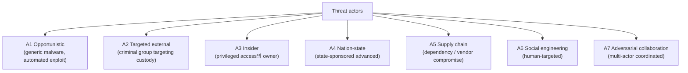
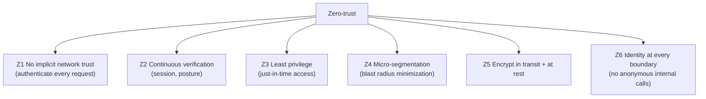
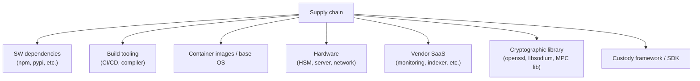
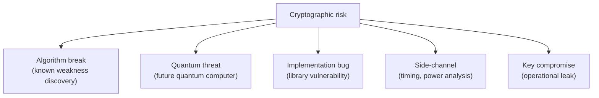
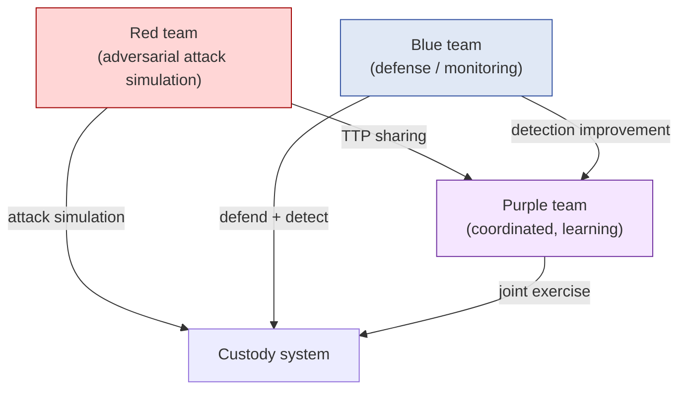

# Custody Wallet — Security / Threat Model / Adversarial Resilience Reasoning

> **본 문서의 위치**: D1a-D13 의 모든 architecture decision 위의 **adversarial lens**. D11 compliance (legal threat) 와 대비되는 **technical / operational / human-side adversarial resilience**. D3 governance + D4 recovery + D5 evidence + D12 operational maturity 의 security dimension.

> **본 문서가 답하는 핵심 질문**: 왜 custody security 는 access control 이 아닌가? 왜 encryption / multi-factor / pentested 가 secure 의 증명 아닌가? 왜 best practice 가 threat-informed practice 와 다른가? 왜 적의 mindset 이 architecture decision 의 every layer 에 embedded 되어야 하는가?

---

## 0. 핵심 명제 (10초 이해)

1. **Custody security = adversarial state-of-mind embedded in every architectural decision.** — 본 문서의 thesis.
2. **10-tier "≠" 명제** — encryption / audit / multi-factor / defense layers / best practice / compliance / pentested / security tool 모두 가 security 보장 아님.
3. **7 threat actor taxonomy** — Opportunistic / Targeted external / Insider / Nation-state / Supply chain / Social engineering / Adversarial collaboration.
4. **Defense in depth ≠ Many controls** — coordinated, complementary, threat-informed layers.
5. **Threat model = living document** — 정기 update + red team validation.
6. **Insider threat = irreducible** — privileged access 의 owner 가 threat actor 가능.
7. **Supply chain = transitive attack surface** — own security + every dependency 의 security.
8. **Cryptographic agility = mandatory** — current crypto 의 future obsolescence 대응.
9. **Zero-trust principle** — internal trust 의 minimization + continuous verification.
10. **Red team / blue team = ongoing exercise** — threat model 의 verification + adversarial muscle memory.

---

## 1. 7 Threat Actor Taxonomy

### 1.1 각 actor 의 capability + motivation

| Actor | Capability | Motivation |
|---|---|---|
| **A1 Opportunistic** | Low (script kiddie, generic exploit) | Financial, broad targets |
| **A2 Targeted external** | Medium-High (organized crime, dedicated) | Financial, specific custody target |
| **A3 Insider** | High (legitimate privileged access) | Financial / ideological / coerced |
| **A4 Nation-state** | Very High (APT, custom tooling) | Geopolitical / economic warfare |
| **A5 Supply chain** | Variable (depends on supplier compromise) | Often nation-state or organized crime |
| **A6 Social engineering** | Variable (phishing / pretexting) | Often combined with other actors |
| **A7 Adversarial collaboration** | Composite | Mixed |

### 1.2 Custody-specific threat focus

- 일반 software product 보다 custody 는 **financial actor 의 primary target**.
- 자산 가치 → motivation 높음.
- → Threat model 의 baseline 이 일반 enterprise 보다 strict.

### 1.3 Threat actor 의 evolution

(★ Hypothesis — operational pattern)

- Threat landscape 는 시간에 따라 진화:
  - 새로운 attack technique
  - 새로운 vulnerability disclosure
  - 새로운 actor 등장
- → Threat model 은 living document. 정기 review + threat intel integration.

---

## 2. Defense in Depth (10-layer)

```mermaid
graph TB
    DEF["Defense in Depth"]

    L1["L1 Physical<br/>(datacenter, HSM, airgap machine)"]
    L2["L2 Network<br/>(segmentation, zero-trust)"]
    L3["L3 Host / endpoint<br/>(hardening, EDR)"]
    L4["L4 Application<br/>(input validation, secure SDLC)"]
    L5["L5 Cryptographic<br/>(key management, agility)"]
    L6["L6 Identity / access<br/>(IAM, MFA, just-in-time)"]
    L7["L7 Authorization<br/>(D3 governance + D5 evidence)"]
    L8["L8 Monitoring / detection<br/>(SIEM, anomaly detection)"]
    L9["L9 Response<br/>(D12 incident command)"]
    L10["L10 Recovery<br/>(D4 recovery ceremony)"]

    DEF --> L1
    DEF --> L2
    DEF --> L3
    DEF --> L4
    DEF --> L5
    DEF --> L6
    DEF --> L7
    DEF --> L8
    DEF --> L9
    DEF --> L10
```

### 2.1 "Defense layers ≠ Defense in depth"

(§0 명제)

- Many controls = layered listing.
- Defense in depth = coordinated, complementary, threat-informed.
- 차이:
  - Layers 가 같은 attack vector 만 cover (예: 모두 perimeter) = defense in breadth, depth 아님
  - 진정한 depth = different attack stage 별 different control
- → Threat model + attack graph 에 기반한 layer 설계.

### 2.2 각 layer 의 "what bypasses this layer"

(★ critical exercise)

- L1 Physical: insider with physical access / supply chain device tampering
- L2 Network: VPN credential theft / insider on-network
- L3 Host: zero-day / supply chain (dependency)
- L4 Application: business logic flaw / governance bypass
- L5 Cryptographic: key compromise / cryptographic break
- L6 IAM: phishing / session hijacking
- L7 Authorization: insider collusion / governance corruption
- L8 Monitoring: evasion / alert fatigue
- L9 Response: time pressure / decision error
- L10 Recovery: custodian compromise / supply chain on recovery utility

→ 각 layer 의 bypass 가능성을 인지 + 다음 layer 가 catch.

### 2.3 Zero-trust principle

---

## 3. Insider Threat

### 3.1 Insider threat 의 5 type

| Type | 의미 |
|---|---|
| **Malicious insider** | 의도적 abuse (financial gain) |
| **Coerced insider** | 외부 actor 의 압력 (kidnap, blackmail) |
| **Compromised insider** | Insider account 의 takeover (phishing → credential) |
| **Negligent insider** | Unintentional violation (policy mistake) |
| **Departing insider** | Resignation 후 access abuse |

### 3.2 "Privileged access ≠ Privileged owner"

- Privileged access 의 owner 가 항상 trusted 아님.
- Mitigation:
  - 4-eye principle (any privileged action 에 second approver)
  - Just-in-time access (permanent privilege 최소)
  - Privileged access monitoring (PAM)
  - Behavior anomaly detection

### 3.3 Insider threat mitigation

| Mitigation | 의미 |
|---|---|
| Background check | Onboarding screening |
| 4-eye / 2-person rule | Privileged action 에 second approver |
| Just-in-time access | Temporary elevation with audit |
| Privileged access workstation | Dedicated hardened device |
| Behavior anomaly detection | UEBA (User and Entity Behavior Analytics) |
| Segregation of duties | No single role 가 entire flow control |
| Mandatory rotation | Custodian / role 의 periodic rotation |
| Offboarding discipline | Access revocation SLA |

### 3.4 "Insider threat = irreducible"

(§0 명제)

- 어떤 mitigation 도 insider threat 를 0 으로 만들지 못함.
- Trust 가 필요한 영역 (예: senior engineer, executive) 의 mitigation 한계.
- → Acceptance + maximum diligence + recovery preparedness.

### 3.5 D3 governance 의 insider mitigation

- Quorum-based decision (single insider 가 unilateral 행동 못함).
- Append-only audit (insider 의 history 변조 불가).
- Break-glass post-hoc review (insider 의 emergency abuse 검출).

---

## 4. Supply Chain Attack Surface

### 4.1 Supply chain 의 layer

### 4.2 Supply chain attack examples

(★ Hypothesis — historical pattern)

- SW dependency: malicious package update (event-stream, ua-parser-js, etc.)
- Build tooling: compromised CI/CD secrets
- Container: compromised base image
- Hardware: implanted firmware (rare but possible)
- Vendor SaaS: vendor 의 compromise → downstream customer
- Cryptographic library: subtle backdoor (Dual_EC_DRBG)
- Framework: framework 의 vulnerability propagation

### 4.3 Supply chain mitigation

| Mitigation | 의미 |
|---|---|
| Dependency pinning | Specific version 사용 |
| Dependency review | New dependency 의 review process |
| SBOM (Software Bill of Materials) | 모든 component 의 inventory |
| Reproducible build | Build output 의 deterministic verification |
| Signed artifacts | Vendor 의 signature verification |
| Vendor security review | Vendor 의 security practice audit |
| Hardware verification | Tamper-evident packaging, attestation |
| Cryptographic library diversity | Multi-library approach (특정 lib 의 break 대응) |

### 4.4 "Transitive trust" reasoning

- Own security = own + every dependency 의 security.
- N-th order dependency 의 compromise 도 own compromise.
- → Dependency depth 의 minimization + critical path 의 careful review.

---

## 5. Social Engineering

### 5.1 Social engineering vectors

| Vector | 의미 |
|---|---|
| **Phishing** | Email-based credential theft |
| **Spear phishing** | Targeted phishing (specific person/role) |
| **Whaling** | Executive-targeted phishing |
| **Pretexting** | False pretense (vendor support, etc.) |
| **Baiting** | USB drop, malicious download |
| **Tailgating** | Physical access via social pressure |
| **Vishing** | Voice (phone) social engineering |
| **SMS-shing / Smishing** | SMS-based |
| **Deepfake** | AI-generated audio/video impersonation |

### 5.2 Custody-specific social engineering

(★ Hypothesis — emerging threat)

- Approver 의 phishing → quorum 의 compromise
- Custodian 의 social engineering → recovery 의 unauthorized invocation
- Compliance officer 의 pretexting → freeze authority abuse
- Executive deepfake → emergency authority invocation

### 5.3 Mitigation

| Mitigation |
|---|
| Regular security awareness training |
| Phishing simulation |
| Communication channel verification (out-of-band callback) |
| Hardware MFA (vs SMS / app-based) |
| Verification protocol for high-stakes request |
| "Trust but verify" principle |
| Anti-deepfake protocol (challenge-response, pre-agreed signals) |

### 5.4 "Multi-factor ≠ Strong authentication"

(§0 명제)

- MFA 의 strength 가 factor 의 종류 의존:
  - SMS-based 2FA: weak (SIM swap)
  - App-based TOTP: medium (phishable)
  - Hardware token (FIDO2 / WebAuthn): strong (phish-resistant)
- → MFA 자체 ≠ strong; specific factor 의 strength 의 함수.

---

## 6. Cryptographic Agility

### 6.1 Cryptographic obsolescence risk

### 6.2 Cryptographic agility = mandatory

(§0.8)

- Today's secure algorithm 이 미래에 안 secure.
- 예:
  - MD5 (now broken)
  - SHA-1 (deprecated)
  - RSA 1024-bit (deprecated)
  - 미래: ECDSA 의 quantum threat
- → System 이 algorithm change 를 대응 가능해야 (agility).

### 6.3 Agility 의 implementation pattern

| Pattern | 의미 |
|---|---|
| Algorithm identifier in artifact | "이 signature 는 ECDSA-secp256k1" 명시 |
| Multi-algorithm support | Old + new 동시 verification 가능 |
| Migration path | Gradual rotation (key + algorithm both) |
| Post-quantum readiness | NIST PQC standards (Kyber, Dilithium 등) 추적 |
| Hybrid signature | Classical + PQ 결합 (transition period) |

### 6.4 Cryptographic monoculture risk

- 모든 system 이 same library / same algorithm 사용 시 single break = mass compromise.
- Mitigation: library diversity + algorithm diversity.

---

## 7. Side-channel Attacks

### 7.1 Side-channel taxonomy

| Channel | 의미 |
|---|---|
| **Timing** | Operation duration 의 secret-dependent variation |
| **Power** | Power consumption 의 secret-dependent variation |
| **Electromagnetic** | EM emission |
| **Acoustic** | Sound emission |
| **Cache** | CPU cache state |
| **Speculative execution** | Spectre / Meltdown class |
| **Network** | Traffic pattern analysis |

### 7.2 Custody-specific side-channels

(★ Hypothesis — research literature)

- MPC signing 의 timing variation → partial key information leak (theoretical)
- HSM 의 power analysis (historical, lab condition)
- TEE 의 side-channel (SGX 의 historical research)
- Approval workflow timing → quorum composition information

### 7.3 Side-channel mitigation

| Mitigation |
|---|
| Constant-time implementations |
| Power normalization (hardware) |
| Cache partitioning |
| Network traffic padding |
| Side-channel-resistant cryptographic library (libsodium, etc.) |
| TEE 의 latest patch (mitigations) |
| Physical security (isolation) |

### 7.4 Side-channel 의 acceptable risk

- 모든 side-channel 의 elimination 불가능.
- Threat model 에 기반한 acceptable residual risk.
- High-value target 일수록 strict mitigation.

---

## 8. Red Team / Blue Team / Purple Team

### 8.1 Team functions

### 8.2 Red team exercise types

| Type | 의미 |
|---|---|
| **External pentest** | Outside-in 의 simulated attack |
| **Internal pentest** | Inside-in (compromised account 가정) |
| **Social engineering test** | Phishing / pretexting simulation |
| **Physical penetration** | Datacenter / office physical test |
| **Tabletop exercise** | Scenario-based discussion (no live attack) |
| **Full red team campaign** | Multi-vector, multi-month coordinated |

### 8.3 "Pentested ≠ Hardened"

(§0 명제)

- Pentest 는 specific time + specific scope + specific tester 의 finding.
- Hardened = continuous + comprehensive + threat-informed.
- 차이:
  - Pentest finding 의 fix = point-in-time hardening
  - 새 vulnerabilities + 새 threat = 다음 pentest 까지 gap
- → Pentest 는 starting point, not endpoint.

### 8.4 Bug bounty

- External researcher 의 vulnerability discovery incentive.
- Scope + reward + response procedure.
- → Continuous (vs point-in-time pentest) discovery.

### 8.5 Purple team 의 가치

- Red + Blue 의 coordination 으로 learning 가속.
- Detection 의 gap 식별 + 즉시 improvement.
- → Single exercise 의 value 가 큼.

---

## 9. Security Incident Response (D12 의 security specialization)

### 9.1 Security incident 의 unique aspects

| Aspect | 일반 incident | Security incident |
|---|---|---|
| Public visibility | Operational | Reputational + customer trust |
| Adversarial presence | Absent | **Active adversary** |
| Forensic preservation | Standard | **Critical** (legal evidence) |
| Communication discipline | Standard | **High** (active leak risk) |
| Recovery sequence | Restore service | **Identify scope before restore** |

### 9.2 Security incident lifecycle

```mermaid
graph TB
    S1["S1 Detection<br/>(SIEM alert, anomaly, third-party report)"]
    S2["S2 Triage<br/>(scope, severity, attribution)"]
    S3["S3 Containment<br/>(stop ongoing damage)"]
    S4["S4 Forensic preservation<br/>(evidence collection)"]
    S5["S5 Eradication<br/>(remove attacker presence)"]
    S6["S6 Recovery<br/>(restore safe state)"]
    S7["S7 Post-incident review<br/>(forensic + lessons)"]
    S8["S8 Disclosure<br/>(customer / regulator / public)"]
    S9["S9 Long-term improvement<br/>(systemic change)"]
```

### 9.3 Containment 의 dilemma

(★ Hypothesis — incident response pattern)

- 즉시 containment vs forensic preservation 의 tension:
  - 즉시 차단 → 추가 damage 방지, but attacker 의 흔적 lost
  - Forensic 우선 → 추가 damage risk, but full scope identification
- 결정:
  - Active fund movement → 즉시 containment (damage > forensic value)
  - Passive observation → forensic 우선
- → Incident severity + active threat 평가가 결정.

### 9.4 Disclosure discipline

- Disclosure 의 audience + timing:
  - Internal (immediate)
  - Affected customer (legal SLA)
  - Regulator (jurisdiction SLA)
  - Public (responsible disclosure)
- Anti-pattern: silent fix → 발견 시 reputation 폭락.
- Best practice: transparency + timely + factual.

---

## 10. Operational Fragility Map

```mermaid
graph TB
    F1["F1. Threat model staleness<br/>(landscape evolving)"]
    F2["F2. Insider abuse"]
    F3["F3. Supply chain compromise"]
    F4["F4. Social engineering success<br/>(phishing / pretexting)"]
    F5["F5. Cryptographic library vulnerability"]
    F6["F6. Side-channel discovery"]
    F7["F7. Zero-day exploit"]
    F8["F8. Detection gap<br/>(novel TTP missed by SIEM)"]
    F9["F9. Incident response delay<br/>(active threat extending)"]
    F10["F10. Disclosure mismanagement<br/>(silent fix → reputational damage)"]

    F1 -->|mitigation| M1["Threat intel + 정기 review + red team"]
    F2 -->|mitigation| M2["4-eye + segregation + monitoring + offboarding"]
    F3 -->|mitigation| M3["SBOM + signed artifacts + vendor review + diversity"]
    F4 -->|mitigation| M4["Hardware MFA + awareness training + verification protocol"]
    F5 -->|mitigation| M5["Library diversity + patch SLA + vulnerability scanning"]
    F6 -->|mitigation| M6["Constant-time + isolation + threat model update"]
    F7 -->|mitigation| M7["Defense in depth + zero-trust + behavior detection"]
    F8 -->|mitigation| M8["Multi-source monitoring + threat hunting + purple team"]
    F9 -->|mitigation| M9["IR playbook + dedicated security ops + 24/7 SOC"]
    F10 -->|mitigation| M10["Disclosure SLA + transparency culture + PR readiness"]
```

### 10.1 분류

| 분류 | items | 성격 |
|---|---|---|
| **Threat landscape** | F1, F7 | evolving, irreducible |
| **Human** | F2, F4, F10 | training + culture |
| **Supply chain** | F3, F5 | vendor management |
| **Detection** | F6, F8 | technical + operational |
| **Response** | F9 | operational |

---

## 11. Limitations

### 11.1 Encryption ≠ Security

(§0 명제)

- Encryption 은 security 의 single tool.
- Encrypted system 도 access control / authentication / authorization / audit 의 gap 가능.
- → Holistic security ≠ single technique.

### 11.2 Audit pass ≠ Secure

- Audit = specific scope, specific time 의 check.
- Pass 의 의미 = "found violations 없음" — "no violations exist" 와 다름.
- → Audit 은 security 의 indicator, proof 아님.

### 11.3 No incident ≠ Not breached

- Detection gap 으로 incident 안 보이는 경우.
- "No incident" 는 "no detected incident" — undetected 는 unknown.
- → Active threat hunting + assume breach mindset.

### 11.4 Compliance ≠ Security

- Compliance (D11) = regulatory requirement 충족.
- Security = adversarial resilience.
- 차이:
  - Compliance 의 baseline 이 security 의 baseline 보다 lower 일 수 있음
  - Compliance focus 이 paperwork 일 수 있음 (actual security 와 disconnect)
- → Compliance 는 minimum, security 는 goal.

### 11.5 "Best practice" ≠ "Threat-informed practice"

(§0 명제)

- Industry best practice = generic baseline.
- Threat-informed practice = own threat model 기반 specific.
- 예: best practice 가 "rotate keys quarterly", own threat model 이 "rotate monthly for high-value wallet".
- → Best practice 는 starting point, threat model 이 customization.

---

## 12. 3-way Security Burden

### 12.1 모델별 ownership

| 영역 | SaaS | Hosted MPC | Direct-build |
|---|---|---|---|
| Infrastructure security | Vendor | Vendor + customer | Customer |
| Application security | Vendor | Vendor + customer | Customer |
| Cryptographic library | Vendor | Vendor + customer | Customer |
| Insider threat (own ops team) | Customer | Customer | Customer |
| Supply chain (own dependencies) | Customer (own integrations) | Customer | Customer |
| Social engineering (own employees) | Customer | Customer | Customer |
| Threat model | Vendor + customer | Customer | Customer |
| Red team | Vendor partial + customer | Customer | Customer |
| Security incident response | Vendor + customer | Customer | Customer |
| Disclosure | Customer | Customer | Customer |

### 12.2 Customer security burden (★ Hypothesis)

- SaaS: ~50% (vendor 가 own infra; customer 가 own ops team / employees / governance)
- Hosted MPC: ~75%
- Direct-build: ~100%

→ Security 는 model 무관 customer 가 own organization 의 큰 책임. Vendor 가 흡수 가능한 영역은 own infrastructure 만.

### 12.3 Security as cross-cutting concern

- Security 는 specific layer 가 아닌 모든 architecture decision 의 cross-cutting concern.
- D1a (DB design) 의 secrets 저장 금지 = security.
- D3 (governance) 의 quorum = security (insider mitigation).
- D4 (recovery) 의 custodian distribution = security.
- D5 (evidence) 의 immutability = security.
- → Security 가 단독 chapter 가 아닌 모든 chapter 의 underlying.

---

## 13. Q1-Q10 Reasoning

### Q1. Security ≠ Access control

§0.1, §2. Access control 은 single layer; security 는 every layer 의 adversarial design.

### Q2. Encryption ≠ Security

§11.1. Encryption 은 single tool; security 는 holistic.

### Q3. Defense layers ≠ Defense in depth

§2.1. Many controls = breadth; depth = different attack stage 별 different control.

### Q4. Multi-factor ≠ Strong authentication

§5.4. MFA 의 strength 가 factor 종류 (SMS / TOTP / FIDO2) 의 함수.

### Q5. Insider threat irreducible

§3.4. Trust 가 필요한 영역의 mitigation 한계 — acceptance + diligence + recovery.

### Q6. Supply chain transitive

§4.4. Own security = own + every N-th order dependency 의 security.

### Q7. Pentested ≠ Hardened

§8.3. Pentest = point-in-time; hardened = continuous + threat-informed.

### Q8. Cryptographic agility mandatory

§6.2. Today's secure 가 tomorrow's broken; system 이 algorithm change 대응 가능해야.

### Q9. Compliance ≠ Security

§11.4. Compliance = regulatory; security = adversarial resilience.

### Q10. Security = cross-cutting

§12.3. Single chapter 아닌 D1a-D14 모든 chapter 의 underlying.

---

## 14. Open Questions / Org Policy

| 영역 | 질문 |
|---|---|
| Threat model review cadence | quarterly / annual? |
| Red team frequency | monthly / quarterly / annual? |
| Pentest scope per cycle | which systems? |
| Bug bounty program | scope, reward, response? |
| MFA strength requirement | SMS / TOTP / FIDO2 mandatory? |
| Hardware token policy | for which role? |
| Insider monitoring (UEBA) | scope, retention? |
| 4-eye policy for which actions | privileged action threshold? |
| Just-in-time access | for which role? |
| Cryptographic algorithm strategy | which curves / hashes? PQ readiness? |
| Library diversity strategy | multi-lib for which crypto? |
| Side-channel mitigation level | per asset value? |
| SBOM requirement | scope, frequency? |
| Vendor security review | frequency, depth? |
| Security incident SLA | detection / containment / disclosure? |
| Disclosure policy | public / private / regulator? |
| Security training cadence | quarterly / annual? |
| Phishing simulation | frequency, scope? |
| Background check level | per role? |
| Offboarding access revocation SLA | minutes / hours? |

---

## 15. References + Uncertainty Boundary

### 관련 wiki

| 참조 |
|---|
| [[entities/fireblocks/mpc-key-share]] §6 (cryptographic risk) |
| [[entities/fireblocks/workspace-keys-backup]] §4 (R6 exposure window) |
| [[entities/fireblocks/api-co-signer]] §8 (TEE side-channel) |
| [[vendors/fireblocks/risks]] §10 (failure-state scenarios) |
| [[docs/architecture/vault-wallet-ledger-db-schema]] §3.5 (secrets DB 저장 금지 = security) |
| [[docs/architecture/signing-workflow-orchestration]] §6 (MPC nonce reuse = security) |
| [[docs/architecture/approval-state-machine-governance]] §6 (break-glass governance = security) |
| [[docs/architecture/recovery-ceremony-generalization]] §4 (R6 exposure window) |
| [[docs/architecture/audit-event-sourcing-evidence-chain]] §10 (tamper detection) |
| [[docs/architecture/three-way-custody-decision-framework]] §10 (failure-state) |
| [[docs/architecture/compliance-aml-sanctions-boundary]] (compliance vs security) |
| [[docs/architecture/operational-maturity-incident-command]] §3 (incident command) |

### Uncertainty Boundary

- 7 threat actor / 10-layer defense / 5 insider type / 7 supply chain layer / 9 social engineering vector / 7 side-channel type / 10 fragility / 50-100% burden 분포 = **generalized security architecture pattern (Hypothesis ★)**.
- §1.3 threat landscape = evolving (시간에 따라 변화).
- §3.4 insider threat irreducibility = security literature 의 standard 입장.
- §6.4 monoculture risk + §11.5 best practice limitation = operational reasoning.
- §12.2 burden 백분율 = operational reasoning estimate.
- §14 에 org policy 영역 명시.

### 다음 단계 (D14 이후)

D-series **corpus 완성** — D1a-D14 의 generalized custody architecture reasoning skeleton + 4 specialization (chain / monetary / compliance / security).

가능한 다음 specialization:
- D15+ — emerging domain (DeFi / RWA tokenization / CBDC / etc.)
- 또는 implementation phase (D-impl)

### Architecture reasoning layer 완성 (D1a-D14)

**14 문서 = generalized + 4 specialization 의 완성된 custody architecture reasoning corpus**.

| 문서 | 핵심 명제 |
|---|---|
| D1a | 9-plane DB |
| D2 | 4 state machine 분리 |
| D3 | 11-state governance SM |
| D4 | Recovery = governance ceremony |
| D5 | Custody = evidence system |
| D1b | Reconciliation = cross-truth-domain consistency proof |
| D7 | Deposit = controlled ledger recognition |
| D8 | Withdrawal = multi-domain state transition |
| D6 | Custody architecture = sovereignty vs operational burden |
| D9 | Multi-chain = semantic normalization |
| D10 | Stablecoin = synchronized multi-domain monetary state management |
| D11 | Compliance = policy-constrained state transition governance |
| D12 | Operational survivability = human-coordinated incident command |
| D13 | Cross-border = multi-jurisdiction monetary state coordination |
| **D14** | **Security = adversarial state-of-mind embedded in every architectural decision** |

→ D14 = corpus 의 **cross-cutting closing** — D1a-D13 의 모든 architecture decision 위의 adversarial lens.

---

**Stage 32 D14 completion timestamp**: 2026-05-19.
