# Custody Wallet — Signing Workflow & MPC Orchestration Reasoning

> **본 문서의 위치**: D1a (9-plane DB schema) 위에서 실제 signing workflow 를 orchestration 관점으로 reasoning. Fireblocks 의 14-step transaction lifecycle / MPC-CMP 3-endpoint / 5-option Callback Handler / 3-way TEE plane 을 **reference model** 로 활용하되, 본문은 generalized custody orchestration architecture.

> **본 문서가 답하는 핵심 질문**: 왜 institutional custody signing 은 단순 "sign this tx" 가 아닌가? Approval / Signing / Broadcast / Confirmation 의 4 layer 가 왜 각각 다른 state machine, 다른 trust boundary, 다른 retry semantics 를 갖는가?

---

## 0. 핵심 명제 (10초 이해)

1. **Approval success ≠ Signing success ≠ Blockchain confirmation** — 세 phase 는 독립 state machine.
2. **4 state machine 분리**: TransactionStateMachine / ApprovalRequestSM / SigningRequestSM / BroadcastSM. 단일 SM 으로 통합하면 governance / cryptographic / network 관심사가 섞임.
3. **MPC retry ≠ idempotent retry** — nonce reuse = key leak. 따라서 매 retry 는 새 round / 새 nonce / 새 SigningAttempt.
4. **Callback Handler = B5 trust boundary** — customer-side auth layer. callback fail-closed default.
5. **Reconciliation 은 D2 범위 밖** — INCLUDED_IN_BLOCK 이후 (confirmation depth / reorg / compensating entry) 는 D1b 의 영역.
6. **Orchestrator + Reconciliation + RPC redundancy = burden 의 80%** — 직접 구축 vs SaaS 의 핵심 lock-in pivot.

---

## 1. Signing Layered Workflow (S1-S10 sub-plane)

D1a 의 9-plane 위에서 signing 이 횡단하는 10 sub-plane.

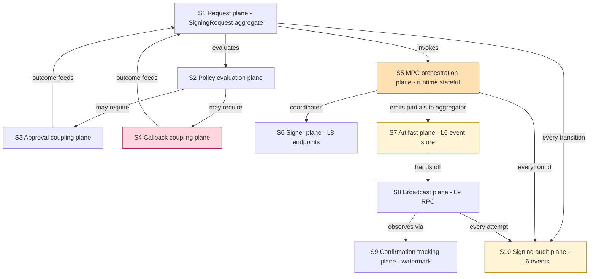

| Sub-plane | 책임 | D1a 매핑 | 저장 / 실행 모델 |
|---|---|---|---|
| **S1 Request** | SigningRequest aggregate state machine 운영 | L4 | OLTP + transition log |
| **S2 Policy evaluation** | rule eval → required approval / callback / quorum 결정 | L5 + runtime | stateless eval + result cache |
| **S3 Approval coupling** | ApprovalRequest 발행 + decision wait | L4 + L5 | OLTP + event |
| **S4 Callback coupling** | CallbackHandler invoke + auth + response wait + B5 boundary | L4 + L5 + network | network + audit event |
| **S5 MPC orchestration** | round coordination, participant management, partial aggregation | **runtime stateful** (no persistent SM) | in-memory orchestrator + heartbeat |
| **S6 Signer endpoint** | MPC signer 호출, attestation 검증 | L8 | metadata DB + secure channel |
| **S7 Artifact** | final signed tx blob, attestation digest 보관 | L6 | event store + object store |
| **S8 Broadcast** | RPC submission, mempool entry | L9 + network | RPC fan-out + cache |
| **S9 Confirmation tracking** | watermark / depth / reorg awareness | L9 | watcher process + projection |
| **S10 Signing audit** | 모든 phase 의 evidence emission | L6 | append-only event store |

**핵심 invariant**:
- **S5 는 stateful runtime plane** — persistent storage 아닌 in-memory coordinator. 실패 시 SigningAttempt 가 fail 되고 새 attempt 시작.
- **S4 는 customer trust boundary 횡단** — vendor/orchestrator 의 권한 밖.
- **S9 의 reorg 처리는 D1b 영역** — S9 는 observation 만, compensation 은 D1b.

---

## 2. MPC Orchestration Flow

### 2.1 High-level orchestration

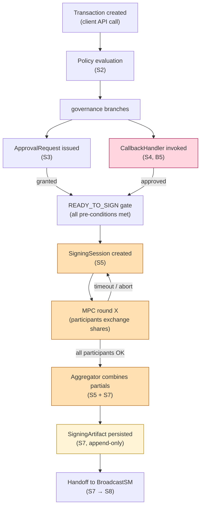

### 2.2 MPC round detail (S5 runtime plane)

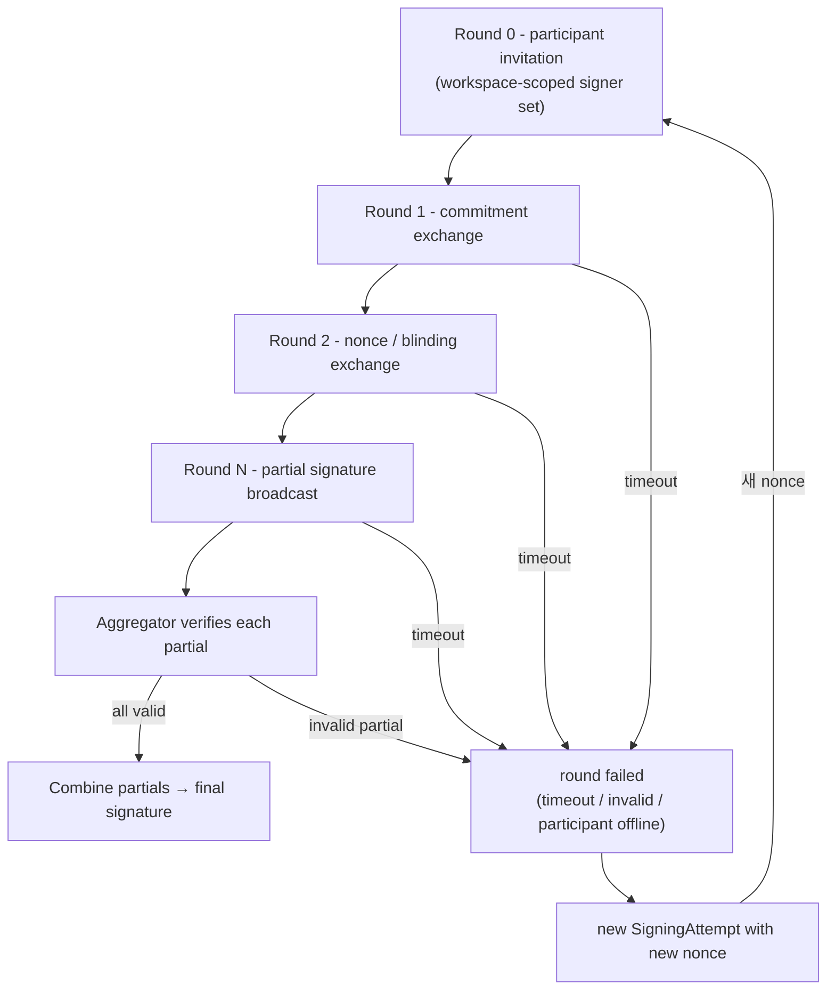

**핵심 reasoning (S5 가 runtime stateful 인 이유)**:
- 각 round 의 ephemeral data (commitment / nonce / partial signature) 는 **메모리에만** 존재 — 영속 저장 시 leak vector ↑.
- Round 진행 중 orchestrator 실패 = SigningAttempt 전체 fail (recovery 불가). **이는 bug 아닌 의도된 safety property**.
- Heartbeat 만 persisted (round_id / phase / participant set) — replay 시 attempt 자체는 새로 시작.
- **Aggregator 는 trusted role 이지만 key 를 보지 않음** — 각 participant 가 자신의 share 로 partial signature 생성, aggregator 는 combine 만.

### 2.3 3-endpoint MPC-CMP variant (Fireblocks reference)

Stage 8 reference: MPC-CMP 의 3-endpoint = 2 cloud share + 1 customer share (mobile app).

```
[Cloud share A] ─┐
                 ├─→ Aggregator → final signature
[Cloud share B] ─┤
                 │
[Mobile share C] ─┘  (customer side)
```

**핵심**: 3 endpoint 중 어느 하나도 단독으로 signature 생성 불가 (threshold property). 따라서 single signer 의 compromise 가 fund 탈취로 이어지지 않음.

→ Reference: [[entities/fireblocks/mpc-key-share]] §"MPC-CMP 3-endpoint distribution", [[vendors/fireblocks/architecture]].

---

## 3. 4 분리 State Machine

핵심 명제 §0.2 의 구체화: signing workflow 는 **단일 SM 이 아닌 4 개의 협력하는 SM**.

### 3.1 TransactionStateMachine (overall lifecycle)

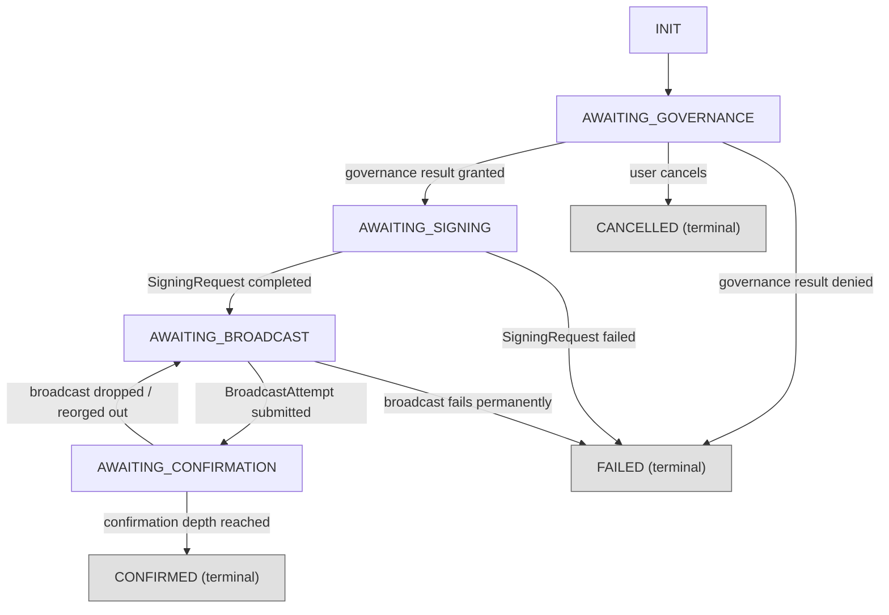

**핵심**: Transaction 은 위 3 SM 의 result 를 **subscribe** 만 한다. 직접 governance / signing / broadcast 를 하지 않음 — orchestrator 역할만.

### 3.2 ApprovalRequestStateMachine

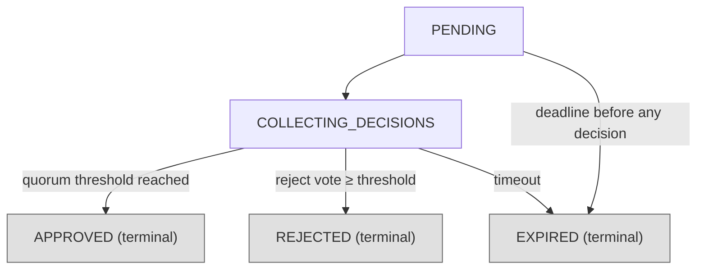

**핵심**:
- COLLECTING_DECISIONS 은 **append-only event stream** 위의 projection. ApproverDecision 은 immutable evidence.
- Approver 변경 / 회수는 **새 decision 으로 cancel** (delete 금지) — D1a append-only invariant.

### 3.3 SigningRequestStateMachine (D2 핵심)

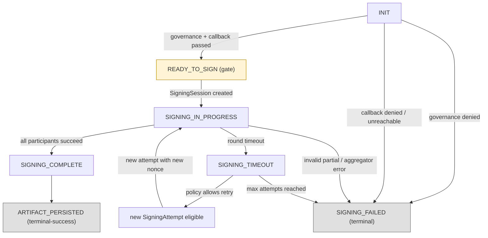

**핵심**:
- SIGNING_IN_PROGRESS 의 **sub-state (round X) 는 SM 의 정식 state 아님** — heartbeat 만 persisted, orchestrator 실패 시 lost OK.
- TIMEOUT 후 retry 는 **새 SigningAttempt + 새 nonce** (Q8 의 핵심 — MPC retry idempotency 불가).
- ARTIFACT_PERSISTED 가 terminal-success — 이 시점에 SigningRequest 의 책임 끝. BroadcastSM 으로 handoff.

### 3.4 BroadcastStateMachine

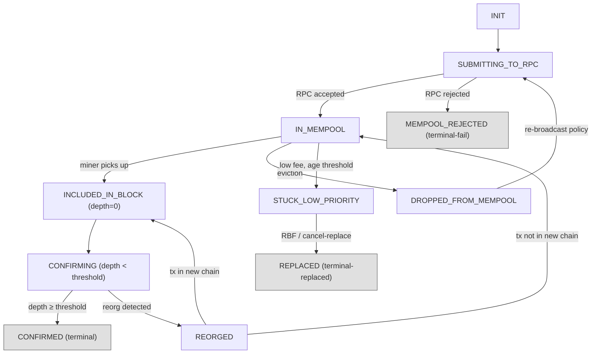

**핵심**:
- DROPPED → SUBMITTING 의 cycle 은 chain-specific (account-model 은 같은 signed blob 재제출 가능; UTXO 는 새 build 필요한 경우 있음).
- REORG 가 발생하면 다시 IN_MEMPOOL 또는 DROPPED — depth reset.
- STUCK → REPLACED 는 새 SigningRequest 가 필요한 경우 있음 (다른 nonce / 다른 fee — 새 tx blob). 이 경우 원본 BroadcastAttempt 는 terminal-replaced.
- **CONFIRMED 임계값은 chain-specific** — BTC 6, ETH ~64 (post-merge), L2 별 다름. 이 임계값 결정 자체는 §11 의 org policy.

---

## 4. Transaction ↔ Approval ↔ Signing 관계

### 4.1 Cardinality

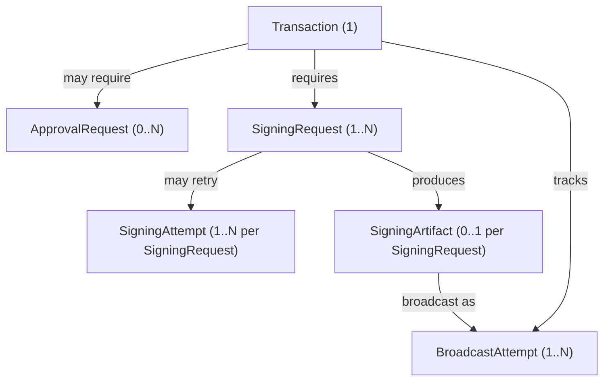

**핵심**:
- 1 Tx → **0 이상의** ApprovalRequest (policy 가 require 안 할 수도 — auto-approved).
- 1 Tx → **1 이상의** SigningRequest (보통 1, REPLACED 시 새 SigningRequest).
- 1 SigningRequest → **1 이상의** SigningAttempt (retry).
- 1 SigningRequest → **0..1 SigningArtifact** (성공 시 1, 실패 시 0).
- 1 Artifact → **1 이상의** BroadcastAttempt (DROPPED 재제출 / STUCK replacement).

### 4.2 Lifecycle 독립성 (왜 분리하는가)

| 분리 결정 | 이유 |
|---|---|
| Approval 별도 aggregate | governance 의 lifetime 이 transaction 보다 짧을 수 있음 (approval expire) + 한 tx 가 여러 approval group trigger 가능 + Approver Decision append-only invariant |
| Signing 별도 aggregate | 1 tx → N attempt (retry); signer plane (L8) coupling 격리; MPC orchestration runtime 의 ephemeral state 와 transaction 의 persistent state 분리 |
| Broadcast 별도 aggregate | chain-specific lifecycle (RBF / cancel / replacement); same signed blob 의 여러 broadcast attempt; mempool / reorg semantics 가 signing 관심사와 무관 |

**Anti-pattern**: 위 셋을 Transaction aggregate 의 child 로 두면 — invariant scope 폭증, contention ↑, 부분 progression 표현 불가, retry 시 entire aggregate 재구성 필요.

---

## 5. Callback Handler Interaction Model

### 5.1 B5 trust boundary

Callback Handler 는 **customer-side** code/service. Vendor (또는 orchestrator) 의 제어 밖.

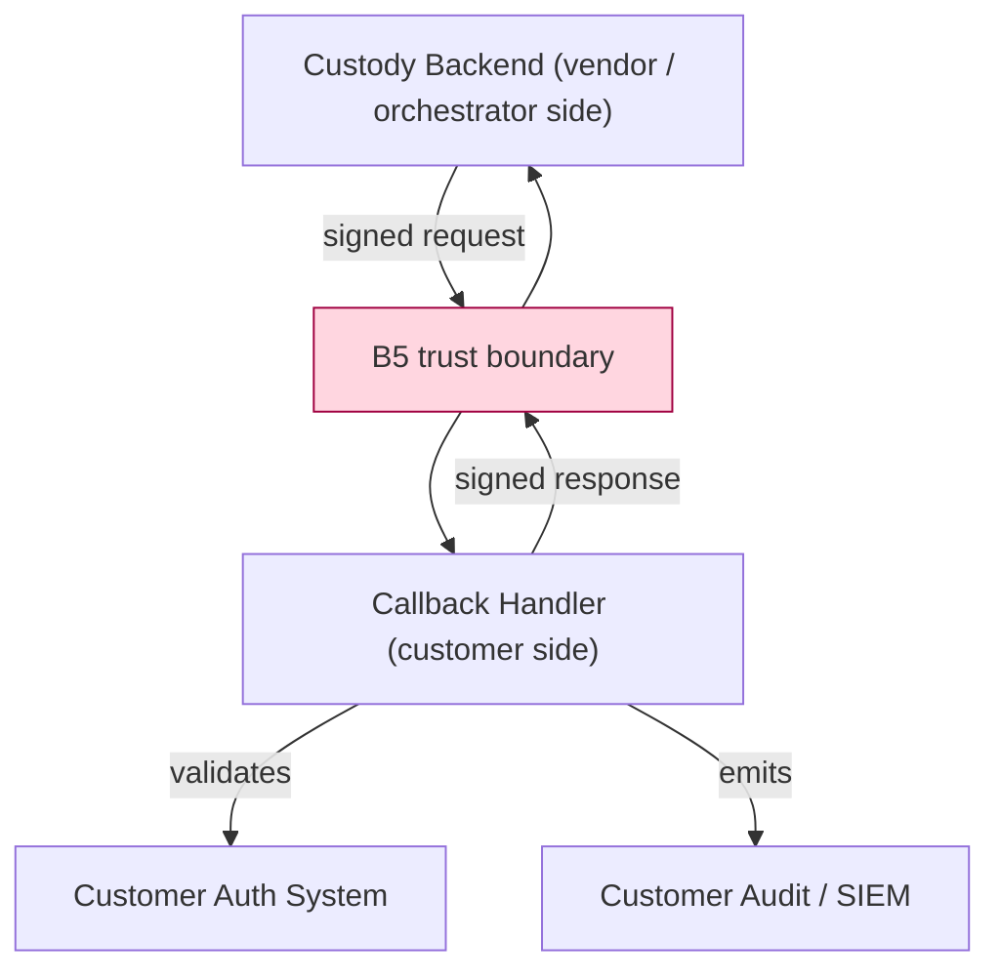

**Boundary 의 의미**:
- Backend 는 Handler 의 응답 무결성을 **신뢰할 수 없음** — 반드시 cryptographic verification.
- Handler 는 Backend 의 요청 무결성을 **신뢰할 수 없음** — 반드시 cryptographic verification.
- 둘 다 **fail-closed**: 검증 실패 시 deny.

### 5.2 5 Authentication Options (reference)

| Option | trust property | operational burden |
|---|---|---|
| **no auth** | none — anyone can respond | minimal but unsafe; test 환경 외 금지 |
| **JWT** | symmetric / asymmetric token | medium — token rotation |
| **mTLS** | mutual cert | high — PKI 관리, cert rotation |
| **OAuth** | provider-issued token | medium — IdP 의존, token TTL 관리 |
| **Asymmetric signed** | per-user callback key | highest 보안 — per-user key 회전 burden |

→ Reference: [[entities/fireblocks/callback-handler]] §"Authentication Options", [[vendors/fireblocks/callback-handler]].

### 5.3 2-key asymmetry (Stage 24 핵심 reasoning)

Callback flow 는 **방향별로 다른 key 와 다른 책임**:

| 방향 | 사용 key | 보유 주체 | 회전 주기 |
|---|---|---|---|
| Backend → Handler request signing | **global signer key** | vendor / orchestrator | 보통 1년 + on-incident |
| Handler → Backend response signing | **per-user callback key** | customer 사용자별 발급 | per-user lifecycle |

**왜 비대칭인가**:
- Backend 가 customer 의 누구에게 보낸 요청인지 식별하기 위해 — 응답이 어느 user 의 의사인지 verification.
- Global key 만으로는 누가 응답했는지 모름 → audit 부재.
- 이 비대칭은 **customer-managed key lifecycle 의 burden** 을 의미 — direct-build 시 PKI / KMS 통합 필수.

### 5.4 Optional semantics (Stage 24 핵심)

- Callback Handler 는 **workspace 별 enable/disable**.
- Enable 시 fail-closed: handler 응답 없음 / 검증 실패 / timeout 모두 **CALLBACK_DENIED** 로 mapping (signing 진행 안 됨).
- Disable 시 정책이 callback 을 require 하지 않음 — approval / policy 만으로 signing gate 통과.

**핵심 위험 (★ Hypothesis — Risk-S16 reference)**:
- Callback "optional" 을 "fail-open default" 로 잘못 구현하면 → callback handler 다운 = signing free pass. fail-closed 가 invariant.

### 5.5 Idempotency

Callback request 는 **idempotent** — 같은 callback_request_id 로 재요청 시 같은 응답 보장. 이는 backend 의 retry 가 customer side 에서 double-charge / double-decision 을 일으키지 않게 함.

Handler 측 구현 책임:
- callback_request_id → decision cache
- TTL 동안 같은 id 는 cached response

---

## 6. Replay / Retry / Idempotency Boundary

### 6.1 4 layer idempotency

| Layer | Idempotency key | Retry semantics | Aggregate |
|---|---|---|---|
| **API ingress** | client_request_id | idempotent — duplicate Transaction creation 방지 | (transaction creation) |
| **Callback** | callback_request_id | idempotent — handler 가 같은 응답 보장 | CallbackInteraction |
| **MPC signing** | session_id + nonce | **non-idempotent** — 매 retry 는 새 round, 새 nonce | SigningAttempt (새 instance) |
| **Broadcast** | chain-specific (account nonce / UTXO set) | conditional — chain semantic 의존 | BroadcastAttempt |

### 6.2 3 retry 종류

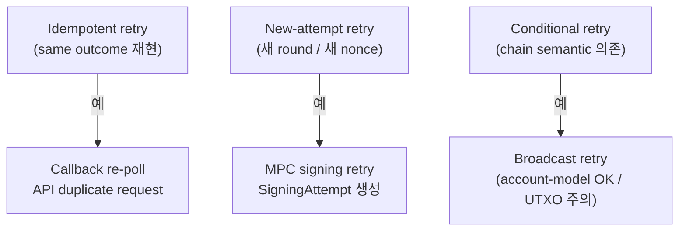

### 6.3 핵심 위험: MPC nonce reuse

**왜 MPC retry 가 idempotent 일 수 없는가**:
- MPC scheme (CMP / GG18 / Lindell17 등) 은 **각 signing 마다 새 random nonce 가 필요**.
- 같은 nonce 로 두 번 sign → mathematically derivable private key (★ general MPC schema property, Hypothesis level reference).
- 따라서 SigningAttempt 마다 새 session + 새 nonce + 새 commitment.

**구현 invariant**:
- `(workspace_id, key_id, nonce)` 는 unique constraint.
- Nonce 재사용 검출 시 즉시 abort + alert.

### 6.4 Replay protection 4 단계

| Layer | 방법 |
|---|---|
| API | client_request_id + dedup window (e.g. 24h TTL) |
| Callback | callback_request_id signed by both sides + response cache |
| MPC | nonce + session_id + per-round sequence number; aggregator 가 duplicate round detect |
| Broadcast | chain native — account nonce (EVM) / input UTXO (BTC) |

---

## 7. Reconciliation Boundary (D1b 로의 handoff)

### 7.1 D2 vs D1b 책임 분리

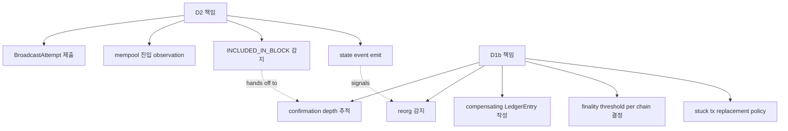

| Phase | D2 | D1b |
|---|---|---|
| Sign artifact 생성 | ✓ | — |
| RPC 제출 | ✓ | — |
| Mempool 관찰 | ✓ | — |
| Block 포함 감지 (depth 0) | ✓ | — |
| Depth 추적 | partial (state emit) | ✓ |
| Reorg 감지 | — | ✓ |
| Reorg compensating LedgerEntry | — | ✓ |
| Finality threshold per chain | — | ✓ |
| Stuck tx replacement 의사결정 | — | ✓ |
| Internal ↔ chain reconciliation 통계 | — | ✓ |

### 7.2 Watcher process 의 책임 분담

- **D2 의 watcher**: BroadcastAttempt 가 mempool / block 에 들어갔는가 — boolean 상태 emit.
- **D1b 의 watcher**: 그 이후 depth 추적, reorg 처리, finality 도달.

**왜 분리하는가**:
- D2 watcher 는 signing lifecycle 의 boundary marker — broadcast 가 "성공" 했는지만 판단.
- D1b watcher 는 chain-specific complexity 의 ownership — chain 별 reorg depth / finality / fork choice 등 모두 D1b 의 도메인.
- 분리 시 D2 의 logic 은 chain-agnostic, D1b 가 chain-specific adapter pattern.

---

## 8. TEE / Signer Topology Model

### 8.1 B3 TEE boundary + B9 signer topology

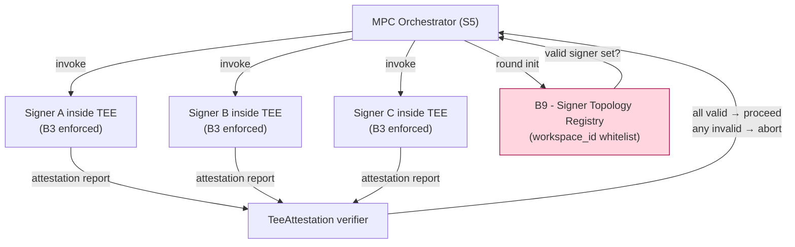

### 8.2 3-way TEE plane (Stage 19 reference)

| TEE | Vendor | Reference |
|-----|--------|-----------|
| AWS Nitro Enclaves | Cloud A | [[sources/fireblocks/markdown/2026-05-19__support-fireblocks-io__aws-nitro-cluster-catalog]] |
| Intel SGX | on-prem / cloud | |
| GCP Confidential Space | Cloud B | |

→ **why 3-way**: vendor 다양화 + jurisdictional 분산. Single TEE family 의 vulnerability (예: SGX 의 historical side-channel) 가 전체 signing 을 marsh 하지 않음.

### 8.3 B9 — Signer Topology Trust

**무엇을 막는가**:
- Rogue signer registration (workspace 외부 signer 가 orchestration 에 끼어드는 것)
- Stale signer 의 lingering authorization (rotation 후에도 유효 한 경우)

**구현 invariant**:
- Signer enrollment 은 workspace_id 와 bind.
- Orchestrator 는 매 round 시작 시 topology registry 조회 — valid signer set 만 invoke.
- Attestation 실패 = 즉시 SigningAttempt fail + audit emit + 해당 signer quarantine.

### 8.4 Attestation lifecycle

- Attestation report 는 매 round (또는 더 자주) 생성.
- TeeAttestation 은 **append-only** (D1a L8 plane).
- Historical attestation 은 forensic 용 — 과거 signing 이 어느 TEE measurement 에서 일어났는지 재현 가능.

---

## 9. SaaS vs Self-hosted vs Direct-build Burden Map

### 9.1 Plane × Ownership 매트릭스

| Sub-plane | Fireblocks SaaS | 설치형 WaaS / Hosted MPC | 직접 구축 |
|---|---|---|---|
| **S1 Request** | Vendor | Vendor control plane | Customer |
| **S2 Policy eval** | Vendor (정책 customer 작성) | Vendor | Customer |
| **S3 Approval** | Vendor (UI / mobile) | Vendor + customer integration | Customer (자체 governance plane) |
| **S4 Callback (B5)** | Customer optional | Customer | Customer (또는 governance 통합으로 불필요화) |
| **S5 MPC orchestrator** | Vendor 3-cloud orchestrator | Vendor control plane + customer cosigner | **Customer 전적** (MPC lib) |
| **S6 Signer plane** | Vendor 2-cloud + customer mobile | Customer hosts cosigner | Customer (HSM / MPC lib) |
| **S7 Artifact** | Vendor + customer export | Vendor + customer mirror | Customer |
| **S8 Broadcast** | Vendor multi-RPC | Vendor 또는 customer | Customer (own node / multi-provider) |
| **S9 Confirmation tracking** | Vendor | Vendor | Customer (chain-specific) |
| **S10 Signing audit** | Vendor + export | Vendor + customer SIEM mirror | Customer SIEM |

### 9.2 Burden 분포 (★ Hypothesis — operational reasoning)

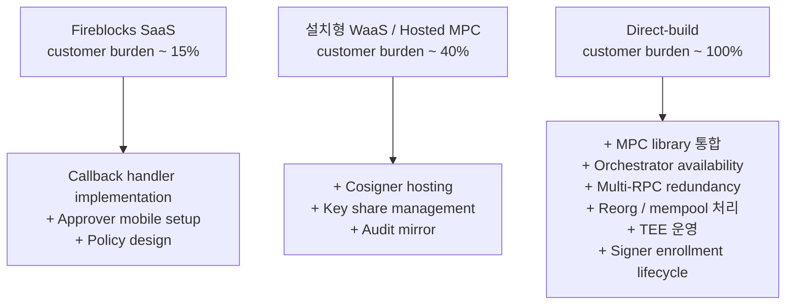

### 9.3 Lock-in pivot point

```
가장 큰 lock-in 영역 (S5 + S9 + S8 redundancy):
  - S5 MPC orchestrator      → 자체 구현 시 distributed coordinator burden
  - S9 Confirmation tracking → chain-specific reorg logic burden
  - S8 Multi-RPC redundancy  → RPC provider failover burden
```

이 셋이 burden 의 ~80% (★ Hypothesis — based on generalized custody operations reasoning, not vendor-specific measurement).

### 9.4 Recommendation (운영 관점)

| Context | 권장 |
|---|---|
| 자산 규모 < threshold, 운영 인력 < 10 | SaaS — S5/S8/S9 outsource 가 절대적 우위 |
| 중견, 규제 강함, sovereignty 필요 | Hosted MPC — S6/S7 customer mirror, S5/S8 vendor 유지 |
| 거래소 / 자체 인프라 / 자산 매우 큼 / 규제 자체 대응 | Direct-build — S5/S8/S9 자체 구축, MPC lib + 자체 watcher infrastructure |

→ 추천 ≠ fact. Trade-off (compliance / 인력 / cost / sovereignty / vendor risk) 별 의사결정.

---

## 10. 핵심 Reasoning Question (Q1-Q10)

### Q1. Signing Request 와 Transaction 분리 이유?

**D1a Q6 의 확장**.
- 1 Tx → N SigningAttempt 가능 (retry).
- SigningRequest 가 fail 해도 Transaction 은 retry 가능 (새 SigningRequest 발행).
- Signer plane (L8) coupling 격리 — Transaction aggregate 가 signer 변화로부터 영향받지 않음.
- MPC orchestration 의 ephemeral runtime state (round, partial signature) 가 Transaction 의 persistent state 와 다른 lifetime.

### Q2. Approval success ≠ Signing success?

**Yes — 다른 trust domain**.
- Approval = governance decision (human / policy 기반).
- Signing = cryptographic operation (MPC participant 수행).
- Approval 통과 후에도 callback handler 가 deny 가능 (다른 trust layer).
- Approval 통과 후에도 signer 가 unavailable / TEE attestation fail / nonce conflict 로 signing 실패 가능.

따라서 두 phase 는 **다른 state machine, 다른 audit event, 다른 retry semantics**.

### Q3. Signing success ≠ Blockchain confirmation?

**Yes — 다른 stage, 다른 trust system**.

```
Signing complete
  ≠ tx submitted to mempool (RPC 미도달 가능)
    ≠ tx in mempool (rejection 가능)
      ≠ tx included in block (mempool eviction 가능)
        ≠ tx confirmed (reorg 가능)
          ≠ tx final (chain finality threshold 필요)
```

각 → 는 별개 trust assumption. Signed blob 보유 ≠ on-chain effect.

### Q4. Callback Handler 의 operational 의미?

**B5 trust boundary 가 customer 의 governance plane 을 vendor 의 signing pipeline 에 inject 하는 메커니즘**.

- Customer 는 vendor 의 internal policy 결정을 그대로 신뢰하지 않을 수 있음.
- Callback Handler 는 customer 의 추가 check (예: customer 의 fraud system / risk engine / 사용자 단말 confirmation) 를 signing gate 로 만듦.
- Optional 이지만 fail-closed — enable 한 순간 customer 는 handler availability 책임.

### Q5. Offline approval vs online signing?

**Approval 은 offline 가능, signing 은 online 필수**.
- Approval: 모바일 app push, 이메일+서명, 별도 채널 — approver 가 다른 시간 / 다른 device 에서 결정 가능.
- Signing: MPC participant 가 **real-time round** 에 참여해야 함. 각 round 의 commitment / nonce exchange 는 sub-second timing 의존.

따라서:
- Approval 은 SLA 가 hours/days 단위 가능.
- Signing 은 SLA 가 seconds/minutes 단위.

이 SLA 차이가 두 SM 의 timeout 설정 차이를 결정.

### Q6. MPC orchestration 의 state machine?

**§3.3 + §2.2**. 핵심:
- SigningRequestStateMachine 의 SIGNING_IN_PROGRESS 는 **single state**, sub-state (round X) 는 SM 정식 state 아닌 runtime heartbeat.
- 이는 의도된 simplification — round 의 ephemeral state 가 SM 의 persistent boundary 안에 들어오면 ES 복잡도 폭증.
- Round 실패 = SigningAttempt 실패. SigningRequest level 에서는 attempt count 만 추적.

### Q7. Partial signature lifecycle?

**Ephemeral — runtime 메모리에만**.

- 각 participant 가 partial signature 생성 → aggregator 에 전송.
- Aggregator 가 combine → 최종 signature.
- Partial signature 자체는 영속 저장 안 함 (storage = leak vector).
- 영속화는 **evidence digest + attestation report** 만 (SigningArtifact 에 metadata).

**Hypothesis ★**: 일부 MPC scheme 은 audit 목적으로 partial signature 의 zero-knowledge proof 를 저장하는 경우도 있음 — vendor-specific.

### Q8. MPC 의 retry 가 어려운 이유?

**Nonce reuse = key leak** (§6.3).
- 매 retry 는 새 round / 새 nonce.
- 따라서 SigningAttempt 는 **non-idempotent**, 매번 새 instance.
- 정책 차원: max retry count (e.g. 3) 이후 SigningRequest FAILED 로 terminate.
- Anti-pattern: "retry 시 같은 session resume" — security violation.

### Q9. Blockchain-specific complexity?

| 차원 | 차이 |
|---|---|
| Account model vs UTXO | EVM (account nonce 기반 idempotent broadcast) vs BTC (UTXO 기반, replacement 시 새 build) |
| Finality | BTC 6 conf / ETH ~64 (post-merge) / Cosmos instant / Solana ~32 / L2 별 변동 |
| Mempool semantics | mempool 존재 여부, eviction policy, RBF 지원 |
| Fee market | EIP-1559 vs legacy gas, priority fee, BTC fee market |
| Reorg depth | chain probability profile |
| Multi-signature schemes | native multisig vs MPC vs account abstraction |
| Smart contract interaction | additional state transitions, revert handling |

→ 각 chain 별 **adapter pattern**. D1b 가 owner.

### Q10. Vendor abstraction 이 숨기는 complexity?

(★ Hypothesis — operational reasoning)

Vendor SaaS 가 customer 에게서 흡수하는 complexity:
- **S5 orchestrator availability** — 3-cloud failover, leader election, heartbeat.
- **S6 signer enrollment lifecycle** — TEE measurement update, signer rotation, quarantine workflow.
- **S8 multi-RPC redundancy** — RPC provider failure handling, response divergence detection.
- **S9 reorg handling** — chain-specific watchers per network.
- **chain-specific complexity 의 90%** — fee estimation, mempool monitoring, RBF/cancel logic.
- **Audit aggregation** — cross-component event correlation.

Direct-build 시 위 모든 영역이 customer 부담.

---

## 11. Open Questions / Org Policy 영역

본 문서가 답하지 않는 영역 — org / compliance / 별도 의사결정 필요:

| 영역 | 질문 | 왜 본 문서 범위 밖 |
|---|---|---|
| Confirmation depth per chain | BTC 6 / 3? ETH 64 / 32? Solana 32 / 64? | risk appetite + asset value |
| Max signing retry | 3 / 5 / 1? | operational cost vs availability |
| Callback timeout | 30s / 5m / 30m? | customer integration SLA |
| Approval expiry | 1h / 24h / 7d? | governance 강도 + UX |
| Mempool re-broadcast policy | aggressive / conservative? | stuck tx 발생률 + fee market |
| RBF vs cancel | which chain? when? | chain capability + customer policy |
| Stuck tx threshold | mempool 잔류 시간 vs fee escalation | UX + economic |
| MPC scheme 선택 | CMP / GG18 / Lindell17 / threshold ECDSA / FROST? | security analysis + library choice |
| TEE family | Nitro / SGX / Confidential Space / 모두? | infrastructure + vendor risk |
| Per-user callback key 회전 주기 | quarterly / yearly / on-employee-change? | identity lifecycle |

---

## 12. 다음 단계 (D2 이후)

본 문서는 D2 — **signing workflow + MPC orchestration**. 이후:

- **D1b — Blockchain Reconciliation**: §7 의 D1b 책임 영역. watermark / depth / reorg compensation 의 chain-specific 알고리즘.
- **D3 — Approval State Machine**: §3.2 의 ApprovalRequestStateMachine 의 상세 — policy evaluation engine, quorum logic, escalation, delegation.
- **D4 — Recovery Ceremony**: L7 cold plane 의 break-glass procedure full cycle (Stage 29-31 reasoning generalized).
- **D5 — Audit / Event Sourcing**: L6 의 outbox + consumer + projection pattern.
- **D6 — 3-way Decision Framework**: §9 의 의사결정 framework formalize.

→ D2 의 signing boundary 가 향후 D1b / D3 / D4 의 reasoning baseline.

---

## 13. 관련 wiki / entity reference + Uncertainty Boundary

### 관련 wiki

| 참조 | 어디서 사용 |
|---|---|
| [[entities/fireblocks/mpc-key-share]] | §2.3 (3-endpoint MPC-CMP), §6.3 (nonce reuse) |
| [[entities/fireblocks/api-co-signer]] | §1 (S6), §8 (B9 signer topology) |
| [[entities/fireblocks/callback-handler]] | §5 (5 auth options), §5.3 (2-key asymmetry) |
| [[entities/fireblocks/cosigner]] | §1 (S6), §8 (Cosigner topology) |
| [[entities/fireblocks/approval-group]] | §3.2, §4.2 (Approval 별도 aggregate) |
| [[entities/fireblocks/admin-quorum]] | §3.2 (governance) |
| [[entities/fireblocks/policy]] | §1 (S2 policy eval), §3.2 |
| [[entities/fireblocks/transaction]] | §3.1, §4 (Tx ↔ Signing ↔ Approval) |
| [[entities/fireblocks/workspace-keys-backup]] | §8.4 (attestation; cross-link to D4) |
| [[vendors/fireblocks/architecture]] | §2.3 (3-endpoint), §9 (Hosted MPC variant) |
| [[vendors/fireblocks/callback-handler]] | §5 (5 auth) |
| [[vendors/fireblocks/cosigner]] | §8 (3-way TEE) |
| [[vendors/fireblocks/risks]] | §5.4 (Risk-S16 callback fail-open), §6.3 (nonce reuse) |
| [[docs/architecture/vault-wallet-ledger-db-schema]] | 본 문서의 D1a 기반 |

### Uncertainty Boundary (★ 절대 유지)

- 본 문서의 **10 sub-plane / 4 SM 분리 / B5 fail-closed / MPC retry non-idempotent / orchestrator burden 80%** 는 모두 **generalized custody architecture pattern** (Hypothesis ★). 특정 vendor 의 internal implementation 이 동일하다고 주장하지 않음.
- Fireblocks 의 3-endpoint MPC-CMP / 5 callback auth / 3-way TEE / Risk catalog 는 **reference model** 로 인용 — generalized 형태로 매핑.
- MPC nonce reuse → key leak 의 mathematical proof 는 **general MPC literature** 의 잘 알려진 property (★ Hypothesis level — 특정 scheme 마다 detail 다름).
- §9.4 의 추천 architecture 는 **운영 관점 권장** — fact 아님.
- §11 에 명시된 영역은 본 문서가 결정하지 않음.
- "확정 fact" 영역 (Fireblocks vendor docs 직접 인용 가능): wikilink + 출처 명시. 그 외는 generalized reasoning.

---

**Stage 32 D2 completion timestamp**: 2026-05-19.
