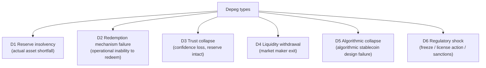
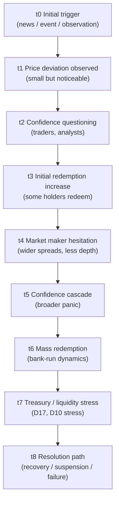
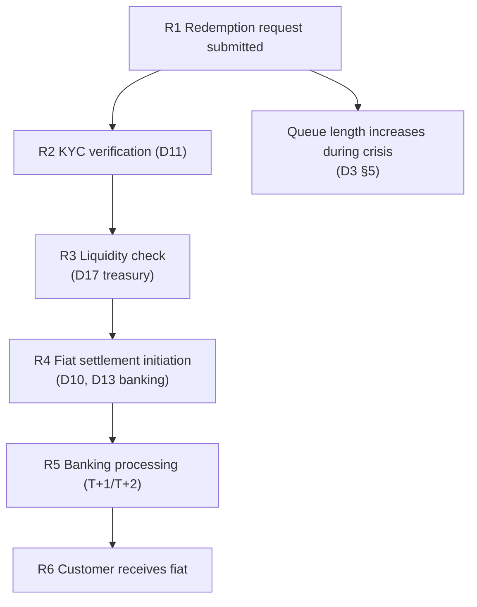
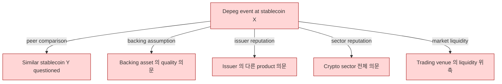
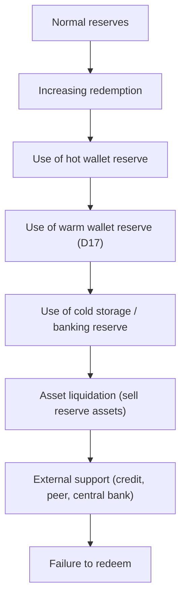
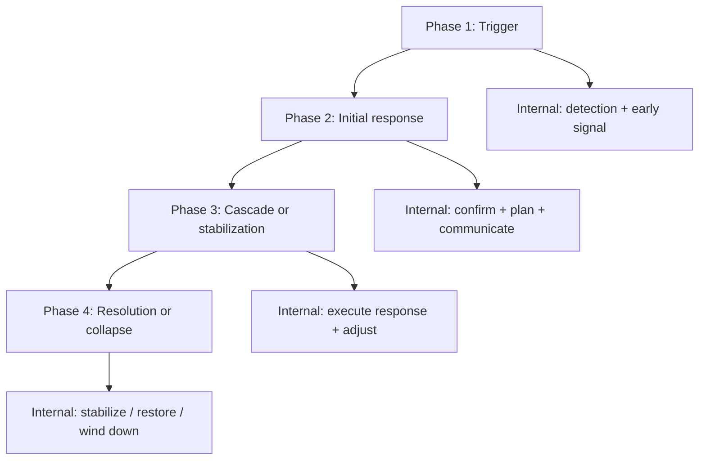
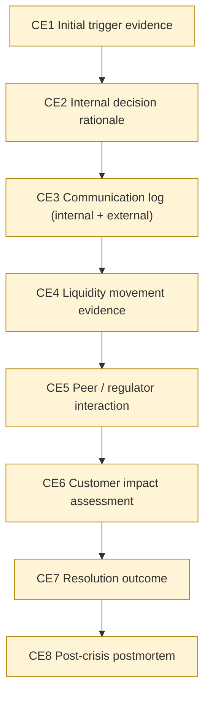

# Custody Wallet — Stablecoin Depeg / Crisis Handling Reasoning

> **본 문서의 위치 (Crisis Cluster D21)**: D10 treasury (mint/burn) + D17-D20 liquidity cluster + D15 transparency 위의 **stablecoin crisis specialization**. Steady-state monetary system 의 stress collapse — depeg = price deviation 이 아닌 **synchronized multi-domain crisis**.

> **본 문서가 답하는 핵심 질문**: 왜 depeg 가 단순 price deviation 이 아닌가? 왜 reserve equality 가 market confidence 보장 아닌가? 왜 redemption pressure 가 immediate failure 가 아닌가? 왜 treasury freeze 가 settlement stop 과 다른가? 왜 market recovery 가 trust recovery 보다 빠른가?

---

## 0. 핵심 명제 (10초 이해)

1. **Stablecoin depeg = synchronized trust / liquidity / redemption / coordination crisis** (core thesis).
2. **5-tier "≠" 명제 (D21 cluster invariant)**:
   - Peg deviation ≠ Insolvency
   - Redemption pressure ≠ Immediate failure
   - Reserve equality ≠ Market confidence
   - Treasury freeze ≠ Settlement stop
   - Market recovery ≠ Trust recovery
3. **Depeg = market signal of multi-domain stress** — price 는 symptom, root cause 는 multi-domain.
4. **Confidence dynamics 가 reserve 보다 빠름** — reserve 100% 라도 confidence collapse 시 mass redemption.
5. **Redemption asymmetry** — fast outflow capacity > fast inflow capacity (banking infrastructure).
6. **Reflexive depeg** — price drop → confidence drop → more redemption → more price drop.
7. **6 depeg type** — Reserve insolvency / Redemption mechanism failure / Trust collapse / Liquidity withdrawal / Algorithmic collapse / Regulatory shock.
8. **Crisis 의 4-phase lifecycle** — Trigger / Initial response / Cascade / Resolution-or-collapse.
9. **Communication 의 paradox** — silence breeds rumor, but premature disclosure amplifies panic.
10. **Crisis customer burden 거의 100%** — vendor 의 흡수 가능 영역 거의 없음, customer 의 own crisis management.

---

## 1. Depeg Taxonomy

### 1.1 6 depeg type

### 1.2 Type 별 특성

| Type | Reserve status | Recovery probability | Recovery time |
|---|---|---|---|
| D1 Reserve insolvency | Actually insufficient | Low-Medium | Months-years |
| D2 Redemption mechanism failure | Sufficient but inaccessible | High (if fixed) | Days-weeks |
| D3 Trust collapse | Sufficient, market disbelief | Medium (trust 회복 어려움) | Months |
| D4 Liquidity withdrawal | Sufficient | Medium | Days-weeks |
| D5 Algorithmic collapse | N/A (no traditional reserve) | Very low | Often terminal |
| D6 Regulatory shock | Variable | Variable | Variable |

### 1.3 "Peg deviation ≠ Insolvency"

(§0 명제)

- Peg deviation = market price 와 nominal peg 의 deviation.
- Insolvency = liabilities > assets.
- 차이:
  - D1 (reserve insolvency): 둘 다
  - D2-D4: depeg 있지만 solvent
  - D5: algorithmic 의 special case
  - D6: regulatory issue, solvency 와 별개
- → Depeg 의 root cause 식별 = crisis response 의 first step.

### 1.4 Hybrid depeg (★ Hypothesis — historical pattern)

- 실제 depeg 은 single type 아닌 cascading:
  - 초기 small trigger (D3 또는 D4)
  - Confidence drop
  - Redemption pressure (D2 mechanism 시험)
  - Reserve quality 의문 (D1 suspicion)
  - Eventual mix of multiple types
- → Crisis 의 dynamic 분석 필요.

---

## 2. Depeg Propagation

### 2.1 Propagation 의 acceleration factors

| Factor | 효과 |
|---|---|
| Social media | Information spread velocity |
| Automated bots | Algorithmic selling acceleration |
| Cross-chain visibility | Same event visible everywhere instant |
| Index inclusion | Index funds 의 forced action |
| Counterparty contagion | Other institution 의 stress |

### 2.2 Reflexive dynamics

- Price drop → confidence drop → redemption ↑ → price drop ↑ (positive feedback loop).
- Stop conditions:
  - Reserve disclosure 가 confidence restore
  - External intervention (regulator, peer)
  - Liquidity injection (market maker return)
  - Time decay (panic 의 자연 감소)

### 2.3 "Reserve equality ≠ Market confidence"

(§0 명제)

- Reserve = liabilities 가 mathematical fact.
- Market confidence 는 market 의 belief.
- 차이:
  - Reserve 100% 라도 market 가 disbelief 면 depeg.
  - Reserve 90% 라도 market 가 trust 면 maintain.
- → Math + perception 의 결합 = market price.

### 2.4 Trust momentum

(★ Hypothesis — financial pattern)

- 평상시 trust = robust (small deviation 가 self-correcting).
- Crisis 시 trust = fragile (small deviation 가 self-amplifying).
- → Same evidence 가 다른 dynamic 의 input.

---

## 3. Redemption Queue Lifecycle

### 3.1 Redemption queue dynamics

### 3.2 Queue 의 4-stage 진화

| Stage | Queue state | Treasury response |
|---|---|---|
| Normal | Empty / short | Standard processing |
| Elevated | Lengthening | Throughput acceleration |
| Stressed | Long, ageing | Triage + customer communication |
| Crisis | Halted / suspended | Emergency authority decision |

### 3.3 "Redemption pressure ≠ Immediate failure"

(§0 명제)

- Pressure = high volume redemption demand.
- Failure = inability to honor commitments.
- 차이:
  - Pressure 가 high 해도 treasury sufficient 하면 honor 가능
  - 그러나 banking infrastructure 의 throughput limit (T+1/T+2)
  - → Time-bounded operational stress, immediate failure 아님
- → Pressure 의 acceptable duration 가 design 결정.

### 3.4 Redemption asymmetry

- Issuance: incremental (gradual deposit)
- Redemption: 가능한 mass (single moment)
- Infrastructure asymmetry:
  - Banking: redemption 의 same fiat throughput
  - 그러나 mass redemption 시 banking saturation
- → Issuer 의 mass redemption capacity 가 stress test.

### 3.5 Queue management policy

(★ Hypothesis — operational pattern)

- FIFO (first-in-first-out)
- Priority-based (large institutional first?)
- Pro-rata (equal allocation)
- Pause (temporary suspension)
- → Each policy 의 fairness vs efficiency vs legal implication.

---

## 4. Confidence Contagion Graph

### 4.1 Confidence contagion sources

### 4.2 Inter-stablecoin contagion

(★ Hypothesis — historical pattern, e.g. UST → other 알고리즘 stablecoin 의 brief stress)

- Similar mechanism 의 stablecoin 이 同时 stress.
- Different mechanism 도 sector-wide 영향.
- → Issuer 가 own crisis 안에 있어도 sector trust 의 contagion.

### 4.3 Cross-domain contagion

- Stablecoin depeg → DeFi protocol 의 collateral re-valuation → liquidations → asset price impact.
- Stablecoin depeg → CEX 의 deposits suspension → off-ramp friction.
- → Multi-domain stress propagation.

### 4.4 Reputational contagion

- Issuer 의 다른 product (e.g. lending arm, exchange) 도 questioned.
- Operational decisions (예: previous transparency choice) revisited.
- → Crisis 의 retrospective magnification.

### 4.5 "Market recovery ≠ Trust recovery"

(§0 명제)

- Market: price 가 peg 으로 회귀 (technical recovery).
- Trust: holder 의 confidence 회복.
- 차이:
  - Market 의 회귀가 빠를 수 있음 (arbitrage)
  - Trust 의 회복은 months-years (long-term reputation effect)
- → Crisis 후 의 long shadow.

---

## 5. Reserve / Liquidity Stress Flow

### 5.1 Reserve stress의 progression

### 5.2 Reserve sale 의 cost

- Stress 시 reserve sale = forced sale.
- Bid-ask spread widening.
- Price discount (illiquidity premium).
- → Reserve 의 mark-to-market drop 가 self-amplifying.

### 5.3 Reserve composition matters

(D10 §4 + §5 의 crisis context)

- Cash equivalent: instant deployable but yield ↓
- Treasury bills: high quality but T+1/T+2 settlement
- Commercial paper: yield ↑ but liquidity ↓ in crisis
- Tokenized assets: blockchain finality + token issuer trust

→ Crisis 시 의 reserve composition 의 quality 가 결정적.

### 5.4 Bridge / wrapped supply 의 stress dynamics

(D9 + D10 §5 의 crisis 측면)

- Wrapped stablecoin (e.g. on different chain) 의 cross-chain stress.
- Bridge depeg (source 와 destination price 의 deviation).
- Wrapper issuer 의 own stress.
- → Compounded contagion.

### 5.5 "Treasury freeze ≠ Settlement stop"

(§0 명제)

- Treasury freeze: 자체적 redemption suspension.
- Settlement stop: on-chain transfer 의 freeze (smart contract).
- 차이:
  - Treasury freeze = redemption only
  - Settlement freeze = transfer 자체 (broader)
- → Customer-facing impact 가 다름.

---

## 6. Crisis Response Lifecycle

### 6.1 4-phase crisis lifecycle

### 6.2 Each phase 의 critical decisions

| Phase | Critical decisions |
|---|---|
| Trigger | Early signal 인식, false alarm 식별 |
| Initial response | Disclosure timing, internal mobilization, peer contact |
| Cascade or stabilization | Liquidity deployment, customer communication, regulator engagement |
| Resolution or collapse | Continuation vs orderly wind-down, customer protection |

### 6.3 Disclosure timing paradox

(§0.9)

- 너무 일찍 disclose → panic 의 amplification.
- 너무 늦게 disclose → trust loss 의 cumulative.
- Optimal:
  - Internal mobilization 직후
  - Factual + measured + actionable
  - Regulator coordination 후
- → Practiced communication discipline (D12) 의 critical importance.

### 6.4 Crisis command structure

(D12 ICS 의 crisis application)

- Single incident commander
- Liaison to: regulator + peer institutions + customer (mass) + media
- Operations lead: liquidity deployment
- Communications lead: disclosure
- → D12 의 incident command 의 stablecoin crisis 적용.

### 6.5 Recovery vs continuation vs wind-down

- Recovery: full restoration of peg + confidence.
- Continuation: stabilized state with reduced capacity.
- Wind-down: orderly closure with customer compensation.
- → Phase 4 의 outcome 결정.

---

## 7. Survivability Mechanisms

### 7.1 Pre-crisis preparation

| Mechanism | 의미 |
|---|---|
| Reserve overcollateralization | Buffer above 1:1 |
| Multi-source liquidity (D17) | Diversification |
| Credit facility | Pre-arranged emergency lending |
| Peer mutual support | D20 의 mutual support |
| Transparency infrastructure | D15 PoR cadence + tooling |
| Crisis playbook | Pre-rehearsed response procedure |
| Regulator relationship | Pre-existing communication channel |
| Customer communication infrastructure | Mass notification capability |

### 7.2 Crisis-time mechanisms

| Mechanism | 의미 |
|---|---|
| Redemption queue management | FIFO / priority / triage |
| Emergency liquidity sourcing | Activation of pre-arranged + emergency lender |
| Selective redemption suspension | Limit / pause based on policy |
| Reserve transparency disclosure | Real-time PoR |
| Peer coordination | D20 federation |
| Regulator engagement | Active dialogue |
| Customer support surge | Increased capacity |

### 7.3 Post-crisis reconstruction

| Mechanism | 의미 |
|---|---|
| Forensic reconstruction | What happened, why |
| Trust rebuilding | Long-term reputation work |
| Policy revision | Lessons applied |
| Stress test recalibration | New scenarios incorporated |
| Customer compensation | If applicable |
| Regulatory cooperation | Investigation + future framework |

### 7.4 Survivability ceiling

- 모든 mitigation 의 한 ceiling 가 있음:
  - Pre-crisis preparation 도 unknown scenario 미커버
  - Crisis-time mechanism 의 throughput limit
  - Post-crisis 의 reputation 의 permanent damage
- → 100% survivability 불가능 — acceptable survival 의 design.

---

## 8. Crisis Evidence Chain

### 8.1 Evidence requirements during crisis

### 8.2 Evidence preservation under stress

- Crisis 중 의 logging 가 incidental일 수 있음 (focus 가 operation).
- Scribe role (D12 ICS) 의 critical 명확함.
- 자동 logging + manual narration.

### 8.3 Future investigation requirement

- Regulator post-event investigation.
- Class action lawsuit (customer claim).
- Internal forensic.
- → Evidence chain 의 long-term legal value.

### 8.4 Evidence vs Story

- Raw evidence = fact log.
- Narrative = interpretation.
- Crisis communication 는 narrative 의 management.
- Long-term: evidence chain 의 integrity 가 narrative 의 foundation.

---

## 9. Operational Fragility Map

```mermaid
graph TB
    F1["F1. Bank-run dynamics<br/>(mass redemption)"]
    F2["F2. Liquidity evaporation<br/>(market maker exit)"]
    F3["F3. Bridge liquidity collapse<br/>(wrapped supply stress)"]
    F4["F4. Treasury coordination failure<br/>(internal stress)"]
    F5["F5. Delayed reserve disclosure<br/>(silence amplifies rumor)"]
    F6["F6. Synchronized market panic<br/>(cross-product contagion)"]
    F7["F7. Reflexive depeg cycle<br/>(positive feedback)"]
    F8["F8. Peer mutual support failure<br/>(D20 federation breakdown)"]
    F9["F9. Regulator escalation<br/>(freeze order during stress)"]
    F10["F10. Customer communication overwhelm<br/>(support capacity exceeded)"]

    F1 -->|mitigation| M1["Reserve overcollateralization + redemption queue management"]
    F2 -->|mitigation| M2["Pre-arranged liquidity provider commitments"]
    F3 -->|mitigation| M3["Cross-chain coordination + wrapped supply policy"]
    F4 -->|mitigation| M4["Treasury playbook + redundant pathways"]
    F5 -->|mitigation| M5["Pre-crisis transparency baseline + crisis update cadence"]
    F6 -->|mitigation| M6["Sector-wide communication + isolation messaging"]
    F7 -->|mitigation| M7["Strong external signals (PoR / regulator support)"]
    F8 -->|mitigation| M8["Multi-peer agreement + central bank backstop (if available)"]
    F9 -->|mitigation| M9["Pre-existing regulator relationship + transparent reporting"]
    F10 -->|mitigation| M10["Surge support team + automated FAQ + tiered escalation"]
```

### 9.1 분류

| 분류 | items | 성격 |
|---|---|---|
| **Dynamics** | F1, F7 | systemic |
| **Liquidity** | F2, F3, F4, F8 | structural |
| **Communication** | F5, F6, F10 | operational |
| **Regulatory** | F9 | external |

---

## 10. Limitations

### 10.1 Peg deviation ≠ Insolvency

§1.3.

### 10.2 Redemption pressure ≠ Failure

§3.3.

### 10.3 Reserve equality ≠ Confidence

§2.3.

### 10.4 Treasury freeze ≠ Settlement stop

§5.5.

### 10.5 Market recovery ≠ Trust recovery

§4.5.

### 10.6 Confidence dynamics 의 model limitation

- Confidence 의 mathematical model 어려움.
- Game-theoretic + behavioral.
- → Crisis 의 prediction 의 한계.

### 10.7 Survivability ceiling

§7.4. 100% 불가능.

---

## 11. 3-way Crisis Burden

### 11.1 Plane × Ownership

| 영역 | SaaS | Hosted MPC | Direct-build |
|---|---|---|---|
| Crisis detection | Customer | Customer | Customer |
| Redemption queue | Customer + vendor partial | Customer | Customer |
| Treasury deployment | Customer (D17) | Customer | Customer |
| Communication | Customer | Customer | Customer |
| Regulator engagement | Customer | Customer | Customer |
| Peer coordination | Customer | Customer | Customer |
| Recovery | Customer | Customer | Customer |

### 11.2 Customer crisis burden (★ Hypothesis)

- SaaS: ~95% (vendor 의 흡수 가능 영역 거의 없음, customer 의 own crisis)
- Hosted: ~98%
- Direct-build: ~100%

### 11.3 Recommendation

| Context | 권장 |
|---|---|
| Small stablecoin | Conservative reserve + minimal customer base |
| Established issuer | Full crisis preparation + transparency + regulator relationship |
| Large global issuer | Continuous monitor + multi-peer + central bank backstop relationship |
| Algorithmic stablecoin | (heightened scrutiny / acceptance of algorithmic failure risk) |

---

## 12. Q1-Q10 Reasoning

### Q1. Depeg ≠ Insolvency

§1.3. 6 type, only one is actual insolvency.

### Q2. Reserve equality ≠ Confidence

§2.3. Math + perception.

### Q3. Redemption pressure ≠ Failure

§3.3. Pressure 의 acceptable duration.

### Q4. Reflexive dynamics

§2.2. Positive feedback loop + stop conditions.

### Q5. Confidence contagion

§4. Inter-stablecoin + cross-domain + reputational.

### Q6. Treasury freeze ≠ Settlement stop

§5.5. Redemption only vs transfer freeze.

### Q7. Reserve composition matters

§5.3. Quality + liquidity in crisis.

### Q8. Disclosure timing paradox

§6.3. Too early vs too late.

### Q9. Market recovery ≠ Trust recovery

§4.5. Technical vs reputation timescale.

### Q10. Survivability ceiling

§7.4. 100% 불가능.

---

## 13. Open Questions / Org Policy

| 영역 | 질문 |
|---|---|
| Reserve overcollateralization ratio | 100% / 105% / 110%? |
| Redemption queue policy | FIFO / priority / triage? |
| Disclosure cadence (normal) | daily / monthly? |
| Disclosure cadence (crisis) | hourly / real-time? |
| Peer mutual support | bilateral agreement? |
| Central bank relationship | yes / no? jurisdiction? |
| Algorithmic stablecoin policy | support / not? |
| Cross-chain wrapped policy | own / partner / not? |
| Crisis playbook drills | quarterly? |
| Customer compensation policy | scope? |
| Bankruptcy remoteness structure | legal mechanism? |
| Wind-down procedure | predefined? |
| Reserve liquidation policy | which assets first? |
| Communication channel diversity | website / email / social? |
| Surge support capacity | per scale? |
| Recovery KPI | trust restoration metric |
| Regulator notification SLA | hours / days? |
| Insurance | scope? |
| Stress test depeg scenarios | which? frequency? |
| Bridge / wrapped supply policy | scope of liability? |

---

## 14. References + Uncertainty Boundary + Bridge

### 관련 wiki

| 참조 |
|---|
| [[docs/architecture/treasury-reserve-mint-burn]] §9 (mass redemption cascade) |
| [[docs/architecture/treasury-optimization-capital-efficiency]] §6 (stress routing) |
| [[docs/architecture/cross-institution-liquidity-coordination]] §4 (federation, mutual support) |
| [[docs/architecture/transparency-attestation-proof-systems]] §5 (trust surface) |
| [[docs/architecture/operational-maturity-incident-command]] §4 (crisis governance) |

### Uncertainty Boundary

- 6 depeg type / 4-phase crisis / 8 propagation acceleration / 5 reserve stress tier / 10 fragility / 95% burden = **generalized depeg architecture pattern (Hypothesis ★)**.
- §2.4 trust momentum + §4.5 trust recovery = behavioral financial pattern.
- §11.2 burden 백분율 = estimate.
- §13 에 org policy 영역 명시.

### D22 Bridge Invariants (D21 → D22)

D21 의 핵심 산출 + D22 으로의 bridge:

1. **Settlement uncertainty** — Depeg crisis 시 settlement 의 reliability 의문. Chain 자체의 stability 도 question → D22.
2. **Chain-level instability** — Crisis 시 chain congestion / gas spike / RPC failure → D22 의 consensus failure 측면.
3. **Finality ambiguity** — Depeg 의 chain-side handling 시 finality 의 모호 → D22.
4. **Cross-chain divergence** — Wrapped supply 의 different chain 의 different recovery → D22 의 chain-specific.
5. **Trust-domain collapse** — Depeg 가 chain trust 까지 propagate → D22 의 consensus trust.

### Cluster D21→D22→D23→D25→D26 progression

- D21 (this): trust collapse via stablecoin depeg
- D22 (next): settlement collapse via consensus failure
- D23: governance fragmentation via jurisdictional split
- D25: liquidity freeze via coordination failure
- D26 (closing): generalized failure taxonomy

---

**Stage 32 D21 completion timestamp**: 2026-05-20.
