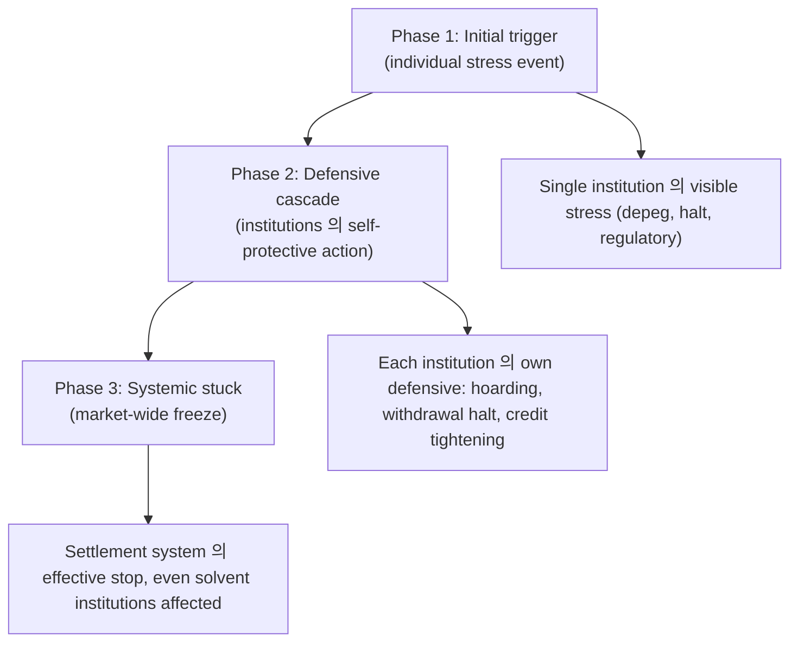
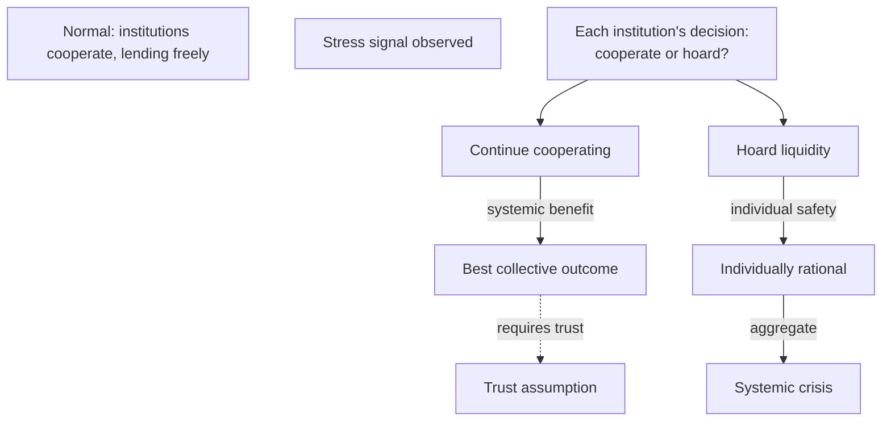
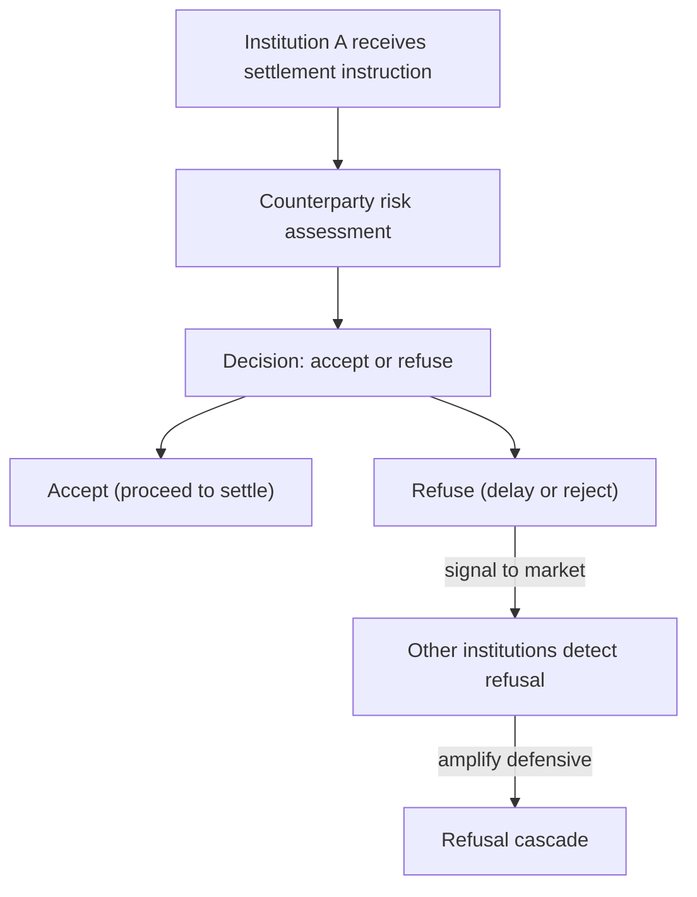
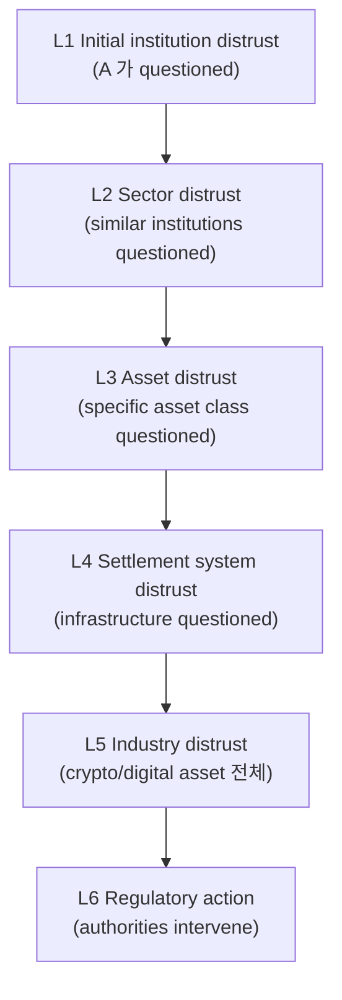
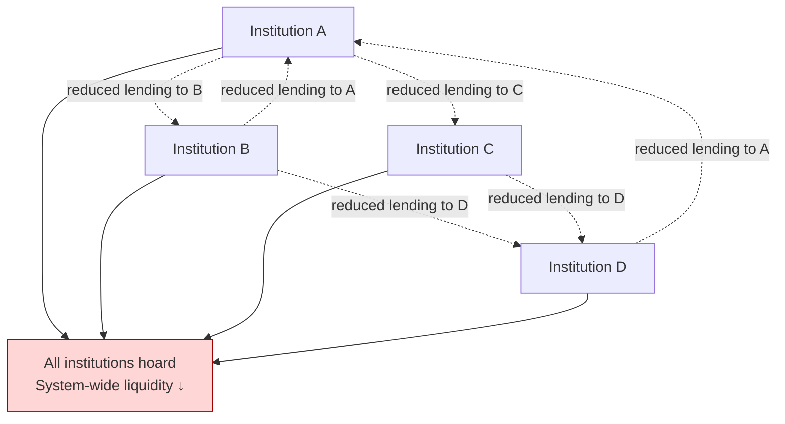
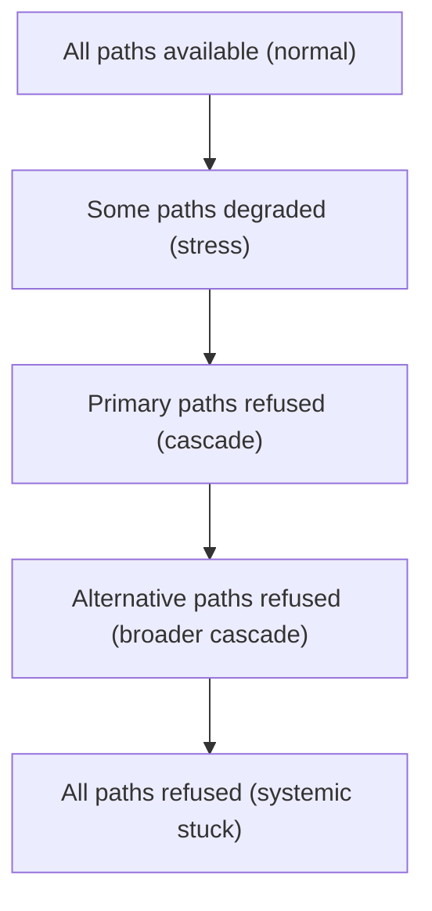
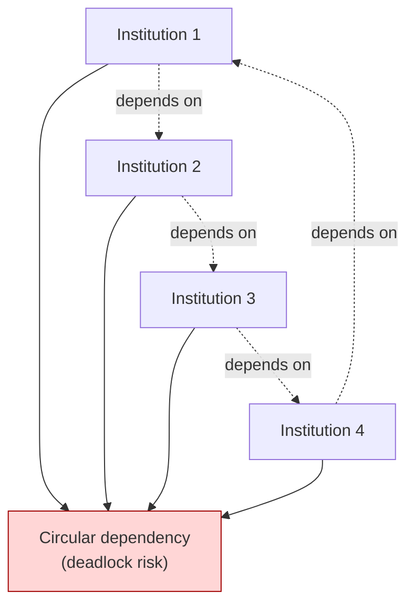
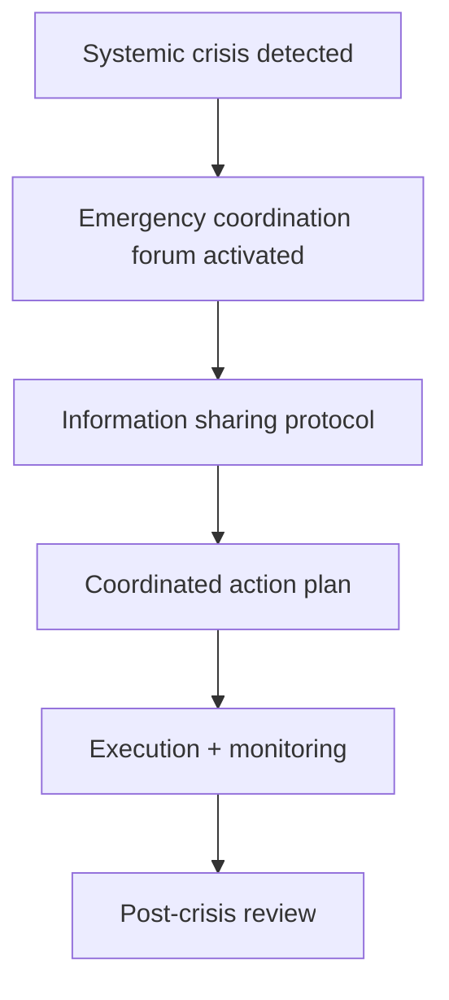

# Custody Wallet — Systemic Liquidity Freeze Reasoning

> **본 문서의 위치 (Crisis Cluster D25)**: D20 cross-institution liquidity + D21 trust + D22 settlement + D23 jurisdictional 의 **systemic-level liquidity crisis specialization**. Federation-wide stress 의 specific failure mode. Liquidity = stored money 가 아닌 coordination 의 emergent property.

> **본 문서가 답하는 핵심 질문**: 왜 systemic liquidity crisis 가 asset shortage 가 아닌가? 왜 asset ownership 이 settlement liquidity 와 다른가? 왜 treasury visibility 가 treasury usability 가 아닌가? 왜 coordinated freeze 가 institutional insolvency 가 아닌가? 왜 liquidity support 가 confidence restoration 가 아닌가?

---

## 0. 핵심 명제 (10초 이해)

1. **Systemic liquidity crisis = institutions 의 coordinated settlement continuity 의 confidence loss** (core thesis).
2. **Liquidity freeze = coordination failure masquerading as balance shortage** (secondary thesis).
3. **5-tier "≠" 명제 (D25 cluster invariant)**:
   - Asset ownership ≠ Settlement liquidity
   - Treasury visibility ≠ Treasury usability
   - Coordinated freeze ≠ Institutional insolvency
   - Liquidity support ≠ Confidence restoration
   - Emergency routing ≠ Settlement continuity
4. **Freeze propagation 의 3-phase** — Initial trigger / Defensive cascade / Systemic stuck.
5. **Tragedy of the commons amplification** — D20 §7.5 의 systemic scale.
6. **Liquidity hoarding = rational individual + irrational collective**.
7. **Refusal cascade** — Institution A 의 refusal → Institution B 의 refusal → systemic.
8. **Trust collapse 의 reflexive amplification** — D21 의 single-institution → D25 의 cross-institution.
9. **Emergency intervention 의 effectiveness gap** — Liquidity injection ≠ confidence injection.
10. **Customer burden ~100%** — Systemic crisis 는 vendor 의 흡수 불가능 영역.

---

## 1. Systemic Liquidity Freeze Anatomy

### 1.1 Freeze 의 3-phase progression

### 1.2 Triggering events (D21+D22+D23 inheritance)

| Trigger | Source |
|---|---|
| Major stablecoin depeg | D21 |
| Major chain halt | D22 |
| Major jurisdictional action | D23 |
| Major counterparty default | D20 §7 |
| Market shock | external |

### 1.3 Initial response asymmetry

(★ Hypothesis — financial industry pattern)

- 단일 institution 의 stress 시:
  - Other institutions 의 first response: monitor + cautious
  - Second response (if stress 지속): defensive
- → Asymmetric response 가 cascade 의 root.

### 1.4 "Asset ownership ≠ Settlement liquidity"

(§0 명제)

- Asset ownership: on-chain or off-chain 의 visible balance.
- Settlement liquidity: actual ability to settle obligations.
- 차이:
  - Asset visible but cannot be routed (D17 §2.3)
  - Asset routable but counterparty refuses
  - Asset confirmable but timing 의 mismatch
- → Liquidity = routable + accepted + timely 의 결합.

### 1.5 Freeze 의 self-fulfilling nature

- Each institution 의 expectation of freeze → defensive action → actual freeze emergence.
- "Belief in freeze" creates "actual freeze".
- → Reflexive dynamics.

---

## 2. Liquidity Hoarding Dynamics

### 2.1 Hoarding 의 game theory

### 2.2 "Coordinated freeze ≠ Institutional insolvency"

(§0 명제)

- Coordinated freeze: multiple institutions 의 defensive action.
- Institutional insolvency: individual institution 의 actual asset shortfall.
- 차이:
  - Freeze 는 protective (assets intact, just not deployed)
  - Insolvency 는 fundamental (assets actually insufficient)
- → Same outward appearance (customer cannot redeem), different cause.

### 2.3 Hoarding 의 stages

| Stage | Behavior |
|---|---|
| Cautious | Reduce lending limit |
| Defensive | Stop new lending |
| Aggressive | Recall outstanding lending |
| Crisis | Refuse all outbound |

### 2.4 Hoarding 의 ripple effect

- Institution A 가 hoard:
  - Institution B 의 incoming liquidity 감소
  - B 도 hoard (self-protection)
  - C 의 incoming liquidity 감소
  - Cascade
- → Network 의 propagation.

### 2.5 Counter-coordination (mutual support)

(D20 §4.4 의 crisis scale)

- Mutual support agreement 의 activation.
- Joint liquidity facility.
- 그러나 stress 가 충분히 강하면 mutual support 도 break.
- → Pre-arranged 와 의지 의 결합.

---

## 3. Settlement Refusal Cascade

### 3.1 Refusal mechanism

### 3.2 Refusal 의 trigger

| Trigger | 의미 |
|---|---|
| Counterparty 의 stress signal | "B 는 troubled — don't settle with B" |
| Asset-specific concern | "이 token 은 risky — don't accept" |
| Regulatory uncertainty | "Cannot determine legal status" |
| Operational inability | Banking system overload |
| Strategic | Competitive advantage 시도 |

### 3.3 "Emergency routing ≠ Settlement continuity"

(§0 명제)

- Emergency routing: alternative path 사용.
- Settlement continuity: actually completing settlement.
- 차이:
  - Routing 이 available 해도 destination 가 refuse 가능
  - Routing 의 alternative 가 다른 destination 도 refuse
- → Routing 은 mechanism, continuity 는 outcome.

### 3.4 Refusal cascade 의 visibility

- Public refusal (announcement) → market signal.
- Private refusal (delay) → 의도적 ambiguity.
- → Communication 의 game-theoretic dimension.

### 3.5 Anti-refusal mechanism

- Pre-agreed settlement rules (impossible to refuse if criteria met).
- Central counterparty (D20 §1.1) 의 mediation.
- Regulatory mandate (refuse 시 penalty).
- → System design 의 refusal-resistance.

---

## 4. Trust Collapse Propagation

### 4.1 Trust 의 cascading layers

### 4.2 Trust collapse 의 acceleration

- Information speed (social media, market signal).
- Algorithmic amplification (bots, automated trading).
- Cross-jurisdictional simultaneity.
- Memory of past crises (Lehman, FTX, etc.).
- → Each crisis cycle 의 historical layer 추가.

### 4.3 "Liquidity support ≠ Confidence restoration"

(§0 명제)

- Liquidity support: actual asset injection (central bank lending, peer support).
- Confidence restoration: market belief 회복.
- 차이:
  - Support 의 amount 가 sufficient 해도 confidence 회복 X 가능
  - "왜 support 필요한가" 의 implication = continued distrust
  - Confidence 은 market psychology 의 영역
- → Support 는 necessary but not sufficient.

### 4.4 Confidence restoration mechanism

(★ Hypothesis — financial industry pattern)

- Transparency (D15 의 PoR / continuous attestation)
- Decisive action (clear, credible commitment)
- Time (trust 회복 의 natural decay of fear)
- Multiple confirming signal (independent attestation)
- Regulatory blessing (formal approval)

### 4.5 Trust hysteresis

- Trust 회복 의 asymmetry:
  - 손실 시간: hours-days
  - 회복 시간: months-years
- 이전 trust level 의 영구 loss 가능.
- → Historical record 의 long-term value.

---

## 5. Treasury Hoarding Graph

### 5.1 Network-level hoarding

### 5.2 "Treasury visibility ≠ Treasury usability"

(§0 명제)

- Treasury visibility: balance dashboards 의 large number.
- Treasury usability: actual deployment in stress.
- 차이:
  - 동안의 large balance 가 stress 시 use 의 reluctance
  - Hoarding 의 institutional decision
  - → Treasury 의 "frozen by choice".

### 5.3 Counterparty exposure limit

- Each institution 의 counterparty exposure limit.
- Stress 시 limit 감소 (defensive).
- Even with capacity, exposure-limited.
- → Capacity ≠ deployment.

### 5.4 Internal liquidity vs external

- Internal: own customers 에 service 제공.
- External: peer institutions 에 lending.
- Stress 시 external 먼저 freeze, internal 일부 유지.
- → 부분적 hoarding.

### 5.5 Tragedy of the commons systemic scale

(D20 §7.5 의 system scale)

- Individual hoarding 의 collective irrationality.
- Without coordination mechanism, equilibrium 가 sub-optimal.
- Cooperation mechanism (mutual support, central authority) 의 critical.

---

## 6. Routing Collapse

### 6.1 Routing collapse 의 stages

### 6.2 Multi-route redundancy 의 limitation

(D20 §3 의 stress)

- Primary route 의 failure 시 fallback.
- 그러나 systemic stress 시 fallback 도 refuse.
- → Redundancy ≠ guaranteed availability under correlated stress.

### 6.3 Routing 의 last-resort

- 모든 normal route 가 refuse 시:
  - Central bank (if relationship exists)
  - State-mandated routing (regulator order)
  - Emergency protocols
  - Asset liquidation
- → Last-resort 의 own limit (e.g. emergency lender 의 willingness).

### 6.4 Routing memory + future trust

- Crisis 시 의 routing decision = long-term reputation:
  - Institution 가 partner 의 stress 시 어떻게 행동 했는가?
  - Refuse 시 future business 의 cost
- → Game-theoretic long-term consideration.

### 6.5 Customer-facing routing impact

- End user 의 view: "I cannot move my asset".
- Whatever routing 의 internal complexity, user 의 experience 는 stuck.
- → UX = simple stop, regardless of cause.

---

## 7. Settlement Dependency Network

### 7.1 Hidden dependency graph

### 7.2 Dependency 의 visibility

- 평소: dependency 가 의식 안 됨.
- Crisis: dependency 가 갑작스럽게 visible.
- → "Hidden coupling" 의 stress-time exposure.

### 7.3 Circular dependency 의 deadlock

- A 가 settle to B 위해 C 의 incoming 기다림.
- C 가 settle to A 위해 B 의 incoming 기다림.
- B 가 settle to C 위해 A 의 incoming 기다림.
- → Deadlock — no one can move first.

### 7.4 Deadlock resolution

| Mechanism | 의미 |
|---|---|
| External liquidity injection | 새 fund 가 cycle 진입 |
| Bilateral negotiation | Two parties 의 conditional settlement |
| Multi-party coordination | Joint forum 의 deadlock resolution |
| Central authority order | Regulator 의 mandated movement |

### 7.5 Network topology 의 systemic risk

- Densely connected network: deadlock 위험 ↑
- Sparsely connected: lower deadlock 위험, but bilateral 의 limited efficiency
- → Network design 의 trade-off.

---

## 8. Emergency Coordination

### 8.1 Emergency response mechanism

### 8.2 Coordination 의 challenge

- 각 institution 의 own interests 와 collective interest 의 tension.
- Information asymmetry (각자 own internal state).
- Speed (crisis 의 dynamics 가 빠름).
- Trust (peer institutions 의 cooperation 의 willingness).

### 8.3 Central bank 의 role

(★ Hypothesis — financial industry pattern)

- Lender of last resort.
- Coordination platform.
- Regulatory mandate authority.
- → Central authority 의 systemic value.

### 8.4 Crypto-native equivalent

- Crypto 의 lender of last resort 부재.
- 가능한 emerging:
  - Industry-funded backstop
  - Multi-issuer mutual support
  - Sovereign sovereign sponsor (CBDC-related)
- → Architecture gap.

### 8.5 Communication discipline under crisis (D21 §6.3, D12 §3 의 systemic scale)

- Single-source truth (avoid conflicting messages).
- Coordinated timing (avoid contradictory disclosure).
- Factual + measured.
- → Crisis communication 의 critical art.

---

## 9. Operational Fragility Map

```mermaid
graph TB
    F1["F1. Synchronized withdrawal halt<br/>(systemic redemption stop)"]
    F2["F2. Settlement refusal cascade<br/>(refuse chain)"]
    F3["F3. Treasury deadlock<br/>(circular dependency)"]
    F4["F4. Liquidity hoarding spiral<br/>(defensive cascade)"]
    F5["F5. Inter-org trust collapse<br/>(federation breakdown)"]
    F6["F6. Emergency coordination overload<br/>(decision-making overwhelm)"]
    F7["F7. Customer-facing UX collapse<br/>(mass perception of stuck)"]
    F8["F8. Information overload<br/>(false signal amid noise)"]
    F9["F9. Crisis fatigue<br/>(decision quality decay over time)"]
    F10["F10. Post-crisis institutional damage<br/>(reputation, relationships, capital)"]

    F1 -->|mitigation| M1["Mass redemption capacity + transparency + customer reassurance"]
    F2 -->|mitigation| M2["Anti-refusal architecture + arbitration + CCP"]
    F3 -->|mitigation| M3["External liquidity injection + multi-party mediation"]
    F4 -->|mitigation| M4["Mutual support agreement + central bank backstop"]
    F5 -->|mitigation| M5["Pre-existing relationships + transparent crisis communication"]
    F6 -->|mitigation| M6["Pre-positioned playbook + delegated decisions + scribe"]
    F7 -->|mitigation| M7["Surge customer support + factual communication + alternative channels"]
    F8 -->|mitigation| M8["Information triage + trusted source + verification protocol"]
    F9 -->|mitigation| M9["Crisis shift rotation + decision standards + post-crisis review"]
    F10 -->|mitigation| M10["Capital preservation + relationship reinvestment + transparent recovery"]
```

### 9.1 분류

| 분류 | items | 성격 |
|---|---|---|
| **Coordination** | F1, F2, F3, F4 | systemic |
| **Trust** | F5 | institutional |
| **Operational** | F6, F7, F9 | crisis management |
| **Information** | F8 | quality of decision |
| **Aftermath** | F10 | long-term |

---

## 10. Limitations

### 10.1 Asset ownership ≠ Settlement liquidity

§1.4.

### 10.2 Visibility ≠ Usability

§5.2.

### 10.3 Coordinated freeze ≠ Insolvency

§2.2.

### 10.4 Liquidity support ≠ Confidence

§4.3.

### 10.5 Emergency routing ≠ Continuity

§3.3.

### 10.6 Crisis prediction 의 한계

- Tail-risk event 의 modeling 어려움.
- Past 의 different from future.

### 10.7 Coordination mechanism 의 fragility

- Voluntary cooperation 의 stress 시 break 가능.
- No universal authority 의 absence.

---

## 11. 3-way Systemic Crisis Burden

### 11.1 Plane × Ownership

| 영역 | SaaS | Hosted MPC | Direct-build |
|---|---|---|---|
| Single-institution survival | Vendor + customer | Customer + vendor | Customer |
| Inter-institution coordination | Customer | Customer | Customer |
| Regulator engagement | Customer | Customer | Customer |
| Customer protection | Customer | Customer | Customer |
| Crisis communication | Customer | Customer | Customer |

### 11.2 Customer crisis burden (★ Hypothesis)

- SaaS: ~100%
- Hosted: ~100%
- Direct-build: ~100%

→ Systemic crisis 는 model 무관 customer 책임 — vendor 의 own institutional scale 의 매개.

### 11.3 Recommendation

| Context | 권장 |
|---|---|
| Small institution | Survive through transparency + peer relationships |
| Medium institution | Active participation in industry coordination |
| Large institution | Federation leadership + central bank relationship |
| Systemic institution | Backstop arrangement + regulator confidence |

---

## 12. Q1-Q10 Reasoning

### Q1. Systemic crisis ≠ Asset shortage

§0.1. Coordination failure masquerading.

### Q2. Asset ownership ≠ Settlement liquidity

§1.4.

### Q3. Treasury visibility ≠ Usability

§5.2.

### Q4. Coordinated freeze ≠ Insolvency

§2.2.

### Q5. Liquidity support ≠ Confidence

§4.3.

### Q6. Hoarding game theory

§2.1.

### Q7. Refusal cascade

§3.

### Q8. Circular dependency deadlock

§7.3.

### Q9. Central bank role

§8.3.

### Q10. Crypto-native gap

§8.4.

---

## 13. Open Questions / Org Policy

| 영역 | 질문 |
|---|---|
| Crisis playbook | activation trigger? |
| Peer relationship pre-positioning | which institutions? |
| Mutual support agreement | scope? activation? |
| Central bank relationship | exist? cultivation? |
| Backstop arrangement | with whom? |
| Customer-facing communication template | per crisis type? |
| Crisis decision authority | who can decide what? |
| Stress test scenarios | systemic crisis scenarios? |
| Insurance coverage | scope? |
| Crisis-time governance | normal vs emergency? |
| Surge support capacity | scaling? |
| Forensic preservation | priority? |
| Customer compensation policy | scope? |
| Post-crisis recovery plan | predefined? |
| Industry forum participation | which? |
| Crisis information sharing | with whom? |
| Strategic reserve | allocation? |
| Capital preservation policy | sequence? |
| Asset liquidation policy | sequence? |
| Wind-down plan | exists? |

---

## 14. References + Uncertainty Boundary + Bridge

### 관련 wiki

| 참조 |
|---|
| [[docs/architecture/cross-institution-liquidity-coordination]] §4, §5, §7 (D20 systemic dynamics) |
| [[docs/architecture/treasury-optimization-capital-efficiency]] §6 (stress routing) |
| [[docs/architecture/stablecoin-depeg-crisis-handling]] §9 (mass redemption) |
| [[docs/architecture/consensus-failure-chain-halt]] §3 (settlement truth fragmentation) |
| [[docs/architecture/jurisdiction-split-regulatory-attack]] §8 (sovereignty partition) |
| [[docs/architecture/operational-maturity-incident-command]] §3, §4 (crisis governance) |

### Uncertainty Boundary

- 3-phase freeze / 4-stage hoarding / 5 trust layer / routing 5 stage / 10 fragility / 100% burden = **generalized systemic liquidity crisis architecture pattern (Hypothesis ★)**.
- §4.5 trust hysteresis / §2.5 tragedy systemic = behavioral finance.
- §11.2 burden 백분율 = estimate.
- §13 에 org policy 영역 명시.

### D26 Bridge Invariants (D21 + D22 + D23 + D25 → D26)

1. **Irreducible failure taxonomy** — D21 trust + D22 settlement + D23 governance + D25 liquidity = generalized failure modes → D26.
2. **Survivability boundary** — 모든 failure type 의 cumulative limit → D26.
3. **Coordination collapse patterns** — 4 cluster docs 의 common patterns → D26 abstraction.
4. **Hidden coupling exposure** — Crisis 시점에 visible 되는 dependency → D26.
5. **Residual institutional capability** — 모든 failure 후 의 남는 것 → D26 의 핵심.

### Cluster D21→D22→D23→D25→D26 progression

- D21: trust collapse
- D22: settlement truth fragmentation
- D23: governance fragmentation
- D25 (this): systemic liquidity freeze
- D26 (next, closing): generalized failure taxonomy

---

**Stage 32 D25 completion timestamp**: 2026-05-20.
