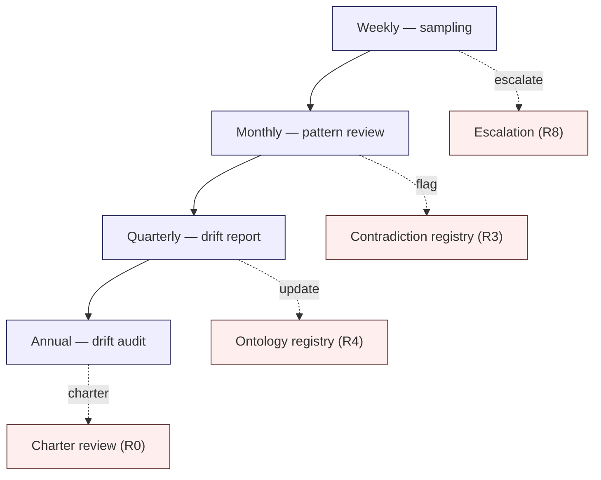
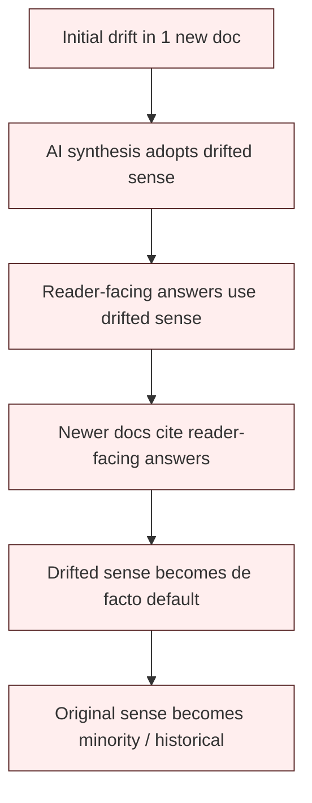

# T1 — Corpus Drift Detection

> Generalized — institutional WaaS architecture corpus, stewardship practice for drift detection.
> All generalized reasoning is ★ Hypothesis.
> No "perfect detection" claim. No "automated stewardship" claim. No drift normalization.

---

## 0. Why drift detection is a stewardship practice

R4 (Ontology Stability) and R6 (Knowledge Decay) **specify** the disciplines that prevent drift. T1 specifies how a steward **actually detects drift in practice**, week to week, across multiple years.

The distinction matters because drift is **slow, distributed, and invisible** by nature. A steward who waits for drift to become obvious has waited too long. By the time drift is obvious, it has already propagated through retrieval (R1), synthesis (R2), and reader interpretation. The repair cost is then disproportionate.

Drift detection is **the most operationally consequential** stewardship practice. Most other practices (T2-T4) respond to events; drift detection is what surfaces the events.

---

## 1. Core thesis

> Long-lived reasoning systems decay primarily through unnoticed conceptual drift, not explicit contradiction.
> Drift hides in vocabulary, abstraction, audience, and scope — not in stated invariants.
> A steward who watches only the invariants will see only the symptoms, not the disease.

---

## 2. ≠ propositions

- Terminology change ≠ concept change
- Consistency ≠ stability
- Expanded scope ≠ improved theory
- Rewording ≠ clarification
- Drift visibility ≠ drift prevention
- New doc count ≠ corpus health
- Steward agreement ≠ corpus coherence
- "Modernized" content ≠ better content
- Reader satisfaction ≠ corpus integrity
- Internal consistency ≠ external interpretability

---

## 3. Drift taxonomy (5 species)

★ Hypothesis — minimum viable taxonomy of drift species the steward must learn to recognize:

| # | Species | Signal | Where to look |
|---|---------|--------|---------------|
| **D1** | **Terminology mutation** | A term acquires new sense without R4 registry update | New docs; reader-facing summaries; AI outputs |
| **D2** | **Invariant erosion** | A stated invariant is cited with weakened scope in newer content | Cross-doc invariant references; C2 catalog vs in-doc usage |
| **D3** | **Abstraction drift** | A concept's level of abstraction shifts; readers no longer agree on what it concretely refers to | Frontier cluster; cross-cluster bridge invariants |
| **D4** | **Audience drift** | Doc tone / framing shifts toward different audience (e.g., from architect to executive) | New revisions; cluster lead changes |
| **D5** | **Scope creep** | A doc's stated scope quietly expands to cover adjacent territory | Doc headers; introductory paragraphs; new sections |

A single drift event is usually one species. A **compound drift** is two species interacting (e.g., D1 + D3 — terminology mutates and abstraction shifts together; readers can no longer reconstruct prior meaning).

---

## 4. The drift detection cycle



Each cadence has a **named output** and a **named escalation path**. Drift signals never accumulate silently — they either resolve into a registered artifact or escalate.

---

## 5. Weekly sampling

★ Hypothesis — weekly practice (≤ 1 hour for a steward):

- **Sample 3-5 recent AI outputs** for reader-facing questions. Read them as a fresh reader. Are the terms used consistently with their R4 registry sense? Are ★ markers preserved? Are citations honest?
- **Read 1-2 reader reports** (R8 §11). Categorize each: factual / clarity / contradiction / silent rewrite suspicion / ontology drift / decay candidate / charter concern.
- **Spot-check 1 doc** that has been recently amended. Read the diff. Does the change introduce subtle scope expansion (D5)? Subtle terminology shift (D1)? Subtle audience drift (D4)?
- **Scan trace logs** (R9 §5) for escalation rate. Sudden drop is a signal — escalation may be being suppressed.

The weekly practice is **lightweight and continuous**. Its purpose is not to find drift conclusively; it is to **build pattern recognition** in the steward.

---

## 6. Monthly pattern review

★ Hypothesis — monthly practice (≤ 4 hours for a steward):

- **Aggregate weekly samples**. Are there recurring patterns? Three samples in a month showing the same term used in a non-registry sense is a signal.
- **Review contradiction registry** (R3). Are T4 (definitional) contradictions growing? T4 growth is the leading indicator of D1 / D3 drift.
- **Review reader-report categories**. Sudden spikes in "ontology drift" or "silent rewrite suspicion" categories warrant escalation.
- **Cross-cluster spot check**. Pick a bridge invariant (e.g., from C3 dependency graph). Read both sides. Has either side drifted?

The monthly practice **synthesizes** the weekly samples. Steward writes a brief monthly note (★ ≤ 500 words) summarizing observations. These notes accumulate as the institutional baseline.

---

## 7. Quarterly drift report

★ Hypothesis — quarterly practice (≤ 1 day for a steward council):

The quarterly drift report is a **named artifact**. Contents:

1. **Drift signal summary** — counts of each species (D1-D5) observed this quarter.
2. **Hotspots** — documents / clusters / terms exhibiting the most signal.
3. **Trend lines** — quarter-over-quarter direction. Are signals increasing? Stable? Declining?
4. **Resolved drift** — events that converted into R3 / R4 / R6 registry updates.
5. **Open drift** — signals that have not converted; what is blocking conversion?
6. **Escalation candidates** — drift events that should escalate to charter review.
7. **Reader-side signals** — patterns from reader reports.

The quarterly drift report is **read by all stewards**. It is the operational baseline for understanding the corpus's health.

★ Hypothesis: a quarterly drift report with **zero signals** is not "healthy corpus" — it is **inattentive stewardship**. Healthy stewardship produces signals; the signal count is a measure of stewardship engagement, not corpus failure.

---

## 8. Annual drift audit

★ Hypothesis — annual practice (≤ 1 week for steward council + cluster leads):

The annual drift audit is the **comprehensive review**:

1. **Cross-cluster invariant integrity check** — read C2 invariants; cross-reference to current cluster content. Have invariants drifted?
2. **Ontology full audit** — read R4 registry; cross-reference to recent doc usage. Are senses stable?
3. **Decay class re-assessment** — review all Class A / B docs; re-affirm or reclassify.
4. **Reading-path coherence** — walk C5 reading paths as a fresh reader. Do they still cohere? Have intermediate docs drifted to break the path?
5. **External reality check** — read 2-3 recent external publications in the field. Has the corpus's framing drifted away from the field, or has the field drifted away from the corpus?

The annual audit produces a **drift state declaration** — a formal statement of where the corpus is exposed to drift and what is being done.

---

## 9. Semantic erosion map

A steward keeps a **semantic erosion map** — a working artifact tracking concept stability over time.

★ Hypothesis structure (informal — stewards adapt):

```
For each Layer-1 / Layer-2 ontology term:
  - Year T sense baseline (canonical definition)
  - Year T+1 observed senses (in retrieval samples, in new docs)
  - Year T+2 observed senses
  - ...
  - Drift verdict: stable / mild / moderate / severe
  - Action: no change / annotate / sense version / charter review
```

The map is **not exhaustive** — it focuses on terms that have shown signal. A term with no signal in 5 years drops off the map.

★ Hypothesis: the semantic erosion map is a steward's **most valuable accumulated artifact**. After 5+ years, it captures patterns no individual review can surface — long-cycle drift that propagates over multiple stewardship rotations.

---

## 10. Invariant stability graph

R-series invariants (R0 §6 — 10 operational invariants) and C2 invariants are tracked for **stability over time**.

Stability signals:

- **Citation pattern** — is the invariant cited as load-bearing, or as decorative?
- **Scope drift** — are new docs citing the invariant in narrower or wider scopes than originally stated?
- **Contradiction pressure** — are T3 / T5 contradictions accumulating against the invariant?
- **Reader interpretation** — do reader-facing summaries restate the invariant accurately?

The invariant stability graph is **append-only**. An invariant that has been challenged and re-affirmed shows the history; an invariant that has been silently weakened reveals itself by the lack of explicit re-affirmation alongside obvious scope shifts.

---

## 11. Reinterpretation propagation flow

When a term drifts (D1), the drift **propagates** through the corpus:



★ Hypothesis: propagation is **fast** (sub-year) when AI assistance is in the loop, **slow** (multi-year) when stewardship operates without AI. Either way, propagation is **invisible** in real time; only retrospective sampling reveals it.

The steward's job is to **interrupt propagation early** — at stage A or B if possible, at stage C as fallback. By stage D, reversal cost has multiplied.

---

## 12. Conceptual continuity model

A steward maintains a working understanding of **conceptual continuity** for the corpus's core concepts:

- What did this concept mean **at corpus inception**?
- What does it mean **now**?
- What is the **trajectory** between those two states?
- Is the trajectory **steered** (governed evolution) or **drifted** (silent change)?

This is not a document — it is a **mental model** the steward maintains and writes down only when challenged or when handing off (T3).

★ Hypothesis: the steward who cannot describe the trajectory of a Layer-1 term over the past 5 years has either not been stewarding it or has been stewarding it badly. Trajectory awareness is the operational substance of drift detection.

---

## 13. Drift signal sources (practical)

Where stewards actually find drift:

| Source | Frequency | Quality |
|--------|-----------|---------|
| Reader reports | Continuous | High signal-to-noise for surface drift |
| AI output sampling | Weekly | High signal-to-noise for retrieval-driven drift |
| New-doc review | Per proposal | High signal-to-noise for D1 / D4 / D5 |
| Cross-doc reading | Monthly | Moderate signal-to-noise for D2 / D3 |
| Periodic linting (automated) | Daily | High noise; low confidence; advisory only |
| External literature comparison | Quarterly | Moderate signal-to-noise; detects field drift |
| Steward conversations (informal) | Continuous | High signal-to-noise but un-archivable |
| Handoff documents (T3) | Per rotation | High signal-to-noise; institutional memory |

★ Hypothesis: **steward conversations** are the highest-quality but least-archivable drift signal. The discipline is to convert informal observation into written artifact within a short window (★ same week) so signal does not evaporate.

---

## 14. Drift response taxonomy

When drift is detected, the steward responds with one of:

| Response | When |
|----------|------|
| **Observe** | Single isolated signal; pattern not yet established |
| **Annotate** | Signal recurs; sense disambiguation noted in registry |
| **Sense version** (R4) | Drift is a substantive sense extension; new sense version added |
| **Supersession** (R3 T2, R7) | Drift represents a worldview shift; current content superseded |
| **Charter review** | Drift affects Layer-1 ontology or charter invariants |
| **Drift-only audit** | Steward suspects drift but cannot articulate it yet; allocate audit time |

★ Hypothesis: **Observe** is the most common response (~70% of signals). Stewards over-responding to single signals create churn; stewards under-responding to recurring signals miss drift events.

---

## 15. Anti-patterns (drift-detection-specific)

- **Drift normalization.** Steward observes drift, judges it as "natural evolution," and stops tracking.
- **Tooling-only detection.** Steward relies solely on automated lint output; misses D3 / D4 drift entirely.
- **Sample-and-forget.** Steward samples AI outputs but does not record observations; pattern recognition does not accumulate.
- **Conclusion-first review.** Steward enters a review with a predetermined verdict; signals against the verdict are filtered out.
- **Drift-as-author.** Steward writes new content that itself constitutes drift; reviewer cannot detect because steward is reviewer.
- **Hotspot blindness.** Steward focuses on stable areas and avoids contentious ones; drift accumulates in unwatched territory.
- **Single-cadence reliance.** Steward executes only weekly OR only annual reviews; loses mid-cadence pattern recognition.
- **No semantic erosion map.** Steward attempts to remember drift patterns instead of writing them down; rotation destroys the map.
- **External-reality avoidance.** Steward never compares corpus to external field; field drift goes undetected.
- **Reader-report dismissal.** "Readers don't understand" framing used to dismiss reader-reported drift signals.

---

## 16. Drift detection failure modes

★ Hypothesis — specific to detection practice (separate from R10 corpus-level):

- **F1** — Steward did not perform weekly sampling; no early signals captured.
- **F2** — Steward performed sampling but did not record; pattern lost.
- **F3** — Steward recorded but did not synthesize monthly; trend missed.
- **F4** — Steward synthesized but did not escalate; conversion to action blocked.
- **F5** — Steward escalated but escalation absorbed without registry update; signal lost in process.
- **F6** — Quarterly drift report generated but not read by other stewards; institutional awareness fails.

Each failure mode has a remediation: better sampling discipline (F1), template-driven recording (F2), monthly forced synthesis (F3), explicit escalation paths in T0 (F4), R5 process review (F5), required reading and discussion (F6).

---

## 17. Stewardship summary (mandatory per runner)

### Stewardship reasoning
T1 frames drift detection as a **multi-cadence sampling practice** producing a semantic erosion map, invariant stability graph, and quarterly drift report. The practice does not eliminate drift — it makes drift visible at the earliest possible stage.

### Failure / survivability implication
Without drift detection, all other R-series disciplines degrade silently. Drift is the **propagation medium** through which other failure modes (R10 FM1 ontology collapse, FM5 embedding-only retrieval, FM11 hype injection) spread.

### Corpus continuity implication
Drift detection is the **continuity guarantee** that the corpus's terms, invariants, and abstractions remain interpretable across stewardship rotations. Without it, each generation of stewards inherits a corpus they cannot fully reconstruct.

### Institutional memory implication
The semantic erosion map and invariant stability graph **are** institutional memory of conceptual evolution. They survive stewardship rotation if written; they vanish with rotation if held only in steward judgment.

### Drift / entropy implication
Drift is the **default trajectory** of a corpus left alone. T1 is the discipline that injects negentropy — periodic structured attention that resists default entropy.

### Revision governance proposal
Drift signals route through:
- **Annotate** → R4 ontology registry update.
- **Sense version** → R5 C7 (ontology change).
- **Supersession** → R5 C4 (supersession).
- **Charter review** → R5 C8.
Steward council reviews quarterly drift report and decides allocation.

---

## 18. Relationship to other docs

- **R1** — retrieval samples are a primary drift signal source.
- **R3** — T4 contradictions are drift indicators.
- **R4** — ontology registry is the canonical reference against which drift is measured.
- **R5** — drift responses flow through R5 governance.
- **R6** — decay class re-assessment uses drift signals.
- **R7** — supersession requires snapshot of pre-drift state.
- **R8** — drift detection produces escalation candidates.
- **R9** — AI-output sampling is a primary weekly artifact.
- **R10** — multiple R10 failure modes are detected via T1 practice.
- **T2** — drift events sometimes produce contradiction registry entries.
- **T3** — semantic erosion map is a key handoff artifact.
- **T4** — drift response routes through controlled evolution.
- **T5** — drift normalization is a stewardship failure mode.

---

## 19. Closing invariant

> Drift is what happens when a corpus is left alone.
> Detection is what happens when a steward is awake.
> The discipline is to be awake, not asleep — and to have the artifacts to prove it.

★ Hypothesis: the steward who can produce a five-year semantic erosion map is the steward whose corpus survives. The steward who insists "the corpus has not drifted" is the steward whose corpus already has.
