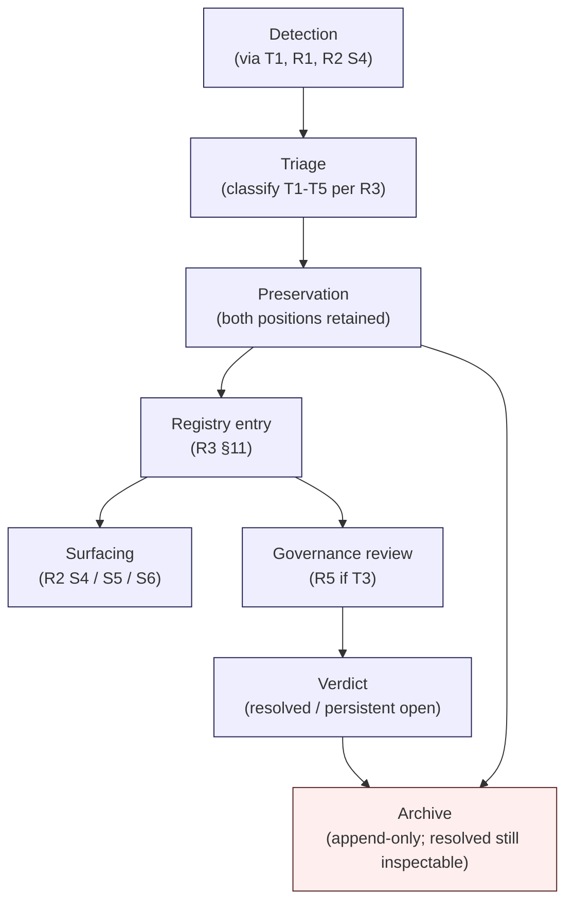

# T2 — Contradiction Governance

> Generalized — institutional WaaS architecture corpus, stewardship practice for contradiction handling.
> All generalized reasoning is ★ Hypothesis.
> No contradiction elimination claim. No false reconciliation. No tension suppression.

---

## 0. Why contradiction governance is a stewardship practice

R3 (Contradiction Management Discipline) **specifies** the rules — five contradiction types (T1-T5), classification process, preservation policy, registry structure. T2 specifies how a steward **actually governs contradictions in practice** — the conversations, the triage decisions, the artifacts produced when tensions surface.

The R3 / T2 distinction matters because contradiction handling is **the most judgment-heavy** stewardship activity. Rules cannot determine whether a given contradiction is apparent (T1), evolved (T2), real (T3), definitional (T4), or inter-cluster (T5) — only patient reading, conversation, and craft can.

T2 is the practice manual for that craft.

---

## 1. Core thesis

> Institutional reasoning systems survive contradictions by governing them explicitly, not by eliminating them.
> Reconciliation is not the goal. Visible coexistence is the goal.
> A steward who removes contradictions removes the corpus's capacity to engage with reality.

---

## 2. ≠ propositions

- Contradiction ≠ failure
- Ambiguity ≠ weakness
- Multiple interpretations ≠ incoherence
- Tension ≠ invalidity
- Reconciliation ≠ elimination
- Open contradiction ≠ stewardship failure
- Surfaced disagreement ≠ corpus instability
- Resolution ≠ closure
- Steward consensus ≠ contradiction resolution
- Smooth synthesis ≠ honest synthesis

---

## 3. The contradiction governance lifecycle

Every contradiction passes through this lifecycle. The exit state is **archived** (resolved or persistent-open) — never **deleted**.

---

## 4. Triage practice — distinguishing T1 from T2 from T3 from T4 from T5

R3 defines the types. T2 specifies how a steward **practically distinguishes** them.

The triage questions (★ Hypothesis — applied in order):

1. **Do the two positions refer to the same object in the same scope?**
   - **No** → likely **T1 (apparent)**.
   - **Yes** → continue.

2. **Were the two positions written at distinctly different times with different worldview context?**
   - **Yes** → likely **T2 (evolved)**.
   - **No** → continue.

3. **Do the positions use the same term in different senses?**
   - **Yes** → likely **T4 (definitional)** → route to R4 ontology.
   - **No** → continue.

4. **Do the positions come from clusters with different optimization goals?**
   - **Yes** → likely **T5 (inter-cluster)** → preserve as trade-off.
   - **No** → continue.

5. **Do the positions genuinely disagree on the same question under the same scope, with no terminology drift?**
   - **Yes** → **T3 (real)** → register; escalate via R5 governance.

This is a triage **algorithm**, not a verdict. The steward applies it and produces a **candidate classification**, which is then reviewed.

★ Hypothesis: ≥ 60% of detected contradictions are T1 or T4 (terminology / scope drift dressed as disagreement). ~20% are T2 (evolved). ~15% are T5 (inter-cluster trade-offs). ≤ 5% are T3 (real disagreement). T3 is the rarest and most consequential class.

---

## 5. The contradiction conversation

Before a contradiction is classified, stewards have a **conversation** about it. T2 codifies the conversation pattern:

1. **Read both positions in full context.** Not just the chunks; the surrounding sections.
2. **Identify the apparent disagreement** in one sentence.
3. **Steelman both positions.** Each steward in the conversation must articulate the strongest version of each position — including the position they personally find less plausible.
4. **Apply the triage questions** (§4).
5. **Propose a classification.**
6. **Identify the artifact** that captures the contradiction (registry entry, ontology note, cluster trade-off invariant, charter review).

Steward conversations are **archived** when load-bearing (★ Hypothesis: T3 conversations always archived; T1 / T4 conversations archived as registry annotations only).

★ Hypothesis: the conversation pattern is the **single most important T2 artifact**. Stewards who skip the steelman step systematically misclassify contradictions toward the "easy" types.

---

## 6. Unresolved tension as a feature

R3 §12 establishes that open T3 contradictions are healthy. T2 specifies **how stewards practice** living with unresolved tension.

Practice patterns:

- **Open contradiction registry is read quarterly.** Stewards do not pretend forgotten T3s are not there.
- **Open contradictions are surfaced in synthesis** (R2 §13). Stewards verify this happens in retrieval samples.
- **Open contradictions have steward owners.** Someone is responsible for periodically asking "has anything changed that lets us close this?"
- **Open contradictions accumulate context over time.** New evidence, new perspectives, related events are annotated against the registry entry.
- **Open contradictions are explicitly part of C6** (open questions / frontier boundary). Stewards verify the linkage.

★ Hypothesis: a corpus with 20+ open T3 contradictions and active steward ownership is **more honest** than a corpus with 0 open contradictions and silent resolution patterns. The steward's posture toward open contradictions reveals the stewardship's posture toward reality.

---

## 7. Multi-perspective coexistence

T5 (inter-cluster) contradictions are governed by **explicit coexistence**. Stewards practice coexistence by:

- **Naming both clusters' optimization goals.** A trade-off between Liquidity and Crisis clusters is named as such, not as a "winning" cluster.
- **Documenting the conditions under which each position dominates.** "Position A applies when X; position B applies when Y."
- **Adding C2 trade-off invariants** that make the coexistence load-bearing for synthesis (R2 S5).
- **Refusing the temptation to "harmonize."** A unified position that satisfies neither cluster's invariants is not a resolution — it is a fabrication.

★ Hypothesis: harmonization pressure is **the most common T5 failure mode**. New stewards arrive and find inter-cluster trade-offs uncomfortable; they propose unified positions. Veteran stewards push back.

---

## 8. Operational ambiguity

Some contradictions express **operational ambiguity** — neither side is wrong, but the corpus has not yet specified the conditions for choosing. T2 practice for operational ambiguity:

- **Mark explicitly as operational ambiguity.** Not T3 (no real disagreement) and not T5 (not cluster-specific).
- **Document the missing condition specification.** "The corpus does not yet specify when X vs Y applies."
- **Route to C6** (open questions).
- **Optionally** schedule a discussion to specify conditions; not all operational ambiguities deserve specification.

★ Hypothesis: forcing specification of operational ambiguities **before they are operationally pressing** produces brittle conditions. The discipline is to let pressure surface the conditions, not to anticipate them.

---

## 9. Conflicting invariants

When two C2 invariants are observed to conflict:

- **Triage urgency.** Invariant conflict is **always high priority**. C2 is the spine of the corpus.
- **Classify the conflict.** Is it T1 (apparent), T2 (evolved), T3 (real), T4 (definitional), T5 (inter-cluster)?
- **Convene cluster leads.** Conflicting invariants typically span clusters.
- **Avoid temporary fixes.** Re-wording one invariant to remove surface conflict without resolving the underlying disagreement is a T1 failure (silent rewrite).
- **Escalate to charter review** (R5 C8) if Layer-1 invariants are involved.

★ Hypothesis: invariant conflict is **rare** in a well-stewarded corpus (< 1-2 events per year). When it occurs, it is consequential — and is one of the events stewards remember years later.

---

## 10. Context-dependent truth

Some claims in the corpus are **context-dependent** — true under conditions X, false under conditions Y. T2 practice:

- **Annotate the context** explicitly in the doc.
- **Avoid pseudo-resolution** ("X is generally true") that hides the context.
- **Make context-dependence first-class** in retrieval output (R2 S5 / S6).
- **Document the boundaries** of the context, not just the context itself.

★ Hypothesis: context-dependent claims that read as universal are the **most insidious** form of latent contradiction. Stewards trained to look for explicit disagreement miss them.

---

## 11. Contradiction escalation

T3 contradictions and Layer-1 invariant conflicts **escalate**. T2 specifies the escalation practice:

1. **Steward owner produces a written brief** — both positions, classification rationale, proposed handling.
2. **Steward council reviews within cooling-off period** (R5).
3. **Charter council reviews** if the contradiction is Layer-1 / charter-adjacent.
4. **Verdict is published** with rationale.
5. **All affected docs are annotated** with the verdict reference.
6. **Both positions remain in the corpus** regardless of verdict.

★ Hypothesis: escalation **without published rationale** is silent resolution. Even if the steward council reaches consensus quickly, the rationale must be written. Future stewards cannot re-engage with a contradiction whose resolution they cannot read.

---

## 12. Conceptual reconciliation (when it actually happens)

R3 emphasizes that resolution is not always achievable. T2 specifies what **honest reconciliation** looks like when it does occur:

- **New evidence has emerged** that disambiguates the positions.
- **The disagreement was definitional** (T4) and ontology refinement clarifies.
- **The context-dependence has been specified** and both positions are now seen as conditional rather than absolute.
- **Both positions reduce to a deeper invariant** that subsumes them.

Honest reconciliation produces:

- A registry entry with `status: resolved` and a **published rationale**.
- A historical snapshot (R7) of both pre-resolution positions.
- An annotation in affected docs noting the resolution.
- A reversibility clause — if new evidence emerges, resolution can be reopened.

★ Hypothesis: ≤ 30% of registered T3 contradictions ever achieve honest reconciliation. The remainder are either persistent open or quietly migrate to T2 (evolved) status. This is **normal and healthy**.

---

## 13. Contradiction handling artifacts

Stewards produce artifacts during contradiction governance:

| Artifact | When | Audience |
|----------|------|----------|
| Registry entry | Every classified contradiction | Stewards + R1 retrieval |
| Conversation log | T3 / Layer-1 contradictions | Stewards + audit |
| Steelman pair | T3 conversations | Stewards |
| Trade-off invariant | T5 contradictions | C2 catalog |
| Sense version note | T4 contradictions | R4 registry |
| Supersession header | T2 contradictions | R7 historical |
| Escalation brief | T3 / Layer-1 escalations | Steward council |
| Verdict statement | Resolved contradictions | All readers |

These artifacts are **searchable and inspectable**. A steward should be able to ask, six months later, "what was the conversation around contradiction X?" and find the answer.

---

## 14. Anti-patterns (contradiction-governance-specific)

- **Smoothing.** Steward edits docs to remove contradictions instead of registering them.
- **Premature reconciliation.** T3 closed without published rationale because "we agreed in the meeting."
- **Steelman skipping.** Steward classifies a contradiction without articulating both positions strongly.
- **Registry decay.** Registry grows but is not read; entries become stale.
- **Silent owner reassignment.** Steward owner of an open contradiction rotates without handoff; ownership becomes ambiguous.
- **Harmonization pressure.** New steward proposes unified positions for T5 trade-offs; veteran stewards do not push back.
- **Verdict invisibility.** Resolutions published but not propagated to affected docs.
- **Contradiction creation by review.** Reviewers introduce contradictions in their feedback that are not registered.
- **Reader-report dismissal.** Reader-reported contradiction signal dismissed as "user confusion."
- **AI-driven classification.** AI proposes T1 (the easiest class) for ambiguous contradictions; steward accepts without review.
- **Conversation evaporation.** Steward conversations about contradictions happen verbally and are not archived.
- **Open contradiction shame.** Steward avoids registering contradictions because "we should know the answer."

---

## 15. Contradiction governance failure modes (steward-internal)

★ Hypothesis — specific to T2 practice:

- **F1** — Steward classifies all contradictions as T1 (easiest); T3 rate artificially zero.
- **F2** — Steward classifies all contradictions as T3 (most dramatic); escalation system overloaded.
- **F3** — Steward owner of T3 contradiction departs; no reassignment; contradiction orphaned.
- **F4** — Steward writes registry entries but does not surface them in retrieval; registry exists but is invisible.
- **F5** — Steward "resolves" contradictions by editing one side; silent rewrite.
- **F6** — Steward council reaches consensus quickly; rationale not published; resolution unverifiable.

Each failure mode has remediation: triage discipline review (F1, F2), explicit ownership rotation (F3), retrieval audit (F4), R7 snapshot check (F5), mandatory written rationale (F6).

---

## 16. Stewardship summary (mandatory per runner)

### Stewardship reasoning
T2 frames contradiction handling as **explicit governance of unresolved tension**, not as elimination. The practice produces named artifacts (registry entries, conversation logs, escalation briefs) that survive stewardship rotation. The steward's posture is: every detected tension is **registered, surfaced, owned, and either persistently open or resolved with published rationale** — never silenced.

### Failure / survivability implication
Silent contradiction resolution is the corpus's **fastest internal degradation path**. A steward who smooths instead of registers destroys the corpus's capacity to surface real disagreement. T2 prevents this by making registration the **default** and resolution the **exception**.

### Corpus continuity implication
The contradiction registry is **institutional memory of disagreement**. It captures what the corpus has argued about, with whom, when, and how. Without it, future stewards inherit only the apparent consensus.

### Institutional memory implication
Steward conversation logs (T3) and steelman pairs are **non-redundant** memory — they cannot be reconstructed from the corpus text alone. They are the most fragile institutional memory and require explicit archival discipline.

### Drift / entropy implication
Smoothing is the default entropy direction for contradictions. T2 injects negentropy by making explicit governance the **slower, more visible, more disciplined** alternative — and by making smoothing **observably absent**.

### Revision governance proposal
- T1 / T4 contradictions → R4 ontology updates (R5 C2-C7).
- T2 contradictions → R7 supersession (R5 C4).
- T3 contradictions → R5 governance review; verdict published; reversibility preserved.
- T5 contradictions → C2 trade-off invariant addition; C3 dependency graph annotation.

---

## 17. Relationship to other docs

- **R1 §11** — contradiction smoothing listed as retrieval anti-pattern.
- **R2 S4** — contradiction surfacing stage uses R3 classifications enforced by T2.
- **R3** — T2 is the practice manual for R3 specifications.
- **R4** — T4 contradictions feed ontology updates.
- **R5** — escalation cycles governed by R5.
- **R7** — T2 contradictions produce supersession snapshots.
- **R8** — T3 escalation routes through R8 boundary signals.
- **R9** — AI-driven contradiction classification is constrained.
- **R10** — silent resolution catalogued as corpus failure mode.
- **T1** — drift detection often surfaces T4 contradictions.
- **T3** — contradiction conversation logs are key handoff artifacts.
- **T4** — controlled evolution routes through contradiction governance.
- **T5** — harmonization pressure is a stewardship failure mode.

---

## 18. Closing invariant

> A corpus that hides its contradictions is a corpus that has stopped engaging with reality.
> The discipline is to **surface, register, surface again, own, and either resolve with rationale or live with openly**.
> The steward who can name and explain the corpus's 20 most-significant open contradictions is the steward who is doing the work.

★ Hypothesis: contradiction governance is **the adult competence** of stewardship. Without it, the corpus drifts toward false coherence; with it, the corpus retains the property that makes it institutionally useful — honest engagement with disagreement.
