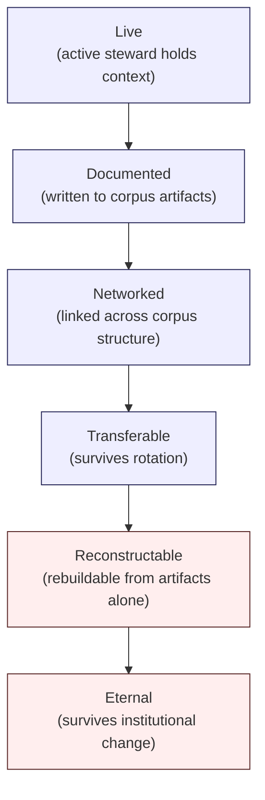

# T3 — Institutional Memory Survivability

> Generalized — institutional WaaS architecture corpus, stewardship practice for memory continuity.
> All generalized reasoning is ★ Hypothesis.
> No "permanent memory" claim. No "documentation = memory" conflation. No tooling-dependent continuity.

---

## 0. Why institutional memory needs a survivability practice

R5 (Evolution Governance) specifies rotation discipline. R7 (Historical Worldview Preservation) specifies snapshot discipline. Both address pieces of institutional memory.

T3 addresses the **whole**: how the corpus's reasoning remains **reconstructable** across multiple generations of stewards, multiple tooling generations, and multiple institutional reorganizations.

The distinction between **documentation** and **institutional memory** is load-bearing. Documentation is text on disk. Institutional memory is the ability of a future steward, six years removed from the original authors, to:

- Read a current invariant and understand **why it exists**.
- Read a registered contradiction and understand **what conversation produced its current status**.
- Encounter an unfamiliar ontology sense and trace **when it diverged and who decided**.
- Pick up an open-question entry and **resume the inquiry** rather than restarting it.

A corpus with 55 docs of text is **not** automatically a corpus with institutional memory. Memory requires that text + context + reasoning trace + worldview remain navigable across time.

---

## 1. Core thesis

> Institutional memory survives only when reasoning remains reconstructable after personnel, tooling, and organizational change.
> Documentation is necessary but insufficient. Continuity is a discipline, not a property of storage.
> The test is not "is it still on disk" — it is "can a new steward rebuild the reasoning."

---

## 2. ≠ propositions

- Documentation ≠ institutional memory
- Archive ≠ reconstructability
- Steward continuity ≠ knowledge continuity
- Stored knowledge ≠ recoverable reasoning
- Corpus persistence ≠ corpus survivability
- File backup ≠ memory backup
- Long-tenure steward ≠ memory holder
- Comprehensive handoff ≠ transferred memory
- Searchable text ≠ navigable knowledge
- Citation network ≠ reasoning network

---

## 3. Memory lifecycle stages



★ Hypothesis stages:

- **Live** — memory exists only in the active steward's head. Most institutional memory begins here.
- **Documented** — written to a corpus artifact. Survives the steward going on vacation but not rotation.
- **Networked** — linked across multiple artifacts (registry + audit trail + doc citation + R7 snapshot). Survives rotation.
- **Transferable** — a new steward can pick it up via handoff process (T0 §11) and operate it.
- **Reconstructable** — a new steward who arrives **without** handoff can rebuild understanding from artifacts alone.
- **Eternal** — survives institutional reorganization, tooling migration, multi-decade gap.

The discipline progresses memory **up the stages**. Memory that stays at Live or Documented for years is high-risk; memory at Reconstructable or Eternal is institutionally safe.

★ Hypothesis: ~30% of any active steward's load-bearing memory is Live or Documented but not Networked. The deliberate discipline of T3 is to move this 30% up the stages **before** rotation forces it.

---

## 4. Reasoning portability

Memory must be **portable** across stewards, tools, and institutional contexts.

Portability tests (★ Hypothesis):

1. **Steward test** — can a steward arriving six months from now reproduce the reasoning behind a recent decision?
2. **Tool test** — if the current retrieval / synthesis tooling is replaced, can the reasoning still be reconstructed from the underlying artifacts?
3. **Institution test** — if the corpus migrates to a different host institution (different repository, different team), does the reasoning survive the migration?
4. **Cold-read test** — can a fresh reader (not just a steward) understand why an invariant exists from text alone, without anyone explaining?

A reasoning chain that fails any test is **not portable**. The remediation is to enrich the chain until it passes all four.

---

## 5. The 6-class memory artifact taxonomy

Stewards distinguish six classes of institutional memory artifact:

| Class | Examples | Survives rotation? |
|-------|----------|--------------------|
| **M1 — Canonical content** | D / C / E / R / T docs | Yes (file persists) |
| **M2 — Audit trail** | R5 change records, R3 / R4 registry entries, R7 snapshots | Yes (if stored disciplinedly) |
| **M3 — Steward conversations** | T2 discussions, T1 informal observations | Only if archived |
| **M4 — Decision rationale** | Why a verdict was reached, including dissent | Only if written |
| **M5 — Worldview context** | R7 Layer-4 annotations | Only if maintained |
| **M6 — Steward judgment** | Tacit knowledge about which invariants are load-bearing | **Rarely survives** |

★ Hypothesis: M1 and M2 survive almost automatically. M3-M5 survive only with discipline. M6 almost never survives without explicit conversion to M4 / M5 through handoff and writing.

The most fragile institutional memory is M6 — the tacit judgments that distinguish a skilled steward from a competent one. T3 specifies the **explicit conversion practice** that moves M6 toward M4 / M5.

---

## 6. Tacit-to-explicit conversion practice

Tacit judgments must be **converted** into explicit artifacts. T3 practice:

- **Decision journals.** Each steward maintains a brief journal: when they made a non-trivial judgment call, what they considered, what they decided, what they were uncertain about. ★ Hypothesis: weekly entry frequency.
- **"Why this matters" annotations.** When stewards review a doc or invariant, they annotate **why it is load-bearing**. The annotation is appended to the doc or to a stewardship companion file.
- **Counterfactual writing.** Stewards occasionally write a short note: "if I had decided differently on X, here is what would have happened." Counterfactuals capture judgment that pure decisions do not.
- **Apprenticeship pairing.** New stewards pair with veterans on contradiction conversations and review decisions. Pairing is the only reliable transmission medium for M6.

★ Hypothesis: conversion is **slow and expensive**. Stewards under time pressure skip it. The discipline is to **budget time for conversion** as a first-class stewardship activity.

---

## 7. Steward succession map

A formal **succession map** is maintained — who holds which load-bearing knowledge, what is at risk if they leave, what conversion is in progress.

★ Hypothesis structure (informal — stewards adapt):

```
For each load-bearing knowledge domain:
  - Current steward(s)
  - Tenure
  - Conversion status (Live / Documented / Networked / Transferable / Reconstructable)
  - Successor identified? (Yes / No / Partial)
  - Last handoff exercise (date)
  - Risk tier (low / medium / high)
```

High-risk entries (Live + no successor + key knowledge holder) drive **explicit conversion sprints**. The map is reviewed quarterly.

★ Hypothesis: the steward who refuses to be mapped ("everything is documented") is **almost always** holding M6 memory. The map exists to surface this.

---

## 8. Continuity dependency graph

The corpus has **continuity dependencies** — knowledge that, if lost, makes other knowledge uninterpretable. T3 maintains a graph of these dependencies.

★ Hypothesis examples:

- **R4 ontology registry** → loss makes every multi-sense term in the corpus ambiguous.
- **R5 audit trail** → loss makes governance verdicts unrecoverable; future challenges have no defense.
- **R7 snapshot / worldview annotations** → loss makes the corpus's historical positions uninterpretable.
- **C2 invariant catalog** → loss removes the corpus's spine; each doc must reconstruct invariants from scratch.
- **Stewardship succession map** → loss masks the high-risk M6 knowledge holders.

Each dependency is monitored. Backup, replication, and versioning policies follow dependency tier. Critical dependencies (R4, R5, R7) have **redundant storage** across multiple locations.

---

## 9. Tooling independence

★ Hypothesis: institutional memory must be **tooling-independent**. Specific retrieval engines, synthesis pipelines, and AI assistants are operational conveniences — they are not memory storage.

Tooling independence practice:

- **Memory artifacts are plain text.** Markdown, YAML, plain-format diagrams (Mermaid is acceptable; closed binary formats are not).
- **Memory artifacts are repository-resident.** Stored alongside the corpus; not in a separate proprietary system.
- **Memory artifacts are diff-friendly.** Line-based formats; line wrapping policies that preserve diff readability.
- **Memory artifacts are link-stable.** Path conventions that survive migration; no UUIDs as primary references.
- **Memory artifacts are tool-agnostic-readable.** A future steward should be able to open them in any text editor and read them.

★ Hypothesis: every tool that becomes "essential" for reading the corpus is a **continuity liability**. Tools come and go on 5-10 year cycles; the corpus needs a 30+ year horizon.

---

## 10. Historical reconstruction exercises

T3 practice includes **periodic reconstruction exercises**:

- **Quarterly random-snapshot exercise.** A steward picks a random R7 snapshot from 3+ years ago. Without consulting current docs, they read the snapshot and Layer-4 annotation. Can they reconstruct what the corpus believed at that time? If not, the snapshot is **defective** (T0 R7 §12) and needs annotation enrichment.
- **Annual blind-reader exercise.** A new reader (steward or external) is asked to read the corpus cold and reconstruct the reasoning for a specific invariant. The exercise reveals where M6 knowledge has gone uncaptured.
- **Multi-year handoff drill.** Periodically, a steward writes a handoff document **as if** they were leaving in 30 days. The drill reveals what cannot be transferred.

These exercises are **not pass / fail** — they are diagnostic. The output is a list of weaknesses to remediate.

---

## 11. Memory entropy model

★ Hypothesis: memory entropy increases over time **by default**. The forces are:

- **Steward rotation.** Each rotation loses some M3-M6 memory unless explicit conversion has occurred.
- **Tooling migration.** Each migration risks losing tool-dependent memory.
- **Institutional reorganization.** Changes in sponsorship, hosting, or ownership risk discontinuity.
- **Reader attrition.** Long-time readers who held informal interpretive memory leave or move on.
- **External context change.** Regulatory / industry / threat landscape shifts make old worldviews harder to interpret without good Layer-4 annotation.

T3 practice **counters entropy** with discipline. Specific counter-entropy practices:

| Entropy source | Counter-practice |
|----------------|------------------|
| Steward rotation | Tacit-to-explicit conversion + apprenticeship pairing |
| Tooling migration | Tooling independence + plain-text artifacts |
| Institutional reorg | Forking allowance + external backup + path stability |
| Reader attrition | C5 reading paths + worldview annotations + cold-read exercises |
| External context change | R7 Layer-4 annotations + periodic refresh of context |

Counter-practice is **never sufficient** — entropy is the default. But disciplined counter-practice slows entropy enough that institutional memory survives multi-decade horizons.

---

## 12. Multi-generation knowledge transfer

★ Hypothesis: knowledge transfer across stewardship generations is **the highest-leverage** T3 activity.

Transfer patterns:

- **Apprenticeship.** Junior steward observes senior steward for 6+ months. M6 transmission medium.
- **Co-stewardship.** Two stewards share responsibility for a domain for 1-2 years; rotation is gradual.
- **Handoff document + Q&A.** Outgoing steward writes; incoming steward reads and asks; outgoing steward responds in writing.
- **Trail walk.** Outgoing + incoming steward together walk through last 100 audit trail entries; verbal context is converted to written annotations.
- **Snapshot reconstruction.** Outgoing steward picks 3 random snapshots; incoming steward reconstructs worldview; outgoing fills gaps.

★ Hypothesis: stewardship that skips apprenticeship in favor of "comprehensive documentation" produces stewards who can perform the form of stewardship but cannot perform the substance. The handoff document captures M1-M5; apprenticeship is the only medium for M6.

---

## 13. Knowledge survivability tiers

T3 practice tracks knowledge by **survivability tier**:

| Tier | Definition | Examples |
|------|-----------|----------|
| **S1 — Eternal** | Survives 30+ years; reconstructable from artifacts alone | Charter (R0), C2 invariants, core ontology (R4 Layer 1) |
| **S2 — Multi-decade** | Survives 10-30 years; mostly reconstructable; some context loss | E-series evolution narratives, R5 governance model |
| **S3 — Generational** | Survives 5-10 years; reconstructable with M3-M5 archive | D / C / E content, contradiction registry |
| **S4 — Cyclical** | Survives 1-5 years; bridges stewardship rotations | Stewardship handoff documents, drift reports, decision journals |
| **S5 — Operational** | Survives weeks-months; needed for current operations | Live audit trail, in-flight proposals, conversation threads |

Each tier has a different **archival discipline**. S1 / S2 artifacts get redundant storage and periodic reconstruction exercises. S5 artifacts are operational and ephemeral by design.

★ Hypothesis: stewards distinguishing tiers can budget archival effort proportionally. Stewards treating all artifacts as the same tier either over-invest in S5 (waste) or under-invest in S1 (catastrophe).

---

## 14. Memory survivability anti-patterns

- **Documentation-as-memory.** Belief that writing things down is sufficient; no networking, transfer, or reconstruction discipline.
- **Steward as archive.** Knowledge held in steward's head with no conversion; departure destroys memory.
- **Tooling-dependent memory.** Critical artifacts in proprietary systems; tooling change destroys memory.
- **Single-location storage.** No redundancy; single-point-of-failure for institutional memory.
- **Path instability.** File moves break audit trails; reference rot accumulates.
- **No reconstruction exercise.** Memory is assumed to be reconstructable; never tested.
- **Apprenticeship skipping.** Stewardship rotation done "efficiently" without apprenticeship; M6 lost.
- **Comprehensive-but-unread handoff.** Handoff documents written but not actively used in transition.
- **Live-only judgment.** Steward judgment never converted to journal / counterfactual / annotation.
- **Tooling co-dependency.** Multiple critical artifacts requiring the same tool; tool deprecation cascade.

---

## 15. Memory survivability failure modes (steward-internal)

★ Hypothesis — specific to T3 practice:

- **F1** — Steward holds M6 memory; no conversion; departure destroys knowledge irrecoverably.
- **F2** — Steward writes handoff documents; incoming steward does not read or does not engage; transfer fails despite artifact existing.
- **F3** — Reconstruction exercises skipped; defective R7 snapshots accumulate; reconstruction quietly impossible.
- **F4** — Tooling migration done without artifact-format check; some artifacts unreadable post-migration.
- **F5** — Stewardship succession map not maintained; high-risk knowledge holders unidentified until they depart.
- **F6** — Continuity dependency graph not monitored; critical-dependency loss undetected until reasoning becomes uninterpretable.

Remediation: conversion discipline (F1), handoff Q&A enforcement (F2), quarterly reconstruction exercise (F3), pre-migration format audit (F4), quarterly succession map review (F5), dependency graph monitoring (F6).

---

## 16. Stewardship summary (mandatory per runner)

### Stewardship reasoning
T3 frames institutional memory as a **multi-class, multi-tier, multi-generation discipline**. The practice converts tacit judgment to explicit artifacts, networks artifacts across the corpus structure, and tests reconstructability through exercises. The steward's posture is: every load-bearing piece of knowledge has a **named transfer plan**, and the plan is **exercised, not just declared**.

### Failure / survivability implication
Most long-lived corpora die through **silent memory loss** — knowledge that no one notices is gone until someone needs it. T3 prevents this through visible succession mapping and reconstruction exercises that surface gaps before they become losses.

### Corpus continuity implication
Memory survivability is the **temporal axis** of continuity. R7 captures point-in-time worldviews; T3 ensures those worldviews remain interpretable across stewardship and tooling generations. Without T3, R7 snapshots become unreadable fossils.

### Institutional memory implication
T3 **is** institutional memory practice. The discipline produces decision journals, succession maps, dependency graphs, and reconstruction exercise outputs — which together form the operational substrate of institutional memory.

### Drift / entropy implication
Memory entropy is the default. T3 counter-practice slows entropy but cannot eliminate it. Stewards plan for entropy by **investing in conversion proportional to risk tier** rather than trying to preserve everything equally.

### Revision governance proposal
- M6 conversion produces new M4 / M5 artifacts → R5 C2 (amendment).
- Reconstruction exercise findings → R5 governance for any defective snapshots.
- Succession map updates → quarterly steward council review.
- Dependency graph updates → R5 C3 (position revision) when critical dependencies shift.

---

## 17. Relationship to other docs

- **R0** — charter is S1-tier knowledge.
- **R1** — retrieval relies on memory artifacts being networked and link-stable.
- **R3** — contradiction registry is M2 memory; conversation logs are M3.
- **R4** — ontology registry is critical-dependency memory.
- **R5** — audit trail is S2-tier memory; rotation discipline depends on T3.
- **R6** — decay class affects survivability tier assignment.
- **R7** — snapshots + Layer-4 annotations are M5 memory; reconstruction exercises validate them.
- **R8** — stewardship transition discipline interfaces with R8 boundaries.
- **R9** — AI does not replace M6 memory; AI continuity is not institutional continuity.
- **R10** — multiple R10 failure modes correlate with T3 failures.
- **T0** — stewardship transition discipline (T0 §11) operationalized here.
- **T1** — semantic erosion maps are T3-tier artifacts.
- **T2** — contradiction conversation logs are M3 memory.
- **T4** — controlled evolution preserves memory through R7 snapshots.
- **T5** — stewardship capture is a T3 failure mode (memory concentration).

---

## 18. Closing invariant

> Documentation is what is written.
> Institutional memory is what can be reconstructed.
> The discipline is to **convert, network, transfer, and exercise** — not to assume that text on disk is memory.

★ Hypothesis: in 20 years, the most valuable accumulated stewardship artifact will not be the canonical corpus content — it will be the **decision journals, succession maps, dependency graphs, and reconstruction exercise outputs** that prove the corpus remained reconstructable as stewards came and went. T3 is the discipline that produces those.
