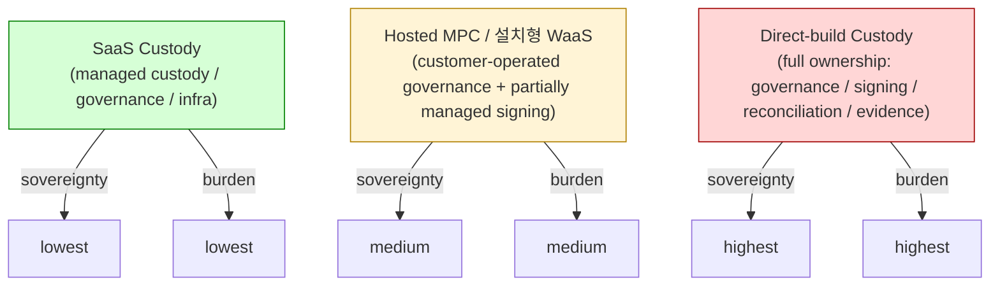
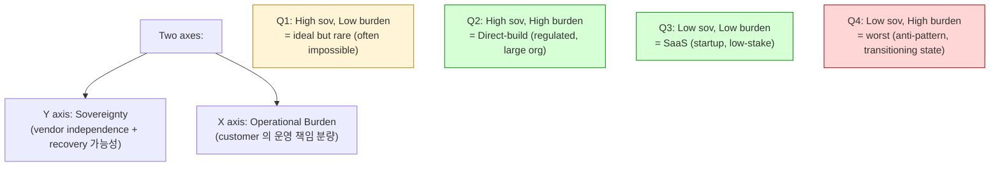
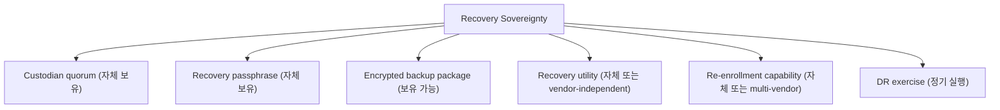
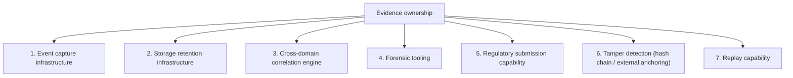
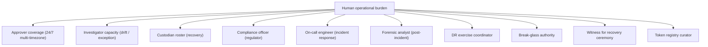
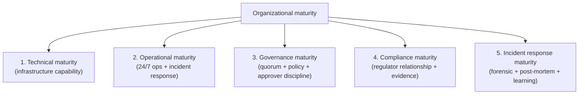
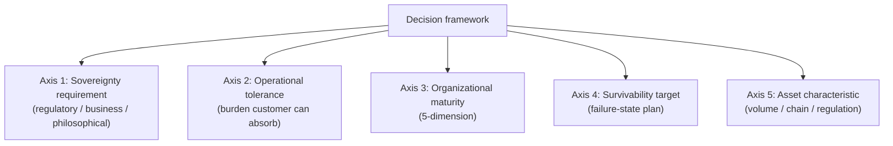
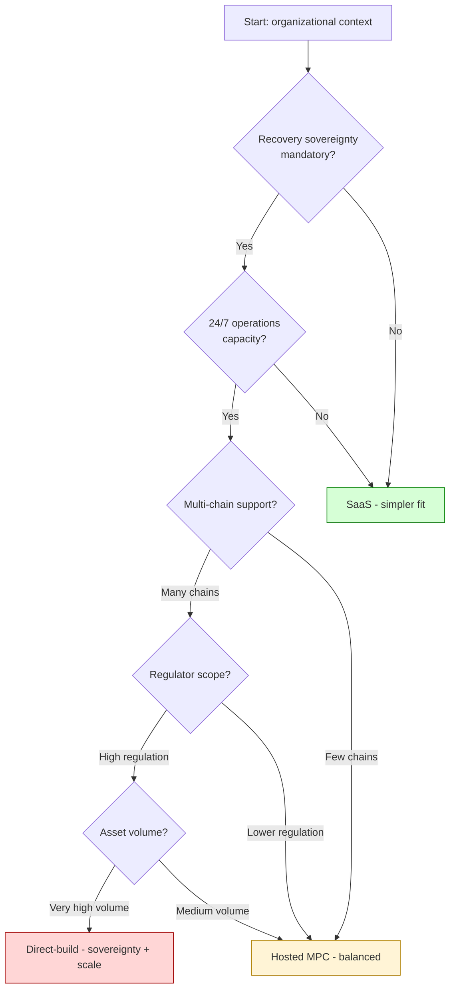

# Custody Wallet — 3-Way Custody Decision Framework

> **본 문서의 위치**: D1a-D8 의 8 reasoning skeleton 통합 synthesis. 단순 vendor feature scorecard 가 아닌 **sovereignty vs operational burden allocation** 의 framework. SaaS / Hosted MPC / Direct-build 의 선택은 기능 비교가 아닌 **responsibility 와 survivability burden 의 누가 감수하는가** 의 결정.

> **본 문서가 답하는 핵심 질문**: 왜 custody 선택은 "어떤 기능을 쓰는가" 가 아닌 "어떤 burden 을 누가 감수하는가" 인가? 왜 self-hosted = sovereign 이 false equivalence 인가? 왜 SaaS 가 customer 의 책임을 0 으로 만들지 못하는가? 왜 organizational maturity 가 technical capability 보다 더 중요한 결정 factor 인가?

---

## 0. 핵심 명제 (10초 이해)

1. **Custody architecture selection is fundamentally a sovereignty vs operational burden allocation problem.** — 본 문서의 thesis.
2. **3 모델 모두 customer 의 책임 0 으로 만들지 못함** — SaaS 도 governance / recovery / evidence / 외부 reconciliation 에서 customer ownership.
3. **"Self-hosted = sovereign" 은 false equivalence** — sovereignty 는 ownership 의 sum 이 아닌 **survivability** 의 함수.
4. **Recovery sovereignty = ultimate custody sovereignty** — vendor 가 사라져도 fund control 가능한가가 진짜 sovereignty 의 test.
5. **Operational survivability >> steady-state capability** — failure-state 의 행동이 model 선택의 핵심.
6. **Technical capability ≠ Organizational readiness** — 도구의 기능 ≠ 조직의 능력.
7. **Custody complexity 는 signing 보다 governance / reconciliation / evidence / recovery / exception 에 집중** — "키 관리" 가 아니라 "운영 survivability".
8. **Human coordination = irreducible operational core** — automation 으로 줄일 수 있는 burden 의 자연 limit.
9. **5-dimension maturity** — technical / operational / governance / compliance / incident-response 의 5 차원이 model fit 결정.
10. **정답 architecture 없음** — context (compliance / staffing / volume / sovereignty target / survivability tolerance) 별 trade-off framework.

---

## 1. 3 Custody Models (generalized)



### 1.1 3 모델의 generalized 정의

| 모델 | 정의 | Vendor 의존 | Customer 책임 |
|---|---|---|---|
| **SaaS Custody** | Vendor 가 governance + signing + infra 의 대부분 운영. Customer 는 policy 작성 + approver 보유 + exception workflow + 외부 evidence. | 매우 높음 | ~25-45% (D7/D8 burden 기준) |
| **Hosted MPC / 설치형 WaaS** | Customer 가 cosigner / key share 의 일부 host. Governance / orchestrator 는 vendor 또는 customer 가 선택. | 중간 | ~50-70% |
| **Direct-build Custody** | Customer 가 MPC lib / orchestrator / chain adapter / governance plane / evidence backbone 모두 직접 구축. | 매우 낮음 | ~100% |

### 1.2 "모델" 의 의미

- 본 문서의 model 은 **vendor product** 이 아닌 **operational responsibility pattern** 의 generalized form.
- 같은 vendor 의 다른 product 가 다른 model 일 수 있음.
- Customer 가 같은 vendor 를 사용해도 partial direct-build (예: 자체 reconciliation + vendor signing) 가능.

### 1.3 Model 의 spectrum 성격

```
SaaS ─────────── Hosted MPC ─────────── Direct-build
 (의존 ↑)        (혼합)               (의존 ↓)
 (burden ↓)     (혼합)               (burden ↑)
 (sovereignty ↓) (혼합)              (sovereignty ↑)
```

→ 3 모델은 discrete point 아닌 **spectrum** — 실제로는 hybrid 가 흔함.

---

## 2. Sovereignty vs Operational Burden Matrix

### 2.1 2-axis trade-off



### 2.2 Why Q1 (high sov + low burden) is rare

- Sovereignty 는 보통 operational capability 의 직접 함수.
- Vendor 가 흡수하면 burden ↓ 이지만 sovereignty ↓ (vendor 의존).
- Customer 가 직접 운영하면 sovereignty ↑ 이지만 burden ↑.
- → Q1 은 **이론상 가능하지만 보통 architecture trick + vendor 협력 + 외부 audit + recovery sovereignty 확보** 의 결합 필요.

### 2.3 Q4 (low sov + high burden) anti-pattern

- "Vendor 도 의존 + 자체 운영 burden 도 큼" = transitioning state 또는 잘못된 architecture.
- 가능한 source:
  - Vendor migration 중 (legacy + new 동시 운영)
  - 일부 자체 운영 도입했지만 vendor dep 못 끊음
  - Multi-vendor 의 reconciliation burden
- → 일시적 상태로 받아들이거나 model 재선택.

### 2.4 Sovereignty 의 dimension

| Dimension | 의미 |
|---|---|
| **Recovery sovereignty** | vendor 사라져도 fund control 가능 (= ultimate custody sovereignty) |
| **Governance sovereignty** | 자체 quorum / policy / approver 의 self-sustained 운영 |
| **Audit sovereignty** | regulator 의 evidence 요구를 vendor 없이 충족 |
| **Reconciliation sovereignty** | external domain (CEX/bridge) evidence 를 자체 cross-check |
| **Operational sovereignty** | 24/7 운영, incident response, on-call 의 자체 capacity |

→ 각 dimension 별 sovereignty 가 다를 수 있음 — 부분 sovereignty 도 의미.

---

## 3. Ownership Allocation per Domain (D1a-D8 통합)

### 3.1 통합 ownership 매트릭스

| Domain | SaaS | Hosted MPC | Direct-build |
|---|---|---|---|
| **D1a L1 Identity / Tenancy** | Vendor + customer SSO | Vendor + customer | Customer |
| **D1a L2 Custody hierarchy** | Vendor | Vendor (hosted) | Customer |
| **D1a L3 Ledger** | Vendor + customer export | Vendor + customer mirror | Customer |
| **D1a L4 Operational state** | Vendor | Vendor + customer partial | Customer |
| **D1a L5 Policy** | Vendor engine + customer policy | Vendor / customer engine | Customer engine |
| **D1a L6 Audit** | Vendor + customer SIEM | Vendor + customer mirror | Customer SIEM |
| **D1a L7 Recovery** | Customer custodian + vendor backup | Customer 더 큼 | Customer 전적 |
| **D1a L8 Signer topology** | Vendor 2-cloud + customer mobile | Customer cosigner + vendor | Customer (HSM/MPC) |
| **D1a L9 Blockchain cache** | Vendor multi-RPC | Vendor / customer | Customer multi-RPC |
| **D2 Signing orchestration** | Vendor | Vendor control plane + customer cosigner | Customer |
| **D2 Broadcast / RPC** | Vendor | Vendor / customer | Customer |
| **D3 Governance engine** | Vendor + customer policy | Vendor + customer custom | Customer |
| **D3 Approval workflow** | Vendor mobile + customer approvers | Customer + vendor channels | Customer |
| **D3 Break-glass** | Vendor + customer authority | Customer | Customer |
| **D4 Recovery ceremony** | **Customer 위주** (passphrase / custodian / airgap) | Customer 더 큼 | Customer |
| **D4 Re-enrollment** | Vendor + customer mobile | Customer cosigner | Customer |
| **D5 Evidence chain** | Customer (vendor data + own correlation) | Customer | Customer |
| **D5 Forensic tooling** | Customer (with vendor support) | Customer | Customer |
| **D5 Retention infra** | Vendor + customer extended | Customer | Customer |
| **D1b Reconciliation engine** | Customer (vendor data input) | Customer | Customer |
| **D1b Reorg handling** | Vendor (shallow) + customer (deep) | Vendor + customer | Customer |
| **D1b Drift detection** | Customer | Customer | Customer |
| **D1b Exception workflow** | Customer | Customer | Customer |
| **D7/D8 Lifecycle orchestration** | Vendor + customer policy | Vendor + customer | Customer |
| **D7 Attribution rules** | Vendor + customer config | Customer | Customer |
| **D7/D8 Token / asset registry** | Vendor (curated) | Customer | Customer |
| **External domain (CEX/bridge)** | Customer | Customer | Customer |
| **Incident response (24/7)** | Customer | Customer | Customer |
| **Compliance reporting** | Customer | Customer | Customer |

### 3.2 핵심 관찰

(★ Hypothesis — 위 매트릭스 의 패턴 분석)

1. **L7 Recovery 는 모델 무관 customer 책임** — sovereignty 의 핵심 (§4).
2. **D5 Evidence + D1b Reconciliation + Exception workflow 는 모든 모델에서 customer 책임** — vendor 가 흡수 못 함.
3. **External domain (CEX/bridge) integration 은 모델 무관 customer** — vendor scope 밖.
4. **Incident response + compliance reporting 은 모델 무관 customer** — 규제 의무가 customer 에게.
5. **L8 Signer topology + D2 MPC orchestration 이 가장 model-dependent 영역** — SaaS 가 가장 흡수 큼.

### 3.3 SaaS 가 흡수 못하는 customer 책임 (불변)

- Recovery 의 custodian + passphrase (sovereignty)
- Evidence chain 의 forensic completeness
- Reconciliation 의 cross-domain (특히 external)
- Exception workflow 의 investigator capacity
- Compliance reporting + regulator submission
- External domain integration (CEX / bridge / OTC)
- 24/7 incident response

→ "SaaS 사용 = customer 책임 0" 는 false equivalence (§12 anti-pattern).

---

## 4. Recovery Sovereignty (ultimate custody sovereignty)

### 4.1 Recovery sovereignty 의 정의

```
Recovery sovereignty
= "vendor 가 사라져도 customer 가 fund 를 다시 control 할 수 있는가" 의 가능성
```

→ 다른 sovereignty 의 ceiling — recovery 못 하면 다른 sovereignty 도 의미 없음.

### 4.2 Recovery sovereignty 의 component (D4 §11 의 통합)



### 4.3 모델별 recovery sovereignty

| Component | SaaS | Hosted MPC | Direct-build |
|---|---|---|---|
| Custodian quorum | Customer | Customer | Customer |
| Passphrase | Customer | Customer | Customer |
| Backup package | Customer + vendor encrypted | Customer 더 큼 | Customer |
| Recovery utility | **Vendor-dependent** | Vendor + customer | Customer |
| Re-enrollment | **Vendor-dependent** | Customer cosigner side | Customer |
| DR exercise | Customer (vendor 협력) | Customer | Customer |

→ **SaaS 의 recovery sovereignty 의 핵심 weakness**: Recovery utility + re-enrollment 의 vendor 의존. Vendor 사라지면 utility 사용 불가, re-enrollment protocol 막힘.

### 4.4 Recovery sovereignty 의 mitigation (vendor-independent recovery)

(★ Hypothesis — operational pattern, 일부 SaaS vendor 가 제공)

- **Standardized backup format** — vendor lock-in 없는 industry-standard format
- **Vendor-independent recovery tool** — open-source 또는 self-contained
- **Multi-vendor re-enrollment** — recovery 후 다른 vendor 로 migration 가능
- **External recovery escrow** — third-party 가 recovery utility 보관

→ 위 mitigation 없는 SaaS 는 vendor disappearance 시 fund loss 가능 — 가장 critical 한 sovereignty gap.

### 4.5 "Recovery capability ≠ Recovery survivability"

(§0.7 명제)

- Recovery capability = system 이 recovery flow 를 지원
- Recovery survivability = **실제 위기 시** recovery 가 작동
- Capability 가 있어도 survivability 가 부재하는 시나리오:
  - DR exercise 안 함 (procedure 잊혀짐)
  - Custodian roster 가 stale
  - Backup package decay (encryption key 사라짐)
  - Vendor disappearance 시 utility 사용 불가
  - Recovery 의 cryptographic dependency (libsodium / openssl) deprecated
- → Survivability 는 capability 의 supersets — **유지보수 의무** 필요.

---

## 5. Evidence Ownership Comparison

(D5 §11 의 깊은 적용)

### 5.1 Evidence ownership 의 dimension



### 5.2 모델별 evidence ownership

| Dimension | SaaS | Hosted MPC | Direct-build |
|---|---|---|---|
| Event capture | Vendor (vendor-scope) + customer (own systems) | Vendor + customer mirror | Customer |
| Storage retention | Vendor (정해진 기간) + customer extended | Vendor + customer tier | Customer |
| Cross-domain correlation | **Customer** (vendor data + customer systems) | Customer | Customer |
| Forensic tooling | Customer (vendor data export) | Customer | Customer |
| Regulatory submission | **Customer** (compliance officer) | Customer | Customer |
| Tamper detection | Vendor partial | Customer + vendor | Customer |
| Replay capability | Vendor limited + customer build | Customer + vendor | Customer |

### 5.3 "Vendor evidence ≠ Customer forensic completeness"

(D5 §11.4 의 재확인)

- Vendor 의 evidence 는 **vendor-scope** 만 — customer 의 CRM / KYC / finance 등과 미통합.
- Customer 의 forensic / regulatory / legal 의무는 cross-system evidence 가 필요.
- → Customer 는 vendor data + own data 의 cross-domain correlation engine 직접 보유.

### 5.4 Evidence ownership 의 critical question

- 규제 요구 발생 시 vendor 가 evidence 제공 안 하면? (vendor outage, vendor disappearance, vendor legal issue)
- → 답: customer 가 vendor data 의 own copy + cross-domain correlation 보유해야.
- 이는 SaaS 사용해도 customer infrastructure 필수.

---

## 6. Reconciliation Burden Comparison

(D1b §13 의 통합)

### 6.1 Reconciliation 의 5 영역

| 영역 | SaaS | Hosted MPC | Direct-build |
|---|---|---|---|
| Indexer / chain ingestion | Vendor | Vendor (대부분) | Customer multi-RPC |
| Confirmation policy | Vendor + customer config | Vendor + customer | Customer chain adapter |
| Drift detection | Vendor partial + customer extended | Customer + vendor integration | Customer 자체 engine |
| Exception queue + investigator | **Customer** | Customer | Customer |
| External domain reconciliation (CEX/bridge) | **Customer** | Customer | Customer |

### 6.2 Reconciliation 의 customer 책임 불변 영역

- Exception workflow 의 investigator capacity
- External domain reconciliation
- Cross-system (CRM / finance) correlation
- Pattern analysis (drift 의 systematic pattern)
- Compliance reporting (drift incident 의 regulator 통지)

→ 모든 모델에서 customer 책임. Vendor 가 자동화 흡수하는 것은 indexer + shallow reorg 까지.

### 6.3 Reconciliation 의 organizational implication

- 24/7 investigator team 필요 (chain 은 24/7 작동, drift 는 언제든 발생)
- Investigator 의 technical depth (chain knowledge + accounting + governance) 요구
- Manual ledger entry 의 governance integration

→ Reconciliation team 의 staffing 이 organizational maturity 의 큰 부분.

---

## 7. Governance Ownership Comparison

(D3 §10 의 통합)

### 7.1 Governance 의 핵심 영역

| 영역 | SaaS | Hosted MPC | Direct-build |
|---|---|---|---|
| Policy engine | Vendor engine + customer policy | Vendor + customer policy migration | Customer engine + DSL |
| Approval mobile app | Vendor | Vendor + customer integration | Customer (build mobile app) |
| Quorum collection | Vendor | Vendor + customer | Customer 자체 |
| Escalation rule | Vendor | Customer + vendor | Customer rule engine |
| Break-glass | Vendor + customer authority | Customer authority + vendor channel | Customer 자체 |
| Governance audit | Vendor + customer mirror | Vendor + customer | Customer SIEM |
| **Approver onboarding** | **Customer** | Customer | Customer |
| **Policy design** | **Customer** | Customer | Customer |

### 7.2 Governance 의 customer 책임 불변

- Approver identity onboarding (KYC for approvers)
- Policy design (어떤 정책을 사용할 것인가)
- Break-glass authority composition
- Governance incident response
- Compliance reporting

→ Governance "engine" 는 vendor 가 흡수 가능하지만 governance "design" 은 customer 책임.

### 7.3 Governance maturity 의 organizational implication

- Multi-timezone approver coverage (24/7 quorum)
- Approver 의 fraud / phishing 교육
- Policy 의 정기 review 주기
- Break-glass drill 의 정기 실행

→ Governance maturity 가 model 선택과 무관하게 customer 책임.

---

## 8. Signing Ownership Comparison

(D2 §9 의 통합)

### 8.1 Signing 의 영역

| 영역 | SaaS | Hosted MPC | Direct-build |
|---|---|---|---|
| MPC orchestrator availability | Vendor 3-cloud | Vendor control plane | Customer (own orchestrator) |
| Signer topology mgmt | Vendor + customer mobile | Customer cosigner | Customer |
| TEE attestation | Vendor (3-cloud) | Vendor cosigner TEE | Customer (own TEE or no TEE) |
| Multi-RPC redundancy | Vendor | Vendor / customer | Customer |
| Retry / replay protection | Vendor | Vendor | Customer |
| Callback handler (B5) | **Customer (optional)** | Customer | Customer |
| Signing audit | Vendor + export | Vendor + mirror | Customer SIEM |
| Mempool / stuck tx | Vendor | Vendor | Customer |

### 8.2 Signing 의 customer 책임 불변

- Callback handler (if enabled) — customer-side B5 boundary
- Approver mobile devices (customer's own employees' phones)
- MPC key share 의 일부 (mobile share)
- Recovery 의 signing-side component

### 8.3 Signing 이 SaaS 의 가장 큰 흡수 영역

- D2 의 12 sub-plane 중 S5 MPC orchestration / S6 signer / S8 broadcast / S9 confirmation = vendor 가 거의 완전 흡수.
- → SaaS 의 가장 큰 customer benefit 영역.
- 반대로 direct-build 의 가장 큰 burden 영역.

### 8.4 "MPC = Solved custody" anti-pattern

(§12 의 미리보기)

- MPC scheme 자체는 cryptographic primitive — custody complexity 의 일부만 해결.
- Governance / reconciliation / evidence / recovery 의 burden 은 MPC 와 무관하게 존재.
- "MPC 도입하면 custody 해결" 은 잘못된 framing.

---

## 9. Human Operational Burden Analysis

### 9.1 Human coordination 의 dimension



### 9.2 모델별 human burden

| Role | SaaS | Hosted MPC | Direct-build |
|---|---|---|---|
| Approver (governance) | Customer | Customer | Customer |
| Investigator (drift) | Customer | Customer | Customer (larger team) |
| Custodian (recovery) | Customer | Customer | Customer (oversized N) |
| Compliance officer | Customer | Customer | Customer (larger team) |
| On-call engineer | Customer (with vendor support) | Customer | Customer (24/7) |
| Forensic analyst | Customer (with vendor data) | Customer | Customer (own SIEM) |
| DR exercise coord | Customer | Customer | Customer |
| Break-glass authority | Customer | Customer | Customer |
| Recovery witness | Customer | Customer | Customer |
| Token curator | (Vendor curated) | Customer | Customer |

→ **Human burden 의 거의 모든 role 이 customer 측 — model 무관**.

### 9.3 Human coordination 의 폭증 (direct-build)

(D3 §9 F10 의 적용)

Direct-build 에서 추가:
- MPC ceremony coordinator (MPC participant 조정)
- Multi-RPC operations team (provider 관리)
- Token registry curator (asset universe 관리)
- Chain adapter engineer (multi-chain)
- Recovery utility maintainer (cryptographic library 유지)

→ Human burden 의 폭증 = direct-build 의 가장 큰 hidden cost.

### 9.4 "Operational control ≠ Operational maturity"

(§0.8 명제)

- Direct-build = control 최대 — 그러나 maturity 가 따라가지 않으면 fragility 폭증.
- 작은 team 의 direct-build = maintenance burden 의 single-point-of-failure.
- 큰 team 의 direct-build = control 활용 가능.
- → Maturity 가 control 의 prerequisite.

---

## 10. Operational Survivability (failure-state)

### 10.1 Failure-state 의 10 시나리오

```mermaid
graph TB
    S1["S1. Vendor disappearance<br/>(bankruptcy, acquisition shutdown)"]
    S2["S2. Cloud outage<br/>(major cloud provider down)"]
    S3["S3. Insider compromise<br/>(employee with access turn malicious)"]
    S4["S4. Governance corruption<br/>(approver collusion)"]
    S5["S5. Recovery failure<br/>(custodian unavailable, backup decay)"]
    S6["S6. Evidence loss<br/>(retention expiry, storage corruption)"]
    S7["S7. Reconciliation drift accumulation<br/>(small drift × time = big inconsistency)"]
    S8["S8. Key custodian unavailability<br/>(attrition, illness, death)"]
    S9["S9. Human coordination collapse<br/>(team turnover, knowledge loss)"]
    S10["S10. Regulatory escalation<br/>(license loss, freeze order)"]
```



### 10.2 모델별 survivability score (★ Hypothesis)

| Scenario | SaaS | Hosted MPC | Direct-build |
|---|---|---|---|
| S1 Vendor disappearance | **Critical (utility 의존)** | Medium (cosigner host) | Low (no vendor dep) |
| S2 Cloud outage | Medium (vendor 3-cloud) | Medium-Low (single cloud often) | Low (own infra) |
| S3 Insider compromise | Low (vendor's controls) | Medium (mixed) | High (customer's controls only) |
| S4 Governance corruption | Vendor controls 도움 | Customer 책임 | Customer 책임 |
| S5 Recovery failure | Customer's responsibility | Customer's responsibility | Customer's responsibility |
| S6 Evidence loss | Vendor retention dependent | Customer's responsibility | Customer's responsibility |
| S7 Drift accumulation | Vendor's reconciliation 도움 | Customer's responsibility | Customer's responsibility |
| S8 Custodian unavailability | Customer's responsibility | Customer's responsibility | Customer's responsibility |
| S9 Human coordination collapse | Lower (smaller team needed) | Medium | Higher (larger team) |
| S10 Regulatory escalation | Vendor's compliance + customer | Customer | Customer (own compliance) |

→ 핵심 insight: **각 model 의 strength / weakness 영역 다름**. SaaS 가 S1 (vendor disappearance) 에 가장 weak, direct-build 가 S9 (human coordination collapse) 에 가장 weak.

### 10.3 Failure-state planning

(★ 본 문서의 핵심 reasoning)

- Steady-state 의 feature comparison 으로는 model 선택 불가.
- **각 model 의 failure mode 를 식별 + tolerance 결정**.
- 예:
  - "Vendor 가 사라지면 어떻게?" → SaaS 사용 시 mandatory plan
  - "24/7 on-call 가능한가?" → direct-build 사용 시 mandatory
  - "Custodian 의 1/3 이 동시 사고 시?" → 모든 모델에서 plan
- → Failure-state 시뮬레이션 (table-top exercise) 이 model 선택의 핵심 단계.

### 10.4 "Steady-state >> Failure-state" anti-pattern

(§12 의 미리보기)

- Steady-state 의 feature 비교 (latency, throughput, UX) 가 결정 driver 가 되는 경우 흔함.
- Custody 의 본질은 failure-state survivability — 평상시 안 보이는 영역.
- → "이 vendor 가 빠르다 / 편하다" 가 가장 중요한 factor 인 결정은 anti-pattern.

---

## 11. Organizational Maturity Framework

### 11.1 5-dimension maturity



### 11.2 각 maturity 의 indicator

| Maturity | Indicators |
|---|---|
| Technical | engineering team size / chain expertise / DevOps capability |
| Operational | on-call rotation / SLA monitoring / runbook quality / DR exercise frequency |
| Governance | quorum coverage / approver training / policy review cadence / break-glass discipline |
| Compliance | regulator relationship / KYC integration / AML provider / audit history |
| Incident response | postmortem culture / forensic tooling / red team exercise / threat model |

### 11.3 Organization 별 maturity profile (★ Hypothesis)

| Organization | T | O | G | C | IR | 권장 model |
|---|---|---|---|---|---|---|
| **Startup (early)** | Low-Med | Low | Low | Low | Low | **SaaS** (모든 dimension 흡수 필요) |
| **Startup (scaling)** | Med | Low-Med | Med | Med | Med | SaaS or Hosted MPC |
| **Crypto Exchange (mid)** | High | High | Med | Med-High | Med | Hosted MPC + 자체 reconciliation |
| **Crypto Exchange (large)** | High | High | High | High | High | **Direct-build** (sovereignty 우선) |
| **Bank (entering crypto)** | Med-High | High | High | High | High | Hosted MPC + bank governance overlay |
| **Stablecoin Issuer** | High | High | High | High | Med-High | Direct-build (issuance sovereignty) |
| **Infra Provider (custody-as-a-service)** | High | High | High | High | High | Direct-build (vendor 자체) |
| **Sovereign Entity (CBDC, national)** | High | High | Max | Max | Max | Direct-build (sovereignty 절대) |
| **Family office** | Low-Med | Low | Med | Low | Low | SaaS (단순화 우선) |
| **DAO / DeFi protocol** | Med-High | Low | Low | Low | Low | Hybrid (multi-sig + SaaS) |

→ 위 매트릭스는 **starting point** 일 뿐 — 실제 fit 은 maturity 의 dimension 별 detail 의존.

### 11.4 Maturity 가 부족한 영역 의 약점

(★ operational reasoning)

| 부족 영역 | Direct-build 시 위험 |
|---|---|
| Technical | Infrastructure outage / chain adapter bug |
| Operational | Stuck withdrawal / drift accumulation |
| Governance | Break-glass abuse / approval bottleneck |
| Compliance | Regulator action / license risk |
| Incident response | Slow forensic / poor recovery from incident |

→ Direct-build 는 5 dimension 모두 high 일 때만 권장. 어느 하나라도 약하면 hybrid 또는 SaaS 가 안전.

### 11.5 "Technical capability ≠ Organizational readiness"

(§0.10 명제)

- Engineering team 이 강해도 governance + compliance + incident response maturity 가 부재면 direct-build 실패.
- 자주 발생: 기술팀이 자체 구축 가능하다고 판단 → governance / compliance 부재 → regulator 충돌 또는 fund loss.
- → Maturity 의 **약점 dimension 이 결정 driver**.

---

## 12. Anti-pattern Catalog

10 anti-pattern — 흔히 발생하는 잘못된 reasoning.

### 12.1 "MPC = Solved custody"

- MPC 는 cryptographic primitive — signing burden 의 일부만 해결.
- Governance / reconciliation / evidence / recovery / exception 의 burden 은 MPC 와 무관.
- 진실: MPC 는 single-key-loss 위험만 mitigate. 나머지 burden 전부 존재.

### 12.2 "Self-hosted = Sovereign"

- Self-hosted = infrastructure ownership.
- Sovereignty = vendor independence + recovery survivability + organizational maturity.
- 진실: Self-hosted SaaS (예: vendor의 self-hosted product) 는 여전히 vendor lock-in. Recovery utility 의 vendor 의존이 진짜 sovereignty test.

### 12.3 "SaaS = Outsourced responsibility"

- SaaS = operational burden 의 일부 흡수.
- 그러나 governance / recovery / evidence / external / compliance / incident response 는 customer 책임.
- 진실: SaaS 도 customer responsibility ~25-45%.

### 12.4 "Air-gap = Secure operations"

- Air-gap = network exfiltration 차단.
- 그러나 physical access / supply chain / human error / side-channel 위험 잔존.
- 진실: Air-gap 는 mitigation 의 한 layer, 그 자체로 safe 아님.

### 12.5 "Direct-build = Institutional-grade"

- Direct-build = 자체 구축.
- 그러나 maturity 부족 시 institutional-grade 보다 더 fragile.
- 진실: Institutional-grade 는 maturity 의 함수. 자체 구축이 자동 institutional-grade 아님.

### 12.6 "Append-only = Forensic complete"

(D5 §10.1)

- Append-only = mutation 방지.
- 그러나 hash chain / WORM / external anchoring / signing 없으면 tamper-detection 부재.
- 진실: Append-only 는 starting point, forensic 은 추가 layer 필요.

### 12.7 "Recovery exists = Survivable"

(D4 §11.5)

- Recovery capability = system support.
- Recovery survivability = 실제 위기 시 작동.
- 진실: DR exercise / custodian roster maintenance / utility maintenance 없으면 recovery 작동 안 함.

### 12.8 "Reconciliation automated = Safe"

(D1b §9.1)

- Automation 은 일부 drift 해결.
- 그러나 exception workflow + human investigation 은 irreducible.
- 진실: 자동화 비율 ≠ safety. Exception capacity 가 safety 의 결정 factor.

### 12.9 "Multi-sig = Governance"

- Multi-sig = cryptographic primitive (threshold signature).
- Governance = state machine + freshness + escalation + audit + break-glass + appover lifecycle.
- 진실: Multi-sig 는 governance 의 일부만 제공. D3 의 11-state SM 이 실제 governance.

### 12.10 "More control = Better architecture"

- More control = direct-build 의 동기.
- 그러나 control 의 cost (maturity 요구, human burden) 가 benefit 을 초과 가능.
- 진실: Control 의 optimal level 은 maturity 의 함수. Over-control 도 anti-pattern.

---

## 13. Decision Framework (tradeoff axes)

### 13.1 5 decision axes



### 13.2 각 axis 의 question

| Axis | Questions |
|---|---|
| Sovereignty | 규제가 self-custody 요구? Vendor disappearance survivability? Recovery 의 vendor independence? |
| Operational tolerance | 24/7 operations 가능? Investigator team 가능? Multi-region SLA? Multi-chain ops? |
| Maturity | 5 dimension 중 약점은? 약점 dimension 의 mitigation plan? |
| Survivability | 10 failure scenarios 중 critical 은? Tolerance 는? Plan 있는가? |
| Asset | Volume / value / chain diversity / regulation? |

### 13.3 결정 trade-off 의 visualization



→ 위 flowchart 는 **simplification** — 실제 결정은 multi-dimensional. 본 flowchart 는 starting point.

### 13.4 Hybrid 가 흔한 이유

(★ Hypothesis — operational pattern)

- Pure SaaS / pure Hosted / pure Direct-build 가 fit 인 organization 은 드뭄.
- 흔한 hybrid:
  - SaaS + 자체 reconciliation engine (vendor evidence + own cross-system correlation)
  - SaaS + 자체 backup escrow (recovery sovereignty 확보)
  - Hosted MPC + 자체 governance plane (compliance 우선)
  - Direct-build + vendor 의 일부 service (예: indexer outsource)
- → 본 framework 는 hybrid 의 component 별 decision 도 가능.

### 13.5 Re-evaluation cadence

(★ operational pattern)

- Custody architecture 는 once 결정 후 영구 아님.
- Maturity 가 변화하면 model 도 변화 가능 (보통 SaaS → Hosted → Direct-build, 점진적).
- 정기 re-evaluation 권장 (annual):
  - Maturity 변화 측정
  - Failure-state plan 검토
  - Vendor performance review
  - Regulatory landscape 변화
- → Model 은 evolving choice.

---

## 14. Remaining Unknowns / Org Policy 영역

| 영역 | 질문 | 본 문서 범위 밖 이유 |
|---|---|---|
| Specific vendor scorecard | 어느 vendor 가 어느 model 의 best fit? | vendor-specific, 시간에 따라 변화 |
| Pricing | model 별 cost? | vendor-specific + scale 의존 |
| Migration path | SaaS → Hosted → Direct-build 의 procedure? | implementation detail |
| Specific compliance regime | 각 jurisdiction 의 요구? | regulatory-specific |
| Multi-region deployment | data residency? | legal + 규제 |
| Specific chain support | chain X 의 model 적합도? | chain-specific |
| DeFi integration | DEX / lending / staking 의 custody 처리? | protocol-specific |
| Treasury operations | issuance / burn / reserve? | D10 영역 |
| Cross-border operations | jurisdictional split? | legal |
| Audit firm selection | external auditor 선택? | governance |
| Insurance | crypto custody insurance? | insurance market |
| Token registry policy | 어느 token 을 support? | risk + ops |
| Bridge support | 어느 bridge 를 신뢰? | partnership |
| Emergency authority composition | 누가 break-glass 의 authority? | governance design |
| DR exercise frequency | quarterly / annually? | operational maturity |
| Custodian compensation | 어떻게 incentive? | governance + legal |
| Recovery utility maintenance | 자체 maintain 또는 vendor? | sovereignty trade-off |
| Token whitelist process | who approves new tokens? | governance |

---

## 15. 관련 wiki / entity reference + Uncertainty Boundary

### 관련 wiki

| 참조 | 어디서 사용 |
|---|---|
| [[entities/fireblocks/admin-quorum]] | §7 (governance) |
| [[entities/fireblocks/policy]] | §7 (policy engine) |
| [[entities/fireblocks/workspace-keys-backup]] | §4 (recovery sovereignty) |
| [[entities/fireblocks/api-co-signer]] | §8 (signing) |
| [[entities/fireblocks/callback-handler]] | §8 (B5 boundary) |
| [[vendors/fireblocks/architecture]] | §1 (3-way 비교 reference) |
| [[vendors/fireblocks/risks]] | §10 (failure-state scenarios) |
| [[docs/architecture/vault-wallet-ledger-db-schema]] | §3 (D1a ownership) |
| [[docs/architecture/signing-workflow-orchestration]] | §8 (signing ownership) |
| [[docs/architecture/approval-state-machine-governance]] | §7 (governance ownership) |
| [[docs/architecture/recovery-ceremony-generalization]] | §4 (recovery sovereignty) |
| [[docs/architecture/audit-event-sourcing-evidence-chain]] | §5 (evidence ownership) |
| [[docs/architecture/reconciliation-settlement-consistency]] | §6 (reconciliation burden) |
| [[docs/architecture/deposit-lifecycle]] | §3 (deposit ownership) |
| [[docs/architecture/withdrawal-lifecycle]] | §3 (withdrawal ownership) |

### Uncertainty Boundary (★ 절대 유지)

- 본 문서의 **3-model spectrum / 5 sovereignty dimension / 10 failure scenarios / 5 maturity dimension / 10 anti-pattern / 5 decision axes / hybrid 가 흔함 / re-evaluation cadence** 는 모두 **generalized custody decision architecture pattern** (Hypothesis ★).
- D1a-D8 의 burden 백분율은 **operational reasoning estimate** — 측정값 아님.
- §11.3 의 organization-model mapping 은 **starting point** — 실제 fit 은 multi-dimensional.
- §13.3 의 decision flowchart 는 **simplification** — 실제 결정은 더 복잡.
- §14 에 명시된 영역은 본 문서가 결정하지 않음.
- "정답 architecture" 는 본 문서가 제시하지 않음 — context-dependent trade-off framework.

### 다음 단계 (D6 이후)

본 문서는 D6 — **3-way Custody Decision Framework**. D1a-D8 의 synthesis.

다음 후보:

- **D9 — Multi-chain Adapter Pattern** (EVM vs UTXO / finality variance / mempool / bridge / chain abstraction)
- **D10 — Treasury / Reserve / Mint-Burn Architecture** (issuance authority / reserve reconciliation / stablecoin accounting)
- **D11 — Compliance / AML / Sanctions Boundary** (policy enforcement / monitoring / freeze / travel rule)

→ D6 는 D1a-D8 의 closing synthesis. D9-D11 은 specialized domain 으로 향하는 다음 단계.

### Architecture reasoning layer 완성 (D1a + D2 + D3 + D4 + D5 + D1b + D7 + D8 + D6)

**9 문서 = generalized custody architecture reasoning skeleton 완성**.

| 문서 | 핵심 명제 |
|---|---|
| D1a | 9-plane DB / secrets DB 저장 금지 |
| D2 | 4 state machine 분리 / MPC retry non-idempotent |
| D3 | 11-state governance SM / two-clock freshness |
| D4 | Recovery = governance ceremony under cryptographic risk |
| D5 | Custody = evidence system / Unified Evidence Spine |
| D1b | Reconciliation = cross-truth-domain consistency proof |
| D7 | Deposit = controlled ledger recognition of external settlement |
| D8 | Withdrawal = multi-domain state transition |
| **D6** | **Custody architecture = sovereignty vs operational burden allocation** |

→ D6 는 D1a-D8 의 reasoning 을 organization-facing decision framework 로 통합한 final synthesis.

---

**Stage 32 D6 completion timestamp**: 2026-05-19.
