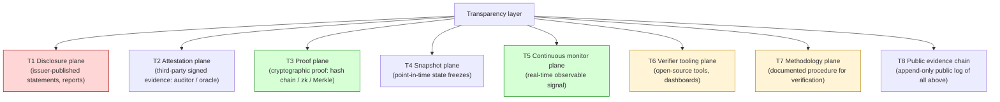
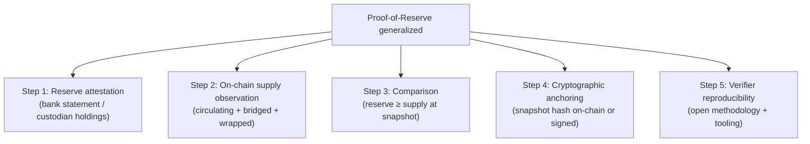
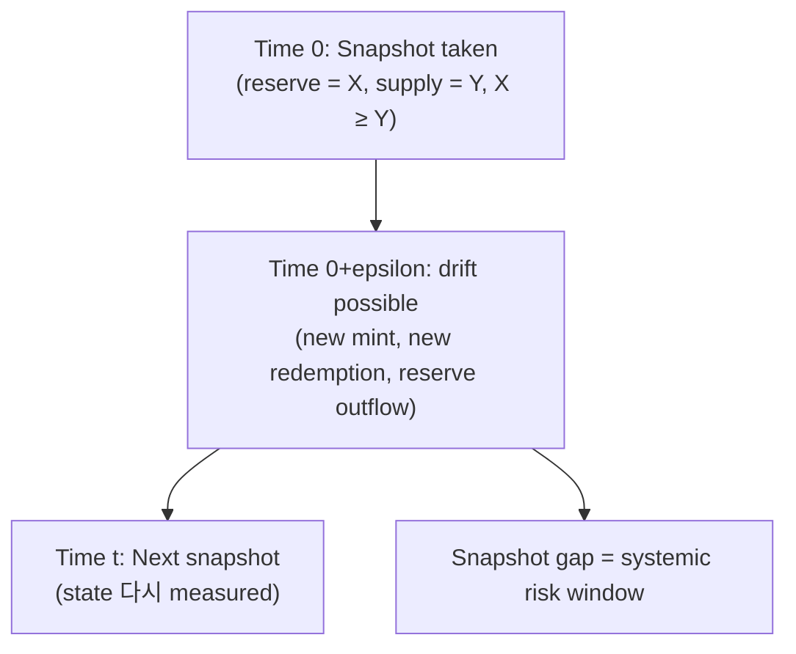
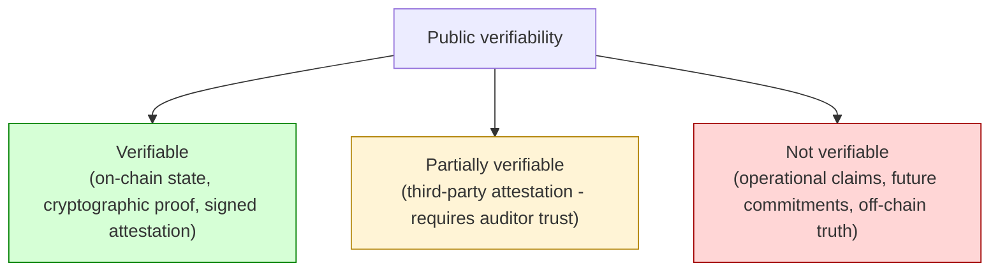
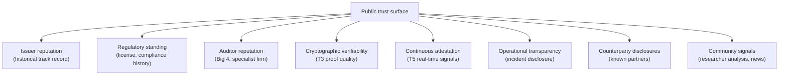
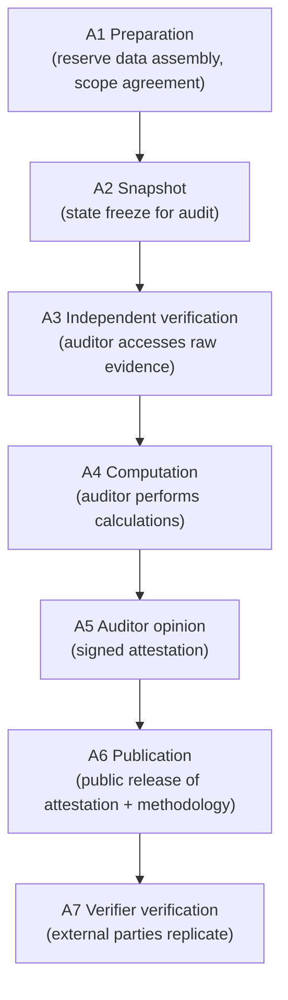
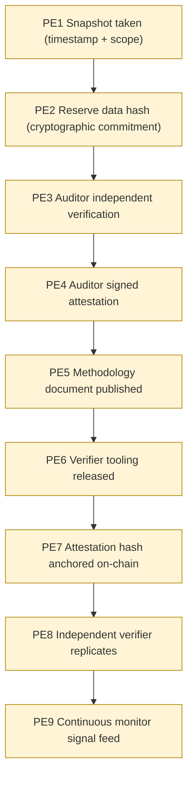

# Custody Wallet — Transparency / Attestation / Proof Systems Reasoning

> **본 문서의 위치 (Trust Cluster D15)**: D5 evidence + D10 monetary + D11 compliance + D14 security 위의 **externally verifiable trust production**. Internal evidence (D5) 와 대비되는 **public-facing verifiable evidence**. Cluster D15→D16→D24 의 첫 단계.

> **본 문서가 답하는 핵심 질문**: 왜 transparency 는 disclosure 와 다른가? 왜 publication 만으로 trust 가 emerge 하지 않는가? 왜 PoR 는 solvency proof 가 아닌가? 왜 snapshot truth 가 continuous truth 와 다른가? 왜 public visibility 자체가 verifiability 보장 아닌가?

---

## 0. 핵심 명제 (10초 이해)

1. **Transparency = externally verifiable consistency evidence across financial / operational / settlement domains** (core thesis).
2. **5-tier "≠" 명제** (cluster 핵심):
   - Transparency ≠ Disclosure
   - Proof-of-reserve ≠ Solvency proof
   - Snapshot truth ≠ Continuous truth
   - Public visibility ≠ Verifiability
   - Evidence publication ≠ Trust elimination
3. **Disclosure = unilateral statement** — issuer says X. **Transparency = verifiable claim** — anyone can confirm X.
4. **Trust emerges from verification, not assertion** — published evidence 의 가치 = 외부 verifier 가 cross-check 가능한지에 의존.
5. **Public verifiability = cryptographic primitive + open methodology + accessible tooling** — 세 가지 모두 필요.
6. **8-layer transparency architecture (T1-T8)** — Disclosure / Attestation / Proof / Snapshot / Continuous monitor / Verifier tooling / Methodology / Public evidence chain.
7. **Identity uncertainty is the trust ceiling** — perfect transparency 도 identity ambiguity 면 attribution 못함 (→ D16 bridge).
8. **Snapshot ↔ Continuous gap = systemic risk window** — attestation 사이의 시간이 manipulation vector.
9. **Verifier capability ≠ Verifier intent** — tooling 있어도 verifier 가 실행 안 하면 transparency 작동 안 함.
10. **Trust = SaaS 에서도 customer 책임 ~80% in transparency** — vendor 가 data 제공해도 customer 의 own trust production 책임.

---

## 1. Transparency Architecture (T1-T8 sub-plane)



### 1.1 8 sub-plane 의 trust contribution

| Plane | Trust value (★ Hypothesis) | Why |
|---|---|---|
| **T1 Disclosure** | Low | Self-statement only |
| **T2 Attestation** | Medium | Third-party assertion, but trust nested (auditor own risk) |
| **T3 Proof** | High | Cryptographically verifiable, doesn't require third-party trust |
| **T4 Snapshot** | Medium (instantaneous) | Snapshot 이후 drift |
| **T5 Continuous monitor** | High | Real-time, but vendor dependency |
| **T6 Verifier tooling** | Enabler | Trust 생산 가능하게 함 |
| **T7 Methodology** | Enabler | Verification 의 reproducibility |
| **T8 Public evidence chain** | Composite | T1-T7 의 immutable archive |

### 1.2 "Disclosure ≠ Transparency" reasoning

```
Disclosure: "We have $X in reserves" (issuer's word only)
Transparency: "Here's how anyone can verify we have $X" (verifiable claim + methodology + tooling)
```

→ Disclosure 는 trust 의 **request**, transparency 는 trust 의 **enablement**.

### 1.3 Trust trinity: Cryptographic primitive × Open methodology × Accessible tooling

- 세 가지 모두 필요 — 하나라도 부재 시 transparency 미완성.
- Cryptographic primitive 만: 일반인이 verify 못함.
- Methodology 만: 실제 cryptographic guarantee 없음.
- Tooling 만: 어떻게 사용하는지 모름.
- → Trust 의 social technology 측면.

---

## 2. Proof-of-Reserve (PoR) Semantics

### 2.1 PoR 의 generalized form (D10 §7 의 확장)



### 2.2 "Proof-of-reserve ≠ Solvency proof" (D10 §7.2 의 재확인)

- PoR = assets snapshot.
- Solvency = assets - liabilities ≥ 0.
- PoR + Proof-of-Liabilities (PoL) = approximate solvency proof.
- PoL 의 challenge: liabilities 의 정확한 enumeration (token holders, off-chain claims, derivatives, etc.).

### 2.3 Merkle-tree PoL pattern

(★ Hypothesis — emerging pattern)

```
Each user's balance → leaf
All leaves → Merkle tree → root
Root 가 published (or anchored on-chain)
Each user 가 자신의 leaf + Merkle proof 받음
User 가 자신의 inclusion verify 가능
Total leaf sum = published total liability
```

- 장점: cryptographically verifiable inclusion + total
- 한계:
  - User 가 다른 user 의 balance 모름 (privacy)
  - Hidden negative balance 가능 (issuer 가 negative leaf 추가)
  - → Pure Merkle 은 not sufficient; ZK proof 추가 필요

### 2.4 ZK-PoL (Zero-Knowledge Proof of Liabilities)

(★ Hypothesis — research-stage)

- ZK proof 로 "all leaves positive + sum = X" 입증 (privacy 유지).
- 현재 production-ready 아닌 emerging.
- Latency / cost trade-off 있음.

### 2.5 PoR limitations 재확인

| Limitation | 의미 |
|---|---|
| Snapshot only | T moment 이후 drift |
| Reserve composition opacity | "$X" 만, 어떤 asset 인지 미확인 |
| Off-balance-sheet liability | derivatives, loans 미반영 |
| Custodian attestation nested trust | 결국 누군가는 trust 해야 |
| Liability ambiguity | 누구의 token 까지 count? wrapped supply? |

---

## 3. Snapshot vs Continuous Truth

### 3.1 Snapshot truth model



### 3.2 "Snapshot truth ≠ Continuous truth"

(§0 명제)

- Snapshot 은 instant 의 fact.
- 그 사이 시간은 unverified.
- Manipulation vector:
  - Snapshot 전 reserve borrow / 후 return (window dressing)
  - Snapshot 후 immediate supply increase (without backing increase)
- → Snapshot 빈도 가 attack surface 결정.

### 3.3 Snapshot frequency 의 trust trade-off

(★ Hypothesis — operational reasoning)

| Frequency | Trust level | Cost |
|---|---|---|
| Quarterly | Low (3-month manipulation window) | Low |
| Monthly | Medium | Medium |
| Daily | High | High (auditor cost) |
| Real-time | Highest | Very high (continuous infrastructure) |

→ Trust 의 economic cost — verification 빈도 ↑ = trust ↑ = cost ↑.

### 3.4 Continuous attestation 의 model

- On-chain proof: smart contract 가 매 mint/burn 시 evidence emit.
- Off-chain continuous: monitoring infrastructure 가 매 reserve 변화 attestation.
- 한계:
  - Continuous infrastructure 자체의 trust (vendor / oracle)
  - Latency (real-time 도 sub-second 아님)
  - Cost (operational + audit fees)

### 3.5 "Window dressing" risk

(★ Hypothesis — financial industry pattern)

- Snapshot 시점에만 reserve 가 sufficient (이후 outflow).
- Window dressing detection:
  - Surprise audit (unscheduled snapshot)
  - Continuous monitoring (vs scheduled snapshot)
  - Statistical analysis (multiple snapshots)
- → Snapshot 의 scheduled timing 자체가 weakness.

---

## 4. Verifiability Boundary

### 4.1 What can be verified vs what cannot



### 4.2 각 verifiability level 의 예

| Level | 예 |
|---|---|
| **Verifiable** | On-chain supply / Merkle inclusion / signed PoR hash |
| **Partially verifiable** | Auditor's signed report / oracle data feed |
| **Not verifiable** | Internal procedure / future commitment / off-chain banking |

### 4.3 "Public visibility ≠ Verifiability"

(§0 명제)

- Public publication = anyone can see.
- Verifiability = anyone can confirm.
- 차이:
  - Published PDF report = visible but not cryptographically verifiable
  - Published Merkle root + proof + methodology = visible + verifiable
- → Verification 의 enablement 가 transparency 의 핵심.

### 4.4 Verifier accessibility tiers

| Tier | 의미 |
|---|---|
| Cryptographer-level | Specialist 만 가능 |
| Engineer-level | 개발자 의 일반 능력 |
| Power-user level | Tooling 있으면 가능 |
| Public-level | UI 가 verify 결과 보여줌 |

→ Tooling 의 maturity 가 trust 의 democratization 결정.

### 4.5 "Evidence publication ≠ Trust elimination"

(§0 명제)

- Publication 후에도 잔여 trust 필요:
  - 누가 evidence 를 generated (issuer's word)
  - Methodology 의 correctness (issuer's claim about how it was done)
  - Tooling 의 correctness (verifier tool 의 bug)
- → Transparency 는 trust 감소, elimination 아님.

---

## 5. Public Trust Surface

### 5.1 Trust surface 의 component



### 5.2 Trust 의 multi-source composition

- Trust 는 single source 가 아닌 multiple weak signals 의 aggregate.
- Single source compromise (예: auditor scandal) 가 entire trust collapse 가능.
- Diversification: multiple auditor + multiple monitor + open evidence.

### 5.3 Trust decay

(★ Hypothesis — operational pattern)

- Trust 는 시간에 따라 decay:
  - Past attestation 의 staleness
  - Past good behavior 가 future 보장 아님
- → 정기 refresh 가 trust maintenance.

### 5.4 Trust 의 asymmetric 성격

- Trust 누적 시간 = years (incident 없이 정기 transparency).
- Trust 손실 시간 = hours (single major incident).
- → Defensive posture — never compromise transparency for short-term gain.

---

## 6. Attestation Lifecycle

### 6.1 Attestation 의 7-phase



### 6.2 Auditor의 trust nest (D10 §7.5)

- Issuer trusts auditor.
- Public trusts auditor's reputation.
- Auditor's reputation depends on:
  - Auditor's methodology rigor
  - Auditor's independence (no conflict of interest)
  - Auditor's history (no past scandal)
- → Single point of failure if auditor compromised.

### 6.3 "Audit attestation" vs "Audit opinion"

| Type | 의미 |
|---|---|
| **Attestation** | Specific fact verified (e.g. "reserves ≥ supply at time T") |
| **Audit opinion** | Broad opinion on financial statements (GAAP / IFRS compliance) |

→ Attestation 은 narrower + more verifiable. Custody PoR 는 보통 attestation.

### 6.4 Attestation 의 limitations

| Limitation | 의미 |
|---|---|
| Scope limitation | Auditor 가 specific scope 만 verify |
| Methodology assumptions | Auditor's methodology 의 limits |
| Timing | Snapshot only (§3) |
| Materiality threshold | Small drift 는 reported 안 됨 |
| Going concern | Future viability 보장 아님 |

---

## 7. Transparency Evidence Chain

### 7.1 Public evidence chain structure



### 7.2 Public vs internal evidence

(D5 §3 의 public extension)

| Aspect | Internal evidence (D5) | Public evidence (D15) |
|---|---|---|
| Audience | Own operations / regulator | Anyone |
| Privacy | Full detail | Aggregated / anonymized |
| Frequency | Real-time | Periodic snapshot or continuous |
| Verification | Own audit | External verification |
| Retention | Long (5-10y) | Long + public-permanent |
| Tamper detection | Hash chain | + on-chain anchoring |

### 7.3 On-chain anchoring

- Attestation hash 를 public blockchain 에 commit (e.g. Ethereum).
- 장점: tamper-resistance + public timestamp + cryptographic non-repudiation.
- 한계:
  - Cost (gas fee per anchor)
  - Anchoring chain 의 own trust
  - Only the hash, not the data itself, on-chain

### 7.4 Continuous transparency feed

(★ Hypothesis — emerging pattern)

- Real-time API feed of:
  - Current reserve balance (per asset)
  - Current circulating supply
  - Latest attestation hash
  - Health metrics
- Customer / verifier가 continuous monitoring.
- → Snapshot 모델의 진화.

---

## 8. Operational Fragility Map

```mermaid
graph TB
    F1["F1. Auditor compromise<br/>(Big 4 scandal precedent)"]
    F2["F2. Snapshot manipulation<br/>(window dressing)"]
    F3["F3. Methodology opacity<br/>(verifier cannot replicate)"]
    F4["F4. Tooling fragility<br/>(verifier tool 자체 의 bug)"]
    F5["F5. Anchoring chain failure<br/>(public chain outage)"]
    F6["F6. Continuous feed downtime<br/>(monitoring vendor outage)"]
    F7["F7. Attestation staleness<br/>(infrequent snapshot)"]
    F8["F8. Verifier indifference<br/>(tooling 있어도 사용 안 함)"]
    F9["F9. Identity ambiguity<br/>(D16 bridge — wrapped/cross-chain attribution)"]
    F10["F10. Trust narrative inflation<br/>(marketing overpromise)"]

    F1 -->|mitigation| M1["Multi-auditor + auditor rotation + reputation diversity"]
    F2 -->|mitigation| M2["Continuous attestation + surprise audit"]
    F3 -->|mitigation| M3["Open methodology + reproducible procedure"]
    F4 -->|mitigation| M4["Open-source tool + multi-tool verification"]
    F5 -->|mitigation| M5["Multi-chain anchoring + off-chain backup"]
    F6 -->|mitigation| M6["Vendor diversity + own monitoring fallback"]
    F7 -->|mitigation| M7["Daily / continuous attestation cadence"]
    F8 -->|mitigation| M8["Public dashboard + educational content + bounty"]
    F9 -->|mitigation| M9["→ D16 attribution layer"]
    F10 -->|mitigation| M10["Conservative claims + technical accuracy + 'trust 0 elimination' disclaimer"]
```



### 8.1 분류

| 분류 | items | 성격 |
|---|---|---|
| **Trust chain** | F1, F3 | mitigable via diversification |
| **Temporal** | F2, F7 | mitigable via continuous |
| **Tooling** | F4, F6 | engineering + ecosystem |
| **Adoption** | F5, F8 | external dependency |
| **Bridge** | F9 | D16 영역 |
| **Communication** | F10 | culture |

---

## 9. Limitations

### 9.1 Transparency ≠ Trust elimination

§4.5. Publication 후에도 잔여 trust (issuer integrity, methodology, tooling).

### 9.2 PoR ≠ Solvency proof

§2.2 (D10 §7.2 의 재확인).

### 9.3 Snapshot ≠ Continuous truth

§3.2. Snapshot 사이 manipulation window.

### 9.4 Public visibility ≠ Verifiability

§4.3. Visibility = see; verifiability = confirm.

### 9.5 Verifier capability ≠ Verifier intent

(§0.9)

- Tooling 있음 ≠ 누군가 실제 사용.
- "Trust 의 emergence" 는 verifier 가 active 일 때만.

### 9.6 Trust nested chain 의 ceiling

- Multiple layer 의 trust nesting (issuer → auditor → tool provider → chain) 의 weakest link.
- 완벽한 trust 는 영원히 도달 불가능 — asymptote.

---

## 10. 3-way Transparency Burden

### 10.1 Plane × Ownership

| 영역 | SaaS | Hosted MPC | Direct-build |
|---|---|---|---|
| Internal evidence (D5) | Vendor + customer | Vendor + customer | Customer |
| Public disclosure (T1) | Customer | Customer | Customer |
| Auditor relationship (T2) | Customer | Customer | Customer |
| Cryptographic proof (T3) | Customer + vendor partial | Customer | Customer |
| Snapshot orchestration (T4) | Vendor + customer | Customer | Customer |
| Continuous monitor (T5) | Vendor partial | Customer | Customer |
| Verifier tooling (T6) | Customer + community | Customer | Customer |
| Methodology (T7) | Customer + auditor | Customer | Customer |
| Public evidence chain (T8) | Customer | Customer | Customer |

### 10.2 Customer transparency burden (★ Hypothesis)

- SaaS: ~80% (vendor 가 일부 data + cryptographic infra; nearly all public-facing 은 customer)
- Hosted: ~90%
- Direct-build: ~100%

→ Transparency 는 customer 의 own reputation + trust production responsibility. Vendor 가 흡수 못함.

### 10.3 Recommendation

| Context | 권장 |
|---|---|
| Small custodian / not user-facing | Minimal transparency (compliance baseline) |
| Stablecoin issuer | Daily PoR + continuous monitor + open methodology |
| Public-facing exchange | Continuous attestation + Merkle PoL + open-source tooling |
| Regulated institution | Audit-aligned + regulator-readable + standardized format |

---

## 11. Q1-Q10 Reasoning

### Q1. Transparency ≠ Disclosure

§1.2. Disclosure = self-statement; transparency = verifiable claim + methodology + tooling.

### Q2. PoR ≠ Solvency proof

§2.2 / D10 §7.2.

### Q3. Snapshot ≠ Continuous truth

§3.2. Snapshot manipulation window — window dressing risk.

### Q4. Public visibility ≠ Verifiability

§4.3. Visibility = see; verifiability = confirm + replicate.

### Q5. Evidence publication ≠ Trust elimination

§4.5. Residual trust (integrity, methodology, tooling).

### Q6. Trust nested chain 의 ceiling

§9.6. Multi-layer trust 의 weakest link asymptote.

### Q7. Trust accrual asymmetry

§5.4. Years to accrue, hours to lose.

### Q8. Verifier intent dependency

§9.5. Tooling exists ≠ verifier active.

### Q9. Auditor compromise systemic risk

§8 (F1). Single auditor scandal → entire trust collapse.

### Q10. Identity ambiguity = trust ceiling

§0.7 (→ D16). Perfect transparency 도 wrapped / cross-chain identity 면 attribution 불가.

---

## 12. Open Questions / Org Policy

| 영역 | 질문 |
|---|---|
| PoR cadence | quarterly / monthly / daily / continuous? |
| PoL approach | Merkle / ZK / none? |
| Auditor selection | Big 4 / specialist / multi? |
| Auditor rotation | annually? |
| On-chain anchoring | which chain? cadence? |
| Continuous monitor vendor | which? primary / backup? |
| Verifier tool open-source | yes / no? |
| Methodology publication | full / partial? |
| Snapshot timing | scheduled / surprise / both? |
| Reserve composition disclosure | full / aggregate? |
| Liabilities disclosure | full / aggregate? |
| Verifier bounty program | scope, reward? |
| Trust dashboard | public-facing? |
| Incident disclosure SLA | hours / days? |
| Audit firm independence | conflict-of-interest policy? |
| Continuous attestation infrastructure | own / vendor? |
| Verifier education content | provided? |
| Reproducibility requirement | strict / lenient? |
| Cross-jurisdiction transparency | unified / per-jurisdiction? |
| Trust narrative discipline | conservative / aggressive marketing? |

---

## 13. References + Uncertainty Boundary + Bridge

### 관련 wiki

| 참조 |
|---|
| [[docs/architecture/audit-event-sourcing-evidence-chain]] §1 (internal evidence) |
| [[docs/architecture/reconciliation-settlement-consistency]] §11 (PoR limitations) |
| [[docs/architecture/treasury-reserve-mint-burn]] §7 (PoR in stablecoin) |
| [[docs/architecture/compliance-aml-sanctions-boundary]] §9 (compliance evidence) |
| [[docs/architecture/security-threat-model-adversarial-resilience]] §10 (tamper detection) |

### Uncertainty Boundary

- 8-plane / 7-attestation phase / 8-trust surface component / 10 fragility / 80% burden 분포 = **generalized transparency architecture pattern (Hypothesis ★)**.
- §3.3 snapshot frequency / §2.4 ZK-PoL = emerging research / evolving practice.
- §10.2 burden 백분율 = operational reasoning estimate.
- §12 에 org policy 영역 명시.

### D16 Bridge Invariants (D15 → D16)

D15 의 핵심 산출 + D16 으로의 bridge:

1. **Public verifiability boundary** — cryptographic proof 가 가능한 영역과 불가능한 영역의 분리. Identity 는 cryptographic 만으로 establish 불가 → D16.
2. **Identity ambiguity as trust ceiling** — wrapped asset / bridge / cross-chain context 에서 transparency 만으로 attribution 못함 → D16 의 counterparty graph 필요.
3. **Attribution limitation** — PoL Merkle inclusion 도 user identity 와 wallet 의 매핑이 별도 → D16.
4. **Counterparty trust dependency** — transparent issuer 의 counterparty (CEX, bridge, custodian) 의 own trust → D16 의 institutional counterparty graph.
5. **Proof visibility gap** — verifiability 가 가능한 영역에서도 실제 visibility 의 gap (privacy chain, off-chain settlement) → D16 의 attribution evidence.

### Cluster D15→D16→D24 progression

- D15 (this): externally verifiable consistency evidence
- D16 (next): identity attribution + counterparty graph (D15 의 identity ceiling 해결)
- D24 (final): regulatory reporting + audit interface (D15+D16 의 integrated external evidence reconstruction)

---

**Stage 32 D15 completion timestamp**: 2026-05-19.
