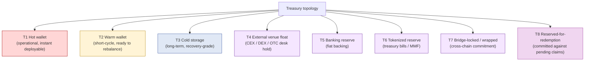
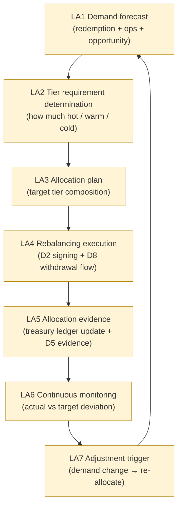
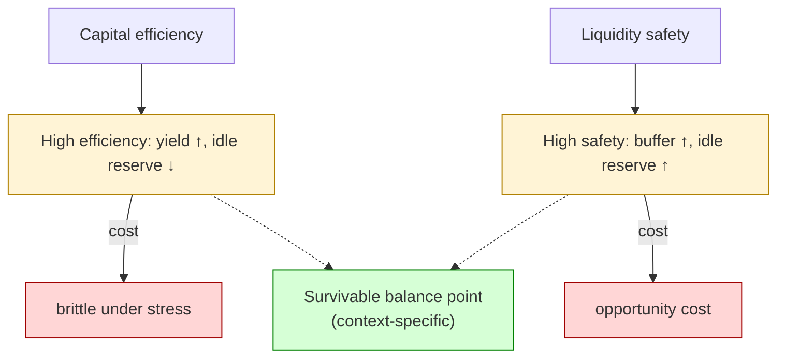
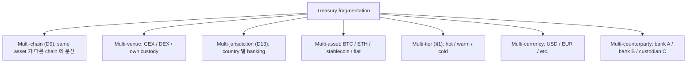
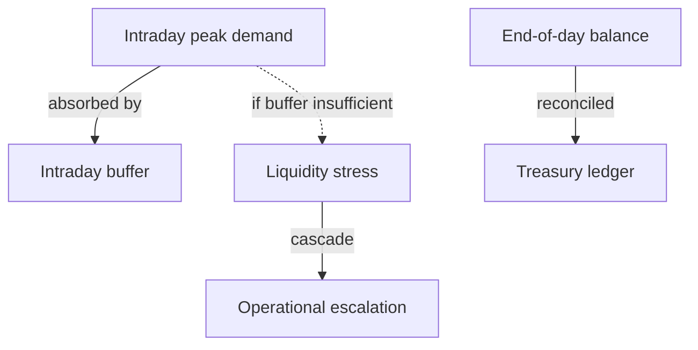
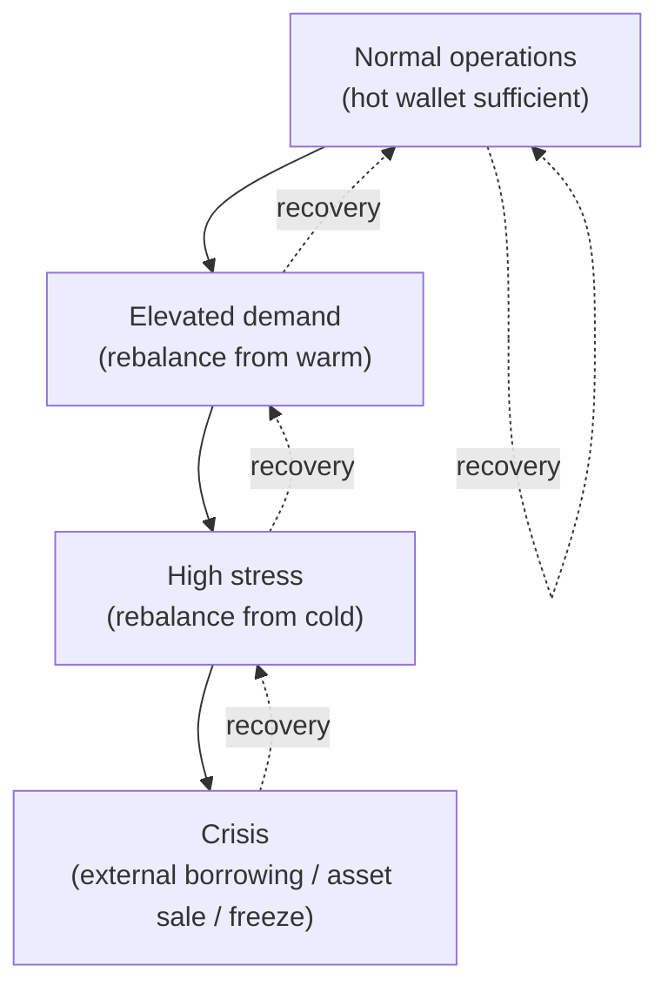

# Custody Wallet — Treasury Optimization / Capital Efficiency Reasoning

> **본 문서의 위치 (Liquidity Cluster D17)**: D10 treasury (mint/burn governance) + D13 cross-border (FX/liquidity routing) 위의 **treasury optimization 의 generalized reasoning**. Capital efficiency vs survivability 의 trade-off framework. Liquidity = stored money 가 아닌 **operationally routable settlement capacity**.

> **본 문서가 답하는 핵심 질문**: 왜 treasury optimization 이 balance maximization 가 아닌가? 왜 idle reserve 가 inefficient treasury 가 아닌가? 왜 yield generation 이 treasury optimization 와 다른가? 왜 available liquidity 가 deployable liquidity 와 다른가? 왜 treasury visibility 가 treasury mobility 보장 아닌가?

---

## 0. 핵심 명제 (10초 이해)

1. **Treasury optimization = survivable liquidity allocation under settlement / redemption / operational uncertainty** (core thesis).
2. **Liquidity = operationally routable settlement capacity, not stored balance** (cluster thesis).
3. **5-tier "≠" 명제 (D17 cluster invariant)**:
   - Capital efficiency ≠ Liquidity safety
   - Idle reserve ≠ Inefficient treasury
   - Yield generation ≠ Treasury optimization
   - Available liquidity ≠ Deployable liquidity
   - Treasury visibility ≠ Treasury mobility
4. **Treasury 의 3-state**: Allocated (committed to specific use) / Deployable (ready to route) / Idle (currently uncommitted).
5. **Settlement latency × uncertainty = liquidity buffer requirement** — instant routing 불가능 시 buffer 필수.
6. **Treasury fragmentation across venues** — single ledger 가 아닌 multi-venue distribution.
7. **Intraday liquidity ≠ End-of-day liquidity** — peak demand 의 transient 흡수 능력.
8. **Capital efficiency 의 ceiling = survivability target** — too efficient = brittle to stress.
9. **Yield ≠ Treasury return** — yield 은 single dimension, treasury return 은 risk-adjusted + liquidity-adjusted.
10. **Treasury optimization SaaS customer burden ~70%** — vendor 가 some tooling 제공해도 allocation decision + risk management 은 customer.

---

## 1. Treasury Topology

### 1.1 8 treasury tier 의 nature

| Tier | Mobility | Survivability | Yield potential |
|---|---|---|---|
| T1 Hot | High (instant) | Lowest (single key compromise → loss) | Low (operational only) |
| T2 Warm | Medium (minutes-hours) | Medium | Low-medium |
| T3 Cold | Low (hours-days) | Highest | None |
| T4 External venue | Medium-low (counterparty bound) | External counterparty risk | Variable (depends on venue) |
| T5 Banking | Low (T+1/T+2) | Banking risk | Low (bank rate) |
| T6 Tokenized reserve | Medium (token redemption) | Token issuer risk | Medium-high |
| T7 Bridge-locked | Variable (chain finality) | Bridge risk | None or token-specific |
| T8 Reserved | None (committed) | Depends on commitment | None |

### 1.2 "Treasury visibility ≠ Treasury mobility"

(§0 명제)

- Visible: dashboard 가 보여줌 (total = X).
- Mobile: 실제로 routing 가능 (deployable to where, when).
- 차이:
  - Cold storage 의 balance = visible, but mobility = hours-days (governance ceremony 필요).
  - Bridge-locked = visible, but locked until challenge period.
  - Reserved-for-redemption = visible but committed.
- → "Balance dashboard" 은 mobility 의 false sense 제공 가능.

### 1.3 Mobility-aware visibility

(★ Hypothesis — operational pattern)

- Dashboard 의 evolution:
  - L0: total balance display
  - L1: tier별 balance breakdown
  - L2: mobility-aware (deployable now / in X hours / requires governance)
  - L3: scenario-aware (under normal / stressed / crisis mobility)
- → L2-L3 이 treasury operator 의 actual decision support.

---

## 2. Liquidity Allocation Lifecycle

### 2.1 Demand forecast 의 source

| Source | 의미 |
|---|---|
| Pending redemption queue | 알려진 outflow demand |
| Historical pattern | 일반 daily / weekly demand |
| Customer-tier expectations | High-value customer 의 SLA |
| Market signal | volatility 의 demand 변동 |
| Operational requirement | ongoing ops cost |
| Opportunity capital | new product / market entry |

### 2.2 Tier allocation 의 optimization

(★ Hypothesis — operational pattern)

- 일반적 heuristic:
  - Hot wallet: 1-3 days demand (high availability, low survival)
  - Warm: 1-2 weeks demand (rebalancing rapid)
  - Cold: rest (long-term safety)
- 그러나 context-specific:
  - High-velocity custody: hot 비중 ↑
  - Low-volatility issuer: cold 비중 ↑

### 2.3 "Available liquidity ≠ Deployable liquidity"

(§0 명제)

- Available = treasury 가 balance 보유.
- Deployable = 즉시 routing 가능 (governance + signing + chain finality).
- Gap:
  - Cold storage 의 D4 ceremony 필요 (시간)
  - Cross-chain wrapped 의 bridge time
  - Banking 의 T+N latency
- → Deployable 는 시간 dimension 포함.

### 2.4 Time-bucketed deployable liquidity

(★ Hypothesis — operational metric)

- L_now: 즉시 routable (sub-second)
- L_1h: 1시간 안에 routable
- L_1d: 1 day 안에 routable
- L_1w: 1 week 안에 routable
- → 각 bucket 별 amount 가 treasury 의 multi-dimensional view.

---

## 3. Capital Efficiency vs Liquidity Safety

### 3.1 Trade-off frontier

### 3.2 "Capital efficiency ≠ Liquidity safety"

(§0 명제)

- Efficiency = yield + idle reduction.
- Safety = stress 흡수 능력 + redemption guarantee.
- Trade-off:
  - 100% efficient = 0 buffer = brittle
  - 100% safe = 100% idle = expensive
- → Optimal = context-specific (compliance / customer expectation / stress probability).

### 3.3 "Idle reserve ≠ Inefficient treasury"

(§0 명제)

- Idle reserve = currently uncommitted.
- Inefficient treasury = under-utilization without justification.
- 차이:
  - Idle 자체는 negative 아님 — strategic buffer
  - Inefficient = "더 sub-optimal allocation 가능했는데 안 했음"
- → Idle 의 strategic value 인식 필요.

### 3.4 "Yield generation ≠ Treasury optimization"

(§0 명제)

- Yield = return on invested capital.
- Treasury optimization = risk-adjusted + liquidity-adjusted + survival-adjusted return.
- 차이:
  - Pure yield maximization = treasury 의 stress 취약성 (yield 추구하다가 illiquid asset 에 lock)
  - True optimization = yield + safety + flexibility 의 multi-objective
- → Yield 는 single dimension, optimization 은 multi-dimensional.

### 3.5 Stress test 의 mandatory 성격

(★ Hypothesis — operational reasoning)

- Periodic stress test:
  - Scenario: mass redemption (50% of supply within 1 day)
  - Question: can treasury survive?
  - Answer: deployable liquidity at each time bucket
- → Stress test 가 efficiency vs safety 의 calibration.

---

## 4. Treasury Fragmentation

### 4.1 Fragmentation 의 source

### 4.2 Fragmentation 의 cost

| Cost | 의미 |
|---|---|
| Operational overhead | 각 fragment 의 monitoring + reconciliation |
| Reconciliation complexity | Cross-fragment consistency |
| Rebalancing cost | Fragment 간 movement 의 fee + time |
| Underutilization | 각 fragment 의 buffer 합 > unified treasury 의 buffer |
| Visibility gap | Aggregate view 의 reconstruction 필요 |

### 4.3 Fragmentation 의 value

| Value | 의미 |
|---|---|
| Diversification | Single point failure 회피 |
| Local availability | Customer / chain 별 즉시 routing |
| Regulatory isolation | Jurisdiction 별 separate |
| Counterparty risk diversification | Single bank/custodian failure 회피 |
| Multi-rail redundancy | Settlement rail 다양 |

### 4.4 Fragmentation 의 optimization

- Diversification + availability 의 value vs operational cost.
- Periodic consolidation 가능 (lower-tier 의 cross-fragment 통합).
- Fragment 수 의 ceiling: operational team capacity.

### 4.5 Cross-fragment reconciliation (D1b §10 의 treasury 적용)

- Total treasury = sum of fragments.
- Daily reconciliation:
  - Each fragment 의 balance retrieval
  - Sum 과 expected total 비교
  - Drift detection
- → Treasury reconciliation 의 unique aspect.

---

## 5. Intraday Liquidity

### 5.1 Intraday vs end-of-day

### 5.2 "Intraday liquidity ≠ End-of-day liquidity"

(§0 명제)

- End-of-day = aggregate balance 가 OK.
- Intraday = peak demand 시점에 sufficient liquidity.
- 차이:
  - 일 평균 demand vs 일 peak demand 의 amplitude
  - Peak 시점 에 settle 못하면 customer-facing failure
- → Intraday peak 의 sizing 이 critical.

### 5.3 Intraday peak source

| Source | 의미 |
|---|---|
| Market event | Large news → mass action |
| End-of-day batch | Periodic batch processing peak |
| Cross-jurisdictional overlap | Multiple market open 시간 동시 |
| Customer rush | Specific event 의 sudden demand |
| Liquidation cascade | Adverse market 의 forced selling |

### 5.4 Intraday buffer sizing

(★ Hypothesis — operational pattern)

- Historical peak × safety factor (예: 1.5-2x).
- Statistical (e.g. 99th percentile).
- Stress test 기반.
- → Buffer cost vs stress risk 의 calibration.

### 5.5 Intraday lending / repo

- 일부 institution: intraday peak 을 short-term lending 으로 흡수.
- Counterparty 의 intraday liquidity 활용 (repo).
- → Treasury 의 own buffer + external intraday liquidity 의 mix.

---

## 6. Liquidity Stress Routing

### 6.1 Liquidity stress 의 stage

### 6.2 Stress response playbook

| Stage | Action |
|---|---|
| Normal | Hot wallet operations |
| Elevated | Warm wallet rebalance (D2 signing) |
| High | Cold wallet activation (D4 recovery-grade governance) |
| Crisis | Reserve sale / borrowing / redemption suspension (D10 §6.4) |

### 6.3 Stress 의 cascading effect

(★ Hypothesis — systemic risk)

- Treasury stress 가 confidence loss → mass redemption (D10 §9.2).
- Mass redemption → further treasury stress → cascade.
- → Treasury stress 의 isolation + transparency 가 cascade prevention.

### 6.4 Pre-arranged liquidity sources

- Credit lines (bank lending facility)
- Repo facility
- Asset sale arrangement (pre-negotiated buyer)
- Issuer-issuer mutual support agreement

→ Crisis 대응 의 pre-positioning.

### 6.5 "Treasury visibility ≠ Treasury mobility" stress edition

- 모든 fragment balance visible, but stress 시 mobility 부족.
- 예: cold storage 의 D4 ceremony 시간 + governance approval.
- → Stress 대응 의 procedural pre-flight (runbook + drill).

---

## 7. Reserve Survivability

### 7.1 Survivability scenarios

| Scenario | Impact |
|---|---|
| Single bank failure | Multi-bank diversification dependency |
| Single chain outage | Multi-chain diversification |
| Single venue counterparty failure | Multi-venue routing |
| Mass redemption | Buffer + pre-arranged liquidity |
| Asset price crash | Reserve composition + hedging |
| Regulatory freeze | Multi-jurisdiction + legal counsel |
| Operational team failure | Knowledge management + cross-training |
| Vendor outage | Multi-vendor + own fallback |

### 7.2 Survivability vs efficiency

- Each survivability mechanism = efficiency cost:
  - Multi-bank = each bank 의 minimum balance + transaction cost
  - Multi-chain = bridge + each chain 의 gas
  - Buffer = idle reserve opportunity cost
  - Pre-arranged credit = fee
- → 100% survival 불가능 — acceptable survival target.

### 7.3 Survivability metric

(★ Hypothesis — operational target)

| Metric | 의미 |
|---|---|
| Survival duration | "X scenario 발생 시 N 일 운영 가능" |
| Recovery time | "Stress 후 normal 복귀까지 시간" |
| Mobility ratio | "1-hour-deployable / total treasury" |
| Diversification index | "max fragment / total" (lower better) |
| Stress buffer ratio | "buffer / typical-daily-demand" |

### 7.4 Operational redundancy

- 모든 critical operation 의 redundancy:
  - Multi-signer (D2 quorum)
  - Multi-RPC (D9)
  - Multi-bank (banking corridor diversity)
  - Multi-recovery custodian (D4 oversized N)

→ Single point of failure elimination.

### 7.5 "Survivability is sovereign" reasoning (D6 §4 의 treasury 적용)

- Vendor 가 사라져도 treasury 가 survive:
  - Reserve 의 ownership clarity (bankruptcy remoteness)
  - Recovery utility 의 vendor-independence
  - Multi-vendor diversification
- → Treasury sovereignty 의 핵심.

---

## 8. Operational Fragility Map

```mermaid
graph TB
    F1["F1. Liquidity fragmentation<br/>(operational overhead)"]
    F2["F2. Delayed redemption<br/>(banking / chain latency)"]
    F3["F3. Treasury deadlock<br/>(circular dependency)"]
    F4["F4. Settlement mismatch<br/>(promise vs deliver gap)"]
    F5["F5. Reserve concentration<br/>(single counterparty risk)"]
    F6["F6. Intraday liquidity exhaustion<br/>(peak underestimated)"]
    F7["F7. Stale liquidity forecast<br/>(model 가 reality 안 따름)"]
    F8["F8. Cross-chain rebalancing delay<br/>(bridge latency)"]
    F9["F9. Banking corridor failure<br/>(D13 §5.4 적용)"]
    F10["F10. Survivability drift<br/>(target buffer 의 unconscious erosion)"]

    F1 -->|mitigation| M1["Fragment consolidation + automated reconciliation"]
    F2 -->|mitigation| M2["Pre-funded buffer + multi-rail"]
    F3 -->|mitigation| M3["Dependency mapping + priority routing"]
    F4 -->|mitigation| M4["Settlement timing reconciliation + buffer"]
    F5 -->|mitigation| M5["Diversification policy + concentration metric"]
    F6 -->|mitigation| M6["Statistical buffer sizing + stress test"]
    F7 -->|mitigation| M7["Continuous re-forecast + model validation"]
    F8 -->|mitigation| M8["Multi-chain hot wallet + bridge SLA monitoring"]
    F9 -->|mitigation| M9["Multi-bank + crypto rail fallback (D13)"]
    F10 -->|mitigation| M10["Buffer policy + periodic review + alert on drift"]
```

### 8.1 분류

| 분류 | items | 성격 |
|---|---|---|
| **Structural** | F1, F3, F5 | architectural |
| **Temporal** | F2, F4, F6, F8 | settlement timing |
| **Forecast** | F7 | modeling discipline |
| **External** | F9 | environment |
| **Discipline** | F10 | governance |

---

## 9. Limitations

### 9.1 Capital efficiency ≠ Liquidity safety

§3.2. Multi-objective optimization.

### 9.2 Idle ≠ Inefficient

§3.3. Strategic value of buffer.

### 9.3 Yield ≠ Optimization

§3.4. Single dimension vs multi-dimensional.

### 9.4 Available ≠ Deployable

§2.3. Time dimension.

### 9.5 Visibility ≠ Mobility

§1.2. Dashboard 의 false sense.

### 9.6 Liquidity model assumptions

- Demand forecast 의 model assumption (historical pattern).
- 새로운 scenario (black swan) 미반영 가능.
- → Continuous validation + scenario test.

### 9.7 Optimization 의 unintended consequence

- Optimal allocation 의 sub-optimal under stress.
- 예: low-yield "useless" reserve 가 crisis 시 가치 증가.

---

## 10. 3-way Treasury Optimization Burden

### 10.1 Plane × Ownership

| 영역 | SaaS | Hosted MPC | Direct-build |
|---|---|---|---|
| Demand forecast | Customer | Customer | Customer |
| Tier allocation policy | Customer | Customer | Customer |
| Rebalancing execution | Vendor + customer | Customer | Customer |
| Multi-fragment reconciliation | Vendor data + customer | Customer | Customer |
| Stress test | Customer | Customer | Customer |
| Yield strategy | Customer | Customer | Customer |
| Treasury team | Customer | Customer | Customer |
| Banking corridor | Customer | Customer | Customer |

### 10.2 Customer treasury burden (★ Hypothesis)

- SaaS: ~70% (vendor 가 rebalancing execution; nearly all decision + strategy 는 customer)
- Hosted: ~85%
- Direct-build: ~100%

### 10.3 Recommendation

| Context | 권장 |
|---|---|
| Simple operations, low volume | Minimal treasury (hot + cold) + SaaS |
| Medium scale, multi-asset | Dedicated treasury team + multi-tier + Hosted MPC |
| Large institutional | Treasury department + risk function + stress test + multi-vendor |
| Stablecoin issuer | Treasury committee + reserve composition + PoR (D15) + continuous monitor |

---

## 11. Q1-Q10 Reasoning

### Q1. Treasury optimization ≠ Balance maximization

§0.1. Survivable allocation under uncertainty.

### Q2. Idle ≠ Inefficient

§3.3. Strategic buffer.

### Q3. Yield ≠ Optimization

§3.4. Single vs multi-dimensional.

### Q4. Available ≠ Deployable

§2.3. Time bucket.

### Q5. Visibility ≠ Mobility

§1.2. Dashboard false sense.

### Q6. Intraday ≠ End-of-day

§5.2. Peak vs aggregate.

### Q7. Fragmentation trade-off

§4. Diversification value vs operational cost.

### Q8. Stress response staging

§6. Normal → Elevated → High → Crisis playbook.

### Q9. Survivability vs efficiency

§7.2. 100% 불가능 — acceptable target.

### Q10. Treasury sovereignty

§7.5. Vendor independence 의 treasury 측면.

---

## 12. Open Questions / Org Policy

| 영역 | 질문 |
|---|---|
| Tier allocation policy | hot / warm / cold ratio? |
| Buffer sizing methodology | historical / statistical / stress? |
| Yield strategy | conservative / aggressive? |
| Fragment count target | minimum / maximum? |
| Rebalancing frequency | daily / weekly? |
| Stress test scenarios | which? frequency? |
| Multi-bank policy | how many? per jurisdiction? |
| Multi-chain hot wallet | per chain? |
| Pre-arranged credit | with whom? amount? |
| Insurance | scope? |
| Reserve composition | cash / treasury / corporate? |
| Recovery time objective (RTO) | per scenario? |
| Customer-tier SLA | per tier? |
| Counterparty exposure limit | per counterparty? |
| Concentration threshold | max fragment % |
| Operational team sizing | per scale? |
| Treasury reporting cadence | daily / weekly? |
| Hedging policy | currency / asset? |
| Yield-bearing reserve % | maximum? |
| Survivability target | days of buffer? |

---

## 13. References + Uncertainty Boundary + Bridge

### 관련 wiki

| 참조 |
|---|
| [[docs/architecture/treasury-reserve-mint-burn]] §3 (treasury wallet vs reserve) |
| [[docs/architecture/recovery-ceremony-generalization]] §3 (cold storage governance) |
| [[docs/architecture/withdrawal-lifecycle]] §5 (balance state model) |
| [[docs/architecture/cross-border-settlement-fx-liquidity]] §4 (liquidity routing) |
| [[docs/architecture/three-way-custody-decision-framework]] §11 (operational maturity) |

### Uncertainty Boundary

- 8 treasury tier / 4-time-bucket deployable / 7 fragmentation source / 4 stress stage / 5 survivability metric / 10 fragility / 70% burden = **generalized treasury architecture pattern (Hypothesis ★)**.
- §2.4 time-bucket / §7.3 survivability metric = operational reasoning.
- §10.2 burden 백분율 = estimate.
- §12 에 org policy 영역 명시.

### D18 Bridge Invariants (D17 → D18)

D17 의 핵심 산출 + D18 으로의 bridge:

1. **Omnibus liquidity semantics** — Treasury fragmentation 의 reduction 으로 omnibus 가 emerge. Single account 의 multiple beneficial owner pattern → D18.
2. **Pooled reserve coordination** — Single pool 의 multi-customer claim 의 reconciliation → D18.
3. **Settlement batching requirement** — Multi-fragment rebalancing 의 batch optimization → D18 clearing.
4. **Internalized settlement need** — Cross-customer transfer 가 own treasury 안에 stay 가능 → D18 internalized.
5. **Treasury routing complexity** — Multi-tier × multi-fragment 의 routing optimization → D18-D19.

### Cluster D17→D18→D19→D20 progression

- D17 (this): treasury optimization + capital efficiency
- D18 (next): omnibus + clearing + prime brokerage
- D19: internal netting + internal settlement
- D20 (closing): cross-institution liquidity coordination

---

**Stage 32 D17 completion timestamp**: 2026-05-20.
