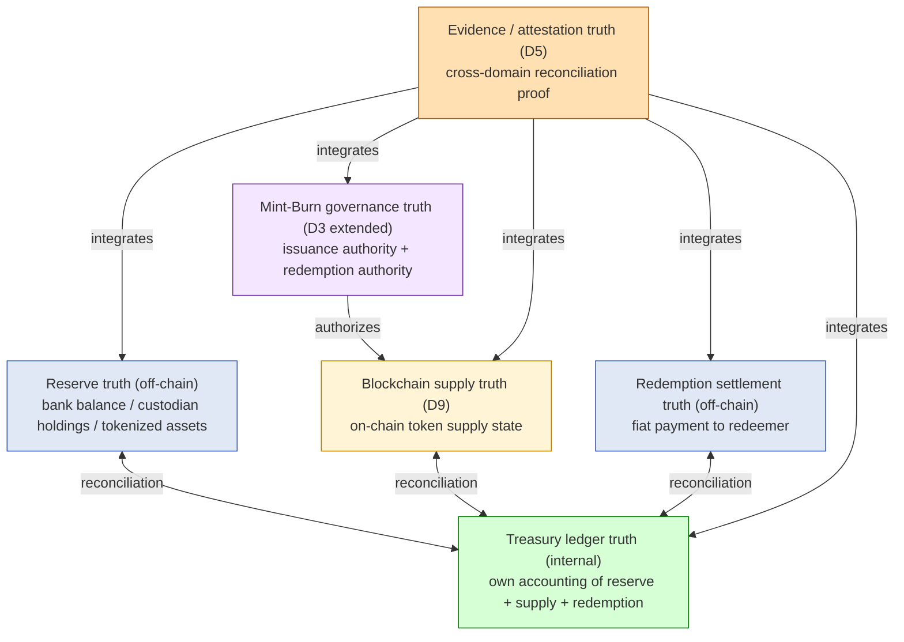
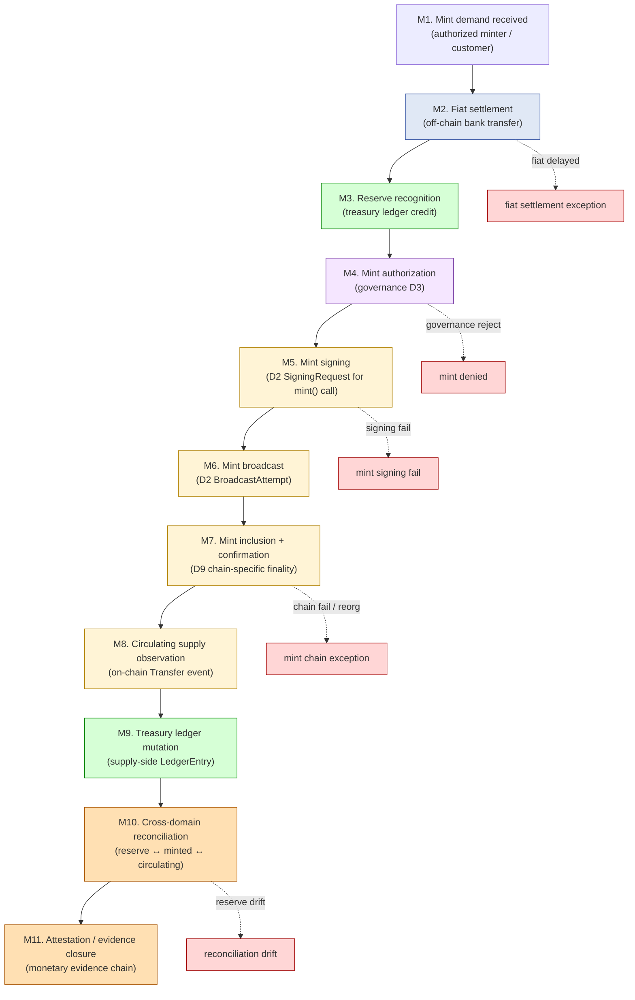
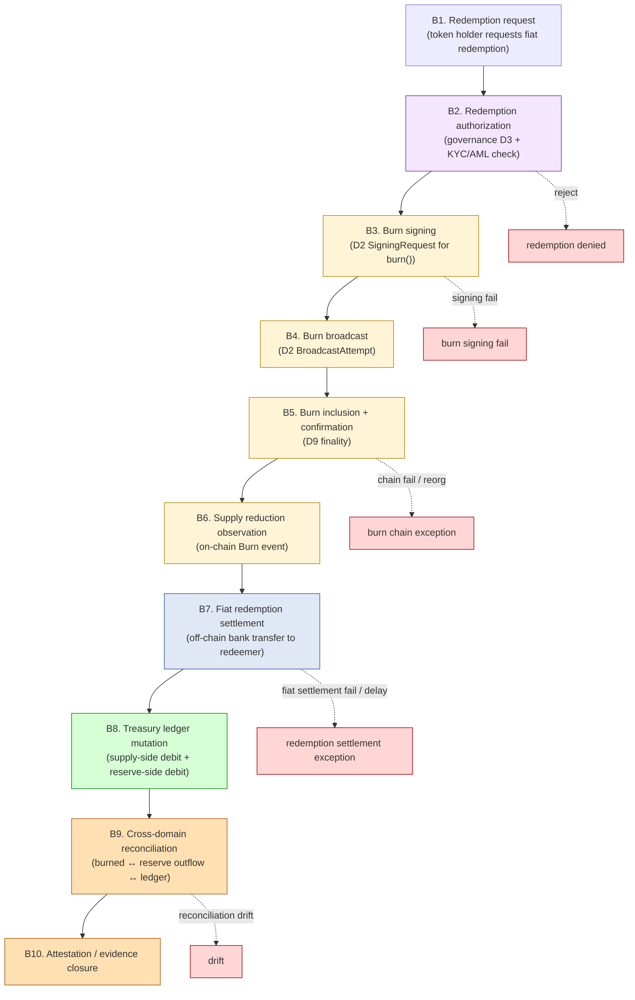
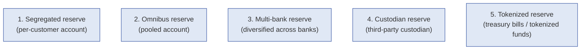
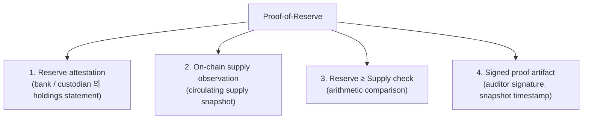
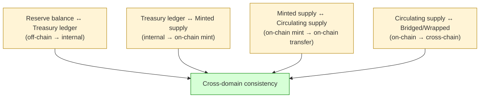
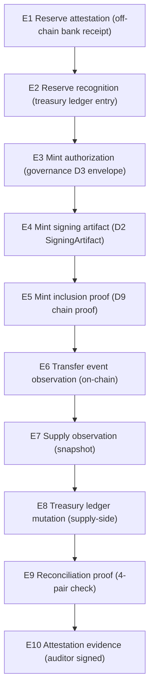
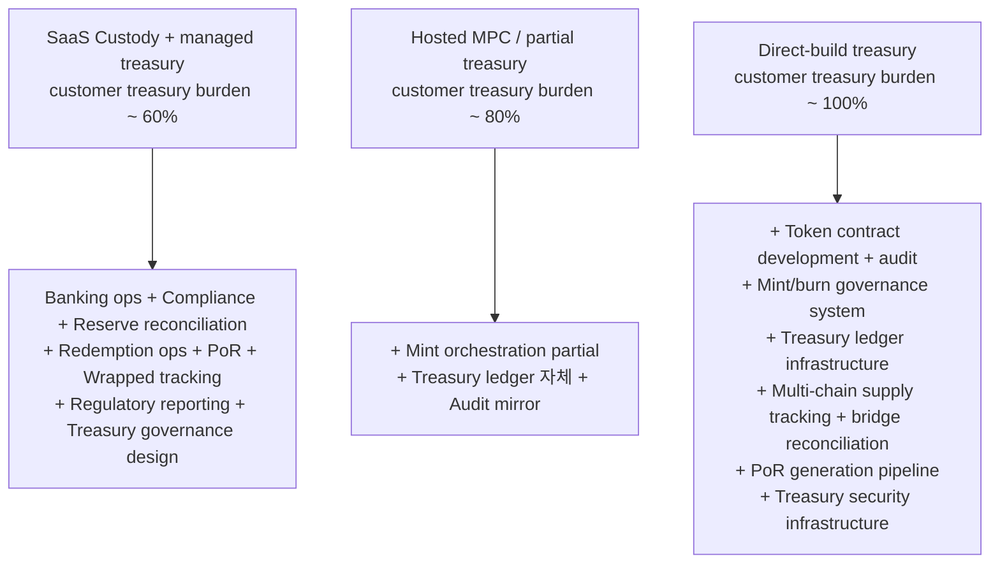

# Custody Wallet — Treasury / Reserve / Mint-Burn Architecture Reasoning

> **본 문서의 위치**: D1a-D9 의 generalized custody skeleton + multi-chain specialization 위에서 **stablecoin / tokenized money / reserve-backed asset** 영역으로 specialize. Off-chain reserve world 와 on-chain token world 의 **synchronized monetary state management** 가 본질. Custody governance (D3) + reconciliation (D1b) + evidence (D5) + multi-chain (D9) 의 monetary application.

> **본 문서가 답하는 핵심 질문**: 왜 stablecoin 은 단순 "token mint/burn" 이 아닌가? 왜 reserve 가 충분해도 redemption 이 보장 안 되는가? 왜 proof-of-reserve 가 solvency proof 가 아닌가? 왜 wrapped / bridged supply 가 monetary system 의 가장 위험한 fragility 인가? 왜 monetary governance 가 custody governance + financial governance 의 결합인가?

---

## 0. 핵심 명제 (10초 이해)

1. **Stablecoin issuance is not token minting. It is synchronized multi-domain monetary state management.** — 본 문서의 thesis.
2. **6 truth domains** — Reserve / Treasury Ledger / Mint-Burn Governance / Blockchain Supply / Redemption Settlement / Evidence/Attestation. 각각 다른 authority + 다른 reconciliation cadence.
3. **10-tier "≠" 명제** — mint request / burn request / reserve balance / treasury wallet / proof-of-reserve 등이 각각의 finality / ownership / proof / completeness 와 분리.
4. **5 reserve model** — Segregated / Omnibus / Multi-bank / Custodian / Tokenized 각각 governance + reconciliation + insolvency risk + operational burden 다름.
5. **6 supply type** — Total minted / Treasury-held / Circulating / Locked / Bridged / Wrapped 각각 다른 economic 의미.
6. **Proof-of-reserve ≠ Solvency proof** — assets snapshot 이지 liabilities + redeemability 보장 아님.
7. **Monetary governance = custody governance + financial governance** — 단일 domain 아닌 결합.
8. **Wrapped supply explosion** — same monetary unit 이 cross-chain 으로 multiple wrapping → reconciliation complexity 폭증.
9. **Off-chain settlement risk irreducible** — banking dependency / regulatory freeze / fiat settlement delay 는 system 외부.
10. **Stablecoin issuance = money-state evidence system** — output 은 token mint 뿐 아니라 cross-domain monetary evidence chain.

---

## 1. 6 Truth Domains for Treasury



### 1.1 6 domain 의 authority

| Domain | Authority for | Trust class |
|---|---|---|
| **Reserve truth** | "underlying asset 얼마 있는가" | Bank statement + custodian attestation (third-party) |
| **Treasury ledger truth** | "internal accounting 의 view" | Own (full control) |
| **Mint-Burn governance truth** | "발행 / 소각 허가됐는가" | Own governance (D3) |
| **Blockchain supply truth** | "on-chain token supply 얼마" | Blockchain (settlement authority) |
| **Redemption settlement truth** | "redeemer 에게 fiat 전달됐는가" | Bank + own ops (third-party + own) |
| **Evidence/attestation truth** | "cross-domain consistency 입증됐는가" | Own + auditor (third-party validation) |

### 1.2 D1b 5-truth domain 과의 비교

D1b 의 5-truth (Blockchain / Ledger / Governance / Signing / Recovery) 와 본 문서의 6-truth 의 차이:
- D1b 의 Recovery → 본 문서에 없음 (treasury 의 recovery 는 D4 의 직접 적용, separate 안 함)
- D1b 의 Signing → 본 문서에 implicit (Mint-Burn governance 안에 내포)
- 본 문서의 **Reserve / Redemption settlement** = D1b 에 없는 **off-chain financial truth**.
- 본 문서의 Reserve / Redemption = third-party trust class — 가장 어려운 영역.

### 1.3 Authority phase dependence

같은 mint operation 도 phase 별 authority 다름:

| Phase | Authority |
|---|---|
| Pre-fiat | None (potential demand) |
| Fiat received | Reserve (bank confirms) |
| Reserve recognized | Treasury ledger |
| Mint authorized | Governance |
| Mint executed | Signing → Blockchain |
| Supply observed | Blockchain |
| Treasury ledger updated | Treasury |
| Reconciled | Cross-domain consistency |

---

## 2. Mint Lifecycle



### 2.1 Mint 의 11 phase domain mapping

| Phase | Domain | Authority |
|---|---|---|
| M1 Demand | (none yet) | — |
| M2 Fiat settlement | Reserve | Bank |
| M3 Reserve recognition | Treasury ledger | Own |
| M4 Mint authorization | Governance | D3 quorum |
| M5 Mint signing | Signing | D2 |
| M6 Mint broadcast | Signing → Blockchain | D2 + D1b |
| M7 Inclusion + confirmation | Blockchain | D9 chain-specific |
| M8 Supply observation | Blockchain | D7 (Transfer event) |
| M9 Ledger mutation | Treasury ledger | Own |
| M10 Reconciliation | Cross-domain | D1b |
| M11 Evidence closure | Evidence | D5 |

### 2.2 "Mint request ≠ Supply increase finality"

(§0 명제)

- M1 mint demand → 모든 phase 통과해야 supply increase final.
- 각 phase 의 failure point:
  - M2 fiat 지연 / 실패
  - M3 reserve 인식 mismatch
  - M4 governance reject
  - M5 signing fail
  - M6-M7 chain reject / reorg
  - M10 reconciliation drift
- → Mint request 의 success ≠ on-chain finality + cross-domain reconciliation.

### 2.3 Off-chain ↔ on-chain phase split

```
Off-chain phase: M1, M2, M3, M11 (partial)
On-chain phase: M5, M6, M7, M8
Hybrid: M4 (authorization, with cryptographic envelope), M9 (ledger projection), M10 (reconciliation)
```

→ Off-chain phase 의 latency / failure 가 on-chain phase 와 다른 SLA. 특히 M2 fiat settlement 의 banking dependency.

### 2.4 Pre-mint reserve recognition 정책

- "Reserve 들어왔다고 인식" 의 timing:
  - Bank wire received notification 시 (early, banking risk)
  - Bank statement reconciliation 시 (late, safer)
  - Multi-bank confirmation (extra check)
- → Pre-mint recognition policy = off-chain reserve trust 의 결정.

---

## 3. Burn / Redemption Lifecycle



### 3.1 Burn 의 phase domain mapping

| Phase | Domain | Authority |
|---|---|---|
| B1 Request | Identity (D1a L1) | Customer |
| B2 Authorization | Governance + Compliance | D3 + AML/KYC |
| B3-B5 Burn execution | Signing + Blockchain | D2 + D9 |
| B6 Supply observation | Blockchain | D7 |
| B7 Fiat settlement | Off-chain | Bank |
| B8 Ledger mutation | Treasury | Own |
| B9 Reconciliation | Cross-domain | D1b |
| B10 Evidence | Evidence | D5 |

### 3.2 "Burn request ≠ Supply reduction finality" + "Redemption request ≠ Settlement completion"

- Burn execution (B3-B5) 완료 = on-chain supply 감소.
- 그러나 redemption completion (B7) = fiat 가 redeemer 에 도착.
- 두 phase 사이의 banking delay / fail 위험.
- → Customer 의 "I want my money back" 의 의도가 B7 까지 가야 완료.

### 3.3 "Token existence ≠ Redeemability"

(§0 명제)

- Token holder 의 token 보유 = on-chain fact.
- Redeemability:
  - KYC 통과 (B2)
  - Compliance gate (sanctions / freeze list)
  - Treasury 의 사용 가능 fiat 잔액
  - Banking infrastructure 의 transfer 가능
- → Token 있어도 redemption 거부 / 지연 가능. 이는 stablecoin 의 inherent property.

### 3.4 Redemption suspension scenario

- Mass redemption (run on the bank) 시:
  - Banking infrastructure overload
  - Reserve liquidity constraint
  - Regulatory freeze
- Issuer 의 정책: redemption suspension 가능 (terms of service 에 명시).
- → Token holder 는 issuance 시 이 risk 를 인지해야.

### 3.5 Burn 의 race condition

- Token holder 가 token 을 다른 wallet 으로 transfer 한 후 burn 시도 → fail.
- 또는 burn signing 진행 중 token transfer → race.
- Mitigation: pre-burn lock (token holder 의 wallet 의 transfer freeze) — chain-specific.

---

## 4. Reserve Architecture (5 model)



### 4.1 5 model 비교

| Model | Governance | Reconciliation | Insolvency risk | Operational burden | Evidence burden |
|---|---|---|---|---|---|
| **Segregated** | Per-customer attestation | Per-customer reconciliation | Customer 의 own (bankruptcy remote) | Heavy (account per customer) | Per-customer |
| **Omnibus** | Pooled attestation | Single pool reconciliation | Pool 의 bankruptcy risk | Light | Single |
| **Multi-bank** | Distributed | Cross-bank reconciliation | Diversified (no single bank failure) | Medium-heavy | Cross-bank |
| **Custodian** | Custodian's attestation | Custodian audit | Custodian's bankruptcy risk | Medium | Custodian-dependent |
| **Tokenized** | On-chain attestation | On-chain reconciliation | Tokenization risk (issuer 의 token) | Medium | On-chain native |

### 4.2 "Reserve segregation ≠ Bankruptcy remoteness"

(§0 명제)

- Segregated account 자체 = bookkeeping segregation.
- Bankruptcy remoteness = customer asset 가 bank 의 채권자에게 노출 안 되는 legal property.
- 둘은 다른 layer:
  - Segregation 만 있고 bankruptcy remoteness 없으면 → bank insolvency 시 customer asset 가 다른 채권자와 함께 wait
  - Bankruptcy remoteness 는 legal structure (trust / custody account / regulatory regime) 의 함수
- → Segregation 은 necessary but not sufficient.

### 4.3 "Treasury wallet ≠ Reserve ownership"

(§0 명제)

- Treasury wallet = treasury 의 on-chain operational wallet (e.g. minting authority address).
- Reserve = off-chain underlying assets.
- 둘은 다른 substance — treasury wallet 의 자산 = own token (자기 자신이 만든 token), reserve 가 별도 존재.

### 4.4 Tokenized reserve 의 특별 위험

(★ Hypothesis — emerging pattern)

- Treasury bill tokenization (예: BlackRock BUIDL, Ondo) 의 reserve:
  - On-chain tokenized treasury bill
  - 추가 trust layer (tokenization issuer + underlying treasury bill)
- 위험:
  - Tokenization issuer 의 own risk
  - Tokenized asset 의 redeemability (issuer 가 underlying redeem 가능?)
  - Cross-chain wrapped 시 multiplicative risk
- → Tokenized reserve 는 efficiency gain 이지만 trust layer 추가.

### 4.5 Reserve composition policy

(★ Org policy)

- Reserve 가 100% cash 가 아닌 경우:
  - Treasury bills (low-risk, yield)
  - Commercial paper (higher yield, more risk)
  - Other securities
- Composition 의 trade-off:
  - High yield → run-on-bank 시 liquidity 부족
  - 100% cash → no yield, opportunity cost
- Composition 정책 + transparency = issuer 의 governance 결정.

---

## 5. Supply Semantics (6 type)

### 5.1 6 supply type 분리

```mermaid
graph TB
    SUP["Total minted supply"]

    SUP -->|treasury holds| TH["Treasury-held supply"]
    SUP -->|customer holds, transferable| CIRC["Circulating supply"]
    SUP -->|locked (vesting/contract)| LOCK["Locked supply"]
    SUP -->|bridged to other chains| BRIDGE["Bridged supply"]
    SUP -->|wrapped on other systems| WRAP["Wrapped supply"]

    classDef supply fill:#fff4d6,stroke:#b08000
    classDef circ fill:#d6ffd6,stroke:#008000
    classDef restricted fill:#e0e8f5,stroke:#3050a0
    classDef external fill:#ffd6d6,stroke:#a00000
    class SUP supply
    class CIRC circ
    class TH,LOCK restricted
    class BRIDGE,WRAP external
```

### 5.2 각 supply type 의 의미

| Supply | 정의 | Reserve backing 의무? |
|---|---|---|
| Total minted | 모든 mint event 의 누적 | Yes (모든 backing needed) |
| Treasury-held | Issuer 의 treasury wallet 의 token | Self-circular (자기가 보유) |
| Circulating | 외부에 전달된 token, free transferable | **Yes — 가장 중요한 backing 대상** |
| Locked | vesting / contract lock / staking 등 | Yes (locked 되었지만 redeemable when unlocked) |
| Bridged | Same token, source chain → destination chain (locked at source, minted at destination) | Source 의 reserve backing 그대로 |
| Wrapped | Different token, third-party wrapping | **Independent backing** — 새로운 issuer 의 risk |

### 5.3 "Circulating supply ≠ Total minted"

- Total minted = mint event 누적.
- Circulating = treasury-held 와 locked 를 제외한 spendable supply.
- 일반적으로 circulating 이 economic backing 의 주된 대상 (treasury 가 자기 자신을 backing 할 필요 없음).

### 5.4 Bridged supply 의 reconciliation (D9 §7 의 monetary 측면)

- Source chain: lock event (treasury 의 backing 이전 안 됨, lock 만)
- Destination chain: mint event (wrapped/bridged token)
- → Treasury 의 reserve 는 lock 시점에 그대로 (이전 안 됨, just locked).
- Reconciliation: source lock supply + destination mint supply = expected.

### 5.5 Wrapped supply 의 위험

(§0 명제)

- "Wrapped" = third-party issuer 가 own token 을 만들어 underlying 을 backing 하겠다고 함.
- 예: WBTC 는 BitGo 가 BTC 를 backing 하는 wrapped.
- 위험:
  - Wrapper issuer 의 own risk (insolvency / bug / governance attack)
  - Wrapper 의 backing 실제로 있는가? (proof-of-reserve 의 한계)
  - Wrapped token 이 wrapping 되어 multiple-wrap (예: USDT → wrapped USDT on chain X → bridged to chain Y → wrapped 다시 on chain Z) → multiplicative risk
- → Wrapped supply 의 explosion 이 stablecoin system 의 가장 어려운 reconciliation.

### 5.6 "Wrapped asset ≠ New economic backing"

- Wrapped token 의 생성 시 reserve 가 추가되지 않음 — underlying 의 backing 재사용.
- 그러나 wrapped token 의 holder 는 wrapper issuer 를 trust 해야 함.
- → Same underlying 의 multiple wrap 은 trust 의 nested chain — fragility 누적.

---

## 6. Treasury Governance

(D3 의 treasury extension)

### 6.1 Treasury-specific governance event

| Event | Approval 의무 |
|---|---|
| Mint authorization | Issuance authority quorum |
| Burn / redemption authorization | Redemption authority quorum + KYC/AML |
| Reserve rebalancing | Treasury committee |
| Mint cap policy update | Board / senior governance |
| Redemption suspension | Emergency authority |
| Reserve composition change | Treasury committee + audit |
| Treasury wallet rotation | Recovery + senior governance |
| Bridge whitelist update | Risk committee |
| Wrapping issuer trust | Risk committee |

### 6.2 "Monetary governance = custody governance + financial governance"

(§0.7)

| Dimension | Custody governance | Financial governance |
|---|---|---|
| Approver | Operations team | Treasury / CFO / compliance |
| SLA | minutes-hours | hours-days |
| Audit | governance audit | financial audit (auditor) |
| Quorum threshold | M-of-N admin | M-of-N treasury committee |
| Break-glass | operational emergency | financial crisis (run-on-bank) |

→ Two governance layers 가 stack — 단일 D3 SM 아닌 layered governance.

### 6.3 Mint cap policy

- "지금 더 mint 가능한가" 의 정책:
  - Hard cap (총 supply limit)
  - Velocity cap (시간 단위 mint 제한)
  - Reserve ratio cap (reserve : supply 의 minimum)
- → Cap 의 결정은 financial governance + risk management.

### 6.4 Emergency freeze authority

- Stablecoin contract 의 freeze function (compliance freeze, blacklist):
  - Specific address 의 token transfer 차단
  - Sanctioned address (OFAC) 대응
  - 사고 token 회수
- → Emergency authority 의 abuse vector — break-glass governance (D3 §6) 보다 strict.

### 6.5 Treasury wallet rotation

(D4 의 monetary 측면)

- Treasury wallet 의 key compromise / suspicion 시 rotation:
  - New wallet generation
  - Migration of token authority (contract upgrade or admin function)
  - On-chain authority transfer
- → Treasury wallet rotation = stablecoin issuer 의 recovery ceremony.

---

## 7. Proof-of-Reserve (PoR) and Its Limitations

### 7.1 PoR 의 4 component



### 7.2 "Proof-of-reserve ≠ Solvency proof"

(§0 명제)

- PoR 은 **assets snapshot** — 특정 시점의 reserve = X, supply = Y, X ≥ Y.
- Solvency = assets - liabilities ≥ 0 — liabilities 포함.
- 차이:
  - PoR 은 token holders 의 redemption 의무 (liability) 측면을 부분만 capture (supply = liability proxy)
  - Other liabilities (대출, 채무, 운영비) 는 미포함
  - → PoR 통과해도 insolvent 가능
- 진정한 solvency proof = Proof-of-Reserve + Proof-of-Liabilities (보통 zero-knowledge proof of liabilities).

### 7.3 "Attestation ≠ Real-time solvency"

- Attestation = snapshot at time t.
- 그 다음 순간 reserve outflow / supply increase 가능 → solvency 변화.
- Snapshot freshness = PoR 의 핵심 SLA — old PoR 는 useless.

### 7.4 "Snapshot equality ≠ Continuous integrity"

- Snapshot 시점에 reserve = supply.
- 그러나 snapshot 사이의 임의 시점에 drift 가능 (small drift × time).
- Continuous integrity = 매 mint / burn event 의 evidence chain + 즉시 reconciliation.
- → PoR 빈도 (quarterly / monthly / daily / real-time) 가 trust 의 결정.

### 7.5 PoR 의 trust nest

(★ Hypothesis — operational reasoning)

- Reserve attestation = bank / custodian 의 signed statement.
- 그러나 그 statement 가 진실인가?
  - Auditor 의 verification (Big 4 의 auditor 의 trust)
  - Auditor 의 own risk (bias, error, fraud)
  - Bank / custodian 의 own risk
- → PoR 의 trust chain = issuer + auditor + bank/custodian 의 nested trust.

### 7.6 ZK-based PoR

(★ Hypothesis — emerging pattern)

- Zero-knowledge proof 로 reserve + liabilities 의 verification:
  - Reserve 가 X 이상 (zkp 로 증명)
  - Liabilities (token holder balance 합) 의 zkp
  - Privacy 보호하면서 solvency proof
- 현재 emerging — 완성된 standard 아님.
- 가능성: real-time + privacy-preserving solvency proof.

---

## 8. Cross-domain Reconciliation

### 8.1 Reconciliation 의 4-pair check



### 8.2 4 pair 의 detail

| Pair | Reconciliation 방법 |
|---|---|
| Reserve ↔ Treasury ledger | Daily bank statement reconciliation; manual + automated |
| Treasury ledger ↔ Minted supply | Per mint event audit chain; M4-M9 lineage |
| Minted supply ↔ Circulating supply | On-chain Transfer event accumulation - treasury-held |
| Circulating ↔ Bridged/Wrapped | Cross-chain indexer + bridge attestation + wrapper issuer attestation |

### 8.3 Reconciliation latency

| Domain | Cadence |
|---|---|
| Reserve ↔ Treasury | Daily (bank statement) |
| Treasury ↔ Minted | Real-time (per mint event) |
| Minted ↔ Circulating | Real-time (per Transfer event) |
| Circulating ↔ Bridged | Hourly-daily (cross-chain reconciliation) |
| Circulating ↔ Wrapped | Daily (wrapper attestation cadence) |

→ Reconciliation 의 가장 slow link 가 effective real-time consistency 의 ceiling.

### 8.4 Drift accumulation

- 매 reconciliation 의 small drift (rounding / timing / fee 소실 등) 가 누적.
- 누적 drift 가 threshold 초과 시 incident.
- Mitigation: 정기 full reconciliation + delta investigation.

### 8.5 Cross-chain wrapped supply explosion

(★ §0.8 핵심 reasoning)

```
USDT (Ethereum native)
  → bridged USDT to Tron, BSC, Polygon, Avalanche, ... (10+ chains)
    → wrapped USDT on each chain (third-party wrappers)
      → bridged again to L2s, sidechains, ...
```

→ Effective monetary state = source 의 reserve × N chain × M wrapper layer.
→ Reconciliation complexity exponentially explodes.
→ 모든 layer 의 trust chain 이 source issuer 의 solvency 위에 stack.

---

## 9. Treasury Risk Map

```mermaid
graph TB
    T1["T1. Bank failure<br/>(reserve holdings 의 banking risk)"]
    T2["T2. Treasury compromise<br/>(treasury wallet key compromise)"]
    T3["T3. Unauthorized mint<br/>(governance bypass)"]
    T4["T4. Redemption freeze<br/>(banking / regulatory / liquidity)"]
    T5["T5. Reserve drift<br/>(reconciliation gap 누적)"]
    T6["T6. Delayed fiat settlement<br/>(banking infrastructure)"]
    T7["T7. Wrapped supply mismatch<br/>(third-party wrapper bug)"]
    T8["T8. Bridge insolvency<br/>(bridge halt → bridged supply abandoned)"]
    T9["T9. Emergency governance abuse<br/>(unauthorized freeze)"]
    T10["T10. Regulatory freeze<br/>(license revocation, asset freeze order)"]

    T1 -->|mitigation| M1["Multi-bank diversification + bankruptcy remoteness"]
    T2 -->|mitigation| M2["MPC + recovery ceremony + rotation policy"]
    T3 -->|mitigation| M3["Multi-layer governance + cap policy + monitoring"]
    T4 -->|mitigation| M4["Liquidity ratio + redemption SLA + transparency"]
    T5 -->|mitigation| M5["Frequent reconciliation + delta investigation"]
    T6 -->|mitigation| M6["Multi-bank rail + same-day settlement"]
    T7 -->|mitigation| M7["Wrapper whitelist + monitoring + attestation requirement"]
    T8 -->|mitigation| M8["Bridge diversification + insurance + monitoring"]
    T9 -->|mitigation| M9["Multi-sig emergency authority + post-hoc review SLO"]
    T10 -->|mitigation| M10["Multi-jurisdiction + legal counsel + compliance integration"]
```



### 9.1 Risk 분류

| 분류 | items | 성격 |
|---|---|---|
| **Banking** | T1, T6 | external, partially mitigable |
| **Cryptographic** | T2 | mitigable (D4) |
| **Governance** | T3, T9 | mitigable (D3) |
| **Operational** | T4, T5 | mitigable |
| **External-dependency** | T7, T8 | partially mitigable, irreducible |
| **Regulatory** | T10 | irreducible |

### 9.2 Mass redemption 시 cascade

(★ Hypothesis — systemic risk)

```
T4 (redemption freeze risk) trigger
  → loss of confidence
    → mass redemption demand
      → bank wire infrastructure overwhelm (T6)
        → liquidity stress (treasury sell reserve assets at discount)
          → reserve drift (T5) 가속
            → run-on-bank
              → potential insolvency
```

→ Stablecoin 의 systemic risk = banking-style run-on-bank. Mitigation: liquidity buffer + transparency + multi-bank + insurance.

---

## 10. Monetary Evidence Chain

(D5 의 monetary 측면)

### 10.1 Mint evidence chain (per mint)



### 10.2 Monetary evidence 의 unique aspects

| Aspect | 의미 |
|---|---|
| **Cross-system evidence** | banking + custody + chain + reconciliation 모두 포함 |
| **Multi-domain timestamps** | banking T+1/T+2 vs chain second-scale |
| **Third-party attestation** | auditor / bank / custodian 의 signed evidence |
| **Long retention** | 규제 7-10년 + audit history |
| **Public attestation** | PoR 가 public 인 경우 (transparency) |

### 10.3 Evidence chain integrity 가 monetary system 의 본질

(§0.10)

- Stablecoin issuer 의 가장 valuable output:
  - Token 자체 (commodity)
  - Evidence chain (trust 의 foundation)
- 후자가 issuer 의 long-term viability 결정.

---

## 11. Limitations

### 11.1 Proof-of-reserve ≠ Continuous solvency proof

§7. Snapshot 의 한계. Real-time solvency 보장 안 함.

### 11.2 Reserve equality ≠ Instant redeemability

- Reserve 가 sufficient 해도 redemption infrastructure (bank, KYC, compliance) 가 fast 한 것은 별개.
- Holder 가 token 보유 = redeem 가능 보장 아님 (§3.3).

### 11.3 Mint cap ≠ Economic safety

- Cap 은 운영 throttle.
- 그러나 economic safety = backing 의 quality + liquidity + governance + transparency.
- Cap 만으로 safe 보장 안 함.

### 11.4 Wrapped supply ≠ Independent reserve backing

§5.5, §5.6. Wrapped 는 underlying 의 derivative; new backing 추가 아님.

### 11.5 Banking dependency

- Stablecoin issuer 의 fundamental dependency:
  - Bank infrastructure (wire transfer, custody)
  - Banking license / regulatory access
  - Banking insurance (FDIC 등)
- Banking partner 의 own risk = issuer 의 risk.

### 11.6 Regulatory freeze irreducibility

- Regulator 의 freeze order 시 issuer 의 option 제한:
  - Comply (asset freeze)
  - Challenge (legal procedure, longer)
- → Regulatory risk 는 issuer 의 own control 밖.

### 11.7 Off-chain settlement risk

- M2 fiat settlement + B7 redemption settlement = banking infrastructure dependent.
- T+0/T+1/T+2 의 latency variance.
- Settlement fail 시 cross-domain consistency 위협.

---

## 12. SaaS vs Hosted vs Direct-build Treasury Burden

### 12.1 Treasury plane × Ownership

| 영역 | SaaS + managed treasury | Hosted MPC / partial treasury | Direct-build treasury |
|---|---|---|---|
| Mint signing | Vendor + governance | Vendor / customer | Customer |
| Mint orchestration | Vendor + customer policy | Customer | Customer |
| Reserve banking | **Customer** | Customer | Customer |
| Reserve reconciliation | Customer + vendor data | Customer | Customer |
| Treasury ledger | Vendor (extended) + customer | Customer | Customer |
| Supply tracking | Vendor multi-chain | Vendor / customer | Customer |
| PoR generation | Customer + auditor | Customer + auditor | Customer + auditor |
| Wrapped supply tracking | Vendor partial + customer | Customer | Customer |
| Redemption authorization | Customer (compliance) | Customer | Customer |
| Redemption fiat settlement | **Customer** (banking ops) | Customer | Customer |
| Emergency freeze | Customer (token contract authority) | Customer | Customer |
| Treasury wallet recovery | Customer (D4) | Customer | Customer |
| Regulatory reporting | Customer | Customer | Customer |

→ Treasury 는 거의 모든 domain 에서 customer 책임이 큼 — issuer 의 own responsibility 영역.

### 12.2 Treasury customer burden 비교 (★ Hypothesis)



### 12.3 Treasury 는 SaaS 에서도 customer 책임이 큰 영역

(★ §0 의 monetary 측면)

- D6 의 일반 custody 에서는 SaaS 가 burden ~25-45%.
- Treasury 에서는 SaaS 도 ~60% — issuer 의 own banking / compliance / reporting 책임.
- 이유: banking + regulatory + monetary governance 가 vendor 가 흡수 못함.

### 12.4 Treasury lock-in pivot

가장 큰 customer burden 영역:
1. **Banking ops + reserve management** — banking partner 관리 + reconciliation.
2. **Compliance + regulatory reporting** — license + reporting + audit.
3. **PoR + transparency** — auditor coordination + public attestation.
4. **Cross-chain wrapped supply tracking** — multiplicative complexity.

이 4 가 burden 의 ~80% (★ Hypothesis).

### 12.5 Recommendation (운영 관점)

| Context | 권장 |
|---|---|
| Pilot / small stablecoin / single chain | SaaS managed treasury — vendor 의 token + minting infra |
| Medium issuance + multi-chain | Hosted MPC + 자체 treasury governance + 자체 PoR |
| Large issuance + regulated (US/EU stablecoin) | Direct-build + 자체 banking + 자체 compliance + auditor relationship |
| Bank-issued stablecoin | Bank's own infra (special case) |
| Sovereign / CBDC | Direct-build + national infrastructure |

→ 추천 ≠ fact. Issuance volume + regulatory + chain coverage 가 결정 factor.

---

## 13. 핵심 Reasoning Question (Q1-Q10)

### Q1. Stablecoin = monetary state management 의 이유

§0.1. Mint/burn 은 cross-domain operation — off-chain reserve / treasury ledger / governance / on-chain supply / redemption settlement / evidence 의 6 domain 의 synchronized state management.

### Q2. Mint request ≠ Supply increase finality

§2.2. 11 phase × failure point. Fiat / governance / signing / chain / reconciliation 의 각 phase 의 fail 가능.

### Q3. Proof-of-reserve ≠ Solvency proof

§7.2. PoR 은 assets snapshot; solvency = assets - liabilities (다른 liabilities 미포함). 진짜 solvency = PoR + PoL (Proof-of-Liabilities) + 자주.

### Q4. Reserve balance ≠ Circulating supply truth

§5.2-§5.6. Reserve = off-chain backing target. Circulating = circulation 의 specific subset (treasury-held / locked 제외). 일치 시점도 다름.

### Q5. Token existence ≠ Redeemability

§3.3. Token holder 의 redemption gate (KYC / compliance / liquidity / banking infrastructure). Token 보유가 redeem 보장 아님.

### Q6. Reserve segregation ≠ Bankruptcy remoteness

§4.2. Segregation 은 bookkeeping; bankruptcy remoteness 는 legal property (trust / custody account / regulatory). 둘은 다른 layer.

### Q7. Wrapped supply 의 multiplicative risk

§5.5, §8.5. Same underlying 의 multiple wrap 으로 trust nested chain. Cross-chain explosion 시 reconciliation complexity exponentially. Wrapped ≠ new backing.

### Q8. Monetary governance = custody + financial governance

§6.2. Two layers stack — 단일 D3 SM 아닌 layered. Approver / SLA / audit / quorum / break-glass 모두 다름.

### Q9. Mass redemption cascade risk

§9.2. T4 trigger → mass demand → banking overwhelm → liquidity stress → reserve drift → run-on-bank. Banking-style systemic risk.

### Q10. Treasury 는 SaaS 에서도 customer 책임 큰 이유

§12.3. Banking + compliance + regulatory + monetary governance = vendor 흡수 못함. SaaS 도 customer treasury burden ~60%.

---

## 14. Open Questions / Org Policy 영역

| 영역 | 질문 | 본 문서 범위 밖 이유 |
|---|---|---|
| Reserve composition | Cash 100% / cash + treasuries / 다양화? | financial policy + risk |
| Reserve ratio | 1:1 backing or buffer? | financial design |
| Multi-bank diversification | 몇 bank? primary/backup? | banking relationship |
| Bankruptcy remoteness mechanism | trust / segregated custody / regulatory? | legal structure |
| Mint cap | hard / soft / velocity? | risk management |
| Mint authorization quorum | M-of-N? composition? | governance design |
| Redemption SLA | T+0 / T+1 / T+2? | banking infra |
| Redemption KYC threshold | always / amount-tier? | compliance |
| PoR cadence | quarterly / monthly / daily / real-time? | transparency + cost |
| PoR + PoL? | full solvency proof? | technical readiness |
| Auditor selection | Big 4 / specialist? | governance |
| Emergency freeze authority | who? quorum? | governance design |
| Wrapping issuer whitelist | which wrappers trusted? | risk |
| Bridge whitelist | which bridges trusted? | risk |
| Cross-chain supply tracking SLA | real-time / daily? | operational |
| Token contract upgrade policy | upgradeable / immutable? | trade-off |
| Treasury wallet rotation | yearly / on-incident? | security |
| Reserve insurance | FDIC / private insurance / none? | risk management |
| Regulator jurisdiction | which? primary? | legal |
| Stablecoin transparency | full / quarterly / minimal? | trust + competition |

---

## 15. 관련 wiki / entity reference + Uncertainty Boundary

### 관련 wiki

| 참조 | 어디서 사용 |
|---|---|
| [[entities/fireblocks/transaction]] | §2, §3 (mint/burn tx) |
| [[entities/fireblocks/policy]] | §6 (issuance policy + cap) |
| [[entities/fireblocks/admin-quorum]] | §6 (mint authorization quorum) |
| [[entities/fireblocks/vault-account]] | §4 (treasury wallet) |
| [[entities/fireblocks/api-co-signer]] | §2 (mint signing) |
| [[vendors/fireblocks/architecture]] | §12 (treasury 의 vendor reference) |
| [[vendors/fireblocks/risks]] | §11 (limitation reasoning) |
| [[docs/architecture/vault-wallet-ledger-db-schema]] | §6 (L3 treasury ledger + L5 policy) |
| [[docs/architecture/signing-workflow-orchestration]] | §2.5, §3 (mint/burn signing) |
| [[docs/architecture/approval-state-machine-governance]] | §6 (treasury governance layer) |
| [[docs/architecture/recovery-ceremony-generalization]] | §6.5 (treasury wallet recovery) |
| [[docs/architecture/audit-event-sourcing-evidence-chain]] | §10 (monetary evidence chain) |
| [[docs/architecture/reconciliation-settlement-consistency]] | §8 (cross-domain reconciliation 의 monetary 측면) |
| [[docs/architecture/deposit-lifecycle]] | §2.3 (reserve recognition as deposit-like flow) |
| [[docs/architecture/withdrawal-lifecycle]] | §3 (redemption as withdrawal-like flow) |
| [[docs/architecture/multi-chain-adapter-pattern]] | §5.4, §5.5, §8.5 (bridged/wrapped supply) |
| [[docs/architecture/three-way-custody-decision-framework]] | §12 (3-way treasury burden) |

### Uncertainty Boundary (★ 절대 유지)

- 본 문서의 **6 truth domain / 5 reserve model / 6 supply type / 4 PoR component / 10 treasury risk / 4-pair reconciliation / 80% burden 분포** 는 모두 **generalized stablecoin / monetary custody architecture pattern** (Hypothesis ★).
- §4.4 tokenized reserve / §5.5 wrapped supply explosion 는 **emerging pattern** — 정확한 industry standard 진행 중.
- §7.6 ZK-based PoR 는 emerging research — not mainstream yet.
- §9.2 mass redemption cascade 는 systemic risk model — Hypothesis level.
- §12.2 burden 백분율 (~60% / ~80% / ~100%) 는 operational reasoning estimate.
- §12.5 추천 = 운영 권장.
- 본 문서는 **특정 stablecoin (USDT / USDC / BUSD / DAI)** 의 implementation 설명 아님 — generalized pattern.
- §14 에 명시된 영역은 본 문서가 결정하지 않음.

### 다음 단계 (D10 이후)

본 문서는 D10 — **Treasury / Reserve / Mint-Burn Architecture**. 이후 specialized domain:

- **D11 — Compliance / AML / Sanctions Boundary**: 본 문서의 §3.2, §6.1, §9 의 compliance dimension 의 detail.
- **D12 — Operational Maturity / Incident Command**: stablecoin issuer 의 incident response (T4 freeze / T9 abuse / T10 regulatory) 의 detail.
- **D13 — Cross-border Settlement / FX / Liquidity Routing**: stablecoin 의 cross-border use case + FX integration.

### Architecture reasoning layer 누적 (D1a + D2 + D3 + D4 + D5 + D1b + D7 + D8 + D6 + D9 + D10)

**11 문서 = generalized custody + chain specialization + monetary specialization**.

| 문서 | 핵심 명제 |
|---|---|
| D1a | 9-plane DB |
| D2 | 4 state machine 분리 |
| D3 | 11-state governance SM |
| D4 | Recovery = governance ceremony |
| D5 | Custody = evidence system |
| D1b | Reconciliation = cross-truth-domain consistency proof |
| D7 | Deposit = controlled ledger recognition |
| D8 | Withdrawal = multi-domain state transition |
| D6 | Custody architecture = sovereignty vs operational burden |
| D9 | Multi-chain = semantic normalization |
| **D10** | **Stablecoin issuance = synchronized multi-domain monetary state management** |

→ D10 = D6 generalized framework + D9 multi-chain specialization 위의 **monetary specialization**. Custody architecture 의 financial application.

---

**Stage 32 D10 completion timestamp**: 2026-05-19.
