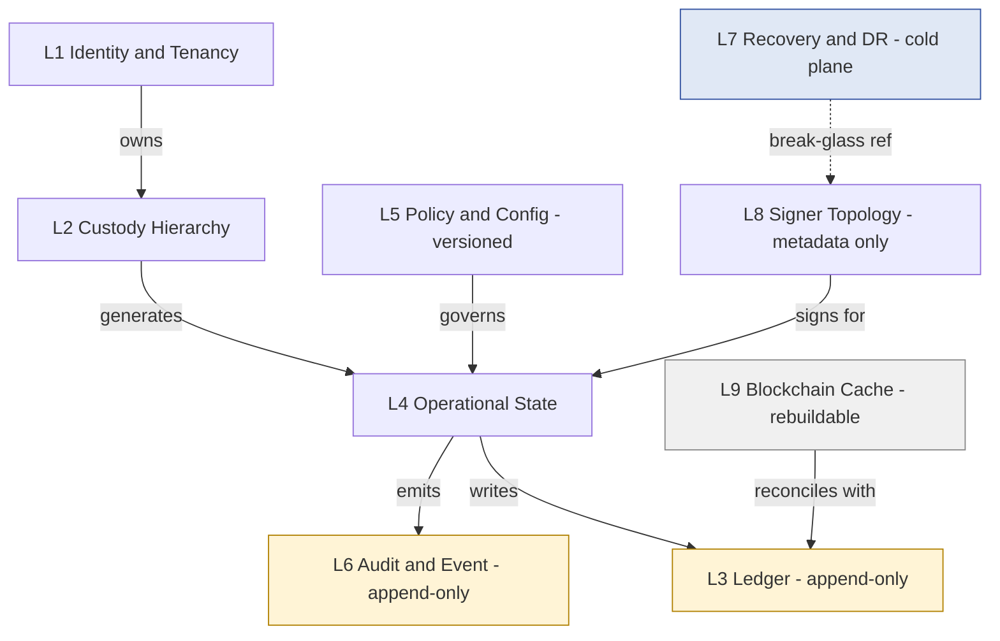
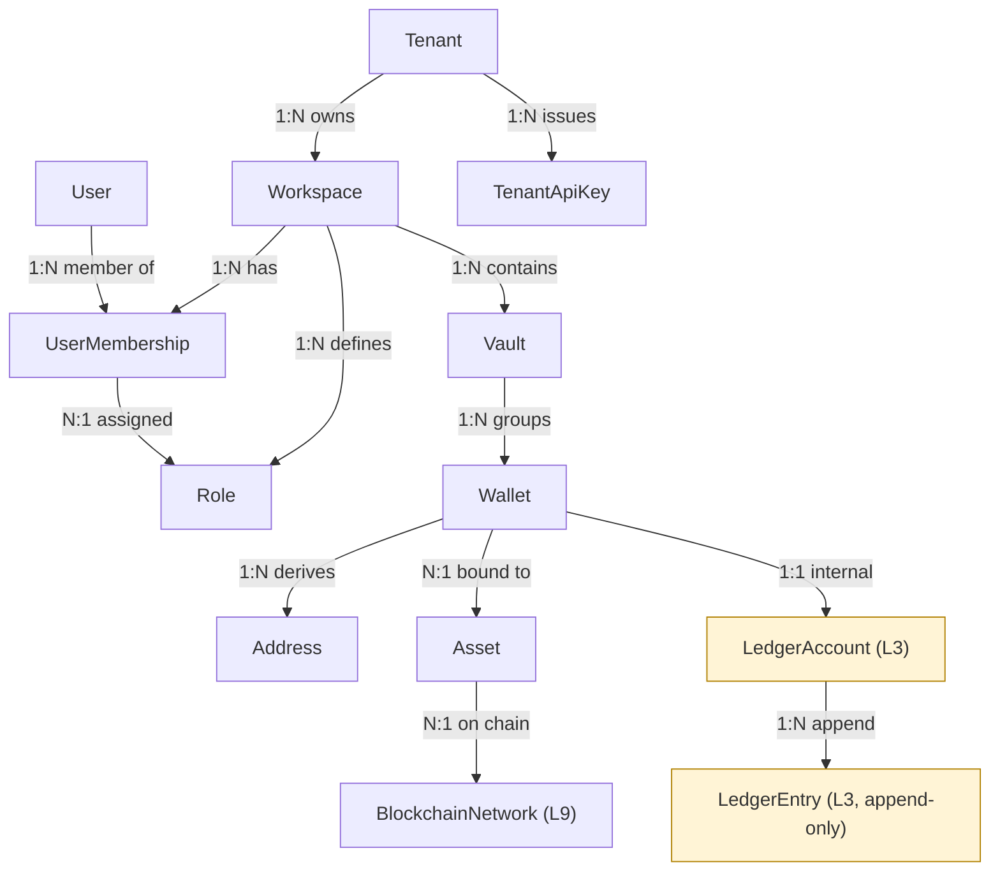
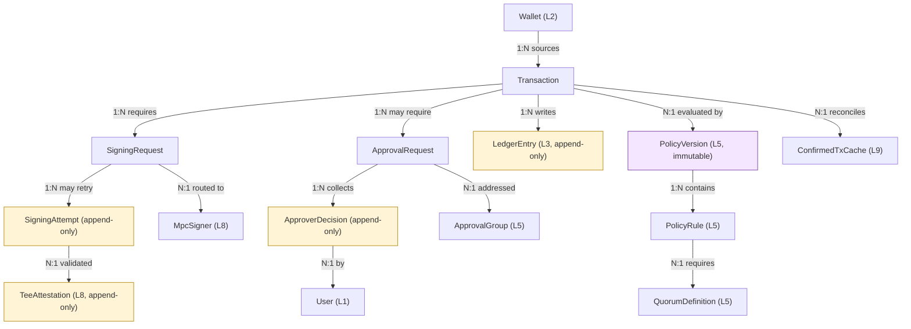
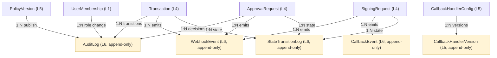
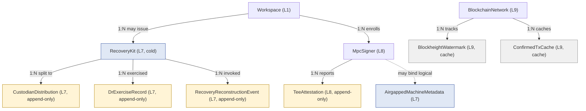

# Custody Wallet — Vault / Wallet / Ledger DB Schema Reasoning

> **본 문서의 위치**: Curated Wiki / Source Lake 와 별도의 **architecture reasoning layer**. Fireblocks vendor docs 의 정리/요약 문서가 **아님**. custody wallet backend 의 DB persistence model 을 **conceptual ownership / trust boundary / state lifecycle** 관점에서 reasoning. SQL DDL 은 본 문서 범위 밖 (이후 D-impl 단계).

> **Fireblocks 활용 방식**: reference implementation 으로만 인용. vendor-specific schema 추측 금지. generalized custody pattern 우선.

---

## 0. 핵심 명제 (10초 이해)

1. Custody DB 는 **9 개 plane** 으로 분리된다 — 모든 plane 을 하나의 OLTP 에 합치는 것은 trust boundary 위반.
2. **Secrets 자체는 DB 에 절대 저장하지 않는다** — DB 는 reference / lifecycle state / metadata / audit pointer 만.
3. **append-only / mutable / secret-metadata / recovery-metadata 4 종 분리** 가 schema 의 핵심 invariant.
4. **Ledger / Audit / Approver Decision Log** 만 full event-sourcing. 나머지는 CRUD + event emission (outbox).
5. SaaS / 설치형 WaaS / 직접 구축은 같은 9-plane 을 공유하지만 **누가 어느 plane 을 소유하는가** 만 다르다.

---

## 1. 9-Plane DB Topology



**Plane 그룹 (다이어그램 시각화 보조)**:

```
Hot operational     → L1, L2, L4
Configuration       → L5, L8
Append-only / Immutable → L3, L6  (★ classDef immut: 노랑)
Cold / DR plane     → L7         (★ classDef cold: 파랑)
Cache / Reconciliation  → L9     (★ classDef cache: 회색)
```

### Plane 책임 표

| Plane | 핵심 책임 | 저장 특성 | 권장 storage class |
|---|---|---|---|
| **L1 Identity / Tenancy** | Tenant / Workspace / User / Membership / Role / API Key metadata | mutable + audit-emit | OLTP (RDBMS) |
| **L2 Custody Hierarchy** | Vault / Wallet / Address / Asset Registry | mostly mutable (display) + immutable key-reference | OLTP |
| **L3 Ledger** | Internal double-entry Ledger Account / Ledger Entry | **append-only** | OLTP + warm archive (parquet S3) |
| **L4 Operational State** | Transaction / Signing Request / Approval Request / Policy Evaluation | state-machine (mutable) + transition log (append-only) | OLTP + event store |
| **L5 Policy / Configuration** | Policy Version / Approval Group / Quorum Def / Callback Handler Config | **versioned** (published = immutable snapshot) | OLTP + object store for snapshot blobs |
| **L6 Audit / Event** | Audit Log / Webhook Event / State Transition Log | append-only, immutable | dedicated event store (Kafka / Pulsar / append-only RDBMS) |
| **L7 Recovery / DR** | Recovery Kit Metadata / DR Exercise Record / Air-gapped Machine Metadata / Custodian Distribution Log | cold storage class | **별도 DB / 별도 KMS / 별도 backup cadence** |
| **L8 Signer Topology** | MPC Signer / Cosigner Machine / TEE Attestation Record | operational metadata **only** (no secrets) | OLTP (segregated namespace) |
| **L9 Blockchain-Derived Cache** | Network Registry / Blockheight Watermark / Confirmed Tx Cache / Mempool Observation | rebuildable cache | KV / columnar / OLAP |

→ **불변식**: L3 / L6 / L7 은 **다른 backup cadence + 다른 access policy + 다른 retention** 을 가진다. 단일 DB cluster 에 합치지 않는다.

---

## 2. Main Aggregates (DDD 관점)

Aggregate 는 **불변식 (invariant) 의 단위**. 한 transaction 안에서 함께 일관성 유지되어야 하는 단위.

| Aggregate Root | 포함 Child | 경계 reasoning |
|---|---|---|
| **Tenant** | Subscription, Compliance config | 최상위 isolation — multi-tenant RLS / 별도 schema / 별도 DB 의 boundary |
| **Workspace** | Membership, Role binding, Workspace settings | **governance boundary** — 정책 평가의 scope |
| **Vault** | Wallet (set), Vault-scoped policy hints | **custody grouping** — governance 와 분리 (Vault 는 govern 하지 않음) |
| **Wallet** | Address (deterministic tree), Asset binding | asset / network 종속 unit |
| **Transaction** | TransactionMetadata, BroadcastAttempt | end-to-end value transfer lifecycle |
| **Signing Request** | SigningAttempt, MPC Round metadata | **별도 aggregate** — Transaction 과 lifecycle 다름 (재시도 / 실패 가능) |
| **Approval Request** | Approver Decision (append-only) | **별도 aggregate** — governance 측면 독립 |
| **Policy Version** | Rule snapshot, Quorum binding snapshot | publish 시 immutable freeze |
| **Recovery Kit** | Custodian list, Distribution log, DR exercise refs | cold plane 전용 |
| **MPC Signer** | Enrollment record, TEE Attestation log, Health state | metadata only — key share 는 별도 보호된 storage |

**Aggregate 가 아닌 것** (pure event store):
- Audit Log
- Ledger Entry
- Webhook Event
- Approver Decision Log (root aggregate Approval Request 의 stream, 자체 invariant 없음)

→ **원칙**: aggregate boundary 는 **불변식이 같이 유지되어야 하는 범위**. boundary 가 크면 contention / lock 비용 ↑, 작으면 eventual consistency 비용 ↑.

---

## 3. ER Diagrams (4 cluster 분할)

> Cardinality 표기: `1:N` = one-to-many, `N:1` = many-to-one, `1:1` = one-to-one, `N:M` = many-to-many.
> 큰 ER diagram 한 장보다 plane 별 분할이 가독성 + renderer 호환성 양쪽에 우위.

### 3.1 Cluster A — Identity & Custody Hierarchy (L1 + L2)



### 3.2 Cluster B — Transaction Lifecycle (L4 + L5 ref)



### 3.3 Cluster C — Audit & Event Plane (L6 correlations)



### 3.4 Cluster D — Recovery (L7, cold) & Signer (L8) Plane



> **Color legend (모든 cluster 공통)**:
> - 🟡 노랑 (`#fff4d6`) = append-only / immutable evidence
> - 🟣 보라 (`#f5e6ff`) = versioned snapshot (publish=immutable)
> - 🔵 파랑 (`#e0e8f5`) = cold plane (L7, separate storage class)
> - ⚪ 회색 (`#f0f0f0`) = rebuildable cache (L9)
>
> **dashed line** (예: MpcSigner `-.->` AirgappedMachineMetadata): physical FK 아닌 logical reference — 외부 KMS / 외부 DB / 외부 시스템 참조.

---

## 4. Entity-Relationship Table

| Entity | Plane | Aggregate | 주요 FK | Cardinality | Lifecycle |
|---|---|---|---|---|---|
| Tenant | L1 | Tenant | — | root | rarely changed |
| Workspace | L1 | Workspace | tenant_id | N:1 → Tenant | rarely changed |
| User | L1 | (cross-workspace) | — | many-to-many via Membership | rarely changed |
| UserMembership | L1 | Workspace | workspace_id + user_id + role_id | join | medium churn |
| Role | L1 | Workspace | workspace_id | N:1 | low churn |
| TenantApiKey | L1 | Tenant | tenant_id | N:1 | medium churn + rotation |
| Vault | L2 | Vault | workspace_id | N:1 | low churn |
| Wallet | L2 | Wallet | vault_id + asset_id | N:1 / N:1 | low churn |
| Address | L2 | Wallet | wallet_id | N:1 | append-only derivation |
| Asset | L2 | — (reference data) | network_id | N:1 | rarely changed |
| BlockchainNetwork | L9 | — (reference data) | — | root | rarely changed |
| LedgerAccount | L3 | Wallet | wallet_id | 1:1 | created with wallet |
| LedgerEntry | L3 | — (event) | ledger_account_id + transaction_id | N:1 / N:1 | **append-only** |
| Transaction | L4 | Transaction | wallet_id + policy_version_id | N:1 / N:1 | state machine (DRAFT → ... → CONFIRMED / FAILED) |
| SigningRequest | L4 | SigningRequest | transaction_id + mpc_signer_id | N:1 / N:1 | state machine (PENDING → SIGNING → DONE / FAILED) |
| SigningAttempt | L4 | SigningRequest | signing_request_id | N:1 | append-only |
| ApprovalRequest | L4 | ApprovalRequest | transaction_id + approval_group_id | N:1 / N:1 | state machine (PENDING → APPROVED / REJECTED / EXPIRED) |
| ApproverDecision | L4 | ApprovalRequest | approval_request_id + user_id | N:1 / N:1 | **append-only** (signed evidence) |
| PolicyVersion | L5 | PolicyVersion | workspace_id | N:1 | **immutable once published** |
| PolicyRule | L5 | PolicyVersion | policy_version_id | N:1 | immutable with parent |
| QuorumDefinition | L5 | PolicyVersion | policy_version_id | N:1 | immutable with parent |
| ApprovalGroup | L5 | Workspace | workspace_id | N:1 | versioned (membership change = new version) |
| CallbackHandlerConfig | L5 | Workspace | workspace_id | N:1 | versioned |
| CallbackHandlerVersion | L5 | CallbackHandlerConfig | config_id | N:1 | append-only history |
| AuditLog | L6 | — (event) | actor_id + target_id + workspace_id | polymorphic | **append-only** |
| WebhookEvent | L6 | — (event) | workspace_id + correlation_id | N:1 | **append-only** |
| CallbackEvent | L6 | — (event) | signing_request_id | N:1 | **append-only** |
| StateTransitionLog | L6 | — (event) | target_type + target_id | polymorphic | **append-only** |
| MpcSigner | L8 | MpcSigner | workspace_id | N:1 | low churn |
| TeeAttestation | L8 | MpcSigner | mpc_signer_id | N:1 | append-only |
| RecoveryKit | L7 | RecoveryKit | workspace_id | N:1 | rare creation, immutable metadata |
| CustodianDistribution | L7 | RecoveryKit | recovery_kit_id + custodian_id | N:1 | append-only |
| DrExerciseRecord | L7 | RecoveryKit | recovery_kit_id | N:1 | append-only |
| RecoveryReconstructionEvent | L7 | RecoveryKit | recovery_kit_id | N:1 | **append-only break-glass evidence** |
| AirgappedMachineMetadata | L7 | (machine) | workspace_id | N:1 | rare |
| BlockheightWatermark | L9 | — | network_id | N:1 | high-frequency mutable cache |
| ConfirmedTxCache | L9 | — | network_id + tx_hash | unique | append-only with TTL |

→ **schema 원칙**: FK 는 plane 경계를 가로지를 때 **physical FK 아닌 logical reference** 사용 권장 (L7 cold plane / L6 event store 는 별도 DB 가능). 운영 단순화를 위해 단일 RDBMS 안에 있더라도, **별도 schema / 별도 user / 별도 backup job** 으로 분리.

---

## 5. Append-only vs Mutable 분리

### 5.1 Append-only 영역

| Entity | Append-only 이유 | 동기 |
|---|---|---|
| LedgerEntry | 회계 무결성, reorg compensating entry 패턴 | governance + 규제 |
| AuditLog | SOC2 / ISO27001 / SOX 의 immutability 요구 | 규제 |
| WebhookEvent | replay / idempotency / consumer 재처리 | operational |
| CallbackEvent | signing flow forensic + replay | operational + forensic |
| StateTransitionLog | "어떻게 그 상태가 됐는가" 의 재구성 | forensic |
| PolicyVersion | governance evidence — 과거 정책 재구성 | governance |
| ApproverDecision | governance audit — 누가 언제 무엇을 승인 (signed) | governance + 규제 |
| SigningAttempt | MPC orchestration debug + replay protection | operational + forensic |
| TeeAttestation | signer integrity history | security |
| DrExerciseRecord | 정기 DR 수행 증빙 | 규제 |
| RecoveryReconstructionEvent | break-glass forensic | 규제 + forensic |
| Address (derivation) | deterministic key tree 의 immutable record | security |

→ **공통 motivation**: governance / 규제 / forensic / replay 의 4 중 하나라도 해당 → append-only.

### 5.2 Mutable 영역

| Entity | 변경 빈도 | 변경 시 emit event |
|---|---|---|
| User profile | low | UserProfileUpdated |
| Membership / Role assignment | medium | MembershipChanged |
| Workspace settings | low | WorkspaceSettingsUpdated |
| Vault / Wallet / Address **labels** | medium | LabelUpdated |
| Transaction state field (`status`) | high | TransactionStateChanged |
| SigningRequest state field | high | SigningStateChanged |
| ApprovalRequest collection state | high | ApprovalStateChanged |
| Policy **draft** (until publish) | medium | PolicyDraftUpdated; publish → PolicyVersion immutable |
| CallbackHandlerConfig **current** | low | CallbackConfigUpdated; 이전 version archived |
| MpcSigner enrollment state | low | SignerEnrollmentStateChanged |
| BlockheightWatermark | very high | none (cache) |

→ **불변식**: mutable field 의 transition 은 **항상 append-only event 와 pair**. "현재 상태" 와 "어떻게 그 상태가 됐는가" 를 분리한다.

### 5.3 Secret metadata 영역 (DB 저장 OK, secret 자체는 X)

| Entity | DB 에 저장 OK | DB 에 절대 저장 금지 |
|---|---|---|
| MpcSigner | enrollment_id, public attestation, health state | private key share |
| RecoveryKit | package fingerprint, encryption envelope ref, custodian list | recovery passphrase, key share, escrow contents |
| TeeAttestation | attestation report, signer pubkey, measurement digest | TEE internal key |
| CallbackHandlerVersion | endpoint URL, auth method, public verification key | callback handler private signing key |

→ **원칙**: DB 는 **reference + lifecycle state + verification public material** 만. private material 은 HSM / KMS / paper / sealed envelope.

### 5.4 Recovery metadata 영역 (별도 plane)

L7 의 전용 영역. §7 에서 자세히.

---

## 6. Event Sourcing Boundary

| Plane / Domain | ES 적합도 | 권장 |
|---|---|---|
| **L3 Ledger** | **Strong** | full ES — entries = events, balance = projection |
| **L6 Audit Log** | **Strong** | pure event store (별도 storage class) |
| **Approver Decision Log** | **Strong** | event store (signed events) |
| **L6 Webhook Event Stream** | **Strong** | event store + outbox pattern |
| **L4 Transaction lifecycle** | **Medium** | **CRUD + event emission** 권장 (full ES 는 reorg replay 복잡도 ↑) |
| **L4 SigningRequest lifecycle** | **Medium** | 동일 — CRUD + emission |
| **L4 ApprovalRequest collection state** | **Medium** | CRUD + emission (단, Decision 만 ES) |
| **L7 Recovery metadata** | **Weak** | low-frequency, complex correlation — CRUD + emission |
| **L8 Signer topology** | **Weak** | 동일 |

### 권장 boundary: Selective ES

- **Full ES**: L3 Ledger + L6 Audit/Webhook + Approver Decision Log (★ 3 영역).
- **CRUD + event emission via outbox**: L1 / L2 / L4 / L5 / L7 / L8.
- **Pure cache**: L9 (rebuild from chain).

### Anti-pattern: 전체 ES 강제

- ⚠️ Hypothesis (★ general architecture pattern): 전체 ES 강제 시 reorg replay / DR / migration / schema evolution 비용이 폭증. event versioning 부담도 ↑.
- 권장: ES 는 **불변성과 replay 가 핵심 motivation 인 영역에만**. 일반 lifecycle state 는 CRUD + emission 으로 충분.

### Outbox pattern (CRUD + emission)

```
[OLTP txn] {
   UPDATE transactions SET status = 'SIGNING';
   INSERT INTO outbox (event_type='TransactionStateChanged', payload=..., created_at=now());
} COMMIT;

→ outbox publisher 가 비동기로 Kafka / SNS / Webhook 으로 fan-out.
→ Audit Log + Webhook Event 는 outbox 의 consumer projection.
```

---

## 7. Recovery Metadata Boundary (L7)

### 7.1 무엇이 L7 에 들어가는가

| Entity | 저장 | 동기 |
|---|---|---|
| RecoveryKit | fingerprint, envelope ref, format version, creation date, custodian list ref | break-glass reference |
| CustodianDistribution | 누구에게 어떤 share 가 전달됐는가 (식별자 / 채널 / 시간) | distribution audit |
| DrExerciseRecord | 정기 DR 훈련 결과 (성공/실패, 소요 시간, 참여 custodian) | compliance evidence |
| RecoveryReconstructionEvent | 실제 break-glass 실행 (언제 / 누가 / 어떤 kit / 결과) | forensic + 규제 |
| AirgappedMachineMetadata | 물리 machine ID, last attestation, custody chain | physical asset tracking |

### 7.2 무엇이 L7 에 들어가지 않는가 (절대)

- Recovery passphrase 자체
- Key share material
- Escrowed secret material
- Plaintext backup package
- Decryption key for backup envelope

→ 이들은 **HSM / KMS / paper / sealed envelope / hardware token** 의 별도 plane.

### 7.3 왜 별도 storage class 인가 (4 motive)

1. **Access policy 다름** — break-glass-only, ordinary engineer 접근 금지, RBAC 의 별도 role.
2. **Backup cadence 다름** — 일반 OLTP 보다 longer retention + immutable retention (WORM storage).
3. **Compliance regime 다름** — 종종 auditor / compliance officer / regulator 가 별도 view 권한.
4. **Blast radius 격리** — operational DB 침해가 recovery vector 침해로 cascade 되면 안 됨.

→ Reference: [[entities/fireblocks/workspace-keys-backup]] (Stage 29-31 의 4-5 secret reconstruction model), [[entities/fireblocks/mpc-key-share]] §Reconstruction.

### 7.4 L7 의 권장 구현

- 별도 DB instance (또는 별도 schema + 별도 DB user + 별도 backup job)
- 별도 KMS / CMK (operational plane 의 KMS 와 분리)
- WORM (write-once-read-many) object store 보조 (S3 Object Lock / equivalent)
- read access 는 audit-logged break-glass workflow
- 모든 read 가 RecoveryReconstructionEvent 또는 DrExerciseRecord 를 emit

---

## 8. SaaS / Self-hosted / Direct-build Ownership 비교

| Plane | Fireblocks SaaS | 설치형 WaaS / Hosted MPC | 직접 구축 |
|---|---|---|---|
| **L1 Identity** | Vendor DB + customer SSO ref | Vendor control plane + customer SSO ref | customer 완전 소유 |
| **L2 Custody Hierarchy** | Vendor DB | Vendor DB (hosted control plane) | customer |
| **L3 Ledger** | Vendor DB (customer API export 가능) | Vendor DB | **customer 자체 double-entry** |
| **L4 Operational State** | Vendor | Vendor + customer cosigner-side partial state | customer |
| **L5 Policy / Config** | Vendor DB (정책 정의는 customer 가 작성) | Vendor | customer |
| **L6 Audit / Event** | Vendor (export 가능, SIEM 연동) | Vendor + customer mirror 가능 | customer 자체 SIEM |
| **L7 Recovery / DR** | Customer 가 paper / sealed envelope 보유 + Vendor 가 encrypted package 보관 | **Customer 가 더 많이 소유** (passphrase + backup package 모두) | **전적으로 customer** |
| **L8 Signer Topology** | Vendor 3-cloud + Customer mobile share (asymmetric) | Vendor cosigner + Customer key share | customer (own HSM / MPC lib) |
| **L9 Chain Cache** | Vendor | Vendor | customer (own node / RPC) |

### Vendor lock-in pivot point

→ **L3 (Ledger) + L6 (Audit)** 가 lock-in 정도를 결정.
- L3 가 vendor-only 면 회계/리포팅이 vendor API 종속.
- L6 가 vendor-only 면 forensic / 규제 대응이 vendor 종속.
- → 권장 (직접 구축 검토 시): L3 + L6 만이라도 customer side mirror 로 sync (event consumer + 자체 storage).

### 권장 architecture pattern (운영 관점 — Hypothesis ★)

| Context | 권장 |
|---|---|
| 스타트업 / 자산 규모 작음 / 운영 인력 적음 | **Fireblocks SaaS** — 9 plane 의 7 개를 outsource, L7 만 customer 책임 유지 |
| 중견 / 규제 강함 / sovereignty 요구 | **설치형 WaaS / Hosted MPC** — L3 / L6 mirror + L7 full customer |
| 거래소 / 자체 인프라 / 자산 매우 큼 / 규제 자체 대응 | **직접 구축** — 9 plane 전체 소유, MPC library + HSM + 자체 governance plane |

→ 추천 ≠ fact. 회사 context (compliance / 인력 / cost / sovereignty) 별 trade-off 분석 필요.

---

## 9. 핵심 Reasoning Question (Q1–Q10)

### Q1. Vault 는 governance boundary 인가?

**No.** Governance 는 **Workspace-level**. Vault 는 **custody grouping** 의 unit.

**왜**: Approval Group / Admin Quorum / Policy 가 모두 workspace-scoped (Fireblocks 의 3-Level Governance 도 동일 — [[entities/fireblocks/admin-quorum]] / [[entities/fireblocks/approval-group]] / [[entities/fireblocks/policy]]). Vault 는 자산 grouping 의 organization 단위 — 한 vault 가 여러 asset 의 wallet 을 grouping.

**운영 함의**: Vault 단위로 policy 를 만들고 싶을 때는 policy rule 의 scope filter 로 vault_id 를 사용. Vault 자체에 quorum 을 매다는 것은 anti-pattern (Hypothesis ★).

### Q2. Wallet 은 asset-specific container 인가?

**Yes.** Wallet = (vault × asset) 의 deterministic address tree.

**왜**: 다른 chain 의 key derivation rule / address format / signing scheme / nonce model 이 다름. asset-agnostic wallet 은 abstraction 위반.

**예외**: EVM-compatible chain 군 (Ethereum / Polygon / BSC / ...) 은 single address 가 multi-chain 작동. 이 경우 wallet 은 "EVM family" 라는 asset 군 단위 — 여전히 asset-specific 의 generalized 형태.

### Q3. Ledger 는 append-only 인가?

**Yes.** Double-entry append-only.

**왜**:
- 회계 무결성 (mutation 시 audit trail 불완전).
- Reorg / chargeback / correction 은 **compensating entry** 패턴으로 처리 (직접 update 금지).
- 규제 (SOX / financial audit) requirement.

**구현**: `ledger_entries` 테이블은 INSERT only. balance 는 projection 또는 snapshot table (`ledger_balances`) 로 별도 유지 (cache).

### Q4. Blockchain state ↔ Internal state reconcile?

**3 단계 reconciliation**:

1. **Watermark**: 각 network 의 last-confirmed block height 를 추적 (`blockheight_watermarks`).
2. **Confirmation depth**: chain-specific finality threshold (BTC 6 blocks / ETH 64 blocks 등). PENDING → CONFIRMED 전이.
3. **Reorg compensation**: confirmed 였던 tx 가 reorg 로 dropped 시 → 원본 LedgerEntry 는 그대로 두고 **compensating LedgerEntry** 를 append. Transaction 의 status 는 mutable field 라 REORGED 로 update + StateTransitionLog 에 append.

**왜 직접 mutate 안 하나**: Q3 의 append-only motivation. reorg 가 빈번한 chain 일수록 compensating entry pattern 이 forensic 우위.

### Q5. Approval state 는 별도 aggregate 인가?

**Yes.**

**왜**:
- Transaction 과 lifetime 이 다름 (approval expire 가 transaction 보다 짧을 수 있음).
- governance 측면에서 독립 progression (approval 이 들어와도 transaction 은 still PENDING).
- 한 transaction 이 여러 approval (예: 정책 rule 별 다른 approval group) 을 trigger 가능 (1:N).
- Approver Decision 의 append-only 보장이 Transaction 의 mutable status 와 다른 lifecycle.

→ Approval Request 는 자체 aggregate root. Transaction → Approval Request 는 logical reference.

### Q6. Signing Request 와 Transaction 분리?

**Yes.**

**왜**:
- 1 Transaction → N SigningRequest 가능 (재시도, partial-signed batch).
- SigningRequest 의 실패가 Transaction 의 실패는 아님 (다른 signer 로 재시도 가능).
- MPC orchestration metadata (round number, participant set) 가 Transaction 의 business state 와 다른 concern.
- Signing 은 **signer plane (L8) 과의 coupling** 이 강함 — Transaction aggregate 가 signer 변화에 영향받지 않도록 분리.

### Q7. Recovery metadata 왜 별도 storage class?

§7.3 의 4 motive:
1. Access policy 다름 (break-glass-only).
2. Backup cadence 다름 (immutable retention).
3. Compliance regime 다름 (auditor view).
4. Blast radius 격리.

### Q8. Audit Log: ES vs append-only log?

**둘 다 가능 — 권장은 append-only log + 핵심 sub-domain (Ledger / Approval Decision) 만 ES.**

**왜**:
- Audit Log 의 핵심 motivation 은 **immutable forensic** — append-only log 로 충분.
- Full ES 는 read-side projection 비용 ↑ — Audit Log 는 보통 raw view 가 가장 가치 있음.
- 단, **Ledger** 는 balance 라는 projection 이 ES 와 자연스럽게 fit. **Approval Decision** 은 governance evidence 라는 강한 ES motivation.

### Q9. Callback Handler event ↔ Transaction 연결?

**Correlation chain**:

```
Transaction.id
  → SigningRequest.transaction_id
  → CallbackEvent.signing_request_id (또는 request_id)
  → CallbackHandler 의 response (approve / reject) → 다시 SigningRequest 의 transition
```

**구현**: CallbackEvent 는 append-only event. 각 event 는 `signing_request_id` + `callback_request_id` (idempotency key) + `handler_version_id` (어느 version 의 handler 가 응답했는가).

Reference: [[entities/fireblocks/callback-handler]] §"Authentication Options", [[vendors/fireblocks/callback-handler]] §"5 Authentication Options matrix".

### Q10. SaaS / self-hosted / direct-build ownership 차이?

§8 의 plane × ownership matrix. **핵심**: 9 plane 의 ownership 이 달라질 뿐 plane 자체는 동일.

→ vendor lock-in pivot point 는 **L3 (Ledger) + L6 (Audit)**.

---

## 10. Open Questions / Org Policy 영역

본 문서가 답하지 않는 영역 — org / compliance / 별도 의사결정 필요:

| 영역 | 질문 | 왜 본 문서 범위 밖 |
|---|---|---|
| Multi-tenant isolation 강도 | row-level (RLS) vs schema-level vs DB-level 어느 정도 격리? | 회사의 compliance posture / cost trade-off 별 |
| Audit retention 기간 | 5년 / 7년 / 영구? | 규제 (지역별 다름) |
| Recovery kit 의 custodian 수 | 3-of-5 / 4-of-7 / 2-of-3? | governance design decision |
| L7 의 physical separation | 별도 DB instance vs 별도 schema vs 별도 region? | infra cost / DR plan |
| Cosigner / MPC signer rotation 주기 | quarter / year / on-incident? | security posture |
| Policy version GC | 영구 보존 vs cold-archive after N years? | 규제 + 운영 cost |
| Webhook event retention | 30일 / 1년 / 영구? | consumer SLA + 규제 |
| Reorg depth tolerance | chain 별 confirmation 임계값 — internal SLA? | risk appetite |

---

## 11. 관련 wiki / entity reference

| 참조 | 어디서 사용 |
|---|---|
| [[entities/fireblocks/workspace-keys-backup]] | §7 Recovery metadata boundary |
| [[entities/fireblocks/mpc-key-share]] | §7, §8 Signer plane |
| [[entities/fireblocks/callback-handler]] | §6, Q9 |
| [[entities/fireblocks/api-co-signer]] | §8 Signer plane, Q9 |
| [[entities/fireblocks/admin-quorum]] | Q1 governance |
| [[entities/fireblocks/approval-group]] | Q1, Q5 governance |
| [[entities/fireblocks/policy]] | Q1, §2 PolicyVersion aggregate |
| [[entities/fireblocks/vault-account]] | §2 Vault aggregate (reference model) |
| [[entities/fireblocks/transaction]] | Q5, Q6 |
| [[vendors/fireblocks/architecture]] | §8 Hosted MPC variant |
| [[vendors/fireblocks/risks]] | §10 (Risk-S09 / Risk-S15 / Risk-S16 paired) |
| [[vendors/fireblocks/callback-handler]] | Q9 |
| [[vendors/fireblocks/cosigner]] | §8 Signer plane |

---

## 12. 다음 단계 hooks

본 문서는 D1a — **schema boundary 와 persistence model**. 이후 단계:

- **D1b — Reconciliation**: §3.Q4 의 watermark / confirmation / reorg compensation 의 구체적 알고리즘.
- **D2 — Signing Orchestration**: L4 SigningRequest aggregate + L8 signer plane 의 detail state machine.
- **D3 — Approval State Machine**: L4 ApprovalRequest aggregate 의 detail state machine + policy evaluation engine.
- **D4 — Recovery Ceremony Generalized**: L7 의 break-glass procedure full cycle.
- **D5 — Audit / Webhook / Event Sourcing**: L6 의 outbox + consumer + projection pattern.
- **D6 — 3-way Decision Framework**: SaaS / self-hosted / direct-build 선택 의사결정 framework.

→ D1a 의 schema boundary 가 향후 D1b–D6 의 reasoning baseline.

---

## Uncertainty Boundary (★ 절대 유지)

- 본 문서의 **9-plane 분리 / aggregate boundary / append-only 분류 / ES boundary / L7 격리** 는 **generalized custody architecture pattern** (Hypothesis ★). 특정 vendor (Fireblocks 포함) 의 internal schema 가 동일하다고 주장하지 않음.
- Fireblocks 의 entity / hub 는 reference model 로 인용 — generalized 형태로 매핑.
- 구체적 storage 선택 (RDBMS / Kafka / S3) 은 **운영 권장** — fact 아님.
- 추천 architecture pattern (§8) 은 **운영 관점 권장** — fact 와 분리.
- 본 문서에서 결정하지 않은 영역은 §10 에 명시.
