# Custody Wallet — Withdrawal Lifecycle Detailed Reasoning

> **본 문서의 위치**: D1a (ledger) + D2 (signing) + D3 (governance) + D4 (recovery edge) + D5 (evidence) + D1b (reconciliation) 의 **통합 outbound flow** 를 reasoning. 단순 송금 flow 가 아닌 **multi-domain state transition + evidence-producing workflow**.

> **본 문서가 답하는 핵심 질문**: 왜 withdrawal 은 "사용자가 코인을 보내는 것" 이 아닌가? 왜 single-step success 로 완료되지 않는가? 왜 매 phase 의 "성공" 이 다음 phase 의 trust assumption 일 뿐 economic completion 보장 아닌가? 왜 cancellation 이 phase 별 다른 의미인가? 왜 ledger mutation timing 자체가 design decision 인가?

---

## 0. 핵심 명제 (10초 이해)

1. **Withdrawal is not a transfer request. Withdrawal is a multi-domain state transition from user intent to economic finality.** — 본 문서의 thesis.
2. **12 phase + 5 truth domain + 9 timestamp + 5 balance type** 의 결합 — single state machine 으로 표현 불가능.
3. **10-tier "≠" 명제** — 매 phase 의 success 가 다음 phase 의 success 보장 아님.
4. **Ledger mutation timing 자체가 design decision** — Approval / Signing / Broadcast / Confirmation / Finality 5 모델 각각 trade-off.
5. **Cancellation 은 phase 별 의미 다름** — before-signing 은 governance event, after-broadcast 는 compensating tx (= new withdrawal).
6. **Retry ≠ Idempotent retry** (D2 의 직접 결과) — MPC retry / broadcast retry / cancellation retry 모두 다른 idempotency semantic.
7. **Pending withdrawal ≠ Economic outflow** — locked balance 가 outflow 아님; reorg / drop 시 복귀 가능.
8. **Successful withdrawal ≠ Complete evidence** (D5 §11 의 적용) — economic completion 후에도 evidence gap 가능.
9. **Reconciliation success ≠ No hidden inconsistency** (D1b §11 의 적용) — withdrawal reconciliation 도 limitation 동일.
10. **Withdrawal 은 evidence-producing workflow** — 결과물은 fund transfer 뿐 아니라 5-domain evidence chain artifact.

---

## 1. Withdrawal Generalized Lifecycle (12 phase)

```mermaid
graph TB
    W01["W1. Intent capture<br/>(user request, client_request_id)"]
    W02["W2. Policy evaluation<br/>(D3 G1, pin PolicyVersion)"]
    W03["W3. Approval collection<br/>(D3 G3, quorum)"]
    W04["W4. Approval envelope<br/>(D3 G10, signed, with freshness)"]
    W05["W5. Signing authorization gate<br/>(D2 S1 READY_TO_SIGN)"]
    W06["W6. MPC signing<br/>(D2 S5 round-by-round)"]
    W07["W7. Signing artifact<br/>(D2 S7 append-only)"]
    W08["W8. Broadcast attempt<br/>(D2 S8 RPC submit)"]
    W09["W9. Mempool / inclusion<br/>(D2 S9 + D1b)"]
    W10["W10. Confirmation tracking<br/>(D1b watermark + depth)"]
    W11["W11. Ledger mutation<br/>(D1a L3 append-only entry)"]
    W12["W12. Reconciliation + Evidence closure<br/>(D1b + D5)"]

    W01 --> W02
    W02 --> W03
    W03 --> W04
    W04 --> W05
    W05 --> W06
    W06 --> W07
    W07 --> W08
    W08 --> W09
    W09 --> W10
    W10 --> W11
    W11 --> W12

    W02 -.->|reject| EX_GOV["governance reject"]
    W03 -.->|timeout / reject| EX_APP["approval fail"]
    W04 -.->|freshness lost| W02
    W06 -.->|MPC fail (retry-eligible)| W05
    W06 -.->|MPC fail (terminal)| EX_SIG["signing fail"]
    W08 -.->|RPC reject| EX_BC["broadcast fail"]
    W09 -.->|stuck / drop| EX_MEM["mempool exception"]
    W10 -.->|reorg| W09
    W11 -.->|drift detected| EX_DR["drift exception"]
    W12 -.->|inconsistency| EX_RECON["reconciliation exception"]

    classDef gov fill:#f5e6ff,stroke:#7030a0
    classDef sig fill:#fff4d6,stroke:#b08000
    classDef chain fill:#e0e8f5,stroke:#3050a0
    classDef ledger fill:#d6ffd6,stroke:#008000
    classDef recon fill:#ffe0b3,stroke:#aa5500
    classDef exception fill:#ffd6d6,stroke:#a00000
    class W02,W03,W04 gov
    class W05,W06,W07 sig
    class W08,W09,W10 chain
    class W11 ledger
    class W12 recon
    class EX_GOV,EX_APP,EX_SIG,EX_BC,EX_MEM,EX_DR,EX_RECON exception
```

### 1.1 12 phase 의 domain mapping

| Phase | Primary domain | Authority | Aggregate (D1a) |
|---|---|---|---|
| W1 Intent | Identity (L1) | Customer | Transaction (DRAFT) |
| W2 Policy eval | Governance (D3) | Governance | ApprovalRequest |
| W3 Approval collection | Governance (D3) | Governance | ApprovalRequest |
| W4 Approval envelope | Governance (D3 G10) | Governance | (signed artifact) |
| W5 Signing gate | Signing (D2 S1) | Cross-domain (envelope check) | SigningRequest |
| W6 MPC signing | Signing (D2 S5) | Cryptographic | SigningAttempt |
| W7 Signing artifact | Signing (D2 S7) | Cryptographic | SigningArtifact |
| W8 Broadcast | Signing → Blockchain | Signing 출력 + Blockchain 입력 | BroadcastAttempt |
| W9 Mempool / inclusion | Blockchain (D1a L9) | Blockchain | (chain state) |
| W10 Confirmation | Blockchain (D1b) | Blockchain | (D1b reconciliation) |
| W11 Ledger mutation | Ledger (D1a L3) | Ledger | LedgerEntry (append) |
| W12 Reconciliation + Evidence | Cross-domain | All 5 truth | ReconciliationProof + Evidence chain |

### 1.2 각 phase 의 transition condition

- W1 → W2: client_request_id 검증 + Wallet 존재 + Asset 인식
- W2 → W3: policy 가 approval 요구 (no-approval 정책 시 W4 직행)
- W3 → W4: quorum threshold 도달
- W4 → W5: envelope freshness valid (W_freshness 내)
- W5 → W6: envelope cryptographic verify + SigningRequest 생성
- W6 → W7: 모든 MPC participant 의 partial signature 정상 + aggregator combine 성공
- W7 → W8: signed tx blob persistence 완료
- W8 → W9: RPC accepted (mempool entry)
- W9 → W10: block inclusion (depth=0)
- W10 → W11: confirmation threshold 도달
- W11 → W12: cross-domain consistency check 성공

→ 각 transition 은 다른 aggregate / 다른 trust domain / 다른 SLA.

### 1.3 핵심: single-step success ≠ withdrawal complete

- 사용자 관점: "Send 버튼 클릭 = 완료"
- System 관점: 12 phase 모두 통과 + cross-domain consistency proof
- 차이가 **withdrawal lifecycle 의 본질** — UX 와 system reality 의 분리.

---

## 2. Cross-Domain Truth Authority per Phase

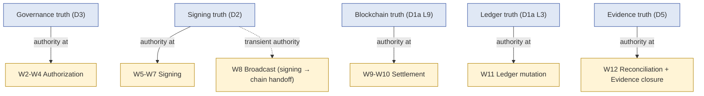

### 2.1 Phase 별 authority transition

| Phase | Authority | 보조 truth |
|---|---|---|
| W2-W4 Authorization | Governance | Identity (L1) for actor |
| W5 Gate | **Cross-domain envelope verification** | Governance + Signing |
| W6-W7 Signing | Signing (cryptographic) | Signer topology (L8) |
| W8 Broadcast | **Signing 출력 → Blockchain 입력** (handoff phase) | RPC trust (B8) |
| W9-W10 Settlement | Blockchain | Reorg detection (D1b) |
| W11 Ledger mutation | Ledger (internal) | Cross-reference to W7 + W10 |
| W12 Reconciliation | **Cross-domain consistency** | All 5 truths |

### 2.2 Authority 충돌 시 resolution

(D1b §1.2 의 withdrawal 적용)

| 충돌 | Resolution |
|---|---|
| W4 envelope valid but W6 signing 거부 | Signing 의 authority — envelope 만으로 signing 강제 못함 |
| W7 artifact 존재 but W9 inclusion 안 됨 | Broadcast 재시도 (artifact retain), 또는 chain rejection 시 fail |
| W10 confirmed but W11 ledger entry 안 됨 | Ledger projection lag — auto-mutation 또는 drift alert |
| W11 ledger 있지만 W10 미확인 | **Inconsistency incident** — W11 backing 없음 (manual ledger entry 검증) |
| W12 reconciliation 실패 | Exception queue — manual investigation |

---

## 3. Authorization vs Signing Boundary (separation reasoning)

### 3.1 4-tier authorization

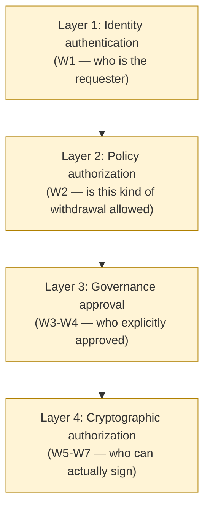

### 3.2 각 layer 가 다른 reason

| Layer | Question | 출력 |
|---|---|---|
| L1 Identity | "Who is asking?" | authenticated identity |
| L2 Policy | "Is this allowed by org rules?" | policy evaluation result |
| L3 Governance | "Did approvers explicitly authorize?" | signed governance envelope |
| L4 Cryptographic | "Can the cryptographic plane execute?" | signed tx artifact |

→ 4 layer 가 모두 통과해야 withdrawal 진행. 어느 한 layer 의 success 가 다음 layer 의 success 보장 안 함.

### 3.3 Stale approval + policy version drift 영향

(D3 §5 + §4.2 의 withdrawal 적용)

- Approval 통과 (W3-W4) 시점의 PolicyVersion 이 W6 signing 시점에 valid 한가?
- 보수적 정책: pinned PolicyVersion 유지 (W4 envelope 의 freshness 안에 있어야)
- 엄격 정책: PolicyVersion 변경 시 STALE_EVIDENCE → 재인가 필요

### 3.4 Emergency override 영향

(D3 §6 break-glass 의 withdrawal 적용)

- Emergency 시 W2-W4 의 일부 또는 전부가 bypass 됨.
- EMERGENCY_APPROVED envelope 도 W5 의 cryptographic verification 통과 가능.
- 그러나 **W6 signing 자체는 bypass 불가** — cryptographic authority 는 emergency 도 우회 못함.
- → Emergency 는 governance 의 bypass, signing 의 bypass 아님.

### 3.5 Recovery 경유 first withdrawal

(D4 §6.3 verification test tx 의 직접 적용)

- Re-enrollment 후 new key 의 first withdrawal 은 verification 성격.
- 6-domain reconciliation (governance + signing + chain + ledger + recovery + reconciliation).
- 일반 withdrawal 보다 audit 더 strict — recovery audit (D4 R9) 와 cross-reference.

---

## 4. Settlement Progression (D1b 의 적용)

### 4.1 6 settlement state 의 withdrawal-specific 표기

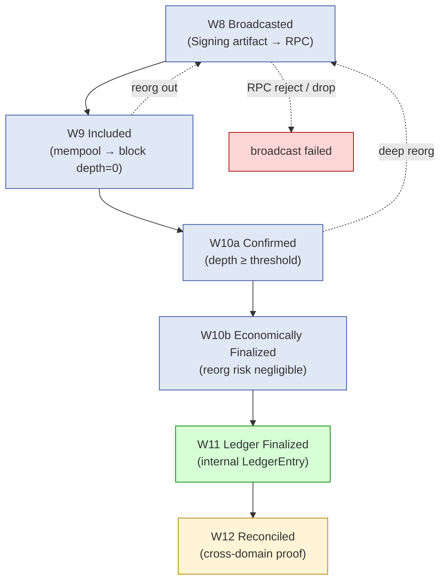

### 4.2 각 state 의 user-facing 표현

| State | UX 표현 | 실제 의미 |
|---|---|---|
| Broadcasted | "Submitted" | RPC accepted only |
| Included | "Pending" | one block confirmation |
| Confirmed | "Confirmed" | depth threshold reached (still reorg-risky) |
| Economically Finalized | "Final" | beyond probabilistic reorg |
| Ledger Finalized | (보통 hidden) | internal accounting |
| Reconciled | (보통 hidden) | cross-domain proof |

→ UX 와 settlement state 의 mapping 이 design decision — 너무 빨리 "Final" 표시하면 reorg 시 confusion, 너무 늦으면 UX bad.

### 4.3 "Broadcast success ≠ Settlement finality" reasoning

- §0.4 명제의 단계별 표현.
- W8 success = RPC 가 받아들임 (mempool entry).
- 그 이후 W9-W10b 의 모든 phase 가 fail point.
- 차이 영역:
  - Mempool eviction (low fee, congestion)
  - Stuck tx (insufficient priority)
  - RBF / replacement
  - Block inclusion variance
  - Reorg risk (depth-dependent)

### 4.4 Chain-specific settlement variation

(D1b §2.4 의 withdrawal 적용)

| Chain | Settlement complexity |
|---|---|
| Bitcoin | UTXO based, fee market, RBF support, ~60min for high-value finality |
| Ethereum (post-merge) | account-nonce based, EIP-1559, ~13min for 2-epoch finality |
| Solana | fast (~32 slot), lower complexity |
| Cosmos / Tendermint | instant deterministic |
| L2 (Optimistic) | challenge period (7d) for trustless withdrawal |
| L2 (ZK) | proof submission time |

→ 각 chain 의 settlement curve 가 다름 → withdrawal SLA 가 chain 별 다름.

---

## 5. Pending vs Finalized Withdrawal Model (5 balance state)

### 5.1 5 balance state 의 분리

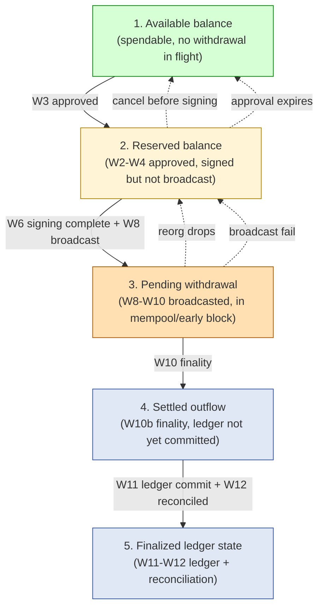

### 5.2 각 state 의 economic 의미

| State | 분류 | Economic 의미 |
|---|---|---|
| Available | Asset 활용 가능 | 자유로운 spending |
| **Reserved** | Asset locked (in-flight withdrawal) | double-spend 방지, 다른 withdrawal 불가 |
| **Pending** | broadcasted but reversible | reorg / drop 시 복귀 가능 |
| **Settled** | irreversibly outflowed | accounting 미반영 |
| **Finalized** | 회계상 outflow + cross-domain consistent | complete |

### 5.3 Reserved balance reasoning

(★ 핵심 — double-spend prevention)

- Withdrawal request 가 approved 시점에 해당 amount **reserved** (logical lock).
- Reason:
  - 같은 wallet 의 다른 withdrawal 이 같은 fund 를 시도하면 anti-pattern
  - UTXO chain 에서는 같은 UTXO 의 동시 사용 불가
  - Account chain 에서는 nonce 충돌
- Reserve 는 internal accounting 의 **shadow ledger** (real LedgerEntry 아님; lock metadata).
- Withdrawal cancellation / 만료 시 unreserve.

### 5.4 Pending withdrawal ≠ Economic outflow

(§0.7)

- Pending state 의 balance 는 reorg / drop 시 복귀 가능 — outflow 확정 아님.
- 회계상 처리:
  - Available balance ↓ (reserved 됨)
  - Pending withdrawal 표시 (별도 dimension)
  - 실제 LedgerEntry 는 W11 시점에 commit (또는 다른 model 선택, §8)

### 5.5 Liquidity 관리 측면

(★ Hypothesis — operational reasoning)

- 큰 withdrawal 의 Pending 상태가 길어지면 customer의 자본 효율 ↓.
- Reorg-aware withdrawal 정책: high-value 는 Settled 까지 대기, low-value 는 Pending 에서 즉시 사용.
- Liquidity / safety trade-off — §17 의 org policy 영역.

---

## 6. Failure / Retry Semantics

### 6.1 Failure point 분류

```mermaid
graph TB
    F_GOV["W2-W4 governance fail<br/>(reject / timeout / stale)"]
    F_GATE["W5 gate fail<br/>(envelope invalid / freshness lost)"]
    F_MPC["W6 MPC fail<br/>(participant offline / invalid partial / timeout)"]
    F_ART["W7 artifact fail<br/>(serialization / storage)"]
    F_BC["W8 broadcast fail<br/>(RPC reject / network)"]
    F_MEM["W9 mempool fail<br/>(eviction / stuck / RBF needed)"]
    F_REORG["W10 reorg<br/>(included → dropped)"]
    F_LED["W11 ledger fail<br/>(projection lag / inconsistency)"]
    F_RECON["W12 reconciliation fail<br/>(drift detected)"]

    classDef gov fill:#f5e6ff,stroke:#7030a0
    classDef sig fill:#fff4d6,stroke:#b08000
    classDef chain fill:#e0e8f5,stroke:#3050a0
    classDef ledger fill:#d6ffd6,stroke:#008000
    class F_GOV,F_GATE gov
    class F_MPC,F_ART sig
    class F_BC,F_MEM,F_REORG chain
    class F_LED,F_RECON ledger
```

### 6.2 Retry semantic 분류 (D2 §6 의 적용)

| Failure | Retry semantic | 새 aggregate 생성? |
|---|---|---|
| W2 Policy reject | No retry (정책 거부) | — |
| W3 Approval timeout | Re-request (new ApprovalRequest) | New |
| W4 Freshness lost | Re-request from W2 | New |
| W5 Envelope invalid | Re-request from W3 | New |
| **W6 MPC fail** | **Non-idempotent retry** — 새 SigningAttempt + 새 nonce | New SigningAttempt within same SigningRequest |
| W7 Artifact storage fail | Idempotent retry (same artifact) | — |
| W8 RPC reject | Conditional retry (chain-specific) | New BroadcastAttempt |
| W9 Mempool stuck | RBF / cancel-replace | New BroadcastAttempt (or new SigningRequest if new fee) |
| W10 Reorg | Auto re-track (no retry needed) | — |
| W11 Ledger fail | Idempotent retry | — |
| W12 Reconciliation fail | Exception queue | — |

### 6.3 "Retry ≠ Safe replay" reasoning

- MPC retry: nonce reuse = key leak → **new nonce mandatory** (D2 §6.3).
- Broadcast retry: chain-specific
  - Account-model (EVM): same nonce → idempotent (same tx)
  - UTXO model (BTC): same UTXO → idempotent
  - 그러나 **fee change** 시 새 signed tx 필요 = new SigningRequest
- Replay protection 의 4 layer (D2 §6.4) 모두 적용.

### 6.4 Partial failure 시나리오

(★ Hypothesis — operational pattern)

- W7 signed but W8 broadcast 실패 → artifact retain, new BroadcastAttempt
- W8 broadcasted 됐지만 client 응답 lost → **same artifact 의 dedup 필요** (broadcast idempotency)
- W11 ledger committed 됐지만 W12 reconciliation 실패 → drift 처리

→ Partial failure 의 처리가 withdrawal engine 의 complexity 의 대부분.

### 6.5 Duplicated broadcast 위험

- 다른 RPC node 에 같은 signed tx 를 동시 broadcast = duplicate 가능.
- Chain 의 dedup 에 의존 — account nonce 또는 UTXO 가 같은 tx 를 detect.
- 그러나 **race condition 안전** 보장 필요 — fee 변경 시나리오에서 두 tx 가 동시 mempool 진입 가능.

---

## 7. Cancellation Semantics (phase 별)

### 7.1 Phase 별 cancellation 가능성

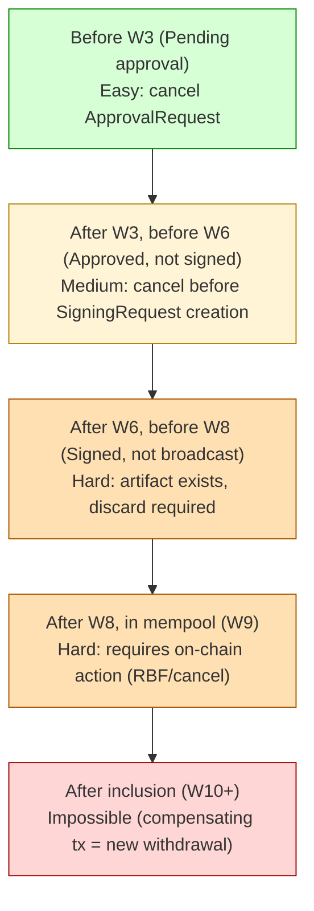

### 7.2 각 phase 의 cancellation 처리

| Phase | Cancellation action | State 변경 | Side effect |
|---|---|---|---|
| Before W3 | ApprovalRequest → CANCELLED | reserved → available | governance audit only |
| W3-W4 | ApprovalRequest → CANCELLED, envelope 폐기 | reserved → available | governance audit + envelope invalidation |
| W6-W7 | SigningRequest → CANCELLED, artifact 폐기 | reserved → available | signing audit + artifact non-broadcast lock |
| W8-W9 (in mempool) | RBF / cancel-replace (chain-specific), new tx broadcast | reserved 유지 until 새 tx settle | chain-specific cancel cost (fee) |
| W10+ (confirmed) | **Cancellation 불가능** — compensating withdrawal (= new withdrawal) | — | new withdrawal lifecycle |

### 7.3 "Cancellation ≠ State rollback" reasoning

- Cancellation 은 **future action 차단**.
- State rollback 은 **history mutation** — append-only invariant 위반.
- Withdrawal cancellation 도 cancellation event 를 append-only 로 emit; 기존 events 변경 X.
- Phase 별 "cancellation 가능" 의 의미는 **차단 effectiveness** — 어느 phase 에서 차단해도 evidence chain 은 유지.

### 7.4 RBF / cancel-replace 의 governance

(★ Hypothesis — chain operations)

- Chain-side cancel (RBF / replacement) 자체가 새 signed tx 가 필요 — 새 SigningRequest cycle.
- 따라서 cancel 도 governance approval 의 대상이 될 수 있음 (정책 의존).
- Cancel approval 의 SLA 는 짧음 (수 분 — stuck tx 가 confirm 되기 전).
- 권장: cancel 정책을 pre-approved standing rule 로 — 매번 quorum 안 받아도 되도록.

### 7.5 Compensating withdrawal (post-confirmation)

- W10+ 이후의 "취소" 는 새 withdrawal — 같은 amount 의 reverse direction.
- 새 lifecycle 의 12 phase 전부 다시 통과.
- 회계상: 원본 outflow + compensating inflow → net 0, history 는 양쪽 모두.
- → "Cancellation" 이라는 single concept 으로 묶기 어려움 — post-confirmation 은 별도 governance event.

---

## 8. Ledger Mutation Timing (5 model 비교)

핵심 design decision: ledger debit 을 **어느 phase** 에서 수행하는가.

### 8.1 5 timing model

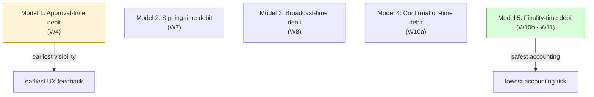

### 8.2 모델별 trade-off

| Model | Accounting risk | UX | Liquidity risk | Rollback complexity |
|---|---|---|---|---|
| **M1 Approval** | Highest — approval 후 signing fail 시 ledger entry 가 phantom | Earliest visibility | reserve same as debit | High (compensating entry 빈번) |
| **M2 Signing** | High — broadcast fail 시 phantom | Good | Same | High |
| **M3 Broadcast** | Medium — mempool drop 시 phantom | Acceptable | Same | Medium |
| **M4 Confirmation** | Low — shallow reorg 만 위험 | Delayed but reasonable | Reserved separately | Low (occasional reorg) |
| **M5 Finality** | Lowest — only deep reorg | Latest visibility | Reserved separately for long | Lowest |

### 8.3 권장 model (★ Hypothesis — operational reasoning)

| Asset class | 권장 model |
|---|---|
| Stablecoin / low-volatility | M4 (Confirmation) — balance UX + safety |
| BTC / high-value | M5 (Finality) — strict safety |
| Test net / low-value | M3 (Broadcast) — fast UX |
| High-frequency / hot wallet | M3-M4 hybrid — UX 우선 |

→ **Reserved balance 모델은 항상 사용** — 어느 timing model 이든 W2/W3 시점에 reserved.

### 8.4 Hybrid: shadow ledger + real ledger 분리

(★ Hypothesis — common pattern)

- **Shadow ledger**: reserved / pending 상태의 metadata (real LedgerEntry 아님)
- **Real ledger**: confirmation / finality 이후의 append-only LedgerEntry
- Balance query 는 둘을 종합:
  - Available = real ledger - shadow ledger (reserved)
  - Pending = shadow ledger (broadcasted)
  - Settled = real ledger (confirmed)

→ Shadow ledger 가 reorg 시 rollback 가능 (mutable metadata), real ledger 는 append-only invariant 유지.

### 8.5 Timing model 의 audit 의미

- M1-M3 model 은 LedgerEntry 빈번한 compensating entry 발생 — audit log 복잡.
- M4-M5 model 은 LedgerEntry 적지만 audit 단순.
- **Audit 단순성 = forensic 용이성** — 권장 M4-M5 의 추가 동기.

---

## 9. Reconciliation Reasoning (cross-domain consistency)

(D1b 의 withdrawal 적용)

### 9.1 Withdrawal 의 5-domain reconciliation

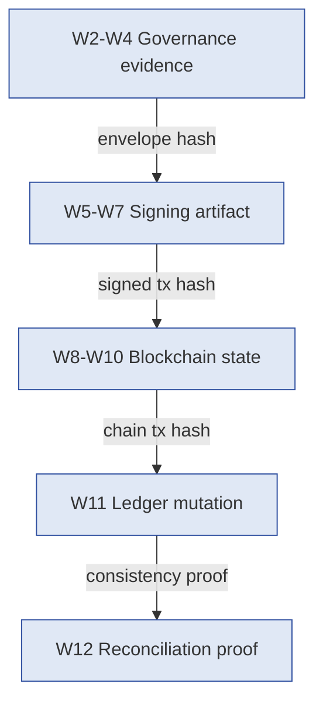

### 9.2 5-question check (D1b §4.2 의 withdrawal version)

| Question | Source |
|---|---|
| 이 LedgerEntry 의 backing chain tx 는? | LedgerEntry → tx_hash → CONFIRMED block |
| 이 chain tx 의 SigningArtifact 는? | tx_hash → SigningArtifact → signature |
| 이 SigningArtifact 의 SigningRequest 는? | SigningArtifact → SigningRequest |
| 이 SigningRequest 의 governance envelope 는? | SigningRequest → ApprovalRequest |
| 이 ApprovalRequest 의 PolicyVersion 은? | ApprovalRequest → pinned PolicyVersion |

→ 5 question 모두 cleanly resolve 되면 withdrawal reconciliation success. Drift 1 개라도 detect 되면 exception.

### 9.3 "Withdrawal reconciliation ≠ 돈이 빠졌는가" reasoning

(§0 + D1b §0.1 의 적용)

- "돈이 빠졌는가" = ledger balance 의 1-dimension check.
- Withdrawal reconciliation = "authorized outflow 가 cross-domain consistent 하게 완료됐는가" 의 5-domain check.
- 잘못된 reconciliation 사례:
  - Ledger debit 됐는데 chain settlement 없음 = phantom outflow
  - Chain outflow 있는데 ledger 없음 = unrecorded loss
  - Signing 있는데 governance 없음 = unauthorized signing (incident)
  - Governance 있는데 signing 없음 = governance bypass attempt

### 9.4 Reconciliation proof artifact

- W12 의 출력 = signed reconciliation proof envelope.
- 내용: correlation_id, 5-domain evidence hashes, consistency check result, signing key of reconciliation engine.
- → 이 proof 가 audit / 규제 / 법적 절차의 atomic evidence.

---

## 10. Exception Workflow

### 10.1 Withdrawal-specific exception 유형

```mermaid
graph TB
    EX1["Stuck withdrawal<br/>(W9 mempool, long delay)"]
    EX2["Duplicated broadcast<br/>(same tx multiple submissions)"]
    EX3["Stale approval usage<br/>(W4 envelope freshness 만료 후 signing 시도)"]
    EX4["Reorged withdrawal<br/>(W10 confirmed → dropped)"]
    EX5["Partial ledger mutation<br/>(W11 일부 실패)"]
    EX6["Reconciliation drift<br/>(W12 cross-domain mismatch)"]
    EX7["Unauthorized signing<br/>(W7 artifact without W4 envelope)"]
    EX8["Governance bypass<br/>(W4 envelope without proper W3 quorum)"]

    EX1 -->|action| A1["RBF / cancel-replace / continue waiting"]
    EX2 -->|action| A2["dedup via chain native"]
    EX3 -->|action| A3["re-approval cycle"]
    EX4 -->|action| A4["auto re-tracking + compensating entry"]
    EX5 -->|action| A5["manual ledger correction + governance review"]
    EX6 -->|action| A6["drift investigation + manual reconciliation"]
    EX7 -->|action| A7["security incident response"]
    EX8 -->|action| A8["security incident response"]

    classDef chain fill:#e0e8f5,stroke:#3050a0
    classDef gov fill:#f5e6ff,stroke:#7030a0
    classDef security fill:#ffd6d6,stroke:#a00000
    class EX1,EX2,EX4 chain
    class EX3 gov
    class EX5,EX6 chain
    class EX7,EX8 security
```

### 10.2 Severity 분류

| Severity | Examples | Action |
|---|---|---|
| Low | Indexer lag, transient RPC fail | Metric only |
| Medium | Stuck tx (within reasonable time) | Auto-retry / RBF |
| High | Persistent drift (>30 min) | Exception queue + investigator |
| Critical | Unauthorized signing / governance bypass / fund discrepancy | Incident response + governance freeze |

### 10.3 Human investigation workflow

(D1b §9.2 의 withdrawal version)

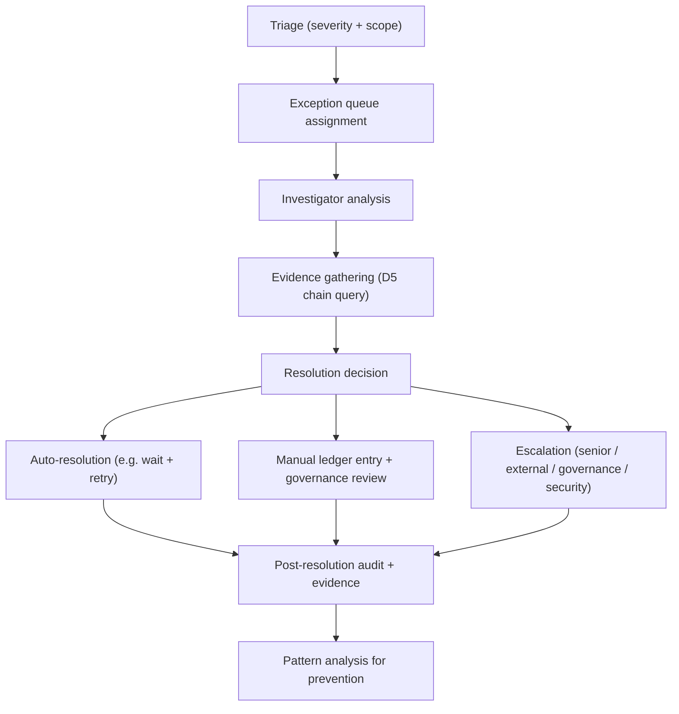

### 10.4 Manual ledger entry governance (withdrawal context)

- Withdrawal exception 에 의한 manual LedgerEntry 는 strict governance:
  - 2-of-N approval (별도 quorum)
  - reason field 의 structured capture
  - exception_id linkage
  - post-hoc senior review SLA
- Frequency monitoring — abuse vector.

---

## 11. Temporal Semantics (9 clock)

(D5 §5 의 withdrawal-specific 확장)

### 11.1 9 clock for withdrawal

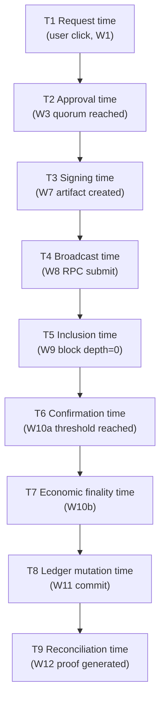

### 11.2 SLA 별 latency

| Segment | 일반 latency | Concern |
|---|---|---|
| T1 → T2 | minutes-hours (approver 가용성) | Human dependency |
| T2 → T3 | seconds-minutes (MPC orchestration) | Cryptographic |
| T3 → T4 | seconds (network) | Engineering |
| T4 → T5 | seconds-minutes (chain-specific) | Chain |
| T5 → T6 | minutes (chain-specific threshold) | Chain |
| T6 → T7 | minutes-hours (chain-specific finality) | Chain |
| T7 → T8 | seconds-minutes (internal lag) | Engineering |
| T8 → T9 | minutes-hours (batch reconciliation cycle) | Operational |

### 11.3 Total withdrawal latency

- Best case (low-value, fast chain): minutes
- Typical (BTC, finality): ~1-2 hours
- Worst case (L2 Optimistic withdrawal): ~7 days (challenge period)

→ "Withdrawal completed" 의 의미가 phase 별 다름 — UX 표현 design 의 핵심.

### 11.4 Cross-domain ordering 의 withdrawal-specific

(D5 §5.5 의 적용)

- T4 (broadcast) 와 T5 (inclusion) 의 ordering 은 chain-side fact.
- T2 (approval) 와 T3 (signing) 의 ordering 은 system-side, causation_id chain.
- T7 (finality) 와 T8 (ledger) 의 ordering 은 reconciliation-side — T7 → T8 invariant.
- Anti-pattern: T8 이 T7 전에 발생 (ledger 가 chain 보다 먼저 commit) — phantom outflow.

---

## 12. Withdrawal Evidence Chain

### 12.1 Full evidence chain

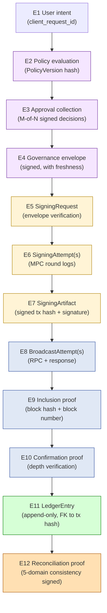

### 12.2 Evidence chain 의 12-question framework

(D5 §6.3 의 withdrawal version)

| Question | Source in chain |
|---|---|
| Why was this withdrawal initiated? | E1 + E2 policy reason |
| Who requested? | E1 actor |
| Under which policy version? | E2 PolicyVersion hash |
| Who approved? | E3 ApproverDecision list |
| When did quorum reach? | E3 → E4 transition time |
| Which envelope authorized signing? | E4 envelope_id |
| Which signers participated? | E6 participant set |
| What was signed (tx hash)? | E7 SigningArtifact |
| Where was it broadcasted? | E8 RPC endpoint(s) |
| When was it included? | E9 block hash + time |
| When did finality? | E10 confirmation depth |
| How was reconciliation proven? | E12 proof artifact |

→ Withdrawal 의 모든 forensic / audit / regulatory question 이 위 12-question 으로 답 가능.

### 12.3 Evidence chain integrity

- 각 phase 의 envelope 가 다음 phase 의 input 으로 hash-linked.
- Tampering detection: 임의 phase 의 evidence 변조 시 다음 phase 의 hash 불일치.
- → 단순 append-only 가 아닌 **hash chain** 구조 권장 (D5 §10.1).

---

## 13. Reconciliation Limitations (withdrawal-specific)

### 13.1 Broadcast success ≠ Economic completion

- §0.3-§0.5 의 통합.
- W8 success 후 W9-W12 모두 fail point.
- Stuck tx / reorg / partial ledger / drift 의 모든 위험.

### 13.2 Ledger mutation ≠ Settlement finality

- W11 ledger commit 후에도 W12 reconciliation fail 가능.
- Inconsistency 가 발견되면 ledger 는 commit 됐지만 reconciliation 미완.
- 이 경우 W11 자체가 phantom (잘못된 commit) 가능성도 있음 — manual investigation 필요.

### 13.3 Reconciliation success ≠ No hidden inconsistency

(D1b §11.2 의 직접 적용)

- Reconciliation 이 OK 라도 evidence gap 가능.
- External domain (CEX / bridge) 의 mismatch 가 reconciliation 의 own scope 밖.

### 13.4 Stored evidence ≠ Complete operational truth

(D5 §10.3 의 직접 적용)

- Operator 의 intent, communication context, side-channel signal 등은 capture 안 됨.
- Withdrawal incident 시 forensic 은 항상 approximation.

### 13.5 External dependency limitation

- 일부 withdrawal 은 external domain 으로 (CEX, bridge, sub-custodian).
- External 의 evidence 는 third-party trust class — reconciliation 의 가장 어려운 영역.

---

## 14. Operational Fragility Map

```mermaid
graph TB
    F1["F1. Approval bottleneck<br/>(approver unavailable, freshness expire)"]
    F2["F2. MPC retry abuse<br/>(repeated nonce-fresh attempts)"]
    F3["F3. Broadcast failure cascade<br/>(RPC down → all withdrawals stuck)"]
    F4["F4. Stuck tx in mempool<br/>(fee market spike)"]
    F5["F5. Reorg cascade<br/>(deep reorg → multiple withdrawals reverse)"]
    F6["F6. Ledger projection lag<br/>(W11 못 따라감)"]
    F7["F7. Drift accumulation<br/>(small drift × time = big inconsistency)"]
    F8["F8. Exception backlog<br/>(investigator capacity 부족)"]
    F9["F9. External domain mismatch<br/>(CEX/bridge evidence 불일치)"]
    F10["F10. Withdrawal authority abuse<br/>(insider, governance bypass)"]

    F1 -->|mitigation| M1["escalation + multi-timezone approver + emergency authority"]
    F2 -->|mitigation| M2["MPC retry limit + abuse pattern detection"]
    F3 -->|mitigation| M3["multi-RPC redundancy + circuit breaker"]
    F4 -->|mitigation| M4["RBF / cancel-replace policy + fee oracle"]
    F5 -->|mitigation| M5["compensating entry + deep reorg manual"]
    F6 -->|mitigation| M6["projection SLA + lag alert + auto-catchup"]
    F7 -->|mitigation| M7["periodic full reconciliation + drift cumulative metric"]
    F8 -->|mitigation| M8["investigator team sizing + tier-1 auto-resolution"]
    F9 -->|mitigation| M9["external evidence mirror + signed attestation + 정기 audit"]
    F10 -->|mitigation| M10["governance independence + dual approval + frequency SLO"]
```

### 14.1 Fragility 분류

| 분류 | items | 성격 |
|---|---|---|
| **Human availability** | F1, F8 | irreducible / mitigatable via process |
| **Chain side** | F3, F4, F5 | chain-specific |
| **System reliability** | F6, F7 | engineering discipline |
| **Cryptographic abuse** | F2 | detection-based mitigation |
| **External / Security** | F9, F10 | **irreducible (external) + 매우 위험 (security)** |

---

## 15. SaaS vs Self-hosted vs Direct-build Withdrawal Burden

### 15.1 Plane × Ownership 매트릭스

| Phase | Fireblocks SaaS | 설치형 WaaS / Hosted MPC | 직접 구축 |
|---|---|---|---|
| W1 Intent | Vendor API + customer client | Vendor API | Customer |
| W2-W4 Governance | Vendor + customer policy | Vendor + customer policy | Customer 자체 (D3) |
| W5 Gate | Vendor | Vendor | Customer |
| W6-W7 MPC signing | Vendor + customer mobile | Vendor cosigner + customer share | Customer (MPC lib) |
| W8 Broadcast | Vendor multi-RPC | Vendor / customer | Customer multi-RPC |
| W9-W10 Settlement | Vendor | Vendor | Customer chain adapter |
| W11 Ledger mutation | Vendor (with export) | Vendor | Customer |
| W12 Reconciliation | Customer (vendor data + own logic) | Customer | Customer |
| Stuck tx | Vendor partial | Vendor / Customer | Customer |
| Reorg handling | Vendor | Vendor | Customer (compensating entry) |
| Exception workflow | Customer | Customer | Customer |
| Evidence retention | Customer SIEM | Customer | Customer |
| Incident response | Customer with vendor support | Customer | Customer |

→ Withdrawal 은 12 phase 중 **W12 + exception + evidence** 의 customer burden 비중이 큼. 단순 송금처럼 보이지만 multi-domain ownership 분포.

### 15.2 Customer burden 비교 (★ Hypothesis)

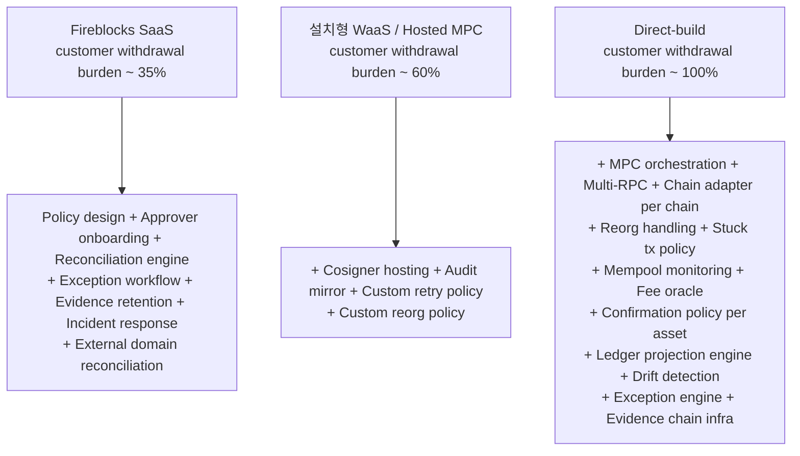

### 15.3 Lock-in pivot point

가장 큰 customer burden 영역 (direct-build 시):
1. **Multi-chain MPC orchestration** — 각 chain 별 sign + broadcast logic.
2. **Reorg + stuck tx handling** — chain-specific operational complexity.
3. **Cross-domain reconciliation + drift detection** — 5-domain consistency.
4. **Exception workflow + investigator team** — irreducible human ops.

이 4 가 burden 의 ~80% (★ Hypothesis).

### 15.4 Recommendation (운영 관점)

| Context | 권장 |
|---|---|
| Low-value, single-chain, simple policy | SaaS — vendor 가 W1-W11 까지 흡수, customer 는 W12 + exception |
| Multi-chain, multi-asset, 중견 자산 | Hosted MPC + customer reconciliation engine |
| High-value, regulated, multi-jurisdiction | Direct-build + 외부 audit firm + external blockchain anchoring |
| Crypto exchange | Direct-build + 자체 chain support + 24/7 operations team |

→ 추천 ≠ fact. Withdrawal 의 frequency / volume / chain diversity 가 핵심 결정 factor.

---

## 16. 핵심 Reasoning Question (Q1-Q10)

### Q1. Withdrawal 이 transfer request 가 아닌 이유

§0.1. 12 phase + 5 truth domain + multi-domain authority transition. UX 의 "send" 와 system reality 의 분리. Output 은 fund transfer 뿐 아니라 5-domain evidence chain artifact.

### Q2. 매 phase 의 success 가 다음 phase 보장 안 하는 이유

§3.2 의 4-tier authorization. Identity / Policy / Governance / Cryptographic 각각 다른 trust domain. Approval (W3) 이 통과해도 Signing (W6) 의 cryptographic plane 이 fail 가능; Signing 이 success 해도 Broadcast (W8) 의 RPC 가 reject 가능; Broadcast 가 success 해도 Settlement (W10) 의 reorg / drop 가능.

### Q3. Ledger mutation timing 의 design decision

§8. 5 model 각각 accounting risk / UX / liquidity / rollback complexity 의 trade-off. M1-M3 은 UX 우선, M4-M5 는 safety 우선. Hybrid shadow ledger + real ledger 패턴 권장. Asset 종류별 differing.

### Q4. Cancellation ≠ State rollback

§7.3. Cancellation 은 future action 차단 (event emit). Rollback 은 history mutation (append-only 위반). Phase 별 cancellation effectiveness 다름: before-signing 은 easy, after-broadcast 는 chain-side action 필요, after-confirmation 은 불가능 (compensating new withdrawal).

### Q5. Pending withdrawal ≠ Economic outflow

§5.4. Pending state 는 reorg / drop 시 복귀 가능. Reserved balance + Pending balance + Settled outflow + Finalized 의 5-state 분리 모델. UX 는 보통 Confirmed 부터 outflow 표시.

### Q6. MPC retry 의 nonce reuse 위험 (withdrawal context)

§6.3, D2 §6.3 의 적용. 매 SigningAttempt 는 새 nonce + 새 round. Idempotent retry 불가능. Withdrawal lifecycle 에서 W6 의 max retry 가 정책 결정 — 도과 시 W2 재시작.

### Q7. Stale approval 의 영향

§3.3. W3 → W6 사이의 시간 gap 이 envelope freshness 안인지 매 phase 검증. PolicyVersion drift 시 STALE_EVIDENCE → 재인가. 보수적 정책: 짧은 freshness window (예: 1h), 엄격 정책: 매 retry 마다 새 approval.

### Q8. 5-domain reconciliation 의 의미

§9. "돈이 빠졌는가" 의 1-dimension check 가 아닌 governance / signing / chain / ledger / reconciliation 의 cross-consistency. 5-question framework: backing chain tx? signing artifact? signing request? governance envelope? policy version?

### Q9. Successful withdrawal ≠ Complete evidence

§13.4. Withdrawal lifecycle 완료 (W12 success) 후에도 evidence gap 가능. Operator intent, communication context, external domain mismatch, side-channel signal 모두 capture 안 됨. Forensic 은 항상 approximation.

### Q10. Withdrawal 에서 SaaS 가 흡수하는 것 vs customer 책임

§15. SaaS 가 흡수: W1-W11 (orchestration + signing + broadcast + settlement + ledger). Customer 책임: policy design + approver onboarding + W12 reconciliation engine + exception workflow + evidence retention + incident response + external domain reconciliation. **Withdrawal 도 customer burden 의 ~35% 가 SaaS 에서도 존재**.

---

## 17. Open Questions / Org Policy 영역

| 영역 | 질문 | 본 문서 범위 밖 이유 |
|---|---|---|
| Ledger mutation timing (M1-M5) | per asset class? | accounting policy + risk appetite |
| Approval window (W3) | per amount tier? | governance |
| Approval freshness (W4 envelope TTL) | 5m / 1h / 24h? | safety vs UX |
| MPC max retry (W6) | 3 / 5 / unlimited? | operability + cost |
| Confirmation threshold (W10a) per asset | per asset / per amount tier? | risk + UX |
| Finality threshold (W10b) per chain | chain-specific | chain semantic |
| RBF / cancel policy per chain | aggressive / conservative? | fee market + UX |
| Cancellation governance | pre-approved standing rule? per-incident quorum? | governance |
| Reconciliation cadence (W12) | hourly / daily / on-demand? | forensic + cost |
| Exception investigator team size | per N withdrawals? | scale |
| Pending balance UX | show immediately? after conf? | UX vs risk |
| Reserved balance lifetime | infinite until cancelled? expiry? | liquidity |
| Stuck tx threshold | mempool age / fee escalation? | UX + cost |
| Manual ledger entry authority | who can? approval needed? | governance |
| External domain integration | which CEX/bridge supported? | partnership |
| Withdrawal velocity limits | daily / per asset cap? | risk |
| Emergency withdrawal | break-glass policy? | crisis governance |
| Compensating withdrawal | auto vs manual? | accounting |
| Audit retention (withdrawal evidence) | 7y / forever? | regulatory |
| 24/7 operations | on-call rotation? automation level? | scale |

---

## 18. 관련 wiki / entity reference + Uncertainty Boundary

### 관련 wiki

| 참조 | 어디서 사용 |
|---|---|
| [[entities/fireblocks/transaction]] | §1 (Transaction aggregate) |
| [[entities/fireblocks/policy]] | §3.3 (PolicyVersion pinning) |
| [[entities/fireblocks/admin-quorum]] | §3 (approval) |
| [[entities/fireblocks/approval-group]] | §3 |
| [[entities/fireblocks/api-co-signer]] | §6 (MPC signing) |
| [[entities/fireblocks/callback-handler]] | §3 (callback as policy gate, if enabled) |
| [[entities/fireblocks/mpc-key-share]] | §6.3 (MPC retry nonce) |
| [[entities/fireblocks/workspace-keys-backup]] | §3.5 (Recovery-경유 first withdrawal) |
| [[entities/fireblocks/vault-account]] | §1, §5 (wallet ownership) |
| [[vendors/fireblocks/architecture]] | §15 (vendor reference) |
| [[vendors/fireblocks/risks]] | §10 (limitation reasoning) |
| [[docs/architecture/vault-wallet-ledger-db-schema]] | §1, §8 (L3 LedgerEntry, L4 aggregates) |
| [[docs/architecture/signing-workflow-orchestration]] | §1, §6 (W5-W7 + retry semantic) |
| [[docs/architecture/approval-state-machine-governance]] | §3 (W2-W4 governance) |
| [[docs/architecture/recovery-ceremony-generalization]] | §3.5 (recovery 경유) |
| [[docs/architecture/audit-event-sourcing-evidence-chain]] | §11, §12 (temporal + evidence chain) |
| [[docs/architecture/reconciliation-settlement-consistency]] | §4, §9 (settlement progression + reconciliation) |

### Uncertainty Boundary (★ 절대 유지)

- 본 문서의 **12 phase decomposition / 4-tier authorization / 5-balance state / 5 ledger mutation timing model / 9-clock temporal / 12-question evidence framework / 80% burden 분포** 는 모두 **generalized custody withdrawal architecture pattern** (Hypothesis ★).
- Fireblocks 의 withdrawal 구현은 reference model — vendor-specific 구현 detail 은 다를 수 있음.
- §8 의 timing model trade-off matrix 는 operational reasoning estimate, 측정값 아님.
- §15.2 burden 백분율 (~35% / ~60% / ~100%) 는 operational reasoning estimate.
- §15.4 추천 architecture 는 운영 권장 — fact 아님.
- §13 의 limitation 은 D1b + D5 의 직접 적용 — 본 문서가 새로 주장하는 것 아님.
- §17 에 명시된 영역은 본 문서가 결정하지 않음.

### 다음 단계 (D8 이후)

본 문서는 D8 — **Withdrawal Lifecycle Detailed**. 이후:

- **D7 — Deposit Lifecycle**: 2-domain (Blockchain ↔ Ledger) reconciliation 의 detailed phase decomposition. Withdrawal 의 mirror 이지만 governance/signing 미관여로 simpler.
- **D6 — 3-way Custody Decision Framework**: 전체 architecture reasoning 의 의사결정 framework formalize.
- (Optional D9) — Multi-chain adapter pattern detail.

→ Withdrawal lifecycle (D8) 는 generalized custody operations 의 가장 복잡한 outbound flow. D7 deposit 는 같은 reasoning framework 의 simpler form.

### Architecture reasoning layer 누적 결과 (D1a + D2 + D3 + D4 + D5 + D1b + D8)

| 문서 | 핵심 명제 |
|---|---|
| D1a | 9-plane DB / secrets DB 저장 금지 |
| D2 | 4 state machine 분리 / MPC retry non-idempotent |
| D3 | 11-state governance SM / two-clock freshness |
| D4 | Recovery = governance ceremony under cryptographic risk |
| D5 | Custody = evidence system / Unified Evidence Spine |
| D1b | Reconciliation = cross-truth-domain consistency proof |
| **D8** | **Withdrawal = multi-domain state transition from user intent to economic finality / 12 phase × 5 truth × 9 clock × 5 balance × 5 ledger timing** |

---

**Stage 32 D8 completion timestamp**: 2026-05-19.
