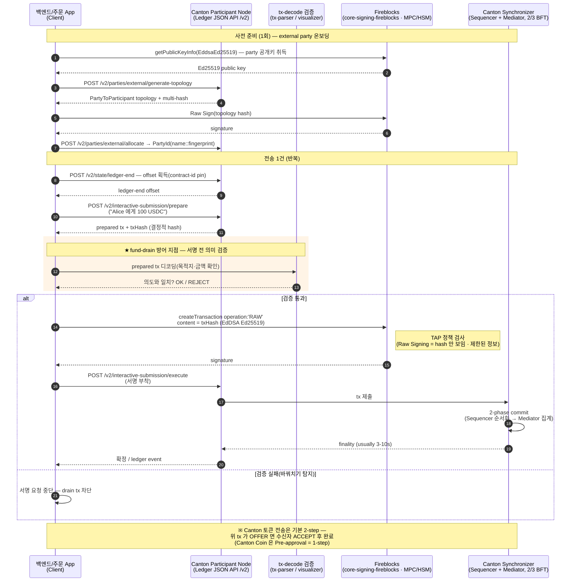

# Canton Network

## Summary
Canton 은 DAML 스마트컨트랙트 기반 privacy-enabled 퍼블릭 블록체인(institutional finance·토큰화·cross-border 결제 대상)이다. 원장은 **party 가 보유한 Active Contract Set(ACS)** 이고, 토큰 holdings 는 **UTXO**(가용/locked)로 표현된다. party 는 **participant(validator node)** 에 host 되어 **Synchronizer(Sequencer+Mediator) 2-phase commit** 으로 확정된다. 전송은 기본 **2-step**(TransferInstruction: Accept/Reject/Withdraw)이며, Canton Coin 은 Transfer Pre-approval 로 1-step. (source: canton-network-homepage, musubi-network-introduction, fireblocks-recover-canton-coin, digitalasset-docs-canton-model, docs-canton-network-renewed)

## Key Concepts
- **원장 = ACS, holdings = UTXO** — party 자산/상태 = active contract 집합(ACS). 토큰 holdings 는 `Holding` interface 구현 active contract = **Canton 의 UTXO 등가물**(`includeLocked` 로 locked/가용 구분). active Holding 은 storage+compute 비용 발생 → **지갑당 ~10 UTXO 유지 권장**. 복구 시 새 validator 에 party re-host + ACS import. (source: digitalasset-docs-canton-model, docs-canton-network-renewed, fireblocks-recover-canton-coin)
- **allowance/approve 패턴 없음 (★ Stage 65)** — Canton holding 은 **소유자가 sole signatory** 이고, ERC-20 식 approve/allowance(제3자에 사용권 위임)가 **없다** — 전송은 소유자의 직접 서명으로만. → infinite-approval 류 공격면이 구조적으로 부재(수탁 보안 이점). (source: musubi-custodian-track; Canton fact)
- **named-role 다중서명 (★ Stage 65)** — Canton 의 다자 서명은 EVM 처럼 익명 interchangeable n-of-m 이 아니라 **지정 party 의 named-role 서명**(DAML **choice-level granularity**)이고, 동시 집계가 아니라 **순차 rolling approval(DAML choice exercise)**다. maker-checker/four-eyes 를 절차가 아니라 **암호학적으로 강제**. [[multi-sig 항목]]을 이렇게 읽을 것. (source: musubi-custodian-track; Canton fact, [[transaction]])
- **2-step 전송 / CIP-0056** — token standard 명세 = **CIP-0056**. 송신 시 `TransferInstruction`(factory 생성) → 수신자 **Accept**(완료)/**Reject**(반환) 또는 송신자 **Withdraw**(locked 자금 회수). FOP(Free of Payment) 전송 가능. 신규 인터페이스 `TransferFactory`/`AllocationFactory`/`BatchMergeUtility`/`MergeDelegation`. Canton Coin 은 **Transfer Pre-approval = 1-step**. **Fireblocks 는 이를 전용 `transactionType` 필드(OFFER/ACCEPT/REJECT/WITHDRAW/PRE_APPROVAL) + `traceableId`/`CantonHashes`(offerUpdateId 로 OFFER↔후속 연결)로 노출**(★ Stage 78, A11 해소 — generic status collapse 아님). timeout=수락 안 되면 송신자 WITHDRAW(앱 정책). (★ Stage 53: v3.4 는 "2-step = 모든 토큰 기본값" 단정, 리뉴얼본은 구현 옵션 톤 — 함께 볼 것) (source: digitalasset-docs-canton-model, docs-canton-network-renewed; 매핑 [[transaction]])
- **PartyId = hint::fingerprint** — fingerprint = 이 party 의 topology transaction 을 authorize 하는 공개키의 sha256. namespace 는 root signing key 에서 도출. opaque identifier 라 파싱 금지, allocation 으로만 생성. (source: digitalasset-docs-canton-model)
- **external party = 외부 서명 신원** (★ Stage 53) — external party = "submission key holder, no SPN, 자체 namespace, 자체 signing key 통제". external signing 2-step: **Preparing Participant Node**(Ledger API command→Daml tx) + **Executing Participant Node**(party 서명 부착). party 가 "transaction tree 의 hash" 명시 서명, **private key 는 party 만 통제 → participant 는 party 승인 없이 원장 행동 불가**. MPC/HSM 수탁 모델과 정합. (source: docs-canton-network-renewed)
- **Synchronizer / 합의** — **2-layer**: ordering layer(synchronizer) + validation layer(participant). Sequencer(순서화·timestamp·sender identity 제거) + Mediator(confirmation 집계·2-phase commit verdict). Global Synchronizer = **2/3 majority BFT consensus** (native BFT orderer: ISS+Narwhal 영향, `Mempool→Availability→Consensus→Output` 4-모듈, <1/3 fault 허용 = 2/3 honest majority 동치). **Super Validator** = Global Synchronizer infra·sequencing·CC tx 검증·거버넌스(**54 SV 노드**가 공동 운영, ★ Stage 72). **Validator** = party host·tx 검증·연결. 거버넌스 = **Canton Foundation**(구 Global Synchronizer Foundation, 2025-09-22 개명; Linux Foundation 파트너십 출범). SV 예(Premier Members): Goldman Sachs·SBI Digital Asset·Euroclear·Broadridge·Tradeweb·Digital Asset·Moody's·Cumberland 등(2025-03 Goldman·HK FMI·Moody's 합류). **finality "usually 3-10s"** (★ Stage 54 C01 ANSWERED). (source: docs-canton-network-renewed)
- **Canton Coin = burn-mint equilibrium** (★ Stage 54, 수치 60) — 수수료(USD 표시·CC 지불)는 **소각=유통에서 제거**, validator/SV 는 infra·사용량·liveness 로 **mint 보상**. **라운드 10분(연 ~52,560), 라운드마다 dev fund 5% 선차감 후 validator/app/SV 배분**, unclaimed cascade. **CC-USD = 라운드별 SV 게시율 median**, **per-validator liveness faucet cap 기본 $2.85/라운드**. → burn 모델 확정. (source: docs-canton-network-renewed tokenomics-of-gs)
- **pruning + 비반박(non-repudiation) (★ Stage 60)** — participant 는 과거 tx prune(active contract 는 절대 안 함), BFT orderer 기본 30일 retention. **PQS(Participant Query Store)** = distilled 장기 보관소. **ACS commitment** = counter-participant 와 active contract 암호서명 요약 주기 교환(fork 탐지·합의 증명) — 전원 matching 후 prune. → 감사·대사는 원장 아닌 **자체 DB** 가 1차 보관처. (source: docs-canton-network-renewed pruning)
- **Canton Name Service(CNS) (★ Stage 60)** — 사람이 읽는 이름→party id(DNS/ENS 류), `<name>.unverified.cns`, DSO governed. 등록 = `/v0/entry/create`→CC 결제(DSO 로 소각)→AnsEntry, 만료·갱신. wallet 은 Scan API 로 이름 표시·이름 송금. reassignment(synchronizer 간 contract 이동)은 **단일 synchronizer 수탁엔 비적용**(scope-out). (source: docs-canton-network-renewed canton-name-service·reassignment-protocol)
- **프라이버시 메커니즘 = sub-transaction views** (★ Stage 55) — 트랜잭션은 **view 들로 분해**되어 각 party 는 자기 view 만 본다. Synchronizer 는 내용을 복호화하지 않고 암호화 메시지만 순환시킨다("coordination vs storage 분리"). party = "on-ledger identity, analogous to addresses/EOA". **Synchronizer 토폴로지**는 single/multiple/global 구성 모두 지원(본 위키는 global synchronizer 중심). (source: docs-canton-network-renewed architecture)
- **암호키 모델** (★ Stage 56) — **namespace root key**(namespace = root key 의 hash, topology tx authorize) · **node signing key**(sequencer 인증·ACS commitment 서명) · **encryption key**(asymmetric + session symmetric) · **external party 서명키**(party 가 직접 tx authorize, **권장 저장 = offline**). 키 저장 옵션 = DB / in-memory / offline / KMS(envelope·full). 수탁 키관리(MPC/HSM·offline)와 직결. (source: docs-canton-network-renewed cryptographic-keys)
- **암호 알고리즘 (1차 확정 ★ Stage 57)** — 서명 **Ed25519**(JCE default), **ECDSA-SHA256**(EC-P256·secp256k1; KMS default), ECDSA-SHA384(P-384). 해시 **SHA-256(유일·default)**. 암호화 ECIES-HMAC-SHA256-AES128-CBC·RSA-OAEP-SHA256, 대칭 AES128-GCM, PBKDF Argon2id. 키 포맷 DER X.509(pub)·PKCS#8(priv). → EdDSA(Ed25519)가 1차 출처로 확정(기존 Fireblocks 근거만 → 공식 crypto-schemes). (source: docs-canton-network-renewed crypto-schemes)
- **external signing 해시식 (★ Stage 57)** — party 가 서명하는 대상 = `sha_256(0x00000030 ‖ 0x03 ‖ hash(transaction) ‖ hash(metadata))`. hash purpose prefix `0x00000030`, scheme V3. protobuf 는 non-canonical 이라 **결정적 인코딩**(big-endian int·UTF-8 4-byte length prefix 등)으로 직렬화 후 SHA-256. → MPC/HSM 가 서명 전 hash 독립 재계산·검증 가능. (source: docs-canton-network-renewed external-signing-hashing-algorithm)
- **키 계층 + KMS (★ Stage 58)** — **root namespace key**(primary identity, **offline/air-gap 또는 KMS 격리**, `scripts/offline-root-key`) ↔ **intermediate key**(노드에서 topology authorize, root 없이 rotation; delegation restriction 으로 서명 가능 mapping 제한). KMS = **AWS·GCP·Driver(HSM)**, 2모드: **envelope**(Canton 생성·KMS at-rest wrap) vs **full KMS**(`crypto.provider=kms`, **Canton 이 raw private key 못 봄**). 루트 CA offline + 운영키 KMS/HSM 패턴과 동일. (source: docs-canton-network-renewed key-management·kms-operations)
- **multi-sig = n-of-m (★ Stage 58, 수탁 quorum)** — ① decentralized namespace(N keys, threshold T≤N) ② multi-hosted party confirmation threshold(>1) ③ **external multi-sig: PartyToParticipant 에 Protocol Signing Keys 목록 + threshold(예 3-of-5)**, submitting node 가 서명 모아 충족 시 제출. PartyToParticipant permission = Submission/Confirmation/Observation. → Fireblocks TAP/quorum 류 n-of-m 승인과 매핑(자금 권한을 키 분산). (★ Stage 61 구분: **multi-hosting ≠ multi-sig** — multi-hosting 은 party 를 여러 validator 에 분산하는 topology(HA·즉시 failover·threshold>1 이면 악성 validator 방어), multi-sig 는 tx 서명 키 threshold. 다른 층) (source: docs-canton-network-renewed multi-sig·party-management·multi-hosting)
- **external party 온보딩 API (★ Stage 61, MPC/HSM party 생성)** — ① 오프라인 keygen(HSM/MPC)·pubkey DER→base64 → ② `/v2/parties/external/generate-topology` → PartyToParticipant topology + multi-hash commitment → ③ **custody 키로 서명** → ④ `/v2/parties/external/allocate`. multi-host = otherConfirmingParticipantUids. **키는 HSM/MPC 밖으로 안 나감**. = Fireblocks/MPC 키로 Canton party 를 만드는 실제 절차. (source: docs-canton-network-renewed external-signing-onboarding)
- **explicit contract disclosure (★ Stage 61)** — 못 보는 contract 를 command 의 `disclosed_contracts`(template_id·contract_id·**created_event_blob**, off-ledger 공유)로 첨부해 사용. transfer factory/registry 를 이렇게 disclose → stakeholder 아니어도 exercise. hash 기반 contract-id 라 위변조 탐지. (wallet prepare 의 "disclosed contracts" 정체). command dedup 기준은 **command ID**(change ID, 재시도 동일), submission ID 는 매번 fresh. (source: docs-canton-network-renewed explicit-contract-disclosure·command-deduplication)
- **용어 (★ Stage 61)** — **Amulet = Canton Coin 의 구 명칭**(API `amulet*` 에 잔존), DSO = Super Validator 집합, Splice = synchronizer 운영 오픈소스(Hyperledger Labs). (source: docs-canton-network-renewed glossary)
- **causality·시간 (★ Stage 62, 수탁 리스크)** — Canton 은 **partial ordering**(total 아님) — party 마다 두 tx 관찰 순서 다를 수 있음(causality graph 로 정합). **ledger time(submitter) vs record time(storage)**, bounded skew, **둘 다 단조증가 아님(fuzzy)**. **divulged 정보엔 순서 보장 없음** → 정식 원장 반영 전 divulged 정보로 행동 금지, multi-host party 는 동일 tx 를 다른 순서로 받을 수 있음(결국 수렴). external signing tx: `submission_id` 로 **재서명 없이 재시도** 가능. (source: docs-canton-network-renewed ledger-causality·external-signing-transactions)
- **stakeholder / choice** (★ Stage 56, 56→59 정정) — Canton = **eUTXO**. contract = tx 로 created·immutable·고유 ID·archive 까지. action = Create/Exercise/Fetch. **stakeholder 3역할: signatory**(생성 authorize·항상 가시)/**observer**(가시·행사 불가)/**controller**(자신 통제 choice 행사). **choice = Consuming**(행사 시 archive)**/Non-consuming**(유지). (source: docs-canton-network-renewed core-concepts·ledger-model)
- **privacy divulgence 주의 (★ Stage 59)** — tx 에서 contract 를 **fetch 하면 그 tx 당사자에게 observer 아니어도 자동 노출(divulgence)** — 의도치 않은 정보 누출 가능. 컴플라이언스·프라이버시 설계 시 주의. (3자 체인 Alice→Bob→Charlie: Alice 는 Charlie 미가시, Charlie 는 Alice 미가시) (source: docs-canton-network-renewed privacy-model)
- **trust model = selective trust (★ Stage 59, 자가호스팅 판단)** — 5 도메인: validator(데이터·가용성; external party 면 **서명은 안 믿음**; 자가호스팅 시 신뢰 제거) / counterparty(내 validator 정직하면 invalid tx 확정 불가) / synchronizer(내용 못 읽음·위조 못함·invalid 승인 못함, **delay 만 가능**, BFT 2/3 honest) / app provider / governance. **자가호스팅 = validator 신뢰 제거, synchronizer 는 BFT·multi-sync 로 완화**. (source: docs-canton-network-renewed trust-model)
- **topology (★ Stage 59, 매핑 정정)** — topology = key-value map(결정적 replication). 매핑: **PartyToParticipant**(perm Observation/Confirmation/Submission)·**OwnerToKeyMapping**(노드 키)·**PartyToKey**(decentralized party)·**NamespaceDelegation**(CanSignAllMappings/AllButNamespaceDelegations/SpecificMappings)·VettedPackages·SynchronizerTrustCertificate·Sequencer/MediatorSynchronizerState. serial+1(replay 방지), effective time t+ε. tx-lifecycle = 5-phase(Preparation→Submission→Sequencing→Validation→Aggregation/Commit), **decisionTimeout**. (기존 ParticipantToParty/KeyToParty 표기 정정) (source: docs-canton-network-renewed topology·transaction-lifecycle)
- **수수료 = traffic (구체 수치 ★ Stage 53)** — traffic 은 byte 단위 **선충전 대역폭 잔고**(거래마다 후불 아님). **Canton Coin 소비로 구매**, on-ledger `MemberTraffic` 갱신. 비용 = `메시지크기 × (1 + recipients × readVsWriteScalingFactor/10000)` — 예 1MB·10수신·factor4 = `1,000,000×(1+10×0.004)=1,040,000` byte. 파라미터(all networks): **무료 base 400,000 byte/20분 window**(선형 회복), **추가 traffic $60/MB**(CC 환산), **factor 4 bp(0.004)**, **최소 top-up 200,000 byte**. validator 앱 built-in auto top-up. (source: docs-canton-network-renewed)
- **Token Registrar** — native token(예: USDCx=Circle)은 registrar 가 별도 관리. Canton Coin(CC) recovery 와 token recovery 분리. (source: fireblocks-recover-canton-coin)

## Details
### Musubi Network (Canton 기반 활용 사례)
한·일 cross-border FX/결제 네트워크 — atomic DvP(4 settlement legs + signatory closure, Allocation contract 기반), ~15초 결제, JPYSC0·USDCx 스테이블코인, 현재 **testnet POC**. 참여자 = Institutions / Custodians(cryptographic dual-control authorize) / Market Makers + **Operator = Startale·Nodeinfra(공식 문구 "operated by", 운영 범위는 미상 — Canton validator 운영 여부 명시 없음)** / Settlement mediator. (source: musubi-network-introduction) [[stablecoin]] 맥락과 연결.

**Musubi 가 보여주는 Canton 수탁 패턴 (★ Stage 65)**: custodian 이 signing key·backend·DB 모두 자가 보유(타 참여자 접근 불가), **delegated custody**(institution→custodian 위임, 예 Zodia Custody·KODA 거론, Musubi 는 자산 미보유·CLS 식 조율만), 컴플라이언스-as-precondition(`ExecuteSettlement` 이 attestation 검증 후에만 DvP), sub-transaction privacy 로 IVMS 101 등 PII 온원장. 거론된 실제 Canton 배포(2차 인용): DTCC·Goldman Sachs·HSBC·Deutsche Börse·Progmat. **Musubi 도 finality 수치 명시 안 함**(C01 재확인). custody 통합 형태(참고): ① Canton Party ID 로 custodian 백엔드 자가 배포 ② 견적 co-sign UI 연결 ③ settlement event stream 구독→tx hash 를 컴플라이언스 아카이브로 bridge(KYC·제재·Travel Rule 은 기존 스택 유지). introduction 링크(institution/custodian/market-maker/compliant-payments overview) 전수 검토 결과 새 Canton 프로토콜 fact 없음(Stage 66). (source: musubi-custodian-track; ⚠️ 2차 출처·testnet POC)

**Musubi institution 측 API·운영 상세 (★ Stage 80)** — musubinetwork.com/institution 하위 10페이지(api-reference·integration 4종·compliance·security·custody-and-trust·settlement-flow·overview) 웹 검토 (⚠️ 2차 출처·testnet POC·WebFetch 요약 기반 — 적용 전 원문 확인):
- **승인 2층 구조 확정**: ① `intent_signature` = **송신 "기관"의 개인키로 주문 payload 서명**(부인 방지·무결성·오프체인 검증 — 키는 기관이 자체 생성·보관) ② **custodian co-sign**(이를 대체하지 않음 — 별도 강제). settlement 는 4자 서명 전부 모인 뒤에만 실행, 하나라도 불응 시 전체 중단.
- **주문 상태 모델**: `PENDING→QUOTED→EXECUTING→SETTLED` + `EXPIRED`·`FAILED`(failure_reason 5종: `NO_QUOTE`/`SLIPPAGE`/`KYC_FAIL`/`TIMEOUT`/`REVERT`). cancel 은 PENDING/QUOTED 만 — EXECUTING 진입 후 불변(atomic DvP 와 정합). `source_amount_max` = 비용 상한(슬리피지 가드).
- **4-leg 실제 경로**: 송신 JPYSC0→Musubi / MM USDCx→Musubi / USDCx→수신 custodian / JPYSC0→MM — **"Musubi 결제 주소"가 중간 경유지로 존재**(custodian 이 화이트리스트하는 대상). "Musubi is the coordinator, not a counterparty·자산 미접촉" 주장과의 정합은 미확인 항목.
- **API 표면(institution)**: `POST/GET /api/v1/orders`·`GET …/{intent_id}`·`/quotes`·`/quotes/{qid}/accept`·`/cancel`·`GET /api/v1/orders/events`(SSE: `order_updated`·`quote_received`(발신자만)·`heartbeat` 30초)·`GET /api/v1/dashboard/stats`·`/health`·`/whoami`. Webhook 준비 중(`X-Musubi-Signature: sha256=<hmac>`). 멱등 = `intent_id+transaction_hash`.
- **인프라·보안**: institution 은 자체 노드 불요 — **custodian 의 Canton 인프라 활용 가능**. 참여자별 isolated infra(자기 contract 만 보유), 참여자 간 통신은 정산망 프로토콜 경유(직접 API 아님). JWT HMAC-256(testnet)/RSA-256(prod·기관 IdP 연동)·1h, 정산망 mTLS + TLS1.2+. 콘솔 역할 3종 Initiator/Approver/Observer(dual control, JWT claim).
- **컴플라이언스**: `kyc_aml_ref`(UUID) — 주문 생성 시 검증(무효 거절)·설정 후 불변, **KYC 수행 자체는 기관 책임(Musubi 는 참조 검증만)**. 보고 임계: JP FSA JPY 2M+(JAFIC) / KR FSC KRW 10M+(KoFIU). **Travel Rule 필드·제재 스크리닝·AML 모니터링·5–10년 보존은 roadmap**(프로덕션 라이선스 전 요건 — 현재 testnet). Statements 4종도 개발 중(Settlement Confirmations CSV / FX Execution Reports — 슬리피지 bps·mid-market / Month-End JSON / Regulatory Exports — JP FIEA·KR SFIA·JAFIC·KoFIU·IVMS 101); 임시는 `GET /orders/{intent_id}` 개별 조회.
- **불일치(기록)**: 정산 소요 settlement-flow "~15초" vs console "≈4초"; statements "on-ledger 10년 보관 유지" vs compliance "5–10년 보존은 roadmap" — 페이지 간 어긋남, 적용 전 확인. (source: musubinetwork.com institution docs 웹 검토 2026-06-12)

### 수탁 지갑 관점
Canton 어댑터가 흡수해야 할 핵심 = **"제출=완료" 가 아니다** — 전송이 기본 2-step 이라 OFFER/TransferInstruction 제출 후 상대 수락 대기 상태가 존재하고, 송신자 자금이 locked UTXO 로 묶인다. account/nonce 모델이 아니라 DAML active contract 원장 + UTXO형 holdings + 권한 기반 전송이 구별점. Fireblocks 가 Canton 지원(transactionType, traceableId). [[api]] 참조.

**Fireblocks 의 Canton 입금 주소 모델 (★ Stage 81)** — Fireblocks 는 Canton 을 **tag/memo 형 자산**으로 취급한다: ① 공식 dev 문서 "각 deposit address 는 같은 온체인 주소를 갖고 tag/memo 로만 구분"(direct-custody-wallets) ② create-deposit-address 엔드포인트는 "UTXO 또는 Tag/Memo 기반 자산 전용"(계정형 실패) ③ **콘솔 1차 관찰**(사용자 워크스페이스, 2026-06-12): Canton 자산에 PERMANENT ADDRESS(PartyId 형식, 불변) + Memo 가 있고, "+ Add" 로 **새 memo 가 자동 생성**됨(hex 형식). 즉 generateNewAddress 의 Canton 동작 = (같은 PartyId, 새 memo) 발급 — "Canton 은 발급 불가·memo 채번은 백엔드 몫" 이던 기존 모델의 정정 근거. ⚠️ memo 자동 생성의 보장·유일성 규칙은 문서 미명시 — 적용 전 통합 테스트로 확정.

### Fireblocks 의 Canton 통합 — node 운영 경계 (★ Stage 82)
"입금 OFFER 를 알려면 node 를 구독해야 하나 / node 는 누가 운영하나" 의 해소. Fireblocks 는 Canton 에서 **세 층의 역할**을 갖고, 그에 따라 **두 통합 경로**로 갈린다.

**세 역할 (확정)**
- **Super Validator 운영** — Global Synchronizer infra·CC tx 검증·거버넌스 참여. ★ 이건 **network 층** 역할이지, 개별 고객 party 의 입금을 관찰하는 node 와는 **다른 층**이다. (source: fireblocks-canton-launch — ⚠️ 2차 출처 종합 2026-02)
- **Fireblocks Trust Company (NYDFS qualified custodian)** — Canton Coin 수탁. (source: fireblocks-canton-launch PRNewswire)
- **서명 프로바이더** — 공식 Wallet SDK `core-signing-fireblocks` (Raw Signing·EdDSA Ed25519). (source: canton-wallet-sdk-github, ★ Stage 73-75)

※ **(별개 접점, 2024-11 ★ Stage 85) Ownera 라우터 연결성** — 위 3역할과 다른 층이다. Fireblocks Network 에서 **Ownera 라우터**로 Canton·R3 Corda 의 토큰화 자산(초기 토큰화 MMF)에 연결: *"Ownera's routers allow Fireblocks to connect to assets … providing access for the first time to financial institutions using the Canton Network and R3 Corda."* 수탁/서명이 아니라 **토큰자산 유통 경로**라 PoC 수탁 흐름과는 거리가 있다(맥락 보존). 2026-02 native Canton 수탁 출시보다 앞선다. (source: fireblocks-ownera-canton-connectivity, 2024-11-15)

**두 통합 경로 — 입금 OFFER 감지 주체가 갈린다**
- **Path A — Fireblocks-native 수탁**: Fireblocks 가 validator infra 를 운영하고 입금/확정을 **transactionType webhook**(OFFER/ACCEPT/…)으로 push → **고객은 자체 node 불요**. 감지 주체 = Fireblocks. (⚠️ Fireblocks 가 고객 party-hosting participant 를 **직접 운영**하는지는 공식 문서 미명시 — Super Validator 운영 + 풀 custody + webhook 노출에서의 **강한 추론**. Q-2026-06-12-C03)
- **Path B — 서명만 위탁**: 고객이 **자체 participant node + Ledger API** 를 운영하고 입금은 그 **ledger event("TransferIn") 구독**으로 감지, Fireblocks 는 `core-signing-fireblocks` 로 **서명만**. 감지 주체 = 고객. (source: canton-wallet-sdk-github)

→ 정리: **"node 구독이 필요한가" 는 경로에 달렸다.** Path A 면 Fireblocks webhook(node 불요), Path B 면 자체 node 의 ledger event 구독 필수. **Super Validator 운영(Fireblocks 확정)** 은 어느 경로에서도 "고객 입금 관찰 node" 를 자동으로 뜻하지 않는다 — 별도 층.

### Fireblocks Raw Signing 서명 시퀀스 + fund-drain 방어 (★ Stage 84)
external party 전송 1건의 end-to-end 흐름. `prepare`/`execute` 가 분리된 이유와, Fireblocks 가 hash 만 받기 때문에 **의미 검증(목적지·금액)이 서명 전 백엔드 책임**이 되는 지점을 명시. (source: docs-canton-network-renewed wallet/guidance; canton-wallet-sdk-github ★ Stage 75; entities/fireblocks/policy.md)

읽는 법 — 핵심 3가지:
- **prepare / execute 분리** — external party 서명 모델 때문에 participant 가 tx 를 만들어 hash 까지 뽑고(`prepare`), 서명은 외부 키(Fireblocks)가 붙여 다시 제출(`execute`). (source: docs-canton-network-renewed wallet/guidance)
- **★ 주황 박스 = fund-drain 방어 지점** — Fireblocks 는 이후 단계에서 **hash 만** 받아 의미를 못 보므로, "이 hash 가 정말 100 USDC→Alice 인가" 는 서명 전에 `tx-parser`/`tx-visualizer` 로 검증해야 한다. 여기서 바꿔치기가 걸린다. (source: canton-wallet-sdk-github ★ Stage 74)
- **Raw / EdDSA Ed25519** — TAP 정책은 hash 만 보여 목적지·금액 기반 차단을 못 하므로(=제한된 정보), 보안 통제 무게중심이 Fireblocks 가 아니라 **백엔드(검증 박스)** 로 이동. (source: entities/fireblocks/policy.md; canton-network ★ Stage 75)
- **권한위임형 drain 은 구조적 부재** — Canton holding 은 소유자 sole signatory, approve/allowance 없음 → EVM 식 infinite-approval drain 은 원천 차단. 남는 위험은 직접전송형뿐이고 그건 위 검증 박스로 통제. (source: ★ Stage 65)
- **프로토콜은 "verified hash-signing" — blind 아님 (★ Stage 86)** — Canton interactive-submission 은 본래 prepared tx(protobuf)를 **decode 하고 서명자가 hash 를 독립 재계산해 검증한 뒤 서명**하도록 설계됐다 — *"participant(PPN)가 신뢰되지 않으면 제공된 hash 는 무시"* 명시. 즉 **Canton 자체는 blind signing 을 전제하지 않는다.** ★ 다만 **Fireblocks Raw Signing 경로**는 hash 만 받으므로(2절 참조), 이 verified 단계(decode+재계산)를 **우리가 SDK `tx-parser`/`tx-visualizer` 로 붙여야** 프로토콜의 설계 의도가 실현된다. → "Raw Signing=무조건 blind" 가 아니라 "**프로토콜은 verified, 그러나 Raw Signing 으로 끼우면 검증 책임이 우리 쪽으로 이동**" 이 정확한 진술. (source: docs.digitalasset.com interactive-submission; deep-research 2026-06-25)

### 수탁 통합 핵심 — wallet/guidance (★ Stage 54)
docs.canton.network/integrations/wallet/guidance 1차 출처. 수탁 설계에 직결되는 구체 요건:
- **입금 식별 = memo tag (별도 입금주소 아님)** — Canton 은 deposit 마다 입금주소를 따로 두지 않고 transfer metadata 의 memo 로 추적: `"meta":{"values":{"splice.lfdecentralizedtrust.org/reason":"memo-ref"}}`. XRP/XLM destination-tag 류. 거래소 입금도 이 방식. **EVM 식 "사용자별 입금주소" 가정이 깨지는 지점**.
- **party = account 당 1개, ephemeral 금지** — "one Party per account/wallet" 권장. **deposit 마다 party 생성 금지**(allocation 비용). `sdk.party.external.create(publicKey,{partyHint})`, 형식 `name::fingerprint` max 185 chars. backup 위해 여러 validator 에 **multi-host**.
- **API**: tx = `/v2/interactive-submission/{prepare,execute}`, ACS/UTXO = `/v2/state/active-contracts`(`sdk.ledger.acsReader.read()`), offset = `/v2/state/ledger-end`(prepare 전 호출, contract id pin). transfer = prepare→`signTransactionHash(hash,privateKey)`→execute.
- **입금 관찰** = ledger event 의 **"TransferIn"** 감시(pending/completed). pre-approval = `sdk.amulet.featuredApp.grant()` 로 auto-accept, 아니면 수동 `TransferInstruction_Accept`/`_Reject`. locked UTXO 는 "owned by sender, **locked by DSO**".
- **UTXO 관리** = self-transfer split, change 최소화, `sdk.token.transfer.create({inputUtxos:[...]})`. (지갑당 ~10 UTXO 권장과 연결)
- **운영** = **LocalNet→DevNet→TestNet→MainNet 4 환경**(★ Stage 56; DevNet secret API 취득·1시간 유효, TestNet/MainNet 은 sponsor 수동 제공). validator SLA: 99%+ 가용성, 보안 패치 1주·마이너 2주 내, DB·identity 정기 백업. 로컬은 ledger-end offset, **파트너 대사는 synchronizer `recordTime`**. registry endpoint: `/registry/metadata/v1/{info,instruments}`, `/registry/transfer-instruction/v1/transfer-factory`. 복구·repair 는 **Canton Console**(운영자 CLI, Ledger API 와 별개)에서 실행. 백업: DB(키 포함) 백업 시 **mediator/participant 를 synchronizer 보다 먼저**(아니면 ForkHappened), **synchronous replication 권장**; 복구 후 command-dedup 불완전·local config 수동 재적용 caveat (★ Stage 58).
- **서명 프로바이더 (★ Stage 57, MPC/HSM 연결점)** — Wallet Gateway 가 5종 서명 프로바이더 지원: internal(DB·dev) · participant-based · **Fireblocks(HSM)** · **Dfns(MPC·정책·다자승인)** · Blockdaemon. **party 별로 프로바이더 혼용 가능**. → Fireblocks/Dfns 로 우리 MPC/HSM 수탁을 Canton 서명에 그대로 연결. (source: docs-canton-network-renewed wallet-gateway/signing-providers)
- **공식 Wallet SDK 에 Fireblocks 드라이버 (★ Stage 73, 1차 코드)** — `canton-network/wallet`(공식 **TypeScript** 프레임워크: Wallet Gateway+dApp SDK+Wallet SDK)에 서명 드라이버 `core-signing-{internal(Ed25519)/participant/fireblocks/blockdaemon}` 제공. **`core-signing-fireblocks`** = `SigningDriverInterface`(@canton-network/core-signing-lib) 구현, "Fireblocks API 로 서명·조회". 셋업 = RSA-4096 키(`FIREBLOCKS_SECRET`)·Fireblocks API User(CSR)·API Key(UUIDv4) — 이 RSA 는 **API 인증용**(온원장 party 서명과 별개 층). **서명 구현(코드 확정 ★ Stage 75)**: 알고리즘 **EdDSA Ed25519**(`PublicKeyInformationAlgorithmEnum.EddsaEd25519`), **Fireblocks Raw Signing**(`createTransaction operation:'RAW'`)로 prepared tx **hash(`content:txHash`)** 서명, 공개키 `getPublicKeyInfo(EddsaEd25519)` → PartyId fingerprint(Ed25519)와 정합. Wallet SDK(`@canton-network/wallet-sdk`, NodeJS 전용) = synchronizer 인증·external keypair party allocate·ACS 읽기·prepared tx 검증·서명/제출. → Fireblocks 는 추상 "지원" 이 아니라 **공식 SDK 1급 드라이버**. (Canton wallet SDK 는 TS; 기존 "Fireblocks Java SDK" 는 Fireblocks 일반 SDK 얘기 — 정정) (source: canton-wallet-sdk-github)
- **공식 SDK building blocks + Gateway (★ Stage 74)** — 서명 드라이버 **5종**: `signing-{internal,participant,fireblocks,blockdaemon,dfns}`(+`signing-lib`,`signing-store-sql`). **SigningDriverInterface** = `{partyMode, signingProvider, controller(authContext?)→Methods}`(OpenRPC 생성) — Fireblocks/Dfns/HSM 가 이걸 구현해 끼움. 수탁사가 직접 안 만들어도 되는 core 모듈: `acs-reader`·`ledger-client`(+types/proto)·`token-standard`(+service)·`tx-parser`/`tx-visualizer`·`wallet-auth`·`wallet-store`(inmemory/sql). **Wallet Gateway(remote)** = RPC 서버(port 3030, `/api/v0/{dapp,user}` JSON-RPC), 서명을 드라이버(Fireblocks/Dfns)로 라우팅, wallet/signing-credential store 분리(**Postgres**), Canton+CantonTestnet. (source: canton-wallet-sdk-github)
- **두 API 면 + CIP-0056 interface ID (★ Stage 76, 코드 확정)** — 수탁 백엔드는 ① **Ledger JSON API `/v2`**(gRPC 아님; `ledger-client` 메서드 `allocateExternalParty`=`/v2/parties/external/allocate`·`generateTopology`=`/v2/parties/external/generate-topology`·`/v2/state/connected-synchronizers`·party/user) ② **token-standard registry OpenAPI**(Splice — 전송/holding/allocation) 둘 다 호출. CIP-0056 interface ID(정확): `…HoldingV1:Holding`·`…TransferInstructionV1:{TransferInstruction,TransferFactory}`·`…AllocationV1:Allocation`(+Factory/Instruction/Request)·Metadata·MergeDelegation/BatchMergeUtility. 전송은 token-standard-client(Splice 4 OpenAPI 래퍼) 경유. (source: canton-wallet-sdk-github)
- **proof-of-transfer + pruning (★ Stage 57)** — 전송 증명 = Transfer Object + **UpdateID**(원장 tx 고유 id), `GET /v2/updates/update-by-id`(거절/철회는 `/v2/events/events-by-contract-id`). ⚠️ **원장은 pruning 되므로 wallet 이 Transfer Object·UpdateID 를 자체 DB 에 영속화 필수** — pruning 후 과거 원장 조회는 실패. 감사·대사 설계의 핵심 제약. (source: docs-canton-network-renewed proof-of-transfer)
- **거래소(omnibus) 모델 (★ Stage 57)** — 수탁 지갑은 account 당 party 1개지만, 거래소는 단일 **`treasuryParty`** 가 입금·출금·자금통제(omnibus). 입금 귀속은 memo. 출금: 입력 holding 선택, **transfer 당 UTXO <100 개로 제한**, k 동시출금 위해 큰 UTXO k개 풀 유지, target recordTime 까지 reserve. tx history = `/v2/updates/flats`, 출금 = `TransferFactory_Transfer` choice. (source: docs-canton-network-renewed exchange-integration)

## Related Pages
- [[transaction]] (Fireblocks) — Canton transactionType·2-step lifecycle 매핑
- [[api]] (Fireblocks) — Canton 관련 REST·open question

## Sources
- canton-network-homepage (2026-05-29) — <https://www.canton.network/>
- musubi-network-introduction (2026-05-29) — <https://musubinetwork.com/introduction>
- fireblocks-recover-canton-coin (2026-05-19) — Fireblocks Help Center 추출본
- digitalasset-docs-canton-model (2026-06-09) — <https://docs.digitalasset.com/> v3.4
- docs-canton-network-renewed (2026-06-10) — <https://docs.canton.network/> (digitalasset.com 후속 리뉴얼본)
- musubi-custodian-track (2026-06-10) — <https://musubinetwork.com/> Custodian/Institution Track (⚠️ 2차 출처·Canton 위 app·testnet POC)
- canton-foundation-supervalidators (2026-06-10) — <https://canton.foundation/> (구 sync.global) Super Validator 명단·거버넌스 (1차)
- canton-wallet-sdk-github (2026-06-10) — <https://github.com/canton-network/wallet> 공식 TS Wallet SDK·core-signing-fireblocks (1차 코드)
- fireblocks-canton-transaction-objects (2026-06-10) — <https://developers.fireblocks.com/reference/transaction-objects> Canton transactionType·CantonHashes (1차, A11 해소)
- fireblocks-canton-launch (2026-02) — Fireblocks Canton 지원 출시: **Super Validator 운영** + **Fireblocks Trust Company(NYDFS) CC 수탁** (⚠️ 2차 출처 종합) — <https://www.prnewswire.com/news-releases/fireblocks-launches-canton-support-to-expand-its-regulated-tokenization-and-settlement-infrastructure-302677536.html> · <https://www.kucoin.com/news/flash/fireblocks-integrates-canton-network-to-enable-regulated-on-chain-settlement>
- fireblocks-canton-launch-prnewswire (2026-06-24 수집, 발행 2026-02-03) — PRNewswire **공지 전문**(CSO·Canton Foundation ED 인용 포함, node 운영 서술 부재 확인). 1차 벤더 진술 tier. `sources/canton/2026-06-24__fireblocks-canton-launch-prnewswire.md`
- fireblocks-ownera-canton-connectivity (2026-06-24 수집, 발행 2024-11-15) — Fireblocks Network × Ownera 라우터로 Canton·R3 Corda 토큰자산 연결(토큰화 MMF 유통). 수탁/SV 와 다른 4번째 접점. `sources/canton/2026-06-24__fireblocks-ownera-canton-connectivity.md`

## Open Questions
- **Q-2026-05-22-A11**: Canton transactionType ↔ Fireblocks 매핑 + timeout — **ANSWERED (Stage 78)**. Fireblocks 가 전용 `transactionType` 필드(동일 이름) + `CantonHashes`(offerUpdateId 연결)로 노출, timeout=송신자 WITHDRAW(앱 정책). (source: fireblocks-canton-transaction-objects)
- **Q-2026-06-09-C01**: Canton finality 정확 수치 — **ANSWERED (Stage 54)**. docs.canton.network/integrations/wallet/guidance 에 문자 그대로 **"Finality usually takes 3-10s."** (verbatim 재확인, 요약 주입 아님). 그간 "검색 요약 only" 격리했으나 1차 출처 확보로 해제. 메커니즘 = 2/3 BFT + Mediator 2-phase commit. 단 "usually" 라 환경별 편차 가능.
- **Q-2026-06-09-C02**: tx 당 traffic 비용 산정식 — **ANSWERED (Stage 52, 구체화 Stage 53)**. 비용 = `메시지크기 × (1 + recipients × readVsWriteScalingFactor/10000)`. 파라미터: 무료 400,000 byte/20분, 추가 $60/MB, factor 4bp, 최소 top-up 200,000 byte. estimate = `/v2/interactive-submission/prepare`. (source: docs-canton-network-renewed synchronizer-traffic)
- **Q-2026-06-12-C03**: Fireblocks-native Canton 수탁에서 **고객 party 를 host 하는 participant node 를 Fireblocks 가 직접 운영**하는지(= 입금 OFFER 관찰·webhook push 의 주체) — **공식 문서 미명시**. 확정: Fireblocks 의 **Super Validator 운영**(Global Synchronizer/CC 검증/거버넌스 — network infra) + **Trust Company CC 수탁** + **Wallet SDK 서명 드라이버**. Super Validator 는 network 층이라 per-customer deposit 관찰 node 와 다른 층 — 강한 추론은 Path A(Fireblocks 운영·webhook)이나 1차 확인 필요. (source: fireblocks-canton-launch 2차 종합) **(★ Stage 85 negative finding)**: ① Fireblocks dev docs 인덱스(llms.txt, 743행) 전수 검색 결과 **Canton 전용 개발자 문서 페이지 부재** — 1차 기술 출처는 `transaction-objects`(transactionType) + `wallet SDK`(core-signing-fireblocks) 가 전부. ② PRNewswire 공지 **전문 확인**(2026-02-03) 결과 SV 운영·Trust Company CC 수탁·MPC 언급뿐, **node/participant 운영 서술 없음**. → C03 은 공개 1차 출처로는 **답할 수 없음이 확정**, PoC 통합 테스트로만 해소 가능. (source: fireblocks-canton-launch-prnewswire, fireblocks dev docs llms.txt)
