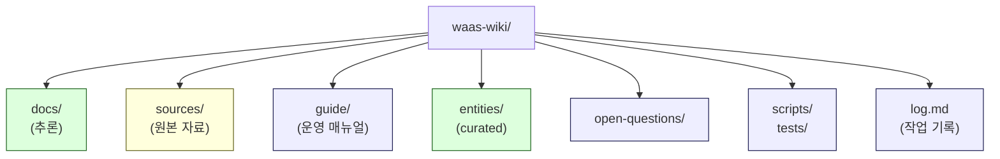

# 1. Repository Structure
> Repository 전체 지도 + source 와 reasoning 의 차이

---

## 1. Repository topology (전체 구조)

`waas-wiki/` 의 최상위 폴더는 다음과 같이 구성됩니다:

```
waas-wiki/
├── docs/                    # 추론 (reasoning) — corpus 의 본문
│   └── architecture/        # 61 개 architecture 문서 (D / C / E / R / T-series)
├── sources/                 # 원본 자료 (source material)
│   ├── fireblocks/          # Fireblocks vendor docs + 매핑 노트
│   └── nodeinfra/           # NodeInfra vendor docs + 매핑 노트
├── guide/                   # 이 가이드 (운영 매뉴얼)
├── entities/                # Curated Wiki entity / hub 정의 (생성 최소화)
├── open-questions/          # 해소되지 않은 질문 모음
├── prompts/                 # LLM 운영용 prompt 정의 (선택)
├── scripts/                 # ingest / lint / 도구 스크립트
├── tests/                   # corpus consistency 테스트
├── vendors/                 # 과거 vendor 디렉토리 (legacy, 점진적 통합 예정)
├── llm-wiki.md              # 전체 corpus 의 1 페이지 요약 (선택)
├── log.md                   # 모든 작업 stage 기록 (append-only)
└── README.md                # repo 진입점
```



각 폴더의 역할은 §3 부터 자세히 설명합니다.

---

## 2. 가장 중요한 한 가지: Source ≠ Reasoning

이 repository 에서 **가장 중요한 분리** 는 다음입니다:

| 폴더 | 무엇이 들어가는가 | 무엇이 들어가면 안 되는가 |
|------|------------------|-------------------------|
| `sources/` | 외부 자료 그대로 (vendor docs, PDF, markdown 변환본, 매핑 노트) | 일반화된 추론, 다른 vendor 와의 평가 비교 |
| `docs/` | **Generalized reasoning** (벤더 독립적인 추론, invariant, cluster) | vendor-specific 사실, marketing 문구, source 인용 의존 |

이 분리를 어기면 corpus 는 **vendor catalog** 로 전락합니다. 다시 말해:

```
[Source Fact]
Fireblocks 는 approval group 을 통해 m-of-n 승인을 구현한다.

[Generalized Mapping]
이는 D3 의 "approval state machine" invariant 의 한 instantiation 이다.

[★ Hypothesis]
모든 institutional custody 가 m-of-n 을 채택할 것이다.
```

위 3 가지를 **섞지 않는** 것이 corpus 의 기본 규율입니다.
[Source Fact] 는 `sources/<vendor>/` 안에 머무릅니다.
[Generalized Mapping] 은 `sources/<vendor>/source-notes/architecture-mapping.md` 같은 매핑 노트에 들어갑니다.
[★ Hypothesis] 는 항상 `★` 마커를 단 채로 `docs/` 또는 source-notes 에 들어갑니다.

자세한 ingestion 절차는 [05-source-ingestion.md](05-source-ingestion.md), 매핑의 실제 예시는 [10-walkthrough-nodeinfra.md](10-walkthrough-nodeinfra.md) 참고.

---

## 3. `docs/` — 추론의 본문

`docs/architecture/` 에 61 개의 generalized 추론 문서가 들어 있습니다.

```
docs/architecture/
├── (D-series, 33 docs)
│   ├── vault-wallet-ledger-db-schema.md         (D1a)
│   ├── reconciliation-settlement-consistency.md (D1b)
│   ├── signing-workflow-orchestration.md        (D2)
│   ├── approval-state-machine-governance.md     (D3)
│   ├── recovery-ceremony-generalization.md      (D4)
│   ├── audit-event-sourcing-evidence-chain.md   (D5)
│   ├── three-way-custody-decision-framework.md  (D6)
│   ├── ... (총 33 개)
│   └── post-quantum-custody-survivability.md    (D32)
│
├── (C-series, 6 docs)
│   ├── c1-master-corpus-index.md
│   ├── c2-invariant-catalog.md
│   ├── c3-dependency-graph.md
│   ├── c4-anti-pattern-catalog.md
│   ├── c5-audience-reading-paths.md
│   └── c6-open-questions-frontier-boundary.md
│
├── (E-series, 5 docs)
│   ├── e1-incident-driven-corpus-evolution.md
│   ├── e2-regulatory-sovereign-evolution.md
│   ├── e3-ai-automation-evolution-pressure.md
│   ├── e4-frontier-integration-discipline.md
│   └── e5-corpus-longevity-knowledge-survivability.md
│
├── (R-series, 11 docs)
│   ├── r0-reasoning-operations-charter.md
│   ├── r1-retrieval-discipline-architecture.md
│   ├── ... (총 11 개)
│   └── r10-failure-modes-long-lived-corpora.md
│
└── (T-series, 6 docs)
    ├── t0-theory-stewardship-charter.md
    ├── t1-corpus-drift-detection.md
    ├── ... (총 6 개)
    └── t5-stewardship-failure-modes.md
```

각 series 의 역할은 [02-corpus-layers.md](02-corpus-layers.md) 에서 자세히 설명합니다.

핵심:
- **`docs/` 의 내용은 vendor 이름이 등장하지 않거나, 등장하더라도 illustrative example 로만 사용됩니다.**
- **모든 D-doc 은 "≠" propositions 와 cluster bridge invariants 를 포함합니다.**
- **모든 generalized reasoning 은 `★ Hypothesis` 마커로 불확실성을 표시합니다.**

---

## 4. `sources/` — 원본 자료

`sources/` 는 외부 자료를 **그대로** 보존하는 폴더입니다. 현재 2 개 vendor 가 있습니다:

```
sources/
├── fireblocks/        # Fireblocks 자료
│   ├── pdf/           # PDF 원본
│   ├── markdown/      # 변환된 markdown (extracted)
│   ├── webpages/      # HTML 캡처
│   └── images/        # 이미지
│
└── nodeinfra/         # NodeInfra 자료 (Stage 35 ingestion)
    ├── raw/
    │   ├── html/      # 원본 HTML
    │   ├── markdown/  # 자동 변환된 markdown
    │   └── assets/    # 자산
    ├── normalized/
    │   ├── docs/      # 정제된 markdown (chrome 제거)
    │   └── diagrams/  # 추출된 diagram
    ├── source-notes/  # 매핑 노트 (이 가이드의 핵심)
    │   ├── inventory.md
    │   ├── architecture-mapping.md
    │   ├── invariant-mapping.md
    │   ├── vendor-specific-patterns.md
    │   ├── pm-db-design-notes.md
    │   └── unknowns.md
    └── README.md
```

각 vendor 폴더는 같은 패턴을 가집니다:
- **raw/** — 원본 그대로 (변환 minimal)
- **normalized/** — 읽기 좋게 정제 (UI chrome / marketing 제거)
- **source-notes/** — 이 corpus 와 연결하는 **매핑 노트** (가장 가치 있는 산출물)

새 vendor 를 추가하는 절차는 [05-source-ingestion.md](05-source-ingestion.md) 에 단계별로 정리되어 있습니다.

---

## 5. `entities/` — Curated Wiki (생성 최소화)

이 폴더에는 **명시적으로 정의된 entity / hub** 가 들어갑니다. **사용은 매우 보수적** 입니다 — 새 entity / hub 추가는 governance 결정 (R5 C3+) 이 필요합니다.

[Source Fact] 71 stage 동안 entity 생성 0 건 (entity-min discipline).

자세한 entity-min 규율은 [04-invariants-and-discipline.md §3](04-invariants-and-discipline.md) 참고.

---

## 6. `open-questions/` — 해소되지 않은 질문

도메인의 **현재 정답을 모르는 질문** 들을 모아 두는 폴더입니다. corpus 가 답하지 못하는 것을 **숨기지 않고 공개** 합니다.

각 entry 의 형식:
- 질문
- 현재까지의 증거
- 왜 아직 해소되지 않았는가
- 어떤 변화가 답을 가능하게 할 것인가

이 폴더의 entry 는 corpus 의 **honest limit declaration** 입니다.

---

## 7. `guide/` — 이 가이드

지금 읽고 있는 운영 매뉴얼입니다. corpus 자체에 대한 메타 문서이며, **새로 합류한 사람이 corpus 를 어떻게 운영하는지** 를 설명합니다.

이 폴더의 문서는 **corpus 의 일부가 아닙니다**. corpus 의 본문은 `docs/architecture/`. guide 는 **외부 onboarding 문서** 입니다.

---

## 8. `scripts/` / `tests/` — 도구

```
scripts/   # ingest 도구, lint 도구, 보조 스크립트
tests/     # corpus consistency / link 검사
```

[★ Hypothesis] 현재 단계에서는 도구가 풍부하지 않습니다. 향후 corpus 가 커지면 다음 자동화가 추가될 것입니다:
- 깨진 cross-reference 검사
- ≠ proposition 추출 도구
- ontology drift 검출
- 정기 lint

---

## 9. `log.md` — 모든 stage 의 작업 기록

이 corpus 는 stage 단위로 운영됩니다. 매 stage 마다 무엇을 했는지 `log.md` 에 **append-only** 로 기록됩니다.

[Source Fact] 현재까지 35 stage 가 기록되어 있습니다:

- Stage 1-31: Fireblocks vendor deepening (PDF / markdown / 매핑)
- Stage 32: 33 D-series + 6 C-series + 5 E-series 생성 (publication state)
- Stage 33: 11 R-series (Reasoning Operations Layer)
- Stage 34: 6 T-series (Theory Stewardship Layer)
- Stage 35: NodeInfra ingestion (sources/nodeinfra 구축)

log.md 는 corpus 의 **historical worldview record** 입니다 (R7 의 living archive).

---

## 10. 폴더 별 "넣어도 되는 것 / 안 되는 것"

| 폴더 | OK | NG |
|------|----|----|
| `docs/architecture/` | generalized reasoning, ≠ propositions, cluster bridges, ★ hypotheses with markers | vendor-specific facts, marketing 인용, ungrounded speculation, AI 가 통째 작성하고 검토되지 않은 글 |
| `sources/<vendor>/raw/` | vendor 자료 원본 (HTML/PDF/MD) | 우리의 reasoning, 다른 vendor 와의 평가 비교 |
| `sources/<vendor>/normalized/` | chrome 제거된 vendor 자료 | 분석, ★ Hypothesis, 추론 |
| `sources/<vendor>/source-notes/` | vendor → corpus 매핑, ★ Hypothesis (라벨링됨), unknowns 목록 | vendor 자료 본문 자체, 다른 vendor 평가 |
| `entities/` | 명시적 entity/hub 정의 (governance 통과한 것만) | 생각나는 entity 즉흥 생성 |
| `open-questions/` | 해소되지 않은 질문 + 증거 | 결론 |
| `guide/` | 운영 매뉴얼 / onboarding | corpus 본문 자체 |
| `log.md` | append-only stage 기록 | 과거 stage 의 silent 수정 |

---

## 11. 정리 — 5 가지 mental model

처음 합류한 사람에게 가장 중요한 mental model 5 가지:

1. **`docs/` 는 우리의 추론, `sources/` 는 외부 자료** — 절대 섞지 않는다.
2. **`docs/architecture/` 안은 D/C/E/R/T 5 layer** — 무엇이 어디 들어가는지는 [02](02-corpus-layers.md) 참고.
3. **모든 새로운 source 는 `sources/<vendor>/source-notes/` 에서 corpus 와 연결** — vendor 자료 자체는 절대 corpus 본문이 되지 않는다.
4. **새 entity / hub 생성은 매우 보수적** — entity-min discipline.
5. **모든 작업은 `log.md` 에 stage 단위로 기록** — silent 수정 금지.

이 5 가지를 지키면 corpus 의 운영 원칙을 90% 이해한 것입니다.

---

## 다음 읽을 글

- 어떤 시리즈가 어떤 일을 하는지 → [02-corpus-layers.md](02-corpus-layers.md)
- 작업 흐름이 궁금하면 → [03-reasoning-lifecycle.md](03-reasoning-lifecycle.md)
- 새 source 추가 절차 → [05-source-ingestion.md](05-source-ingestion.md)
- 실제 NodeInfra ingestion 사례 → [10-walkthrough-nodeinfra.md](10-walkthrough-nodeinfra.md)
