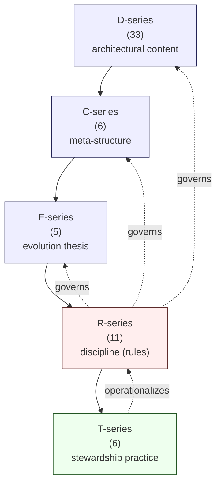
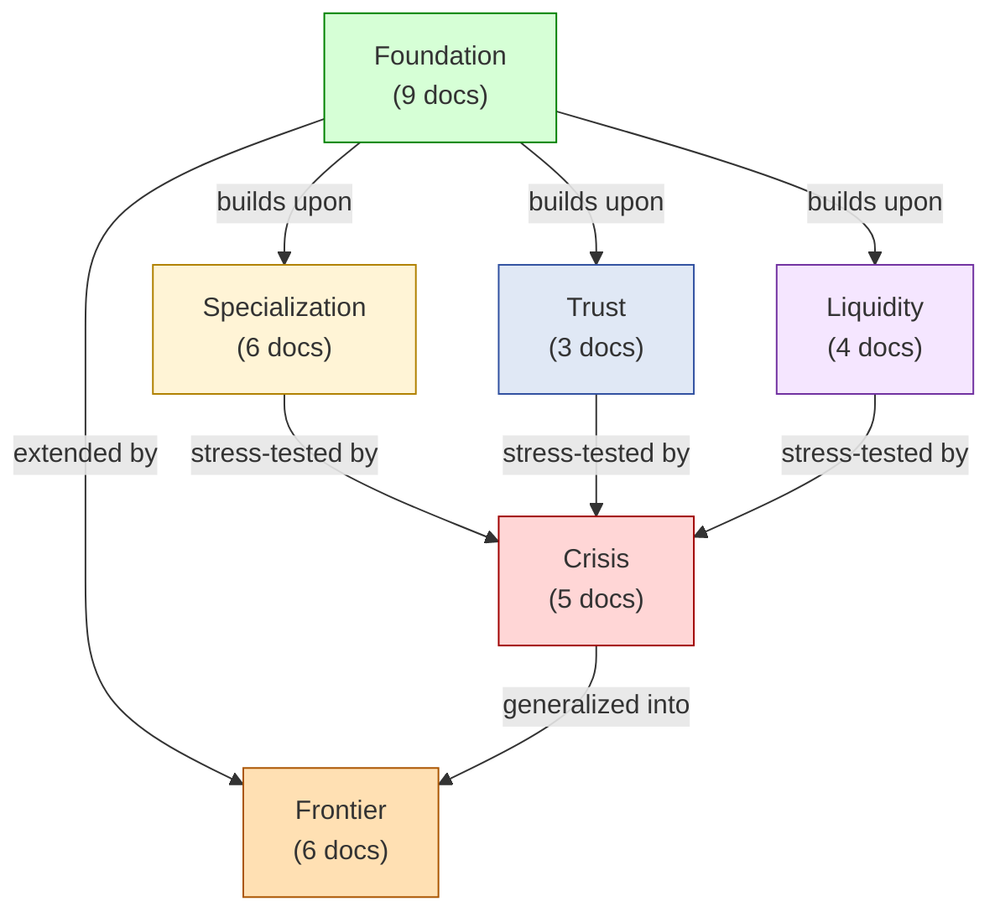
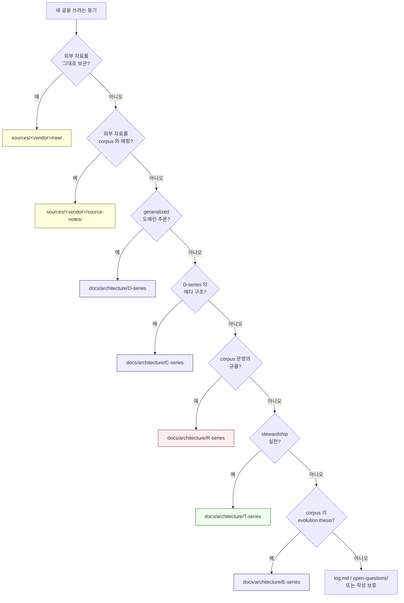

# 2. Corpus Layers — D / C / E / R / T
> 5 개 layer 의 역할과 관계

이 corpus 의 본문 (`docs/architecture/`) 은 **5 개 layer** 로 구성됩니다. 각 layer 는 다른 목적, 다른 voice, 다른 변경 cadence 를 가집니다.

---

## 1. 한눈에 보기

| Layer | 문서 수 | 한 줄 정의 | Voice |
|-------|--------|-----------|-------|
| **D-series** | 33 | What & Why (architectural content) | Architectural |
| **C-series** | 6 | Meta-structure of D-series (navigation / invariants / dependencies / anti-patterns / reading paths / open questions) | Navigational |
| **E-series** | 5 | corpus 가 시간에 따라 어떻게 진화하는가 | Historical-forward |
| **R-series** | 11 | corpus 운영의 **규율 (rules)** | Specification |
| **T-series** | 6 | stewardship 의 **실천 (practice)** | Practitioner |



요약:
- **D / C / E** 는 corpus 가 **무엇을 말하는가** 를 담당.
- **R** 은 corpus 를 **어떻게 운영해야 하는가** 를 규정.
- **T** 는 그 규율을 **stewards 가 실제로 어떻게 practice 하는가** 를 manual 로 적은 것.

---

## 2. D-series — Domain reasoning (33 docs)

> **무엇을 담는가**: 도메인에 대한 generalized reasoning. invariant, state machine, threat model, evidence chain 등.

D-series 는 corpus 의 본문입니다. 33 개 문서가 **6 cluster** 로 묶여 있습니다.

| Cluster | 문서 수 | 무엇을 다루는가 |
|---------|--------|----------------|
| **Foundation** | 9 | Vault / Wallet / Ledger / Signing / Approval / Recovery / Evidence / Deposit / Withdrawal — custody 의 기초 |
| **Specialization** | 6 | Multi-chain / Treasury / Compliance / Operational Maturity / Cross-border / Security |
| **Trust** | 3 | Transparency / Identity / Reporting |
| **Liquidity** | 4 | Treasury Optimization / Omnibus / Internal Netting / Cross-institution Liquidity |
| **Crisis** | 5 | Depeg / Chain halt / Jurisdiction split / Liquidity freeze / Custody failure |
| **Frontier** | 6 | CBDC / Intent / Autonomous Treasury / AI-assisted governance / Privacy / Post-quantum |

### D-doc 의 표준 구조

각 D-doc 은 일반적으로 다음 섹션을 포함합니다:

```
0. 핵심 명제 (10초 이해)
1. Core thesis
2. ≠ Propositions (5+ 개)
3. 본문 (architecture / state machine / threat model 등)
4. Operational fragility map
5. Limitations
6. 3-way burden comparison (SaaS / Hosted MPC / Direct-build)
7. Q1-Q10 reasoning
8. Open questions
9. References + Uncertainty boundary
10. (Cluster doc 이면) Bridge invariants
```

[Source Fact] 33 D-doc × 평균 5+ ≠ propositions = **200+ ≠ propositions** 가 corpus 에 분산되어 있습니다.

### Cluster 간 관계



핵심:
- **Foundation 은 모든 cluster 의 prerequisite** — 새로 합류하면 Foundation 부터 읽으세요.
- **Crisis cluster 는 prior cluster 들의 stress test** — 가장 통합적 cluster.
- **Frontier 는 speculative** — `★ Hypothesis` 마커 밀도가 가장 높음.

---

## 3. C-series — Consolidation (6 docs)

> **무엇을 담는가**: D-series 의 메타 구조. D-series 를 읽는 navigation aid.

C-series 는 D-series 의 **목차 + 색인 + 안내문** 역할입니다.

| 문서 | 역할 |
|------|------|
| **C1** | Master Corpus Index — 전체 cluster 와 reading order 지도 |
| **C2** | Invariant Catalog — corpus 전체의 ≠ propositions 목록 |
| **C3** | Dependency Graph — doc 간 prerequisite / bridge invariant 관계 |
| **C4** | Anti-pattern Catalog — 절대 하면 안 되는 architectural 결정들 |
| **C5** | Audience Reading Paths — PM / Engineer / Compliance / Treasury / Crisis 별 reading 순서 |
| **C6** | Open Questions / Frontier Boundary — corpus 가 답하지 못한 질문 + frontier 경계 |

### C-series 는 언제 읽나

| 상황 | 어떤 C-doc |
|------|-----------|
| 처음 합류, 전체 지도 필요 | C1 |
| 특정 ≠ proposition 의 출처가 궁금 | C2 |
| 어떤 doc 이 어떤 doc 의 prerequisite 인지 | C3 |
| 어떤 architecture 가 anti-pattern 인지 검증 | C4 |
| 내 역할에 맞는 reading order 가 필요 | C5 |
| corpus 가 답하지 못한 질문이 무엇인지 | C6 |

[Source Fact] C1 은 Stage 33 R-series, Stage 34 T-series 가 추가되면서 §13, §14 amendment 가 append 되었습니다 (R7 worldview preservation 원칙 — 이전 §0-§12 는 그대로 보존).

---

## 4. E-series — Evolution (5 docs)

> **무엇을 담는가**: corpus 가 시간에 따라 어떻게 진화하는가에 대한 사고.

E-series 는 corpus 가 **하나의 시점에 정지된 publication 이 아니라 living document** 라는 사실을 다룹니다.

| 문서 | Core thesis |
|------|------------|
| **E1** | Institutional architecture theories evolve primarily through **failure exposure**, not steady-state optimization |
| **E2** | Architecture evolves through **sovereign and regulatory reinterpretation** of legitimacy |
| **E3** | AI pressure transforms institutions not by replacing humans, but by **reshaping coordination, accountability, operational expectations** |
| **E4** | Emerging financial primitives must survive **conservative survivability scrutiny** before entering institutional architecture |
| **E5** | The survivability of institutional knowledge is itself an architectural problem |

### E-series 는 언제 참고하나

- 새 D-doc 을 추가할지 고민할 때 → E4 (frontier integration discipline)
- 어떤 incident 가 발생했을 때 → E1 (incident-driven evolution)
- 규제가 바뀌었을 때 → E2 (regulatory evolution)
- 새 AI / automation 도구를 도입할 때 → E3 (AI pressure)
- 장기 운영의 health 가 궁금할 때 → E5 (knowledge survivability)

---

## 5. R-series — Reasoning Operations (11 docs, **discipline**)

> **무엇을 담는가**: corpus 를 **어떻게 운영해야 하는지** 의 규율 (specification).

R-series 는 corpus 가 **publication artifact 에서 governed institutional reasoning system** 으로 전환되도록 만드는 layer 입니다.

| 문서 | 다루는 영역 |
|------|------------|
| **R0** | Charter — R-series 의 헌장 + 10 operational invariants |
| **R1** | Retrieval Discipline — corpus 에서 어떻게 정보를 retrieve 할 것인가 |
| **R2** | Reasoning Flow — 질문 → 답변 까지의 7-stage 흐름 |
| **R3** | Contradiction Management — 모순을 어떻게 분류 / 보존 / 해소하는가 (T1-T5) |
| **R4** | Ontology Stability — 용어와 의미가 시간이 지나도 drift 하지 않게 하는 규율 |
| **R5** | Evolution Governance — corpus 변경의 authority / cadence / audit |
| **R6** | Knowledge Decay — 어떤 내용이 얼마나 빨리 stale 해지는가 (Class A-E) |
| **R7** | Historical Worldview Preservation — silent rewrite 금지, snapshot + annotation |
| **R8** | Human Review Boundary — AI 가 할 수 있는 것 vs 사람이 해야 하는 것 (Zone A/B/C) |
| **R9** | AI-assisted Reasoning Constraints — AI 가 하면 안 되는 행동 catalog |
| **R10** | Failure Modes of Long-lived Corpora — corpus 전체가 망가지는 12 가지 양상 |

### R-series 는 누가 읽나

- **Steward** — 모두 읽어야 합니다.
- **개발자 / PM** — 새 reasoning 을 추가할 때 R5 + R2.
- **AI 활용자** — R8, R9 는 필독.
- **연구자** — R0, R10 (전체 framing).

---

## 6. T-series — Theory Stewardship (6 docs, **practice**)

> **무엇을 담는가**: R-series 의 규율을 **stewards 가 실제로 어떻게 practice 하는지** 의 manual.

R-series 가 **"규율 이렇게 해야 한다"** 라면, T-series 는 **"규율 이렇게 하면 된다"** 의 실천 매뉴얼입니다.

| 문서 | 다루는 영역 |
|------|------------|
| **T0** | Theory Stewardship Charter — 10 stewardship spirit commitments + cadence |
| **T1** | Corpus Drift Detection — 주마다 / 달마다 / 분기마다 어떻게 drift 를 잡아내는가 |
| **T2** | Contradiction Governance — 모순을 어떻게 triage 하고 conversation 하는가 |
| **T3** | Institutional Memory Survivability — steward 가 바뀌어도 memory 가 살아남게 하는 6-class artifact |
| **T4** | Controlled Evolution — 변경 압력을 어떻게 받고 / 거절하고 / 미루는가 |
| **T5** | Stewardship Failure Modes — steward 자신이 빠지는 10 가지 함정 (SF1-SF10) |

### R-series 와 T-series 의 관계

| 질문 | 어디서 답을 얻나 |
|------|----------------|
| 어떤 규율을 지켜야 하나? | R-series |
| 그 규율의 compliance 가 실제로 어떻게 보이나? | T-series |
| 무엇이 지켜졌어야 하는가? | R-series |
| stewards 가 실제로 무엇을 했는가? | T-series |
| 이 artifact 가 왜 필요한가? | R-series |
| 이 artifact 를 매주 어떻게 practice 하는가? | T-series |

R-only 면 **bureaucratic** stewardship (규칙만 지킴, 판단 없음).
T-only 면 **artisanal** stewardship (감각만 있음, 규칙 없음).
**두 layer 가 짝으로 사용될 때** load-bearing 합니다.

---

## 7. 시리즈 간 진화 cadence

| Layer | 변경 cadence (typical) | 예 |
|-------|---------------------|-----|
| D-series | 분기 (quarterly) — incident / regulatory event 시 amendment | D14 threat model 이 new threat 출현 시 |
| C-series | 분기 — D-series 가 늘어나면 navigation 업데이트 | 새 D-doc 추가 시 C1 amendment |
| E-series | 반기 (semi-annual) — corpus 의 evolution thesis 자체가 바뀔 때 | 신규 frontier 도메인 출현 |
| R-series | 연 (annual) — discipline 자체 review | 새 AI 운영 패턴 발견 시 |
| T-series | 연 (annual) — practice 의 reflection | 새 stewardship 운영 단위 등장 |

T-series 가 가장 천천히 evolve 합니다 — practice tradition 은 오래 살아남아야 합니다.

---

## 8. 정리 — "어디에 글을 쓸지" 결정 트리

새로운 글을 쓰고 싶을 때:



대부분의 글은 **`source-notes/` 또는 `D-series`** 에 들어갑니다. C/E/R/T 추가는 드물고, 추가 시 governance 검토가 필요합니다.

---

## 9. 자주 헷갈리는 것

### Q. D 와 C 는 무슨 차이인가?
A. **D 는 도메인 내용**, **C 는 D 의 메타 구조**. D 는 "approval state machine 이 어떻게 작동하는가", C 는 "D2 와 D3 가 어떤 관계인가". 둘이 섞이면 D 가 메타 발언만 하다가 도메인 내용을 못 다루는 사고가 발생합니다.

### Q. R 과 T 는 같은 영역 아닌가?
A. **R 은 규율 specification, T 는 실천 manual**. 비유하자면 R 은 "법", T 는 "judges 가 법을 실제로 어떻게 적용하는가". 둘 다 필요합니다.

### Q. E-series 는 진화한 reasoning 인가?
A. 아니오. **E-series 는 corpus 가 어떻게 진화하는가에 대한 사고** 입니다 (메타 thesis). 실제 진화 결과는 D-doc 의 amendment 로 나타납니다.

### Q. sources 의 source-notes 와 docs 의 D-series 의 차이는?
A. **source-notes 는 vendor-specific** (한 vendor 의 architecture 가 D-series 와 어떻게 매핑되는가). **D-series 는 vendor-independent generalized reasoning**. sources/<vendor>/source-notes/architecture-mapping.md 가 그 다리 역할을 합니다.

---

## 다음 읽을 글

- 실제 작업 흐름 → [03-reasoning-lifecycle.md](03-reasoning-lifecycle.md)
- 왜 ≠ 명제 가 중요한지 → [04-invariants-and-discipline.md](04-invariants-and-discipline.md)
- 새 D-doc 추가 기준 → [06-adding-reasoning.md](06-adding-reasoning.md)
- 실제 사례 → [10-walkthrough-nodeinfra.md](10-walkthrough-nodeinfra.md)
