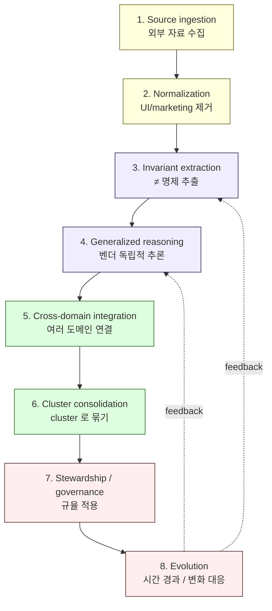
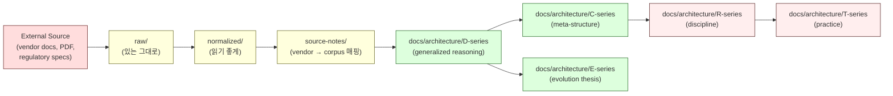

# 3. Reasoning Lifecycle
> Source 가 corpus 의 reasoning 으로 변환되는 흐름

이 문서는 **외부 자료를 어떻게 corpus 의 generalized reasoning 으로 변환하는가** 의 lifecycle 을 설명합니다.

---

## 1. 한눈에 보기



각 단계는 **결과물 (artifact)** 을 남깁니다. lifecycle 을 정확히 따르지 않으면 source 와 reasoning 이 섞이거나, generalized 가 아닌 vendor catalog 가 만들어집니다.

---

## 2. 단계별 상세

### Stage 1 — Source ingestion (원본 수집)

**무엇을 하나**: 외부 vendor / 규제기관 / 표준의 자료를 그대로 가져온다.

**왜 필요한가**: 우리는 corpus 의 **single source of truth** 가 아닙니다. vendor docs, regulatory specs, incident reports 같은 외부 자료가 reasoning 의 출발점입니다. 그 자료를 잃지 않고 **원형 그대로** 보존해야 합니다.

**결과물**:
- `sources/<vendor>/raw/html/` — HTML 캡처
- `sources/<vendor>/raw/markdown/` — 자동 변환 markdown
- `sources/<vendor>/raw/assets/` — 이미지, diagram, PDF

**예시**: NodeInfra 의 경우 Mintlify-rendered HTML 을 42 page 캡처 → BeautifulSoup 로 markdown 변환.

**원칙**:
- 원본을 변형하지 않는다 (HTML 그대로 저장).
- 자동 변환은 별도 markdown 으로 저장 (raw 와 구분).
- URL, 수집일, 변환 도구를 frontmatter 에 기록.

### Stage 2 — Normalization (정제)

**무엇을 하나**: 수집한 자료에서 **UI chrome / marketing 문구 / 광고 / nav bar / footer** 등 reasoning 에 무관한 요소를 제거한다.

**왜 필요한가**: raw 자료는 보존 가치가 있지만 읽기 어렵습니다. normalize 된 버전이 **사람이 읽기 좋고**, 후속 분석 (invariant 추출) 의 입력이 됩니다.

**결과물**:
- `sources/<vendor>/normalized/docs/<name>.md`

**예시**: NodeInfra normalize 시 다음을 제거 — `$/$`, `Skip to main content`, `Powered by Mintlify`, `Search...`, `Ask AI`, "Documentation Index" callout 등.

**원칙**:
- normalize 는 자동화 (`scripts/normalize.py`).
- frontmatter 에 normalize 출처 / 일자 기록.
- 원본 raw 는 절대 변형하지 않는다 — 별도 normalized/ 폴더에 저장.

### Stage 3 — Invariant extraction (≠ 명제 추출)

**무엇을 하나**: normalize 된 자료에서 **vendor 가 구조적으로 가정하는 ≠ 명제** 를 뽑아낸다.

**왜 필요한가**: vendor 자료는 자기 architecture 를 설명합니다. 그 설명에서 **"무엇과 무엇을 구분하는가"** 를 추출하면, vendor 가 명시적으로 말하지 않은 design invariant 가 드러납니다.

**결과물**:
- `sources/<vendor>/source-notes/invariant-mapping.md`

**예시**:

```
[Source Fact, NodeInfra]
"개시 키 ≠ 승인 키 ≠ 실행 키" — 3 키를 별개의 서비스가 보유한다.

[Generalized Mapping]
이는 D2 의 "Signing ≠ Approval" invariant 의 한 instantiation 이다.

[★ Hypothesis]
HSM 기반 3-key 가 MPC 기반 3-key 보다 audit 관점에서 단순하다.
```

**원칙**:
- 라벨링: `[Source Fact]` / `[Generalized Mapping]` / `[★ Hypothesis]` 명확히 구분.
- vendor 가 말한 것과 우리가 추론한 것을 섞지 않는다.
- 한 vendor 에서 ≥1 ≠ proposition 을 명확히 추출하면 ingestion 의 minimum bar 통과.

### Stage 4 — Generalized reasoning (벤더 독립적 추론)

**무엇을 하나**: 여러 vendor 의 invariant 를 비교해서, **vendor 의 이름이 없어도 성립하는 generalized reasoning** 을 만든다.

**왜 필요한가**: corpus 의 가치는 vendor catalog 가 아니라 **시간이 지나도 유효한 architectural reasoning** 에 있습니다. Fireblocks 가 망해도, NodeInfra 가 망해도, 우리의 reasoning 은 살아남아야 합니다.

**결과물**:
- `docs/architecture/<topic>.md` (D-series)

**예시**: Fireblocks 의 approval group + NodeInfra 의 approval_tier rule + 다른 vendor 의 m-of-n quorum 을 통합 → D3 `approval-state-machine-governance.md` 의 "11-state governance state machine" 으로 generalize.

**원칙**:
- vendor 이름은 illustrative example 로만 등장 (절대 default 가 아님).
- 모든 generalized claim 에 `★ Hypothesis` 마커.
- 5+ ≠ propositions, 3-way burden comparison (SaaS / Hosted MPC / Direct-build) 포함.

### Stage 5 — Cross-domain integration

**무엇을 하나**: 같은 cluster 내, 그리고 cluster 간 **bridge invariants** 를 명시한다.

**왜 필요한가**: institutional architecture 는 격리된 도메인이 아니라 **서로 영향을 주고받는 시스템** 입니다. D2 (signing) 가 D5 (audit) 에 어떻게 evidence 를 공급하는지, D3 (approval) 가 D11 (compliance) 와 어떻게 연결되는지 — 이 bridge 를 명시해야 cluster 가 단편화되지 않습니다.

**결과물**:
- 각 D-doc 의 끝부분 §Bridge invariants
- `docs/architecture/c3-dependency-graph.md` 의 cross-cluster 매핑

**예시**: D2 → D5 bridge: "multisig 의 signing chain 이 D5 Layer 1 evidence (chain Ed25519 sig) 를 생산한다."

**원칙**:
- bridge invariant 는 양 cluster 가 모두 인정해야 한다.
- bridge 는 단방향이 아니라 양방향 cross-reference.
- C3 dependency graph 에 명시적으로 등재.

### Stage 6 — Cluster consolidation

**무엇을 하나**: D-doc 들을 **cluster (Foundation / Specialization / Trust / Liquidity / Crisis / Frontier)** 로 묶고, cluster 단위의 reading path, master index 를 정리한다.

**왜 필요한가**: 33 doc 을 무작위 나열하면 reader 가 navigate 못합니다. cluster 구조 + reading path 가 있어야 PM, 개발자, security ops 등 다양한 reader 가 자기 path 로 들어올 수 있습니다.

**결과물**:
- `docs/architecture/c1-master-corpus-index.md`
- `docs/architecture/c5-audience-reading-paths.md`
- `docs/architecture/c3-dependency-graph.md`

**원칙**:
- cluster 경계는 **stable** (개념적 분류가 흔들리면 corpus 가 흔들림).
- cluster 이동은 governance event (R5 C3+).
- reading path 는 audience 별 (PM / engineer / compliance / treasury / crisis / frontier).

### Stage 7 — Stewardship / governance

**무엇을 하나**: 추가된 reasoning 을 **검토, 매핑, 모순 감지, drift 감지** 한다.

**왜 필요한가**: 한 번 추가된 reasoning 도 시간이 지나면 outdated 되거나 새로운 reasoning 과 충돌할 수 있습니다. **누가 / 언제 / 어떤 권한으로** 검토하는가가 정해져야 corpus 가 무너지지 않습니다.

**결과물**:
- governance audit trail (R5)
- drift report (T1)
- contradiction registry (R3, T2)

**원칙**:
- 모든 변경은 audit trail 에 기록.
- silent rewrite 금지 (R7).
- 검토 cadence: weekly / monthly / quarterly / annual.

자세한 stewardship workflow 는 [07-stewardship.md](07-stewardship.md) 참고.

### Stage 8 — Evolution

**무엇을 하나**: 시간이 지나면서 발생하는 4 가지 evolution 압력을 받아낸다 — incident-driven (E1), regulatory (E2), AI pressure (E3), frontier (E4).

**왜 필요한가**: corpus 가 시간에 따라 outdated 되지 않으려면, 변화를 **수동으로 받아내는 메커니즘** 이 필요합니다. silent 한 자연 evolve 가 아니라 **명시적, 검토된, 기록된** evolution.

**결과물**:
- 새로운 D-doc 또는 기존 D-doc 의 amendment
- E1-E5 의 thesis 갱신
- R7 snapshot + worldview annotation

**원칙**:
- evolution 은 **slow + visible + reversible**.
- prior worldview 는 보존 (R7 snapshot).
- 신규 추가 / amendment 는 cooling-off period 거침.

---

## 3. Lifecycle 의 핵심 invariant

이 lifecycle 은 다음 invariant 를 절대 위반하지 않습니다:

| Invariant | 무엇을 의미 |
|-----------|------------|
| Source ≠ Reasoning | `sources/` 와 `docs/` 를 섞지 않는다 |
| ≠ marker preserved | `[Source Fact]` / `[Generalized Mapping]` / `[★ Hypothesis]` 가 모든 단계에서 보존 |
| Append-only history | 이전 stage 의 결과물을 silent 하게 수정하지 않는다 |
| Visible uncertainty | 모든 generalized claim 에 ★ marker |
| Human accountability | 모든 변경에 named reviewer |

이 5 가지가 무너지면 lifecycle 의 결과물도 무너집니다.

---

## 4. 한 페이지 요약



이 그림이 **lifecycle 의 한 페이지 요약** 입니다.

---

## 5. 각 단계별 시간 가이드 (★ Hypothesis — 단일 vendor 기준)

| Stage | 작업 시간 | 자동화 정도 |
|-------|----------|------------|
| 1. Source ingestion | 30 분 ~ 2 시간 (crawl 도구 작성 + 인증 + 실행) | 부분 자동 |
| 2. Normalization | 5 ~ 30 분 (script 실행) | 완전 자동 |
| 3. Invariant extraction | 1 ~ 4 시간 (인간 분석) | 수동 (AI 지원 가능) |
| 4. Generalized reasoning | 2 ~ 8 시간 (D-doc 한 편 작성) | 수동 |
| 5. Cross-domain integration | 1 ~ 4 시간 (bridge invariant 명시) | 수동 |
| 6. Cluster consolidation | 30 분 ~ 2 시간 (C1, C3, C5 amendment) | 수동 |
| 7. Stewardship | 분기 cycle 별 ~1 일 | 수동 + audit trail 자동 |
| 8. Evolution | event-driven | 수동 |

**Stage 1-2 는 자동화 가능**. Stage 3-6 은 **인간의 판단** 이 핵심. Stage 7-8 은 **stewardship 시간** 이 따로 필요.

---

## 6. 자주 묻는 질문

### Q. lifecycle 의 모든 단계를 다 거쳐야 하나?
A. 아니오. 작은 변경 (E1 의 incident-driven amendment 같은 것) 은 Stage 1-3 만 거치고 끝날 수 있습니다. 큰 변경 (새 cluster 추가 같은 것) 은 Stage 1-8 전체.

### Q. Stage 4 를 거치지 않고 source 만 보존해도 되나?
A. 됩니다. 자료만 보존하고 reasoning 으로 통합하지 않는 vendor 도 있을 수 있습니다. 그 경우 `sources/<vendor>/` 에만 자료를 두고, 매핑은 미루세요. 단 **매핑 없는 source 는 corpus 에 기여하지 못합니다** — 결국 매핑이 필요합니다.

### Q. 매핑 (source-notes) 만 있고 D-doc 추가는 안 해도 되나?
A. 됩니다. 한 vendor 의 매핑만으로는 generalized 라고 할 수 없습니다 — 여러 vendor 의 매핑이 누적되어야 D-doc 으로 통합할 가치가 생깁니다.

### Q. log.md 는 lifecycle 의 어느 단계?
A. **모든 단계에 걸쳐**. log.md 는 stage 단위로 **각 lifecycle iteration 이 무엇을 했는가** 를 기록하는 append-only journal 입니다.

---

## 다음 읽을 글

- 왜 ≠ 명제 가 중요한지 → [04-invariants-and-discipline.md](04-invariants-and-discipline.md)
- 새 source 추가 절차 → [05-source-ingestion.md](05-source-ingestion.md)
- 새 D-doc 추가 기준 → [06-adding-reasoning.md](06-adding-reasoning.md)
- 실제 사례 walkthrough → [10-walkthrough-nodeinfra.md](10-walkthrough-nodeinfra.md)
