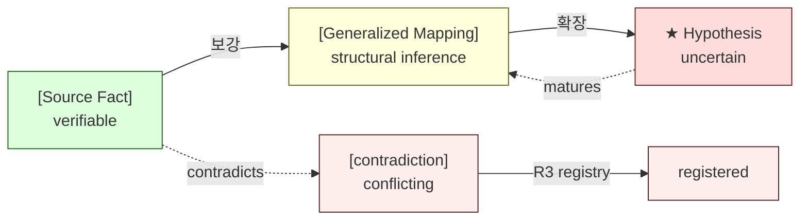
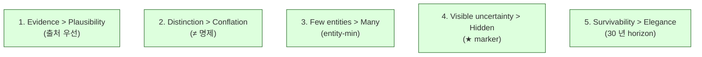

# 4. Invariants & Discipline
> ≠ 명제 / Evidence-first / Entity-min 의 이유

이 문서는 corpus 가 **왜 특정한 규율을 고집하는지** 를 설명합니다. 이해하면 corpus 의 운영 원칙 절반이 자명해집니다.

---

## 1. ≠ Propositions (≠ 명제) — 무엇과 무엇을 구분하는가

### 1.1 왜 "≠" 인가

institutional architecture 에서 **가장 자주 일어나는 사고** 는 **서로 다른 개념을 같은 것으로 가정한 것** 입니다. 예:

- "approval 이 났으니 signing 도 됐겠지" → 사고
- "balance equal 이니 reconciliation 통과겠지" → 사고
- "audit log 가 있으니 evidence chain 도 있겠지" → 사고
- "transparency 가 있으니 trust 도 자동 생기겠지" → 사고

이 사고 패턴을 **사전에 분리해 두는** 것이 ≠ proposition 의 역할입니다.

### 1.2 ≠ proposition 예시

corpus 의 200+ ≠ propositions 중 대표적인 것들:

| ≠ proposition | 어떤 사고를 막는가 |
|----------------|-------------------|
| Approval ≠ Signing | approval 만으로 자금 이동이 일어났다고 가정 |
| Signing ≠ Broadcasting | sign 된 tx 가 자동 broadcast 된다고 가정 |
| Settlement ≠ Finality | settle 된 tx 가 더 이상 뒤집을 수 없다고 가정 |
| Audit ≠ Logging | log 가 있으면 audit 가능하다고 가정 |
| Transparency ≠ Trust | 공개되어 있으면 신뢰할 수 있다고 가정 |
| Recovery ≠ Backup | backup 만 있으면 recover 가능하다고 가정 |
| Reconciliation ≠ Balance equality | 잔액 같으면 reconcile 됐다고 가정 |
| Multi-chain ≠ Multi-currency | chain 추가 = currency 추가 라고 가정 |
| Compliance ≠ Regulation-following | 규제 준수만 하면 compliance 라고 가정 |
| MPC retry ≠ Idempotent | MPC 호출 retry 가 안전하다고 가정 |

이 각각이 **실제 사고 사례** 또는 **명백한 design pitfall** 을 막아냅니다.

### 1.3 ≠ proposition 의 규칙

- 매 D-doc 은 **5+ 개 ≠ propositions** 를 포함합니다.
- ≠ propositions 는 **doc 첫 부분** 에 명시됩니다 (10초 이해를 위해).
- 모든 ≠ propositions 는 **C2 invariant catalog** 에 색인됩니다.
- ≠ propositions 가 **충돌하면** R3 (Contradiction Management) 에 등록.

### 1.4 ≠ proposition 추출 방법

source 에서 ≠ proposition 을 어떻게 뽑는가:

1. vendor 가 자기 architecture 를 설명할 때, **어떤 개념을 명확히 분리** 하는지 본다.
2. 그 분리가 **다른 vendor 도 동일하게 인정** 할 가능성이 있는지 본다.
3. 분리를 **단순화하지 않고** ≠ 형태로 적는다 — "X ≠ Y because Z".

[Source Fact] NodeInfra 의 경우 `개시 키 ≠ 승인 키 ≠ 실행 키`, `Allow ≠ Held ≠ Deny`, `Layer 1 ≠ Layer 2 audit`, `policy_decisions 의 set-once column` 등 ≥27 개 ≠ propositions 가 추출되었습니다 (자세한 것은 [`sources/nodeinfra/source-notes/invariant-mapping.md`](../sources/nodeinfra/source-notes/invariant-mapping.md)).

---

## 2. Evidence-first & Trust Boundary (증거 우선)

### 2.1 Evidence-first 가 의미하는 것

이 corpus 의 모든 주장은 다음 4 가지 형태 중 하나여야 합니다:

| 형태 | 의미 | 마커 |
|------|------|------|
| **[Source Fact]** | vendor / regulator / 공식 문서가 명시한 사실 | `[Source Fact]` |
| **[Source Fact, cite]** | 위 + 특정 출처 cite | `[Source Fact, NodeInfra index.md §1]` |
| **[Generalized Mapping]** | 우리가 source 를 generalize 한 결과 | `[Generalized Mapping]` |
| **[★ Hypothesis]** | 증거 부족 상태에서의 추측 | `★ Hypothesis` |

라벨이 **없는 주장** 은 corpus 의 일부가 될 수 없습니다.

### 2.2 왜 evidence-first 인가

문제 상황: vendor docs 는 marketing 톤이 자주 섞입니다. 그것을 그대로 corpus 에 옮기면 corpus 가 vendor marketing 카탈로그가 됩니다.

```
[BAD]
Fireblocks 의 MPC 는 가장 안전한 wallet 기술이다.

[GOOD]
[Source Fact] Fireblocks 는 MPC-CMP 3-endpoint orchestration 을 채택한다.
[Generalized Mapping] 이는 D2 의 signing workflow invariant 의 한 instantiation 이다.
[★ Hypothesis] MPC 기반 signing 이 HSM 기반 multi-key 보다 cryptographic operational 측면에서 더 복잡하다.
```

두 번째 형태가 corpus 의 표준입니다. **vendor marketing claim 은 절대 fact 가 될 수 없습니다**.

### 2.3 Trust boundary (신뢰 경계)

위의 4 가지 라벨은 **다른 trust level** 을 의미합니다:



corpus 의 reader 는 **어떤 라벨인지** 만 봐도 그 주장의 **신뢰 수준** 을 알 수 있어야 합니다.

### 2.4 Append-only (덧붙이기만)

이미 publish 된 내용을 **silent 하게 수정하지 않습니다**:

- 새 fact 가 나오면 → amendment 추가 (`§N. Stage XX Amendment`)
- 새 사고가 나오면 → supersession + R7 snapshot
- 잘못된 것을 발견하면 → 정정 amendment + R7 snapshot 으로 이전 worldview 보존

이렇게 하는 이유:
- 미래의 reader 가 "2026 년에 우리가 무엇을 알고 있었는가" 를 재구성 가능
- 과거 의사결정이 **현재 cherry-picked 된 reasoning 으로 평가되지 않음**
- corpus 의 self-trust 가 유지됨

### 2.5 Survivability > Efficiency

새 문서를 쓸 때 자주 마주치는 선택:

**A 안**: 우아하고 짧지만, 30 년 후에 outdated 될 가능성이 높음
**B 안**: 다소 verbose 하지만, 30 년 후에도 의미가 통할 가능성이 높음

이 corpus 는 **항상 B 안** 을 선택합니다.

예:
- vendor name 을 일등 시민으로 등장시키는 대신, generalized name 으로 추론.
- 특정 기술 (예: SGX) 을 가정한 reasoning 보다, 추상화한 TEE 개념으로 추론.
- 특정 jurisdiction 의 규제를 default 로 가정하지 않음.

이것이 **survivability > efficiency** 의 의미입니다.

---

## 3. Entity-min Discipline (entity 최소화)

### 3.1 왜 entity 를 늘리지 않는가

복잡한 시스템에서 가장 자주 발생하는 사고는 **개념 폭발 (conceptual explosion)** 입니다. 누군가 새 entity 를 도입하면, 그 entity 의 정의 / 다른 entity 와의 관계 / lifecycle / drift 모두를 운영해야 합니다.

10 개의 entity 가 있는 system 보다 5 개로 다 표현되는 system 이 **decade 단위로 더 잘 살아남습니다**.

### 3.2 Entity-min 의 원칙

- 새 entity / hub 를 도입하기 전에 **기존 invariant 로 표현 가능한가** 검토.
- 가능하면 **새 entity 도입 거부**.
- 도입이 정말 필요하면 **governance 검토** (R5 C3+) 통과 후 추가.

### 3.3 실제 운영 사례

[Source Fact] 이 corpus 는 **Stage 6 부터 Stage 35 까지 71 stage 연속으로 신규 entity / hub 생성 0 건** 을 유지하고 있습니다.

이게 가능한 이유:
- 새로운 도메인 등장 시, **기존 cluster 안의 invariant 로 mapping**.
- vendor-specific 패턴은 `sources/<vendor>/source-notes/vendor-specific-patterns.md` 에 격리.
- 우리가 새 entity 를 만드는 것이 아니라, **기존 invariant 의 instantiation 으로 해석**.

### 3.4 새 entity 를 만들고 싶을 때

자주 마주치는 유혹:

> "이 vendor 의 X 라는 개념은 정말 새로운데, 기존 entity 로는 표현 불가능한 것 같다."

검증 절차:

1. **기존 D-doc 의 어느 invariant 에도 매핑이 안 되는가?** — 한 번 더 시도. 보통 cluster bridge invariant 로 표현 가능.
2. **여러 vendor 에서 같은 개념이 등장하는가?** — 한 vendor 에서만 등장하는 개념은 vendor-specific, 새 entity 가 아님.
3. **survivability test 통과하는가?** — 5 년 뒤에도 이 개념이 의미를 가질 가능성이 있는가?
4. **R5 governance 검토를 통과하는가?**

위 4 가지 통과해야 비로소 새 entity / hub 추가 검토 시작.

---

## 4. Hypothesis Marker (★)

### 4.1 왜 ★ 인가

corpus 의 generalized reasoning 은 **본질적으로 hypothesis** 입니다 — vendor-independent 추론은 vendor 의 검증이 아닌 우리의 inference 이기 때문에.

이 사실을 **숨기지 않고 visible** 하게 만드는 것이 ★ 마커의 역할입니다.

### 4.2 ★ 의 사용 규칙

- 모든 generalized reasoning 의 핵심 claim 에 ★ marker.
- estimate / approximate 모든 수치에 ★ marker.
- emerging pattern / frontier reasoning 에 ★ marker.
- ★ marker 는 **retrieval, synthesis, citation 의 모든 단계** 에서 보존되어야 함 (R1, R2, R9).

### 4.3 ★ 의 promotion (★ → fact)

★ marker 가 있는 hypothesis 를 fact 로 promote 하는 것은 **governance event** 입니다 (R5):

- 새 증거 등장
- 다수의 independent vendor / source 에서 같은 결론
- 시간 경과로 conventional wisdom 화

이 경우에도 **silent 하게 ★ 를 떼는 것** 은 금지. 명시적 governance amendment 가 필요합니다.

### 4.4 ★ 가 너무 많으면?

★ 가 페이지 전체에 깔리면 reader 가 부담스럽습니다. 가이드라인:

- **load-bearing claim** 에는 반드시 ★.
- **passing mention** 이나 **illustrative example** 에는 생략 가능.
- **하나의 unified ★ block** 으로 묶기보다, 개별 claim 별 ★.

---

## 5. Uncertainty Boundary (불확실성 경계)

### 5.1 무엇을 의미하나

매 D-doc 의 **마지막 section** 은 "Uncertainty Boundary" 또는 "References + Uncertainty Boundary" 입니다. 이 section 에서 doc 은 **자기가 알지 못하는 것** 을 명시적으로 선언합니다.

예시 (D3 approval-state-machine-governance.md):

```markdown
## References + Uncertainty Boundary

### 관련 wiki
- D2 signing workflow
- D5 audit chain
- D11 compliance

### Uncertainty Boundary
- 본 doc 은 11-state state machine 이 모든 institutional approval 패턴을 포괄한다고 주장하지 않는다.
- ★ specific 한 multi-jurisdictional approval 시 추가 state 가 필요할 수 있다.
- ★ 본 doc 의 cooling-off period 권장값 (24-72h) 은 institutional convention 기반 추정.
```

### 5.2 왜 이게 중요한가

- reader 는 doc 의 **scope** 를 명확히 알게 됨.
- 미래 stewards 는 **무엇이 변할 수 있는지** 알게 됨.
- corpus 는 self-honest 함을 유지.

uncertainty boundary 가 없는 doc 은 **자기가 모든 것을 안다고 주장하는 doc** — 이건 corpus 의 신뢰성을 무너뜨립니다.

---

## 6. Anti-pattern: Authority by tone

다음과 같은 표현은 **금지** 됩니다:

- "It is well known that..." (well-known 인지 어떻게 아나? Source?)
- "Industry standard is..." (출처는?)
- "This is obvious / clear / undeniable..."
- "Best practice..." (best 의 기준은?)
- "Modern wallets..." (modern 의 정의는?)

이런 표현이 등장하면 **reader 가 검증할 수 없는 authority claim** 입니다. corpus 는 **출처가 있거나 ★ Hypothesis 로 인정** 된 claim 만 허용합니다.

---

## 7. 한 페이지 요약

이 corpus 의 모든 discipline 은 **5 가지 원칙** 으로 압축됩니다:



각 원칙이 corpus 의 한 측면을 담당합니다:

| 원칙 | 무엇을 막는가 |
|------|--------------|
| Evidence > Plausibility | vendor marketing 침투, ungrounded reasoning |
| Distinction > Conflation | 개념 혼동으로 인한 사고 |
| Few entities > Many | 복잡도 폭발 |
| Visible uncertainty > Hidden | false certainty 로 인한 reader 오인 |
| Survivability > Elegance | corpus 가 곧 outdated 되는 것 |

이 5 가지가 무너지면 corpus 는 단순 wiki 로 전락합니다.

---

## 다음 읽을 글

- 새 source 추가 절차 → [05-source-ingestion.md](05-source-ingestion.md)
- 새 reasoning 추가 기준 → [06-adding-reasoning.md](06-adding-reasoning.md)
- 절대 하면 안 되는 행동 → [08-anti-patterns.md](08-anti-patterns.md)
- stewardship workflow → [07-stewardship.md](07-stewardship.md)
