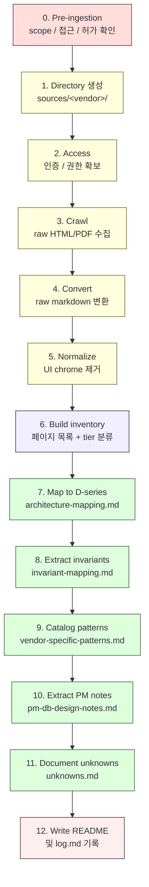
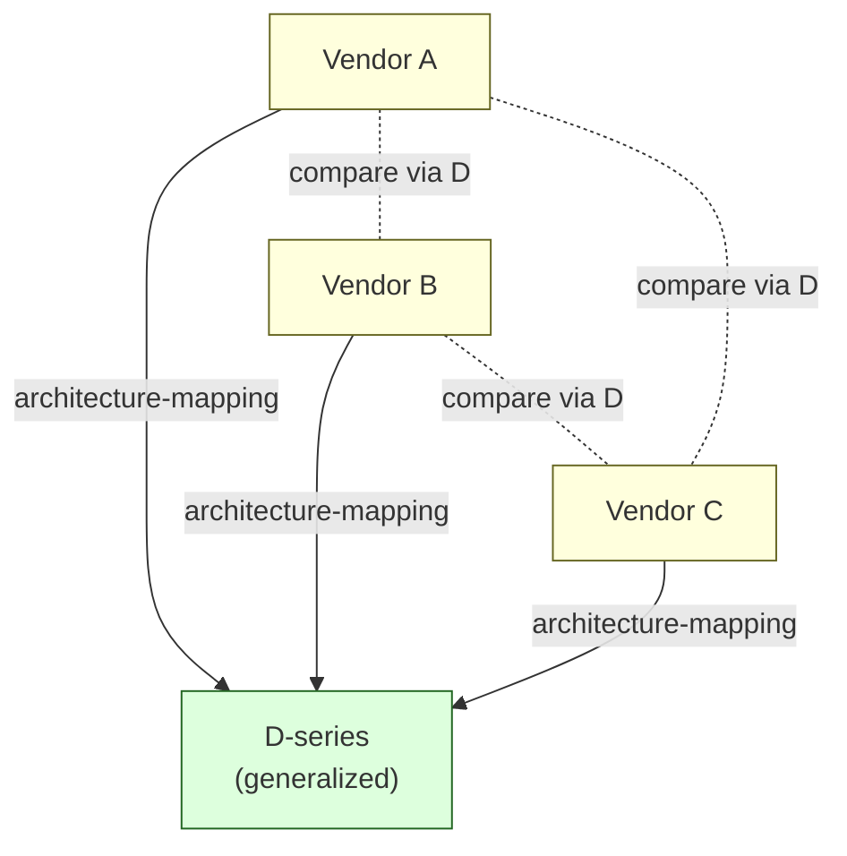

# 5. Source Ingestion
> 새 vendor 자료를 corpus 에 추가하는 절차

이 문서는 **새 vendor 의 docs / PDF / 자료** 를 corpus 에 추가하는 단계별 절차를 설명합니다. 가장 최근 사례인 NodeInfra ingestion (Stage 35) 을 reference 로 합니다.

---

## 1. Source ingestion 의 목적

새 vendor 를 ingestion 하는 이유는 **3 가지** 입니다:

1. **새 vendor 의 architecture 가 우리의 D-series 와 어떻게 매핑되는지** 확인.
2. **vendor-specific 패턴** 이 어떤 것이 있는지 catalog 화.
3. **PM / 아키텍트가 새 시스템을 설계할 때 참고 가능한 design template** 을 추출.

`sources/<vendor>/` 디렉토리는 **vendor catalog 가 아니라 corpus 와 vendor 사이의 매핑 작업장** 입니다.

---

## 2. Source ingestion flow (한눈에)



12 단계입니다. 단계 1-5 는 자동화 가능. 단계 6-11 은 인간 분석. 단계 12 는 마무리.

---

## 3. 단계별 가이드

### Stage 0 — Pre-ingestion 검토

**무엇을 결정하나**:
- 이 vendor 를 ingestion 할 가치가 있는가?
- 접근 권한 (gated docs 의 access code, API key 등) 이 확보되어 있는가?
- ingestion 결과를 공유 / 인용해도 되는 vendor 인가? (license / NDA 확인)

**나가는 결과**: ingestion 시작 여부 결정.

[★ Hypothesis] 모든 vendor 가 ingestion 가치가 있는 것은 아닙니다. **D-series 와 매핑되는 institutional custody 영역** 에 해당하는 vendor 가 우선.

---

### Stage 1 — 디렉토리 생성

표준 구조:

```
sources/<vendor>/
├── raw/
│   ├── html/         # HTML 캡처
│   ├── markdown/     # 자동 변환 markdown
│   └── assets/       # 이미지, diagram, PDF
├── normalized/
│   ├── docs/         # 정제된 markdown
│   └── diagrams/     # 추출된 diagram
├── source-notes/     # 매핑 노트 (가장 가치 있는 산출물)
│   ├── inventory.md
│   ├── architecture-mapping.md
│   ├── invariant-mapping.md
│   ├── vendor-specific-patterns.md
│   ├── pm-db-design-notes.md
│   └── unknowns.md
└── README.md
```

명령:
```bash
mkdir -p sources/<vendor>/{raw/{html,markdown,assets},normalized/{docs,diagrams},source-notes}
```

---

### Stage 2 — Access 확보

대부분의 vendor docs 는 다음 중 하나의 access 방식:

| 방식 | 예시 |
|------|------|
| **Open public docs** | `developers.fireblocks.com` 일부 |
| **Email signup** | Fireblocks support docs |
| **Account login** | Cobo, Safeheron |
| **Mintlify password gate** | NodeInfra (`docs.nodeinfra.com`) |
| **Vendor relationship** | enterprise-only docs |

NodeInfra 의 경우 (Mintlify password gate):

```bash
curl -s -i -L -c cookies.txt -X POST \
  -H "Content-Type: application/json" \
  -d '{"password":"<access-code>"}' \
  "https://docs.<vendor>.com/login/callback/password"
```

발급된 cookie jar 로 후속 모든 요청 인증.

**원칙**:
- access code / API key 는 **절대 repo 에 commit 하지 않는다**.
- cookie / 토큰은 임시 디렉토리 (`/tmp/`) 또는 secrets manager.
- ingestion 절차는 README 에 기록하되, secret 값은 placeholder.

---

### Stage 3 — Crawl

vendor docs 사이트의 구조를 파악한 뒤 재귀 crawler 로 모든 page 수집.

표준 crawler 패턴 (`scripts/crawl.sh` 또는 ad-hoc):

```bash
#!/bin/bash
COOKIES=cookies.txt
BASE="https://docs.<vendor>.com"
SEEN=seen.txt
QUEUE=queue.txt

# Initial seeds
echo "/" > "$QUEUE"

while [ -s "$QUEUE" ]; do
  path=$(head -1 "$QUEUE")
  tail -n +2 "$QUEUE" > "$QUEUE.tmp" && mv "$QUEUE.tmp" "$QUEUE"

  grep -qxF "$path" "$SEEN" && continue
  echo "$path" >> "$SEEN"

  fn=$(echo "$path" | sed 's|^/||;s|/|__|g')
  [ -z "$fn" ] && fn="ROOT"

  curl -s -b "$COOKIES" "$BASE$path" -o "raw/html/$fn.html"

  # Extract new hrefs
  grep -oE 'href="/[^"]+"' "raw/html/$fn.html" | \
    sed 's|href="||;s|"$||' | \
    grep -vE '^/mintlify-assets|\.(png|jpg|css|js)$' | \
    sort -u | while read p; do
      grep -qxF "$p" "$SEEN" || grep -qxF "$p" "$QUEUE" || echo "$p" >> "$QUEUE"
    done
done
```

**원칙**:
- vendor 의 robots.txt 와 ToS 를 존중.
- bot rate limit 을 의식 (보통 분당 ~60 requests 이하).
- 발견된 page 수와 sitemap 의 정합성 검토.

---

### Stage 4 — Convert (HTML → markdown)

자동 변환 도구 (`scripts/html2md.py`):

```python
from bs4 import BeautifulSoup
from pathlib import Path

def convert_file(html_path: Path) -> str:
    html = html_path.read_text()
    soup = BeautifulSoup(html, "html.parser")

    title = soup.find("h1", id="page-title")
    main = soup.find("article") or soup.find("main") or soup.body

    body = el_to_md(main)  # 재귀 변환
    return frontmatter + title + body
```

NodeInfra 의 경우 `/tmp/nodeinfra-crawl/html2md.py` (BeautifulSoup 기반) 를 사용했습니다.

**원칙**:
- frontmatter (HTML comment) 에 source_url, 다운로드 일자, 접근 방식 기록.
- 표 (table) / 코드블록 / 헤딩 / 리스트는 정확히 보존.
- 알 수 없는 element 는 skip (fail-safe).

---

### Stage 5 — Normalize (UI chrome 제거)

수집한 raw markdown 에서 다음을 제거:

| 제거 대상 | 예 |
|----------|-----|
| Navigation chrome | "Skip to main content", "Search...", "⌘ K" |
| Marketing footer | "Powered by Mintlify" |
| Search UI | "Ask AI", "⌘ I" |
| Renderer 특수 마커 | `$/$`, `$!/$` (Mintlify) |
| Empty 리스트 항목 | `- $` 형태 |
| Auto-inserted callouts | "Documentation Index" 등 |

normalizer 도구 (`scripts/normalize.py`):

```python
CHROME_PATTERNS = [
    re.compile(r"\$/\$"),
    re.compile(r"\$!/\$"),
    re.compile(r"\[Skip to main content\]\([^)]*\)"),
    re.compile(r"Search\.{3}⌘ K"),
    re.compile(r"\[Powered by[^]]*Mintlify[^]]*\]"),
    # ...
]

def normalize_md(text: str) -> str:
    out = text.replace("​", "")  # zero-width
    for pat in CHROME_PATTERNS:
        out = pat.sub("", out)
    out = re.sub(r"\n{3,}", "\n\n", out)
    return out.strip() + "\n"
```

**원칙**:
- raw 와 normalized 는 **별도 폴더**. raw 는 절대 수정 안 함.
- frontmatter 는 보존.
- normalize 의 변경량 (bytes diff) 을 log 에 남기면 좋음.

---

### Stage 6 — Inventory 생성

`source-notes/inventory.md` 의 표준 구조:

```markdown
# <vendor> Docs — Inventory

> Collection date: YYYY-MM-DD
> Source: <how accessed>
> Status: N pages captured (X T-DIRECT + Y T-INDEX + Z T-404)

## 1. Product identity (from collected content)

[Source Fact]
- Product name: ...
- Positioning: ...
- Deployment: ...
- Chain scope: ...

## 2. Tier legend

| Tier | Meaning |
|------|---------|
| T-DIRECT | 직접 fetch 한 page |
| T-INDEX | search index 로만 알려진 page |
| T-404 | 존재하지 않는 path |

## 3. Section topology

(전체 디렉토리 / 페이지 트리)

## 4. Page inventory

(섹션별 페이지 표, local file path 포함)

## 5. Collection statistics

## 6. Runner topic coverage check

(runner 가 listed 한 topic class 별 coverage)

## 7. External references found in docs

## 8. Update protocol
```

이 inventory 는 **첫 페이지에서 vendor 의 전체 scope 를 한 눈에 보여주는** 역할입니다.

NodeInfra 예시: [`sources/nodeinfra/source-notes/inventory.md`](../sources/nodeinfra/source-notes/inventory.md).

---

### Stage 7 — Architecture mapping (D-series 와 매핑)

`source-notes/architecture-mapping.md` 의 표준 구조:

```markdown
# <vendor> → Generalized Custody Architecture Corpus — Mapping

## 0. Mapping principle

3 가지 class:
- EXPLICIT: vendor docs 가 직접 명시
- EMBEDDED: 다른 섹션 안에 녹아 있음
- SILENT: vendor docs 가 다루지 않음

## 1. Whole-corpus mapping summary

| D# | D-series doc | <vendor> coverage | Class |
|----|--------------|-------------------|------|
| D1a | Vault/Wallet/Ledger | ... | EXPLICIT / EMBEDDED / SILENT |
| D1b | ... | ... | ... |
| ...

## 2. Detailed mappings — EXPLICIT

### 2.1 D2 ↔ <vendor> signing

[Source Fact] ...
[Generalized Mapping] ...
[★ Hypothesis] ...

(continues...)

## 3. Detailed mappings — EMBEDDED

## 4. Detailed mappings — SILENT (notable gaps)

## 5. Cross-cluster bridge observations

## 6. Vendor-specific deviations from D-series framing
```

**원칙**:
- 33 D-doc 전체에 대해 mapping class 부여 (EXPLICIT / EMBEDDED / SILENT).
- EXPLICIT 매핑은 자세히, SILENT 는 짧게 (왜 silent 한지 ★ Hypothesis).
- vendor 의 cross-cluster bridge 가 corpus 의 C3 dependency graph 와 어떻게 일치 / 불일치하는지.

---

### Stage 8 — Invariant mapping (≠ 명제 추출)

`source-notes/invariant-mapping.md` 의 구조:

```markdown
# <vendor> → Generalized Invariant Mapping

## 1. <vendor> 의 explicitly-stated invariants

### 1.1 Multisig structural

[Source Fact] A ≠ B
→ Maps to D2's "Signing ≠ Approval" invariant.

[Source Fact] C ≠ D
→ Maps to D14's tenant-boundary cross-verification invariant.

(continues...)

## 2. Structurally implied invariants ★

(★ Hypothesis 로 추론된 ≠ 명제)

## 3. Invariants where <vendor> differs from generalized framing

(vendor 가 D-series 의 default 와 다른 선택을 한 경우)

## 4. Invariants the generalized corpus has but <vendor> does not address

(silent 한 invariant 와 이유)

## 5. Invariant-mapping summary
```

**목표**: 이 vendor 에서 **≥10 개 이상의 ≠ propositions 를 추출** 하는 것이 최소 bar.

NodeInfra 의 경우 27 개 explicit + 16 개 structural = 43 개 ≠ propositions 가 추출됐습니다.

---

### Stage 9 — Vendor-specific patterns

`source-notes/vendor-specific-patterns.md` 의 구조:

```markdown
# <vendor> — Vendor-Specific Patterns

## 1. Topology / Deployment

### P1.1 — <pattern name>
What: ...
Where: <doc source>
Why (★): ...
PM implication: ...

## 2. Cryptographic choices

### P2.1 — <pattern name>
(같은 형식)

## 3-9. (other categories)

## 10. Patterns extractable as design templates

### Template T1 — <name>
(PM 이 다른 system 을 design 할 때 reusable 한 template)
```

**원칙**:
- 패턴은 **structural choice** 에 해당해야 함 (단순 implementation 디테일이 아님).
- 각 패턴마다 **PM implication** 명시 — 다른 시스템 design 시 무엇을 결정해야 하는지.

---

### Stage 10 — PM / DB design notes

`source-notes/pm-db-design-notes.md` 의 구조:

```markdown
# <vendor> — PM / DB Design Notes

## 1. Database split

| DB | Purpose | Mutability profile |
|----|---------|-------------------|
| ...

## 2. What to store / never store

### NEVER STORE
### STORE BUT APPEND-ONLY
### STORE WITH SET-ONCE COLUMNS
### STORE MUTABLE WITH CHANGE LOG
### RUNTIME-ONLY (NOT PERSISTED)

## 3. Required aggregates / read models

## 4. Hash chain design

## 5. Policy rule schemas

## 6. State machines

## 7. Tenant model

## 8. SDK interface

## 9. Operational burden — what the customer must run

## 10. What <vendor> is silent on (PM gaps)

## 11. PM checklist (extractable design template)
```

이 파일은 **PM 이 비슷한 시스템을 design 할 때 그대로 참고 가능한** 형태로 정리됩니다.

---

### Stage 11 — Unknowns (해소되지 않은 것)

`source-notes/unknowns.md` 의 구조:

```markdown
# <vendor> Docs — Unknowns and ★ Inferences

## 1. Resolved during ingestion (moved to other notes)

(이전 단계에서 resolved 된 것의 back-pointer)

## 2. Remaining hard unknowns

(vendor docs 가 다루지 않는 것)

## 3. ★ Inferences with explicit hypothesis register

(라벨링된 hypothesis 표)

## 4. Anticipated unknowns (likely in internal docs)

## 5. Multi-language / scope expansion unknowns

## 6. Methodology unknowns

## 7. Methodology limitations
```

**원칙**:
- ★ Hypothesis 는 **id** 를 부여 (HX-01, HX-02 ...) — 추적 가능하게.
- unknown 은 **숨기는 것이 아니라 자랑하는** 자료. 모르는 것을 모른다고 적은 corpus 가 honest 한 corpus.

---

### Stage 12 — README + log.md 기록

`sources/<vendor>/README.md` 에 ingestion 의 전반적 outcome 을 한 페이지로 정리:

- Ingestion 결과 (수집된 페이지 수, 변환 결과)
- Product identity (vendor 가 무엇을 하는가)
- Architecture summary (3-5 줄)
- Source-notes files 의 안내
- Re-ingestion procedure

그리고 `log.md` 에 stage 항목 추가:

```markdown
## Stage NN — <vendor> ingestion

Date: YYYY-MM-DD
...

### 영향 받은 파일

| 파일 | 변경 |
|---|---|
| sources/<vendor>/raw/html/* | 신규 N개 |
| sources/<vendor>/source-notes/*.md | 신규 6개 |
| log.md | append 본 항목 |

신규 entity / hub 생성 0건 (entity-min discipline maintained).
```

---

## 4. Source ingestion checklist (실무용)

새 vendor 를 ingestion 할 때 다음 체크리스트를 따르세요:

- [ ] **Stage 0**: ingestion 가치 검토 + 접근 권한 확보
- [ ] **Stage 1**: `sources/<vendor>/` 디렉토리 생성 (표준 구조)
- [ ] **Stage 2**: 인증 방식 파악 + access 확보 (secrets 은 commit 금지)
- [ ] **Stage 3**: 재귀 crawl 로 모든 page 수집 → `raw/html/`
- [ ] **Stage 4**: HTML → markdown 자동 변환 → `raw/markdown/`
- [ ] **Stage 5**: UI chrome 제거 → `normalized/docs/`
- [ ] **Stage 6**: `inventory.md` 작성 (페이지 목록 + tier 분류)
- [ ] **Stage 7**: `architecture-mapping.md` 작성 (33 D-doc 매핑)
- [ ] **Stage 8**: `invariant-mapping.md` 작성 (≥10 개 ≠ propositions)
- [ ] **Stage 9**: `vendor-specific-patterns.md` 작성
- [ ] **Stage 10**: `pm-db-design-notes.md` 작성
- [ ] **Stage 11**: `unknowns.md` 작성 (★ Hypothesis register)
- [ ] **Stage 12**: `README.md` + `log.md` 기록

전체 1 vendor ingestion 은 약 **6-12 시간** 정도 소요 (vendor 자료의 양에 따라). 자동화 (Stage 3-5) 는 30 분 ~ 2 시간, 분석 (Stage 6-11) 은 4-10 시간.

---

## 5. Source ingestion 의 anti-patterns

이런 행동은 ingestion 의 가치를 무너뜨립니다:

| 행동 | 왜 안 좋은가 |
|------|-------------|
| raw 자료를 직접 수정 | 원본 보존 불가 |
| source-notes 에 vendor marketing 인용 | corpus 가 vendor 광고화 |
| [Source Fact] / [Generalized Mapping] 라벨 생략 | reader 가 신뢰 수준 판단 불가 |
| invariant 추출 없이 자료만 dump | matchup 가치 없는 dead archive |
| D-series 와 매핑 안 함 | corpus 통합 불가 |
| ★ Hypothesis 없이 generalize | false certainty |
| "이 vendor 가 best 다" 식 비교 | vendor catalog 화 |
| internal docs (GitHub 등) 의 자료를 외부로 유출 | NDA 위반 |

자세한 anti-pattern 은 [08-anti-patterns.md](08-anti-patterns.md) 참고.

---

## 6. Re-ingestion (vendor docs 가 바뀌면)

vendor 의 docs 는 시간이 지나면 바뀝니다. re-ingestion 절차:

1. Auth cookie / access refresh
2. Stage 3 (crawl) 재실행
3. raw/ 내용 비교 — 어떤 page 가 추가/수정/삭제되었는지
4. 변경된 page 들의 normalized/ 재생성
5. source-notes 업데이트 (R7 원칙 — 이전 worldview 는 `_archived/` 에 보존)
6. log.md 에 re-ingestion stage 추가

**원칙**:
- vendor docs 의 silent 변경을 발견할 수 있어야 함 (diff 비교).
- 이전 ingestion 의 source-notes 는 **수정이 아니라 amendment** 로 갱신.
- 큰 변경은 R5 governance 검토 (특히 invariant 의 변경).

---

## 7. Multi-vendor 비교 (장기 목표)

여러 vendor 가 ingestion 되면, **vendor 간 architecture 비교** 가 가능해집니다.



**원칙**:
- vendor 끼리 직접 비교가 아니라 **각 vendor 를 D-series 에 매핑한 후 D-series 를 통해 비교**.
- "더 좋다 / 나쁘다" 가 아닌 **structural correspondence 의 차이** 로 비교.
- 비교 결과는 별도 doc (`comparisons/<vendor-a>-vs-<vendor-b>.md`) 으로 정리 가능.

[★ Hypothesis] 현재 corpus 는 Fireblocks + NodeInfra 2 vendor. 3+ vendor 가 ingestion 되면 multi-vendor 비교 doc 추가가 의미 있어질 것.

---

## 8. 자주 묻는 질문

### Q. 단일 vendor 만 ingestion 해도 의미가 있나?
A. 있습니다. 단일 vendor 의 ingestion 만으로도 **그 vendor 의 architecture 가 D-series 어디에 매핑되는지** 를 명확히 알 수 있습니다. 다만 multi-vendor 비교는 못합니다.

### Q. vendor docs 가 부실하면?
A. 그 사실 자체를 `unknowns.md` 에 기록하세요. ingestion 의 가치는 **사실 + ★ Hypothesis + unknowns** 를 모두 정직하게 담는 데 있습니다.

### Q. internal docs (GitHub 등) 를 어떻게 다루나?
A. 가능하면 **참조만** 하세요. NDA 또는 license 위반 위험이 있으면 외부 corpus 에 옮기지 마세요. 참조 URL 만 기록.

### Q. AI 가 자동 ingestion 을 해줘도 되나?
A. **자동 자료 수집 + 자동 정제 + 자동 inventory 까지는 가능** (Stage 1-6). **하지만 architecture mapping (Stage 7) 부터는 사람의 판단이 필요** — AI 는 draft 까지만 (R9 §10 참고).

---

## 다음 읽을 글

- 새 reasoning (D-doc) 추가 기준 → [06-adding-reasoning.md](06-adding-reasoning.md)
- 실제 NodeInfra 사례 → [10-walkthrough-nodeinfra.md](10-walkthrough-nodeinfra.md)
- anti-patterns 회피 → [08-anti-patterns.md](08-anti-patterns.md)
