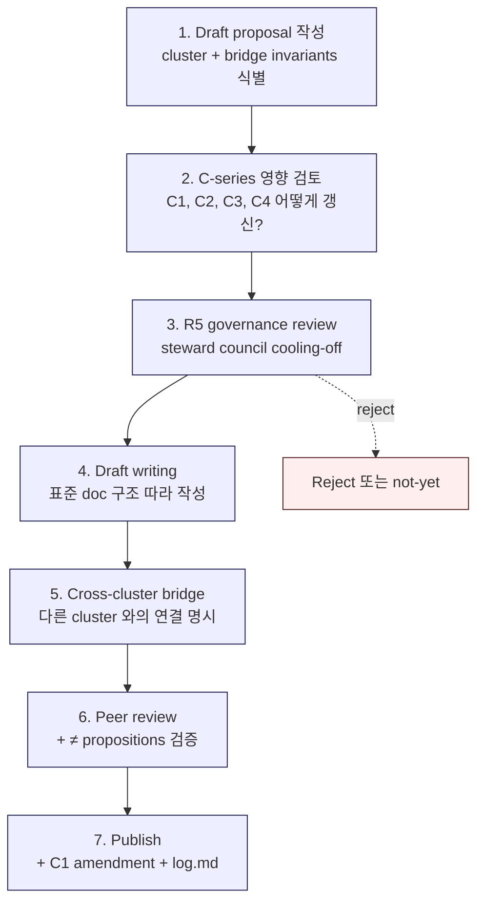

# 6. Adding New Reasoning
> 새 D-doc / 새 cluster 를 추가하는 기준과 절차

이 문서는 **언제** 새 reasoning 을 추가해야 하는지, **어떻게** 추가하는지, **무엇을 거절** 해야 하는지를 설명합니다.

---

## 1. 새 reasoning 추가는 보수적이어야 한다

새 D-doc 을 추가하는 것은 **쉽지 않은 결정** 이어야 합니다. 이유:

- 새 doc 은 **다른 doc 들과 cluster bridge invariant** 를 만들어야 함.
- 새 doc 은 **invariant catalog (C2)** 에 정합성을 유지하며 추가되어야 함.
- 새 doc 은 **장기 stewardship 부담** 을 늘림 (10 년 단위로 유지보수 필요).
- 새 doc 은 다른 doc 의 **prerequisite 관계 (C3 dependency graph)** 를 갱신.

이런 부담 때문에 **새 reasoning 의 default 답은 "not yet"** 입니다.

---

## 2. 새 reasoning 의 필요성 검증 5 문답

새 reasoning 을 쓰고 싶을 때, 다음 5 가지 질문을 자기 자신에게 던지세요:

### Q1. 기존 D-doc 의 invariant 로 표현 가능한가?

대부분의 새로 보이는 패턴은 **기존 invariant 의 instantiation** 입니다.

예:
- "이 vendor 의 새 approval mode" → D3 의 11-state state machine 으로 표현 가능
- "이 vendor 의 cross-chain bridge" → D9 의 multi-chain adapter pattern 으로 표현 가능
- "이 vendor 의 staking 모듈" → D10 또는 D17 의 treasury 패턴으로 표현 가능

**기존 invariant 로 표현 가능하면 → 새 doc 추가 X**. 기존 doc 의 amendment 또는 vendor-specific-patterns.md 에만 기록.

### Q2. truly new domain 인가?

"새 도메인" 의 기준:

| 기준 | True / False |
|------|-------------|
| 현재 cluster 6 개 (Foundation / Specialization / Trust / Liquidity / Crisis / Frontier) 의 어디에도 자연스럽게 들어가지 않는다 | True 면 새 reasoning 가능 |
| 기존 invariant 와 충돌하는 새 invariant 가 필요하다 | True 면 contradiction governance (R3) 부터 |
| 새로운 적대자 / 새로운 trust boundary / 새로운 stakeholder 가 등장한다 | True 면 검토 가능 |
| 단순히 vendor 가 새로 만든 feature 다 | False — vendor-specific-patterns 으로 충분 |

**3 번째 항목이 진짜 트리거**. 새로운 stakeholder 또는 trust boundary 의 등장이 새 doc 의 진짜 motivation 입니다.

### Q3. vendor-specific 인가, generalized pattern 인가?

**vendor-specific 의 정의**: 한 vendor 에서만 등장하고, 다른 vendor 에서 같은 invariant 가 안 나옴.
**generalized 의 정의**: 여러 vendor (또는 industry standard / regulatory body) 에서 같은 패턴이 등장.

| 등장 횟수 | 처리 |
|----------|-----|
| 1 vendor 에서만 | `sources/<vendor>/source-notes/vendor-specific-patterns.md` |
| 2-3 vendor 에서 | 기존 D-doc 의 amendment 또는 새 ≠ proposition 추가 |
| 4+ vendor 또는 regulatory standard | 새 D-doc 검토 시작 |

### Q4. survivability implication 이 있는가?

새 reasoning 이 **survivability 에 영향** 을 주는가:

- 새로운 failure mode 를 catalog 하는가?
- 새로운 recovery path 를 enable 하는가?
- 새로운 cross-domain dependency 를 만드는가?
- 새로운 trust boundary 를 정의하는가?

**survivability implication 이 있다면 → 검토 진행**. 단순 efficiency / convenience 패턴은 정당화 부족.

### Q5. 5 년 뒤에도 의미가 있을 것인가?

★ Hypothesis test:
- 이 reasoning 이 **다음 5 년의 frontier shift (CBDC, AI governance, quantum, intent-based)** 후에도 살아남을 가능성이 있는가?
- 이 reasoning 이 **다음 5 년의 regulatory shift** 후에도 살아남을 가능성이 있는가?

이 질문에 "yes" 가 아니면 **frontier cluster (D27-D32) 에 ★ heavy 로 추가** 또는 **추가 거부**.

---

## 3. 5 문답을 통과한 경우 — 추가 절차

5 문답에서 모두 (또는 충분히 강하게) "yes" 가 나왔다면 다음 절차:



### Step 1 — Draft proposal

다음을 한 페이지로 정리:

```markdown
# Doc proposal: D<N> <name>

## Cluster assignment
어느 cluster 인지, 왜.

## Bridge invariants
어느 cluster 와 bridge invariant 가 형성되는지 (양방향).

## Motivation
5 문답의 답 (특히 Q4 survivability, Q5 5-year horizon).

## Expected ≠ propositions
초안 단계의 5+ ≠ propositions.

## Impact assessment
C1, C2, C3, C4 갱신 필요 여부.
```

### Step 2 — C-series 영향 검토

새 D-doc 을 추가하면 다음 C-doc 들이 amend 됩니다:

| C-doc | 어떤 갱신 |
|-------|----------|
| C1 (master index) | 새 doc 등재, cluster 표 갱신 |
| C2 (invariant catalog) | 새 ≠ propositions 추가 |
| C3 (dependency graph) | bridge invariant 추가 |
| C4 (anti-pattern catalog) | 새 anti-pattern (만약 있다면) |
| C5 (audience reading paths) | 어느 audience path 에 포함되는가 |
| C6 (open questions) | resolved 된 question 이 있다면 해당 entry 갱신 |

이 6 가지 영향이 **draft proposal 단계에서 명시** 되어야 합니다.

### Step 3 — R5 Governance review

새 D-doc 은 R5 의 **C5 change class** 에 해당 (new doc 추가). 절차:

- Steward council 에 proposal 제출
- Cluster lead 의 리뷰
- Cooling-off period (★ 90 days for new doc)
- Reviewer dissent 기록 (R5 audit trail)
- 최종 decision: accept / amend / reject

**대부분의 new-doc proposal 은 reject 또는 amend 가 default**. accept 는 강한 정당화가 있을 때만.

### Step 4 — Draft writing

새 D-doc 의 표준 구조 (다른 D-doc 과 일치):

```markdown
# D<N> <full title>
> Generalized — <domain> reasoning.
> All generalized reasoning is ★ Hypothesis.

## 0. 핵심 명제 (10초 이해)
(5+ ≠ propositions)

## 1. Core thesis
(한 문단)

## 2. <main content sections>

## N. Operational fragility map
(어떤 failure 가 어디서 일어나는가)

## N+1. Limitations
(★ 명시적 boundaries)

## N+2. 3-way burden comparison
(SaaS / Hosted MPC / Direct-build 비교)

## N+3. Q1-Q10 reasoning
(10 가지 자주 묻는 질문)

## N+4. Open questions / org policy
(아직 답이 없는 것들 — C6 로 등재될 후보)

## N+5. References + Uncertainty Boundary
- 관련 wiki
- Uncertainty Boundary 명시

## (Cluster doc 이면) Bridge invariants
```

### Step 5 — Cross-cluster bridge

새 D-doc 이 어느 cluster 의 어느 doc 와 bridge invariant 를 형성하는지 명시. 예:

```markdown
## Bridge invariants

### Bridge to Foundation cluster
- D2 signing workflow → 본 doc 의 X invariant

### Bridge to Crisis cluster
- D26 custody failure → 본 doc 의 Y invariant
```

bridge invariant 는 **양 cluster 모두에서 명시** 되어야 합니다. C3 dependency graph 도 갱신.

### Step 6 — Peer review

review 의 핵심 체크리스트:

- [ ] 5+ ≠ propositions 가 명시되었는가?
- [ ] 모든 generalized claim 에 `★ Hypothesis` marker?
- [ ] Operational fragility map 이 있는가?
- [ ] Limitations 가 honest 한가?
- [ ] 3-way burden comparison 이 있는가?
- [ ] Q1-Q10 가 자기 응답이 아닌 실제 질문에 대응하는가?
- [ ] References + Uncertainty Boundary 가 있는가?
- [ ] Bridge invariants 가 양방향인가?

### Step 7 — Publish

publish 시 동반 작업:

- `docs/architecture/<doc-name>.md` 생성
- `docs/architecture/c1-master-corpus-index.md` amendment 추가 (R7 원칙 — 이전 §0-§N preserve, 새 §N+1 amendment)
- `docs/architecture/c2-invariant-catalog.md` 갱신 (새 ≠ propositions 추가)
- `docs/architecture/c3-dependency-graph.md` 갱신 (bridge invariant 추가)
- `log.md` 에 stage 항목 추가

---

## 4. 새 cluster 추가는 더 엄격하다

새 cluster (6 개 → 7 개) 의 추가는 **R5 의 C6 change class** (restructure) 에 해당하며, charter review 가 필요합니다 (★ 1 년 cooling-off).

cluster 추가의 정당화는:
- 기존 cluster 어디에도 자연스럽게 들어가지 않는 새 도메인
- 다수의 새 D-doc 이 함께 추가될 잠재성
- 새 cluster 가 자체적 reading path 를 구성 가능

[★ Hypothesis] 현재까지 cluster 추가 history 없음. 기존 6 cluster 가 institutional custody 의 covered space 를 잘 cover 한다는 보수적 견해 유지.

---

## 5. 기존 doc 의 amendment 는 더 자주 발생한다

새 doc 추가보다 **기존 doc 의 amendment** 가 훨씬 빈번합니다.

Amendment 의 5 종류 (R5 의 change class 기반):

| Class | 예 | Cooling-off |
|-------|-----|-------------|
| C0 (typo) | 오타 / 형식 수정 | 없음 |
| C1 (clarification) | 표현 명확화 / 예시 추가 / cross-reference 추가 | 없음 |
| C2 (amendment) | 새 ≠ proposition 추가 / 섹션 확장 / Mermaid diagram 추가 | 7 days |
| C3 (position revision) | invariant 의 scope 변경 / 분석 갱신 | 30 days |
| C4 (supersession) | doc 의 superseded 선언 + 후속 doc 발행 | 90 days |

대부분의 작업은 C0-C2 입니다. C3-C4 는 **신중한 governance event**.

자세한 governance 절차는 [07-stewardship.md](07-stewardship.md) 참고.

---

## 6. Frontier reasoning 의 특별 규칙

Frontier cluster (D27-D32) 에 추가되는 reasoning 은 다른 cluster 보다 **느슨한 entry 기준 / 엄격한 ★ marker 적용** 을 받습니다.

| 적용 | Frontier | Foundation/Specialization/Trust/Liquidity/Crisis |
|------|---------|-------------------------------------------------|
| Entry 기준 | 도메인이 외부에서 stabilizing 단계 (E4 §3) | 강력한 증거 + multi-vendor 패턴 |
| ★ marker 밀도 | 매우 높음 (sentence 단위) | 핵심 claim 단위 |
| Cooling-off | 90 days (C5) | 90 days |
| Maturity threshold | E4 5-stage ladder 의 Stage 3 (Speculation) | E4 5-stage ladder 의 Stage 5 (Institutionalization) |

Frontier doc 은 **canonical doc 으로 인용되지 않습니다**. 다른 D-doc 의 reasoning 의 prerequisite 가 되지 않습니다. R1 retrieval 은 frontier content 를 non-speculation query 에 surface 하지 않습니다.

---

## 7. 새 ≠ proposition 만 추가하고 싶을 때

새 ≠ proposition 추가는 새 D-doc 추가보다 훨씬 가볍습니다 (R5 의 C2 change class).

절차:
1. 어느 D-doc 의 §0 (핵심 명제) 또는 §2 (≠ propositions) 에 추가
2. C2 invariant catalog 에 등재
3. 다른 doc 에서 충돌하는 ≠ proposition 이 있는지 검토 (R3 contradiction check)
4. peer review (1-2 명)
5. publish + log.md 기록

새 ≠ proposition 의 정당화는 다음:
- 다수의 vendor 또는 source 에서 같은 distinction 이 등장하는가?
- 기존 ≠ proposition 의 sub-case 가 아니라 독립적 invariant 인가?
- 이 distinction 을 놓치면 어떤 사고가 가능한가?

---

## 8. AI 가 draft 한 reasoning 의 처리

R9 (AI-assisted Reasoning Constraints) 에 따라:

- **AI 는 draft 까지만 작성 가능** (Zone B operation).
- **AI 가 draft 한 doc 은 명시적 marker** (frontmatter 에 `proposer: ai-<id>`).
- **검토자의 책임은 사람** — AI 가 reviewer 또는 quorum participant 가 될 수 없음.
- **AI 가 draft 한 새 ≠ proposition 은 ≥2 corpus citations 가 필수** — ungrounded generation 방지.

AI draft 가 거치는 sanity check:
- ≠ proposition 이 실제 distinction 인가? (단순 동의어 swap 이 아닌가?)
- ★ Hypothesis marker 가 올바르게 적용되었는가?
- vendor 의 marketing 톤이 leak 하지 않았는가?
- 기존 doc 과의 cross-reference 가 정확한가?

---

## 9. 새 reasoning 추가의 anti-patterns

| 행동 | 왜 안 좋은가 |
|------|-------------|
| 한 vendor 의 새 feature 를 보고 즉시 D-doc 추가 | vendor-specific 으로 충분 |
| 5 문답 통과 없이 draft 시작 | 정당화 부족 |
| ≠ propositions 없는 doc | reader 의 ambiguity 분리 기능 없음 |
| ★ marker 없는 generalized claim | false certainty |
| Bridge invariants 명시 안 함 | doc 이 isolated 됨 |
| Limitations / Uncertainty Boundary 누락 | over-claim |
| C-series amendment 미반영 | corpus structure 깨짐 |
| Cooling-off 무시 | governance 무시 |
| AI draft 를 사람 review 없이 publish | R9 violation |
| "이번 한 번만 fast-track" 정당화 | precedent 누적 → discipline 붕괴 |

---

## 10. 자주 묻는 질문

### Q. 한 vendor 에서 본 패턴을 D-doc 으로 만들어도 되나?
A. **안 됩니다**. 한 vendor 에서만 등장하면 `sources/<vendor>/source-notes/vendor-specific-patterns.md` 에 기록. 2-3 vendor 에서 등장하면 기존 D-doc amendment. 4+ vendor / regulatory standard 에서 등장하면 새 D-doc 검토.

### Q. Frontier doc 의 reasoning 이 다른 cluster 의 prerequisite 가 될 수 있나?
A. **안 됩니다**. Frontier 는 isolation. Frontier 가 stabilize 되어 Foundation/Specialization 으로 promote 되려면 E4 5-stage institutionalization 절차 + R5 governance review 가 필요.

### Q. 기존 ≠ proposition 이 잘못된 것 같다. 수정해도 되나?
A. **silent 하게는 안 됩니다**. 다음 중 하나:
- C1 (clarification) — 표현이 ambiguous 했을 경우
- C3 (position revision) — invariant 의 scope 가 잘못 잡혔을 경우
- C4 (supersession) — invariant 자체가 obsolete 된 경우

모든 변경은 R5 audit trail + R7 snapshot.

### Q. Vendor 가 자신의 가이드 페이지에 "best practice" 라고 쓴 것을 corpus 에 옮겨도 되나?
A. **그대로는 안 됩니다**. `[Source Fact, vendor X says...]` 라벨로 source-notes 에 기록. 우리의 ≠ proposition 으로 변환하려면 source 와 generalized 의 분리 (Stage 4 of lifecycle).

### Q. 5 문답 다 통과했는데 R5 review 가 reject 했다. 어떻게 하나?
A. **respect**. Steward council 의 reject 는 cluster context + corpus-wide 영향을 본 결과. Reject 이유를 받아서 reject 가 옳았는지 검토 → 6 개월 후 재제출 가능 (R5 governance).

---

## 다음 읽을 글

- governance / stewardship workflow → [07-stewardship.md](07-stewardship.md)
- anti-patterns 회피 → [08-anti-patterns.md](08-anti-patterns.md)
- 실제 사례 → [10-walkthrough-nodeinfra.md](10-walkthrough-nodeinfra.md)
